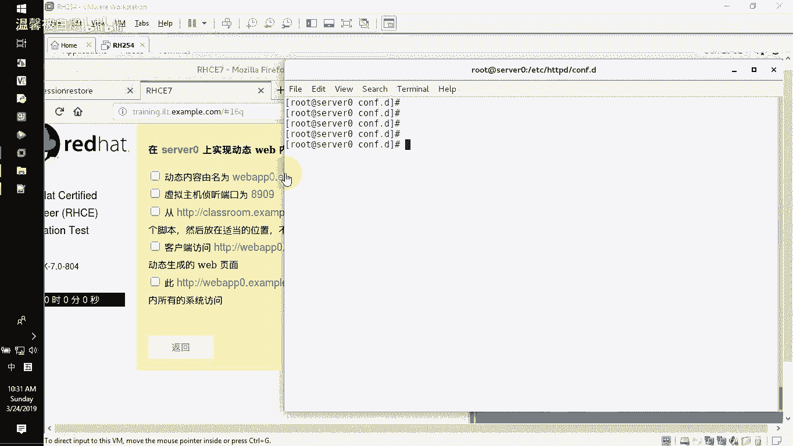
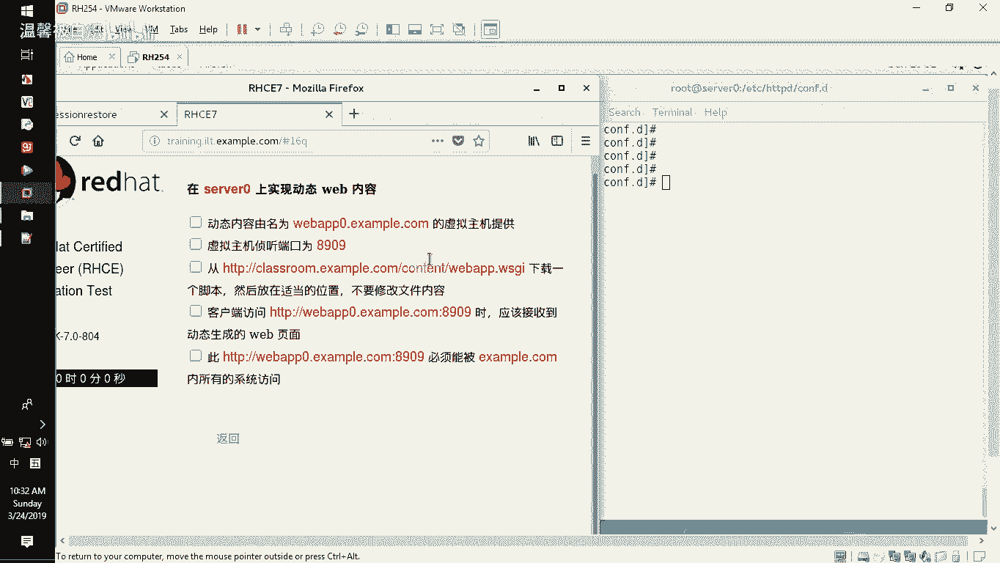
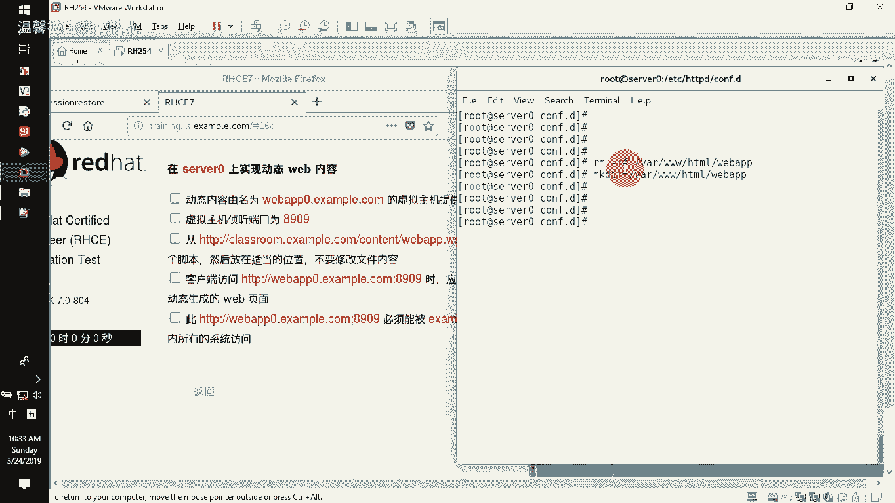
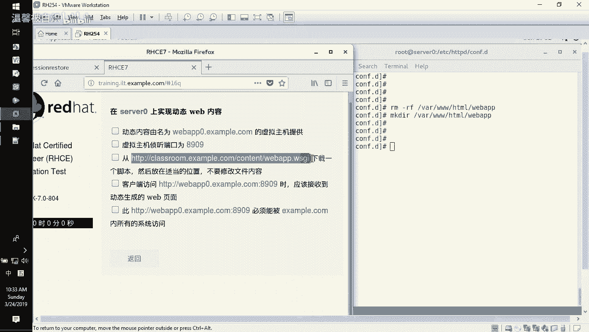
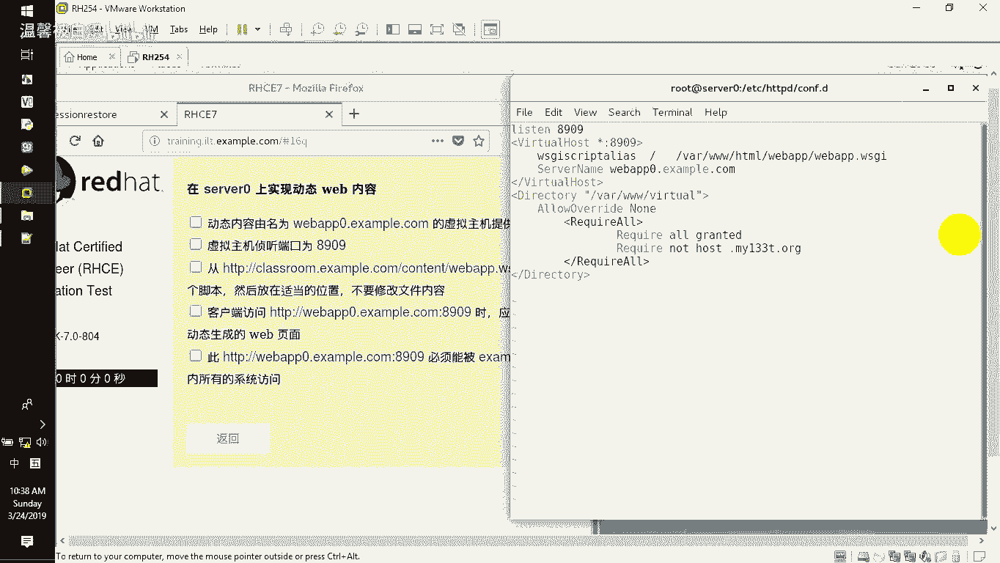
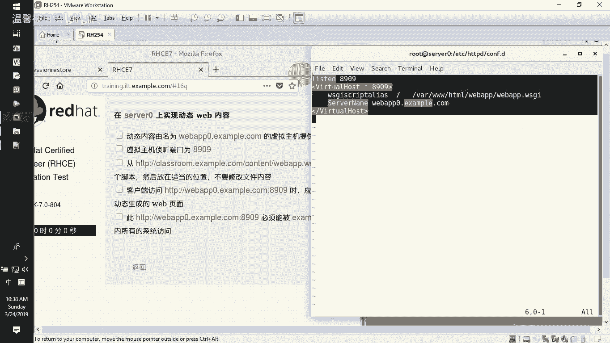
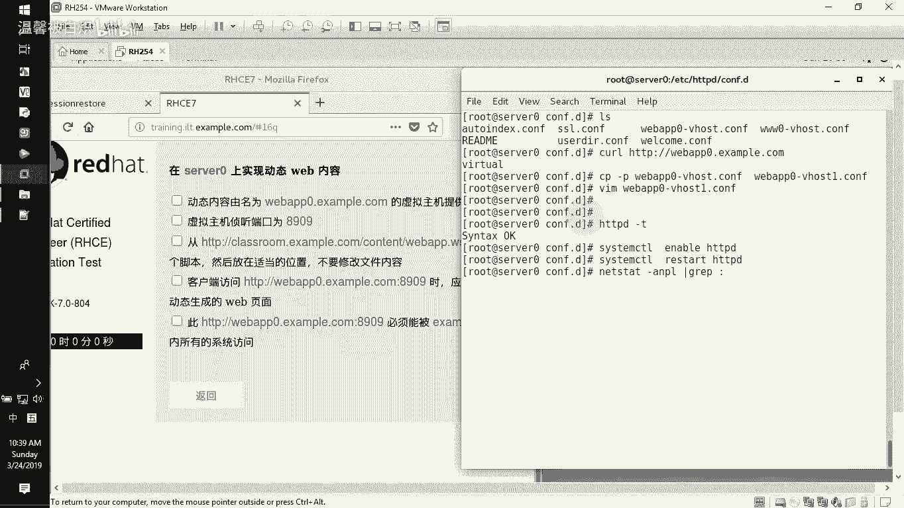
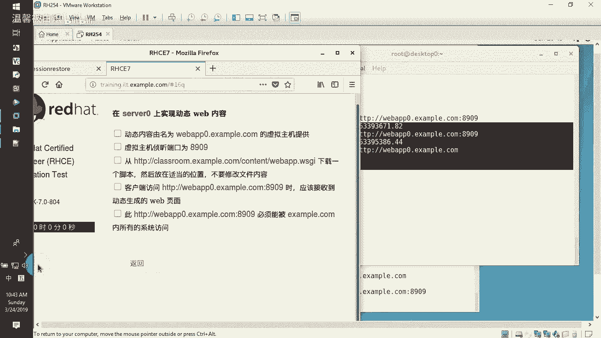

# RHCE 课程：第 12 章：配置 Web 服务器支持 WSGI 动态页面 🚀



在本节课中，我们将学习如何在 Apache Web 服务器上配置 WSGI 模块，以实现动态页面的访问。课程内容涵盖端口开放、配置文件修改以及防火墙规则设置。



---

## 概述



本节教程将指导你完成在 Apache 服务器上配置 WSGI 动态页面的全过程。我们将分步实现：开放指定端口、安装 WSGI 模块、修改虚拟主机配置文件，以及设置防火墙规则以控制特定网段的访问权限。



---

## 创建项目目录与下载 WSGI 脚本

首先，我们需要为动态页面创建一个工作目录。如果目录不存在，请先创建它。

以下是创建目录和下载 WSGI 脚本的步骤：

1.  在 `/var/www/html` 目录下创建名为 `webapp` 的文件夹。
    ```bash
    mkdir /var/www/html/webapp
    ```
2.  进入该目录，并从指定站点下载 WSGI 脚本文件 `webapp.wsgi`。
    ```bash
    cd /var/www/html/webapp
    wget http://example.com/webapp.wsgi
    ```
3.  下载完成后，可以查看脚本内容。该文件是一个用 Python 编写的页面代码，主要功能是显示服务器当前的 Unix 时间戳和日期时间信息。
    ```bash
    cat /var/www/html/webapp/webapp.wsgi
    ```

---

## 开放服务器端口

默认情况下，Apache 可能没有监听我们所需的端口。接下来，我们需要在系统中开放指定的端口。

以下是开放端口的步骤：

1.  首先，检查当前已开放的 HTTP 相关端口。
    ```bash
    semanage port -l | grep http
    ```
2.  如果列表中没有 `8909` 端口，则需要添加它。使用以下命令添加 TCP 协议的 8909 端口。
    ```bash
    semanage port -a -t http_port_t -p tcp 8909
    ```
3.  再次检查端口列表，确认 `8909` 端口已成功添加。
    ```bash
    semanage port -l | grep http
    ```

---

## 安装 WSGI 模块并配置虚拟主机



上一节我们开放了端口，本节中我们来看看如何让 Apache 支持 WSGI 脚本。首先需要安装对应的模块。

以下是安装和配置的步骤：



1.  使用 `yum` 命令安装 `mod_wsgi` 模块。
    ```bash
    yum install -y mod_wsgi
    ```
2.  进入 Apache 的配置文件目录。
    ```bash
    cd /etc/httpd/conf.d
    ```
3.  基于已有的虚拟主机配置文件（例如 `webapp0.conf`），复制一份作为新配置文件。
    ```bash
    cp webapp0.conf webapp1.conf
    ```
4.  编辑新的配置文件 `webapp1.conf`。主要修改包括：
    *   在文件开头添加 `Listen 8909` 指令。
    *   将 `<VirtualHost>` 块内的端口改为 `8909`。
    *   将 `DocumentRoot` 指令替换为 `WSGIScriptAlias` 指令，指向我们下载的 WSGI 脚本文件。
    ```apache
    Listen 8909
    <VirtualHost *:8909>
        ServerName webapp0.example.com
        WSGIScriptAlias / /var/www/html/webapp/webapp.wsgi
        # 注意：此处移除了目录授权相关的配置，访问控制将在防火墙设置
    </VirtualHost>
    ```
5.  检查配置文件语法是否正确。
    ```bash
    apachectl configtest
    ```
6.  重新加载 Apache 服务以使配置生效。
    ```bash
    systemctl reload httpd
    ```

---

## 配置防火墙规则



由于在 Apache 配置中移除了目录授权，我们需要在防火墙层面实现访问控制，即允许特定网段访问，同时拒绝其他网段。

以下是配置防火墙规则的步骤：

1.  首先，永久开放 `8909` 端口。
    ```bash
    firewall-cmd --permanent --add-port=8909/tcp
    ```
2.  添加一条富规则，允许来自 `172.25.0.0/16` 网段的流量访问 `8909` 端口。
    ```bash
    firewall-cmd --permanent --add-rich-rule='rule family="ipv4" source address="172.25.0.0/16" port port="8909" protocol="tcp" accept'
    ```
3.  添加另一条富规则，拒绝来自 `172.24.1.0/24` 网段的流量访问 `8909` 端口。
    ```bash
    firewall-cmd --permanent --add-rich-rule='rule family="ipv4" source address="172.24.1.0/24" port port="8909" protocol="tcp" reject'
    ```
4.  重新加载防火墙配置，使规则立即生效。
    ```bash
    firewall-cmd --reload
    ```
5.  列出所有防火墙规则，确认配置已正确添加。
    ```bash
    firewall-cmd --list-all
    ```

---

## 测试配置

所有配置完成后，需要进行测试以验证功能是否正常。

以下是测试步骤：

1.  **在服务器本地测试**：使用 `curl` 命令访问配置的站点和端口。
    ```bash
    curl http://webapp0.example.com:8909
    ```
    如果配置成功，将返回 WSGI 脚本生成的动态页面内容，包含时间信息。
2.  **在客户端测试**：从属于允许网段（如 `172.25.0.0/16`）的客户端机器进行访问，同样应能成功获取页面。而从被拒绝的网段（如 `172.24.1.0/24`）访问则应被阻断。

---

## 总结



本节课中我们一起学习了在 Apache Web 服务器上实现 WSGI 动态页面的完整流程。我们首先创建了项目目录并准备了 WSGI 脚本，接着在系统中开放了指定端口，然后安装模块并配置了支持 WSGI 的虚拟主机，最后通过防火墙的富规则实现了精细化的网络访问控制。这套组合方案是 RHCE 认证中实现 Web 服务动态内容的关键技能之一。