# RHCE 课程：P13：iSCSI 配置教程 🖥️💾

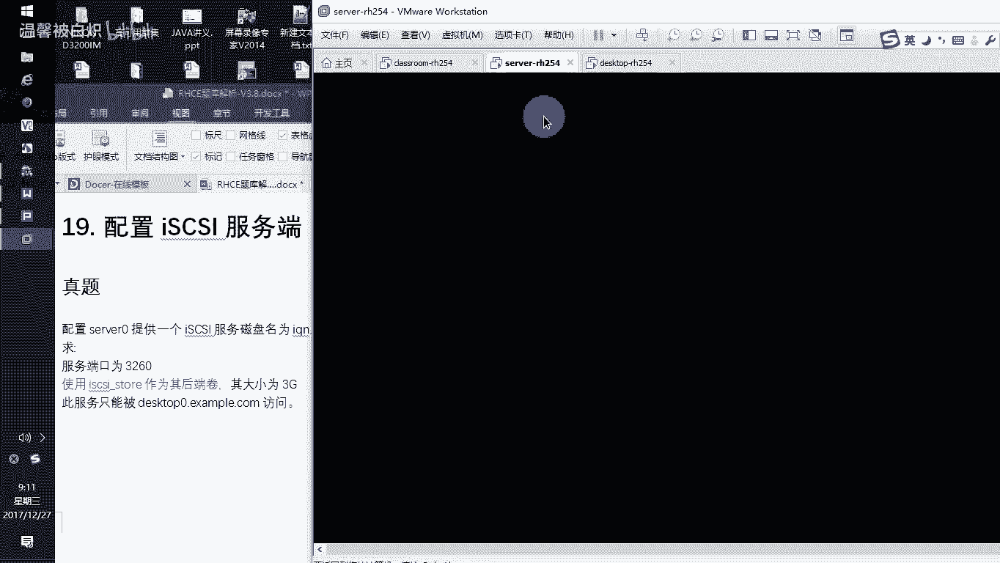

在本节课中，我们将学习如何配置 iSCSI 服务。iSCSI 是一种基于 IP 网络的存储协议，允许客户端（发起端）通过网络访问服务器（目标端）提供的块存储设备。我们将分步完成服务端和客户端的配置，包括创建后端存储、设置访问控制、配置防火墙以及实现客户端的自动挂载。

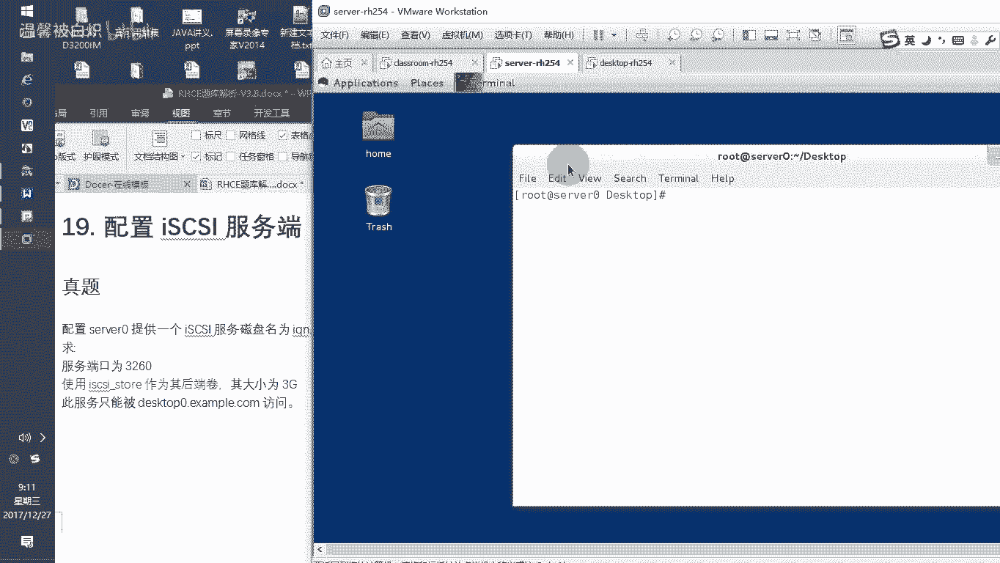

## 服务端配置

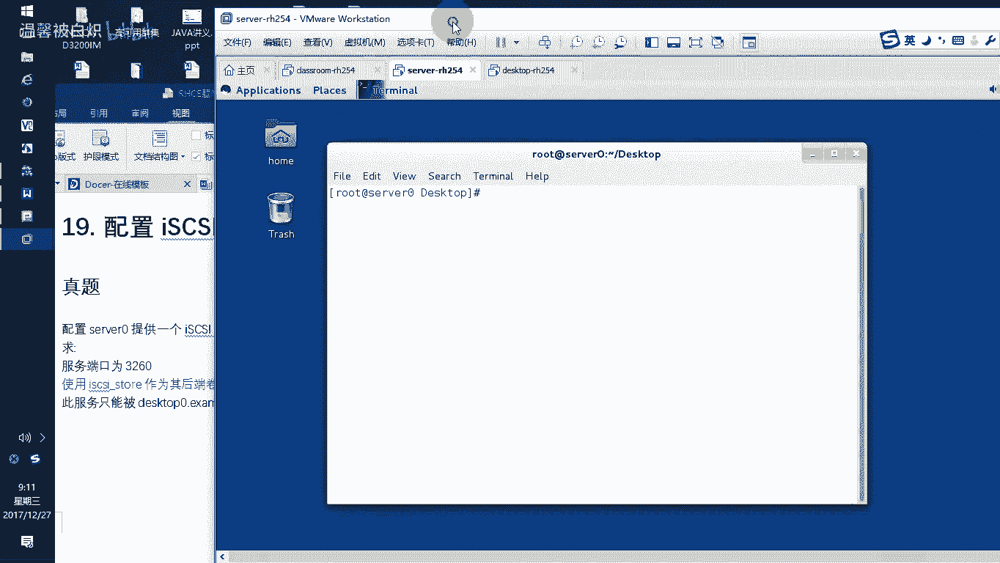

上一节我们介绍了课程概述，本节中我们来看看如何在服务器端配置 iSCSI 目标服务。

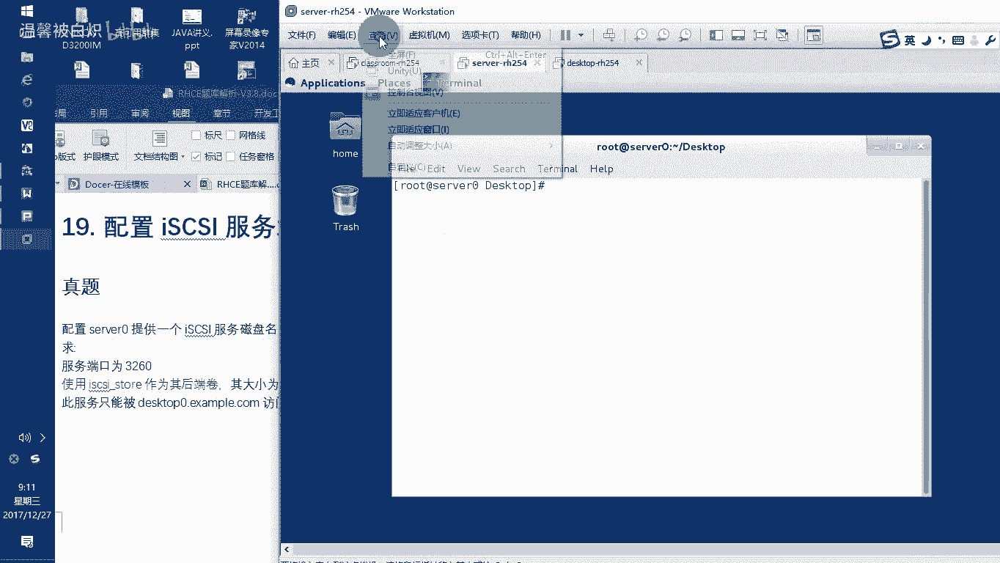

首先，我们需要登录到服务器端，并确保系统环境准备就绪。由于机器是刚恢复的快照，需要加载考试环境。

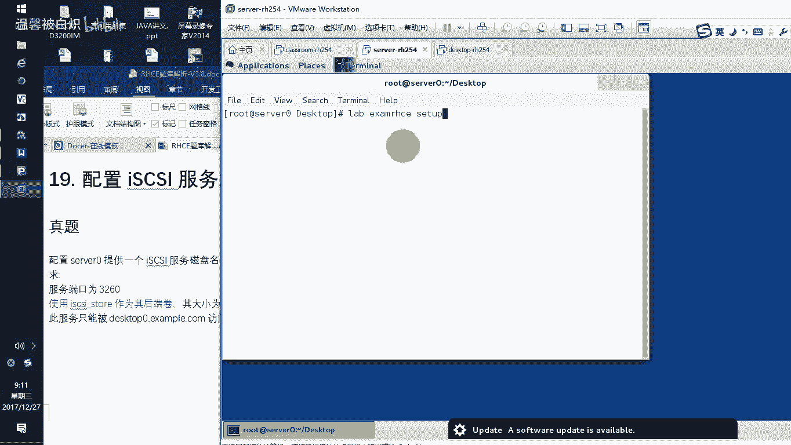


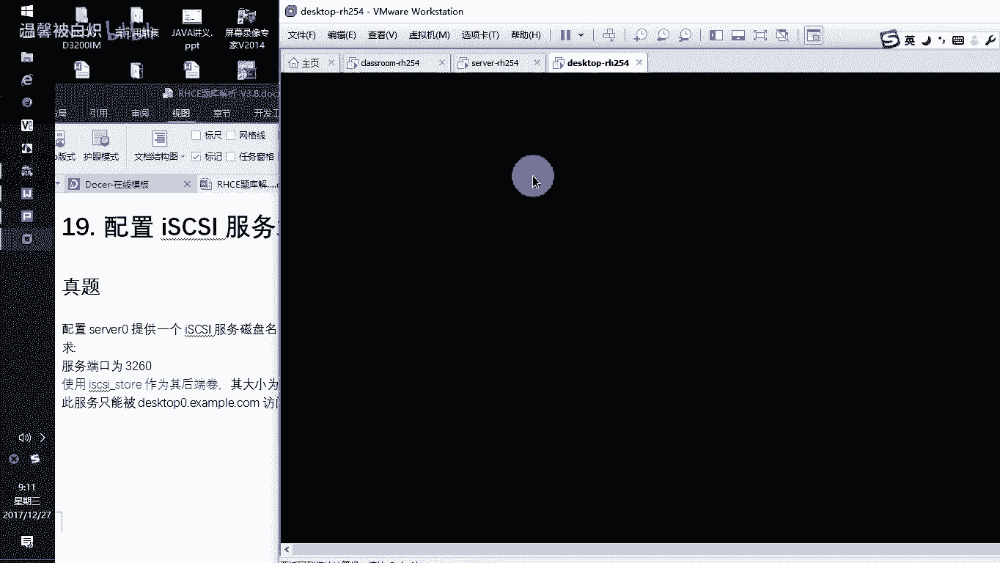

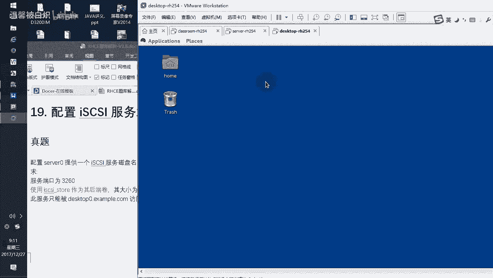

在客户端机器上，同样需要开机并加载对应的考试环境标签。

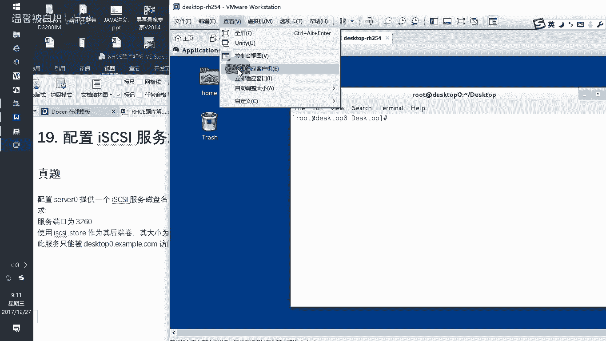


调整好终端窗口大小以便操作。


为服务器设置环境标签：`Exam IHC setup`。


客户端机器也需要进行同样的操作，设置标签为 `Exam IHC setup`。


调整窗口适应大小。


环境准备完成后，就可以开始配置 iSCSI 服务端了。服务端需要提供一个后端存储卷。

### 创建后端存储卷

首先，检查是否有可用的磁盘空间。

```bash
fdisk -l
```

发现 `/dev/sdb` 磁盘是空的。如果考试环境中磁盘不为空，则需要划分一个大于 3GB 的分区。

使用 `fdisk` 对 `/dev/sdb` 进行操作。

```bash
fdisk /dev/sdb
```

在交互界面中，执行以下操作：
1.  输入 `n` 创建新分区。
2.  选择逻辑分区 (`l`)。
3.  设置分区大小为 4096 MB (4GB)。
4.  设置起始扇区。
5.  使用 `t` 命令更改分区类型为 `8e` (Linux LVM)。
6.  输入 `w` 保存并退出。

操作完成后，会创建一个新的逻辑分区 `/dev/sdb5`。

让系统重新探测分区表。

```bash
partprobe
```

接下来，基于这个分区创建 LVM 逻辑卷。

```bash
pvcreate /dev/sdb5
vgcreate vg1 /dev/sdb5
lvcreate -L 3G -n iscsi-storage vg1
```

现在，我们有了一个可用的后端存储设备：`/dev/vg1/iscsi-storage`。

### 安装并配置 iSCSI 目标服务

安装 iSCSI 目标服务所需的软件包。

```bash
yum install -y targetcli
```

安装完成后，启动并启用服务。

```bash
systemctl start target
systemctl enable target
```

检查服务端口 (3260) 是否已监听。

```bash
ss -tnlp | grep 3260
```

此时服务已启动，但尚未提供任何存储设备。

### 使用 `targetcli` 配置 iSCSI 目标

进入 `targetcli` 交互式配置界面。

```bash
targetcli
```

在 `targetcli` 界面中，按以下步骤操作：

1.  **创建块设备**：将物理存储设备映射为一个块设备。
    ```bash
    /backstores/block create iscsi-storage /dev/vg1/iscsi-storage
    ```
    执行 `ls` 命令，可以在 `/backstores/block` 下看到新创建的 `iscsi-storage` 设备。

2.  **创建 iSCSI 目标**：创建一个 iSCSI 目标（即一个可供连接的端点）。
    ```bash
    /iscsi create iqn.2014-11.com.example:server0
    ```
    注意：目标名称需根据考试题目要求修改。

3.  **配置访问控制列表 (ACL)**：指定允许访问此目标的客户端。
    首先进入目标下的 TPG（标签端口组）。
    ```bash
    /iscsi/iqn.2014-11.com.example:server0/tpg1
    ```
    然后创建 ACL，只允许指定的客户端 Initiator Name 连接。
    ```bash
    /iscsi/iqn.2014-11.com.example:server0/tpg1/acls create iqn.2014-11.com.example:desktop0
    ```

4.  **创建 LUN 映射**：将之前创建的块设备映射到该目标。
    ```bash
    /iscsi/iqn.2014-11.com.example:server0/tpg1/luns create /backstores/block/iscsi-storage
    ```

5.  **配置监听端口**：指定在哪个 IP 地址和端口上提供此服务。
    ```bash
    /iscsi/iqn.2014-11.com.example:server0/tpg1/portals create 172.25.0.11 3260
    ```
    注意：IP 地址和端口号之间是**空格**，不是冒号。

配置完成后，可以输入 `ls` 查看完整的配置树，确认所有设置无误。然后输入 `exit` 退出 `targetcli`。

再次检查 3260 端口，现在应该可以看到服务正在监听。

### 配置防火墙

在服务器防火墙上开放 iSCSI 服务端口。

```bash
firewall-cmd --permanent --add-port=3260/tcp
firewall-cmd --reload
```

至此，iSCSI 服务端的配置全部完成。

## 客户端配置

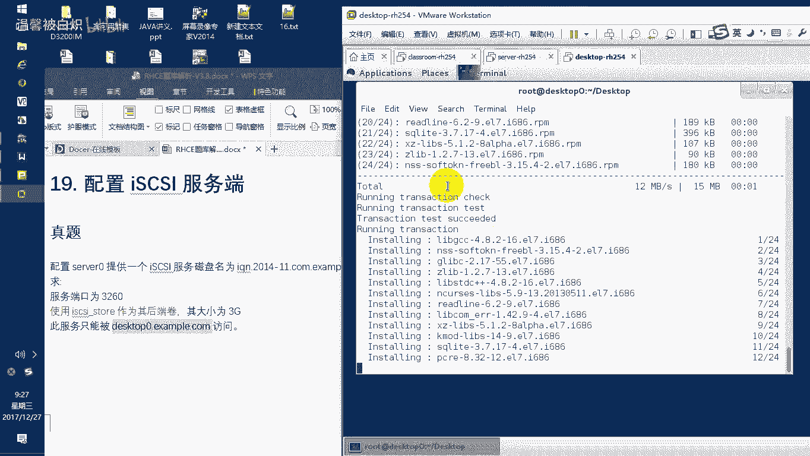

上一节我们完成了服务端的配置，本节中我们来看看如何在客户端连接并使用 iSCSI 存储。

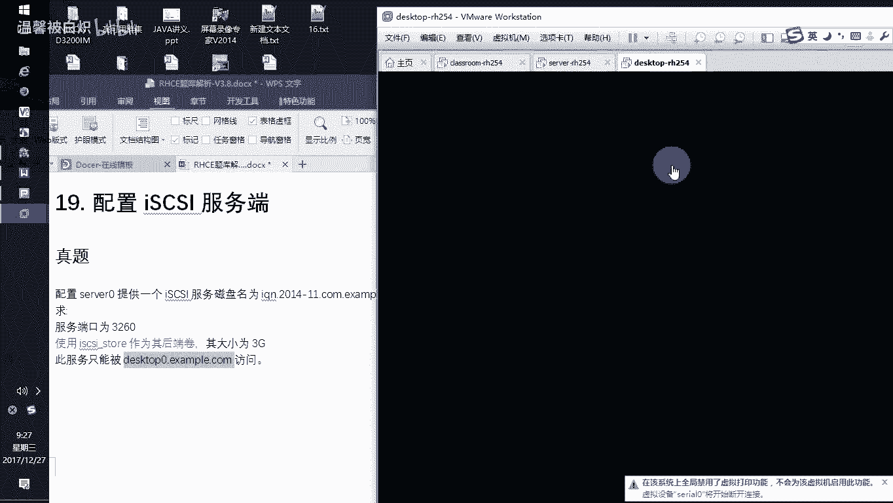

客户端需要连接到服务器，挂载其提供的 iSCSI 目标，并实现自动挂载。首先，确保客户端已加载正确的考试环境。

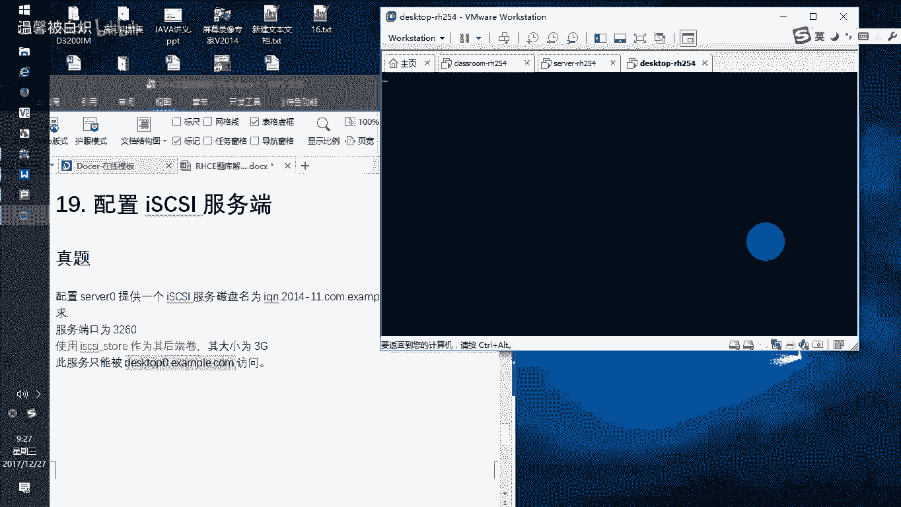

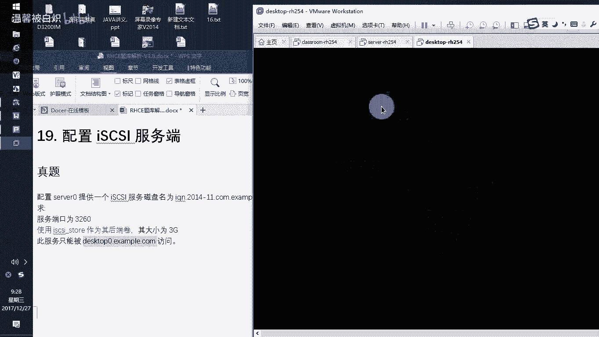

### 安装客户端软件并修改 Initiator 名称

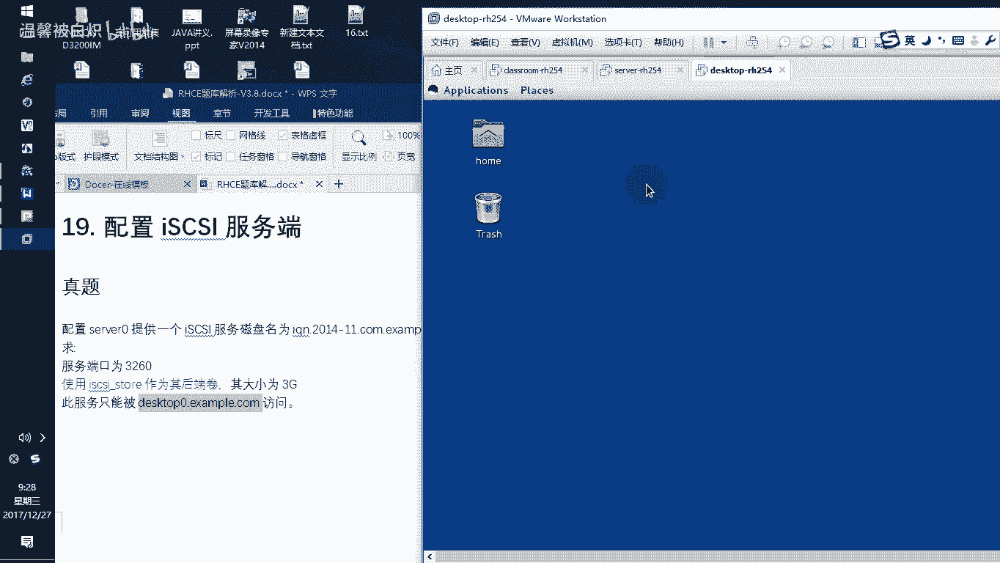

安装 iSCSI 发起端软件包。

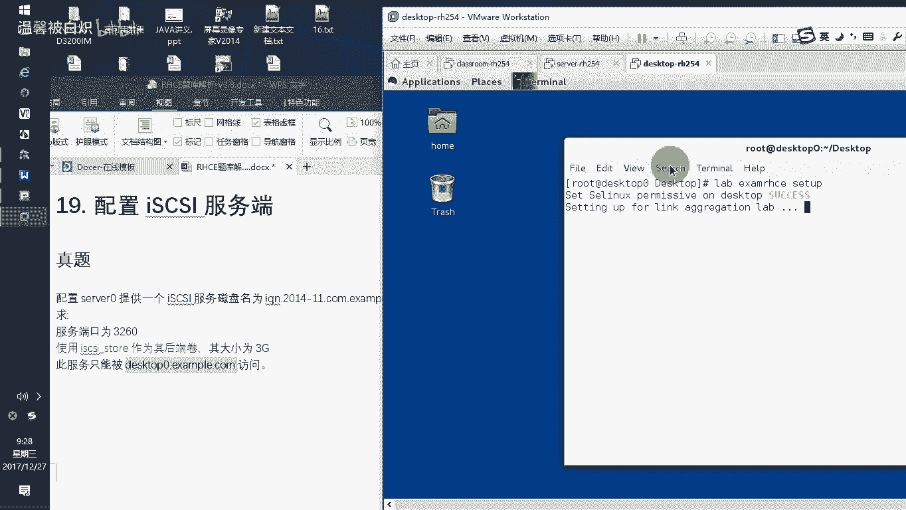

```bash
yum install -y iscsi-initiator-utils
```

**关键步骤**：在启动服务之前，必须先修改客户端的 Initiator 名称，使其与服务器 ACL 中允许的名称一致。

编辑 Initiator 名称配置文件。

```bash
vi /etc/iscsi/initiatorname.iscsi
```

将文件中的 `InitiatorName` 值修改为服务器 ACL 中指定的名称，例如：
```
InitiatorName=iqn.2014-11.com.example:desktop0
```
保存并退出。

**重要**：必须先修改此名称，再启动服务。如果顺序颠倒，可能导致连接失败。

### 启动 iSCSI 服务并发现目标

启动并启用 iSCSI 服务。

```bash
systemctl start iscsi
systemctl enable iscsi
```

现在，客户端需要发现服务器上提供的 iSCSI 目标。

我们可以使用 `man iscsiadm` 命令查看帮助文档中的示例来获得正确的发现命令格式。

以下是发现目标的命令：

```bash
iscsiadm --mode discovery --type sendtargets --portal 172.25.0.11 --discovery
```

执行后，客户端将发现服务器 `172.25.0.11` 上提供的目标。

### 登录并连接目标

使用发现到的目标信息，登录并建立连接。

```bash
iscsiadm --mode node --targetname iqn.2014-11.com.example:server0 --portal 172.25.0.11:3260 --login
```

连接成功后，可以使用 `lsblk` 命令查看是否多出了一块磁盘（例如 `/dev/sdc`）。

```bash
lsblk
```

如果需要断开连接，可以使用 `--logout` 参数。

```bash
iscsiadm --mode node --targetname iqn.2014-11.com.example:server0 --portal 172.25.0.11:3260 --logout
```

### 分区、格式化并挂载存储

连接成功后，对新增的磁盘（例如 `/dev/sdc`）进行分区。

```bash
fdisk /dev/sdc
```
在交互界面中：
1.  输入 `n` 创建新分区。
2.  选择主分区 (`p`)。
3.  分区号设为 `1`。
4.  设置起始扇区。
5.  设置分区大小，例如 `+2100M`。
6.  输入 `t` 更改分区类型为 `83` (Linux)。
7.  输入 `w` 保存并退出。

创建挂载点目录。

```bash
mkdir /mnt/data
```

格式化新分区为 ext4 文件系统。

```bash
mkfs.ext4 /dev/sdc1
```

### 配置自动挂载

为了实现开机自动挂载，需要修改 `/etc/fstab` 文件。建议使用 UUID 进行挂载。

首先，获取新分区的 UUID。

```bash
blkid /dev/sdc1
```

编辑 `/etc/fstab` 文件。

```bash
vi /etc/fstab
```

在文件末尾添加一行，格式如下：
```
UUID=<你的UUID> /mnt/data ext4 _netdev 0 0
```
**注意**：对于网络设备，**必须**添加 `_netdev` 挂载选项，否则系统可能无法正常启动。

保存并退出后，测试挂载。

```bash
mount -a
df -h
```

检查 `/mnt/data` 是否已成功挂载，并显示正确的容量。

## 总结

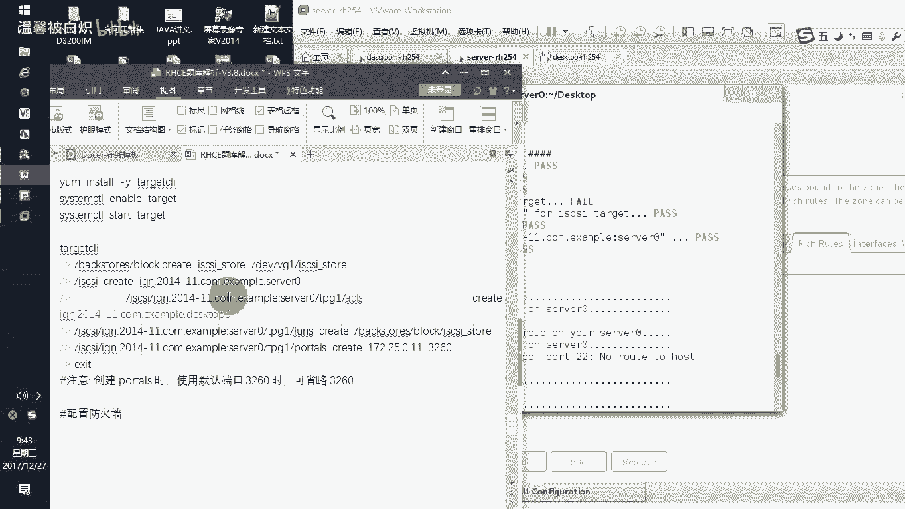

本节课中我们一起学习了 iSCSI 存储服务的完整配置流程。

*   **在服务端**，我们完成了以下工作：
    1.  创建 LVM 逻辑卷作为后端存储。
    2.  安装 `targetcli` 工具并配置 iSCSI 目标。
    3.  设置 ACL 以限制客户端访问。
    4.  创建 LUN 并将存储设备映射到目标。
    5.  配置监听地址和端口。
    6.  在防火墙中开放服务端口。

*   **在客户端**，我们完成了以下工作：
    1.  安装 `iscsi-initiator-utils` 软件包。
    2.  **关键步骤**：修改 Initiator 名称以匹配服务端 ACL，然后启动服务。
    3.  发现服务端目标并登录建立连接。
    4.  对远程磁盘进行分区和格式化。
    5.  修改 `/etc/fstab` 文件，使用 UUID 并添加 `_netdev` 选项，实现网络存储的自动挂载。

通过本教程，你应该能够理解 iSCSI 的基本概念，并掌握在 Red Hat 环境中部署和连接 iSCSI 存储的实践技能。重点在于理解服务端（目标）和客户端（发起端）的对应关系，以及 ACL 控制和网络设备挂载 (`_netdev`) 等细节配置。