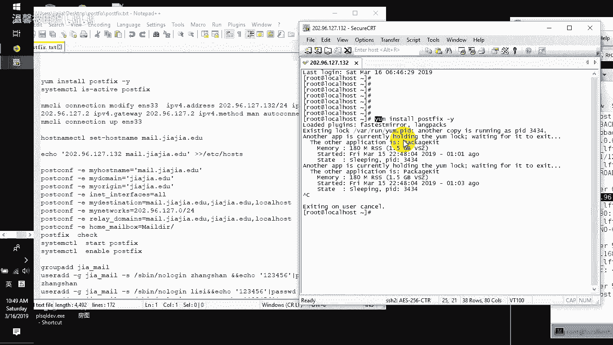
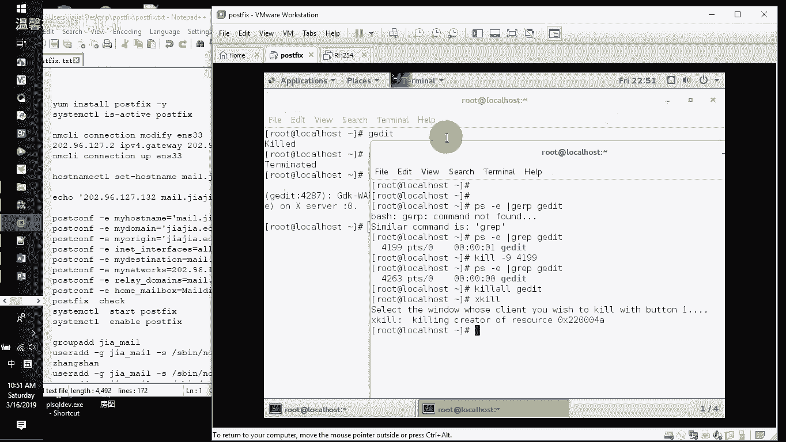
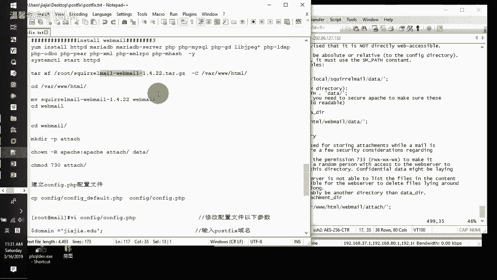
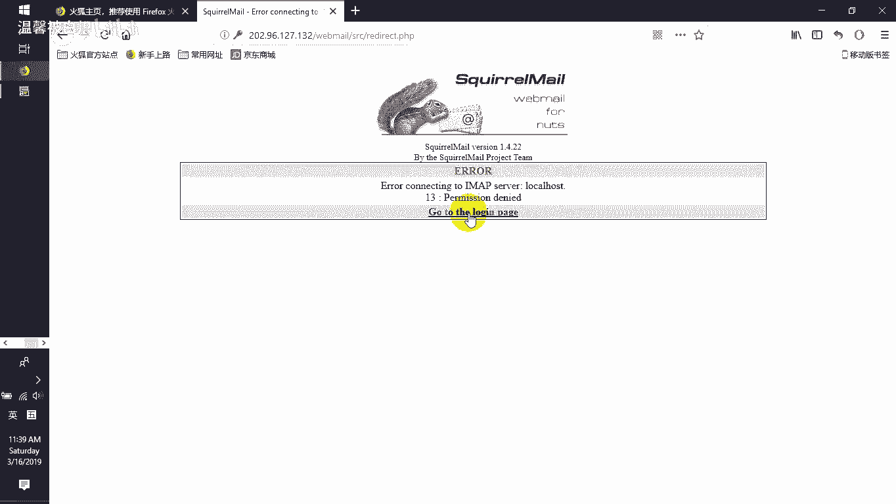
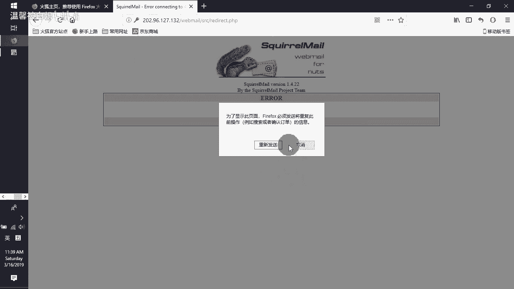
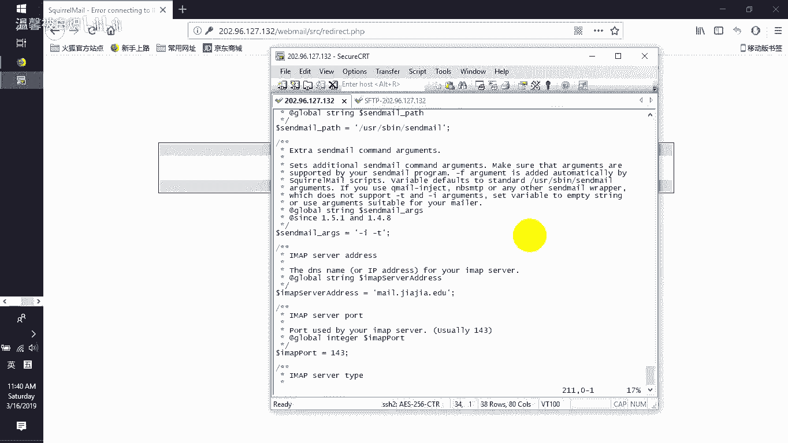
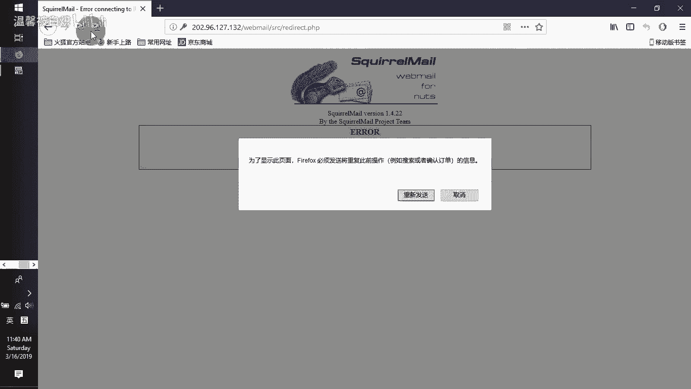
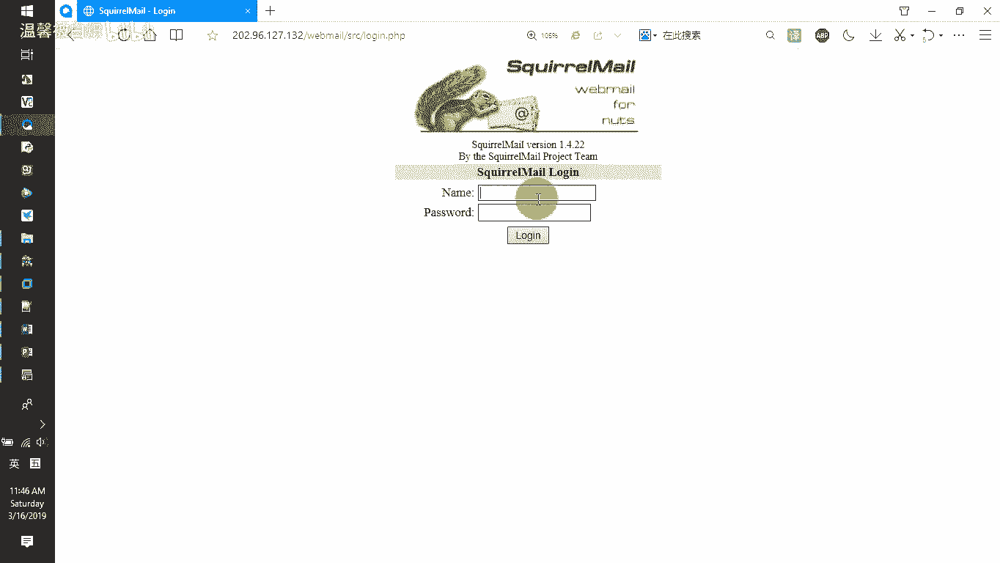
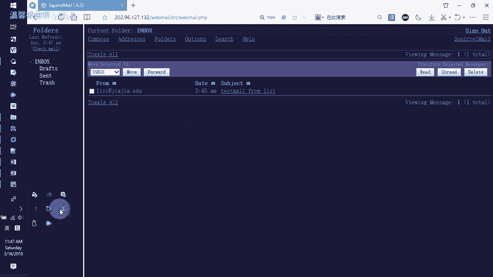

# RHCE课程：第345678天：Postfix邮件服务器搭建教程 🚀

在本节课中，我们将学习如何从零开始搭建一个功能完整的Postfix邮件服务器。这虽然不是RHCE考试大纲的必考内容，但作为一名合格的工程师，掌握服务的搭建是必备技能。我们将涵盖从软件安装、基础配置到网页客户端部署的完整流程。



## 环境准备与软件安装 💻



首先，我们需要确保服务器能够连接互联网，以便安装必要的软件包。我们将为服务器配置一个静态IP地址，并安装Postfix软件。

### 配置网络连接

上一节我们提到了环境准备，本节中我们来看看具体的网络配置步骤。如果服务器没有IP地址，我们可以使用`dhclient`命令从DHCP服务器获取一个。为了后续配置的稳定性，我们通常会将其设置为静态IP。

以下是配置静态IP地址的步骤：
1.  编辑网络配置文件，例如 `/etc/sysconfig/network-scripts/ifcfg-ens33`。
2.  修改关键参数：
    *   `BOOTPROTO=static`
    *   `IPADDR=202.96.127.132` (请替换为你的实际IP)
    *   `NETMASK=255.255.255.0`
    *   `GATEWAY=202.96.127.1` (请替换为你的实际网关)
    *   `DNS1=202.96.127.1` (请替换为你的实际DNS)
3.  重启网络服务使配置生效：`nmcli c reload` 和 `nmcli c up ens33`。

配置完成后，可以使用 `ping 8.8.8.8` 命令测试网络连通性。

### 安装Postfix软件包

网络就绪后，我们开始安装Postfix邮件服务器软件。

使用Yum包管理器进行安装：
```bash
yum install postfix -y
```
在安装过程中，如果遇到“有进程正在使用yum环境”的报错，意味着有另一个yum或dnf进程被锁定。我们需要找到并终止该进程。

以下是处理进程占用的方法：
*   **查找进程ID**：使用 `ps aux | grep yum` 或 `ps aux | grep dnf` 找到相关进程的PID。
*   **终止进程**：使用 `kill -9 <PID>` 命令强制终止该进程。例如，`kill -9 3434`。
*   **其他kill命令**：
    *   `killall <进程名>`：杀死所有同名进程。
    *   `pkill <进程名>`：通过进程名杀死进程。
    *   `xkill`：在图形界面下，点击鼠标直接杀死目标窗口对应的进程。

进程问题解决后，重新执行安装命令即可。

安装完成后，设置Postfix服务开机自启并立即启动：
```bash
systemctl enable postfix
systemctl start postfix
```
可以使用 `systemctl status postfix` 命令检查服务状态。

## 基础配置与测试 📧

上一节我们成功安装了Postfix服务，本节中我们来看看如何进行核心配置并完成初步测试。

### 配置主机名与解析

为了让邮件服务器有明确的身份标识，我们需要设置主机名并配置本地解析。

1.  **设置主机名**：
    ```bash
    hostnamectl set-hostname mail.jiajia.edu
    ```
2.  **配置本地主机解析**：编辑 `/etc/hosts` 文件，添加以下行，确保服务器能通过多个名称解析到自己。
    ```
    127.0.0.1   localhost localhost.localdomain localhost4 localhost4.localdomain4 mail.jiajia.edu jiajia.edu mail
    202.96.127.132 mail.jiajia.edu jiajia.edu mail
    ```
    配置后，使用 `ping mail.jiajia.edu` 或 `ping jiajia.edu` 测试解析是否生效。

### 配置Postfix主参数

Postfix的主要配置文件是 `/etc/postfix/main.cf`。我们需要修改几个关键参数来定义服务器的行为。

以下是需要修改的核心参数及其说明：
*   `myhostname = mail.jiajia.edu`：定义邮件服务器自己的主机名。
*   `mydomain = jiajia.edu`：定义邮件服务器的域名。
*   `myorigin = $mydomain`：定义外发邮件时使用的发件人域名。
*   `inet_interfaces = all`：定义监听哪些网络接口来接收邮件。`all` 表示监听所有接口，若仅限本地则设为 `localhost`。
*   `mydestination = $myhostname, localhost.$mydomain, localhost, $mydomain`：定义本服务器负责接收邮件的目标域名列表。
*   `mynetworks = 202.96.127.0/24, 127.0.0.0/8`：定义允许通过本服务器转发邮件的客户端IP网段（请替换为你的实际网段）。
*   `home_mailbox = Maildir/`：定义使用`Maildir`格式（每个邮件是一个独立文件）存储用户邮件，邮件将存放在用户家目录的 `~/Maildir/` 文件夹下。

修改完成后，使用 `postfix check` 命令检查配置文件语法，无误后重启服务：
```bash
systemctl restart postfix
```
使用 `netstat -tnlp | grep :25` 命令确认SMTP服务（端口25）已正常监听。

### 创建测试用户

为了测试邮件收发，我们需要创建几个系统用户作为邮箱账号。

使用以下命令创建用户组和用户，并同时设置密码：
```bash
groupadd jiajiamail
useradd -g jiajiamail -s /sbin/nologin zhangsan && echo “123456” | passwd --stdin zhangsan
useradd -g jiajiamail -s /sbin/nologin lisi && echo “123456” | passwd --stdin lisi
useradd -g jiajiamail -s /sbin/nologin wangwu && echo “123456” | passwd --stdin wangwu
```
*   `-g`：指定用户的主要组。
*   `-s /sbin/nologin`：禁止用户通过Shell登录系统，仅用作邮件账户。
*   `echo “密码” | passwd --stdin 用户名`：通过管道将密码传递给`passwd`命令，实现非交互式设置密码。

### 允许Postfix写入用户家目录

由于我们将邮件存储在用户家目录（`~/Maildir/`），需要调整SELinux策略，允许Postfix进程写入用户家目录。
```bash
setsebool -P httpd_enable_homedirs on
```
`-P` 选项使设置永久生效。

### 开放防火墙端口

允许外部访问SMTP服务（端口25）：
```bash
firewall-cmd --permanent --add-service=smtp
firewall-cmd --reload
```

### 命令行测试邮件发送

现在，我们可以使用`telnet`命令模拟SMTP协议，进行最基础的邮件发送测试。

1.  安装telnet客户端：`yum install telnet -y`
2.  连接到本地SMTP服务器：
    ```bash
    telnet mail.jiajia.edu 25
    ```
3.  在telnet会话中，依次输入以下SMTP命令（`>` 后为服务器响应，无需输入）：
    ```
    HELO jiajia.edu
    > 250 mail.jiajia.edu
    MAIL FROM:<zhangsan@jiajia.edu>
    > 250 2.1.0 Ok
    RCPT TO:<lisi@jiajia.edu>
    > 250 2.1.5 Ok
    DATA
    > 354 End data with <CR><LF>.<CR><LF>
    Subject: Test mail from telnet
    This is a test email sent via telnet command.
    .
    > 250 2.0.0 Ok: queued as XXXXXXXXXX
    QUIT
    ```
发送成功后，可以检查收件人`lisi`的家目录，确认邮件是否已送达：
```bash
ls -la /home/lisi/Maildir/new/
cat /home/lisi/Maildir/new/* # 查看邮件内容
```

## 部署Dovecot与网页邮件客户端 🌐

上一节我们完成了Postfix的基础配置和命令行测试，本节中我们来看看如何添加邮件收取功能（POP3/IMAP）并通过网页界面管理邮件。

### 安装与配置Dovecot

Dovecot 提供了IMAP和POP3协议支持，允许用户通过邮件客户端（如Outlook、Thunderbird）或网页界面收取邮件。

1.  **安装Dovecot**：
    ```bash
    yum install dovecot -y
    ```
2.  **配置Dovecot**：编辑主配置文件 `/etc/dovecot/dovecot.conf`。
    *   启用协议：确保包含 `protocols = imap pop3 lmtp`
    *   监听地址：`listen = *` （监听所有IPv4地址）
    *   编辑 `/etc/dovecot/conf.d/10-mail.conf`，指定邮件存储格式和位置：
        ```
        mail_location = maildir:~/Maildir
        ```
    *   编辑 `/etc/dovecot/conf.d/10-auth.conf`，允许明文密码认证（仅用于测试，生产环境需配置SSL）：
        ```
        disable_plaintext_auth = no
        auth_mechanisms = plain login
        ```
    *   编辑 `/etc/dovecot/conf.d/10-ssl.conf`，禁用SSL（测试环境）：
        ```
        ssl = no
        ```
3.  **启动Dovecot**：
    ```bash
    systemctl enable dovecot
    systemctl start dovecot
    ```
4.  **开放防火墙端口**：
    ```bash
    firewall-cmd --permanent --add-port={110/tcp,143/tcp}
    firewall-cmd --reload
    ```
    使用 `netstat -tnlp | grep -E ‘:110|:143’` 确认端口已监听。



### 配置SASL身份验证

为了在网页登录时使用系统用户密码进行加密认证，我们需要配置SASL。

1.  **安装SASL验证模块**：
    ```bash
    yum install cyrus-sasl cyrus-sasl-plain -y
    ```
2.  **配置SASL使用系统账户**：编辑 `/etc/sasl2/smtpd.conf`，确保内容如下：
    ```
    pwcheck_method: saslauthd
    mech_list: plain login
    ```
3.  **配置SASL守护进程**：编辑 `/etc/sysconfig/saslauthd`，设置 `MECH=shadow` 以使用系统 `/etc/shadow` 文件验证。
4.  **启动服务并测试**：
    ```bash
    systemctl enable saslauthd
    systemctl start saslauthd
    testsaslauthd -u zhangsan -p ‘123456’ # 应返回 “0: OK “Success”.”
    ```
5.  **在Postfix中启用SASL认证**：在 `/etc/postfix/main.cf` 文件末尾添加：
    ```
    smtpd_sasl_auth_enable = yes
    smtpd_sasl_security_options = noanonymous
    smtpd_sasl_local_domain = $myhostname
    smtpd_recipient_restrictions = permit_mynetworks, permit_sasl_authenticated, reject_unauth_destination
    ```
    重启Postfix：`systemctl restart postfix`

### 部署LAMP环境与网页邮件客户端（Roundcube）



我们将使用Roundcube作为网页邮件客户端，它需要运行在LAMP（Linux, Apache, MariaDB, PHP）环境中。





1.  **安装LAMP组件**：
    ```bash
    yum install httpd mariadb-server mariadb php php-mysql php-gd php-imap php-mbstring -y
    systemctl enable httpd mariadb
    systemctl start httpd mariadb
    ```
2.  **配置MariaDB（可选，Roundcube需要数据库）**：运行 `mysql_secure_installation` 进行初始安全设置。然后创建Roundcube所需的数据库和用户：
    ```sql
    mysql -u root -p
    CREATE DATABASE roundcubedb;
    GRANT ALL PRIVILEGES ON roundcubedb.* TO ‘roundcubeuser’@’localhost’ IDENTIFIED BY ‘yourpassword’;
    FLUSH PRIVILEGES;
    EXIT;
    ```
3.  **部署Roundcube**：
    *   下载Roundcube安装包（例如，使用wget从官网下载）。
    *   解压到Apache的网站根目录（通常是 `/var/www/html/`）：
        ```bash
        tar -xzf roundcubemail-*.tar.gz -C /var/www/html/
        mv /var/www/html/roundcubemail-* /var/www/html/webmail
        ```
    *   设置目录权限：
        ```bash
        chown -R apache:apache /var/www/html/webmail/temp /var/www/html/webmail/logs
        chmod -R 775 /var/www/html/webmail/temp /var/www/html/webmail/logs
        ```
4.  **通过浏览器安装配置**：
    *   在浏览器中访问 `http://你的服务器IP/webmail/installer/`。
    *   按照安装向导步骤，配置数据库连接（使用上一步创建的数据库信息）、IMAP/SMTP服务器地址（填写 `mail.jiajia.edu`）等。
    *   配置完成后，根据提示删除或重命名安装目录 `installer`。
5.  **访问网页邮件系统**：通过浏览器访问 `http://你的服务器IP/webmail/`，使用之前创建的系统用户（如 `zhangsan`，密码 `123456`）登录，即可开始收发邮件。



## 总结与回顾 🎯

本节课中我们一起学习了如何搭建一个完整的Postfix邮件服务器系统。我们从最基础的环境准备和软件安装开始，逐步配置了Postfix的核心参数、主机名解析，并创建了测试用户。

随后，我们通过命令行测试验证了SMTP邮件发送功能。为了提供更完整的邮件服务，我们引入了Dovecot来支持IMAP/POP3邮件收取协议，并配置了SASL以实现安全的用户认证。

最后，我们部署了LAMP环境和Roundcube网页邮件客户端，使得用户可以通过友好的浏览器界面来管理邮件，完成了从后台服务到前端应用的全链路搭建。





整个过程涵盖了Linux服务配置、网络设置、防火墙管理、软件包安装和基础故障排查等多个实用技能点，是巩固RHCE所学知识的绝佳实践。