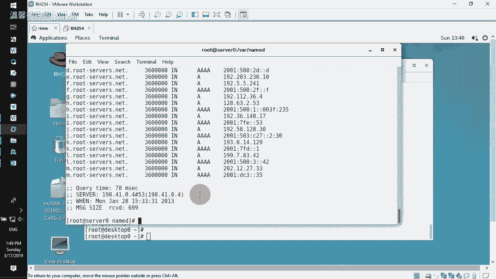
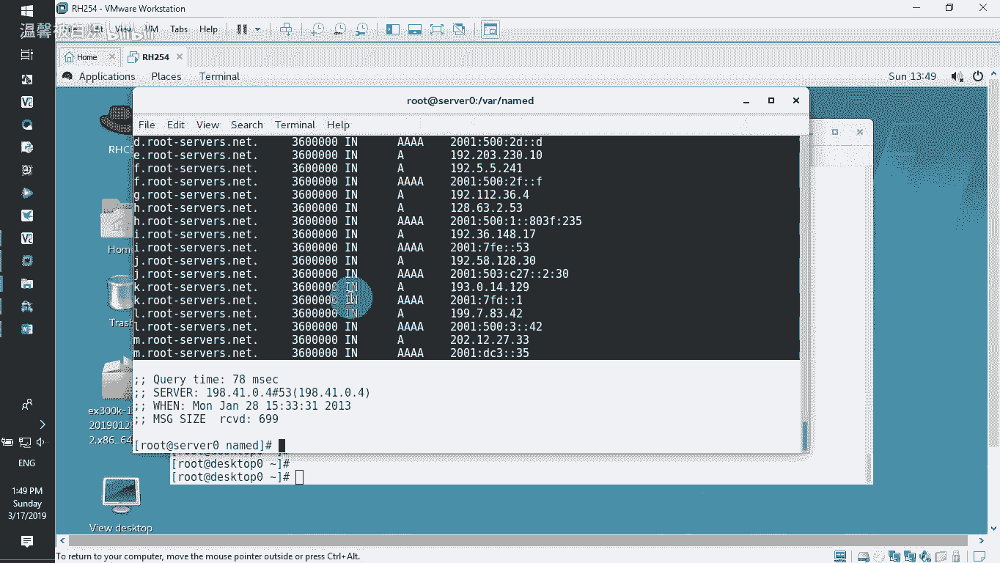
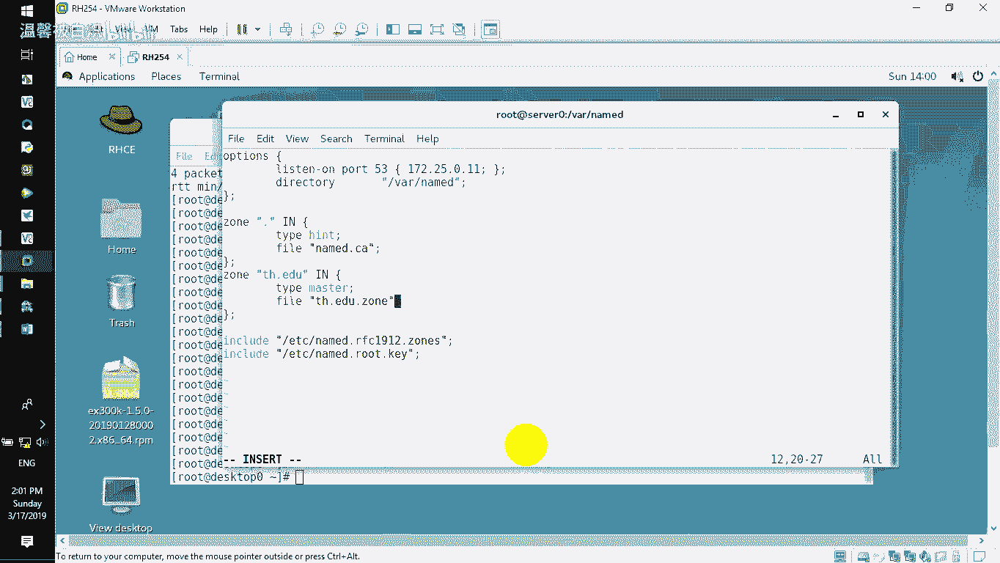
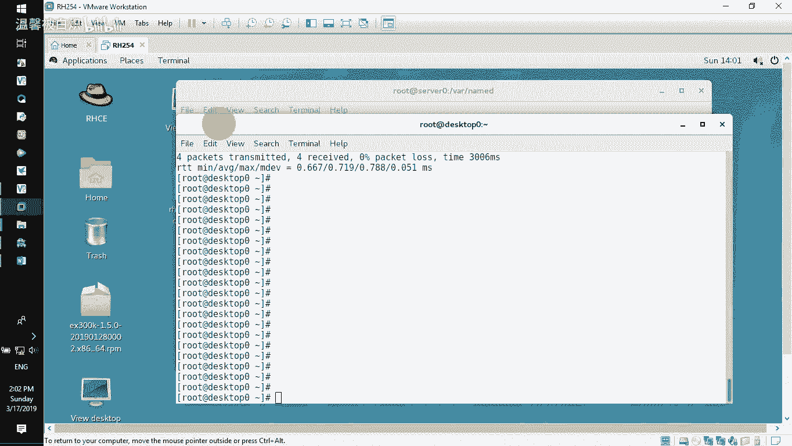
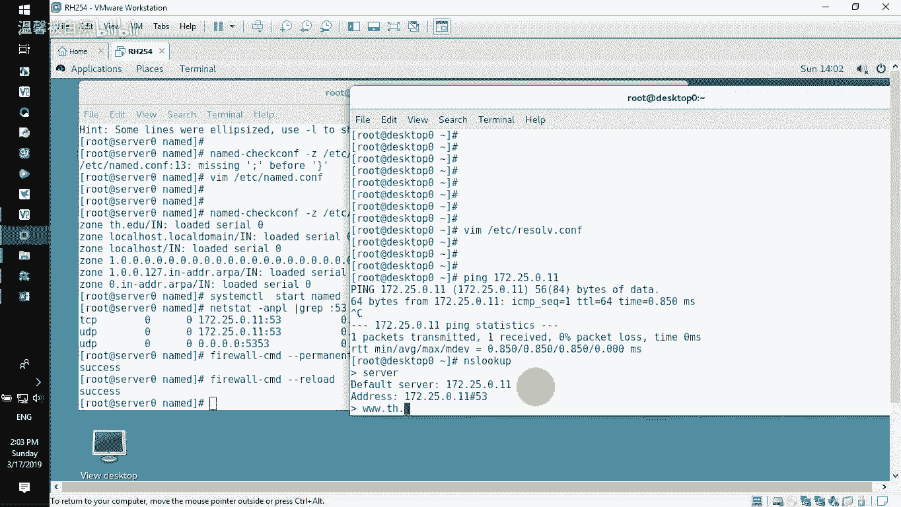
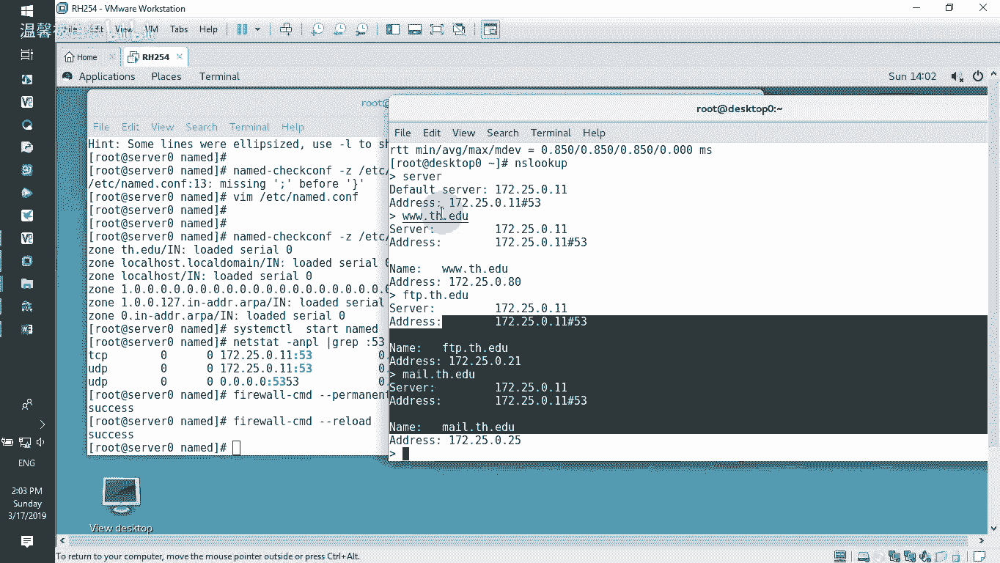
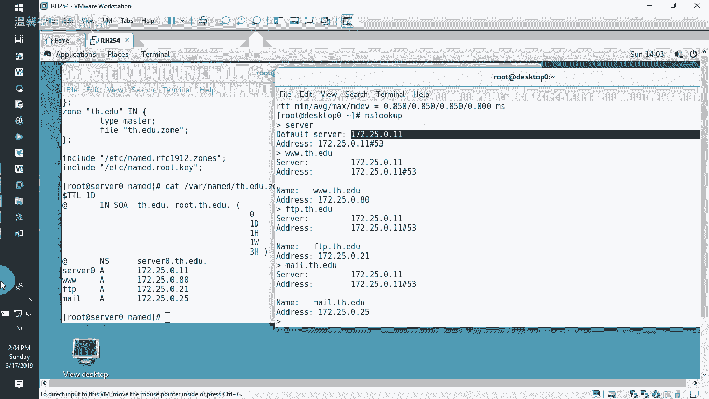

# RHCE 课程：第 2 章：DNS 服务配置教程 🖥️

在本节课中，我们将学习如何在 Linux 服务器上安装和配置一个基础的 DNS 服务器，并验证其解析功能。整个过程将分为几个清晰的步骤，确保初学者能够理解并操作。

---

## 环境准备与软件安装



首先，我们需要确认服务器的主机名和 IP 地址。这是 DNS 服务正常运行的基础。



*   服务器主机名：`server0.example.com`
*   服务器 IP 地址：`172.25.0.11`

确认环境无误后，我们开始安装 DNS 服务所需的软件包。以下是需要安装的软件包列表：

*   `bind`：提供 DNS 服务的主程序包。
*   `bind-chroot`：用于将 DNS 服务运行在一个隔离的“安全位置”，增强安全性。
*   `bind-utils`：包含 `nslookup`、`dig` 等 DNS 诊断工具。

使用以下命令进行安装：
```bash
yum install -y bind bind-chroot bind-utils
```

---

## 配置主配置文件

上一节我们安装了必要的软件，本节中我们来看看如何配置 DNS 服务的主配置文件。

DNS 服务的主配置文件位于 `/etc/named.conf`。我们需要编辑此文件来定义服务器的基本行为和区域。

1.  使用 `vi /etc/named.conf` 命令编辑文件。
2.  精简文件内容，仅保留核心配置。一个精简后的示例如下：
    ```bash
    options {
        listen-on port 53 { 172.25.0.11; }; // 监听本机IP
        directory       "/var/named"; // 工作目录
    };

    zone "tianhe.edu" IN { // 定义正向解析区域
        type master;
        file "tianhe.edu.zone"; // 区域数据文件名
    };
    ```
    *   `listen-on`：指定服务器监听的 IP 地址和端口。
    *   `directory`：指定 DNS 数据文件（如区域文件）的存放目录。
    *   `zone`：定义一个 DNS 区域。这里我们创建了 `tianhe.edu` 区域，类型为 `master`（主服务器），其数据记录存储在 `tianhe.edu.zone` 文件中。

---

## 创建区域数据文件

配置好主文件后，我们需要创建在上一步中指定的区域数据文件，该文件包含了具体的域名到 IP 地址的映射关系。

区域数据文件需要放置在 `/var/named/` 目录下。我们可以复制一个模板文件来修改。

1.  切换到工作目录：`cd /var/named`
2.  复制模板文件并保留其权限：`cp -p named.localhost tianhe.edu.zone`
3.  编辑新的区域文件：`vi tianhe.edu.zone`

文件内容示例如下：
```bash
$TTL 1D
@       IN SOA  server0.tianhe.edu. root.tianhe.edu. (
                                        0       ; serial
                                        1D      ; refresh
                                        1H      ; retry
                                        1W      ; expire
                                        3H )    ; minimum
        IN NS   server0.tianhe.edu.
server0 IN A    172.25.0.11
www     IN A    172.25.0.80
ftp     IN A    172.25.0.21
mail    IN A    172.25.0.25
```

*   **`SOA` 记录**：起始授权机构记录，定义了域的基本属性和管理信息。注意域名末尾的 `.` 不能省略。
*   **`NS` 记录**：名称服务器记录，指明该域的 DNS 服务器是哪台主机。
*   **`A` 记录**：地址记录，将主机名映射到 IPv4 地址。我们定义了 `server0`、`www`、`ftp`、`mail` 等主机的 A 记录。

---

## 启动服务与配置防火墙

区域文件创建完成后，我们就可以启动 DNS 服务了。但在启动前，最好先检查配置文件语法是否正确。

1.  检查主配置文件语法：`named-checkconf /etc/named.conf`
2.  检查区域文件语法：`named-checkzone tianhe.edu /var/named/tianhe.edu.zone`
3.  如果检查无误，启动服务：`systemctl start named`
4.  设置服务开机自启：`systemctl enable named`
5.  开放防火墙的 DNS 服务端口（53端口）：
    ```bash
    firewall-cmd --permanent --add-service=dns
    firewall-cmd --reload
    ```



---

## 客户端验证解析



服务端配置已经全部完成，本节我们将在另一台客户端机器上测试 DNS 解析是否正常工作。

我们需要将客户端的 DNS 服务器指向我们刚搭建的服务器 IP `172.25.0.11`。



1.  编辑客户端的 DNS 配置文件 `/etc/resolv.conf`：
    ```bash
    nameserver 172.25.0.11
    ```
2.  使用 `nslookup` 或 `dig` 命令测试解析：
    ```bash
    nslookup www.tianhe.edu
    nslookup ftp.tianhe.edu
    nslookup mail.tianhe.edu
    ```
    如果配置正确，命令将返回我们在区域文件中设置的对应 IP 地址。



---

## 总结 📝



本节课中我们一起学习了搭建一个基础 DNS 服务器的完整流程。我们首先安装了 `bind` 系列软件包，然后通过编辑 `/etc/named.conf` 主配置文件定义了服务器监听地址和区域。接着，我们在 `/var/named/` 目录下创建了区域数据文件 `tianhe.edu.zone`，并在其中添加了 `SOA`、`NS` 和 `A` 等关键记录。最后，我们启动了服务，配置了防火墙，并在客户端成功验证了域名解析。整个过程的核心在于理解主配置文件与区域数据文件的分工与协作。