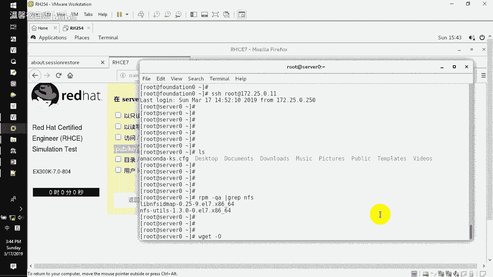
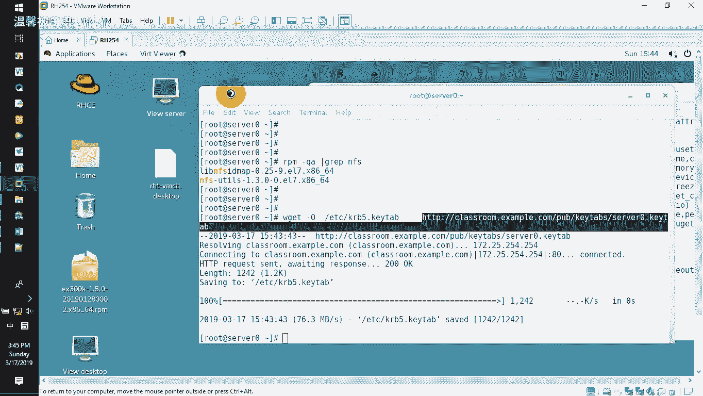
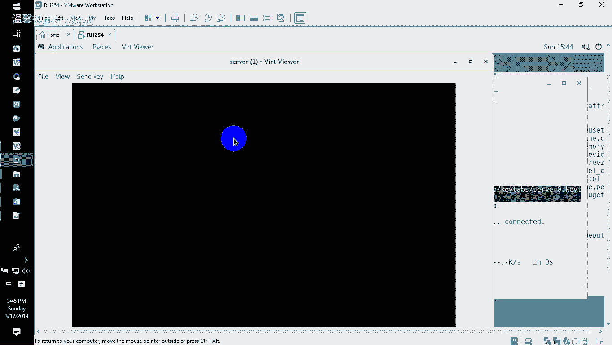
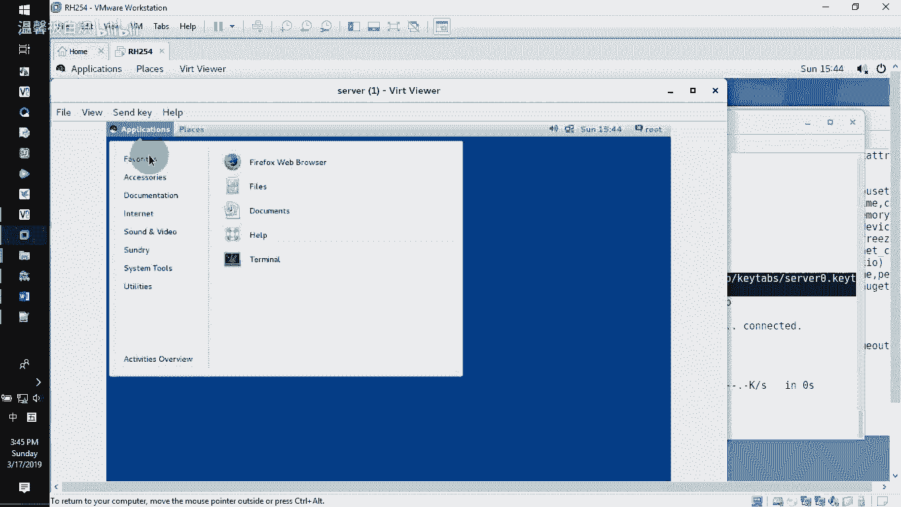
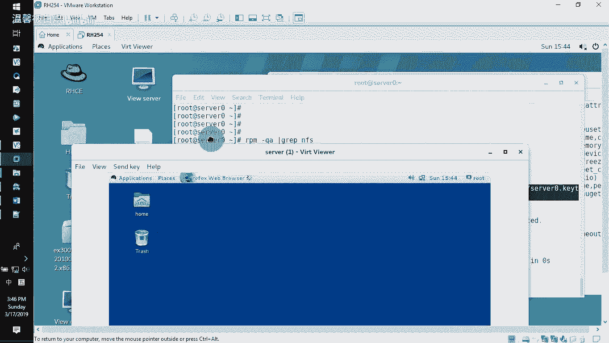
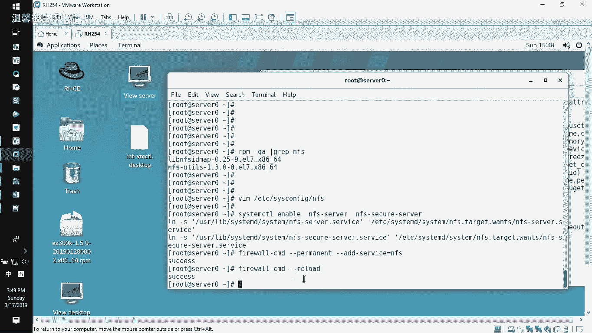
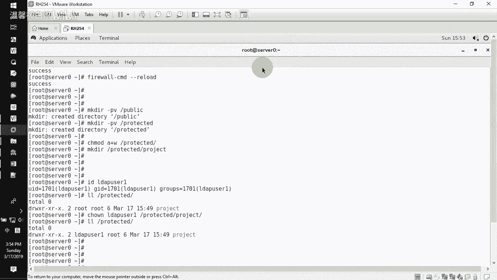

# RHCE课程：P3：NFS服务配置教程 🚀

在本节课中，我们将学习如何在服务器上配置NFS（网络文件系统）服务。具体任务包括：输出两个目录供特定域的用户访问，对其中一个目录进行安全加密，并设置相应的访问权限。我们将从安装必要的软件包开始，逐步完成密钥配置、目录创建、权限设置、服务配置以及防火墙设置。

---

## 服务器环境准备与密钥获取 🔑

上一节我们介绍了课程目标，本节中我们来看看如何准备服务器环境并获取安全密钥。

首先，验证NFS相关软件包是否已安装。在大多数情况下，系统已预装所需软件包。

```bash
rpm -qa | grep nfs
```



如果未安装，请使用以下命令安装：

```bash
yum install nfs-utils -y
```

接下来，获取安全加密所需的密钥文件。必须使用`wget`命令直接从指定URL下载，以确保文件的完整性。**禁止**通过图形界面浏览器下载，因为那会改变文件内容，导致后续验证失败。



```bash
wget -O /etc/krb5.keytab http://classroom.example.com/pub/keytabs/server0.keytab
```

此命令将密钥文件下载并保存到`/etc/krb5.keytab`路径，NFS服务将自动使用此路径的密钥文件。

---



## 配置NFS服务版本与启动服务 ⚙️





在获取密钥后，我们需要配置NFS服务版本并启动相关服务。

编辑NFS服务的配置文件，将RPC服务版本设置为4.2。这是一个加分项配置。

```bash
vi /etc/sysconfig/nfs
```

找到`RPCNFSDARGS`参数，在其后添加`-V 4.2`。

```
RPCNFSDARGS="-V 4.2"
```

保存并退出编辑器。接下来，启动并启用NFS服务及其安全服务。

以下是需要启动的两个服务：

*   `nfs-server`：标准的NFS文件共享服务。
*   `nfs-secure-server`：支持Kerberos加密验证的NFS服务。

```bash
systemctl enable --now nfs-server nfs-secure-server
```

---

## 配置防火墙与创建共享目录 🔥

服务启动后，需要配置防火墙以允许NFS访问，并创建题目要求的共享目录。

在防火墙中添加NFS服务规则，并重新加载防火墙配置。



```bash
firewall-cmd --permanent --add-service=nfs
firewall-cmd --reload
```

现在，创建需要共享的目录结构。

```bash
mkdir -pv /public /projects
```

在`/projects`目录下，还需创建子目录`project`，并将其所有者更改为LDAP用户`ldapuser1`。

```bash
mkdir -pv /projects/project
id ldapuser1  # 验证用户是否存在
chown ldapuser1 /projects/project
```

默认情况下，所有者拥有读、写、执行权限，这已满足`ldapuser1`需要读写权限的要求。

---

## 配置NFS共享输出 📤

目录创建完毕后，我们需要在NFS的配置文件中定义共享规则。

编辑NFS的导出配置文件`/etc/exports`。

```bash
vi /etc/exports
```

在文件中添加以下两行配置：

```
/public *.example.com(ro)
/projects *.example.com(rw,sec=krb5p)
```

配置说明如下：

*   `/public *.example.com(ro)`：将`/public`目录以**只读**权限共享给`example.com`域的所有用户。
*   `/projects *.example.com(rw,sec=krb5p)`：将`/projects`目录以**读写**权限共享给`example.com`域的所有用户，并启用`krb5p`安全加密。



保存并退出编辑器。然后，使用`exportfs`命令使配置生效。

```bash
exportfs -r
```

最后，重启NFS服务以确保所有配置加载无误。

```bash
systemctl restart nfs-server nfs-secure-server
```

---

## 总结 📝

本节课中我们一起学习了NFS服务器的完整配置流程。

我们首先准备了服务器环境并正确下载了加密密钥。接着，我们配置了NFS服务版本并启动了必需的服务。然后，我们设置了防火墙规则，创建了指定的共享目录并设置了正确的所有权。最后，我们通过编辑`/etc/exports`文件定义了详细的共享策略，包括访问权限和安全加密选项，并使用`exportfs`命令激活了共享。

至此，一个支持域内访问、权限区分及安全加密的NFS服务器就配置完成了。下一节我们将学习如何在客户端挂载并使用这些NFS共享。