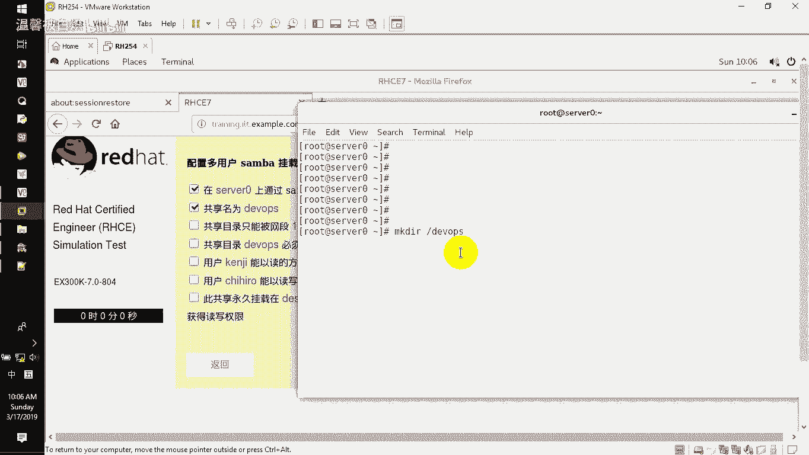
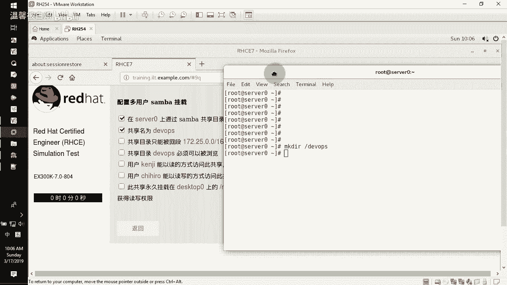
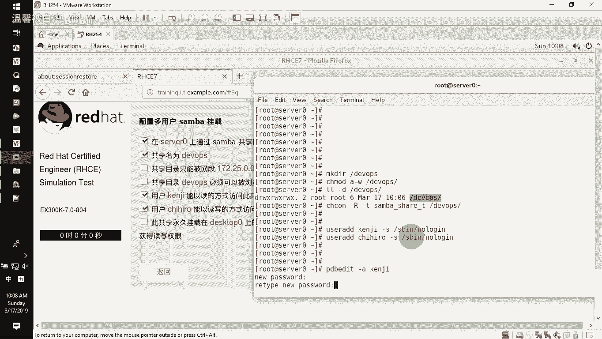
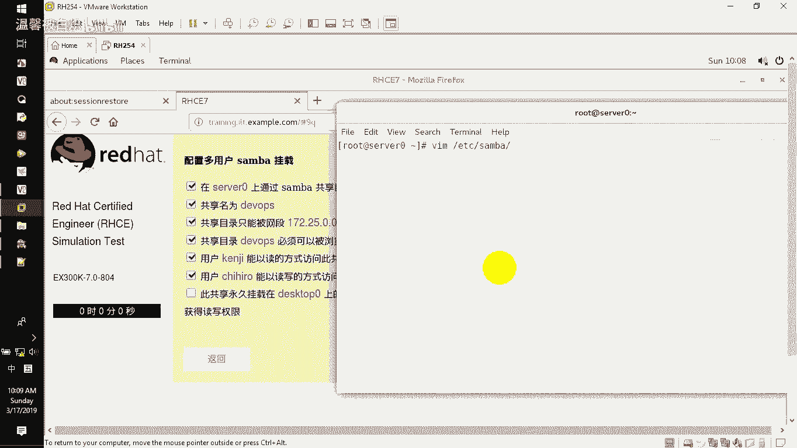
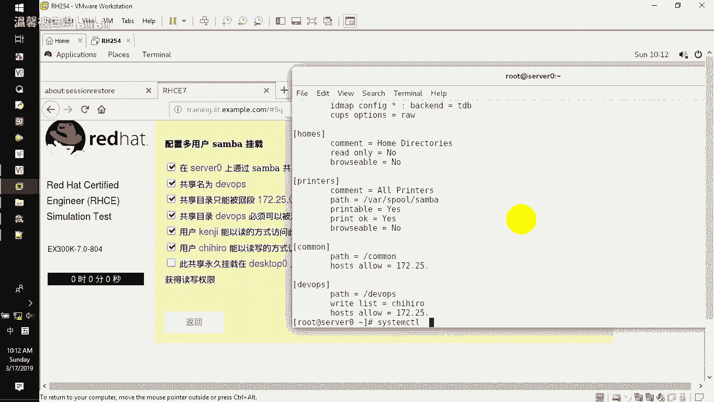
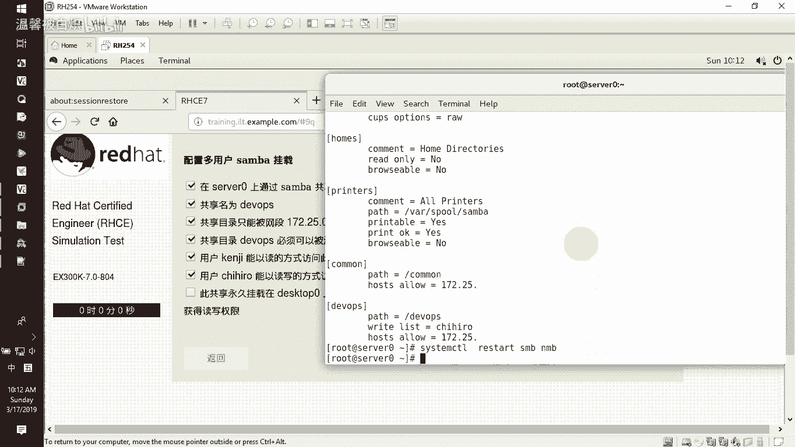
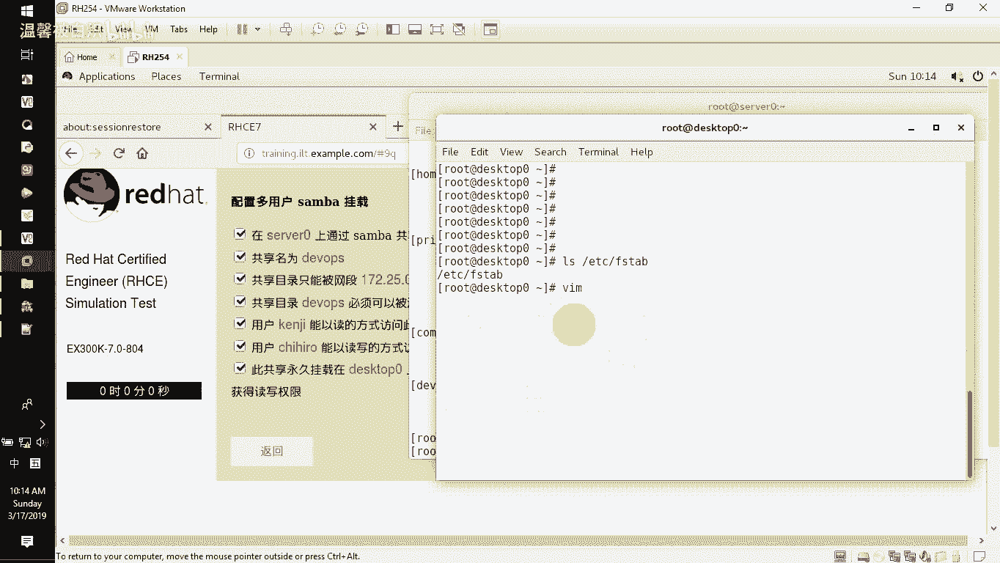
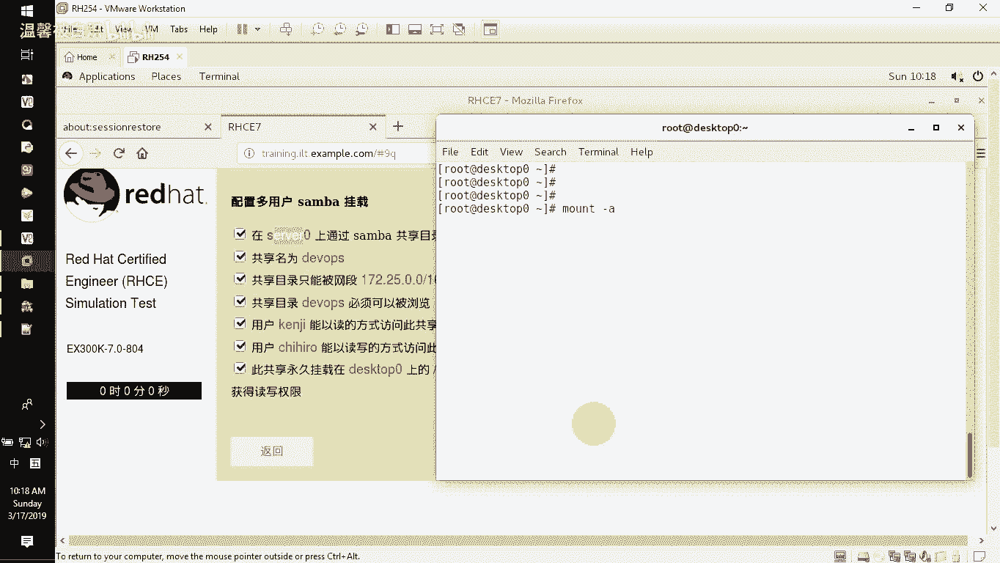
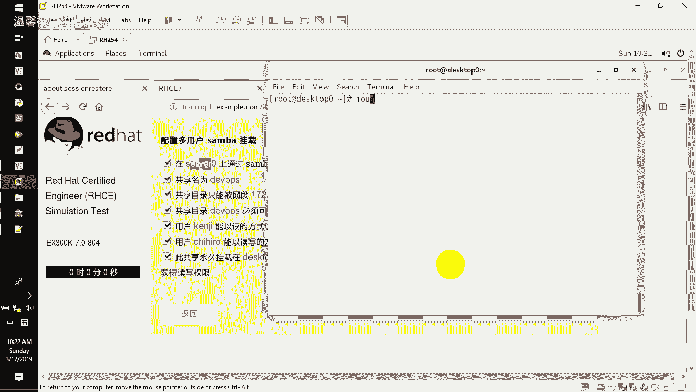

# RHCE课程：第5章：Samba多用户挂载配置教程 🖥️

## 概述

在本节课中，我们将学习如何配置Samba服务器的多用户挂载。这意味着不同的用户访问同一个共享文件夹时，将拥有不同的权限（例如，只读或读写）。我们将从创建共享目录开始，配置用户账户，设置Samba共享，最后在客户端实现永久挂载和权限切换。

---

## 创建共享目录与设置权限

上一节我们介绍了Samba的基本安装和使用。本节中，我们来看看如何为多用户挂载准备共享目录。

首先，在服务器上创建指定的共享目录。

```bash
mkdir /developers
```

创建目录后，需要设置适当的权限。因为题目要求部分用户有写入权限，所以先给目录添加所有用户的写权限。

```bash
chmod a+w /developers
```



可以使用 `ls -ld /developers` 命令查看权限设置。



接下来，需要为Samba共享设置SELinux安全上下文。

```bash
chcon -R -t samba_share_t /developers
```

---

## 创建用户账户并加入Samba

以下是创建两个用户账户并将其添加到Samba用户数据库的步骤。

首先，创建两个用户账户。请注意，实际考试中的用户名和密码会根据题目要求变化。



```bash
useradd -s /sbin/nologin user1
useradd -s /sbin/nologin user2
```

然后，将这两个用户添加到Samba的用户数据库中，并设置密码。



```bash
pdbedit -a -u user1
pdbedit -a -u user2
```

系统会提示为每个用户设置密码（例如，`redhat`）。

---

## 配置Samba共享

现在，我们来配置Samba的主配置文件，以定义多用户共享。

编辑Samba的主配置文件。

```bash
vi /etc/samba/smb.conf
```

在文件末尾添加以下共享配置块。请确保 `hosts allow` 行中的网段和点号书写正确。

```ini
[developers]
        path = /developers
        browseable = yes
        hosts allow = 172.25.0.
        writable = no
        write list = user2
```

配置解析：
*   `[developers]`: 共享名称。
*   `path`: 共享目录的实际路径。
*   `browseable = yes`: 确保共享在网络上可浏览。
*   `hosts allow`: 限制允许访问的网段。
*   `writable = no`: 默认所有用户不可写。
*   `write list = user2`: 指定拥有写入权限的特定用户（`user2`）。

保存并退出编辑器后，测试配置文件语法是否正确。



```bash
testparm
```



如果测试通过，重启Samba服务使配置生效。

```bash
systemctl restart smb nmb
```

---

## 在客户端安装必要软件包

上一节我们在服务器端完成了配置。本节中，我们来看看如何在客户端进行挂载。

首先，连接到指定的客户端桌面机器，并安装挂载CIFS共享所需的工具。

```bash
ssh root@172.25.0.10
```



在客户端安装 `cifs-utils` 和 `samba-client` 软件包。

```bash
yum install -y cifs-utils samba-client
```

---

## 配置客户端的永久挂载

以下是配置客户端永久挂载Samba共享的步骤，重点在于安全地存储认证信息。

首先，创建本地挂载点目录。

```bash
mkdir /mnt/dev
```

编辑 `/etc/fstab` 文件以实现开机自动挂载。**注意**：为了避免在配置文件中明文暴露用户名和密码（考试中会扣分），我们使用凭证文件。

```bash
vi /etc/fstab
```

在文件末尾添加以下行。这里使用服务器的主机名（`server0`）而非IP地址，并使用 `credentials` 参数指定凭证文件。

```ini
//server0/developers /mnt/dev cifs defaults,credentials=/root/smb.cred,multiuser 0 0
```

参数说明：
*   `//server0/developers`: 要挂载的远程Samba共享路径。
*   `/mnt/dev`: 本地挂载点。
*   `cifs`: 文件系统类型。
*   `credentials=/root/smb.cred`: 指定存储用户名和密码的凭证文件路径。
*   `multiuser`: 支持多用户凭据切换，这是实现多用户挂载的关键。



现在，创建上面指定的凭证文件 `/root/smb.cred`。

```bash
vi /root/smb.cred
```

在文件中写入默认连接使用的用户名和密码（例如，只读用户 `user1`）。

```ini
username=user1
password=redhat
```

保存并设置严格的权限，确保只有root可读。

```bash
chmod 600 /root/smb.cred
```

最后，测试挂载配置。

```bash
mount -a
```

使用 `mount | grep /mnt/dev` 或 `df -Th` 命令验证共享是否已成功挂载。

---

## 验证多用户权限切换

配置完成后，让我们验证多用户权限切换是否按预期工作。



首先，切换到普通用户（如 `student`）身份，并尝试在挂载目录中创建文件。由于默认凭证是只读用户 `user1`，此操作应该失败。

```bash
su - student
cd /mnt/dev
touch test_file.txt  # 预期：Permission denied
```

现在，在不切换系统用户的情况下，为当前会话添加具有写入权限的用户（`user2`）的Samba凭证。

```bash
cifscreds add -u user2 server0
```

系统会提示输入 `user2` 的密码（例如，`redhat`）。添加成功后，再次尝试创建文件。

```bash
touch test_file.txt  # 预期：成功创建
ls -l test_file.txt
```

可以看到，虽然当前的系统用户仍是 `student`，但通过 `cifscreds` 命令切换了Samba会话的认证身份后，就获得了 `user2` 的写入权限。

---

## 总结

本节课中我们一起学习了Samba多用户挂载的完整配置流程。我们从服务器端创建共享目录、设置用户和配置Samba开始，然后在客户端实现了安全的水久挂载，并最终验证了不同用户访问同一共享时权限的动态切换。关键在于理解 `writable` 与 `write list` 的配合使用，以及在客户端利用 `credentials` 参数和 `cifscreds` 命令实现安全、灵活的多用户认证管理。