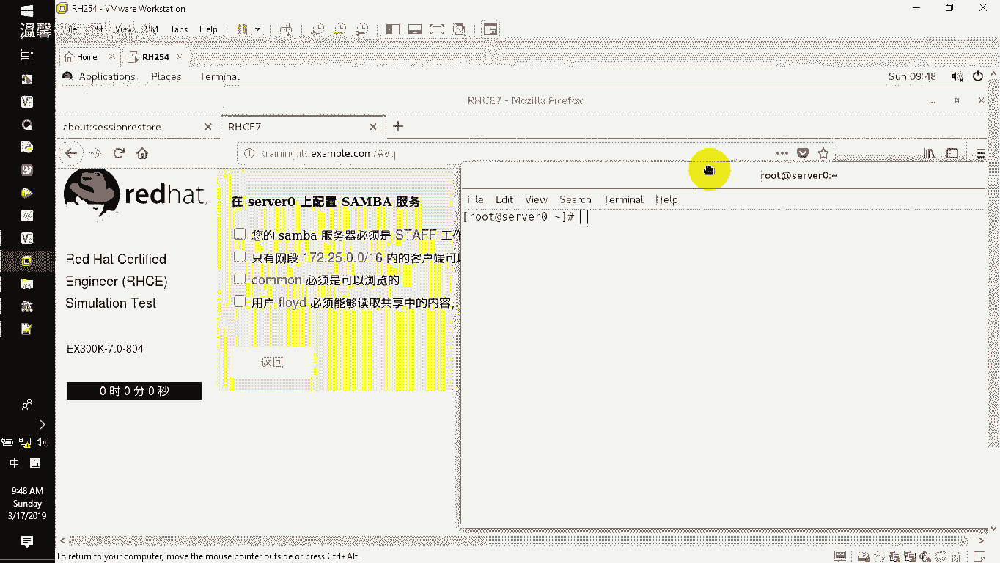
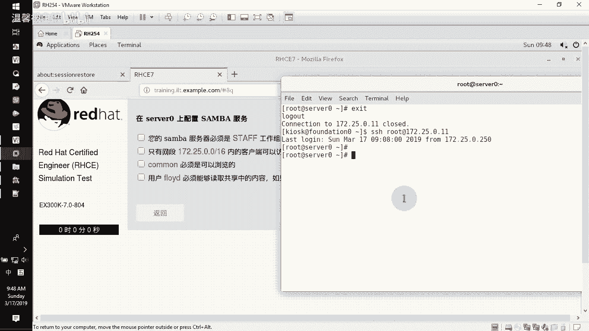
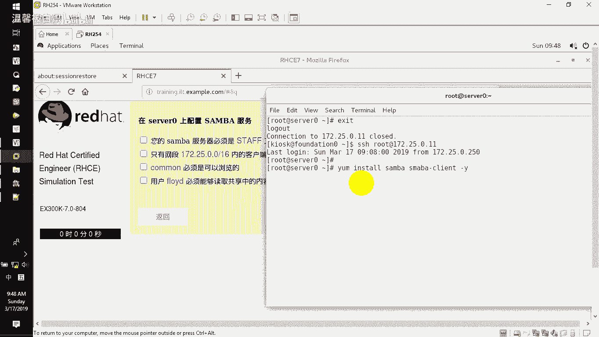
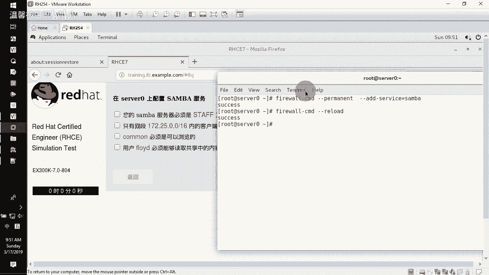
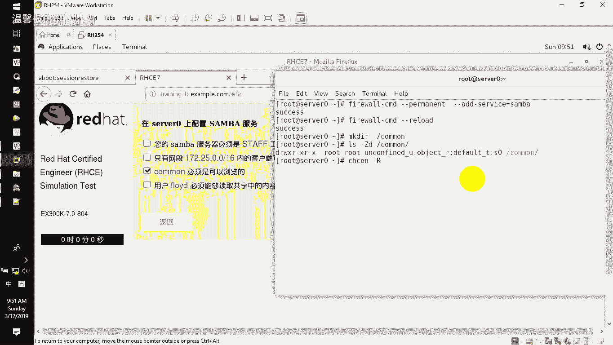

# RHCE课程：P6：Samba共享配置教程 🖥️

在本节课中，我们将学习如何在Linux服务器上配置Samba共享服务。Samba是一个实现SMB/CIFS协议的软件套件，允许Linux系统与Windows系统之间进行文件和打印机共享。我们将从安装软件包开始，逐步完成共享目录的创建、用户配置、防火墙设置以及最终的共享发布。

## 安装Samba软件包 📦





首先，我们需要在服务器上安装Samba服务端和客户端软件包。上一节我们介绍了连接到服务器的方法，本节中我们来看看如何安装必要的软件。



使用`yum`包管理器进行安装，`-y`参数用于自动确认安装提示。

```bash
yum install samba samba-client -y
```

## 配置Samba服务启动 🔧

软件包安装完成后，需要设置Samba服务开机自启动并立即启动服务。Samba服务包含两个主要组件：`smb`（消息块服务）和`nmb`（NetBIOS名称解析服务）。

以下是启动和启用服务的命令：

```bash
systemctl enable smb nmb
systemctl start smb nmb
```



这两个服务会监听以下端口：**137**、**138**、**139** 和 **445**。

## 配置防火墙规则 🛡️

为了让外部客户端能够访问Samba共享，需要在防火墙中开放Samba服务。



使用`firewall-cmd`命令永久添加Samba服务例外：

```bash
firewall-cmd --permanent --add-service=samba
firewall-cmd --reload
```

## 创建并配置共享目录 📁

接下来，我们需要创建一个用于共享的目录，并为其设置正确的SELinux安全上下文。

1.  创建共享目录：
    ```bash
    mkdir /common
    ```
2.  查看并设置SELinux安全上下文：
    ```bash
    ls -Zd /common
    semanage fcontext -a -t samba_share_t '/common(/.*)?'
    restorecon -Rv /common
    ls -Zd /common
    ```

## 管理Samba用户 👤

根据题目要求，我们需要一个名为`floyd`的用户来访问共享。需要注意的是，Samba用户验证密码与系统登录密码是分开管理的。

以下是用户管理的步骤：

1.  创建系统用户（不创建家目录，且禁止登录shell）：
    ```bash
    useradd -s /sbin/nologin floyd
    ```
2.  为`floyd`用户设置Samba验证密码：
    ```bash
    pdbedit -a floyd
    ```
    执行此命令后，系统会提示输入并确认该用户的Samba专用密码。

## 编辑Samba主配置文件 ⚙️

Samba服务的主配置文件是`/etc/samba/smb.conf`。我们需要修改两个部分：工作组设置和共享定义。

1.  修改工作组名称。找到`[global]`部分下的`workgroup`项，将其值改为`STAFF`：
    ```
    workgroup = STAFF
    ```
2.  在文件末尾添加共享定义。以下是`[common]`共享的配置示例：
    ```
    [common]
        path = /common
        browseable = yes
        read only = yes
        hosts allow = 172.25.0.
    ```
    *   `path`：指定共享目录的绝对路径。
    *   `browseable`：设置共享是否在网络上可见。
    *   `read only`：设置共享是否为只读。
    *   `hosts allow`：限制允许访问的IP网段。

## 测试与验证 ✅

在重启服务前，务必测试配置文件语法是否正确，并检查共享目录的权限。

1.  测试配置文件语法：
    ```bash
    testparm
    ```
2.  检查目录权限，确保其他用户(`others`)有读取(`r`)权限：
    ```bash
    ls -ld /common
    ```
3.  如果配置文件和权限都正确，重新加载Samba服务以使配置生效：
    ```bash
    systemctl reload smb nmb
    ```

## 总结 📝

本节课中我们一起学习了完整的Samba共享配置流程。我们首先安装了必要的软件包，并启动了Samba服务。接着，我们配置了防火墙规则，创建了共享目录并设置了正确的SELinux上下文。然后，我们创建了专用的系统用户并为其设置了Samba验证密码。最后，我们通过编辑`smb.conf`配置文件定义了共享的具体参数，并进行了测试和验证。掌握这些步骤，你就能成功在Linux服务器上发布一个受控的Samba共享。