# RHCE 课程：第 7 天：RHCE 考试环境配置与基础任务 🚀

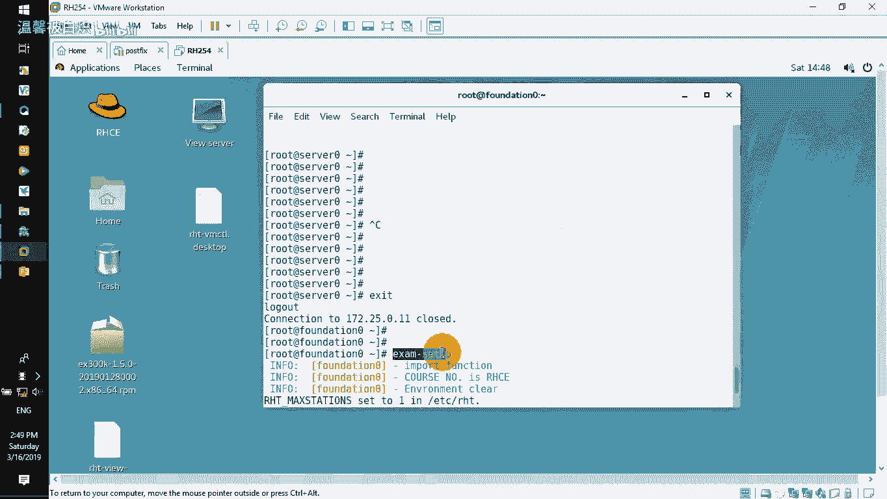

在本节课中，我们将学习如何为 RHCE 考试配置基础环境，并完成一系列初始任务。这些步骤包括设置防火墙规则、配置软件仓库、自定义用户环境以及网络配置等，是考试顺利进行的基础。

## 环境准备与连接

上一节我们介绍了课程概述，本节中我们来看看如何准备和连接考试环境。

我已经使用虚拟机准备好了环境，包括 classroom、server 和桌面测试机。

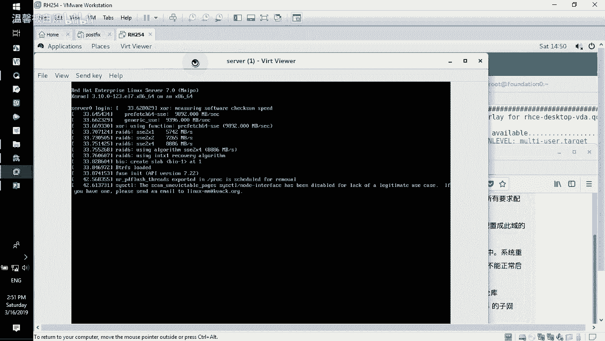

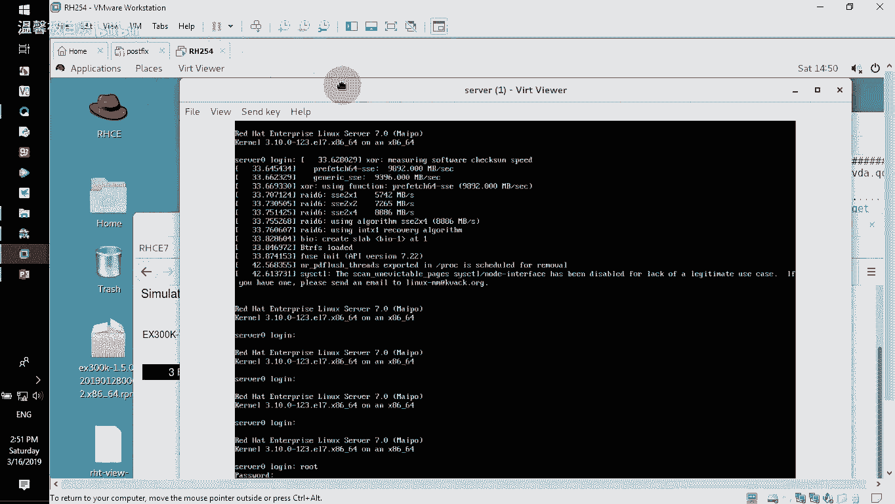


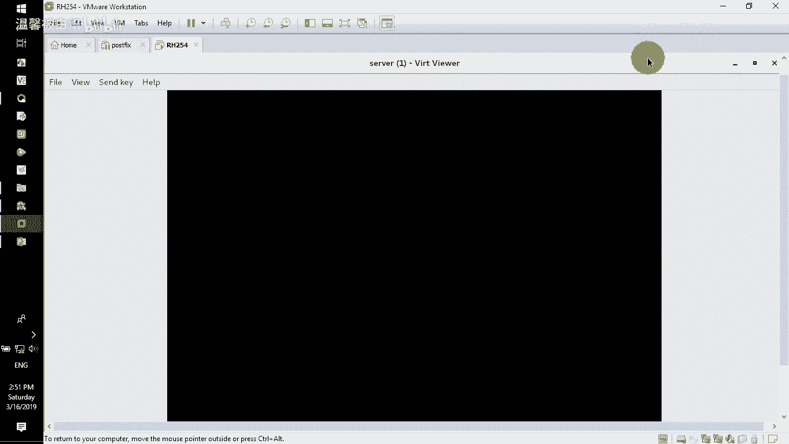

环境准备就绪后，首先打开你的 RHCE 考试题。在开始做题前，不要急于解答第一题，务必先完整阅读一遍“额外的配置信息”。考试总时长为三个半小时，掌握技巧后，完成练习的速度是很快的。

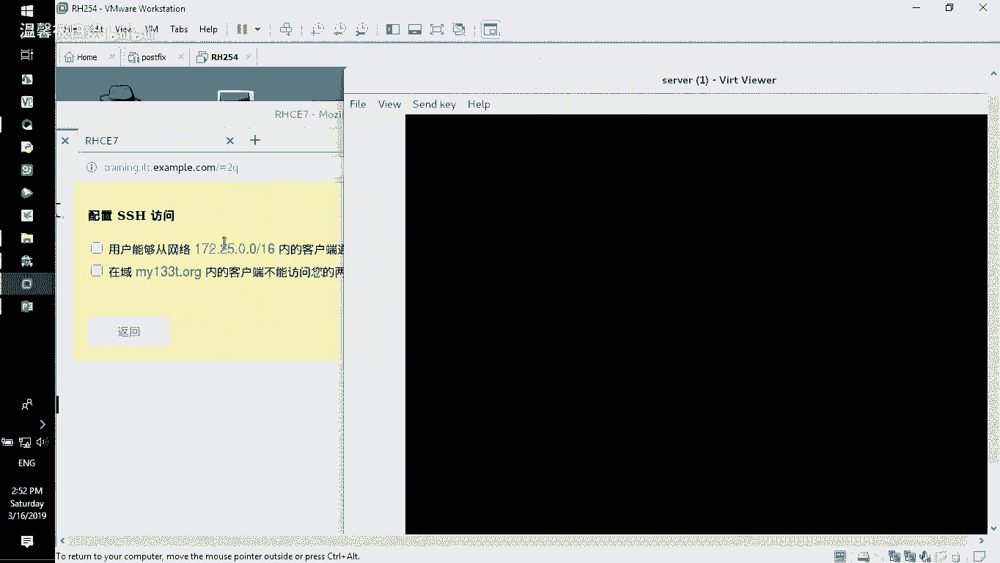

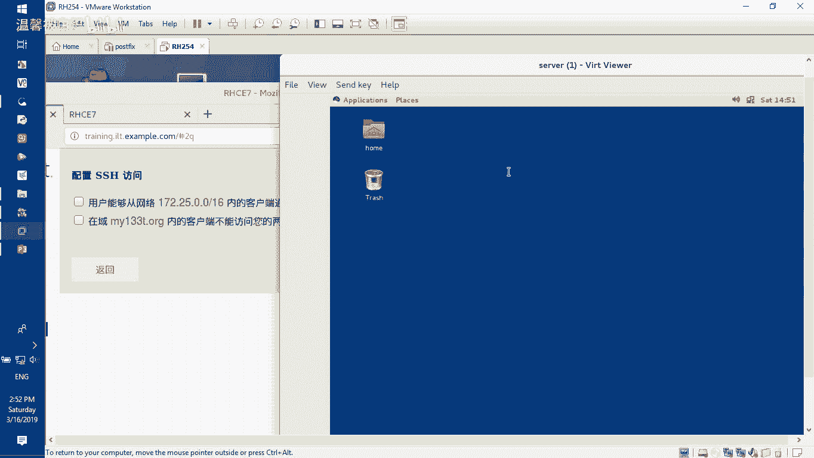

额外的配置信息通常包含以下内容：
*   浮动 IP 地址和客户端 IP 地址。
*   网络网段信息。
*   域名信息。
*   提供的测试账号。
*   软件仓库（YUM 仓库）的光盘镜像路径。
*   大多数情况下不允许访问的域及其 IP 地址。

阅读完配置信息后，开始配置我的环境。首先尝试通过 SSH 连接服务器（例如 172.25.0.11）和桌面机（例如 172.25.0.10）。但初次连接通常会失败，因为默认防火墙阻止了访问。

## 配置防火墙以允许 SSH 访问

上一节我们尝试连接环境但失败了，本节中我们来看看如何通过配置防火墙来解决问题。

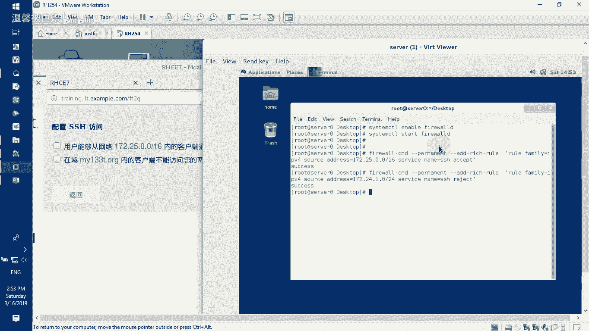

无法连接的原因是防火墙阻挡了 SSH 访问。因此，第一件事不是反复尝试连接，而是直接登录到目标主机进行配置。

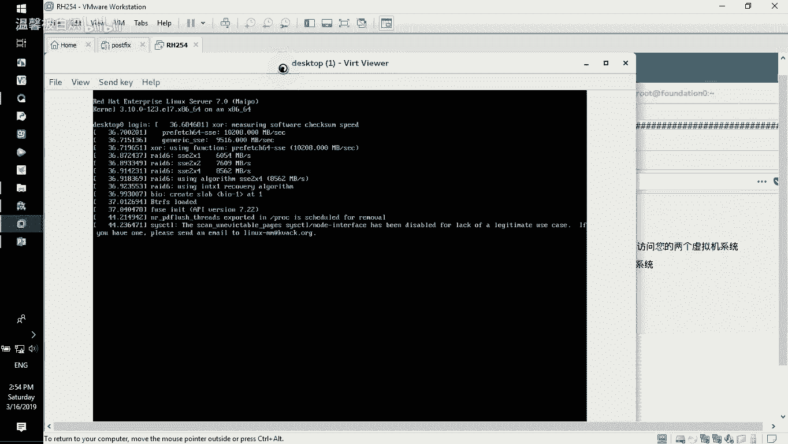

1.  在虚拟机界面，使用 root 账户和提供的密码（例如 `redhat`）登录 server 主机。

    

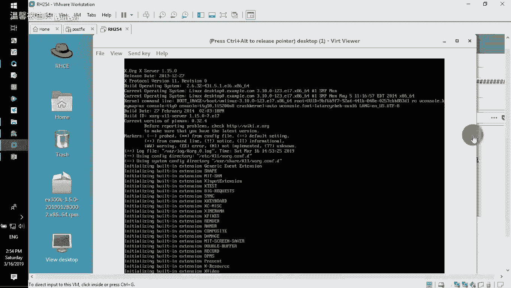

2.  登录后，启动图形界面：`startx`。

    

3.  在图形界面中，根据考试要求配置防火墙，允许指定网段访问 SSH 服务。

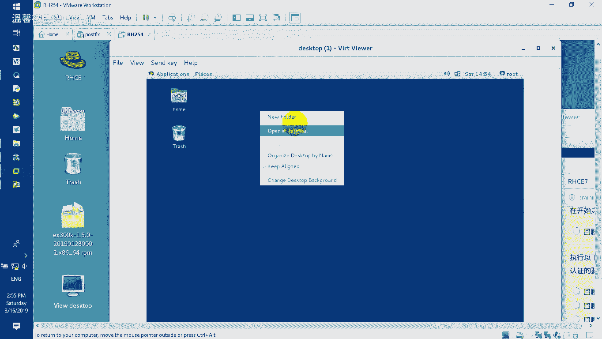

以下是配置防火墙规则的步骤：

首先，确保防火墙服务启用并启动：
```bash
systemctl enable firewalld
systemctl start firewalld
```

然后，添加永久生效的防火墙规则。以下是允许和拒绝特定网段访问 SSH 的示例命令：

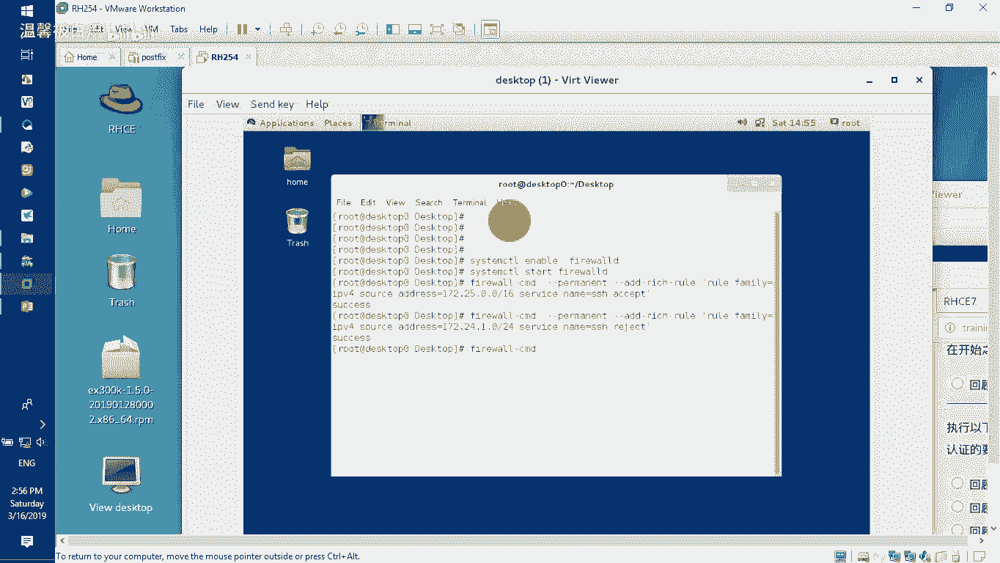

```bash
# 允许 172.25.0.0/16 网段访问 SSH
firewall-cmd --permanent --add-rich-rule='rule family=ipv4 source address=172.25.0.0/16 service name=ssh accept'

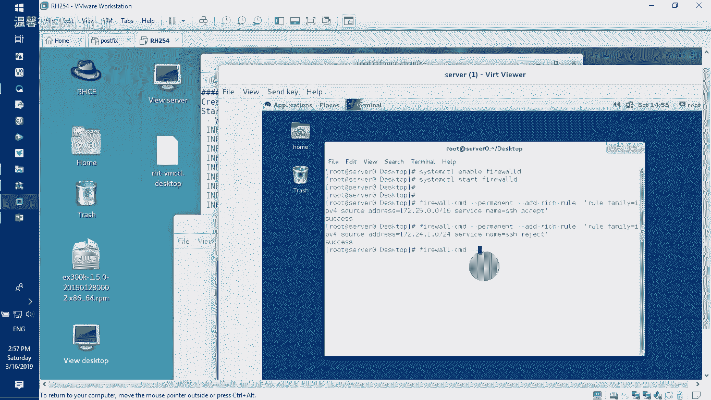

# 拒绝 172.24.1.0/24 网段访问 SSH (根据题目要求)
firewall-cmd --permanent --add-rich-rule='rule family=ipv4 source address=172.24.1.0/24 service name=ssh reject'
```

配置完成后，重新加载防火墙使规则生效：
```bash
firewall-cmd --reload
```


对桌面测试机重复上述防火墙配置过程。

1.  登录桌面机，密码在额外配置文档中提供（**注意：考试提供的 root 密码不能更改**）。

    

2.  同样执行 `startx` 启动图形界面，然后配置相同的防火墙规则。

    

3.  在桌面机上执行防火墙重载命令。

    

配置完成后，就可以从外部（例如你的考试控制机）使用 SSH 连接 server 和 desktop 主机了。IP 地址在额外配置信息中已给出。

## 配置 YUM 软件仓库

上一节我们确保了主机可访问，本节中我们来看看如何配置软件安装源。

检查当前仓库，发现是空的。必须根据额外配置信息中提供的 DVD 镜像路径创建本地 YUM 仓库。

在 server 主机上执行以下命令来配置仓库：
```bash
# 添加仓库配置文件
yum-config-manager --add-repo http://content.example.com/rhel8.0/x86_64/dvd/BaseOS

# 导入 RPM-GPG 密钥以验证软件包
rpm --import /etc/pki/rpm-gpg/RPM-GPG-KEY-redhat-release
```

在 desktop 主机上重复完全相同的步骤。

配置完成后，可以使用 `yum repolist` 命令验证仓库是否可用，并显示已启用的仓库列表。

## 配置 SELinux 与自定义用户环境

上一节我们配置了软件源，本节中我们来看看系统安全与用户环境的设置。

**配置 SELinux**
考试题目要求将两台主机的 SELinux 模式设置为强制模式（enforcing）。

编辑 SELinux 配置文件：
```bash
vi /etc/selinux/config
```
将 `SELINUX=` 一行修改为：
```
SELINUX=enforcing
```
保存退出后，重启系统使更改生效：`reboot`。此操作需要在 server 和 desktop 两台主机上执行。

**自定义用户环境**
题目要求创建一个命令别名。例如，创建别名 `psa` 来执行 `ps -aux`。

编辑全局 bash 配置文件：
```bash
vi /etc/bashrc
```
在文件末尾添加以下行：
```bash
alias psa='ps -aux'
```
保存退出后，使用 `source` 命令使更改立即生效：
```bash
source /etc/bashrc
```
此操作同样需要在两台主机上执行。完成后，无论是 root 还是其他用户（如 `student`），执行 `psa` 命令都应显示 `ps -aux` 的结果。

## 配置防火墙端口转发

上一节我们设置了用户环境，本节中我们来看看如何实现网络端口的重定向。

题目要求：在 server 上配置防火墙，使访问 5423 端口的流量被转发到本机的 80 端口。

这需要在 server 主机上配置两条规则：

1.  配置端口转发规则：
    ```bash
    firewall-cmd --permanent --add-rich-rule='rule family=ipv4 source address=172.25.0.0/16 forward-port port=5423 protocol=tcp to-port=80'
    ```

2.  开放 5423 端口的访问（允许外部连接）：
    ```bash
    firewall-cmd --permanent --add-rich-rule='rule family=ipv4 source address=172.25.0.0/16 port port=5423 protocol=tcp accept'
    ```

3.  重新加载防火墙：
    ```bash
    firewall-cmd --reload
    ```

配置完成后，可以使用 `firewall-cmd --list-all` 查看规则，确认端口转发和访问规则已生效。

## 配置网络链路聚合与 IPv6 地址

上一节我们处理了端口转发，本节中我们来看看高级网络配置。

**配置链路聚合**
目标：在 server 和 desktop 上分别使用 eth1 和 eth2 接口创建 team0 聚合链路，并配置 IP 地址，且设置开机自动启动。

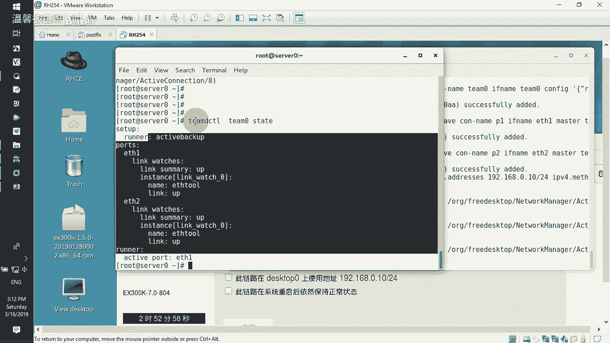

以下是配置 server 的步骤（desktop 步骤类似，IP 地址不同）：
1.  创建 team 接口：
    ```bash
    nmcli connection add type team con-name team0 ifname team0 config '{"runner": {"name": "activebackup"}}'
    ```
2.  将物理接口 eth1 和 eth2 作为成员加入 team0：
    ```bash
    nmcli connection add type team-slave con-name team0-port1 ifname eth1 master team0
    nmcli connection add type team-slave con-name team0-port2 ifname eth2 master team0
    ```
3.  为 team0 配置静态 IP 地址（例如 192.168.0.11/24）并设置自动连接：
    ```bash
    nmcli connection modify team0 ipv4.addresses 192.168.0.11/24 ipv4.method manual connection.autoconnect yes
    ```
4.  启动 team0 连接：
    ```bash
    nmcli connection up team0
    ```
    也可以选择启动成员端口连接。

在 desktop 上重复上述步骤，使用不同的 IP 地址（例如 192.168.0.10/24）。配置完成后，可以使用 `teamdctl team0 state` 命令查看聚合链路状态。

**配置 IPv6 地址**
题目要求：在 server 和 desktop 的 eth0 接口上添加指定的 IPv6 地址，并保留原有的 IPv4 地址。

**关键点**：使用 `nmcli connection show` 查看 eth0 设备对应的连接名称（可能是 `System eth0`），然后修改该连接。

配置 server 的 IPv6 地址（desktop 类似，地址不同）：
```bash
# 修改连接配置，添加 IPv6 地址，并设置为手动获取模式
nmcli connection modify “System eth0” ipv6.addresses 2001:db8:0:1::64/64 ipv6.method manual connection.autoconnect yes

# 启动该连接
nmcli connection up “System eth0”
```

配置完成后，使用 `ip addr show eth0` 检查 IPv4 和 IPv6 地址是否都已配置。可以使用 `ping6` 命令测试 IPv6 连通性，同时确保原有的 IPv4 通信仍然正常。

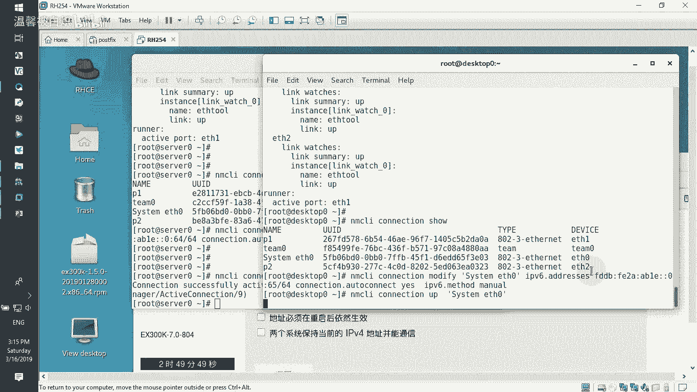

---

本节课中我们一起学习了 RHCE 考试开始阶段的一系列关键配置任务。我们首先建立了到考试主机的 SSH 连接，然后配置了 YUM 仓库、SELinux 模式和用户环境。接着，我们深入了解了防火墙的端口转发功能，并完成了链路聚合和双栈（IPv4/IPv6）网络配置。这些任务是后续所有高级服务配置的基础，熟练掌握它们对于高效完成考试至关重要。