# RHCE课程：第8天：为网站配置HTTPS加密

在本节课中，我们将学习如何为一个已有的网站配置HTTPS加密访问。我们将通过安装SSL模块、修改配置文件、获取并放置证书文件等步骤，使网站同时支持HTTP和HTTPS两种协议访问。

---

## 安装SSL模块

上一节我们介绍了网站的基础配置，本节中我们来看看如何为其添加HTTPS支持。首先，需要在完成前一题配置的基础上，安装Apache的SSL模块。

执行以下命令进行安装：
```bash
yum install mod_ssl -y
```
此命令会自动回答“yes”并安装`mod_ssl`模块。安装完成后，Apache服务器将具备支持SSL加密连接的能力。

---

## 配置HTTPS网站

安装好模块后，我们需要配置网站以启用HTTPS。配置工作主要在Apache的配置目录中进行。

首先，切换到Apache的配置目录：
```bash
cd /etc/httpd/conf.d
```
安装`mod_ssl`模块后，该目录下会自动生成一个名为`ssl.conf`的配置文件。即使不做任何修改，此配置文件默认也是可用的。但我们需要将其修改为适配我们自己的网站`www0.example.com`。

通常的做法是直接编辑这个默认的SSL配置文件。使用`vi`或你喜欢的编辑器打开它：
```bash
vi ssl.conf
```
配置文件默认监听443端口（HTTPS）。我们需要修改其中几个关键路径，指向我们自己的证书文件。

以下是需要关注的三个关键配置项及其作用：
*   **SSLCertificateFile**：指定已签名的服务器证书文件。
*   **SSLCertificateKeyFile**：指定与证书配对的私钥文件。
*   **SSLCertificateChainFile**：指定证书链文件（CA证书）。

配置文件中已经给出了示例路径，我们需要将其替换为题目提供的实际文件路径。

---

## 获取并放置证书文件

根据题目要求，我们需要从指定位置下载三个证书文件，并放置到正确的目录下。

以下是具体的操作步骤，请确保在服务器上执行：

1.  **下载服务器证书**：
    将证书下载到`/etc/pki/tls/certs/`目录下，并命名为`www0.crt`。
    ```bash
    wget -O /etc/pki/tls/certs/www0.crt http://classroom.example.com/pub/www0.crt
    ```
    随后，在`ssl.conf`文件中，将`SSLCertificateFile`一项的值修改为`/etc/pki/tls/certs/www0.crt`。

2.  **下载私钥文件**：
    将私钥文件下载到`/etc/pki/tls/private/`目录下，并命名为`www0.key`。
    ```bash
    wget -O /etc/pki/tls/private/www0.key http://classroom.example.com/pub/www0.key
    ```
    随后，在`ssl.conf`文件中，将`SSLCertificateKeyFile`一项的值修改为`/etc/pki/tls/private/www0.key`。

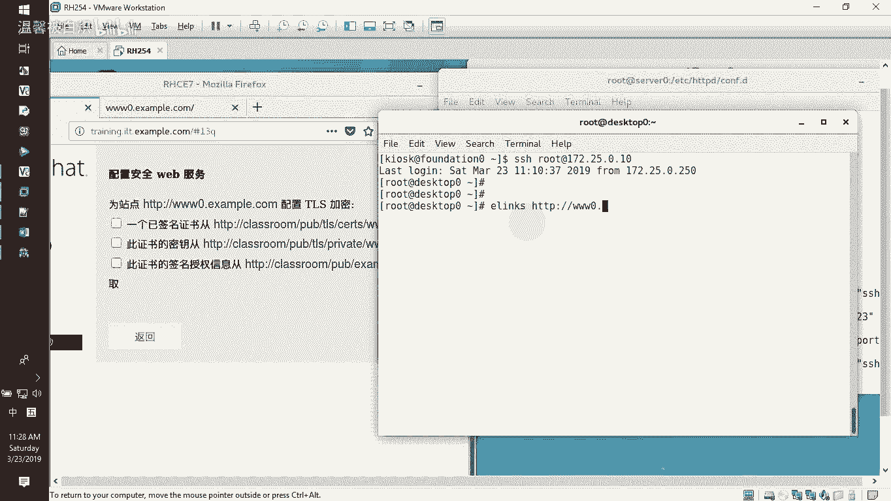

3.  **下载证书链文件**：
    将CA证书下载到`/etc/pki/tls/certs/`目录下，并命名为`example-CA.crt`。
    ```bash
    wget -O /etc/pki/tls/certs/example-CA.crt http://classroom.example.com/pub/example-CA.crt
    ```
    随后，在`ssl.conf`文件中，找到`SSLCertificateChainFile`这一行（默认可能被注释掉），去掉行首的`#`号，并将其值修改为`/etc/pki/tls/certs/example-CA.crt`。

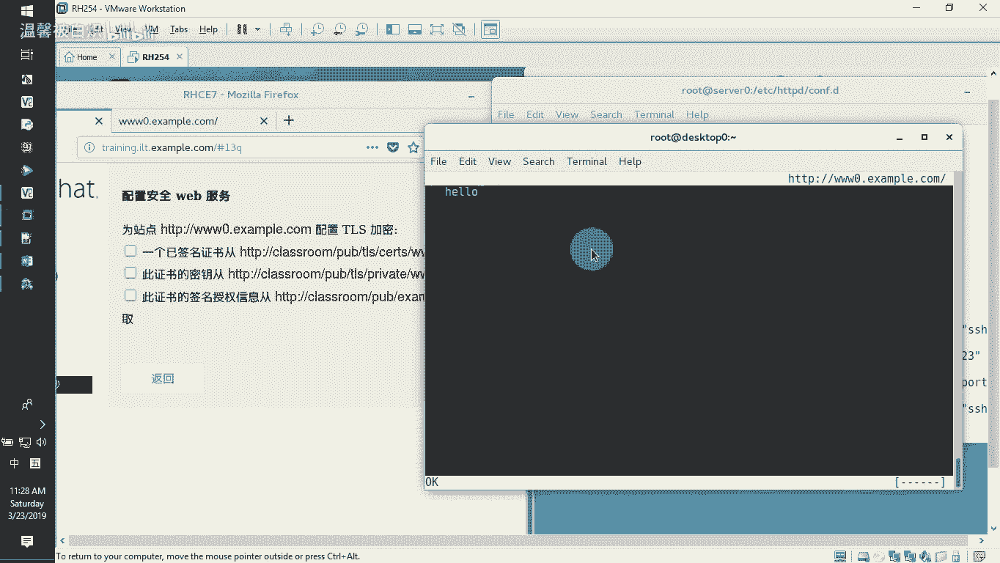

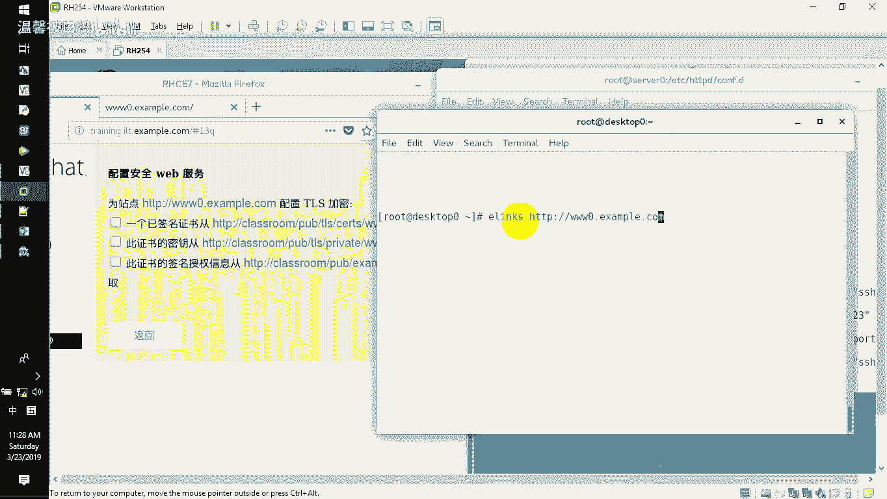

修改完成后，保存并退出配置文件。

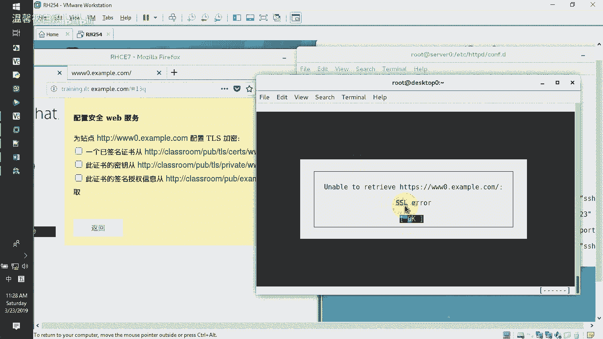

---

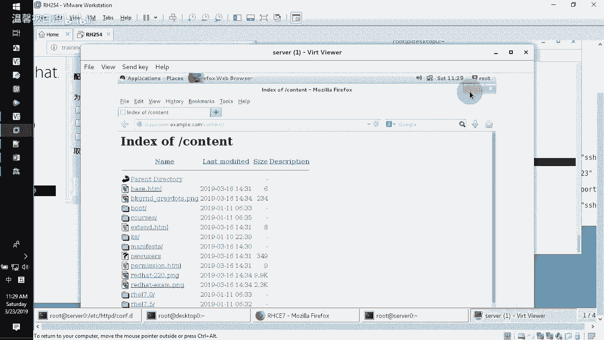

## 重启服务与配置防火墙

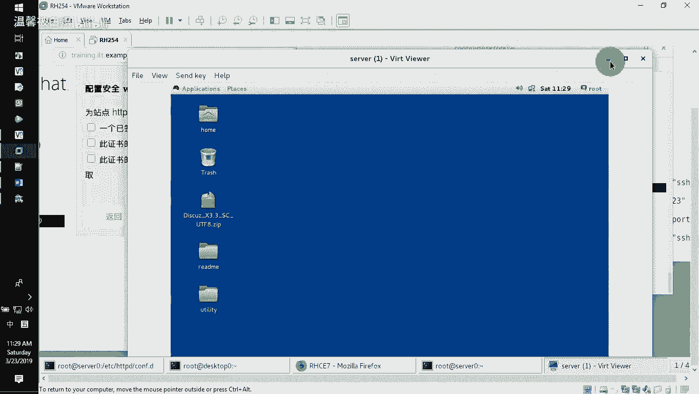

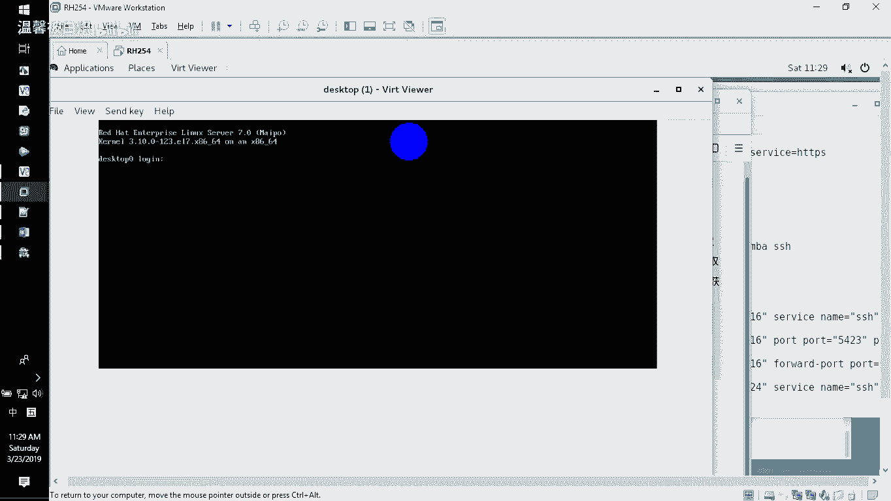

配置文件修改无误后，需要重启Apache服务以使配置生效，并确保防火墙允许HTTPS流量。

1.  **检查配置语法并重启Apache**：
    ```bash
    httpd -t
    systemctl restart httpd
    ```
    如果`httpd -t`检查无误，即可重启服务。

2.  **配置防火墙**：
    在防火墙中永久开放`https`服务对应的端口。
    ```bash
    firewall-cmd --permanent --add-service=https
    firewall-cmd --reload
    ```

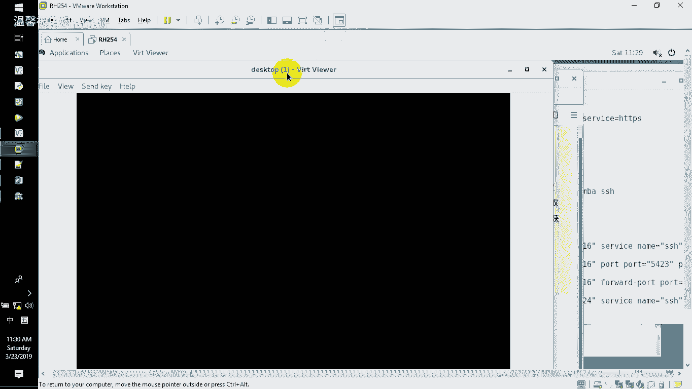

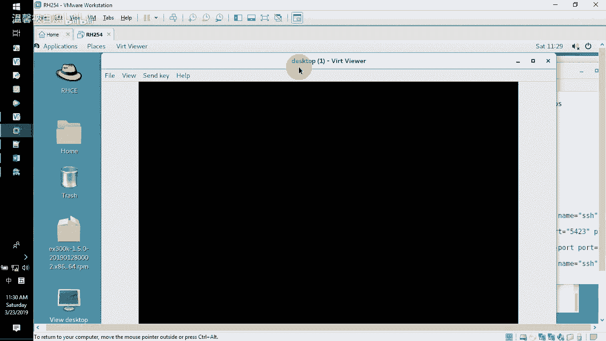

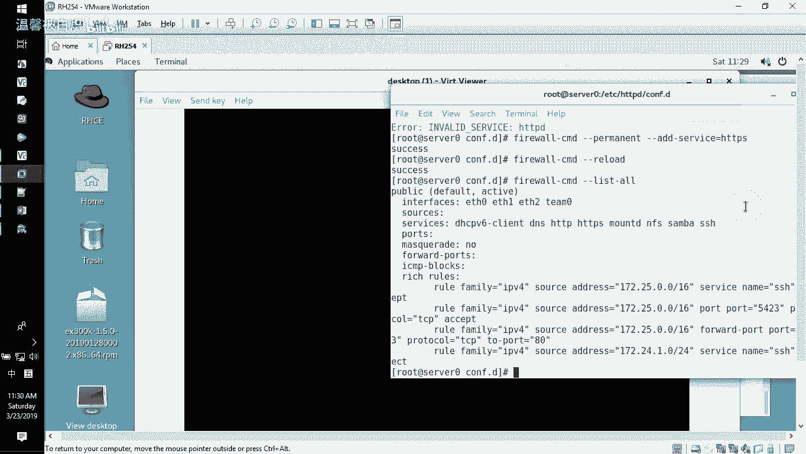

至此，服务器端的HTTPS配置已经完成。网站现在应该同时支持HTTP和HTTPS访问。

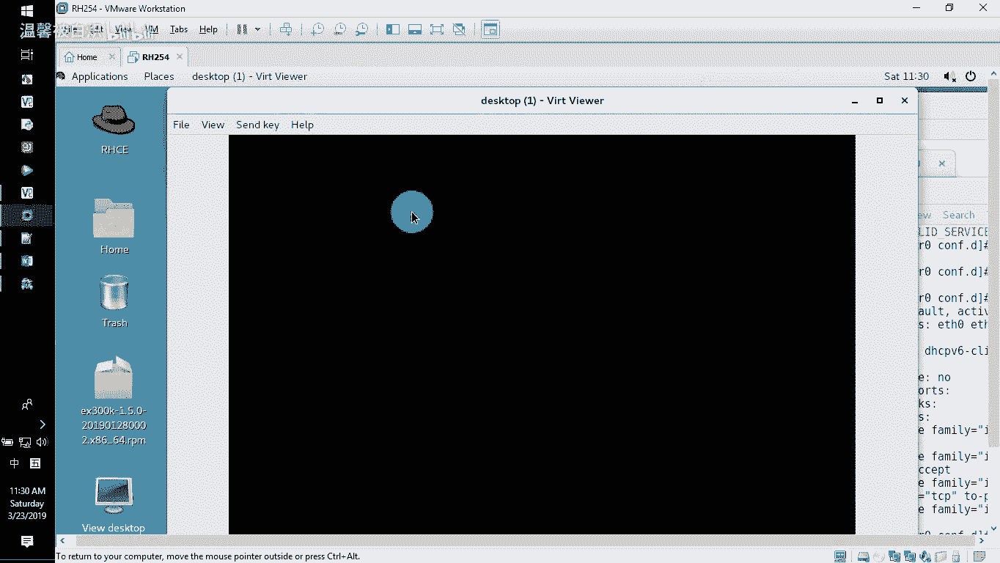

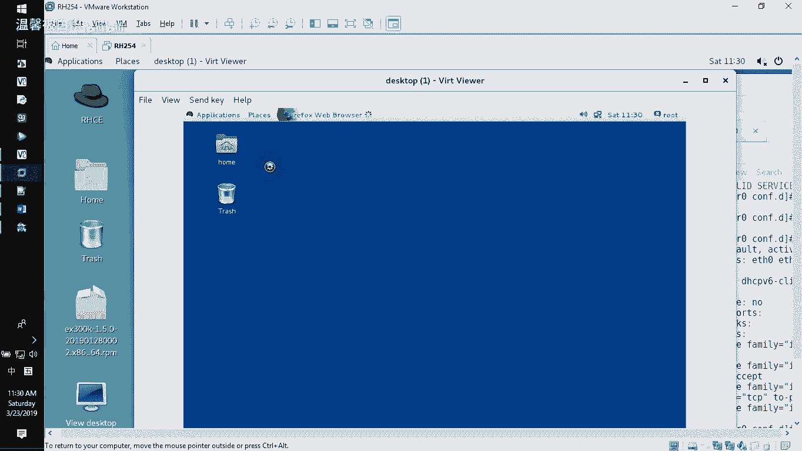

---

## 验证HTTPS访问

配置完成后，我们可以从客户端验证HTTPS是否工作正常。验证的核心是确保同一个网站既能通过`http://`访问，也能通过`https://`访问，且内容一致。

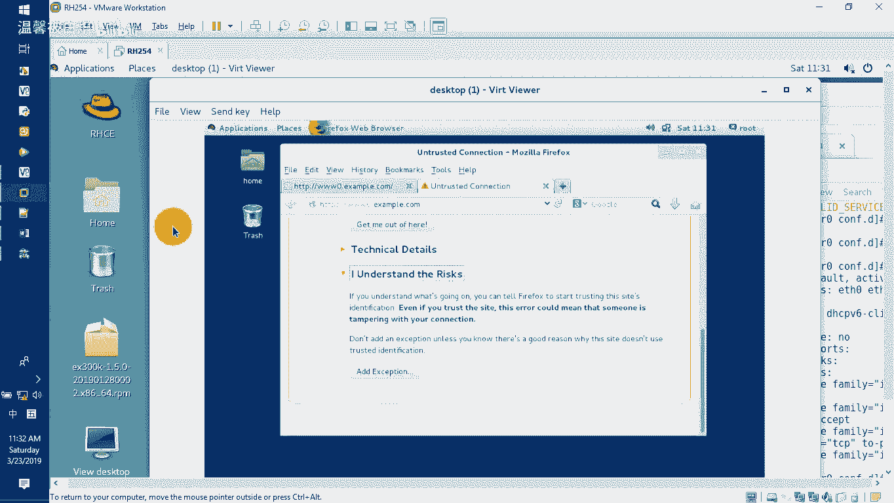

以下是几种验证方法：

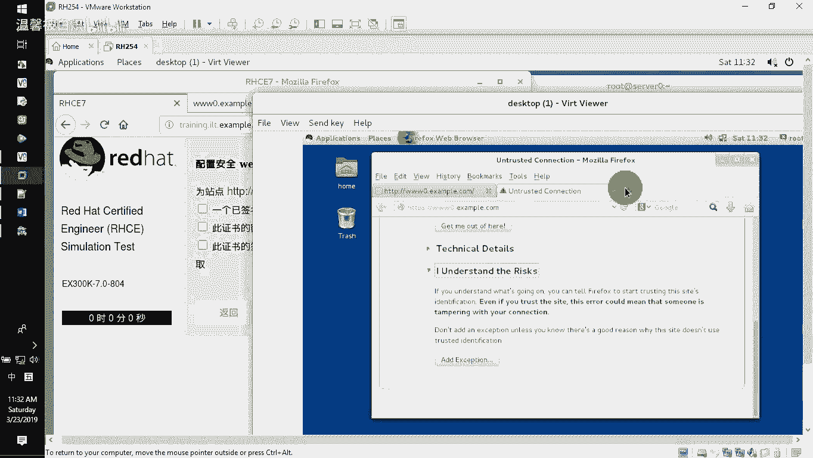

*   **使用命令行工具验证**：
    在客户端机器上，可以使用`curl`命令进行测试。
    ```bash
    # 测试HTTP访问
    curl http://www0.example.com
    # 测试HTTPS访问（使用 -k 参数暂时忽略证书警告）
    curl -k https://www0.example.com
    ```
    如果两条命令都能返回网站的HTML内容，则说明配置成功。

*   **使用图形化浏览器验证（补充说明）**：
    在图形化客户端（如Firefox）中访问`https://www0.example.com`时，浏览器可能会因为不信任我们自签名的CA证书而发出安全警告。这属于正常现象，在实验或考试环境中，通常只需确认能通过`https://`看到页面即可，无需在客户端安装证书。
    若需消除警告，可以将之前下载的`example-CA.crt`证书文件导入到浏览器的证书信任列表中。具体步骤为：访问证书下载地址 -> 下载CA证书 -> 在浏览器设置中将其导入并信任用于标识网站。

---

## 总结

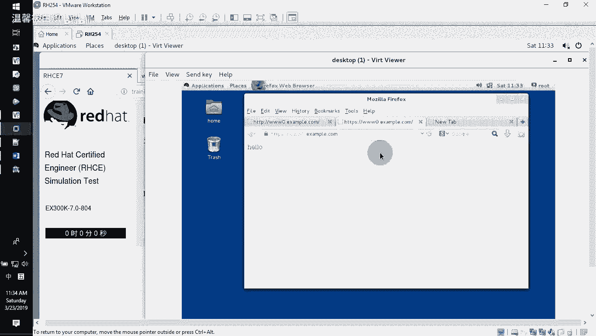

本节课中我们一起学习了为Apache网站配置HTTPS加密访问的全过程。关键步骤包括：安装`mod_ssl`模块、编辑`ssl.conf`配置文件、下载并正确放置服务器证书、私钥及CA证书链文件、重启Apache服务以及配置防火墙规则。最终，我们实现了网站同时支持明文HTTP和加密HTTPS协议访问的目标。