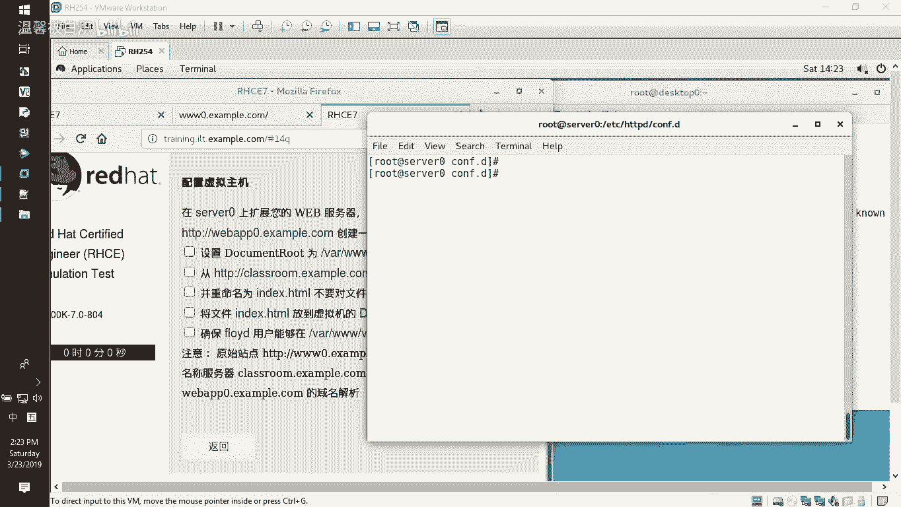
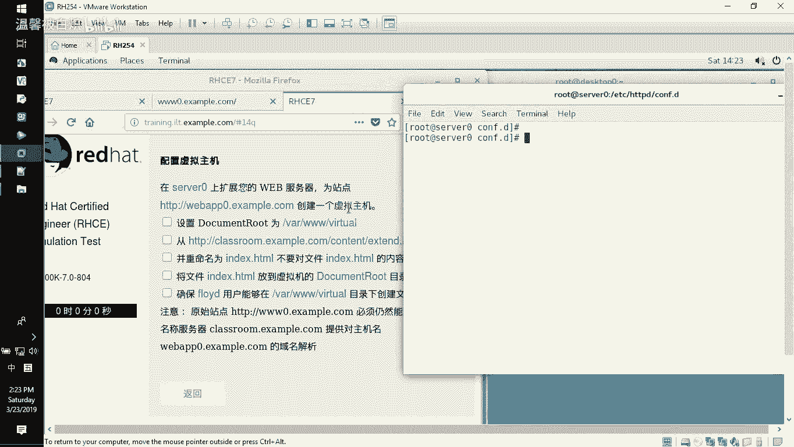
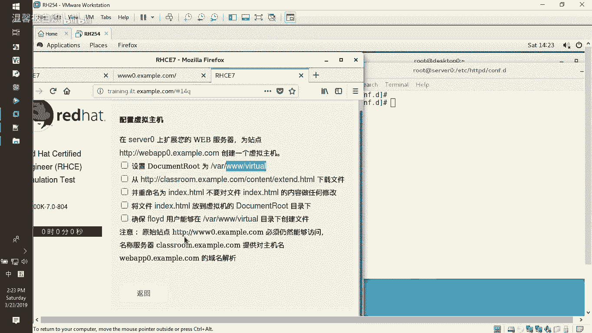
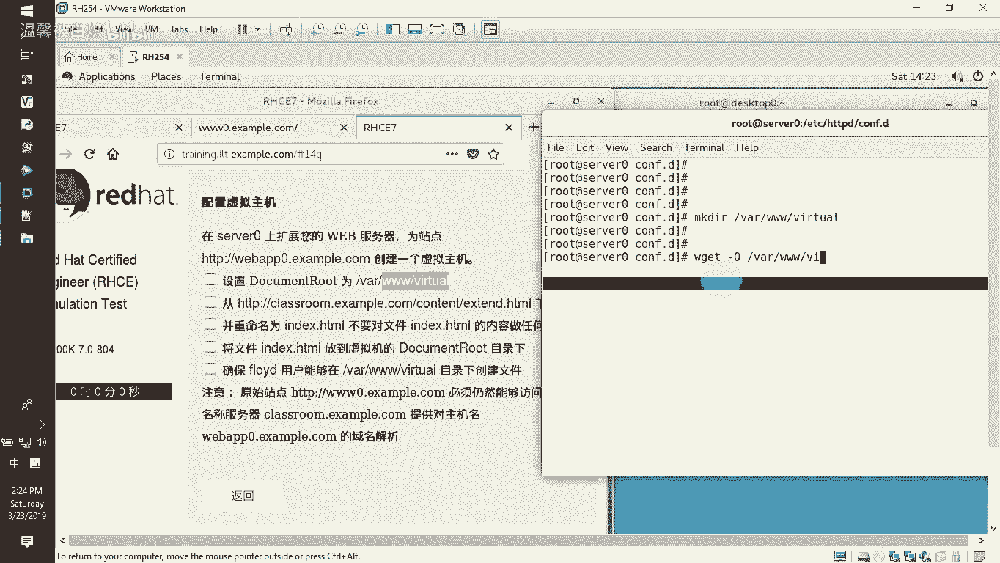
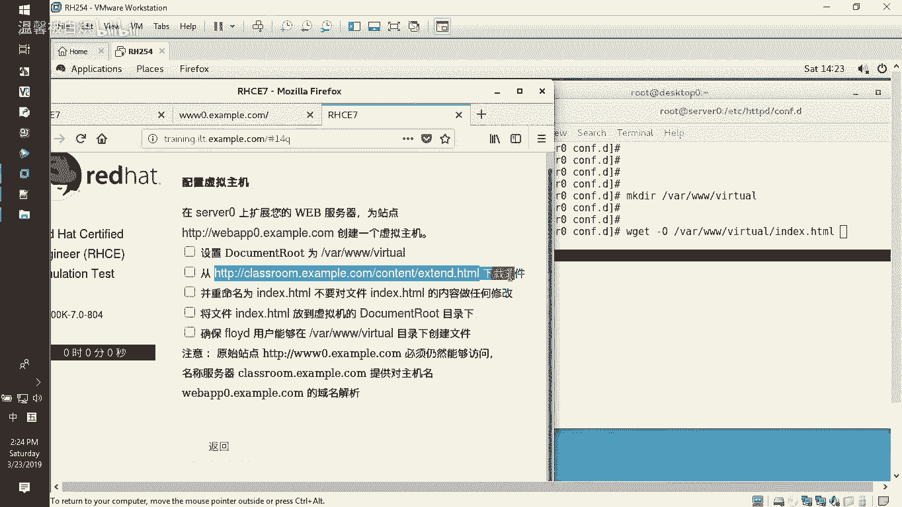
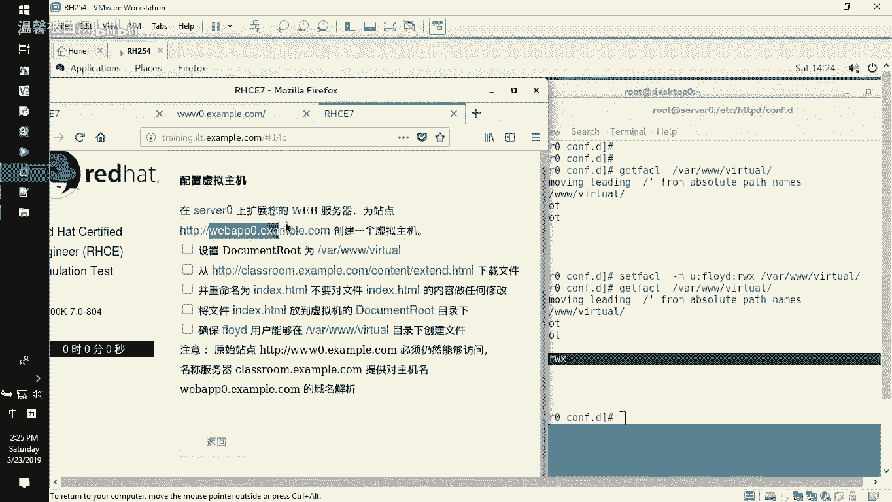
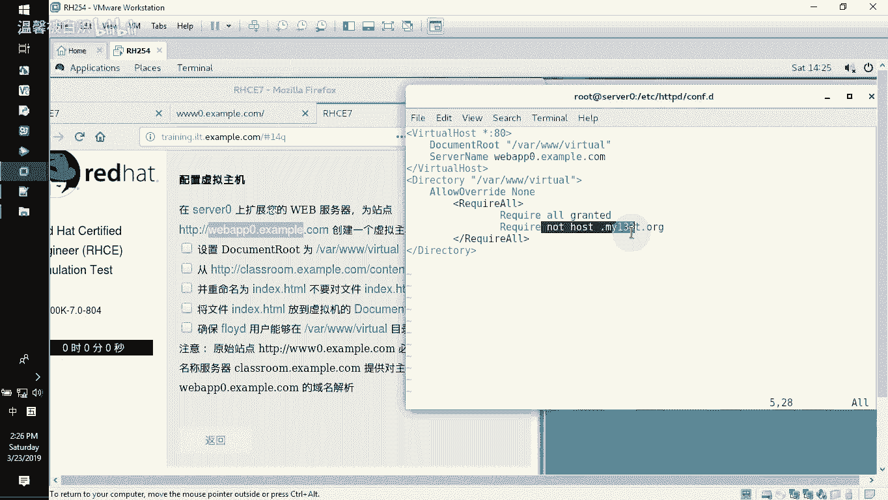
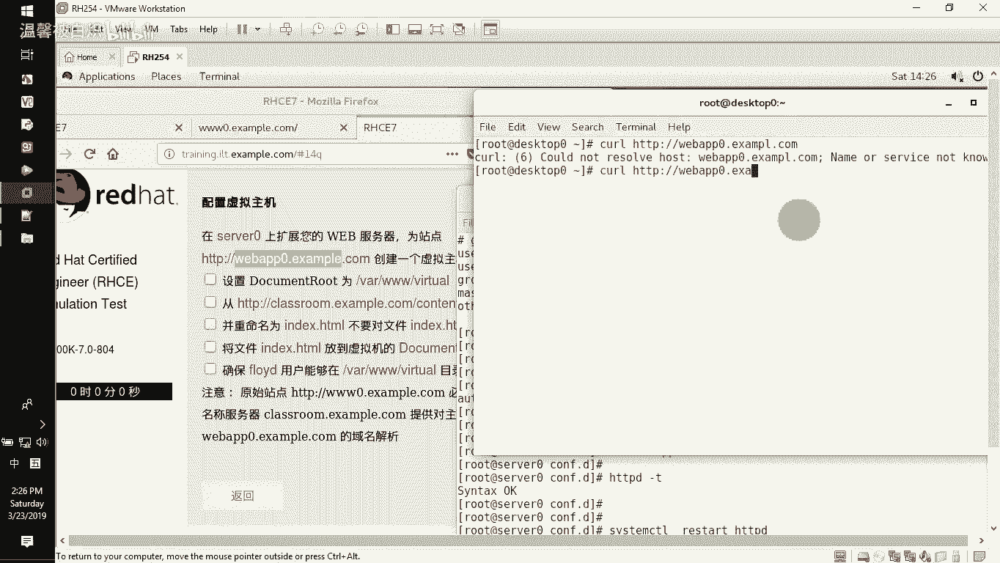
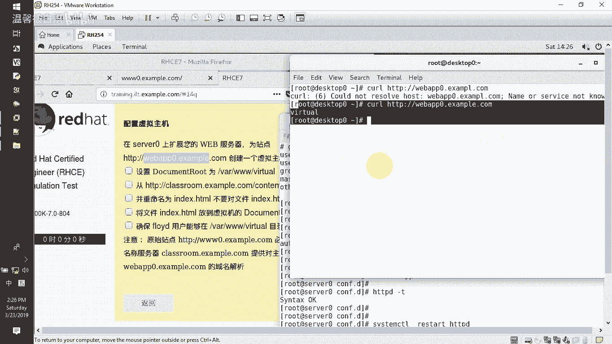
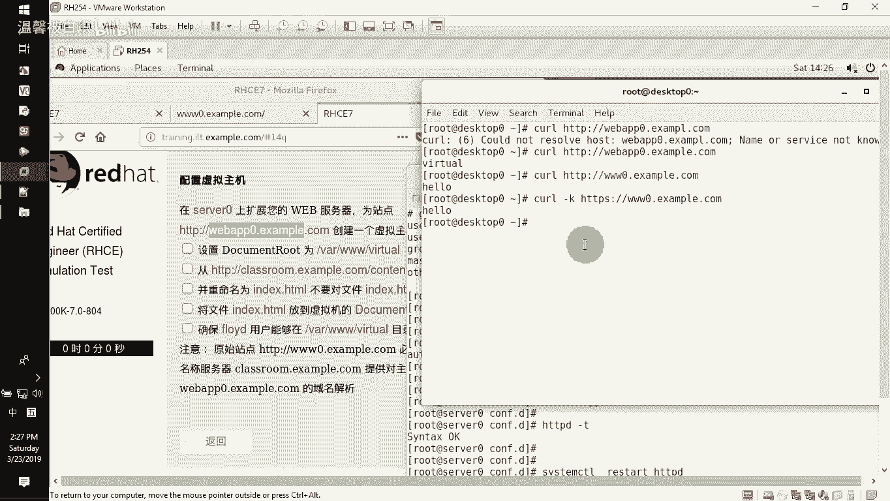

# RHCE课程：P9：配置Web虚拟主机 🖥️



在本节课中，我们将学习如何配置一个独立的Web虚拟主机。我们将创建一个新的网站目录，设置访问权限，并配置Apache服务，使新主机与原有主机互不影响。

## 概述



我们将从指定地址下载一个网页文件，将其放置在新创建的网站根目录中。随后，我们会配置Apache虚拟主机，确保新站点可以正常访问，同时不影响原有的默认站点。



## 创建网站目录与下载文件

首先，我们需要为新的虚拟主机创建一个网站根目录。





以下是具体操作步骤：

1.  使用 `mkdir` 命令在 `/var/www` 目录下创建名为 `virtual` 的新目录。
    ```bash
    mkdir /var/www/virtual
    ```
2.  使用 `wget` 命令下载指定的网页文件，并通过 `-O` 参数将其保存到新创建的目录中，作为网站的首页文件。
    ```bash
    wget -O /var/www/virtual/index.html [指定下载地址]
    ```

## 设置目录访问权限

文件下载完成后，我们需要为新目录设置访问控制列表（ACL），允许特定用户在其中创建和修改文件。



以下是具体操作步骤：

1.  使用 `setfacl` 命令修改目录的ACL。命令格式为 `setfacl -m u:<用户名>:<权限> <目录>`。例如，授予用户 `fooyd` 对该目录的读、写、执行权限。
    ```bash
    setfacl -m u:fooyd:rwx /var/www/virtual
    ```
2.  使用 `getfacl` 命令验证权限是否设置成功。确认用户 `fooyd` 已出现在该目录的ACL列表中。
    ```bash
    getfacl /var/www/virtual
    ```

## 配置Apache虚拟主机

上一节我们设置了目录权限，本节中我们来看看如何配置Apache，使外部用户能够访问到这个新页面。



以下是具体操作步骤：

1.  进入Apache的额外配置文件目录。
    ```bash
    cd /etc/httpd/conf.d/
    ```
2.  复制现有的虚拟主机配置文件（例如 `www0-vhost.conf`）作为新主机的配置模板。
    ```bash
    cp www0-vhost.conf webapp0-vhost.conf
    ```
3.  编辑新的配置文件 `webapp0-vhost.conf`。
    ```bash
    vi webapp0-vhost.conf
    ```
4.  在配置文件中，主要修改两个关键参数：
    *   将 `DocumentRoot` 指令的路径改为新的网站根目录 `/var/www/virtual`。
    *   将 `ServerName` 指令的域名改为新主机的域名，例如 `webapp0.example.com`。
5.  修改完成后，保存并退出编辑器。

## 重启服务与测试访问



配置完成后，需要重启Apache服务以使更改生效。



以下是具体操作步骤：

1.  使用 `systemctl` 命令重启 `httpd` 服务。
    ```bash
    systemctl restart httpd
    ```
2.  在客户端使用 `curl` 命令测试新虚拟主机是否可以正常访问。
    ```bash
    curl http://webapp0.example.com
    ```
3.  同时，验证原有的默认虚拟主机（如 `www0.example.com`）是否仍然可以正常访问，确保新配置没有产生影响。

## 总结



本节课中我们一起学习了配置Apache虚拟主机的完整流程。我们创建了独立的网站目录并设置了ACL权限，通过复制和修改配置文件定义了新的虚拟主机，最后重启服务并进行了访问测试。整个过程确保了新站点与原有站点能够共存且互不干扰。