# RHCE--第345678天学习视频 - P13：iscsi - 打羽毛球的橘猫 - BV1Bb411E73D

要给大家去做的就是。配置S加的服务端。那我们服务端的话呢，就搜我零这边去配置客户端的话呢，待会就是在digtop上面去挂载。我们先在服务器端这边。root进去，然后呢，选择密码。

因为这个机器呢是刚刚重新开机恢复快照，所以当他打开桌面的时候，还要把我们的。

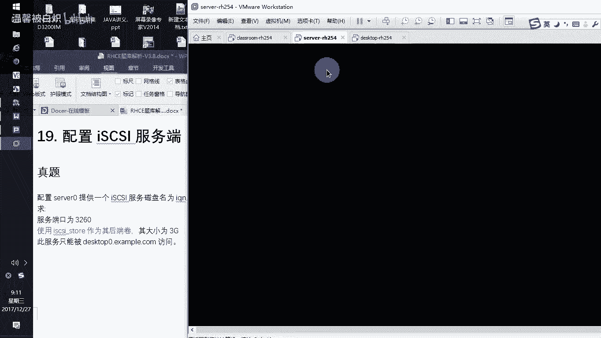

测试的这个题目环境啊，给他写进去。

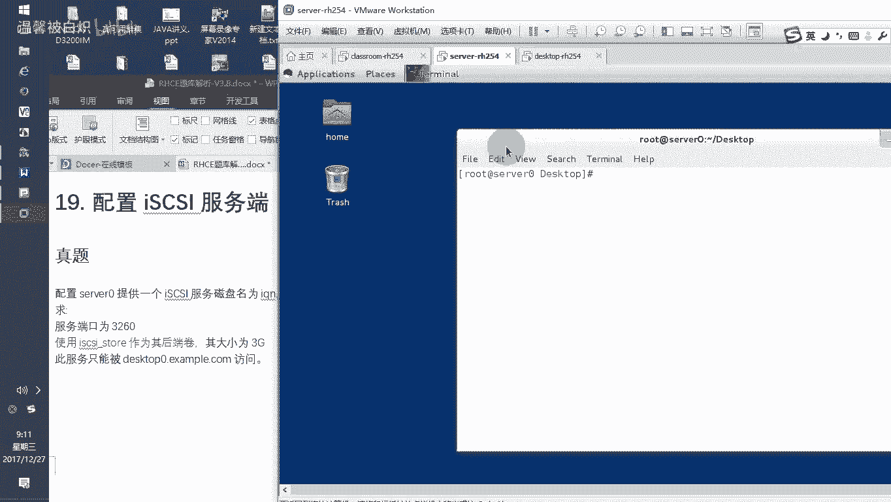

啊，因为我的这边的桌面比较小，所以呢我在缩小我的桌面的时候，你注意看，不要到时候看不到啊，我立即适应窗格大小就可以了。那我这边窗格比较小一些。

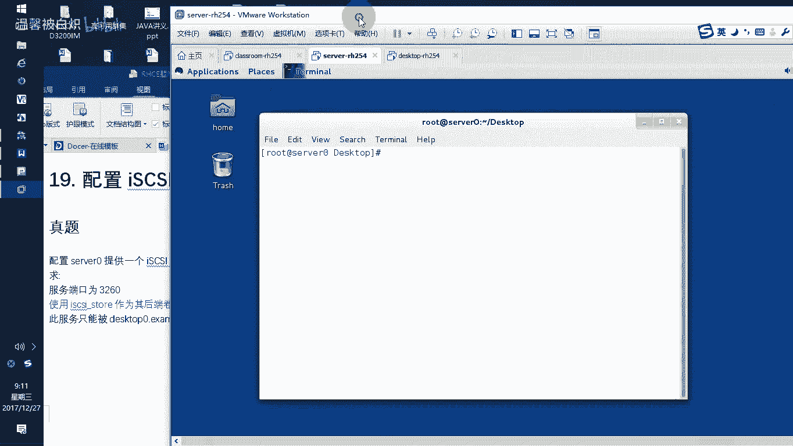

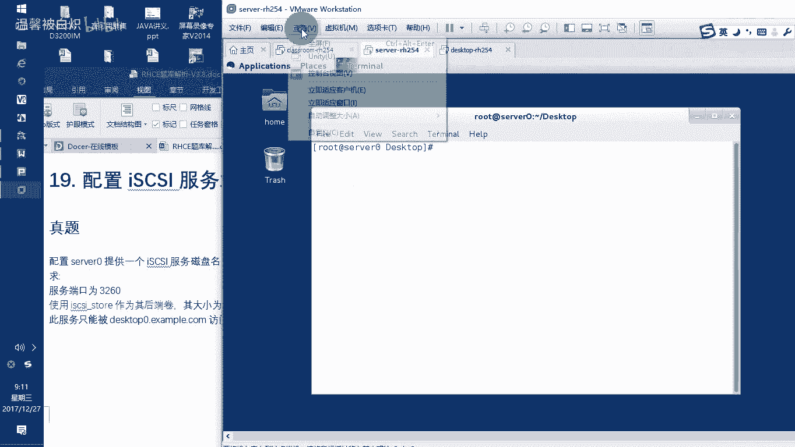

label。Exam IH C set up。

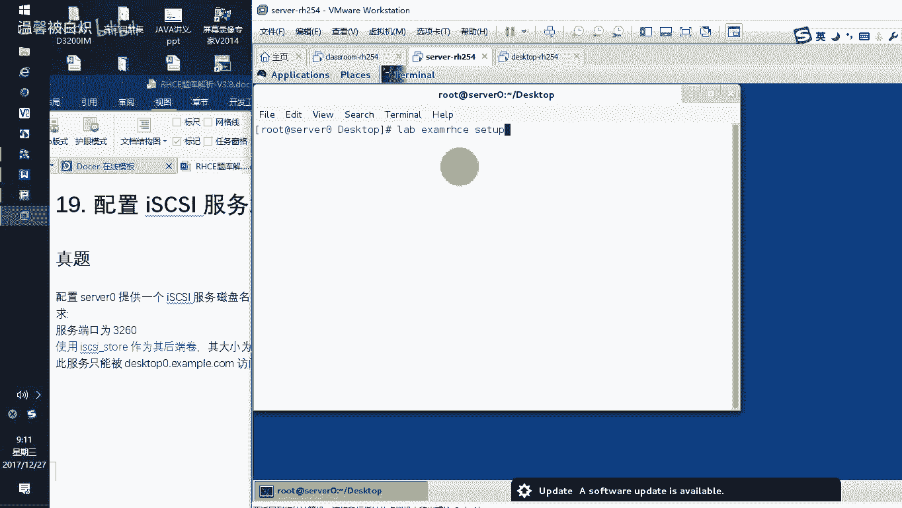

啊，包括我们的这个客户端，这客户端这台机器也是先开机。Read hat。啊，同理进去也要label XMHC set号，这个是客户端。

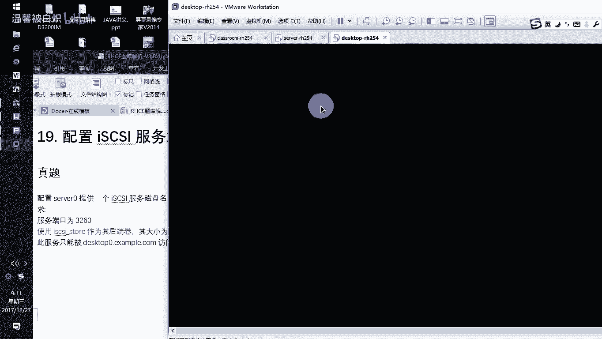

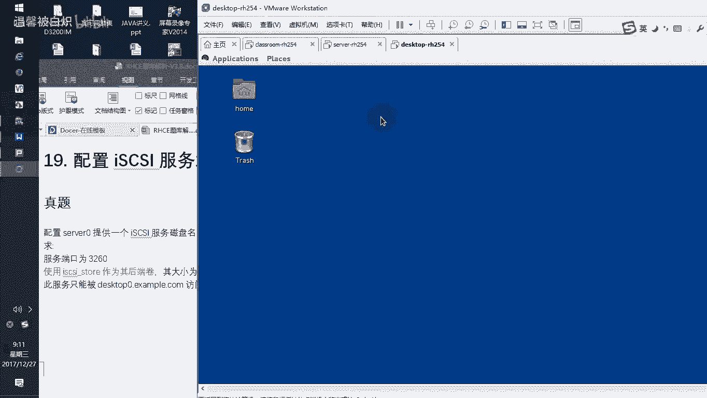

啊，我就先让他适应。

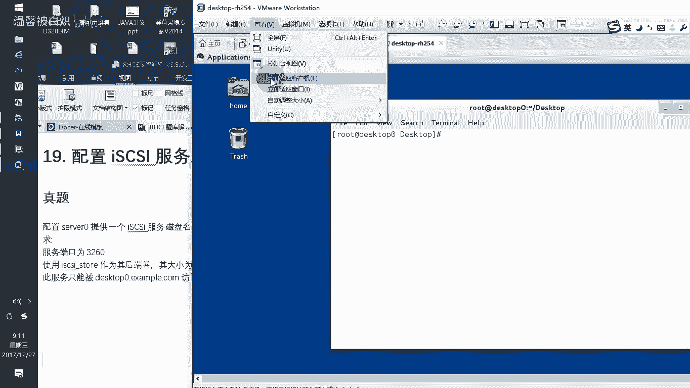

大小啊。然后这边。Levebel。XMIHC set号，这是客户端这边的，我们不全不理他。服务器这边的话呢，当你敲完了之后呃，虽然慢一些，但是应该还是很快就过去了。那么当它完成了之后。

我们就可以开始去做这个I gas的服务器端的这个配置。那么他服务器端里面再注意看啊，他要求后端有一个券，后端一个券。那么首先我们要提供一个券出来给他。好了，注意看这里。

Fdi减L来看我们有没有哪块盘是没有用的。哎，有一块DV下面SD boy对吧？确实有一块盘是空的。那么这块盘的话呢，在应用的过程当中，我这边是空的。你们考试的时候。

如果不是空的那你就用一块已有空间的这个就已经开始分配过的，但是还有很多空间，你划分一个大于3GB的这个空间出来就行，明白吧？啊，那我现在的话呢我就用这个。CFD加DV下面SD boy我们这边确实是空的。

然后新建。记住选择我要求都是用裸辑的，不要用主分区，好吧，用裸辑分区。裸辑的话呢，我在这边我给一个，比如说4GB，那就4096。4096，然后从这个bein尼这个地方开始。好。

类型把类型改成我们所说的8ABCDE就LVM的卷组，对吧？啊，回车。然后你可以看到他现在确实是给LVM啊，确实是给LVM他的设备号是SDbo5。好，那接下来保存。保存我刚按了什么东西？我怎么感觉好像。

更多了一点东西一样。啊，重来一下，我我记得好像我刚刚摁了一下，我删掉，他重新来过，删掉一下新建。逻辑。4096回车。从这个地方开始。类型。然后选择8一回车。保存。Yeses。啊，然后呢。

记住是SDboy5LEM啊，然后呢选择离开。这样呢有了1个SD boy5了之后，part重新探测分区变化。接下来呢你就可以直接的去做逻辑卷啊PV createDV。下面SD boy5。

然后呢新建个VGVGcre。比如说VG name叫VG。一。用DV下面的。SDbo5来这个创建。创建完了之后，LV create哎，大家注意啊，杠大小多大，他说后端卷提供多大哎，3G。

那就是我们写个3G给他3G给他。然后呢，杠N name实际上就是这个看到吧？啊就这个那ISCSII guess下线st。啊，然后呢通过哪个VG创出来，就VGE创出来。好，那我们就有个设备了。

这个设备的话呢，就是DV下面的VGE下面有一个那个叫ice gas，这就是我们的这个。后端券看到了吧？这是后端券啊，那么有了这个后端卷了之后，接下来我们需要你去作为I开始去提供提供这个后端券。

把这个实际的这个券把它提供出来。首先你要做的事情是一样安装减Y安装一个TR target啊t。那么这个ta给的话呢，就是我们的S guys的目标S guys的目标t给啊，记住这个TRGT。

target他没有直接弄出来，我们看看target CLI啊。呃，多加一点嘛，part给CLI看到吧？好，回车。这个是S guess的目标的这么一个配置环境啊，S guess目标的这么一个配置环境。

有了这个配置环境，安装这个软件包。接下来我们需要大家注意做的事情是这样的。System。CTRUn target。啊，你看快给店service看到吧？开机就开起来，我现在就要求你干嘛？开起来star。

我现在要求你开起来看到吧？那么现在开起来的时候，你可以去看。😡，杠NP管道过滤一下，看有没有那个3260的端口对外提供呢。服务虽然已经开启，但是没有任何一个设备提供出去的，明白意思吧？啊。

所以你要把设备提供出来好了，那么怎么提供呢？提押。他给。CLI注意就是这个就是这个关键字啊，注意看啊，tCLI。那么在t给CLI里面呢，我们在书写命令的时候啊，书写命令的时候L。

这边呢你可以看得到我们的这个block物理设备，就快级别设备是没有的。然后S gas是没有提供的，看到吧？好，来，接下来我们开始啊，注意啊，看到这个东西呢就很容易去做了啊，用LS调出这个内容了之后。

接下来。在因为它这个地方是从根开始的，你就要跟下面的b跟下面的scuss啊，跟下面。Bracks。后面的话呢，我们在bs后面table两下，你会看到在brracks里面。

它专门的话呢会有我们的这个快级别设备啊，backb后面注意啊。不然后面再次推拨两下，那么他会告诉你。😡，这有个create。CREATcreate看到了吧？不要说到时候你不会去写。

因为你可以table可以table好了，b create create什么呢？cre就是新建一个设备，这个设备呢就叫IS。CSI下线1多人。那么它是通过哪个物理设备去建出来的呢？

这个快级别设备是通过我们DV下面的VGE下面的ISCSI下线story。啊，通过这个现出来的，也就说我现在提供一个快级别设备，这个快级别设备就叫Icar story。它对应的物理设备是这个看到了吧？

对应的物理设备是这个这个物理设备是我们刚刚通过我们自己的那个呃LEM的这个方式建出来的。好，有了它这个之后，大家注意看我们在LS来看啊，是不是有一个设备S gas的这个s，这是快级别设备看到了吗？

有的好，有了它了之后，接起来跑到这个S gas这边。跟目录下面的is discussion好，那么ice guess后面我也不知道写什么tableable一下。啊，tableable的时候。

你又看到它这里面有个create。我们要新建一个一个目标。哎，这个目标就这个名字啊，注意看这个名字老抽长了啊因为我觉得它比较长，所以我把它copy一下啊。回到这边，我们要新建一个的一个目标啊。

它的目标就是IQN点2014这个你要看题目了，到时候你们那个题目肯定不是2014了，肯定可能是2017了，明吗那么这个名字新建这个你注意新建的过程当中，它不单只把这个的这个目标的这个名字新建出来。

它还在里面去配置了一个PE啊区然后你注意看了又看一下，你看它是不是在里面有个设备看到吗？我们正好的话呢。去到I gasIQN后面有1个TPE，我们直接记住它不用加CD，直接加路径，直接就过去了。

那么到里面去了之后，我们注意看以后在这边。🎼L1下，跑到这边来LSS的时候，你看到这里面的话呢，就有个ACL这里面有一个设备对应，这边呢有一个端口提供设备。ACL的话呢，就是可以给谁过来访问我这个设备。

来，你注意看啊，这里面的话呢有个ACL，因为我已经去到这个。IIQN这个后面有个TPGE了，就实际上是进到S进到这个设备里面的TPGE里面去看到吧？里面才会有这个ACL好。

那我打开ACLACL后面的话呢，我们直接就create新建给谁过来访问啊，给谁过来访问。那么这个机器的话呢，他说了这个服务只能给这个人过来访问。看到吧？只能给这个人过来访问。

所以呢在这个地方我在书写的时候，我就直接书写IQN杠。呃，IQN点2014，然后呢，杠11点com点exampleMPLE点，我就给这个digDESKTOP0可以过来访问我这个设备，就是ACL啊。

我自己写了一个，你看。excL我的这个设备待会就给这个人注意啊，0就给这个人明白啊？那待会怎么指定给这个人呢？你待会去看我客户端上面装完软件包，我就让他初始化，就为就初始化的名字，就这个明白意思吧？

我就把我自己初始化就这个名字，那我自己就可以连过来，别人就连不过来，能明白吧？好了。做好了这个客户端的这个名字了之后，接下来在。LUNS啊，这是设备对应关系啊，设备对应设备对应的话呢。

我们在c设备对应对应谁呢？这个设备实际上就是 gas的底下的这个IQN啊，挺凑长的这个IQN。那么这个设备的话呢，它要对应上的是bro里面的这个设备，明白意思吧？所以呢我们在c的时候。

我们就直接b下面书写的这个呃back story下面的b下面的这个 ice gas杠 story，这是我刚刚新建的大家注意这是我刚刚新建的它新建的时候，它对应的是一个物理设备来的。

对的是我们DVVG1项面的这个对不对？好了，然后回车有了设备对应关系，你L来看啊，你看这边的话呢，有时候给谁用有对应关系啊，就是由我们对应的到这个对应到这个物理设备上面，接下来到端口提供。Pot。啊。

就port a后面的话呢，create给谁提供这个主机的IP172。25。0。11，它后面加上3260，很容易出错的地方就是同学们在做的时候，这个地IP地址，后面直接加个冒号3260。

实际上这个地方是干嘛？空格记得吧？空格好了，3260好了，他就告诉你是在这个IP这个端口上面提供，看到了吧？他直接你写完了之后，就是这个IP就这个叫端口。好了，那正好我们L来看，你看看的很清晰啊。

看的非常清晰。这是我们看到的这个设备提供。那我们在。退出来。退出来了之后，你可以看得到我们这个设备的啊，那我们这边的话呢，EXIT退完出来，然后呢，再重新进去的时候，你可以看到我们的这个设备。

比如说我现在去到跟这个地方L给大家看。那你可以看到back设备。有对应真实物理设备。car有一个对外提供的目标名字。这个目标名字的话呢，给谁来过来使用，给这个客户端过来使用。这个IQN的话呢。

它所对应的broack设备，就这个那你可以看到它对应的就是这个bro设备。然后允许从哪个接口上面的一个端口提供，就这个看到了吗？啊，看完了之后这个在服务器上面的这个配置的话呢。

对于scar的话呢就算成功的了。那另外。我们退出来EXIT退出来，退完出来了之后，我们来看啊。刚刚你不是看那个端口提供的时候，3160是没有提供东西的吗，对不对？正好来看有了吗？有了。

就因为前面你已经做好了。好了，接下来你要在服务器上面的这个防火墙上面把这个端口给它开启。Fire were gun commander gang gang pro。

 G gang Eddie gun port。等于。那个3260斜杠TCP你看他前面写的是什么什么端口。TCP的端口对不对？我们就提供这个TCP的这个端口出去给人家。好。

然后再rero一下我的这个防火墙。正好到此为止，我们的。这个防火墙就是我们的这个SGS，包括防火墙这边已经配好。那接下来大家注意啊，这个地方有一个关键点。但好客户端初始化一定要是这个名字。

因为服系要求ACL里面就是让你能够用这个名字过来，明白意思吧？你的客户端就必须是这个名字好了。在客户端这边。接下来我们需要做的就是样。Inst。这里面的话呢有个ISC。

SII gas杠ator就init这个杠youtu这个软件啊减Y去安装。记住客户端安装的是S gas杠in，而服务器安装的话呢是套给CLI对不对？不一样的啊啊，减Y。安装完成了之后。

不要急着去启动我们的这个服务，记住一定要不能启动服务，先修改它必须是这个客户端的名字。也就是说这个名字必须要是它才可以去启动，明白吗？因为你刚刚装完软件包的时候，客户端它就是一个类似像空白的。啊。

他不是有初始的这个名称。好，我们等待一下啊。😊，哎，难道死掉了吗？你好像真死掉了，天哪。我这个客户端刚刚不是活的好好的吗？啊，那死掉的话呢，我就重来哈完我这个地方我就开始看着不动了。

装个软件包就不动了啊。好嘞，那就重新的去。

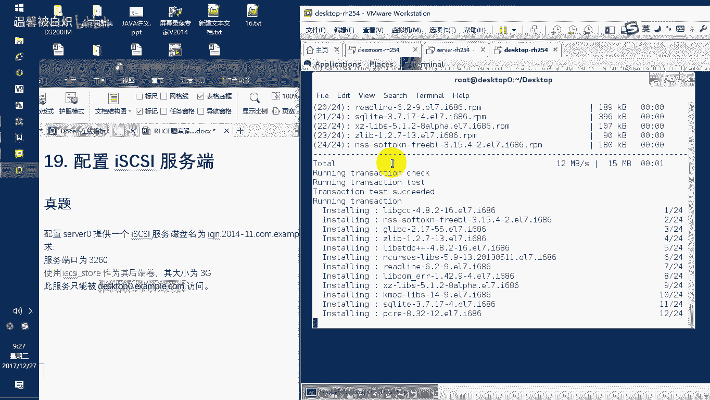

恢复一下初始快照。然后我再重新打开一下它。啊，这个客户端刚刚没准备好哈，我们正好再重新准备一下。

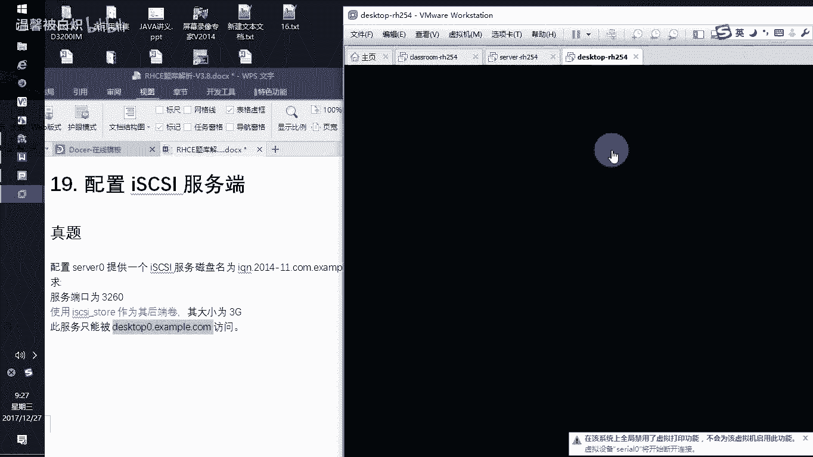

重新进入系统。

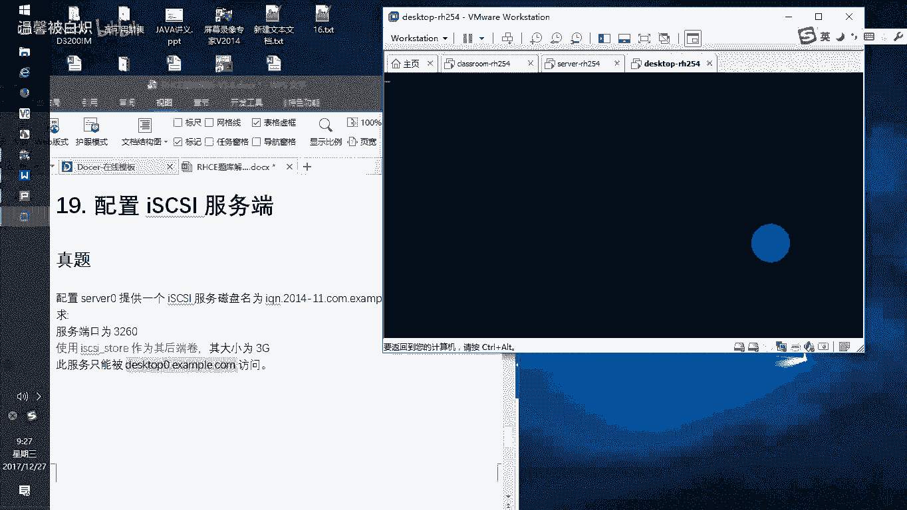

好，客户端这边打开。

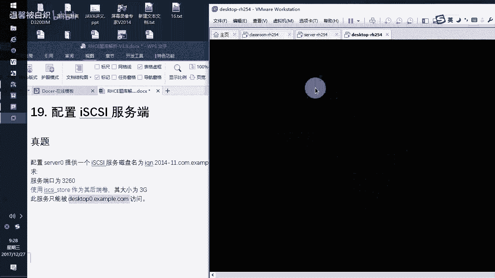

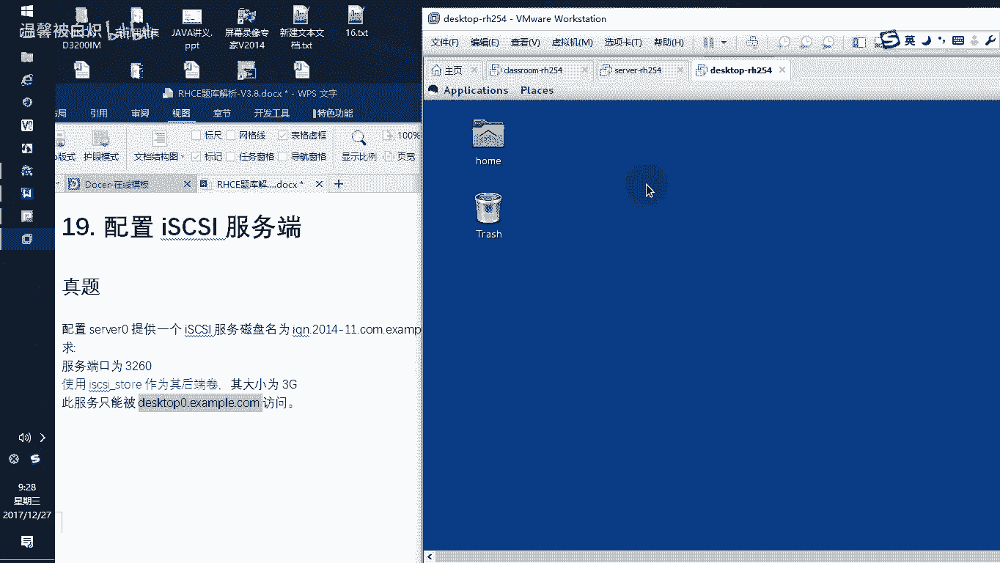

内bel。Exam IH C set up。

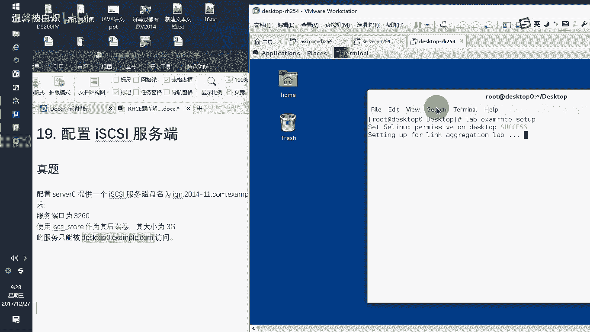

让他先准备哈，因为这边客户端的话呢，还要安装一点时间。那我把这个。2十题点出来给他看。2十题。20的话呢，实际上他这边就说了说了很明很直白，就是我们所看到的这个客户端，客户端要干嘛呢？客户端这边呢。

要连到服务器上面，把服务器上面的这个目标挂载到本地，并且自动挂载。在S gas上面要新建1个210兆的这个分区格式化成EXT4来挂载在MT下面的data上面，然后实现自动挂载。

也就是说客户端上面的话呢要挂载服务器上面的这个S gas的卷子，对吧？好来。呃，这边的话呢因为还比较慢一些啊，我们稍微等待一下。不要又死掉了，死掉我就纠结了。来开始啊哈。😊，YIn I guess。

g initial eight杠 youtu减Y自动回来个yes啊，不要再死了。刚才是装到12个的时候死掉了对吧？我就不信我就等。不会不会，之前做从来不会出现这种问题。干嘛呀？这是。哎，可以了。

刚刚那个地方是有点小问题，哎，这还是过了，好吧。好，装完了之后，大家注意我说过了，千万要记得不要这么快去启动这个服务，先要干嘛？修改自己的配置文件。

自己配置文件的ETC目录下面S guess这个地方里面的话呢就有个初始化的这么一个文件。inial it name ice guess，这就是我们看到的initate name。在底下的话呢。

这个initation name这个地方你必须要改改成什么呢？我初始化的时候，我就是把我自己弄成那个叫什么呀？哎。我只是要弄成这个名字，明白了吧？这样的话呢，客户端他这边说了么我客户端。

你只能是这个客户端过来，那我就把我自己弄成这个客户端名字不就行了吗？对不对？那我就把我自己弄成这个客户端名字啊，来，我就把我自己弄成这个客户端名字。好了。保存内珠。这样呢我们才可以去sstem。C条。

Unableable ice gas。记住啊是S guess，然后呢，我现在就可以去开放开一次我的这个S gas star，我就可以开。看到吧？记住你不能先开服务，然后再去改这个初始万名。会错的。

记得啊，你们考试的时候一定要清楚这个。如果你先开服务，再去修改初十万名。这题永远做不了。就直接就没分，告诉你，你要做的就先改初始化配置文件名字，让他对应上服务器上面要求的这个名称。然后呢。

你就可以在后面修改完初始化名称了之后，再启动我们的服务。明白吗？好，那么启动完服务了之后，接下来我们就要去挂载服务器上面的东西。当挂载的时候，三条就两条命令就是第一条发现设备。第二条挂载。

但这两条命令的话呢，说实在说实在的，我从来不会去记忆它。为什么呢？因为我在这边有一个非常简单的方法。它是用一个ice gasad去做发现的，就是客户端的命令就这个。但是我从来不会记记后面的参数。

因为太长了，我通常的话呢就用万能的帮助man一下这个ice gas a。记住啊man一下 gas a。那么这个名字的话呢，就是为了让我们在后面知道找什么东西。这个帮助里面有一个叫example。

就是亮丽啊，注意看按空格键空格空格空格。到后面你看到有一个叫example。啊，过了。样例看到吧？example。那么你看到这个exle的话呢，我非常给力的告诉你啊。

I s杠杠杠 modedicoveryDV杠table send targetsport加上目标的IP地址。杠杠discovery，这就是发现，这就是发现发现什么呢？发现我们所说的这一个目标。

我为了让你看到效，果，专门在这边，我上向上一点啊，我就告诉你啊，我就这么写，我就按照它来写，看到吧？I guess。Add me。Gang gangang帽 discovery。李斌。

杠杠tableple。三的。他概是。杠杠port。172。25。0。11。刚angdiscovery。好，有没有发现这个服务器上面提供的这个设备是不是我们提供出来的？对吧然后呢提供了这个设备了之后。

你看呢底下就有一个loing嘛，loing就是这个啊I guess enemy。😊，杠杠mod节点not。t name就把这个tet名字写出来，然后port连接的这个IP和端口。

杠杠loging就把它连过来啊，来开始了。S guess and me杠杠 mod节点not杠杠退给。name这个t name的话呢，就是我们这边的这个。哎，你把它copy过来。copy一下，然后呢。

这边直接粘贴一下，pass粘贴。好，然后呢，接下来的话呢，在这边直接杠杠。port A啊，然后呢。172。25。0。11，我是从这个服务器上面的这个3260这个接口上面提供的，就是拉过来杠杠loing。

回声好，大家可以看到这边的话呢，有一个已经连接成功了。看到吧连接成功了，然后呢，连接成功了之后，我们可以LS block BLK。LB快设备嘛，列出快设备，我们来看看这边有没有一个3G的快设备叫。

SDC看到吗？那么如果我不想要这个快设备的时候，我可以把这个杠杠 login改成log outOUT。哪个机器在响？好，来。回车，那这个地方我又我又把它卸成功了。

然后我们再LSbro来看还有没有那个SDC。没有来，我们再重新挂着它，记住啊，这个他要求开机挂载，你只要把它做上去，他开机就帮你去挂载这个东西明白了吧？开机就帮你去挂载。好了，那么再去看的时候。

LSb哎来了，有这个有这个这个是，你看他直接拉过来类型什么东西。Disk。硬盘它是类似本地硬盘这样用，没有啊？好了，那简单了。有了这个之后，我们直接把它分区。CFdi加DV下面的SDC。

然后新建一个逻辑多大，他说这边他说要提供多大。210呃，就22100兆，那我给他2000。100。21这个80兆啊，我就给多80兆，好吧。我就给到80兆啊，2180好了。

然后beginning从这个地方开始。然后接下来的话呢，我们类型改成什么类型？他的类型的话呢是呃。82为。交换空间对不对？然后83为linux分区linux他今天他今天要求他做的是什么呢？是EX4。

对不对？所以我们就83就可以了。好了，然后呢，你可以看我换成83了之后，他这边类型直接给你换成一个什么东西。Les。然后保存。yes ySy好，然后这就是SDC5，我们退出来。有了这个的之后。

接下来呢我们就可以开始去新建这个挂子点，然后格式化啊。MKDR，我们在MT下面建一个data准备做关点，然后先格式化我们的设备MKFS点EXT4你要注意看它提示你是格式化成什么类型，好不好啊。

那我这边的话是E提4对刚刚的这个DVSDCE我记样这是SDCE啊，不5说错了。看到吧？啊，我刚刚都差点有点忘记SDC5啊。回车，然后把它格式完了之后挂载。注意啊，挂载的话呢。

我们一般情况下选择是用自动挂载的方法，就是修改那个M table。但是一定要记住他用UUID的方法。所以。BLKID然后看DVSDC5。哎，来看这个有没有看到的UID。有把它拉出来。

它的类型你可以看到也提示的哈差品。VIETC目录下面FStable好，在后面。直接选择UUID。然后挂着脸。到了吗？啊，那稍等一下，我把它连过来。啊，为什么每天都会断一下呢？稍等啊。可以了吧。好。

那有了这个UID了之后，接下来的话呢是挂着点挂着到哪里去呢？这个地方挂着到MNT下面作为这个data挂着点。

它是EXEXT4的文件系统DFATS大家注意默认后面一定要加上这个在这个地方这是考试的这个考点来的。如果你不加下线netDV。扣一半的分数。明白，因为这个设备是什么设备？😡。

网络设备一定要加个netDVOK没啊，来零空格零。那这样的话呢才可以保存退出。mount减A啊，可以看到没问题。DF杠大截起来看这边哎。他要求两两千。100兆啊，我这只有多少的只有多少。

两句我不知道过不过啊，来试一下labelEXANHCEgre。啊，这个是二十题，你只要看二十就可以了。哎，你看。大小不够。但是呃我已经给大一点点了，但是还是不够。那你们在做练习的时候，你可以给大一些。

好吧，可以给大一些啊，那这样的话呢，我们的这个呃题目的话呢，就OK然后在福器这边来看看。Level E X A M，H C， E great。然后再看一下十九题，因为这边是19哈。福务器这边是19。

16171819。哎，还有一个地方报错啊。3260没问题。防火墙诶。防火墙他怎么会提示我有问题呢？3260端口开着的。难道我们要拜防火墙这样做吗？来试试一下啊，fire。沃干。configure。

难道我们要在附规则里面去增加吗？在。For没 it。我们看看服务器这边有没有那个。他겠。啊，没有，那没有，就在这个地方加了。专门针对的是IPV4的。高安考。是3260，然后是给谁用呢？允许。

这个IP地址172。25。0。10，就是这个客户端的IP明白啊？啊，然后斜杠24位的掩码，这IP只写IPR，它只允许一个人嘛，所以就写IP然后O做好了之后呢，选择re firework。是吧。

那做完这个的话呢，我们再去看看他的这个内容行不行啊。刚刚提示我们的这个问题觉得有点怪异。S guys服务器ACLACL我不是设了吗？难道我的AL名字不对吗？天哪，这个问题严重了。有可能我的AL名字不对。

来，我看看他Acel名字书写成什么了。

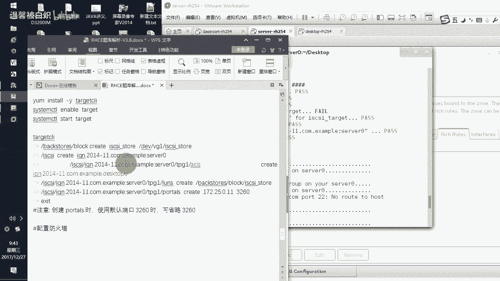

他要求我们写成的是。他没要求啊。难道我看过他这边。还有啊A，你看是这个名字啊。我写成什么了？啊。那那现这就没办法了。那那那这个这个就纠结了。好了，来，那应该这边是我刚刚写的那个exL那个名字。

估计我写错了来呃，给。CLI然后呢，我们LS看看我这边写成什么呢哦。他监视是一个冒号，我写成了一个点，所以这个地方是写错了。但是大家注意这点小问题的话呢啊我也是纠结了。当这个只是我在这边的。

你们题目里面根本他就没有要求你客户端是写什么名字，只是说能够被这个客户端访问，对不对？那我确实被这个客户端访问了。好了。结受一下录像先。

