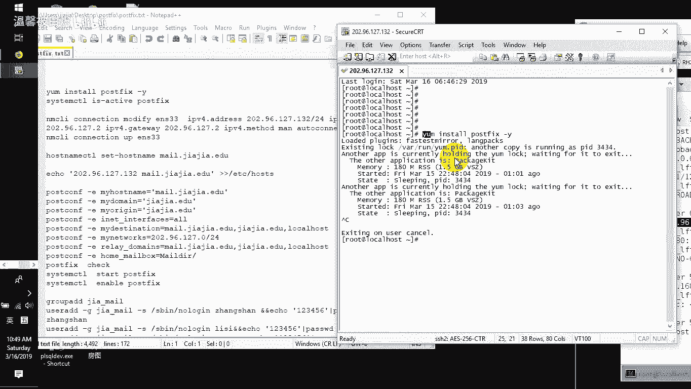
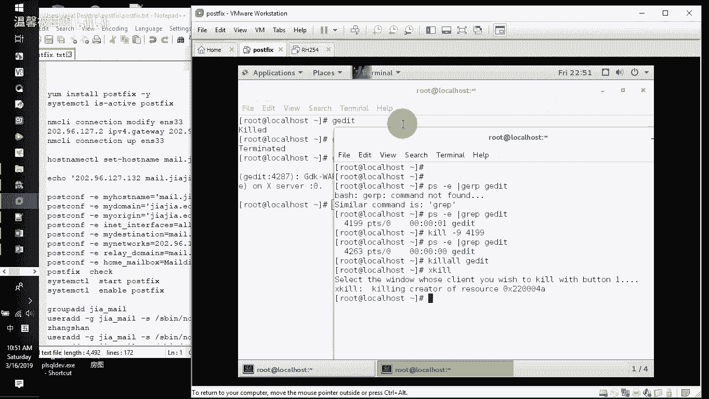
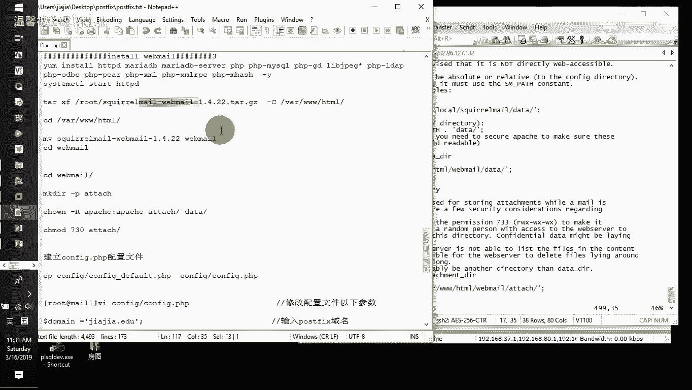
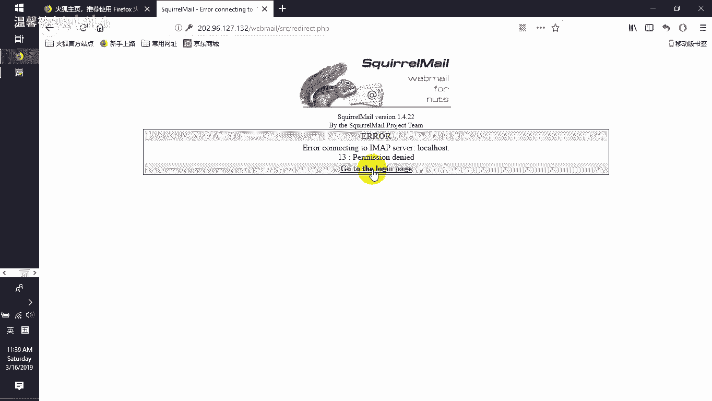
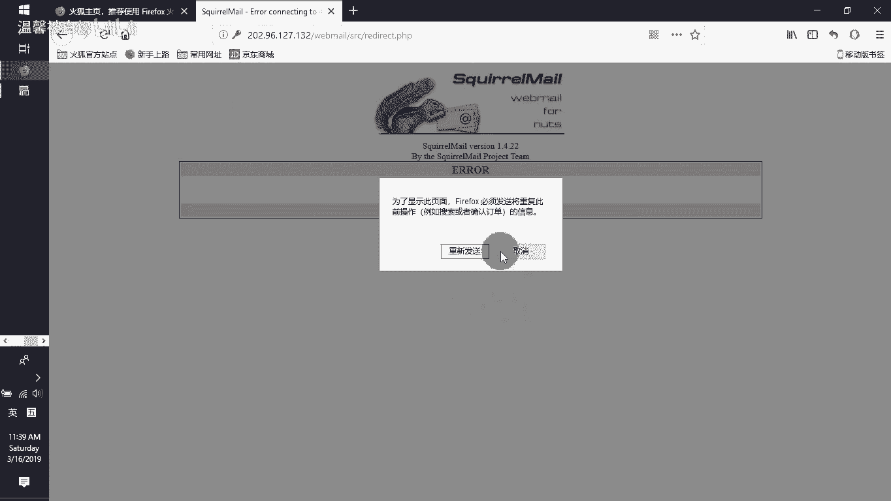
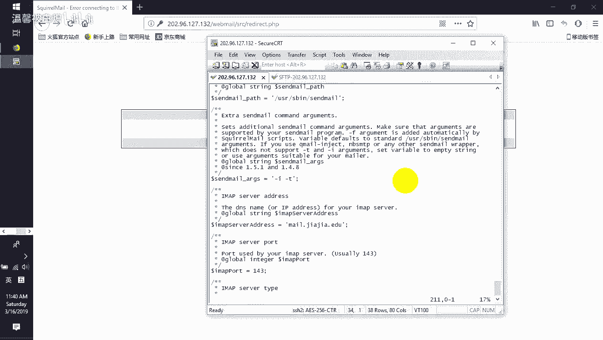
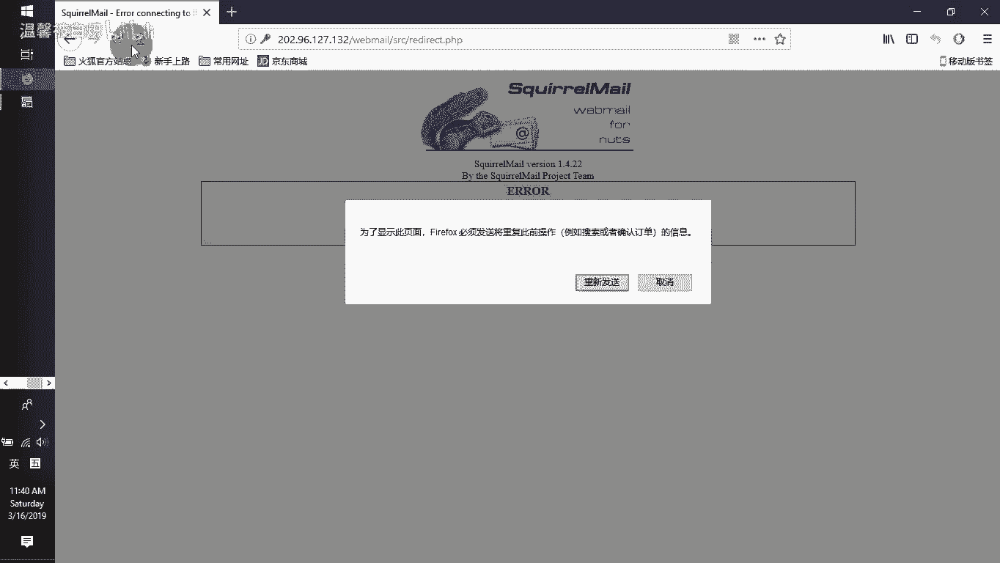
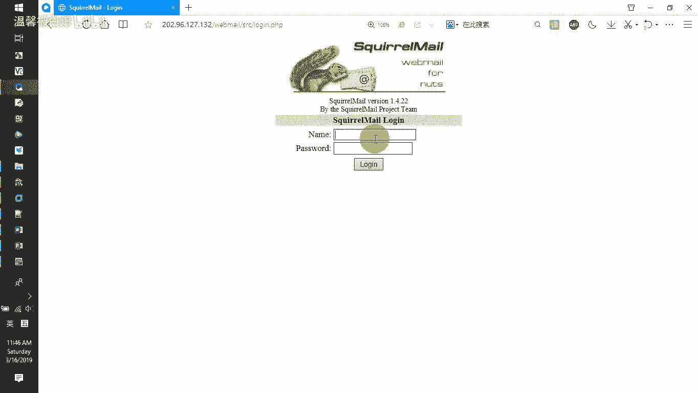
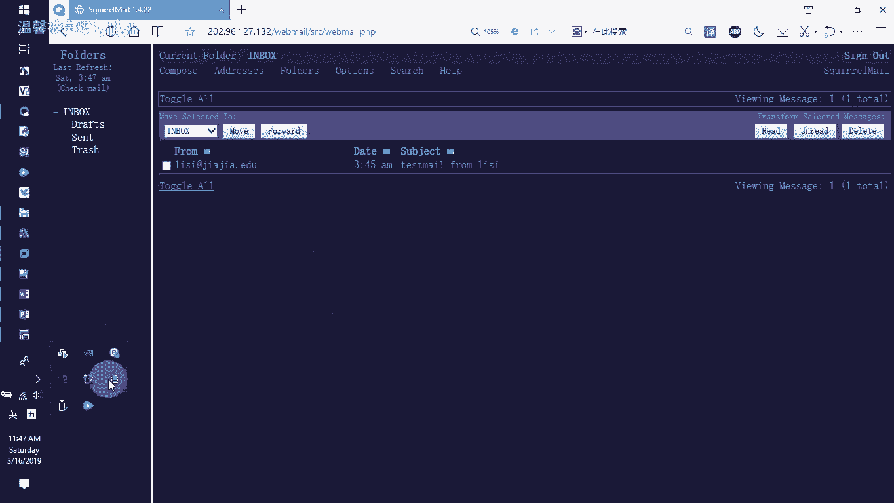

# RHCE--第345678天学习视频 - P1：postfix setup - 打羽毛球的橘猫 - BV1Bb411E73D

好，录像继续，这个是在我们的内容里面给大家增加一个额外的知识。呃，额外的知识的话呢，也就是告诉大家，在我们考题里面是没有的。但是呢是需要大家去掌握的技能。作为一个CE的工程师来讲。

那你必须要知道服务的搭建。而我们给大家带来的就是这个邮局服务啊，让大家去能够把它搭建起来。那首先让我们的这台机器有它自己的这个IP地址，然后呢能够去连接我们互联网，然后呢去在网上面安装软件包就好了。

IP。呃，不好意思，他现在没有，那我们直接给他来一个。DH crimeENS33。呃，默认情况下，这台主机呢，我是让它放在这个NAT这个网络连接环境里面，是NAT。因为NAT的话呢，它直接做地址转换。

直接可以用真实物理机器上面的互联网的网络直接连到互联网上面去了。那可以看到拼一下外部接口，没问题，它能连网的，看得到吗？直接能够连到互联网上面去。IP地址。1呃20296127。132。

那我就在这边的话呢，选择看我之前有没有哎有一个那我就连接到这个132这边这啊主机这边来。那输入用名密码连进来啊，因为我之前有，所以我这边就不用输了。那接下来的话呢。

需要大家去做的事情就是直接在我们的这个机器里面啊，用我们的这个终端就可以去操作了。那里面首先第一件事情。去安装我们的postface的软件包y。inst安装post face减Y自动回到个yes就好了。

好了，我会发现在你们做实验的时候，有类似的这么一个情况，就是s啊，这个进程被休眠了啊，有一个进程正在使用我们的这个样环境。那它的进程ID号是。

3434Q。减9强制的给他Q掉3434好，然后再重新装。好嘞，可以了。下次知道了吗？如果你发现你的这个进程被占用了，就Q掉他。杠9强制性终止。在你们学习的红帽的CSA的时候。

有教过你们的那个用户进程管理的。啊，有学过Q减9，有QO有PQ有叉Q都没学过吗？啊，那算好他再装来讲一下。Q。杀死进程的一种做法。那比如说如果我打开一个进程。GEDIT我打开了一个进程，这个是一个。啊。

你可以用为是我打开了一个document的一个编辑界面，对吧？那如果我在我的机器里面，我选择打开终端的时候，我来看啊，那么直接的话呢PS减。一、然后我们过滤一下。啊，我们有没有GEDIT这个东作？

PSGREP啊。啊，来有没有他？有对不对？那其实正常做法来讲，我们可以Q掉它Q减9直接Q它的PID编号就4199，明白吧？啊，那我们这边4199可以Q掉它的那没有了，被杀死了，看到吗？好了，如果再打开。

然后我再来看的时候。他的ID号不一样。那有时候呢我们不是QID号，我们是Q什么呢？QOQ近成品。也Q得他，也杀死他看到吧？然后我们再打开。😡，然后呢，这又来了一个。那接下来的话呢。

如果我们选择用那个呃叫什么呢？就是用叉Q，大家注意啊，这个很给力哈，叉Q。啊，你你看我的鼠标现在变成什么？啊。人头嘛，对吧？点谁就杀谁。😡，你看。给力哦啊，当然这只是Q啊，当应该有有给你们提示过的。

只是估计你们已经忘了差不多了哈。来哎装好了。

装好了之后呢，接下来我们选择stemCDL enable，把我的这个post fix呃哎，现在我就直接is杠act啊。啊，然后TIV areact，然后把我的这个post face把它打开。

那现在的话呢，它已经变成活跃的就好了。那接下来的话呢，我们看IP地址，如果你喜欢你配1个IP给他啊，就静态的明白啊。那我这边的话呢，我看IP。132哎，好像真的是这个。那我再看一下路由啊，root减N。

172。2没错，然后DNS。啊，也是他，那我就直接用这行去配一个静态的IP地址给他看到吧？啊，就配一个静态的那你们那边你自己看你的网，就你的那个呃IP源码DNS网关是什么就配什么就好了。

如果你不喜欢配的话，你用它这个动态获取IP地址的也可以，这个也行的，没问题。好了，那配好了之后，我NMC。CLIL哦把ENS33把它启动起来。那同样的它还是可以上网的，只是从动态的IP地址变成了。

静态而已，用我自己配的嘛，对不对啊，我自己配的好了，那接下来的话呢为这个机器设置一个主机名。设置一个主机名hose name CDL set downho name那就配置一个这个主机名。

这个主机名的话呢，比如说叫m点夹角点EDU当。配主机名的话呢，还要注意的就是要去VI一下我们的ADC目录下面的主机与IP地址的对应关系。Hose。在底下为127为我们的IB地址增加我们的主机名。

比如说叫m点假假的EDU或者说叫假甲。点EDU或者说它叫m都没问题，好不好？啊，然后再后面的话呢，我们自己加上自己IP地址，比如说202。96127。132，然后它也叫m点甲甲点EDU。

然后呢也叫假甲点EDU也叫。没有。那保存退出完了之后呢，我们去看，不论你去拼m点甲甲。点EDU还是拼。假假的EDU还是拼。没有，它都是同的，看到吗？啊。

因为你在主金明的这个IP对应关系你hos文件里面加了内容。那我这边的话呢就比较简单一点，只是加了一个。但是大家注意啊，一般的话呢我教大家就是几个都干嘛。127这边加。

然后你自己的那个IPV4的地址也加啊，那加好了之后，接下来做下一个事情，就是要去修改我们的配置文件。呃，我们的。考题里面的话呢，它也会有my host name，my domain 。

my origin。inter那个innet interface ，my destination ，my networks，那这堆它都有。那每一行的话呢，我稍微介绍一下，好吧。😡。

定义邮局里面我自己的主机名。看到没？你自己的邮局服务肯定有你自己的主机名。定义你自己发送接收电子邮件的时候，你自己的这个邮局定义的域名是什么？就夹加点EDU。在定义的时候。

你要定义你自己的邮局服务属于哪个域在工作。我们自己的玉买orin啊，这这边也是一样的。你看我的玉本来就叫嘉林一，只是我定义我只邮局域也叫这个而已，对不对？好嘞，然后再定义我从哪些接口接收和发送电脚邮键。

I need interface等于哦，那就所有的接口我都接受。明白吗？好，那问个问题，如果是只是监听本地，我就写个local host，那就等同于只有本地的人才可以用嘛，别人就用不了了。好吧？好了。

那接下来我可以发送的目标也就说如果人来我这里发送电脚邮键，我的目标，my destination，我的目标可以发送给我自己也可以发送给这个域也可以发送给本机。看到吧？

我又没有说它可以发送给别的域没有那我现在只是发送给我自己。啊，来，然后呢再定义我的网段。定义我自己的网络，也就是说哪个网络可以来我这里收发电九键，定1个20296127的网段。那你们那边如果不是。

要不要改？要啊如果不是这个网络也要改的啊，改成你自己那个网络网段号啊。好，那么接下来的话呢，当我们有人来发送电子邮件的时候，会告诉我们的那个对方发送电子邮件也好，接收电子邮键的人发送的人也好。

都会告诉他我们自己的寓叫什么？我们就叫m点夹载EDU或叫加点ED或者local host啊，都可以。好了，就告诉人家定义的时候会显给你看。明白吗？

特别是你打那个呃hello hello那个loc host的时候，他就告诉你哎，我是m点夹载EDU他就显给你看的。好了，那接下来的话呢定义如果收发电脚邮件的时候。

把电子邮键发过去给那个人那个人的电脚邮件放在哪里，就放在home目录下面，你看啊，你的家邮件的加就在你自己家目录下面有个叫m加啊。好了。把这行给他copy一下。啊，复制。好。

那你可以去post face check去检测一下啊。post。ice要检测一下啊，有没有问题？还没有报错，对不对？那没有报错的话呢，我们这的话就可以直接s成CTL，然后选择star。

我们的这个post。face好了，启动成功了。那也就是说这个时候我们去看啊next day杠MPL grip管道过滤一下冒号25号端口还记得吗？这个端口是谁的？SMPP的对不对？发送电子邮件的好了，哎。

不好意思，写错了，net stay杠NN票group。过滤一下25号端口好了，在不在线。在的对不对啊，在线的。那么也就是说现在的话呢，他这个邮局服务他已经活着了。那如果你喜欢让他以后开机的时候都开着。

哎，那eay了那。这样就一以后它都会开的呃，而且的话呢你通过这个命令可以看得到现在的状态那 is running看到吧？那这边的话呢你可以看到是enable好了，那这是我们的这个邮局服务已经架设好了。

那为了让大家在测试的时候有测试账号。我专门的话呢新建一个组啊，叫假假邮箱的一个组。然后组的话呢，新建的时候把用户都指到这个组里面去呃。

而且新建用户的时候没有本地登录的sell账号有张三密码123456有李四密码123456有王五密码123456呃，很多同学的话呢就没有用过这个命令，那我把这个命令给大家串讲一下啊。啊。

证明令的意思是什么呢？呃，我们把这行调回来。user add这个应该没问题。😡，简小区指令他的主要组。主要组是叫讲下线没。减S指令它的项为S命下面的loin，用户名叫王五。当我们打完这条命令。

做了一个连接符与与符号连接符，这个连接符也就是说前面命令执行成功，后面的这个命令接着执行。好了，那接着执行的话呢执行一行命令。显示123456，它就会显示这个123456。

但显出来的内容不是直接选在桌面上面，是给一个管道，管道是前一个命令执行接口，给后一个命令来用后一个命令做什么呢？后一个命令是叫pasWDpasWD还记得吗？做什么呢？

改密码改密码做一个标准输入杠杠STDIN啊，就inSTD in就做标准输入输入给谁，给王五设密码。所以当我们打这条命令的时候，打完了它就告诉你全ing password for the user王五。

他已经告诉你authunation talk update search free已经告你成功了，看到吧？这样的话呢，新建用户的同时就把密码给他了。能理解吗？啊，可以理解哈，那没有理解没关系。

后面我们在学脚本的时候，还专门去讲这个内容的，好吧，要专门去讲的。好了，那做好这个了之后，哎，这这边这个王武已经建了，就不要再建了一次了。好，那设置布尔兹开关。

让我们的post fix的用户可以在本地书写自己的文件夹。书写自己的文件夹哈那什么叫书写自己文件夹呢？大家注意看我这边哈。LL我们看呃，比如说这个王五啊，home目录下面的王五，现在里面有没有那个叫。

没有DR的这么一个文件夹。😡，没有，因为都没人发邮件给他，对不对？肯定没有。那么这一旁命令的话，你就让他可以在本地新建一个没DR的一个文件夹。如果你不开放，它就没有写入的功能，它就不能够写邮件写给你啊。

好了，那接下来的话我们开放一下SMTP要给人家去使用啊。好了，防火墙里面开放SMTV服务reload一下防火墙就好了。那这个时候我们可以测试一下啊，测试一下大家看啊，专门测试一遍给大家看。

样音丝啊调呢这么一个套件啊。减外。哎，又有一个进程正在占用我的这个。Q掉他4430，其实我都不知道什么东西占用我的进程。好嘞，装好了。那装好了之后，接下来我们开始测试啊tnet。😊。

mail有点加价点EDUtenet它的25号端口，就是邮箱邮局服务那个，对不对？好嘞，那teate他了之后，接下来大家注意啊，我要给他打声招呼，hello。local host啊，你看他直接写出来的。

就是我们刚刚那个my origin里面显出的这个结果，对不对啊，他就告诉你哎。没点加减的EBU然后我要告诉他。m from冒哎，大家注啊，在终端输入的时候，命令行发邮件了，你写错字了，你说能向左删吗？

退格键，它没有的，你打错，你就得重来，明白意思吧？所以慢慢敲啊，不要急啊，我们m from，比如说我们是给那从那个叫什么呢？从。张三。啊，发送的这个电酒键，然后找到这个人RCPTwo给谁呢？给李四。

艾特。加假点EDU发送邮件就发送给李四啊，然后data。啊，你看我这个data写错了，看到吗？我想说退格，不好意思，退不了。那呃，重新打。哎因我又打错了。啊，贝。好，可以写了。呃。

我们可以写一个那个subugject。啊，就是他的主题啊呃，比如说这个是fostmail。啊，那有个主题了，然后打上这个号啊，哎，打错了一堆啊，随便了哎呀。好，一点结束，他会告诉你，你点。结束主题内容。

对对结束我们的这个邮件内容哈，回车好了，okK了，没问题，然后退出来。那我们刚刚把邮箱就把邮件发给谁？李四对不对？哎，我们是张三发送给李四。

那我们现在去看一下home目录下面李四的家里面有没有一个叫mR的一个文件。直接写进去了，看到吗啊，直接写进去了。然后我们CD到这个呃home目录下面的那个。李四的家里面有个mail这个文件夹。

那么里面的话呢有一个叫newnew里面的话呢就是有一个文有一这么一个文件。这个文件的话呢，我们cat一下是不是我们那个邮箱发送的时候的那个内容哈。是不是这一对？对吧哎，其实就是这样。

但是我又问大家一个问题啊。你有看到有谁收发电子邮件的时候，去到我家的那个邮邮件文件夹里面去看有谁发邮件给我，有这样做的吗？没有的，我们收发电子邮件都是怎么收的？😡，唉，就是用浏览器啊去看的，对不对？

所以不是看里面的文件，就等着你看个tex文件有什么用呢，是吧？啊，那这个呃不友好，所以只是给一个测试啊，列出来你看到有东西好，那接下来我们安装一个邮局服务，就是安装邮局的话呢。

这个邮局服务是de这个de的话呢，它会提供有什么服务呢？它会提供有我们的那个I mapPOP看到吧？我们不是说有110有143嘛，对不对啊，那这边的话呢就是要去装这个deoc这么一个服啊，来开始装。😊。

啊，稍微等待一下就好了。哎，突然间这么慢。哎，可以了。安装好了这个dework口的这么一个邮局服务了之后，接下来我们需要去改动一下它里面的这个配置。改动里面的配置。其实我这边的话呢直接输进来。

它里面本来就有这些行的，只是没有开放而已，明白意思呗？那我们去找一下给大家看呢。VI一下这EDCwork下面的dor。点com文件，然后我们直接去找。s它是用井号注释起来的，看到吧？啊。

当然如果你喜欢的话，你可以直接一口一个pros，后面加上这个imap，然后是POP等等。那一般的话呢我就这样开一下就好了，开放一下它就行看到了吧？好。

监听listen的话呢是监听所有我就直接监听所有就好了。看得到啊，监听所有，然后在使用的时候呢，就是啊新代表所有冒冒号的话呢也是一个啊好了，那有他们的之后呢。

接下来在loin never就我们所说的登录的时候，信任的域信任的那个网段是哪个。那我们看看登录的时候，信任那个网段啊，我们直接查找。Ling trust。下线net work。啊。已经看到了是吧？

好了，那也就是说当我们去找到的时候，你就直接找我们的这个信任的玉就好了。那你自己的那个信任环境，比如说。是这个啊，那直接开放它，我们自己信哪个网段呢？信任的是那个叫202。96。127。

点0的网段24位的野码，看到了没？我们就信任它就好了。那这边就是我写给大家的。然后呢，在我们底下还重要的一点就是加入在大概是24行这个位置啊，比如说我们定位一下24行24行，然后呢。

在大概是也是这个位置，它也会有这行的，就是m location，就是邮箱的这个本地邮箱存放点，你把它存放在哪个地方，看到吧？那比如说我就把这一行给它搜索一下。本来就直接在里面搜索一下就好了。啊。

m gal location没有吗？啊，那没有直接在这笔加了哈。呃，给大家演示一行这行命令啊，后面我会稍微介绍一下这行留编辑器。留编辑器。所以留编辑器的话呢，就是有别于大家之前在学习VI编辑器的时候。

VI是直接进入到文档里面去编辑，对不对？而留编辑器的话呢，就是可以直接去对文档里面的内容进行修改。比如SCD后面减I直接在24行这边插入m杠 location等于m冒号波浪线下面的m，然后修改这个文件。

那，可以的，没问题。好了，那现在的话呢我们把它copy这个文件不是啊，保存退出，然后直接去编辑文件24行的时候插入这个内容。那我们去看这个文件EDC下面的这个fig点D下面10打头的这么一个邮箱文件啊。

点com24行。过了吗？嗯。我刚刚不是在二四行那个地方？啊，你看。写进来了吗？就这个地方看到吗？我就已经把它的这个邮箱所存放的存放点给它加进来。就在2四行这边我加了一个好了，那接下来的话呢。

这个服务的话呢，因为要开端口，开110啊，IM就是POP410。然后143的话呢是imap。然后25的话呢是之前的那个SMTP那我就把这几个端口也给它开放一下。啊，退出来保存退出啊。推完了之后。

接下来把这个防火墙的端口给它开放。那之前在讲防火墙的时候，又没有给大家讲多个端口怎么配了？来大家看用例子说明，之前我们只是艾杠port10杠TCP就只开一个，对不对？那我要多个一起怎么办？

大括号中间端口与端口之间用。逗号给它分开就好了，就是很简单的一个端口。好了，那有它了之后，接下来sCTL，然后选择unableable打开dvo DOV。CT啊work。

然后再把enableable变成。St。就直接就开放它。那这样我们来坚视一下next day杠NPO group再次过滤110。有没有这个端口，有1143。也有看到吧啊，110和13都有端口都在的。

好了，那有它的话呢，接下来我们就可以开始去收发电9键了。那也是说这个时候呢，其实我们也可以搜，也可以发电九键的了。记住啊，装完两个套件就可以搜，有可以发电9键。但是呃在这里面为什么后面我们要加认证呢？

这个AS这这SASLATHD就是2次认证哈。那么这个认证的话呢，是做什么呢？就是做编码级别的这个换算验证。呃，我希望大家注意这个时候我们用用户名密码去登录的时候，依然是需要输入明文的用户名密码。

大家可以想象，如果在浏览器里面，我们输入铭文的用户名和密码。安全吗？😡，不安全的，就等于说我们用浏览器在传输我们自己用户名密码的时候，如果这个时候我们自己开一些那个抓包器。

我们都可以抓得到你的铭文的用户名密码，这是非常不友好的。企业里面也肯定不允许这样。所以会要求你们把这个密码变成密文验证的密码。就密文验证的密码。什么叫密文验证的密码呢？就是验证的时候呢。

增加我们的验证方式，还有让我们验证的时候呢，可以支持我们验证的这个密文验证。那比如说。系统里面已经提供了1个SASLAUHHD的这么一个服务。那我们来给下看一下啊SA。

SLAUTHD减V它已经提供了一个那个验证，它专门验证authentation验证的话呢，可以针对我们的keyword，然后PM然后shift文件，然后DAPHTTP的perform。

那我们就是要做这个HTTP的这个验证。那待会我们要网页上面就用这个。所以呢先给大家去配置。VI直接修改EDC目录下面的sarchconfi下面SASLAUTHD在底下你会发现它默认情况下就两行。啊。

就唉这边还有1个PM，还有这边这个那我们需要大家去修改的话呢，是把我们的这个PM换成什么呢？换成这个shift文件。我们的密码本来就写在设的文件里面，明白意思呗？就写在设的文件，你看就改这个就好了好了。

保存退出。那这个流编辑器的话呢，就直接杠S去查找这一行内容，然后把它替换成。这一行内容整个文档都替换替换这个文件里面的这一行，看到了吧？这是留编辑器。好呃。

又说题外话呢就是说后面大家如果想去多了解一些留编辑器的这么一个使用。那我们在后面的话呢可以呃时间允许，大家做题要做的比较快，我们就多给它扩展点东西，明白吧？啊，而且我记得好像我们在比如112的时候。

是IT的降机的那个图书史吧，是吧？是112吧。我记得。来，可以去找类似的这样一些书籍啊，里面肯定有的，你放心。好了，那SED这是修改。然后做好了之后，我们把这个服务给他。启动一下啊。哎。

提示我是什么东西呢？system CTO，然后re大一下我的SASLAUTHD。SA。哦，写错了，不好意思。啊，这个服务哈是没问题的，我写错了吗？SASL。啊，少了一个叫什么？少了个D刚刚好了。

那这样的话呢，他以后开机的时候都会去开这个服务。呃，那现在测试的时候就是让他去知道我们验证的时候，比如说我们验证，因为我们刚刚选择用本地的这个s文件，对不对？那你注意看啊，本地秀的文件。

我们cat一下EDC目录下面的s文件。这个s文件里面，贾贾也好，张三也好，李四也好，王五也好，有没有密码。这堆都是密码呀。😡，对不对？这堆都是密码。那我们现在的话呢给大家去验证一下。

比如说我text验证，我看一下李四，李四的密码是12345，我看他通不通过啊。验证一下。哎，怎么会失效了呢？我刚刚应该重启过他了。再来。Tex SA。简忧。李四。减P它的密码是123456。没有验证。

啊，等一下，我看我写错了哦，不好意思，这个地方我没有开他的那个。SE历历的那个验证开关啊，怪不得我这个验证它直接就失效了。好，oral SASL AO，然后呢读取我们的s文件，就允许我们的验证信息。

就验证程序去读取s文件看到了吧？那再来验证一下，OK了吗？OK了啊，就验证文件可以读了。然后接下来的话呢，我们就直接去修改一下验证的级别，默认情况下让它验证为三个第三个级别就好了。那这个地方我们不理它。

直接修改就好了啊。这也是刚刚的那个运行文件里面的这个东西。包括SMTB的文件，也要让它增加，让它能够做我们的这个SASL的这种验证啊。两行内容写进来就好。

接下来要去修改一下我们的这个post fix的主配置文件，修改post fix的主配置文件。post fix主配置文件里面增加SMPPDSASL AUTHEnable打开它的验证。

yes然后SMTBSASLsre options。no anonymous就没有任何的匿名。然后呢，要给他做的就是我们所说的这个broken下面的这个SASL它的客户端验证都是要验证的。

SMTV的这个验证信息让它只有验证通过了才可以被通过。如果验证失败了，直接就拒绝。看到吗啊，就是在。postface里面增加内容的一种做法。当然了，你可以直接像我一样。把内容写好。

然后增加进去就改这个文件啊来。VI。EDC目录下面的post fix下面的man点CF，这是它的post fake主配置文件。然后在主配置文件的话呢，你可以跑到这个文件的最后面啊，最后面。

比如说他现在的话呢就在最后面啊，那刚刚我们写的东西都在这个地方，看得到不啊，那我们在最后面再加我们自己内容加的话呢，就是这堆。就是这一堆。好了。呃，复制一下。然后在这边粘贴。那呃上次有同学做错的话。

那就这边。这三行其实是一行来的。明白意思吧？三行其实是一行来的那他三行的话呢，为什么说其实是一行？那这边的话呢，因为我写不下去，后面我就直接按回车键空格写内容，然后写完一个逗号，然后再空格再写一个内容。

他是这样去写的，好吧，别写错了，写错的话，那待会就纠结了。其实这个地方也是有空格的，空格一下，看到吧？那我直接在这个地方多增加一个空格。哎，我记得好像这个地方是有个空格的。选中的时候。

你看是不是有空格啊，是有的。好了，然后保存退出。做好了之后呢，我们把这个postface重新引导一遍啊，post。Face。然后rero一下。好了，那现在的话呢我的这个post fix已经重载一遍。

要net stay杠NP grip管道过滤一下，看一下25号端口在不在啊，还在的，看到吗？啊，那接下来的话呢我们就验证一下，用base64的编码来给大家去做验证。我验证的用户，比如说张三。

打印张三这个用户的b64的编码。是这一串看到啊，然后打印。张三的密码123456是这一串，看到吗？然后我们去验证的时候，他呢啊再来。mail点甲甲点EDU然后25号端口。那我们在现在的话呢。

我们直接去做一个验证验证loing。验证登录登录名是这个。回车密码是这个。如果你看到登录成功的话，那说明我们刚才做的验证是没有问题的。好了。centation也告诉你，他已经用密文验证是没有问题的。

能理解不？这就是我们看到的在网页点击用户名密码，点击进去的时候，你输入的是你自己内容。但是在传输的时候，它已经变成了编码就变成了密文的编码，能理解呗？你不要以为你们平时登录的时候写个呃用户名写个密码啊。

你看到哎呀这网上它真的是这么传的吗？不是这样的，好吧，还需要把都转换成编码集好了，那能够做的话呢，我们就验证成功就好了。那最好的话我们QID退出来就行。那验证成功了之后。退出来就好了。那推完出来的话呢。

接下来。收发电子邮件如果用命令行去收发电子邮件显得很不专业。所以我们搞一个图形界面去收法一下变捷键啊，那图形界面在哪？我要求大家去装呃HDDP包括myq，包括这个PHP的这么一个平台。

然后呢去安装的时候呢，就可以去实现我们的这个LAMP。那在里边介绍一下LAMP。我们本来是要到后面讲游，就讲网站的时候，会给大家讲LMP。但现在的话呢既然用了，我们就先装给大家看，好吧。

linux下面装阿帕奇的网站平台，装mysq的数据库，用P语言来解析页面，看到吧？linux下面L代表linuxA代表阿帕奇M代表mysqP代表PHP能看到吗？好了，那mysq的话呢。

现在它用了一个很经典的一个名字，不再叫mysq了。啊，有一个分支的话呢很给力啊，用了一个很经典的那个那个我记好像我们学校每个地方有有个画像是呃那个玛利亚的这么一个画像啊，就是玛利亚啊。

专门他写了一个叫玛利亚BB啊，所以就用这个。那我们安装LMLLAMP平台，就用这个就好了。来。复制一下。安装HDP玛利亚DVPHPPHP的话呢有很多包啊，就是都要装一下。

特别是这边这个PHP杠GD图形库，然后还有这个lib。支持我们库里面的这个JPG的这个图形界面。好了。稍微装一下这堆小套件就好了。呃，套件不多也不大的，大概是30兆左右哈。🎼啊，可能要要用一点点时间。

那在他这段小时间里面，我们把这个小套件先丢到我们的这个电脑里面alt加P。呃，我们有一个小套件，这个套件的话呢是secre meal，就是一个小松鼠的邮箱客户端啊，小松鼠的邮箱客户端。就是他哦丢上来先。

做好的话呢，大家可以看我已经。丢了一个secmailwe mail的这么一个客户端啊丢上来了。啊，看他装好了吗？啊，正在安装。好，安装成功之后呢，接下来我们选择stem CTL，选择restar一下。

re大一下我们HTTVD这个服务，或者说你还可以把这个服务的话呢，开机的时候就。label它那这样的话呢以后它都会开的了。好，那接下来就是把我们这个小松鼠的邮箱客户端哈。给大家装上。软链包。

我已经放在了这个桌面这个地啊，就放在了他的家这个地方。我们的这个网站页面存放点。t叉F解开screenme。减大C指令把它解开到Y下面3WHtL这个地方，这是我们默认网站的加，默认网站的加，明白吧？啊。

那默认网站的加我怎么知道它在那里？我们VI去看在EDC目录下面的HTDPconfigHTPD点config它会告诉我它的家在哪里。在这边，他会写有的他的家。

那document root它的家就在这个地方看到吗啊，所以在看的时候呢，你要知道我为什么把这个包解压缩到这里来，就是解压缩到我们的这个软件的加里面哈。好了，那写好了之后我刚是按r。

因为我已经打过了啊CD到哇3WH这个地方会看到有一个叫swe对不对？很长的一段，没必要这么长来M一下这个screenm改成weber就好了啊，就改一下它哈。

那我这边的话也有也有进到这个里面直接的话呢M一它改掉它，然后再进入到web这里面那里面的话呢它默认有的配置在这边，但是你不用去自己去装。因为我已经写的配置给你写好了。

新建attach这个文件夹和data，如果data有的话呢，就可以直接连data都不用建data是有的嘛。有的那我们就建两文建建议文件夹，然后呢，把这个文件夹的权限给它配置上。

大家注意这里面有一个呃知识点要注意为什么给帕奇，而不是给别的用户，我们运行网站的时候，这个网站在运行肯定有一个用户去运行这个站点。那这个运行站点用户是谁。

我们通过查询EDC目录下面HTDPconfig它的主配置文件里面，我们去过滤不区分大小写。我们看一下它的账号用户是谁。是一个叫阿帕奇，看到不？这个是它运行这个网站的时候，它主配置文件里面告诉我们。

你运行这个站点用的账号就是ap帕奇，那我就给这个app帕奇的权限，给这个attach，还有这个data，然后给730的权限给他们就好了。那给了之后呢，接下来我就可以直接去。修改哎。

我只给1个730给date，我觉得还要给一个叫。Date。730给哦，不好意思，这个根目录上没这个data，然后就给这个attach，还有给这个data，看到吧？啊，两个都给了。然后呢，接下来。

修改它的主配置文件。这个主配置文件的话呢，我就没有过多的去修改啊，copy一下，在config下面有一个confi。点。呃，config下线de文件。

然后把它变成config下面的config点PHP这是它的这个主配置文件。那我们只需要去VIconfi下面的config点PHP的这个主配置文件就好。你看我就是VI这个文件，对不对？好了。哎，什么情况？

稍等一下。CD到con贝里面去。我不是弄了一个啊，有啊，刚刚打错了吗？config点PXP啊，有的是这个哈，就是VI这个文件。然后这个文件的话呢，只要找到我们所需要内容，然后稍微改几个就好了。

不需要这么多哈。第一改域名。呃，找到我们的那个domen。域名damon。搜索一下吧。不是这个。啊，domon这边我的玉叫什么呢？我的预叫假假点EDU那你们待会你们自己用，你们自己写好吧啊。

就不要说是不会改东西哈。然后SMTP服务器SMTP的话呢呃我们是哦不是SMTP啊，是Iap，就是网页上面收发电酒的时候用的那个服务啊。im map。又搜索一下。I am。AP。下线社望。下线退。啊。

又看到了这边有个im map server table，它这边是other。那不好意思，我是专门装了一个doc。啊，是这个啊，然后呢，数据目录。啊，这边一定要去写哈，这个如果你不写的话。

那数据目录根本就没有，他不知道数据在哪里的。直接哎又要去搜寻一下。Da。下线第二。啊，我们看啊，下面有。data下线DR呃，在这里面说个笑话啊，上次的话呢。

我在呃我记得好像我是在那个机电学院去讲这个内容的时候呢，很多同学他认为我们的那个配置文件里面呢。没有井号，也没有dora，但大家注意啊，这边是个PHP的文件，人家是带dora开头的，明白吗？

它不是脚本文件，所以它有个dory开头的，他把dory给它去掉了，然后呢就人家都成功了，他在里搞半天。啊，我都不知道他会犯这种小问题。所以啊我在这里提醒一下啊，不要犯小错误哈。好。

one下面3WHTML下面的data。那除了这个之外，我们还有一个是什么呢？还有一个就是我们的一个attach，就是我们所说的attach的那个架构的那个信息哈啊，应该是在后面一点点，来就是这个地方。

3W。HMM。啊，就这个路径。哦，不对哦，应该后面还有一个叫weber。没有，我刚刚是不是改成了这个。差点就做错了。我本。因为我们那个data也好，attach也好，都是在webm底下的啊。好了。呃。

做好这个就好了。因为我没有中文书籍，所以这两行的话呢都。没有好吧，我没有中文编码啊。呃，如果大家在后面的话呢去下这个小程序的时候，如果你想下中文，那还要下一个中文的这个呃包的那我现在没有。

所以我就没有这两个，我就不改了啊，保存退出。

做好了之后，接下来选择去开放我们的HTV给人家去访问。就这边的这个我又开放一个阿帕奇的网站，开放了之后，接下来我们就开始去访问了。啊，用我的这个机器去访问啊。好了。😊，访问的时候是HDDB马号双C杠啊。

202。96。12。7。132默认站点。然后底下的话呢，我们有一个叫。我本没有。小松鼠的后户端看到吗？啊，然后呢选择张三密码。123456登录一下。promson deny唉我的im map。

怎么回事呢？等一下。我的im map，他说我的。服务有问题。稍等一下啊，我把我那个post fix邮件服务器重新的去引导一下。sCTL，然后是。Sttop post。face。

然后在startop我的那个。dwork看到吧？那现在的话呢两个服务都被我关掉了，然后我再选择system。CPL star。post fix，然后doc。把两个服务一起重启一下啊，然后再来。

张3123456登录啊。登上去。什么情况？我我刚刚哪个地方写错了？等一下。刚刚。data这里吗？来，那我回去看看啊。😊，是这种啊。Data抵押。哦。没问题了吧。好了。然后重新来个再试一下。张三。

123456。然后选择登录一下。好像不是跟这个好像没关系，因为它是imap的这个信息，我重新把。把服务拿来验证一下。刚刚我们不是有一堆的服务嘛，对不对？来重新把那堆服务都来一下。system CTO。

然后选择star。Poer。Face。啊，我都关了啊，然后除了这个。还有那个。是这个吧。嗯好了，再来一遍啊。😊，我一个个开，我就不爱信。Star。Pouse。F。然后post face。We绕。

没问题呀。然后再选择。d口这个程序。systemCTO。Stop。我觉得应该就是这个d口有问题。然后我再看一下现在状态是什么样子啊。那意思对，然后开启它。开完了之后，我们再去看。哎对不对？应该没问题。

然后再选择把。HHD啊，然后这个验证也没问题。来再试一遍。张三那换个李四呢。123456。登录一下。呵呵。我觉得有点怪异了，今天啊等一下我慢慢解决问题啊，那大家注意呃这也好了。因为有问题的话呢。

当后面我们解决起来做好了之后是还挺开心的，对不对？那如果都没有问题，做完了之后都很开都都没看到过有问题，也不知道怎么解决了。好了，那现在的话呢，他提示我们imac四的服务啊，是local host。

我看一下我的主服务里面imac它是提醒我是哪个哈。😊，直接去修改devo口的配置文件VIEDC。李锅口。然后协议的话呢，是IMAP这个没问题。监听呃，我试一下，吧后面不要，我直接监听这个地址就新哈。

我试一下。就只是要个心哈，没有别的。信任的网段，我刚刚不是改过嘛，对不对？好了，保存先。然后我现在看他监听的地址是哪个。冒号143，他就是监听这个刚才说是这个有问题。那我现在的话呢。

我再去换掉它试一下啊。System。是top。然后重新的再去。开启一下他。然后再去监视一下143没有IPU6了，刚刚我已经删掉一个了，对不对啊，那现在我试一下啊，它能不能够去连接一下。再来。李四。密码。

呵呵。😊，改再去改我们的那个监听的本机编码。VI下在config里面。就是这个文件。监听的本机主机是谁？我看要改嘛。本机主机。本地主机。稍等一下啊。Local host。呃。

SMDB服务器我确实是本地主机啊，那我就换一下啊，换成那个叫。没有点假假的EDU。25号端口没有问题啊，来再试一下，保存退出。哎，重新来过。再次刷新。登录一下。李四。密码123456。哎。

为什么还是loc host呢？我已经。干嘛？

刷新一下，再多刷新几次。

或者说关掉重来一下，好吧。contrl shift加delete删掉所有的浏览历史。来重来一下。202。96127。132下面的。我不没有。李四。哎，为什么还是loc host呢？我刚刚改掉了呀。啊。

再来一遍看这个confi。点PHP的这个文件。SMTP的地址没问题。然后我们再看他的那个。Doccle send。哎哎，这里有。改一下I map server。143的这个服务器就不用本地。

我用那个mail点。假假的EDU我改掉哈，默认143的端口看到吧？为什么刚连不进去？

好，来再试一遍。

张三。为什么还是提醒我有问题呢？来，等会儿，我刚刚好像有过一个权限配置的那个内容CMOD我给这个777。给。CMD777了，我直接杠个大LO给他。重新来过啊。李4123456进去啊。哎。

最起码这个地方改了。对不对？在。清楚一下。啊。再试一遍。李是。进去啊，哎呦，我的天哪，我心有点碎了，换个浏览器。呃，因为现在的话呢是那个MAP。

但我的MAPM map它是开着143来再监视一下我的143。天哪let stay杠MPL grip管道过滤143号端口开没开着。开着的对不对？那除非我待会再他再出现问题。

我就直接开他让就直接监听某1个IP。他现在监听所有IP地址都是不行。防火墙里面开了1430形连的，我试一下啊，fire。杠 command杠杠list杠5。143有没有？有啊。都允许了。来再来一遍。

等一下。啊，然后再来。张。3。123456。登录一下。什么情况？这是。稍等一下呃，我觉得应该是我的那个布值有问题，我直接把这个布值给它set in force。我关掉一下试一下啊。李四。哎呦喂，天哪。

大家注意是我的那个SE li针对I map，它没有通过，明白吗？针对Im它没有通过，那应该是这个地方。就是get S一布尔值，然后减A专门针对什么呢？专门针对IMAP的啊，就是我们所说的DOVE。CT。

哎，我没看到哪个是啊。专门针对那个post fix。因为刚刚这个我们已经打开了，对不对？这个是打开的，但是。143的这个行了，先先这么来先。set n force0，那这边这个就有点不太不太给力了啊啊。

这个是我关掉了它的SElinux，然后它直接就访问到了，所以跟那个没有关系的了。那就是SElinux帮我们挡住了。那呃先看这边。邮寄服务收发电子邮件很简单。那刚刚的话呢，我们登录的账号。

我们是用谁登录的？刚刚。我最好是张上来，我们直接发送给邮件。比如说我们发送给这个李四。然后艾。甲甲的EDU，然后主题is is。Text meal。啊，那这边这个一堆。啊，给他来俩笑脸啊。说明成功了嘛？

是吧？好，来发送一下。那如果这个时候哎我们是用李四发的吧。这个就李四来来来发给谁？发给王武，王武从来没登录过了。然后text mail。From李四。好了，发送。那这样好的话呢，发送完成了之后。

我们退出重新用另外一个账号叫王武，然后密码。登录进去，那可以看到刚刚发过来。是不是这对？对不对？就收发电9键，就通过我们的这个浏览器，就网页版本，你可以收发电9键了。呃，如果你不喜欢这个主题。

你觉得这个主题很难看，那你可以在opence里面可以看到我们的显示主题啊，比如说这边有个显示主题，或者说还有那个信息的，还有那个呃personal的 information，就inations。

那也可以在里面的话呢去提交你自己的那如果是显示的话，你可以在这边，比如说你的架构，你觉得这个默认不好看，对不对？那我们看有哪个好看一眼蓝色的行不行？蓝色试一下。然后语言如果你有中文啊，那你可以选择中文。

O没？我现在估计是没有的啦啊，很明显就没有了。那个呃cust style。网上。算了，就这样吧。呃，默认的这个javascript的这个也行啊啊来保存那周来。然后选择退出，然后重新登录。这会的话呢。

我们再因为它是蓝字蓝体蓝底，对不对？那我们再选择网五。

123456哈登进去来蓝字哎。字是蓝的吗？我就没看到。自己是黑的吧，好吧啊，蓝底哈，那你自己喜欢了就自己去配就好了。当然这个页面的话呢比较粗糙，那一般外面人家肯定会对它实现修改，就会增加一些自己的内容。

这也是你们学网页里面教你们去改东西的一种做法的啦。好了，呃，路线有点长了。

结束先。