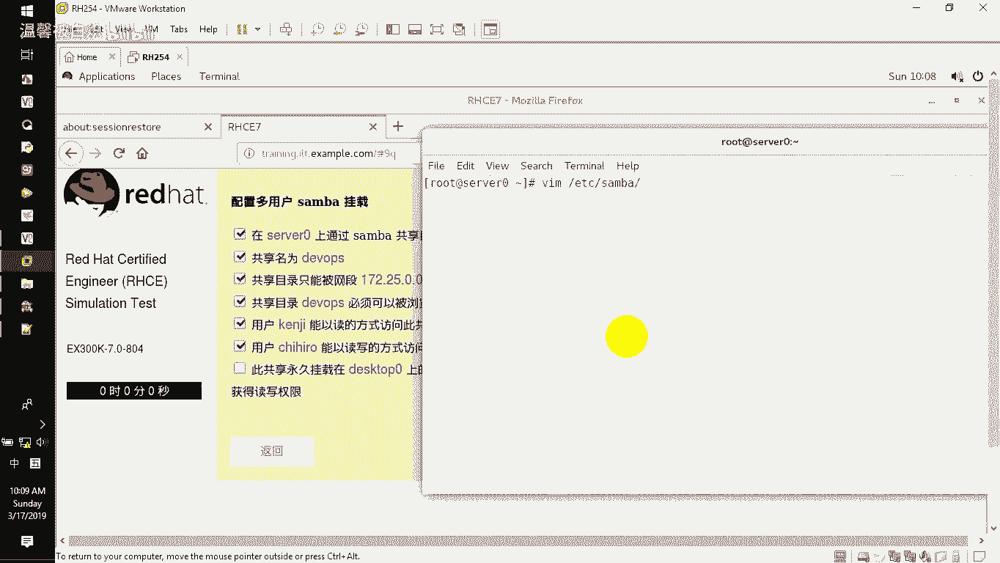

# RHCE--第345678天学习视频 - P5：samba多用户挂载 - 打羽毛球的橘猫 - BV1Bb411E73D

前面呢已经给大家去介绍了三把的安装以及三把的这个基本的使用。包括有它的这个呃小组的更改，包括有它的这个验证，包括有共享目录的创建，还有共享目录里面，每一个这个小内容的意义啊，都在前面的内容里面有讲到它。

接下来呢要给大家去配置的是多用户的三把挂载。多用户的三把挂载。所谓的多用户的三把挂载，是这样的一个意思哈。看在服务器上面需要大家去设置一个共享dvolve啊，然后呢这个共享名就叫dor。

然后呢在应用的时候，这个网段的这个用户。访问这个共享必须要能浏览。接下来呢要做的就是多用户挂载。什么叫多用户呢？有两人。第一个用户以只读的方式访问我们这个共享那密码是什么啊？

然后第二个用户以读写的方式访问这个共享。啊，密码又是什么？也就是说这样一个文件夹不同的用户来访问的时候，他的权限是不一样的啊，权限是不一样的那大家可以想象一下。

现在在我们的这个工作环境里面有没有说部门的经理要求要要能读又能写。然后底下的员工干嘛，只能看有没有这种需求，有，所以呢就是把这道题目在我们的考试里面直接给他做出来啊，让大家去感受到啊。

所以呢在挂载的时候，他还有要求是什么呢？还有要求。在这个桌面的主机里面，永久性的去挂载我们上面的这个developors挂载到MNT下面的DV这个目录下面，并且使用这个用户唉使用的是。

以读的方式的这个用户来做验证啊，任何用户临时通过这个呃另外一个写的用户来，如果他有这个用户，就可以去获取到这个写物的权利。就有独有写。所以呢这是实现多用户挂载的一种方法。也就类似于说。用户默认只有读。

但如果有写的话呢，我就给那个人让他可以切换到写的这个权限里面去写入东西就好了啊，这就是我们看到的多用户。好了，那既然有这个内容，我们一个一个的去给大家去配置一下就好了。

首先我们要配置的是有这么一个共享文件夹。然后呢呃在配置主目录的时候的话呢，再去配置呃我们的共享的这个内容，这个是呃客户端能访问，然后必须可浏览。那首先的话呢我们去配置一下这个。目录。还是在这边。

MKD啊，然后呢我们去呃新建一个目录。啊，这个目录的话，你按照这边写哈，千万别写错了啊。😊，第一位。OPS。

建好了之后，因为他说了用户有读和写的权利。所以一般的话呢在我给建目录的时候，我就sMOD所有人都加一个写的权利给这个文件夹。

所有人都加一个血。😡，A嘛对不对？哦加W写物的权利啊，那你加的话，你可以LI来看喽，减D来看我们的这个配置唉。鼠标。啊，减低来看这个。develops你可以看到所有人都有一个写的权利，对不对？好。

那有写的话呢接下来我们要给这个三把的共享给他CHCON。捡大奥递归的给给。3吧。下线是。下线T给developop。给这个权限给他。那给完了之后呢，接下来在配置的时候，我们需要大家去创建两个账号。先。

因为这个待会改配置文件再去改它，我们创建两个账号。如果有必要的时候，我们把密码都改成rehat啊，那两个账号。新建user add添加。这个账号的话呢是呃当时我们随便乱写的，大家注意。

肯定你们在考题的考试的时候呢，这个嗯用户也好，密码也好，它都是按照它随机写给你的。明白吧？那这边也是一样，这是可变的。到你们考试的时候，内容没变，但是这个变量的东西啊，就名称啊等等，都都会变的。好了。

记住加分项啊，记住都要SB下面的loin。然后有了一个账号了之后再创建另外一个。创完两个账号了之后，把这两个账号加入到我们的这个三宝的用户账号里面。呃，加入三宝用户账号的话呢。

可以用PDboyEDIT啊减A添加。账号那密码的话呢都是re汉。

那也可以去加另外一个人。呃，另外一个人的话呢，是。这个哈。啊，那加完两个人的之后，这两个人已经有了。接下来我们就要去配置我们的这个。共享看到吧？就配置一下我们共享。好。

共享的文件VI一下在EDC目录下面的sberSMB点com这是它的主配置文件，我们直接跑到末尾呃，问个问题，我们前面那提的东西能删掉吗？

不能你别删了，你前面做了okKO那前面是前面的，后面是后面的啊。好了，那这边的这个共享又来了一个啊叫DVOPSD。然后呢，它的这个路径。😊，是跟目录下面我们自己建了一个developops。

然后接下来这个目录必须是可浏览的。你可以看到它说的很清晰，必须是可浏览的，对不对？那是不是这个意思？直接拉过来就好了，对不对？好了，然后接下来又说了这个目录的话呢，要这段这段网段可以过来访问。

是不是也是这个。😊，根本就没改什么其他东西你看。是不是这样啊，很简单啊，又完成了一个这个呃经典的这么一个配置。然后呢，接下来大家注意了。因为这里面有一个提示，这个用户。过来只能有。读。所以呢一般情况下。

我们会写我们会直接写告诉人家。😡，这个目录默认是不能写的那只有哪个用户能写，我们要写上这句话给他，明白吗？来，我们要加这句，这也就是我们所说的这个rightable，就这一行啊就这行啊。

我们在这边把能写吗？riteableno，我让他不能写哎。😡，我让他不能写no，但是我要告诉他能写的那个人是谁，明白不？能写那个人，你看这个是主读的。

这个就是有读写的那我们告诉他能写那个人r WIT write list告诉人家能写的用户啊，能写的用户是他。看到了吧？就是直接去增加一个写物的这么一个用户。好了，写完了你看。我问大家。建行有吗？

建行有吗？这行有吗？😡，有啊，我看看这好像没有的，就剩下这个了。所以你们编写这个配置文件的时候，我觉得应该一点问题都没有。连那个记都不用去记。明明白我意思吧？

能够稍微的去体会的就是你看我上面我直接给你ca评。啊，就唯一你看这边能写的用户有能写是否能写啊，那我这边的话呢是所有都不都是不要能够给写物的，能给写物的账号是这个就写好了啊网段的话呢。

写的时候一定要不要漏掉这个点啊，上次有漏掉这个点的。好，保存退出。检测一下有没有问题，textPAARM啊，然后一检测回车。好了，我们自己写那个没问题。看到吗？没有问题。好，那写好了之后呢。

接下来我们就是需要大家去把这个服务给它重新的去启动一下啊，sstem cTL一下我们SMBNMB啊，重启完了之后，开始了，我们需要大家去客户端上面，你看他不是讲了吗？你做完前面的指示在搜我上面。

它这会要求你做一个什么呢？

在桌面那台主机上面。把上面的这个目录挂载到这个地方，看到吧？然后并且要用这个用户去做验证。那用户去做验证的话呢呃我们看看我是怎么做的啊。接下来呃再多打开一个这个终端，然后连到我们那台客户机上面啊。

SH root。17225。0。10。这是一个桌面机器。那桌面机器的话呢，首先要做的就是。新建我们的这个呃服务要求它能够支持我们的共享。新建的服务的话呢，就安装yint，安装一个叫CIFS。

记住安装1个CIFS一般情况下，我要求大家去装这个套件杠UTILS呃，大家注意啊，再次强调一下这个套件的话，你记住CIFS就好了。那后面其实还有的，对不对？按table键。他会帮你补全的，明白吗？

所以你不需要记住很多啊，那接下来再去选择安装一个smba。Gun client。啊，就是三把的客户端啊，为什么要安装这个三把的客户端？因为待好的话呢，我有一个要求要求大家去呃找这个东西啊，注意啊。

减Y自动回答个yes。安装两个小套件啊。好了，哎，第一个装了吗？啊，他已经装过这个小套件了，看到吧？啊，那只有这个没有装。那接下来的话呢，我们需要再去编写的时候，是编写它的这个认证文件的一种编写方法。

那什么叫认证文件的编写方法呢？大家注意。一般情况下，我们需要大家去编写用户的时候，编写用户挂载的自动挂载文件是。EDC目录下面的FS table就是呃每一次开机的时候都会去检查的那个文件系统列表。

那它就会根据这个文件系统列表去挂载我们的东西。那接下来的话呢，我就给大家去感受一下我做永久挂载的时候，用用户直接去挂载的一种方法。VI。

EDC目录下面FS cable。然后在后面直接去增加。直接去增加，把这个服器上面的这个呃信息直接挂载在MT下面的DV那。这个啊客户端哈可以看到这边我是客户端。好了，然后挂载的时候是直接书写啊两个走斜杠。

因为刚刚已经发现了啊servver0呃，在这里面我再强调一下，我先退出先哈。拼。so0。是通的，能看到吧？那也就是说他在题目里面要求你用挂载这个服务器上面的这个目录到这个地方。

他并没有告诉你说用IP地址，所以你书写的内容就要选择用。名称而不要选用IP。然后加载serv。0下面那个叫DVOPS developers，然后挂载在哪里去？MNT下面的DV类型CISFS。然后呢。

在书写的时候默认值我们加一个啊D一啊就deport。FAULTS啊deport然后呢，在后面加上什么呢？加上D一，你可以加。U先。默认情况下，usernameusername的话。

你可以写等号等于什么东西。哎，为什么我的这个。DF。我们我写错了吗？不是不是，前面他前面他就是红的。有问题吗？好像没问题啊。人家的deport也是这么写的，为什么我写的就变颜色了呢？好了，那那先不理他。

好吧。😊，🎼呃，我们书写完了之后逗号。那一般的话呢在书写的时候，username啊，usernameME等于什么？然后呢呃默认情况下，你可以写这个用户，然后PASSWOD password又等于什么？

又等于那个read hat。那这样去做的话呢，在使用的时候，因为它会写一个下线netDV。然后在书写的时候是支持多用户挂载。那多用户挂载的话呢，你还得写mute usermute。user啊零空格0。

那一般的话呢就要这样去写。但是大家注意，如果你这样去写。我们的那个北京总部的考试里面，他会认为你直接暴露用户名密码。这一题的话呢直接会扣掉3分之1的分数。明白意思呗？那呃当然你这样写的话呢。

我们试一下啊，我们MKDR在MD下面建个DV哎，不好意思DEV啊，然后我们来看一下，我们用mount命令减A去检测一下，没问题，它挂载上了。

然后mount减就mount来看有没有挂在这个d挂在这DV下那面就那个MD下面的DV用的用户是谁呢？看看。呃，他没有看到用户啊，那确实这边是mute user的挂载，看到不？好，大家注意。

如果你用这种方法，如果你用这种方法在他的总部要求的执行脚本里面会扣掉你们的分数扣什么呢？就是扣这里的分。

他觉得你直接暴露了用户名密码，能理解我意思喽？所以他要求是什么呢？要求是把这个用名密码用另外一个文件来写。用另外一个文件来写，而不用这种来写。那用另外一个文件怎么写呢？它是这样的。

他要求大家去修改的时候，修改用户名密码，写在另外一个文件，不要写在这个地方。但是这个地方要用我们的这个文件指向，那怎么知道文件指向？注意啊，我们用万能的帮助，其实这里面有个SMBc。

这就是我要求大家之前装s把杠c的原因。那我们这边用万能的帮助面一下这个SMB claim，它里面会告诉我们我们只要去查找查找什么呢？查找那个叫user name啊，那一查的时候。

我们发现这边有个username。那前面的话呢，我们看看有没有东西啊，user name。啊，这边有可以通过这个地方来看它有一个认证的这么一个信息。认证的信息的话呢。

你需要加上一个认证的内容叫cedents啊，那cedents里面的话呢，它就会有我们认证的这个file file的话呢，就us name password order看到这个吧？

那它就是要求你去记住这个cedents。那我们把这个cedents的话呢复制一下啊。拉过来拉过来了之后，这边我们退开退出来，不要这个了。来回到我们的这个VIETCFtable这边直接去修改修改什么呢？

这边直接说。你的这个用户名密码不安全是吧？那我们直接加。cedent等于，比如说我们就直接写我在root目录下面有一个那个SMB点CR啊CREDcedents就用它前面的这个CRED来作为后缀名。好了。

我有一个验证用验证的用户名密码文件，就这个cedents加上这个内容。那么这里面的内容怎么写，怎么写。刚刚的话呢在万能帮助的时候呢，我们再查看username。user name的时候。

在底下我们看到他告诉我们这个file的书写方法，就是里面一行用户名，一行密码看到了不啊，那你直接写就好了。好了，那文件的话呢，你重新来看好，是root目录下面这个文件好，来。

VI在root目录下面SMB点CR呃，我刚刚好像是CIED对不对啊，就直接建用名密码user。name等于比如说他默用的那个用户的话呢，是我们所说的那个呃普通账号，对不对？那你直接去写。普通的那个人。

然后密码PSSWO。pasword，然后read hand好，做完了，保存退出。大家注意，接下来呢我们再重新来给大家看啊，慢的时候它是刚刚是挂钩的。因为我刚刚验证的时候，又忘掉这个MNT下面的DV。啊。

哎，第一位。啊，把它U忘掉，那你再打m命令的话，那它没有了，对不对？那接下来我们再用mon命令减A去验证一下。好，又没问题，来再用m命令来检测一下。

他也挂上去了。那也就是说他用外部的用户名密码文件生效了呗，生效了啊，这就是用cedent后面加这个认证用户名密码文件的一个做法啊，很简单，那怎么样最后做验证呢？最后做验证的时候。

我们可以直接去给大家感受一下啊，比如说这个是桌面机器挂载的时候，我们可以看到或者用DF杠大T小H也可以看到有一个那个服务器上面的目录挂载过来的那挂完了之后，接下来验证啊，自己做验证。

其实如果你真的知道你做过了，做了很多遍了，就连验证都可以省掉的那我现在自己做验证给大家看。好吧啊，那我们直接切换到STUDNT student切换一个账号，切换账号了之后。

我们直接就在我的这个呃客户端上面的话呢，CD到MNT下面的DV这个地方，然后来看啊P大D。现在的话呢对这个目录现在是在这个MNTD那就MNT下面的DV这个地方看到了吧？啊，那么默认情况下默认情况下。

如果说我想去touch一个文件，fi文件啊，提示失败。看到吧？我根本就没权限，那没权限的情况下怎么办呢？我直接切换一下这个账号，这个账号有读写嘛，对不对？来。切换直接CIFS后面的话呢。

CREDcedence就呃我们所看到这个CFS crence。然后后面的话呢，ADD添加一个服务器172。25。0。11，这是服务器添加它的那个账号，挂载的账号是用这个。好。

它会提示我密码read hand添加过来了之后，大家注意我依然还是在这里，对不对？依然还是这个账号who。M I。我依然还是这个人，但是我正好去touch一个file的时候。啊。

touch一个file的时候，它没有提示失败了。看到了吧？这就是我们看到你原本那个人只有读的权利。那你切换个账号的时候，你发现还是那个人呢，只是我切换了我挂载的账号，哎，他变成写了。就这么简单啊。

就是这么简单好了，这个在应用的时候呢去稍微感觉一下，就能够知道他的意义哈。好的，那我这边的路像就先告一段落哈。

