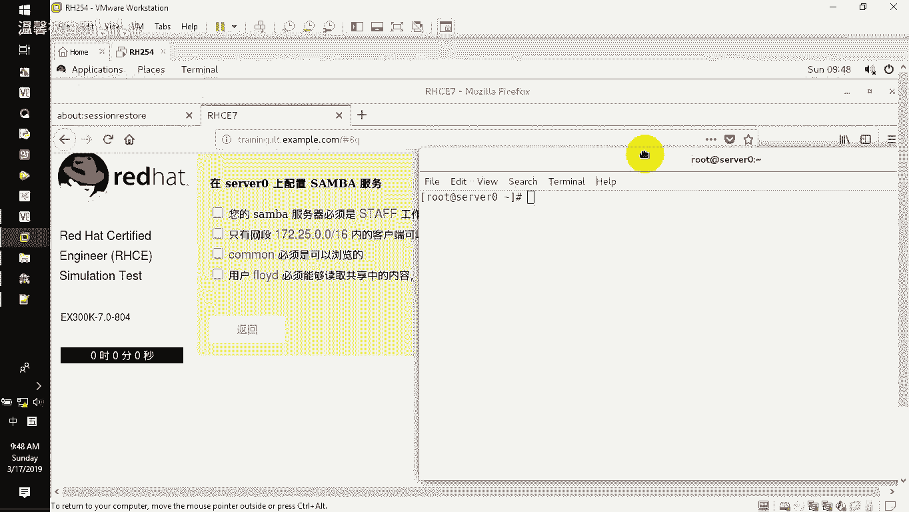
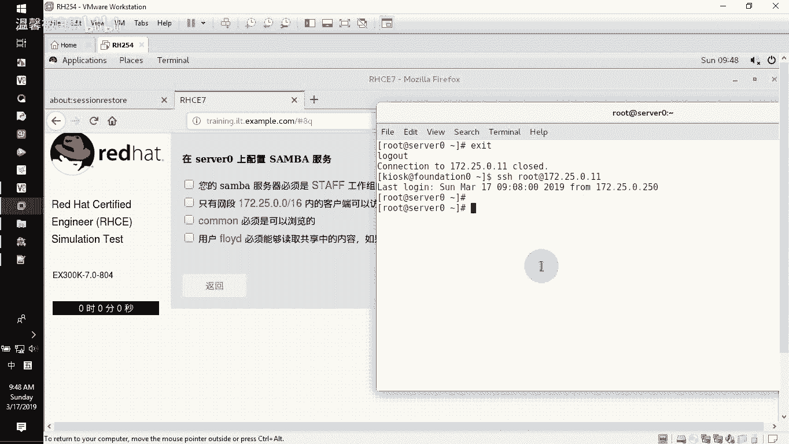
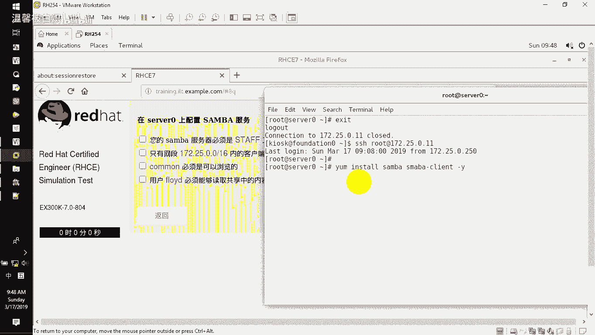
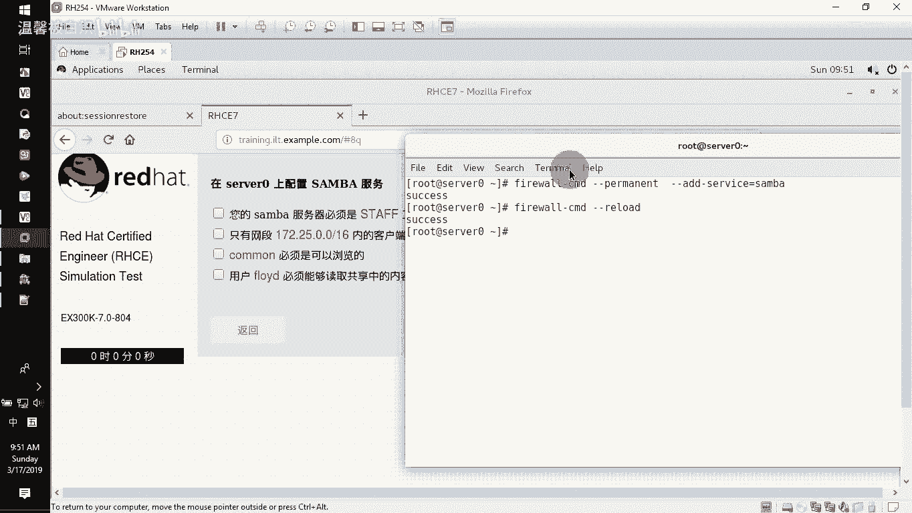
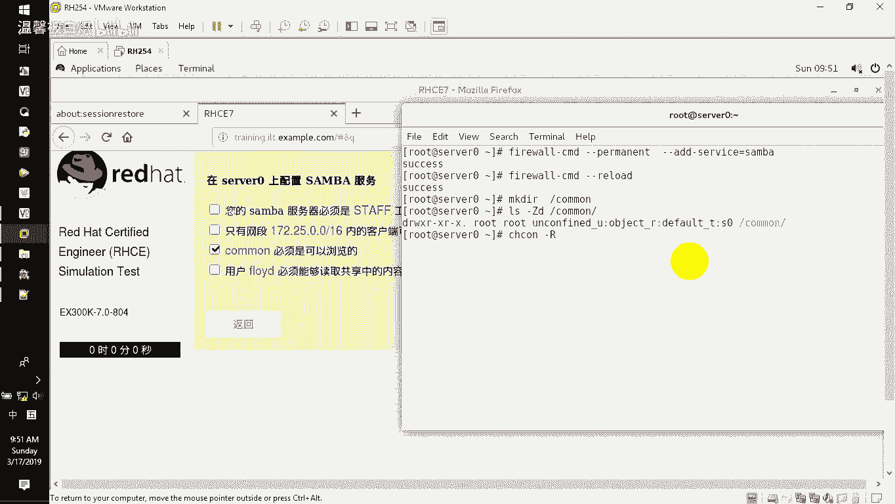

# RHCE--第345678天学习视频 - P6：samba共享 - 打羽毛球的橘猫 - BV1Bb411E73D

好，接下来呢我们要给大家去做的是三把的共享。通过三把发布我们的共享目录啊，就这一题。那看到这一题的话呢，我们直接就开始做了啊，直接拉出我们的。终端连到我们的server上面，因为它说的是server。

对不对？那一般的话你在连的时候，你就SH在你的这个呃真机里面就root用户连接这个server零连过去了之后呢，就开始去做你的这个操作。首先第一件事情，因为它是要做三把三把要做的就是要先装软件包。

先装软件包之前给大家讲过，你把y先做哈，有印象吗？我们昨天是给大家讲过那个样的，我就不再重复了。如果你忘记的时候，你就按照我们的这个要求去配置好了。好了，y安装s。

然后呢，它有一个客户端，三把一个客户端，s把杠cient。减Y自动回答个yes啊，就去安装我们的这个软件包。那你可以看到我的这个软件包安装的话呢，应该是在这个路径的啊，写错了一个s把杠。

Cient。刚是写成了SMA应该是SA。AM38看到了吧？啊，那软件包的话那就是一路去装装好就好了。那装好了之后，大家注意设置这个服务开机自启动systems CTLun。SMB然后NMB。

那在这边大家注意一下，我们的这个三把的服务，它是有两个，一个是我们所说的SMB。那另外一个是NMB呃，一个的话呢是我们的消息块服务，一个的话呢是windows的n解析服务啊。

那你应该知道这边是windows的这个n解析，一个是消息块。那只要两个开启就好了。那现在的话呢，我们就想开启它，那就把unablebel改成。star就可以去开放这两个呃服务。那这两个服务的话呢。

监听的端口。是137。138139445啊，137。138。139。445。啊，就监视这么多的端口。当然了呃，一般的话呢也没有像我一样去监视说哪个端口。一般的话呢，我看到有同学是SMB。

然后呢是那个NMB哎，就这样写就可以了。那你可以看到这边137138，这边是139445，看到不啊，这是我们看到的这个端口执行。好了，那看到了之后，接下来我们在服务上面把这个三把开放访问。

让人家可以通过防火墙来访问到我的三把fire。word干 commander干干perment后面直接增加。设ice。直接增加服务叫三保。这样的话呢人家就可以直接连过来去用你的这个三把啊，rero一下。

这是三把的这个防火墙开放。开放完防火墙了之后，接下来我们要新建一个那个目录，准备要让人家可以做共享的这个目录叫common啊。

好了，那把他拉过来。MK点啊新建一个根目录下面，比如说我们就叫common。那新建完了之后，接下来对我们这个common实现。SEinux的安全上下文。那SElinux的安全上下文，我们可以用LS。

减大Z小D看目录，看这个common很明显它是默认的不行。所以我们要s取CON减大L递归的给给谁呢？给项目减T啊，项目的话呢是一个sber下线sure下线T给这个common。

给诶。少写了一个啊share。然后呢在这边再去看的时候，我们会发现已经给了。看到了？给了之后呢，接下来你就可以去呃验证一下你的用户在不在。因为他说了这个用户有个用户的用户的话呢，我们ID去查看FL。

FLOYD啊。很遗憾，这个用户的话呢根本就没有没有怎么办？没有的话呢，我们需要大家用这个呃user艾添加1个FLOYD这个账号。那么如果可以。再给他书写一个密码啊。

记住这个用户账号都是要给SP下面的loing。如果你的账号没有给SB下面的loing将会被扣掉这道题，大概是扣3分之1的分。明白吗？这个账号一定要去加SB下面的noloing好了，那加完了之后。

用户的话呢才会说是有这个账号，那这个账号的话呢，我们呃不要给系统密码，如果你在后面加上给了一个系统密码，但注意我们上次有同学就是他不是要建个账号吗？建完账号呢，就给个密码，给个密码就给了他。

又扣了3分之1的分数。为什么又扣你分数？😡，因为他给的不是系统密码，而是什么密码，三把的验证密码能理解呗？三把的验证密码怎么给三把的验证密码，你可以通过这个PDboEDIT减A添加FLOYD这个账号。

添加过来的时候，他告诉你密码是什么？就是你的那个呃，他书写的是这个吧。😡，FLECTRAG。啊，然后。等一下啊。好，那建好了这个之后，这个用户才会存在的那现在的话呢有用户也有密码。

但是呢他没有本地登录的sell啊，大家要注意一下，这是呃看到题目的时候这个内容。那看完了这个了之后，接下来的话呢就是要把这个common。让他能够针对我们的这个172250点这个16位的源码来共享。

并且要设置它的这个呃。主机的。服务器必须要在t这个工作组里面。好，来看着。VI在EBC目录下面的s里面有个SMB点com，这是sber的主配置文件。记住它的主配置文件就在这个地方。

我们直接跑到这个文件最末尾，怎么样跑到最末尾一个大G就可以跑到最末尾两个小区它会跑到文件的最前面。那一个大G的话呢，用功能组合键shift加G，它就是一个大G，跑到最后面。

那我们后面的话呢就加入加什么呢？共享名就叫common。然后呢，它的路径page路径值就叫跟下面的。common然后呢，在书写的时候书写的时候，他会告诉我们说这个common必须是可浏览的。

可浏览的话呢就是这个bable看到没？所以你根本不用去记这个东西，你只要记Abable等于yes唉可浏览的嘛，是吧？就这样，然后呢，在用户使用的时候，他告诉我们说了这个用户的话呢，必须是呃能读取。

那默认能读取就好了。然后呢，你可以在里面去增加我们的这个呃网段，让这个网段可以访问common啊那网段增加的话呢是书写的时候用这个hosse。post啊 ALOW然后等号后面书写的时候就是呃172。

25。0啊，这样的话呢你就可以写。哎，不用啊，这是三个5了。那25就是16位言码，就这样就写就好了，就允许这个网断过来去访问他看到吧？好了，那么因为他说了这个用户必须要能够去读。

那我们只需要去看这个文件夹有没有读的权利就好了。啊，保存退出先，你看就写这么点东西，看到了吧啊，然后L来看一下我们的那ALL吧。L看common呃，减D来看了，只看这个目录啊。

减D只看这个目录有没有其他人就作为任何其他用户来讲，有没有一个读取的权限。你看主人家也有小组也有，其他人都有，那肯定有读了权限的。所以这个根本就不用去改，看到吗？根本就不用去动它。好了。

那做完了这个了之后，我们来测试一下我们刚刚在书写的这个主配置文件里面有没有问题，用text的PARM啊，然后来检测一下按回车就好了。那可以看到哎。com on没问题哦，这个网段允许的看到吧？啊。

他书写的时候都没问题。好了，那接下来的话呢，我们需要大家去把我们的这个服务给它重新启动就好了哦，不好意思，这个改了没有？这个工作组没有改吧，没有改啊，差点就这题又丢了分数啊。

我们压一下EDC目下面的三把。下面的SMB点com我们要跑到最。前面呃。还要再前面一点点。好了。啊，就在这个地方work group改成什么呢？stop哎就是STAFF好了，然后保存退出。这样的话呢。

你再去测试的时候应该也是呃没有问题的。因为前面看得到的就是这个看到吧？啊，我刚才一看的时候发现这边不是啊，所以才想起那也就是说大家注意啊，你做过哪个，你就勾哪个就好了啊，这样可以记住你做了哪些东西。

明白吧？好了，那做完这个的话呢，其实这一题就结束了，非常的简单好了。