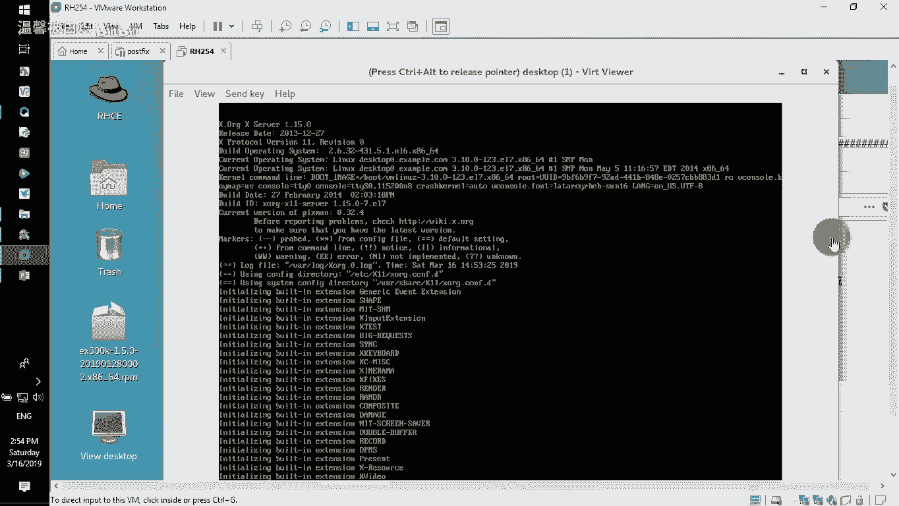
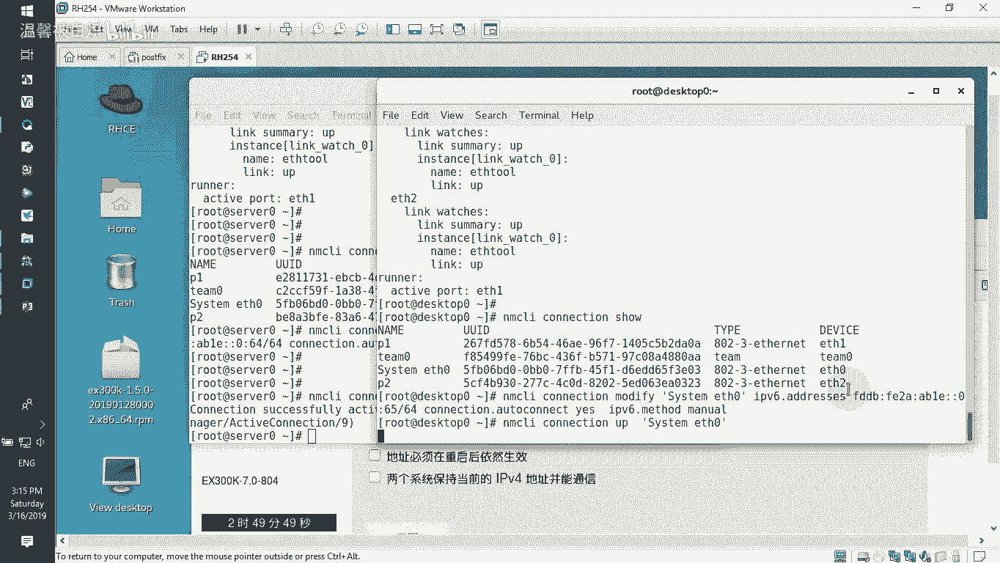

# RHCE--第345678天学习视频 - P7：rhce1-6 - 打羽毛球的橘猫 - BV1Bb411E73D

我这边呢是已经用XM杠s号把环境准备好了。

包括它的这个classroom，包括serv，包括我们的这个桌面测试机啊，都准备好了。准备好了之后呢，接下来在我们的环境里面，首先你打开的是你自己的这个IDCE的考试题。那这个考试题呢，首先。

在你们做题的时候，不要急着直接开始第一题了，先把额外的配置信息干嘛？看一遍好吧，先看一遍，总共的时间是有3个半小时是足够你去做练习的那为什么就足够？因为我们掌握技巧去练习。

实际上速度是很快的那浮起来IP然后客户端IP然后呢，我们的这个网段。然后呢，我们的这个域。然后它在里面的话呢有一些测试的一些账号提供的然后里面的话呢有这个光盘的样路径。

然后有一个不明的那个呃就大多数的话呢是不允许的一个域，它的域的这个IP地址是这个那有线的文档可能会发现在这个地方，什么叫有线的文档啊啊自己去看啊。好了，那一般呢我看到这里之后。

我会把我的一样环境给它配置一下。复制一下。然后选择在我的机器里面打开我的这个server和桌面机器SH。连接172。25。0。11或者10。但是你会发现在你们的考试机器环境里面啊。

很不友好的就是第一次是登不上的那我就演示告诉你，默认你就登不上，明白意思吧？默认你是登不上的那为什么登不上，是因为防火墙挡住了？所以当我们打开的时候，不要想着第一件事情是连接它，你要做的是打开这台主机。

打开了之后，root。

密码read hat啊，然后登进去了之后。

你。啊，登进去了之后，大家注意在这边选择。star x打开它的这个图形界面，打开了图形界面了之后，所做的第一件事情就是按照我们的这个内容里面把我们的这个SH把它放开，然后就可以做我们的这个样仓库了来。

是SH对吧？啊，你可以打开它，然后可以在这边的话呢，就一路去看了。他不是要这个网段能够访问这SH吗，对不对？来。

好了，先把防火墙打开，永远都要记住enabled。Fire world地。然后选择。现在就把防火墙给他。打开。打开了之后呢，直接选择fire word gang command杠 gang。

这是永久生效的杠干。案例。Gun rich rulers。然后呢，加上我们的这个ruler。Family。等于IPV4。选择IP address source。A滴滴。

source address就原地址是我们允许的172。25。0。016位的野码。然后呢，service。name等于SH，然后允许人家来访问accept。这是第一行不允许的那个行的话呢，你就改一改啊。

比如说不允许的那个。为 just。啊，那前面的话呢是把网段改成我记得好像刚刚我们看的时候是24。1点0124位的野码啊，二4位的野码。那这是做的。第一个看到了吧？非常非常的简单的这个做法。

所以呢当我们做完了第一个了之后，你在敲打的时候呢，那我们在外面肯定就可以连接它了，肯定就可以连。当然这只是一台。

我们还有另外的。桌面的这一台啊，vivo这个桌面这一台啊。跟我们刚刚一样，也是要先连进去。

然后大X。大家注意啊，为什么我们可以直接打开？因为它在给你的额外配置文档里面写有写的很清晰，写什么很清晰呢？它的root的这个密码就等于同于说他提供两台主机root的密码是什么？他写给你的，明白吗？

不像我们考CSA的时候，它有给你密码吗？

没有，那你自己去破，但现在还已经给你密码。当然你看到我们现在是一个reha的密码，他给你那个肯定不是reha的。那肯定不是危害，可能比较长啊，那你也不能改明白吗？他给你的密码，你还不能改，你不要乱来啊。

你别说是我在做实验的时候，我喜欢123456，对吧？你给我把root密码都改成123456，那你完蛋了，估计你重启的之后，人家扫不到你的主机的了啊，他的密码你不能改的好了那。😡，有它了之后呢。

接下来你就可以在第二台上面同样去配置你的这个呃服务了。就这边哈还是跟刚刚一样。

SystemCPL enable。Fire were。后面加个D哈，然后现在我就把这个fire word d给它启动起来。啊，然后选择fire。Where干 commander。杠杠。

然后呢选择杠杠艾添加一个reach rulers的这么一个配置项。那配置项里面的话呢，它专门针对的就是我们的ruler。Family。等于IPV4的，然后呢，选择的是地址sourcece。

地址的话呢用等号等起来2呃172哈。点25。0。0的网段16位的源码，然后呢选择service。name等于SH啊，然后动作accept。啊，允许他。同理还有一个是不允许的。Regest。

网断的话呢就是。17224。1。0的网段，然后是24位的源码，这个是不允许的。然后呢，你可以把我们的这个firework重新的去。引导一遍杠杠rero一下。哎，我刚刚那台reload一下了吗？

没有，那这边也要fire were gang commander干 gun。

rero一下。好了，那做好这两个了之后呢，其实这两台主机啊，我就可以用外面的机器，就是你们考试的时候也是一样的。就外面的机器这好你就可以SH去远端连接我们的那个机器了。那个机器的话呢。

如果你不记得IP它又写给你了。你看啊，在额外配置里面是不是也写给你。对不对？所以你根本就不用去看很多来172。25。0点。0。11，这是服务器的那一台，然后再多打开一个这个终端。

这个终端的话呢是呃HHro，然后连接172。25。0。10，这个是那台桌面的那台测试机。那正好的话你们就可以开始了。那也就是说第一第一个设置RPM的这个呃或者说设置仓库，那我们选择用y list。

我们现在有没有仓库一个都没有，看到吗？那也就是说你必须要在里面的话呢去呃做出你自己的仓库，包括这边也是一样的它已经清掉仓库了。看到吗？没有怎么办？没有的话呢，就像刚刚一样，在额外配置里面。

他告诉你我有个DVD路径的。就这个哈DVD路径，你就用这个DVD路径来作为你的仓库路径就好了啊那。copy一下。大多数的话，你就这样去copy就行啊。Young gang configurefi。

 gang manager， gun gang。艾丽点IEPO，然后选择把这一个。DVD的网络路径把它加过来。你看他加了一个这个配置文件，里面的话呢，它已经写了名字呃路径，然后enable。

但是就没有那个呃叫什么呢？就是密钥的这个检查。那我们只需要把这个密钥给它加载上去就行了。PKI下面的RPM杠GPG，然后底下的RPMre就这个文件，然后用RPM杠杠import。加载这个路径就是它。

加载过来的话呢，我们的这个服务也就搞定了。那也就是说这条命令我们只需要copy一下，然后再放到这台机器粘贴，然后呢把这行命令再拉过来。也就是说我现在两个主机都可以去选择安装软件包了。y re list。

能有一个了。看得到不啊，这就是比较经典的来y list，当然你可说哦那就显示所有嘛能用的嘛，是吧啊，所有都可以的那这是两边都可以去做的。而且你可以看到unableled啊，这边应该也是什么呢？

这边应该也唉enableable了。我怎么没看到这个这个小单词？啊，没看到这个小单词，哎，这边是看到的，看到吗啊，这是有个enableable的这么一个内容，可能要加个or参数，它才会显示这个东西。

好了，那做完第一个了之后，接下来我们做第二个。第二个的话呢就是VI。在因为题目里面有这题嘛，这题说了一个问题，说是配置SH两台主机的话呢，将它运行在强制模式，那就VIEDC。目录下面耶鼠标。

six configurefi SElinux，然后直接去改就好了。啊，可以看得到这边的。如果不会。上面有看到吗？在前面的地方有IIT6，然后这边这台也是一样。

VIEDC目录下面这是confi SElinux。同样的也把这个给他。改掉。N force。啊，然后做好了之后，IIT6去重启它，看到没？这个比较简单的了，因为做法的话呢并不难。

那就要看大家在做题的时候呢，有没有去认真去体会过这个做法啊。好了，那我这边的话呢。呃，仓库做好了，第一题也做好了。然后其实第二题我已经。也做的差不多了，因为SH连接嘛，对不对？好了，那接下来的话呢。

我们就要看去呃我们的那个第。我看还是第几题啊，应该是这边。SED你是搞定，然后SH也可以啊后自定义用户环境，那就要把这个自定义用户环境把它加过来。好了，呃，应该差不多了哈，这一行应该也差不多。好。

设我已经开好。接下来的话呢，我们就直接选择配置它的这个命令字。那配置的话呢比较easy，也比较简单的了。VI在EDC目录下面的BASHRC。

直接跑到文件最后面用shift加大就shift加G一个大G跑到最后面摁个O，它会往下敲一行areas。arasLALIAS然后PSA它要求就是这个PSA对不对？等于用引号引起来就是。

并下面的这个PS下面杠AUX那这行内容呢。copy一下啊。在客户端这边。客户端也连过来了，看到了吧？然后VI下在EDC目下BSHRC啊，同样的。跑到最后面去插入。啊，做好了之后呢。

保存退出这边也是一样的，保存退出以后用sourcece去命呃加载这个BSHRC啊，那这边也是一样，用这个source去。加载ECCBSHRC做好了之后，这一题验证的时候，你直接就可以验证。

比如说我们打PA啊，就PAA啊，是PAS还是PSA？PSA那没问题，那这边也是PSA也没问题。那切换个账号试一下吗？S然后SDUDNT studentdent然后PSA哎PSA。啊，老师打错没问题。

看到吧？那既然这边都没问题，那肯定这边也肯定OK的啊。然后你可以在里面切换一下。😊，然后PSA那一样没问题啊，退出来就好了。那这已经OK了啊，接下来继续。啊，你打成了什么东西？打成BS肯定不行啊，你们。

对这个肯定报错的啊，你那个不严谨。好吧，来下一题就是我们所说的这个防火墙的这个端口转发。转发的话呢，也就意味着告诉你，你访问服务器的5423等同于访问他的80他只说了在服务器上做。

你别给我跑到客户端上做了。好吧，这样的话呢就等同于白做了。对好啊那fire were commander杠干然后选择干杠就我们所说的那个内容的话呢，就是专门用我们的那个呃规则来实现它啊。

然后单引号引起来rur i p v4呃，就呃，不好意思，fami没打fa。等于IPV4啊，这是我们做的这个默认的这个配置啊。然后接下来的话呢，在配置的时候，你要告诉他设施。

IP at source other。等于默认的172。25。0。0，然后斜杠16位的源码这些原地址过来的时候，当他们要去访问端口5423做转发，我们说一个for word。干port。

然后你要指定port等于5423，然后你要写的是portpart等于TCP的端口to干 port，也就说从原来的端口5423跑到另外的端口为80。然后在做的话呢，就直接写完就好了。哎。等于。80好了。

写好了话呢，其实这行就是等同于外面的人访问5423，等同于访问这个80端口好了。那对外的话你要告诉人家，我开放这个5423，同样的把我们的这个fire word gang commander杠杠。

然后呢在配置的时候，杠杠ed杠 rich rulers，然后配置的时候呢增加一条不规则fami。等于IPV4。又写错了吗？啊，ruer又打错了。啊，IPV4的这边。

然后同样的是sourceceSOURCdress。等号。172。点25。0点。0斜杠16位的掩码，然后这个网段人过来，允许他们去访问什么呢？port端口等于5423。然后协议的话呢，port。

等于这个TCP的端口动作为ACCEPT。I see political。是哎，为什么老打错字呢？P。是这个吧。好嘞，来做好了之后呢，把防火墙firework。嗯。

g commander干干 rero一下。那这样的话呢，我们的这个端口转发就写好了，其实也就是简单的两条。那在你们用的时候呢，你就这样去用就好了list。杠哦，那你可以从这个地方可以看得到的。

我们SH的话呢，有拒有允许有拒绝。5423呢有开放端口，有开放5423能访问里面的80端口，看得到吧啊，这是书写的一种做法。好了，那接下来的话呢就是要去配置我们的这个呃链路的聚合链路聚合。

这个哈配置链路聚合，这个也很简单IPADD。两边的接口都是IBDD都有ETH1和ETH2。那配置的IB地址就配置成我们的。0。18呃0。11或者0。10，这是两个主机啊，两个接口链路聚合，其他都要生效。

保持开机也生效啊，怎么去做呢？看看。NMCIcon show可以看得到我们现在的这个只有它一和二是没有的对吧？好了，然后。Never manage CI connections。艾例添加tateam。

然后选择接口名classs杠 name是一个叫team0，然后接口名字if name也是叫team0。然后confire在书写的时候，单引号里面写一对大括号，那里面写什么东西，写的东西是在这边。

我在客户端这边找就好了。cat一下EDC啊，user share。BOC。team下面的examp configurefi，然后我们直接act backARP一行，然后里面找一个文件就好了，就是。

这个文件看到了吧？copy一下，然后跑到这边把它粘过来，粘完了之后回车。这行命令它在另外一边同样也要去敲打，看到吧？两边都一样的嘛。

然后我们直接选择nwork manager CI connections add table。Tam。杠 slave就接口的话呢，是比如说PE的接口。

接口名字是ETH一号网络连接master是给tam0。然后同理这行的话呢，他要把那个。2号接口。改成呃，让人家看到是P2，对不对？好了，那我们把这两行。copy一下。粘贴那么一下，然后这一行在。

copy一下，这边再粘贴一下。好了，然后配IP。connes film然后team0，我们就是为这个team名配IP，你别配别的哈。然后呢，IPV4。address啊，你配的IP我们刚才看的时候。

他说的要求我们配的IP的话，那是192168。1。这个0。11的是吧？那我们把它配出来就好了。好了，IVad192。168。0。11，然后24位的源码，然后配置的时候IPV4点。

没说后面的话呢是manu menuu，然后你打个面也行的，好吧，manu你可以简写成一个面。然后plans。all to connections yes，为什么要这个它会保持系统重启后照常运行。

就是自动连接的时候，正常启动的自动能够连上。好了，这行命令在对方。也要去敲，只不过IB地址变成什么呢？对方是10。好，那做好了之后，我们把这个接口的话呢给它up起来，up一下team0。啊。

包括这边一样NMCI connections up team。0就可以了。看到吧？那我们设好了之后呢，我们就可以去看。当然了上次的话呢。

在一些呃就之前我看这个瑞通之前有一个老师他说了还要把这个P一也开一下然后P2也开一下，这边的话呢再把这个P也打开啊，他怕你们那个P和P2的接口啊，就是只是有在那里，并没有并没有开店。

或者说他并没有去执行这个东西，他把这两个也加上啊，这个没问题，反正都一样的。好吧啊，就开启它就好了。那接下来的话你就可以用过team cTLteam的 dCTL。

然后直接看team0啊state就可以看到这个状态了。包括这边也是一样的，可以看得到我们的这个主机的状态啊啊，看完了之后，接下来我们就配置一下IPV6。

IPV6IPV6的话，他要求我们配置服务器上面是这个地址，客户端上面是这个地址。那呃容易犯错的地方是这样。上次有同学连。他复制了这么多。这还差什么呀？😡，他没复制完啊。

最后的话呢发现了他做他考试出来很轻松。他说老师没有300分，估计都有290啊。然后一出来的时候，刚好这个200230分啊，然后。就就再差一点就不过了是吧啊，就比较悲剧。所以呢呃严谨啊一要严谨。好了。

那它是在哪个地方去配置NMCRI然后connes show。当我们去看的时候，他要求什么呢？要求在ETH0上面配IP。但是我们去看的时候，我们根本就没看到ETH0ETH0的配置文件设备是ETH0。

它的配置文件是哪个？system空格ETH0，所以别被他忽悠了好吗？你配的是system空格ETH0。但是如果你们考试的时候，它刚好这边设备是ETH0配置文件也是ETH0，那推好不过了，对不对？好。

那现在没有这么好来NMCRI，然后引号引起来sstemETH0我table就推出来了啊，然后直接修改它IPV6点address，然后把这个地址给它。复制出来。copy一下啊。有了地址了之后。

他还说了这个地址的话呢，要保持重启生效，所以你还得干嘛connes。all to connectionsy，然后把它设为手动的这个模式啊啊然后IPV6点me后面的话呢改成menu。看到了没？啊。

这行命令是不是也要在对方敲一下？是不是也是这个地方，当然你可以看一下啊NMCI connect损失，然后修how命令来查看一下，哎，他也是这样，那就直接来。啊，IP改一改，那边是64，这边就是。

65没复制完吗？哪个？哦，前面。NM。CLI。CO，NN。我把这个给他删了就行。哎。好，可以了。那这边的话呢是65，这边是64。然后呢。

我们只需要去选择NMCI connections up加上我们的这个stem EH0把它开起来就行了。啊。system ETHD然后做好了之后呢，我们来看一下IP地址哈，有它的这个IPV。

6的地址，然后这边也有它的这个IPV6的地址。那我们只需要拿个IPV6的地址来拼一下啊，用拼6就可以拼它啊。好，然后我们用这个服务器拼6去拼这个地址。而且他的题目里面要求说你不单只这个地址能通。

还要保留原来的IPV4哦。原来IPV4哎，来，我看看我的IPP4能不能跟以前的他这个地址通讯呢，然后再回到我的服务器界面再拼一下啊。没问题，看到了吗？好了，那实际上的话呢，我们做题目的时候。

我不知道带有。