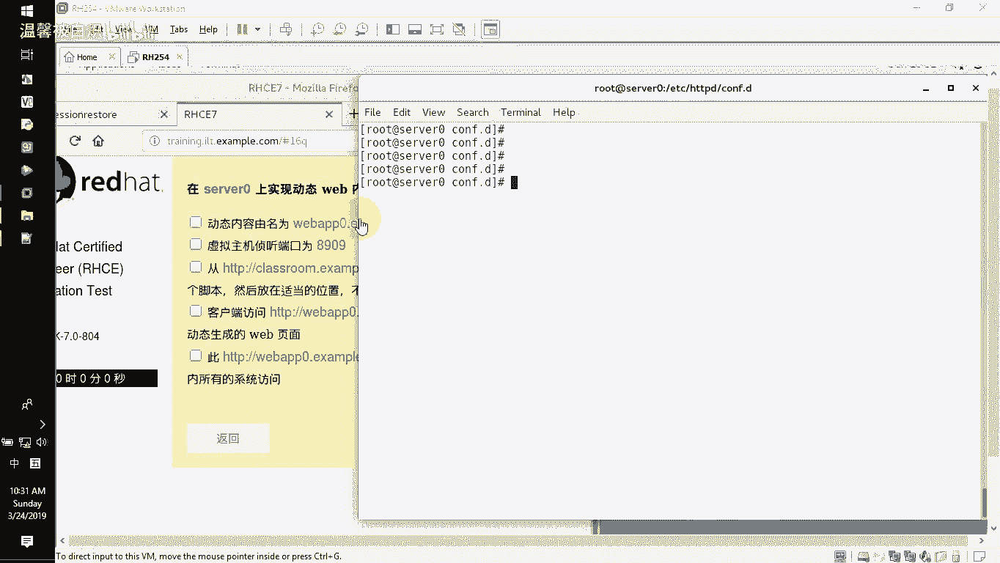
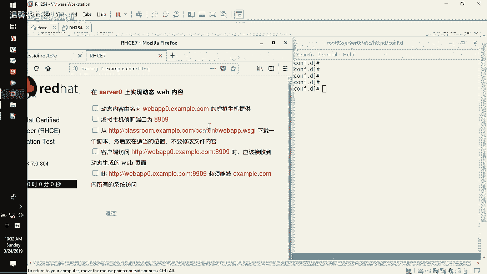
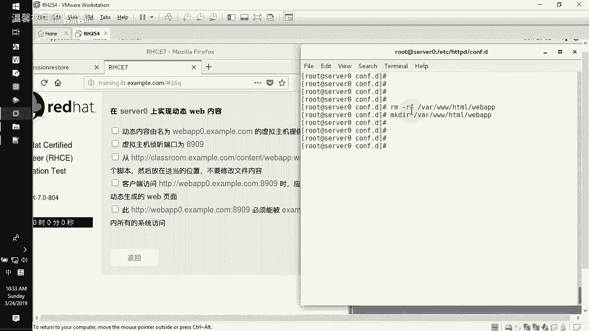
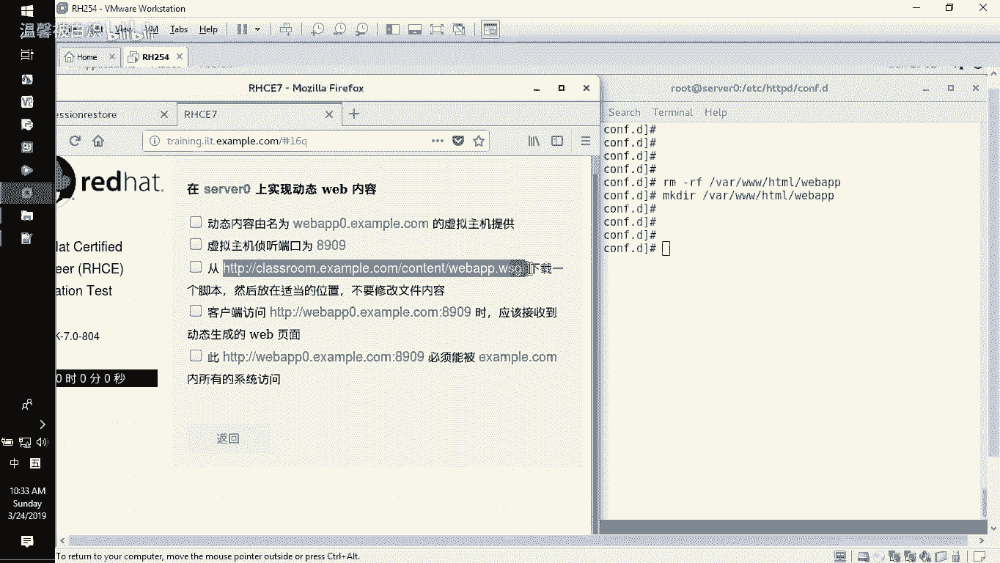
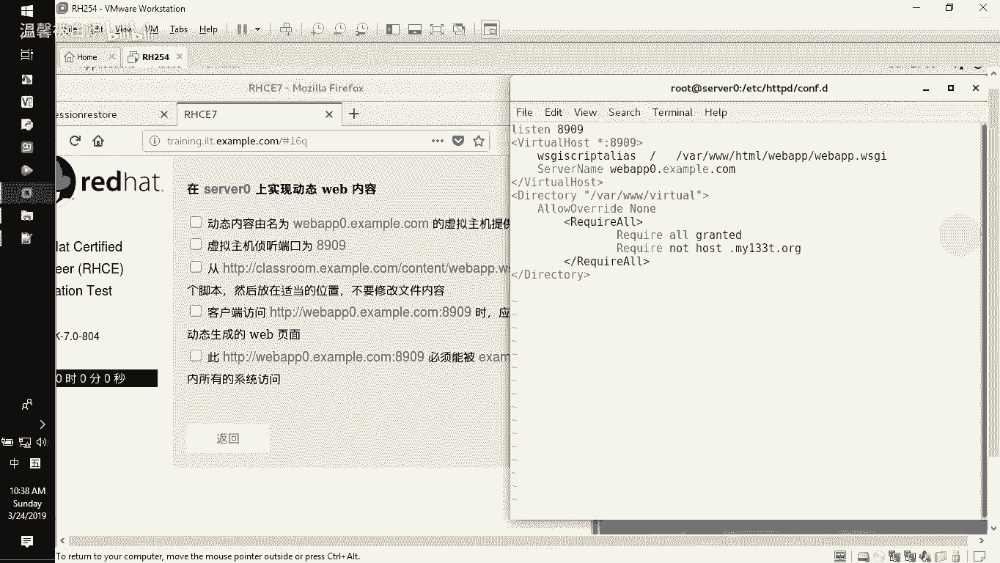
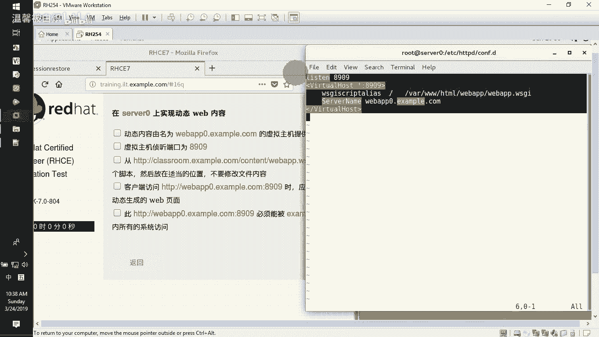
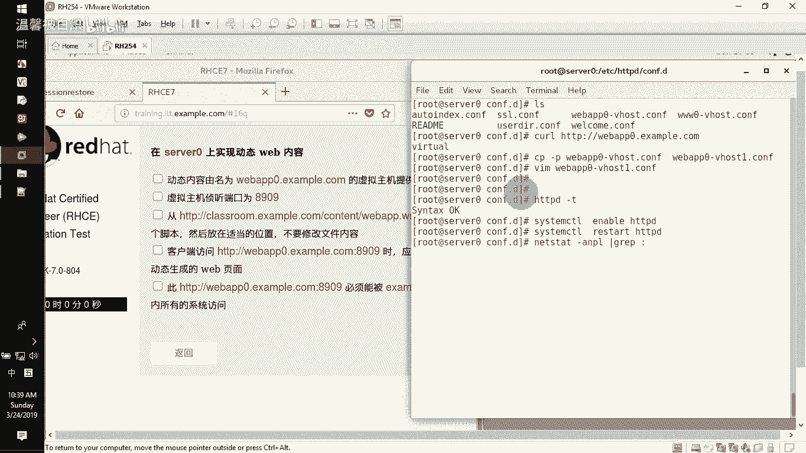
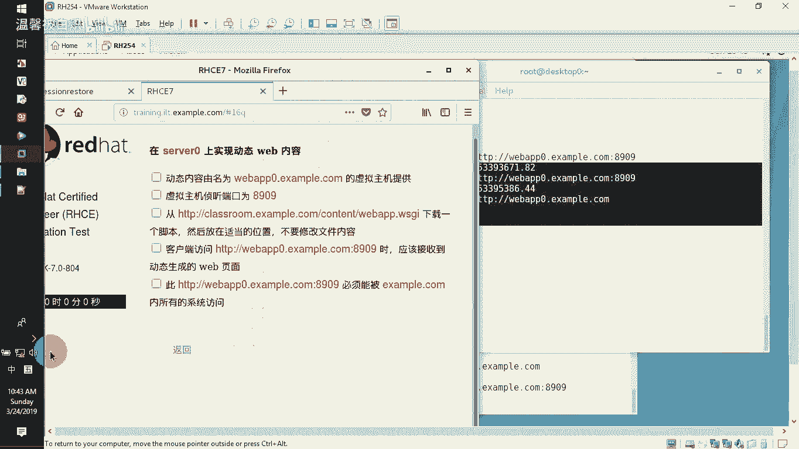

# RHCE-45678天学习视频 - P10：web-wsgi - 打羽毛球的橘猫 - BV14b411g72P

现在开始。那接下来要给大家去做的这一题呢，是在wordb服务器上面实现动态的页面的一种做法。而且这题里面的考试内容有三个部分，第一就是它的端口。

要重新的去开放另外一个端口。第二个就在我们的配置文件里面，如何去增加让它支持我们的这个WSGI的这么一个呃文档。第三个，在防火墙里面去增加对我们的端口访问，允许。网段拒绝某一个网段。

那这边的话呢在应用的时候，就是我们看到的这个内容。那接下来的话我们就开始去对我们的这个目录实现配置。

那目录时间配置的话呢，第一呃我们之前的话呢，我们不知道有没有去在one下面3WHML下面去删，就是增加过这个wabAPP的这么一个文件夹。那我们现在没有啊。

那我现在重新去建一个啊makeR在one下面3WHML下面新建这个wabAPP那有了这个bAPP了之后，我们需要去从这个站点下面去下载这个WSGI的这么一个页面把它下载下来。Wge。

点大O指令放下来的页面。在Y3WHML下面，wordbAPP0下面啊，就wordbAPP下面建一个wordbAPP点WSGI的这么一个文件。然后通过我们刚刚这个网址路径。把它下了下来。下下来了之后。

我们去看了啊，我们C啊就直接ca一下哇3WHML下面 aP下面的这一个 aP点WSGI的这个文件，它是一个这个页面代码。而且它里面用的是python来写的那写的东西的话呢。

其实里面就是我们所看到的一个这个状态值，包括它会告诉我们的一些信息，那里面的话呢在信息显示的过程当中，它会显示一个什么呢？在包里面给我们显示的一个unix的一个时间啊，然后告诉我们现在的这个时间。

几年几月几号，对吧？啊就几呃就几点几分啊，这个然后怎么去实现这个页面，或者怎么去看这个页面。那我们现在肯定是看不了，怎么办呢？第一。端口开放。默认情况下，我们可以用SEmanager。Pt。

然后减L列出来关于我们的HDDP的端口。那列出来了之后，发现它这边并没有一个叫8909的这么一个端口。那我们需要去开放这个端口SE manager。Pt。减A减T项目就是这个哈HDDPport减T啊。

HDP。下线port下线T，然后减P指定TCP的。因为你看到这边是DCP的是吧？TCP的8909端口，就是这题目里面要求的8909的这么一个端口。好了，加进来。加进来了之后，你重新去查看的时候。

能看得到这个端口啊，这是安全端口开放的一种做法。哎，还真的有点慢哦。哎，可以了。那正好的话呢，这个端口已经开好，开好了之后，我们重新来看的时候，你发现8909的端口已经在里面了。那在里面了之后。

接下来就是要去新增加我们WSGI的这个模块。然后呢让我们的这个配置文件可以支持WSGI的这个脚本。Young in。modode下线WSGI。啊，Yeses。写好就安装我们的这个软件了之后。

接下来就是写配置文件CD到EDCHDDVDconfig。点滴一下面。那么这个目录底下呢就有我们的配置文件有哪一些呢？就是我们之前的那些。那我们现在的话呢就直接用这个WAPP来实现它。

因为它这里面是webAPP0点ex点com监是8909端口。那么前期就前期呢我们是做过一个。HDDB冒号verb哎双斜杠啊。wobAPP0点啊。

就杠那个我记道这是example点com是做过这样一个网站的，就虚拟主机，对不对？但是这好要求是8909的端口，所以我们直接copy这个配置文件。咖评。啊，我们可以直接。减P把这个。

WbAPP0把它改成我们这个wab aV0。哎，比如说这边是另外一个了，就一就不要B后了，就一就好了。好了，那正好的话那么重新去编辑这个文件wordb AP0。Vho一点comp这个配置文件。

那么这个配置文件前面大家注意，我们需要大家去加上监听，也就是说listen。listen8909的端口，请把下面的这个端口改成8909的端口，看到吧？改动它。然后接下来呢在它的这个呃域名里面。

它依然还是这个web APP0点example点com。但是它的这个文档已经不再是选择用document rootot的这种直接书写方法。它要选择用W。

SGIscript SCRIPT啊arias ALIAS啊 areasas当人家访问这个WSGI的脚本跟的时候，让它访问到Y下面3W。

HML下面webAPP下面有一个叫weberAPP点WSGI的这个文件，其实就是你刚刚下载这个文件的路径，对不对啊，就是你下载它。那么底下的话呢，这一堆都不要了啊，这一堆没有目录授权的了。

也就是说没有目录授权的话呢，我们还要允许某一个网段拒绝某个网段的时候，那你在这边没法写的时候，你只能在哪写，你就只能在我们的那个叫防火墙里面去书写了。好，那写好它了之后保存退出。

检测一下配件文件有没有写错啊。啊，没有问题。然后接下来的话呢，我们去启动一下我们的这个服务system CDL啊，默种情况下enableable这个HDDBD啊本来就以前就enable过的。

所以呢我们现在就直接把这个服务给它re一下。好，先试一下8909端口是否开的。let stay杠NP grip管道过滤80，还有一个是8909的端口，有的。那么8909的端口呢需要在防火墙里面去开放。

那么也就意味着说我们的这个fire word commander杠杠list杠哦，它里面呢需要你去开放我们所说的这个端口，开放什么端口呢？开放我们的这个默认的端口为8909的端口，还要开放副规则。

德里面允许这个example点com的这个域。也就是说example点com的话呢，其实在前面考试的额外配置信息里面就告诉你我们的这个example点com的话呢。

它的这个域其实就是我们所说的17225的这个网段。然后呢里面的那个。Y133T呢就是17224的这个网段。所以你通过这个地方，你就可以看到它的这个额外的配置信息。那看完额外配置信息呢。

你就直接在防火墙里面去开放和关闭某一个端口就好了。好了，那这边比较经典啊，开始。反re。We gang commander。杠杠旁边后面直接加上杠杠ADD添加一个port。

等于这个8909的端口是一个叫TCP的端口。那开放完了之后，再去意，现在所有人都可以访问了。但是我要指定的是某一个能访问，还要拒绝这个某一个，那怎么办呢？

那我们把这个端口开放的时候ADD添加一条负规则 rulers然后指定我的ruler是谁？ruler是IPV4的famiry啊，fami。等于IPV4，然后source。ある address。等于172。

25。0。0，然后斜杠16位的掩码。然后接下来的话呢呃端口portport等于89。8909的端口，然后协议你要告诉人家port。等于那个叫呃我们所说的TCP对吧？

然后动作为ACCEPT accept好，那就是第一行。那我们要拒绝某一行，再把这个accept改成redress。JECTre，然后拒绝的网段是另外一个。172。24。1。0斜杠24位的言码。

是这个网段对不对？这个是被拒绝的。然后呢，做好了这个允许有拒绝有8909的端口开放。那你做的这下面一个的话呢，就是fireever gun。Commander gang gang。

reload一下我们的这个防火墙。那做好这个的话呢，我们可以直接重新的去看一看我的这个防火墙就好了啊，list杠哦，你可以看到端口这边开放了一个叫。8909看到吗？然后呢。

在附规则里面我们去呃允许人家访问这个8909的话，那是这个呃这个是被拒绝的，然后允许的是。哎890啊，这个是允许的，看到吗？啊，这个是有拒绝有被允许的这么一个内容，你可以看得到的。好了。

这边呢就是我们所看到的这个呃配置文件，包括我们所说的这个端口的开放。那接下来的话呢，我们就去验证一下我们的这个配置是否成功哈。在服务器上面CUL。然后HTP马双斜杠访问。WbAPP0点example。

点com默认是这个站点，但是没有加端口之前，它是有一个虚拟站点的。然后我们加端口8909。没问题，看到了吧？然后也要求，因为你在本机上面测试的话呢，并不能代表说我们这个网段其他人能访问。

所以我们还要在客户端这边也依然的要去访问一次。那也依然的话呢去访问那个没有加端口之前的虚拟站点。那你可以看到是没有问题的。看到吧？这就是我们所看到的这个实现一个wordb的这个动态页的一种做法。好了。

先把录像结束一下。

