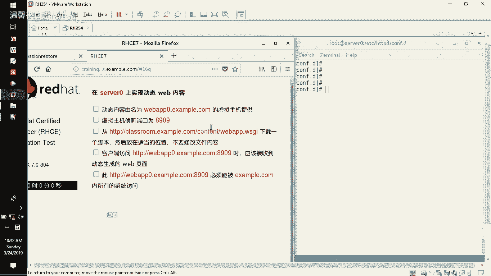
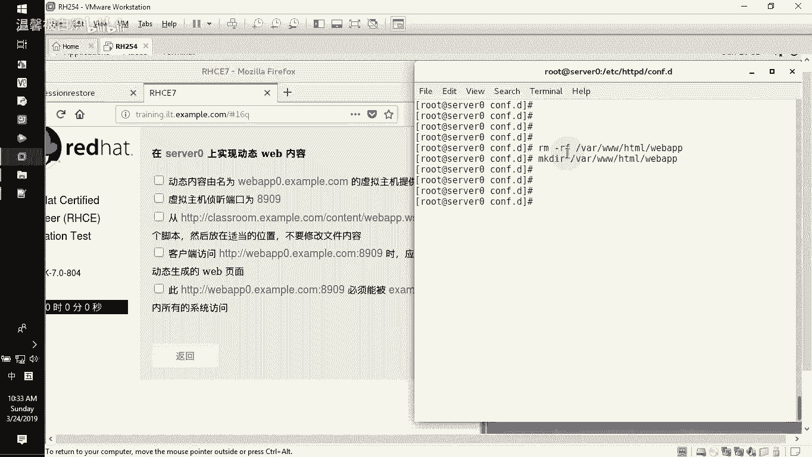
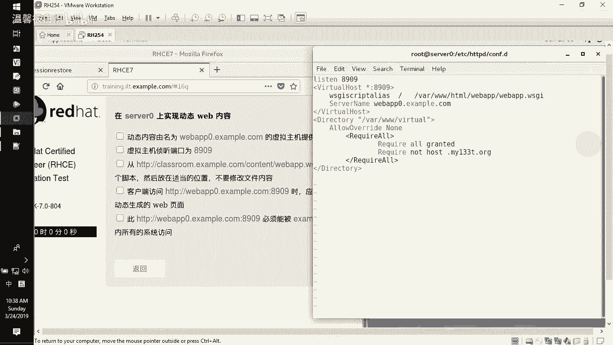
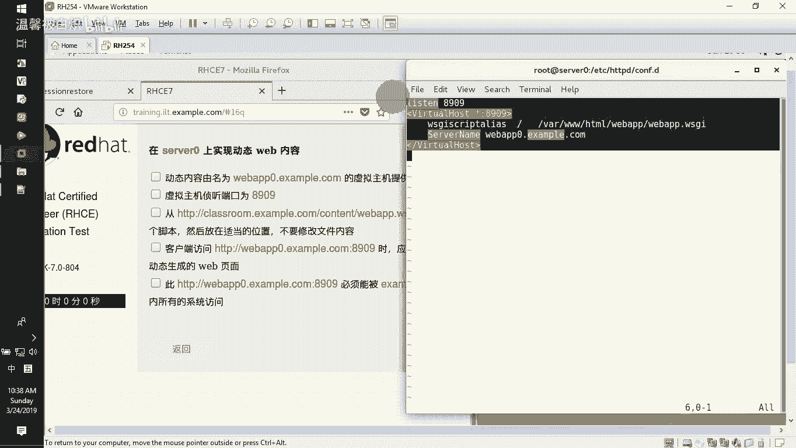
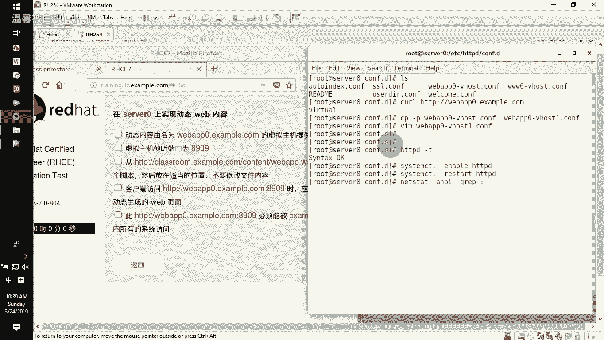
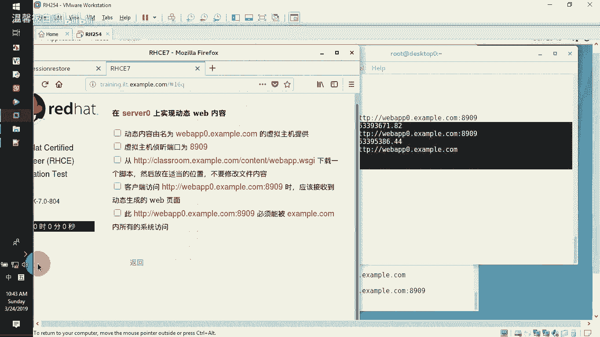

# RHCE-45678天学习视频：P10：Web-WSGI 配置教程 🚀


在本节课中，我们将学习如何在 Apache HTTP 服务器上配置 WSGI 应用，以实现动态网页内容。主要内容包括：开放特定端口、配置 Apache 以支持 WSGI 模块，以及设置防火墙规则来控制特定网段的访问。



---

## 准备工作 📂




上一节我们介绍了动态网页的基本概念，本节中我们来看看具体的配置步骤。首先，我们需要创建应用目录并获取 WSGI 脚本。

1.  在 `/var/www/html/` 目录下创建应用文件夹 `webapp`。
    ```bash
    mkdir /var/www/html/webapp
    ```
2.  从指定站点下载 WSGI 脚本文件 `webapp.wsgi` 到该目录下。

---

## 步骤一：开放服务端口 🔓

默认情况下，Apache 可能未监听题目要求的端口。我们需要使用 `firewall-cmd` 命令开放 TCP 8909 端口。

以下是操作步骤：
1.  首先，检查当前已开放的 HTTP 相关端口。
    ```bash
    firewall-cmd --list-ports | grep http
    ```
2.  添加 8909 端口到防火墙规则中。
    ```bash
    firewall-cmd --permanent --add-port=8909/tcp
    ```
3.  重新加载防火墙配置使规则生效。
    ```bash
    firewall-cmd --reload
    ```
4.  再次检查，确认 8909 端口已成功开放。

---

## 步骤二：安装并启用 WSGI 模块 ⚙️

为了让 Apache 能够处理 WSGI 应用，我们需要安装并启用 `mod_wsgi` 模块。

1.  使用 `yum` 包管理器安装 `mod_wsgi`。
    ```bash
    yum install -y mod_wsgi
    ```
2.  安装完成后，该模块通常会自动启用。你可以通过检查 Apache 模块目录或配置文件来确认。

---

## 步骤三：配置 Apache 虚拟主机 🗂️



接下来，我们需要为 WSGI 应用创建一个新的虚拟主机配置文件。



1.  进入 Apache 配置目录。
    ```bash
    cd /etc/httpd/conf.d/
    ```
2.  基于已有的虚拟主机配置文件（例如 `webapp0.conf`）创建一个新的配置文件，例如 `webapp1.conf`。
    ```bash
    cp webapp0.conf webapp1.conf
    ```
3.  编辑新的配置文件 `webapp1.conf`，进行以下关键修改：
    *   在文件顶部添加 `Listen 8909` 指令，指定监听端口。
    *   将 `<VirtualHost>` 块内的端口号修改为 `8909`。
    *   将 `DocumentRoot` 指令替换为 `WSGIScriptAlias` 指令，指向我们下载的 WSGI 脚本文件。
        ```apache
        WSGIScriptAlias / /var/www/html/webapp/webapp.wsgi
        ```
    *   移除原配置中关于目录授权（如 `<Directory>` 块）的部分，访问控制将通过防火墙实现。

4.  保存文件后，使用以下命令检查配置文件语法是否正确。
    ```bash
    apachectl configtest
    ```
5.  确认无误后，重新加载 Apache 服务以使新配置生效。
    ```bash
    systemctl reload httpd
    ```

---



## 步骤四：配置防火墙访问控制 🛡️

上一节我们配置了 Apache，本节中我们来看看如何通过防火墙精确控制访问来源。根据题目要求，我们需要允许 `172.25.0.0/16` 网段访问，同时拒绝 `172.24.0.0/24` 网段。

以下是具体的防火墙规则配置步骤：
1.  添加一条富规则，允许指定网段访问 8909 端口。
    ```bash
    firewall-cmd --permanent --add-rich-rule='rule family="ipv4" source address="172.25.0.0/16" port port="8909" protocol="tcp" accept'
    ```
2.  添加另一条富规则，拒绝另一个网段访问 8909 端口。
    ```bash
    firewall-cmd --permanent --add-rich-rule='rule family="ipv4" source address="172.24.0.0/24" port port="8909" protocol="tcp" reject'
    ```
3.  重新加载防火墙配置。
    ```bash
    firewall-cmd --reload
    ```
4.  列出所有富规则，验证配置是否正确。
    ```bash
    firewall-cmd --list-rich-rules
    ```

---

## 步骤五：测试验证 ✅

配置完成后，我们需要在服务器和客户端进行测试，以确保功能正常且访问控制生效。

1.  **服务器本地测试**：在服务器上使用 `curl` 命令访问应用，应能成功获取动态生成的页面内容。
    ```bash
    curl http://webapp0.example.com:8909
    ```
2.  **客户端测试**：从属于允许网段（`172.25.0.0/16`）的客户端进行访问，应能正常看到页面。而从被拒绝网段（`172.24.0.0/24`）的客户端访问，连接应被拒绝。

---

## 总结 📝



本节课中我们一起学习了在 Apache 上部署 WSGI 动态应用的全过程。我们首先创建了应用目录并准备了脚本，然后开放了服务端口并安装了必要的模块。接着，我们配置了 Apache 虚拟主机来指向 WSGI 应用，并最终通过防火墙的富规则实现了精细的源IP访问控制。这套流程涵盖了在 Red Hat 环境中配置 Web 应用服务与安全策略的核心步骤。