# RHCE-45678天学习视频：P11：iSCSI配置教程 🖥️

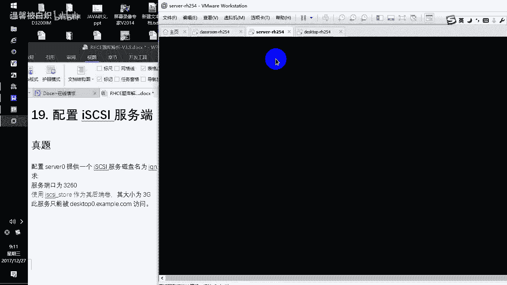

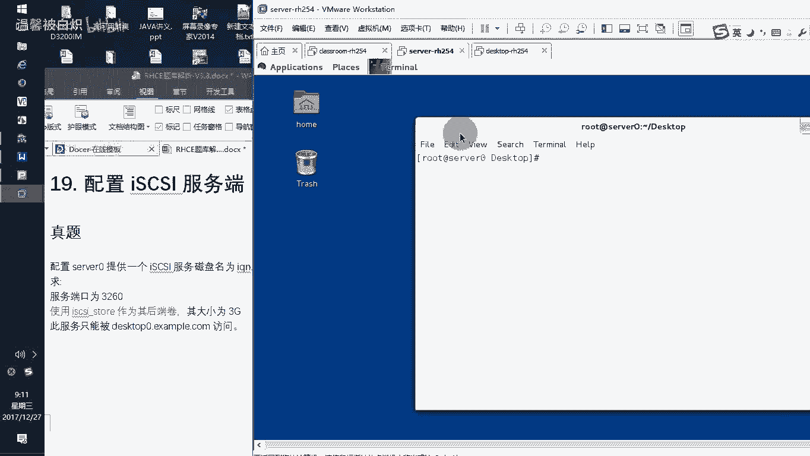

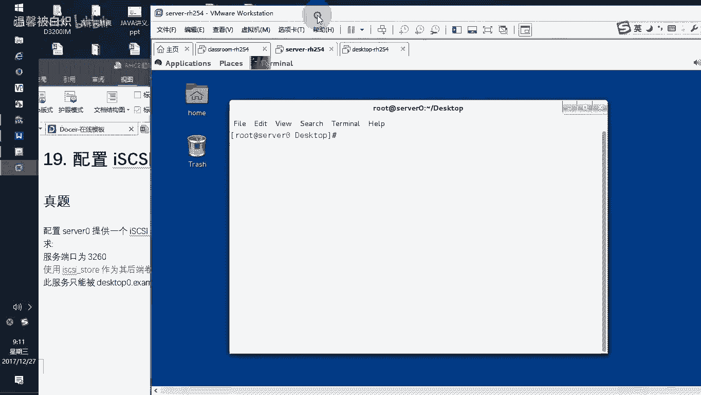

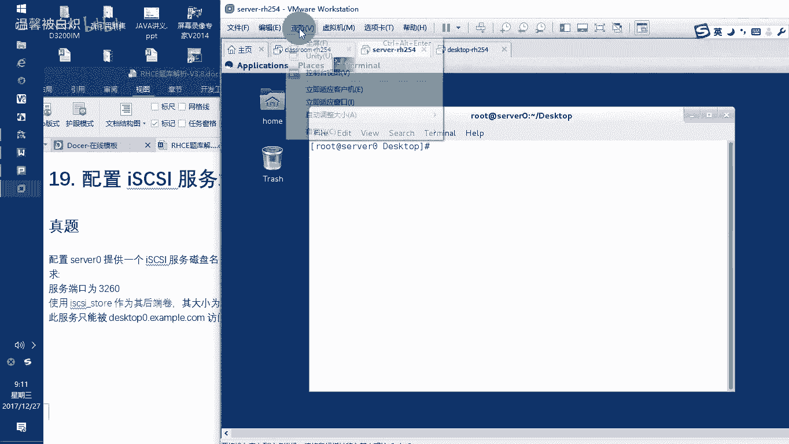

在本教程中，我们将学习如何在Red Hat环境中配置iSCSI服务。iSCSI是一种基于IP网络的存储协议，允许客户端（发起者）通过网络访问服务器（目标）上的块存储设备。我们将分步完成服务端配置、客户端连接以及存储的挂载。

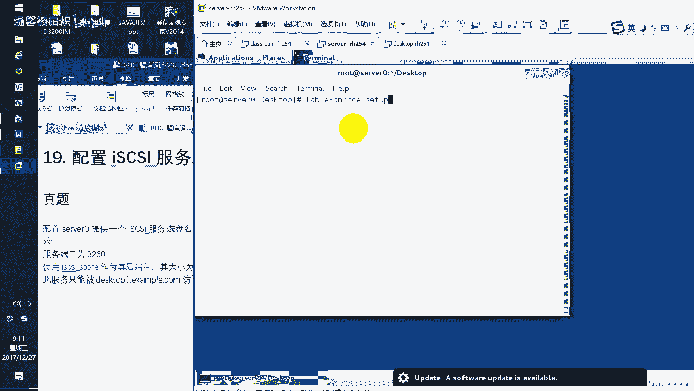

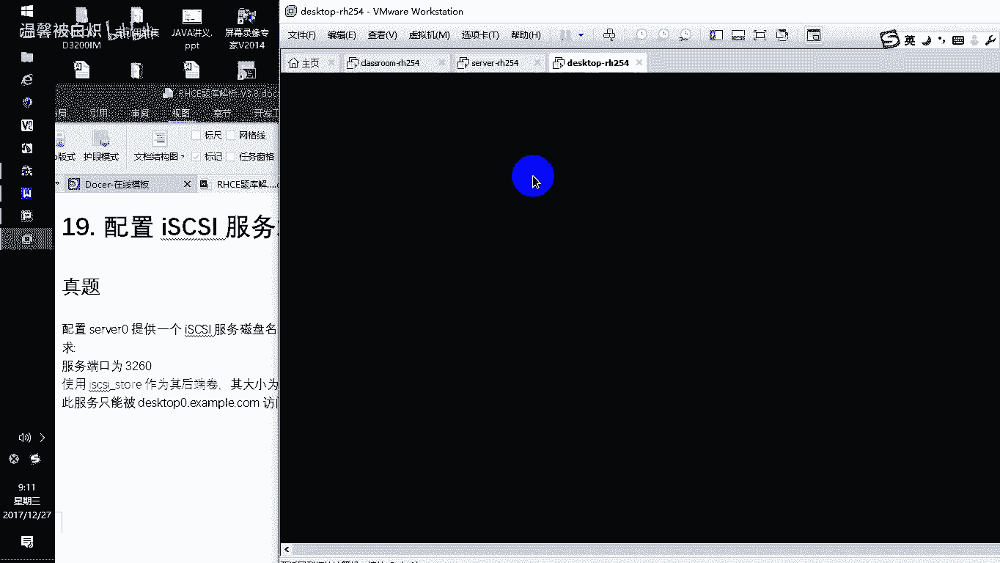

## 概述 📋

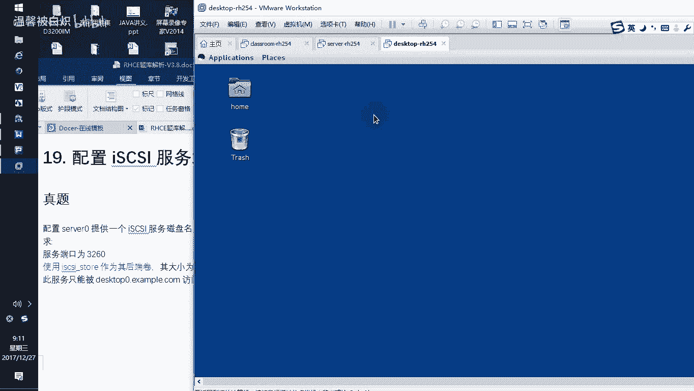

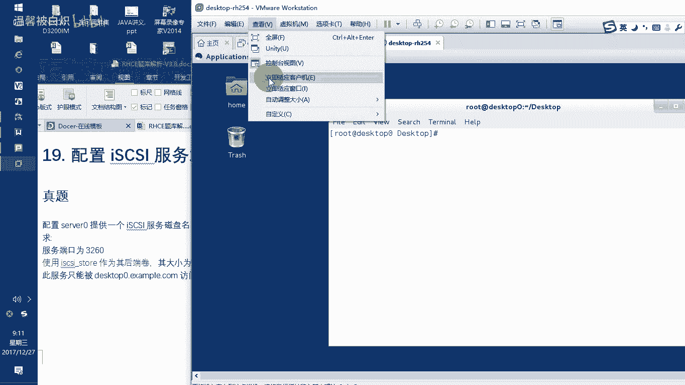

本节课我们将学习iSCSI存储服务的完整配置流程。主要内容包括：
1.  在服务器端创建后端存储卷并配置iSCSI目标。
2.  在客户端配置iSCSI发起者，连接服务器端的目标并挂载存储。
3.  配置防火墙规则和自动挂载。

---

## 服务器端配置 🔧

上一节我们概述了课程内容，本节中我们来看看如何在服务器端进行配置。

首先，我们需要登录到服务器（server0），使用root账户进入系统。由于是恢复的快照环境，需要先设置考试环境标签。

### 准备后端存储卷

在配置iSCSI服务之前，需要先为服务提供一个后端存储卷。

以下是创建逻辑卷的步骤：
1.  使用 `fdisk -l` 命令查看可用的磁盘。假设我们有一块空盘 `/dev/sdb`。
2.  使用 `fdisk /dev/sdb` 命令对磁盘进行分区。
    *   输入 `n` 创建新分区。
    *   选择逻辑分区 (`l`)。
    *   设置分区大小，例如 `4096` MB。
    *   设置起始扇区。
    *   使用 `t` 命令更改分区类型为 `8e` (Linux LVM)。
    *   输入 `w` 保存并退出。
3.  使用 `partprobe` 命令让系统重新探测分区表。
4.  创建物理卷、卷组和逻辑卷。
    ```bash
    pvcreate /dev/sdb5
    vgcreate vg1 /dev/sdb5
    lvcreate -L 3G -n iscsi-storage vg1
    ```
    现在，我们有了一个可用的后端存储设备：`/dev/vg1/iscsi-storage`。

### 安装并配置iSCSI目标软件

接下来，我们需要安装用于配置iSCSI目标的软件包。

1.  安装 `targetcli` 软件包：
    ```bash
    yum install -y targetcli
    ```
2.  启动并启用 `target` 服务：
    ```bash
    systemctl start target
    systemctl enable target
    ```
3.  验证服务是否启动，检查3260端口：
    ```bash
    ss -tnlp | grep 3260
    ```

### 使用targetcli配置iSCSI目标

现在，我们进入 `targetcli` 交互式命令行工具来配置iSCSI服务。

以下是配置iSCSI目标的核心步骤：
1.  运行 `targetcli` 命令进入配置界面。
2.  创建块设备（对应后端物理卷）：
    ```bash
    cd /backstores/block
    create iscsi-storage /dev/vg1/iscsi-storage
    ```
3.  创建iSCSI目标（iqn名称需根据题目要求修改）：
    ```bash
    cd /iscsi
    create iqn.2014-11.com.example:server0
    ```
4.  进入目标门户，配置访问控制列表（ACL），只允许指定客户端访问：
    ```bash
    cd iqn.2014-11.com.example:server0/tpg1/acls
    create iqn.2014-11.com.example:desktop0
    ```
5.  将创建的块设备与目标关联（创建LUN映射）：
    ```bash
    cd ../luns
    create /backstores/block/iscsi-storage
    ```
6.  配置监听地址和端口：
    ```bash
    cd ../portals
    create 172.25.0.11 3260
    ```
7.  配置完成后，输入 `exit` 退出 `targetcli`。可以再次运行 `targetcli` 并使用 `ls` 命令查看完整配置。

### 配置服务器防火墙

最后，需要在服务器防火墙上开放iSCSI服务使用的3260/tcp端口。

```bash
firewall-cmd --permanent --add-port=3260/tcp
firewall-cmd --reload
```

至此，服务器端的iSCSI目标服务配置完成。

---

## 客户端配置 💻

上一节我们完成了服务器端的配置，本节中我们来看看如何在客户端进行连接和挂载。

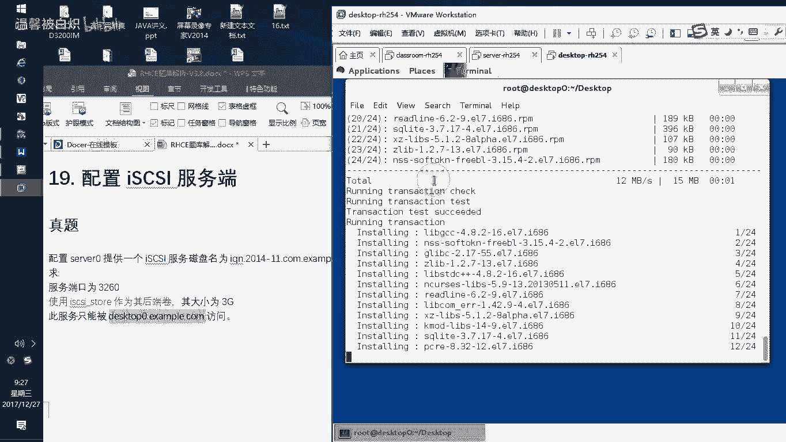

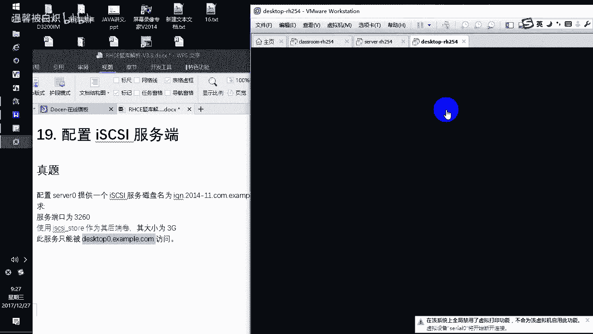

首先，登录到客户端机器（desktop0），同样需要先设置考试环境标签。

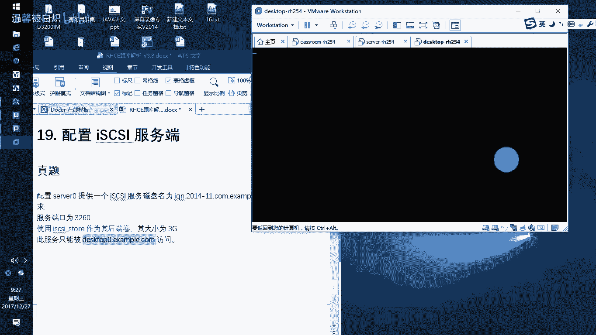

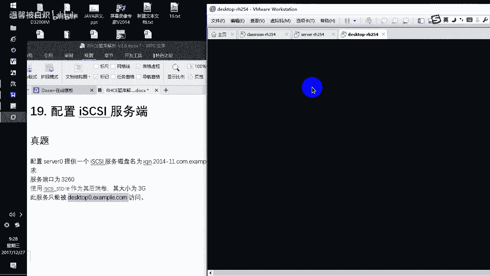

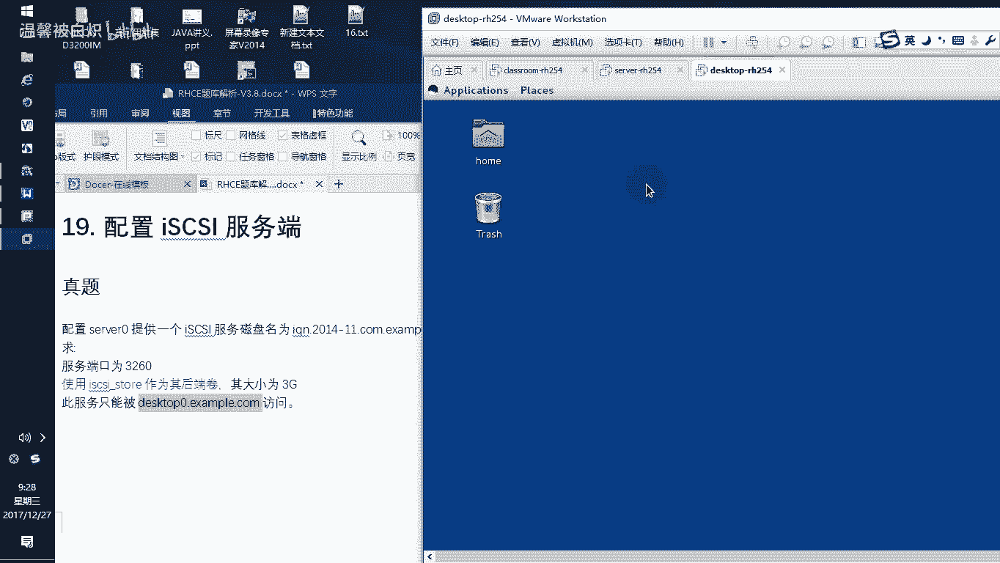

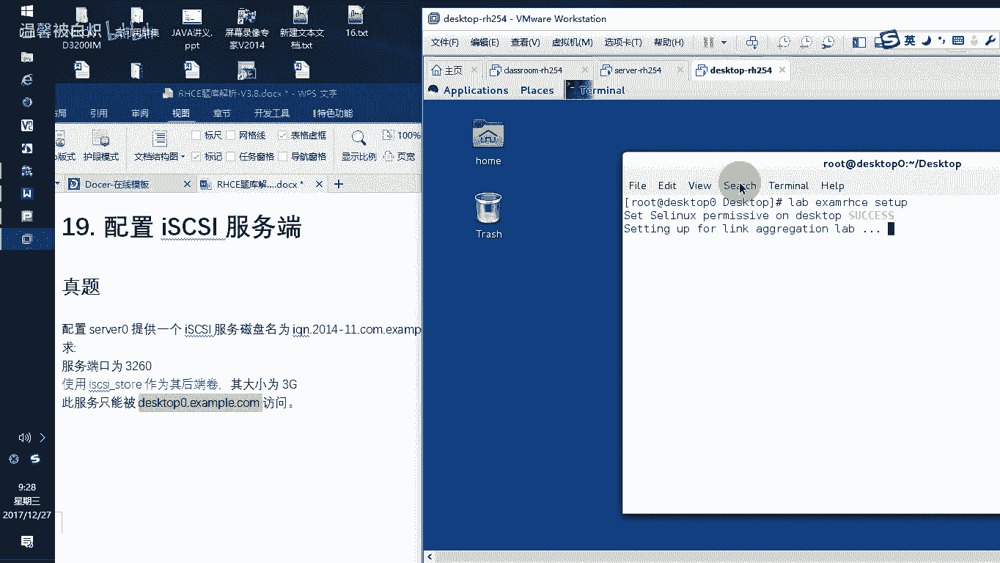

### 安装iSCSI发起者软件

客户端需要安装 `iscsi-initiator-utils` 软件包。

```bash
yum install -y iscsi-initiator-utils
```

### 修改发起者名称

**关键步骤**：在启动服务之前，必须先将客户端的发起者名称修改为服务器ACL中允许的名称。

1.  编辑配置文件 `/etc/iscsi/initiatorname.iscsi`。
2.  将 `InitiatorName` 的值修改为服务器ACL中设置的名称，例如：
    ```
    InitiatorName=iqn.2014-11.com.example:desktop0
    ```
3.  保存并退出。

### 启动iSCSI服务

修改完名称后，才能启动并启用 `iscsi` 服务。

```bash
systemctl start iscsi
systemctl enable iscsi
```

### 发现并登录iSCSI目标

现在，客户端可以连接服务器上的iSCSI目标了。

以下是连接iSCSI目标的命令：
1.  **发现目标**：使用 `iscsiadm` 命令发现指定服务器上的目标。
    ```bash
    iscsiadm -m discovery -t st -p 172.25.0.11
    ```
2.  **登录目标**：登录到发现的目标。
    ```bash
    iscsiadm -m node -T iqn.2014-11.com.example:server0 -p 172.25.0.11:3260 --login
    ```
    登录成功后，使用 `lsblk` 命令可以看到一个新的块设备（例如 `/dev/sdc`）。

### 分区、格式化并挂载存储

连接到远程存储后，可以像操作本地磁盘一样对其进行分区、格式化和挂载。

以下是挂载iSCSI存储的步骤：
1.  对新设备进行分区（例如 `/dev/sdc`），创建一个2100MB的分区。
    ```bash
    fdisk /dev/sdc
    # 在fdisk中：n (新建), l (逻辑分区), 设置大小, t (类型83 Linux)
    ```
2.  创建文件系统（ext4）：
    ```bash
    mkfs.ext4 /dev/sdc1
    ```
3.  创建挂载点：
    ```bash
    mkdir /mnt/data
    ```
4.  获取分区的UUID并配置自动挂载：
    *   使用 `blkid /dev/sdc1` 命令查看UUID。
    *   编辑 `/etc/fstab` 文件，添加以下行（使用查看到的UUID）：
        ```
        UUID=你的-UUID-here /mnt/data ext4 _netdev 0 0
        ```
        **注意**：对于网络设备，必须添加 `_netdev` 挂载选项。
5.  测试挂载：
    ```bash
    mount -a
    df -h /mnt/data
    ```

---

## 总结 🎯

本节课我们一起学习了iSCSI存储服务的完整配置。

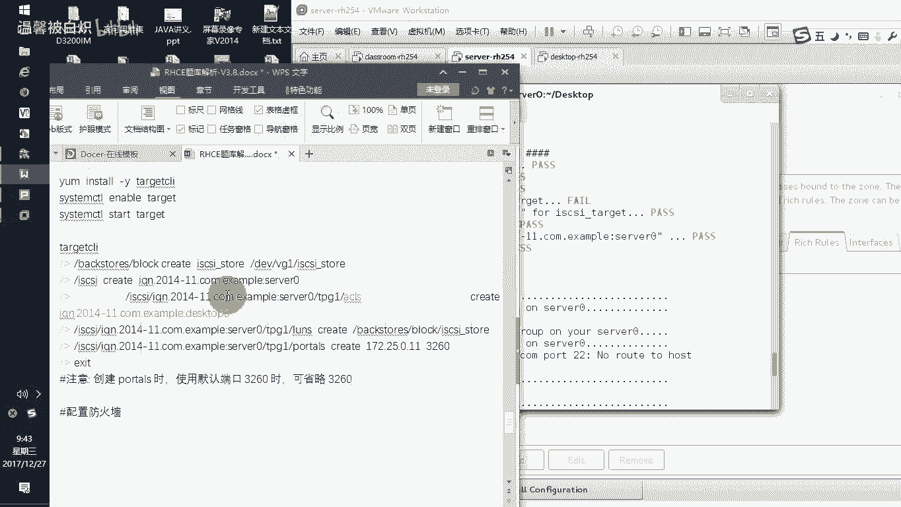

*   **在服务器端**，我们创建了LVM逻辑卷作为后端存储，使用 `targetcli` 工具配置了iSCSI目标，设置了ACL访问控制，并开放了防火墙端口。
*   **在客户端端**，我们安装了发起者工具，修改了发起者名称以匹配服务器ACL，发现了远程目标并登录，最后对远程磁盘进行分区、格式化并配置了自动挂载。

关键点在于：服务端与客户端的名称（iqn）必须匹配；客户端需先修改名称再启动服务；挂载网络设备时必须在 `/etc/fstab` 中使用 `_netdev` 选项。