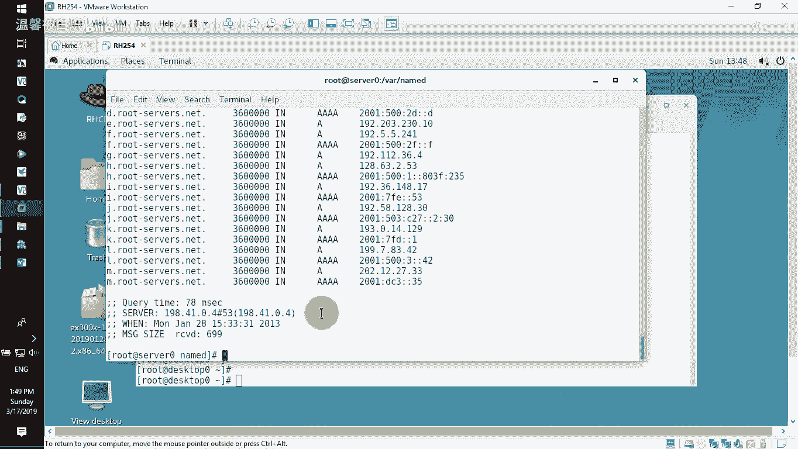
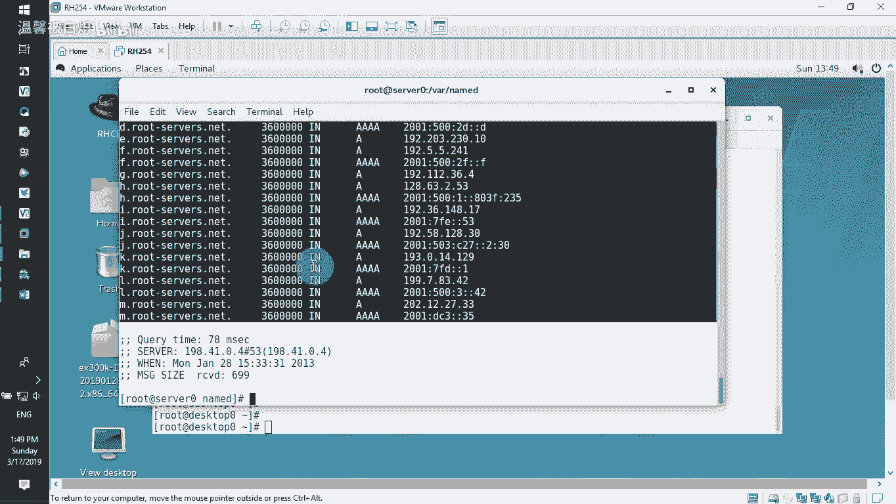
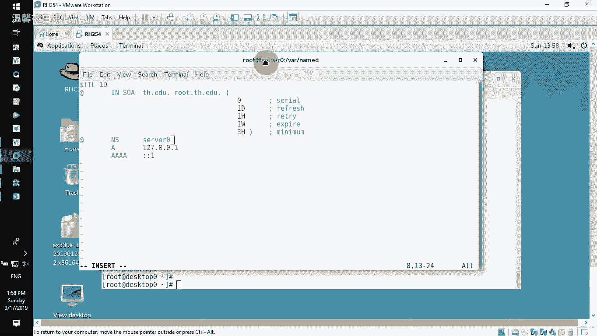
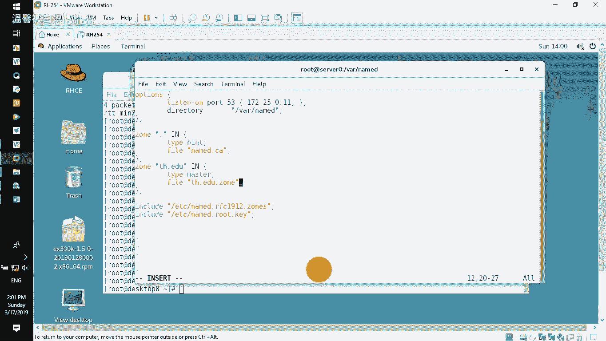
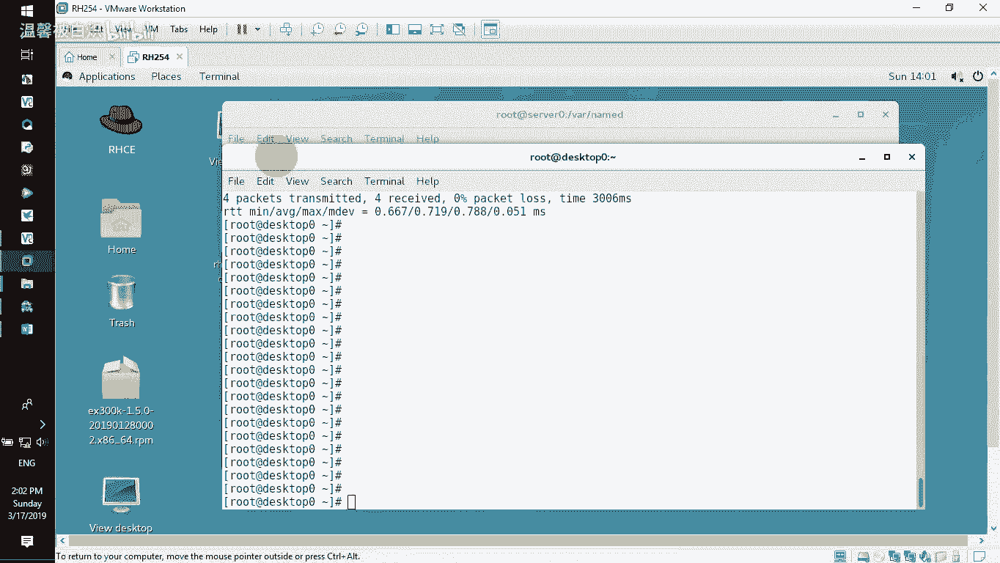
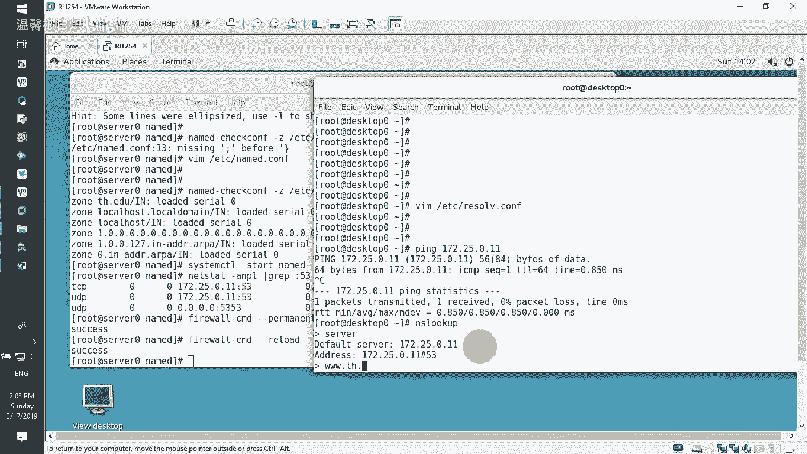
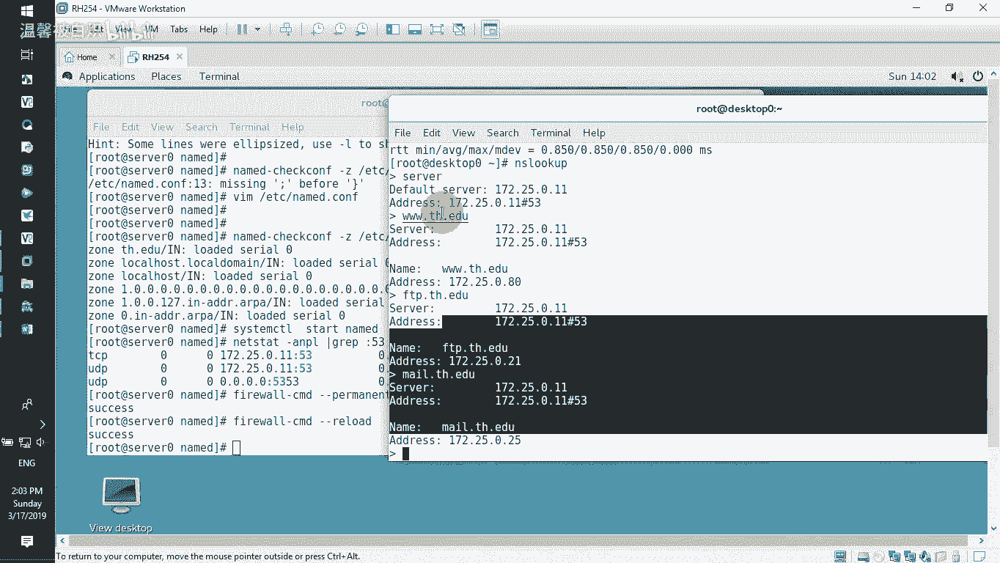
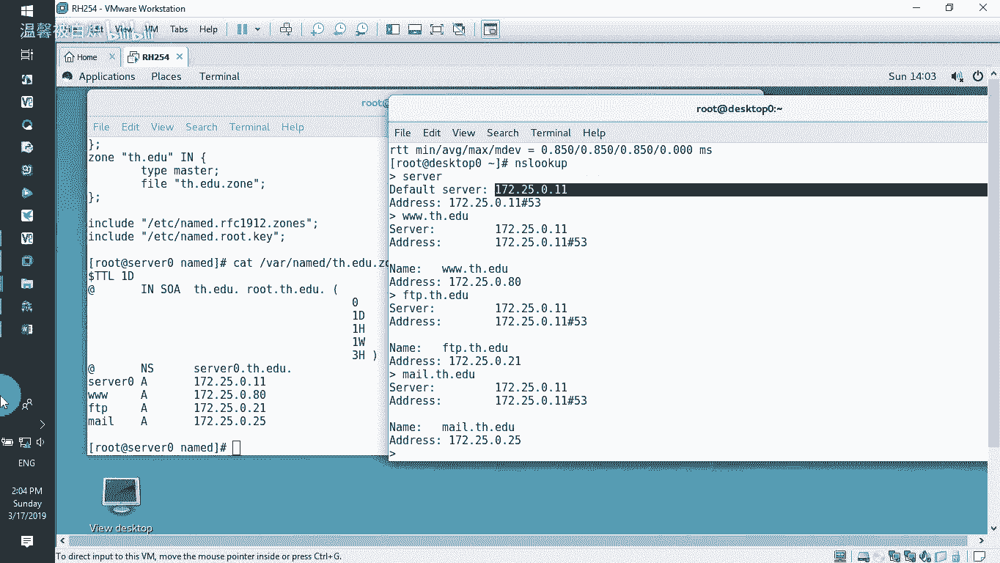

# RHCE-45678天学习视频 - P1：DNS - 打羽毛球的橘猫 - BV14b411g72P

而做一个书上面的内容就是DNS啊做给大家去看一下。好了。呃，在服务器上面我们安装DNS，然后客户端来做验证就好了。那首先大家注意看这台机器的主机名，hose name。

这台机器的主机名叫serv0点example点com。那也就是说我就用这一台主机来做我的这个。DNS的服务器。那我们首先要要求大家注意的是什么呢？就这台机器，这台机器呢呃要有自己的IP地址。

那很明显这台机器有自己IP地址，172250。11。那有IP的话那就好了。那如果你喜欢的话，你可以可以去配另外1个IP这个没问题。那我们就用这个也行啊，就用这个也可以的那DNS的话配置比较经典。

比较简单，要instore安装DNS的这么一个软件。呃，我们专门装一个并干。呃，就并的点叉86的这个。程序包，然后呢再安装一个并。

gs root这个呢是我们呃安装的过程当中把它的这些文档进行文档目录切换的一个安全位置的一个包来装上它。如果可以的话呢呃再装一个。缓存文件服务啊，就是它有一个缓存的功能。那装好这几个的话呢。

应该差不多了。来减Y自动回答个yes啊，就这几个哈安装一下它，一个是bint，一个bins杠 six root，一个是p file哈，三个软件包给它装上。装完了之后呢。

我们直接CD到哇3W呃哇下面的name地这个地方，就是呃我们的这个bin就是DNS的这个服务B的这个服务所在的工作目录。那在它的工作目录里面，我们能够看得到它底下呢会有一些常规的这个目录。

那像我们这边的话呢会看到有数据啊，动态的这个nameCA啊，就是呃其实呢如果我们看这个name的CA的话呢，整个全世界13台的DNS的跟站点都在这个地方。

能看到吗？啊，其实呢整就13台里面呃没有一台是在中国的。所以我们自己国家自己弄了一台，这虽人民人家不说是我们的，就不算是我们的根，但是我们自己也弄一个根，对吧？你不给我解析，我就不出去而已啊。

我就不用你的。

好了，这是呃跟服务。那么有他们的话呢，其实就是定义所谓的跟是哪里呢？就像我们平常时访问站点一样，访问HTDP冒号双十一杠3W点。比如说我们访问这个新浪点com点CN点，其实有一个点呢只是我们很少去写。

记住你们访问的时候，比如说今天下午你有空的时候，你打开网站，然后你在后面网站后面直加多加一个点。这个点代表什么呢？这个点代表的就是。跟。他要找根服务器来帮他解析顶级域名CN明白意思不是？那如果你不写。

他其实也知道找的，为什么知道找，因为DNS服务器本身就在啊，就直接去找了。好了，所以呢在域名书写的时候，我们后面很少会把最后面的那个点给它写上。所以最后面那个点其实也就顶级域名，或者说叫根域。那我们。

全世界的根据都在这个地方。好了，那不说那个我们接下来的话呢要自己去配自己的这个DNS服务器。那么它有一个配置文件，在ADC目录下面nameD点。confi，这是它的主配置文件。就这个哈主配置文件。

那我们去配置一下这个主配置文件啊，VI在ADC目录下面的nameD点com，这是DNS的主配置文件。在这个主配置文件里面呃，我将会删到很精简的东西，让大家去看啊。啊，那opsence是它的选项。

listen on port监听哪个接口。啊，比如说他监听这个127，监听我们的这个呃冒号冒号一，看到没？那如果可以，我们让他监听我们自己服务器的这个IP地址，那简单。监听172。25。0。11。

这是我的这个服务器这台看到吗？搜我这台啊，就监听这个。如果有IP6的情况下，你可以保留这行，但我没又不好意思不要。啊，我们有IPU6嘛，对不对啊？如果有IPU6的话，你再加IPU6的地址就好了。好了。

它的工作目录在万向人的地没问题。好了，这边的一个dm file，就是我们的这个缓冲缓冲区的这个特出数据文件啊，还有静态的文件啊，也在这个地方我们不用理它这几个其实如果你不想看这几个你都可以干嘛。😊。

不要哎，来了。hello，re就是我们的这个crary，允许哪些来我这里去。做这个DNS解析啊，当然如果你不写的话，那他就是干嘛就是默认所有都可以。那一般的话呢，我这行我也不要的。就所有人都可以来。

好吧，我并没有说只有哪个网段，哪个网段来。但然如果你可把刚刚那个刚刚这个边这个local host，你给它改成一个网段，17125。0。0这个网段，它也只有那个网段可以来的。好了，那我这个不要啊，哎。

你看我删了一堆啊，真的删完了。呃，DNS的enable啊，这里可以不要。啊，真的3啊，那只剩下最经典的监听端口工作目录，看到吧？啊，就这两个。好了，然后接下来的话呢，我们再往后看。

这个工作目录为什么我感觉他颜色不太对呢？我是不是删多了？我没三多吧。好像没有啊，挺好啊，是这个吧？好像是是的。哎，现在好像又干嘛？好了，那应该是刚刚有点删错的一种感觉。好的，那我退出来。我刚刚没删错吧。

哎，应该没有错。他因为他现在这个地方他都是。黑色的对不对啊，来那3。啊，这一行我们也不要来监听我本地接口。172。25。0。11，然后底下这边这个呢动态的数据咱们也不需要它删掉啊，都滴滴了啊。

我都滴滴掉了。哎，根据我还是要的。这个根呢点明白吗？啊，如果找不到的时候，就先从根符去找嘛，是我还是要的。好了，那接下来的话呢我就开始写了区，我要书写一个我自个儿的区。7。这后面的话呢加上双引号。

然后底下写我的区域。比如说我这个区域的话呢，呃我们直接写这个。写什么玉呢？比如说。天河。哎，就这个天合点EDU看到吗？啊，我就直接写小写吧，不要告大写了。天河点EDU好嘞。

然后IN下面直接一个大括号写回来。然后后面的话呢，分号表示我们这个大括号结束了。底下写类型类型为master。然后这边file file的话呢。

其实就是我们这个来解析天河点EDU的这么一个呃配置文件所在的这个名称啊。它的名称的话呢，比如说叫天河点。键点啊这个A点EDU点JNE好了，大家注意我是专门写了一个这个名字。那么这个名称的话呢。

待会它必须要有一个文件是放在他的工作目录下面的。如果没有这个名字的这个文件放这个工作目录下面，他就解析天河的时候，他不知道用哪个文件来解析。明白吗？工作目录在Y向。

所以我马上就要在这个向D下面去建这么一个天河点ED有点的这么一个文件。好了，保存退出。CD到哇下面的name，它里面现在是没有肯定没有天合点EDU点就那个文件的，对不对？

那我们在里面有一个可以拿来用用啊，就name点lo啊，把这个拿过来用一下，copy减P保留权限。减P哈。如果你不减P的话呢，我们告诉大家会存这种问题。你注意看啊。

copy一个name地点local host啊，然后把它作为我们的那个天河点EDU点只有N1来注意看啊，LL来看看原来这个文件的权限和我们copy出来的这个文件的权限是什么。不一样的呗。

你看人家小组是什么nameD，但是你这边变成什么了？root，这肯定不合适的。当然你可以自己改权限。但一般的话呢，我在这边交代的时候呢，一般我都会告诉大家，在copy的时候简P保留权限。

那这样呢在你后面去看的时候，你发现哎这个文件原来什么权限，你copy出来就还是什么权限，对不对？啊，简P保留哈，保留它的这个priority啊，好了。

然后VI一下我们的这个天合点EDU点就是这么一个文件。好了，然后ad代表本机。然后呢，这边设置的时候是我自己的域名天河点EDU。然后这边的话呢去书写我们自己内容了，那我们自己内容书写的时候是这样写的啊。

我一般的话呢是root点天河点EDU啊，你看我书写的时候是这么写的。它的域叫天河点EDU呃，它的管理的话呢是root点天河点EDU也有一些地方的话呢，把root改成adDB，这也没关系的。

这只是一个书写的格式而已，明白吗？但是域名结束的时候一定要以。点结尾。一定要以点结尾能明白吗？啊，要以点结尾。好了，那接下来的话呢，我们这边。它的名称服务器是本机，本机的名称服务器，它叫什么名字呢？

它叫这个server0点ex呃，我们好像有个叫serv零，对吧？好，来，我把这个主机给它改一改哈，serv零点那个天河点1D，我把主机名给改一下好吧。改一下，要不然他待会就认为我这个主机名不对的哈。

好了，等一下啊，我把主机名改一下。

Pos name。CTL set杠 default。housese name然后是servver0。呃，天河点EDU好了，我改了看到不改了啊，然后改完了之后呢，接下来我再重新去书写的时候。

我的这个名称服务器呢就是serv零点。天河点EDU一定要记住域名后面要加点结尾。好了，A记录写一行写一行，它的A记录叫什么呢？它叫serv0，它是这台机器里面的这个IP地址啊，是172。25。0。11。

好了，那接下来的话呢，IPV6咱没有哈，我们删掉它啊，滴滴删掉。好嘞，接下来的话呢我们就开始去书写我们自个的那么一个内容，书写什么呢？比如说。3个W它是一条A记录啊，指向。当然这个指向的话呢。

这个IP地址我们可以是没有的。比如说172。25。0。80，比如说有个FDP，然后呢也是一个A记录，然后指向172。25。0。这个21。然后比如说我们还有一个邮件没有的这么一个邮件服务哈。比如说172。

25。0。25。0。25好的，我有一堆看到吧？指向也就是说待好的话呢，肯定有个叫FTB点天鹅点EDU没点天鹅点EDU3W点天鹅点EDU啊，有一堆好，来，我们保存退出，退出完了之后呢。

我们选择用sstem。CTL然后选择star，我们有一个那个服务，这样name地这么一个服务。哎，他说有个问题啊，我们试一下。STGSnameD。DNS哎，他也没说我哪个地方有问题，那我们去检测一下。

好吧呃，用这个去检测我们的那个。配置文件。他说里面有一个地方是在那个分号跟这个叫什么大括号之间是吧，来检查一下。nameD点com。好，这个地方少一个什么戴军。后面少了一个什么？

分号你看他直接就告你在哪个地方有问题了。好，保存退出。

好，再来检测一下。好了，没有问题了。这边检测已经通过了。来再来sstem CTL，然后选择star named d。NA。LED。好，那启动成功了，看到吧？然后启动成功了之后。

我们来nex stay杠N条gra管道过滤一下。我们看53号接口啊，你可以看到它在这个11上面是监听着的那最好的话呢，我们只需要把这个防火墙开放。

firework cancom杠干杠干edservice，然后呢把DNS服务给它开放起来。然后人家就可以去来我这里去解析我的域名。那我现在的话呢就用这个桌面的客户端，把DNS指向我的这台主机。

看看能不能解析我们那个域名就知道了。

来呃，直接VI在ADC目录下面的。ZV点com这个配置文件里面，我们直接的话呢把它的name server改成我们自己的那个叫什么呢？就是哎我先先不理他啊。好了，然后把这两个给它注释一下，不要它好了。

我们自己在后面加。加一个什么呢？n server。172。25。0。11，这个是我们的这边这台服务器，对不对？好了，来保晨退出好了，然后拼一下我们的这个172。25。5。0。11没问题的，能通的。

然后NS。look看来解析，我们看s我是谁，是不是这台主机。来，我们解释一下3W点天河点EDU你发现唉解析到了。

看到吧？然后再解析，我们刚才还有什么呀？😡，天河点EDU。然后还有个那个邮件的贴合点EDU。看到吧。是不很简单。本来就很简单啦，超级简单，看到吗？所以你们想说好像做个DNS看书上面好长好长。

其实它做的就很简单。那再回忆一下啊，修改两个地方，一个是EDC目录下面的这个nameD。

对。NAMED点com它的主配置文件呃，改剩下就那么多哈呃，根据我们还是留着我们自己弄了一个域，然后呢，在区域文件就哇下面的nameD下面的这个天河点一丢。就这个这个的话呢，也就是我们修改的时候呢。

把这个。定义一个预域叫天河点EDU，然后这边是一个管理的那有个主机名用艾代表本机本机的话呢是serv0点天合点EDU加个点结尾。然后serv我们要的能解析，又做了一个3W做了一个FTB又做了一个m。

那最样的话呢，解析是没问题的。在这边解析的很好。你看他用哪个来解析就好了。看到吗？很简单的一个服务，就这么搭建完了。

