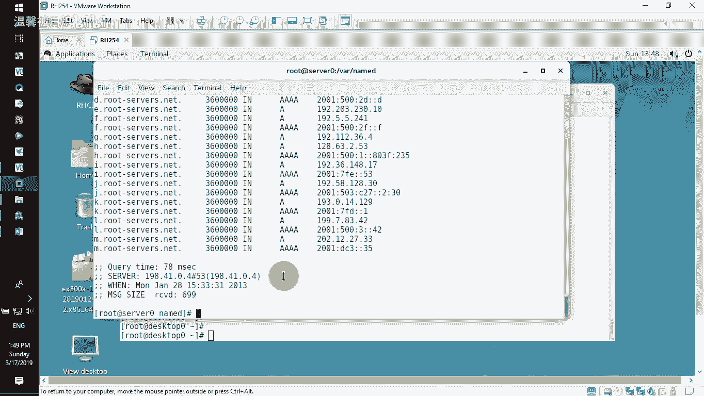
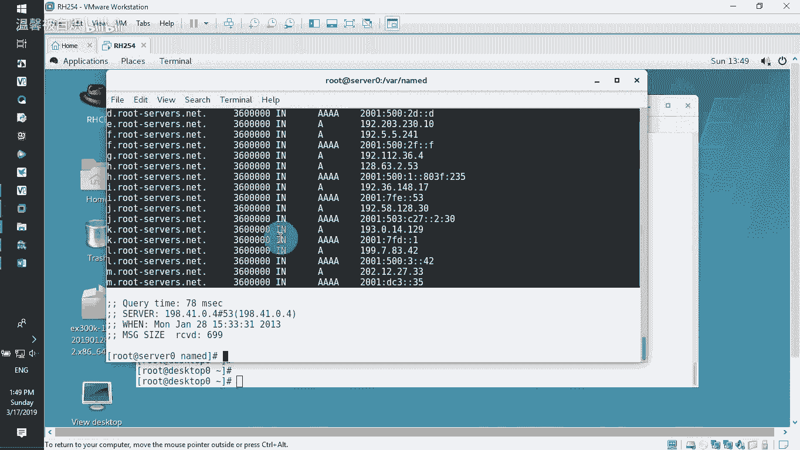
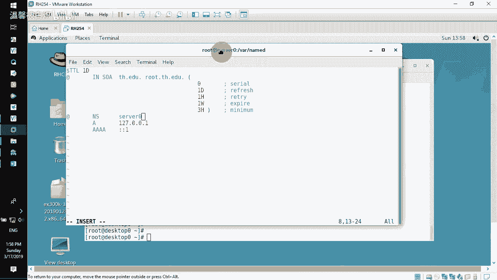
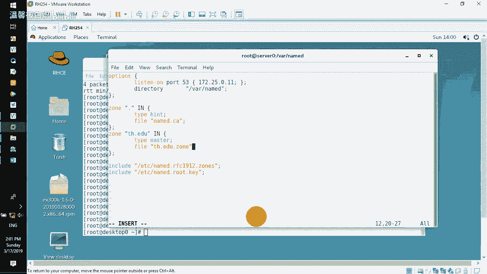
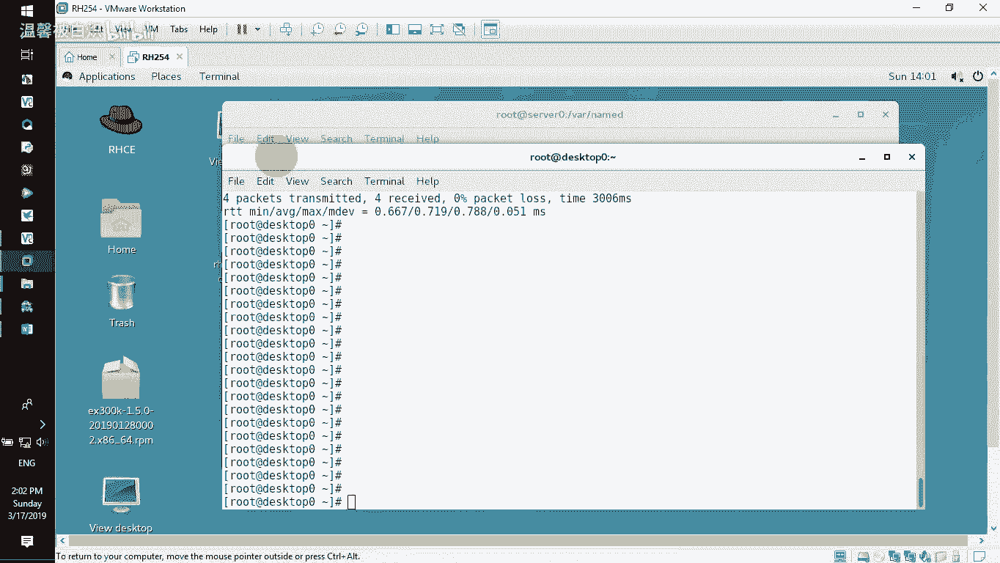
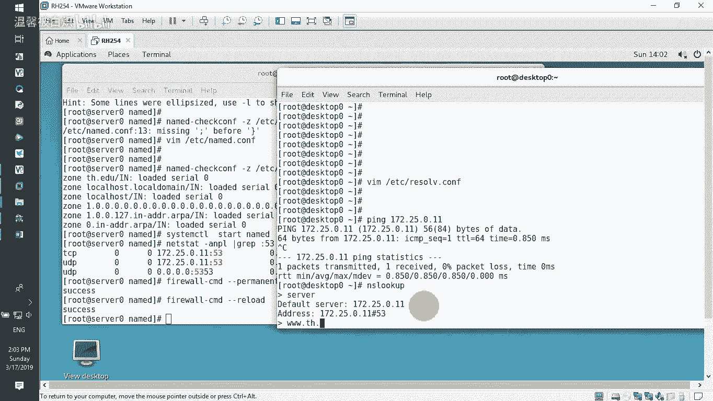
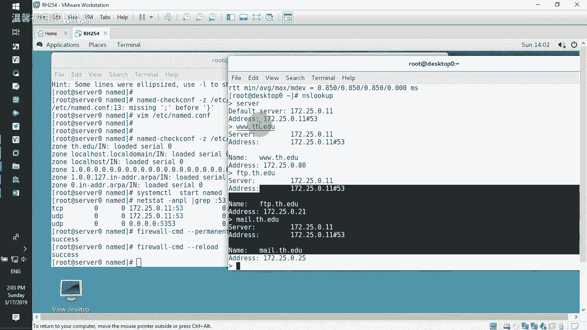
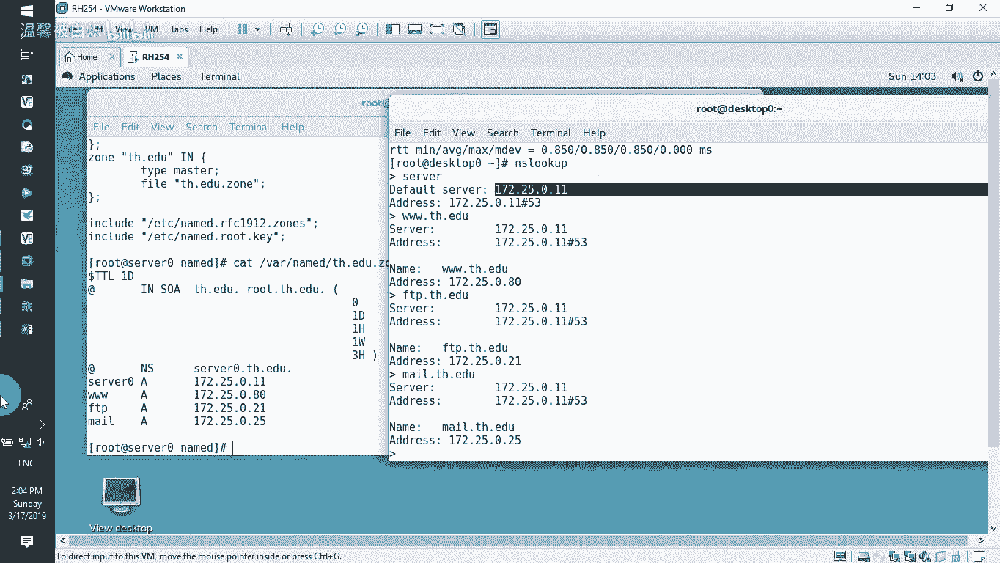

# RHCE-45678天学习视频：P1：DNS配置入门指南 🌐

在本节课中，我们将学习如何在Linux服务器上搭建一个基础的DNS服务器。我们将从安装软件包开始，逐步完成主配置文件、区域文件的配置，并最终在客户端进行验证，实现域名解析。

---

## 服务器准备与软件安装

首先，我们需要一台主机名为 `server0.example.com` 的服务器，其IP地址为 `172.25.0.11`。我们将使用这台机器作为我们的DNS服务器。

接下来，在服务器上安装必要的DNS软件包。以下是需要安装的包：



*   `bind`：DNS服务的主程序包。
*   `bind-chroot`：用于将BIND服务运行在一个安全的“监牢”环境中。
*   `bind-utils`：包含如 `nslookup`、`dig` 等DNS测试工具。



使用以下命令进行安装：
```bash
yum install -y bind bind-chroot bind-utils
```

安装完成后，DNS服务的工作目录位于 `/var/named`。

---

## 配置主配置文件

上一节我们安装了必要的软件，本节中我们来看看如何配置DNS服务的主配置文件。

主配置文件位于 `/etc/named.conf`。我们需要编辑此文件，使其监听我们的服务器IP，并定义我们要管理的域名区域。

使用 `vi /etc/named.conf` 编辑文件，将其内容精简至以下核心部分：

```
options {
    listen-on port 53 { 127.0.0.1; 172.25.0.11; };
    directory "/var/named";
};

zone "tianhe.edu" IN {
    type master;
    file "tianhe.edu.zone";
};
```

**配置说明：**
*   `listen-on`：指定BIND服务监听的IP地址和端口（53）。这里我们添加了服务器IP `172.25.0.11`。
*   `directory`：指定区域数据文件等存放的工作目录。
*   `zone`：定义一个名为 `tianhe.edu` 的DNS区域。
    *   `type master`：表示此服务器是该区域的主服务器。
    *   `file`：指定该区域的配置文件名称，文件位于 `/var/named` 目录下。

保存并退出编辑器后，使用以下命令检查配置文件语法是否正确：
```bash
named-checkconf
```

---

## 创建与配置区域文件

配置好主文件后，我们需要创建上面提到的区域文件 `tianhe.edu.zone`，并在其中定义具体的域名解析记录。

首先，进入工作目录并复制一个模板文件，注意使用 `-p` 参数保留原文件的属性和权限：
```bash
cd /var/named
cp -p named.localhost tianhe.edu.zone
```

然后，编辑这个新创建的区域文件：
```bash
vi tianhe.edu.zone
```

文件初始内容类似如下，我们需要将其修改为我们的配置：
```
$TTL 1D
@       IN SOA  server0.tianhe.edu. root.tianhe.edu. (
                                        0       ; serial
                                        1D      ; refresh
                                        1H      ; retry
                                        1W      ; expire
                                        3H )    ; minimum
        NS      server0.tianhe.edu.
server0 A       172.25.0.11
www     A       172.25.0.80
ftp     A       172.25.0.21
mail    A       172.25.0.25
```

**区域文件关键点说明：**
*   `SOA` 记录：起始授权机构记录。`server0.tianhe.edu.` 是该区域的主名称服务器，`root.tianhe.edu.` 是管理员邮箱（`@` 被点替代）。**注意：所有完整的域名（FQDN）都必须以点 `.` 结尾。**
*   `NS` 记录：名称服务器记录，指明该区域的DNS服务器是 `server0.tianhe.edu.`。
*   `A` 记录：地址记录，将主机名映射到IPv4地址。我们定义了：
    *   `server0.tianhe.edu.` -> `172.25.0.11`
    *   `www.tianhe.edu.` -> `172.25.0.80`
    *   `ftp.tianhe.edu.` -> `172.25.0.21`
    *   `mail.tianhe.edu.` -> `172.25.0.25`

保存并退出后，可以使用以下命令检查区域文件语法：
```bash
named-checkzone tianhe.edu /var/named/tianhe.edu.zone
```

---

## 启动服务与防火墙配置



区域文件配置完成后，我们就可以启动DNS服务了。

使用systemctl启动BIND服务：
```bash
systemctl start named
```

设置服务开机自启：
```bash
systemctl enable named
```

检查服务是否在正确的IP和端口（53）上监听：
```bash
netstat -ntulp | grep :53
```

为了让网络中的其他客户端能够访问此DNS服务，我们需要在防火墙中开放DNS端口：
```bash
firewall-cmd --permanent --add-service=dns
firewall-cmd --reload
```

---



## 客户端验证解析

服务端配置全部完成后，我们转到客户端进行测试，验证DNS解析是否正常工作。

在客户端机器上，编辑其DNS配置文件 `/etc/resolv.conf`，将名称服务器指向我们刚搭建的DNS服务器：
```
nameserver 172.25.0.11
```



现在，使用 `nslookup` 命令测试域名解析：
```bash
nslookup www.tianhe.edu
nslookup ftp.tianhe.edu
nslookup mail.tianhe.edu
```

如果配置正确，命令将返回我们在区域文件中设置的对应IP地址。



---

## 课程总结 🎯



本节课中我们一起学习了如何搭建一个基础的DNS服务器。整个过程可以总结为以下几个关键步骤：

1.  **安装软件包**：安装 `bind`、`bind-chroot`、`bind-utils`。
2.  **配置主文件**：编辑 `/etc/named.conf`，定义监听接口和要管理的区域（`zone`）。
3.  **创建区域文件**：在 `/var/named/` 下创建区域文件（如 `tianhe.edu.zone`），并在其中编写 `SOA`、`NS`、`A` 等解析记录。
4.  **启动与放行**：启动 `named` 服务，并在防火墙中开放DNS服务。
5.  **客户端测试**：将客户端的DNS服务器指向新搭建的服务器，使用 `nslookup` 进行解析测试。



通过这个简单的流程，我们就能成功搭建一个可用的DNS服务器，实现自定义域名的解析。