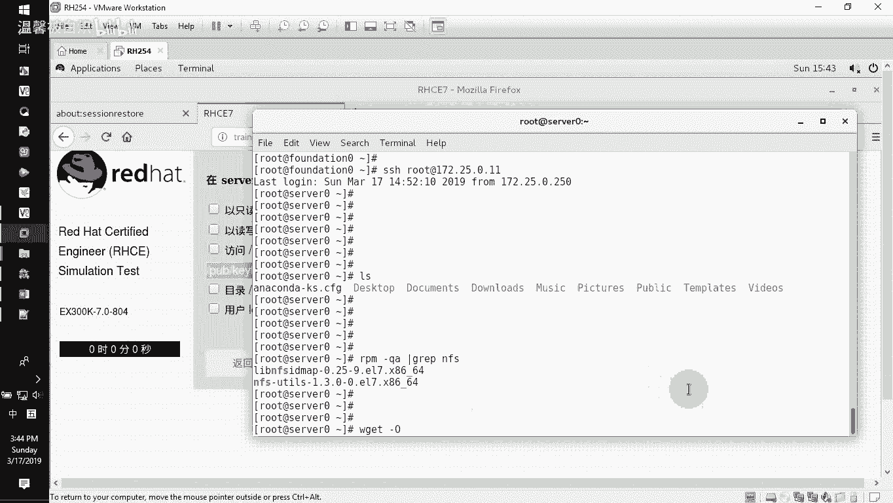
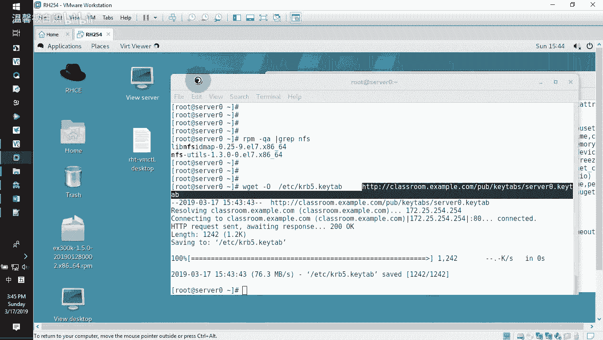
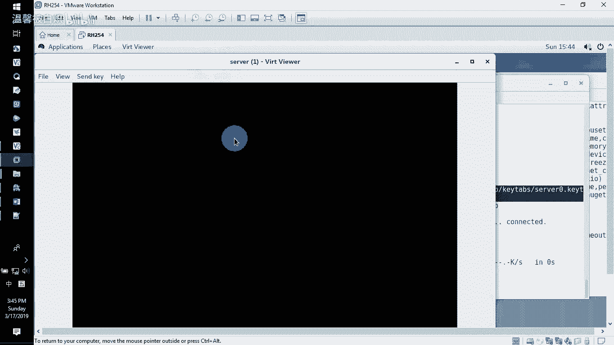
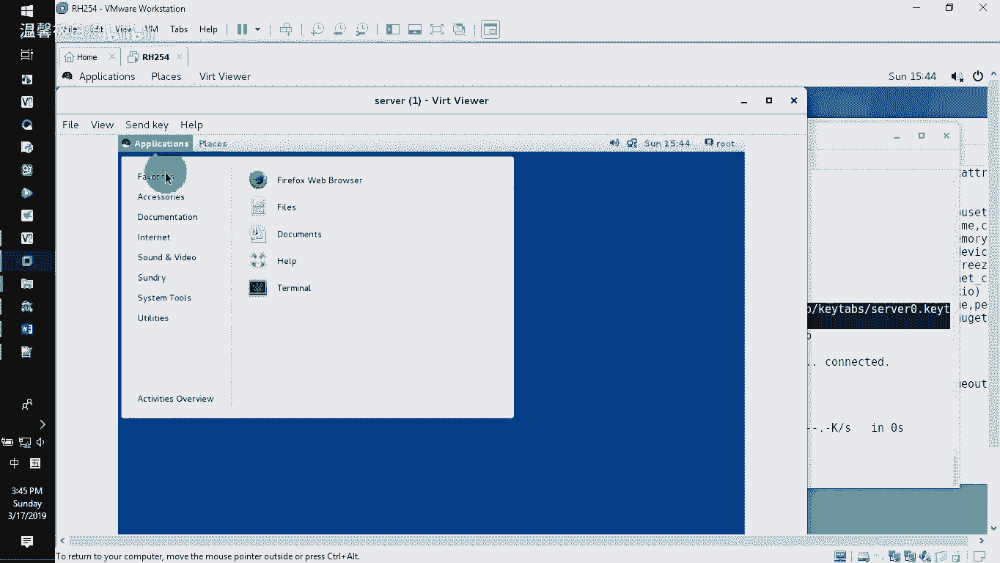
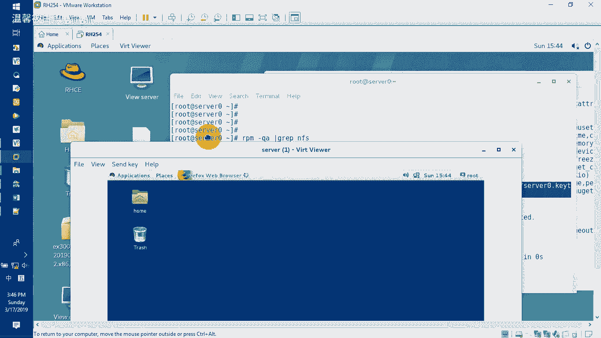
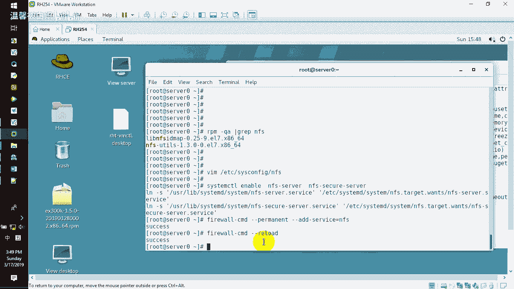
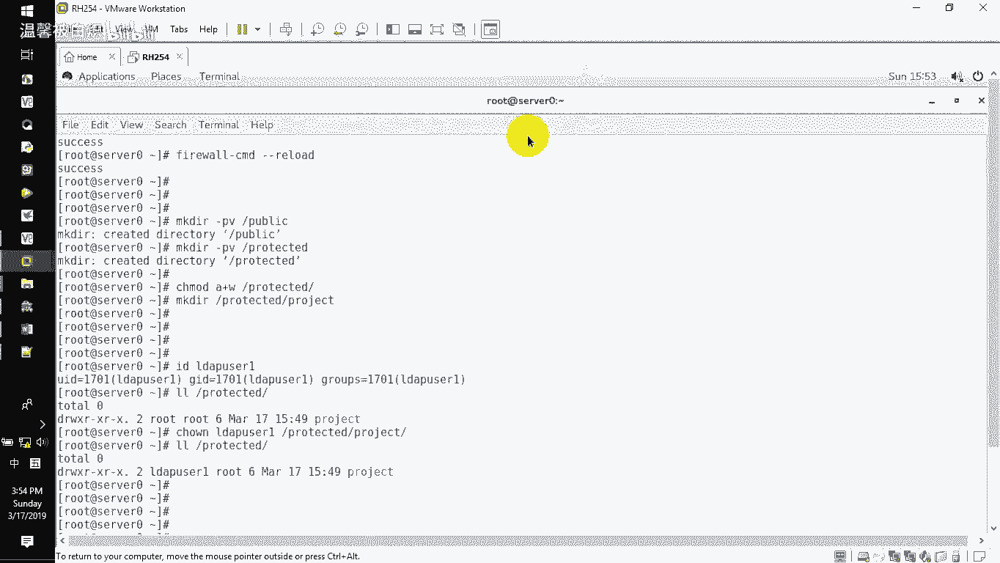

# RHCE-45678天学习视频 - P2：nfs服务10题 - 打羽毛球的橘猫 - BV14b411g72P

现在已经开始。那接下来要给大家去做的是我们的服务器上面配置NFS的服务啊，就服务器上配啊要求的话呢有两个目录输出出来给example点com的用户都可以访问。而且这个protest的话呢。

需要进行安全加密密钥已经提供给你了。然后这边的这个protest下面要建一个poject文件夹，把者改成LDB user一那LDB user一的话呢，有读写的方式来访问我们的这个poject。

那怎么去做呢？我们需要大家去做的时候，就是需要大家快速的把我们的这个配置内容给大家去做好。那呃加分项目的话呢，我也在做的过程当中给大加上啊。这个是收我的这个主机。首先。对于我们的这个NF来讲。

默认情况下，它的包已经帮你去装好了，所以你根本就不用去安装什么包之类的东西啊。来首先。在我们自己的环境里面，他不是说要用这个密钥嘛，对不对？我们把这个密钥给他copy一下啊，下载先下载它的密钥。

考评一下。如果你去看的时候，你可以去看一下RPM减QA呃，过滤一下，我们看那个NF的软件包哈，默认应该是已经帮大家去装好了。NF杠看到吧？已经装在里面的。如果没有装，你就装N。好了。

那有了之后接下来我们需要的W get减大O指定把这个网络上面网络上面，网络上面是这个文件啊，网络上面这个文件把它拉过来放在我自己本地杠大表示是本地文件放在EDC目录下面的KRB5点 table我就是要让它下载这个服务器的。

keybo的这个密钥，把它下载过来，在我的ETC目录下面作为keybo5点key table的文件啊，回车。那这样的话呢呢下载下来了之后，这个文件是没有发生任何改变的。

如果大家注意上次有同学直接在网上面这么去下载哈，这种做法绝对不允许。上次有同学的话呢，他是这样去做的那他怎么做？他是直接在服务器那个主机里面啊，打开那个serv。然后呢，不是算算不算作弊哈，我告诉大家。

如果你这样做是绝对是错的啊，哪个地方是这样做的？它是在图形界面下面啊登录进去了。

诶。啊，然后starX啊，他是这样做的，它是直接在网站上面去下载这个文件，然后下载下来。你下载下来了之后，经过浏览器，其实它已经发生变化了。这个文件不是原始变化，不是原始文件。

这样呢就会导致当你们在做练习的时候，后面永远验证都失败，验证一验证就失败。因为文件已经发生变化了。他是这么做的。哎，他说了那个文件啊这个下载太难了。那我就直接在这个叫什么呢？在这个浏览器里面啊。

它是在直接在这个地方啊，我把它拉出来一点。

啊。好，浏览器这边它直接的话呢在这边打开class storm。点example点com。啊，打开这个cble点com了之后，它开始了。哎呀，底下有一个叫。

PUB里面的话呢有个key table是里面的话呢有个设0。s我0啊来s我。哎。这个对吧啊也点击。哎，保存它是这么来的，我告诉大家啊，这个是错的，不能这么来啊不能这么做啊啊，我发现好多同学在呃做练习。

或者说在以前的话呢，已经理如这种情况，就是用这种方式去下载一个文件，我告诉你啊，这种是绝对不允许的啊，我不允许大家用这种方法去下载东西，我都是教大家用这种方法，明白吗？都是要求用这种方法去下载。

那么下载完了之后，你记住我们有个认证的文件在这个地方有它了之后呢，接下来如果你的机器没有装NF杠的这个文件，那你就装上。当然我刚刚的话呢，我已经告诉大家，我已经。装了，所以你不用去动它好。

那接下来安装完程序了之后，去修改这个程序的版本，把这个版本的话呢改成4。2的版本。这个在考试里面是加分项目哈嗯，来VI一下我们的这个EDC目录下面的s施fi下面的NFS。把他的这个。

RPC就我们的这个安的这个DA。RGS它的等号面加一个什么呢？加一个减啊减V哈版本嘛，是吧versionson的一个意思。减大V减大V空格4。2。看到没？减大V空格4。2，指定它的这个服务版本。

直接改成四的版本啊，注意啊，四的版本，那我写个4。2啊，呃，你就按照我这个写就好了。写好了之后，接下来我们去启动我们的服务system CTL，然后选择unable打开NF杠serv，这个是NF服务。

还有一个，因为刚刚我们是说是下载了一个密钥。我们密钥的话呢，它专门针对密钥，它还有另外一个服务的，就NMS杠sec。干收。它是有两个服务的，看到吧？所以你要记住啊呃，它能tableable。

但是我没有让你tableable。你记住这两个服务，一个是NF杠serv，一个是NF杠sec杠serv看到没？这个是支持加密的服务，这个是呃普通的服务。好了，那么做好了之后。

接下来我们去开放NF在防火墙里面啊，fire word commander杠干。杠杠ADD添加一个服务。是那个服务的话呢，是我们的NFS的服务。然后呢，选择rero一下我的防火墙。

这样呢我的服务开启了之后，人家也可以去访问了。好了，那接下来我们创建共享目录。因为刚刚在这边创建的时候呢，他说了有两个共享目录啊，然后这个目录底下还有多一个那个目录，还要改一下这个呃用户的属性。

那我们把这个改过来。

新店。MKDR新建我们的这个PUB。LIC publicub那一般的话呢在很多地方我都会加一个减呃PV给大家去看啊啊P的话呢是递规的往下建。如果前一级没有后一级的话，那才有的话呢，呃它会把前一级先建。

然后再建后一级V的话呢就显示给你看啊，creed public新建成功了。看到吧？好了，然后在新建我们另外一个文件呃，另外一个是那个protex。啊，建也建好了。然后在这个呃文件下面的话呢。

还有来我们先给个权限啊，CMD，然后A加W给这个。加密了这么一个啊protest，然后在这个protest底下MKDR新建在下面的话呢再要建一个啊。protest，然后建一个那个portject。

就这个看到吗？Pject。然后建完这个破解了之后，这个破解的话呢，要把所有者改一改。那我们看看IDLDAPus一有没有这个人。有的看到吧？那当然了这个为什么有这个是在你们CSA的时候做LD验证的时候。

已经做好了，他是没有本地这个人的，能理解没？本地是没这个人，他是LD服务器上面的这个人好了，那我们有他了之后呢，接下来我们就更改一下他的权利他说了要改什么呢？要改这个下面这个人的话呢。

者要改成LD user那就改了 owner改改对不对啊，改的话呢在后面加上比如说D user一然后呢改给这个文件啊。

改给这个protest下面的ject就改给他就好了好改完了之后我们去验证一下是不是改了吗？改了就者改了，然后他又说了这个人的话呢，对这个文件夹是有读写的权利的。其实默认情况下。

你看者是不是有读有写有执行。够了，对不对？够了啊。好了，那接下来我们需要去创建共享，就在安里面把这两个目录给它共享出来。我们创建共享的方法，大家注意直接VIEDC目录下面的exports，就是输出文件。

这是NF的输出共享文件。exporters然后在里面神马都没有的来，我们开始写我们有两个文件夹，一个是PUBIC publicublic。然后允许所有的example点com的这个域的人员过来看到吧？

允许他们过来。那么第一个文件夹给什么权利呢？大家看这边。只能够呃只读，那就给他一个read onlyread only。RO看了吧？read only一个意思好，了，只读嘛，那就给你一个只读。

那说了下面那个是有什么权限，读写，那就不能是read only那就read right啊。好了，那第二个的话呢，我们再写。project的那个啊跟下面的这个project。啊 protest。然后呢。

他同样还是所有点example。点com，然后过来的时候是RW，你看到吧？啊，给人的是这个。但是大家注意我们写的这个RW还不要紧，因为他这边他说了他要用什么来加密。用key来加密，对不对？

所以呢你要加上它的key加密的关键字符串，在里面写的时候，SEC等于就secre啊，等于等于什么呢？KRB5P哎，这个就是写经常有写错的这么一个做法啊。SEC就等于是secre那么一个缩缩写啊。

但是它是红色，你别以为它是错的，它是对的，好吧？它是对的，SEC等于KRB5P好了，写好了，就这两行写好保存退出。诶。后面看不到了。那。

写好了之后呢，我就保存退出啊，记住啊，就写那么点东西。保存退出完了之后，接下来我们去把刚刚书写这个输出目录的这么一个内容，把它输出出来export。AXPORFS啊ORTFS然后减R输出出来。啊。

就是重载的一个意思，就load一个意思。OK没有？好了，那重载一下了之后，我们这会儿也可以把我们那个服务sstemCTLrestar一下。

或者说你可以直接向这个地方restar一下你的NF杠servF杠secre记住啊，一定要有这个secret的这个服务哈啊，杠serv啊，两个服务我们都关了，然后再卡一遍啊，那没问题，你看它没报错，对吧？

好，那做好这个了之后，接起来在我们的这个呃下一题里面就会讲如何去挂载我们的服务了。你看简单吗？这一题。就做好了。没有啦，因为我已经做完了，对不对？两个目录共享输出出来，然后这个目录底下有这个呃小目录。

然后权限改了。然后呢，在这边的话呢也下了这个密钥，并且把密钥的话呢改成我们的路径。大家注意为什么我们直接拉过来的时候。

这个文件呢就是放在ETC目录下面的KRB5P点K table就把它拉过来就直接放这里。因为N直接找就找这个路径下面的这个文件，明白吗？直接就用它就好了。而且这个文件你们下载下来了之后。

不允许说用别的方式下载，只允许用我提供给大家的这种方法，就是W。Gt杠大欧指定本地路径。远端路径，然后把它下载到本地就好了，一定要用这种哈，你用别的方式，待会出错了，那你就重新把这个文件给它删了。

重新自己重新下一遍啊。好了，这个是呃NA服务的这一题。