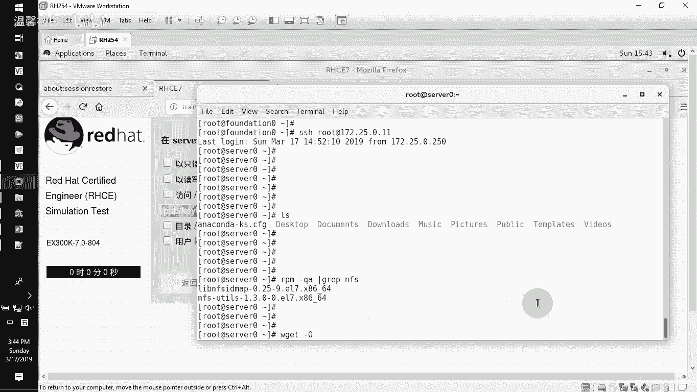
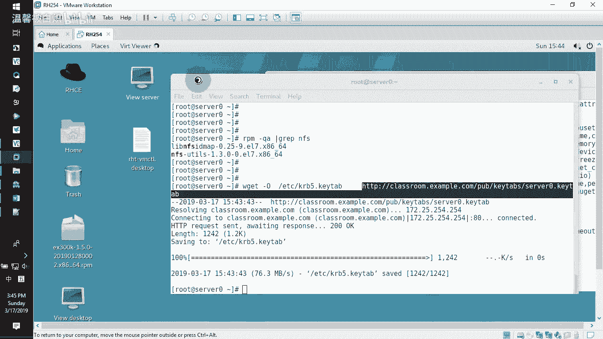
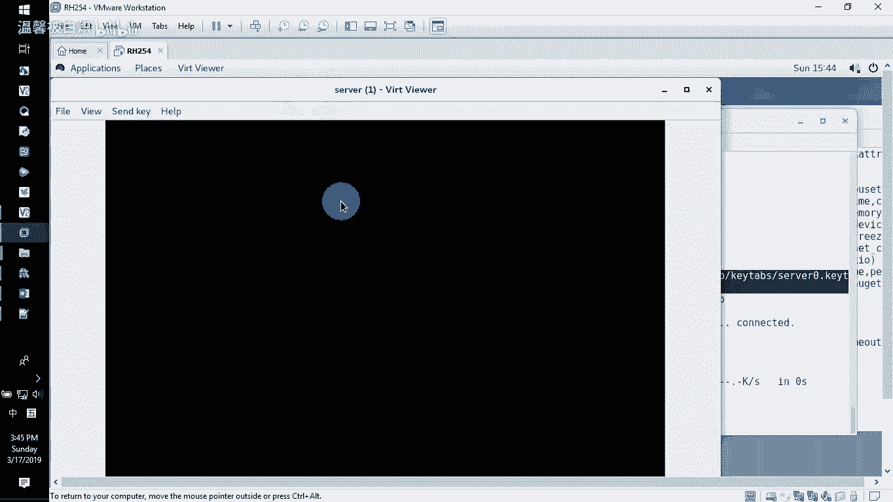
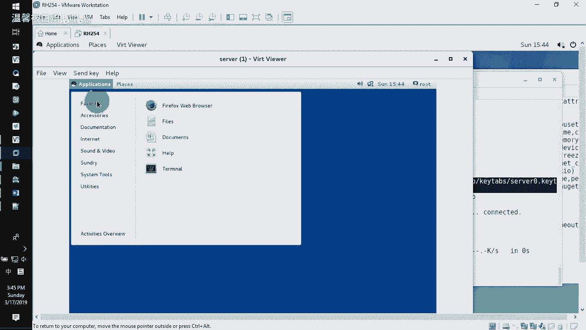
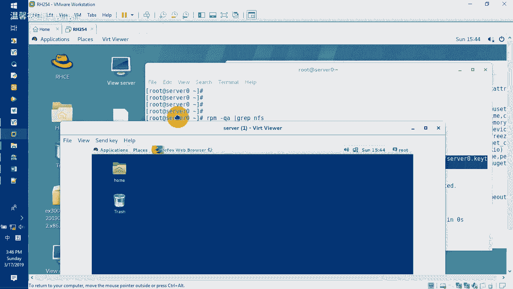
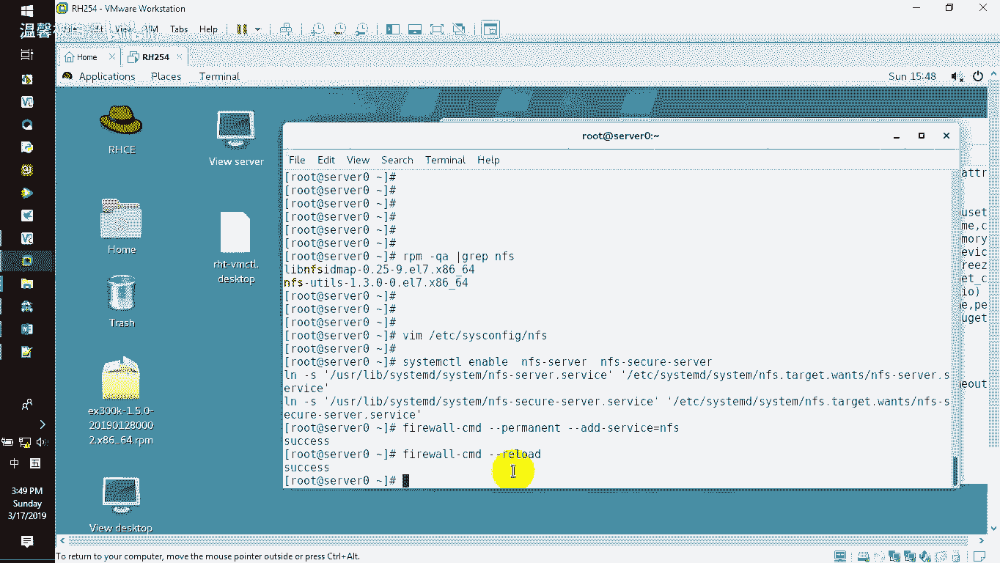
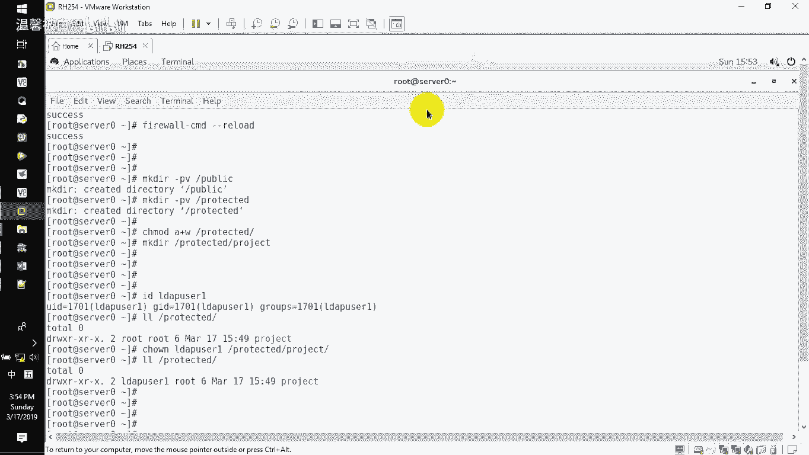

# RHCE 学习指南：P2：NFS 服务配置教程 🚀

在本节课中，我们将学习如何在服务器上配置 NFS 服务。核心任务是将两个目录共享给 `example.com` 域内的用户访问，并对其中一个共享启用安全加密。我们将逐步完成从环境准备、密钥配置、服务设置到目录共享的完整流程。

---



## 环境准备与密钥配置 🔑

上一节我们明确了任务目标，本节中我们来看看如何准备环境和配置安全密钥。



首先，NFS 服务所需的软件包在默认环境中通常已安装。你可以通过以下命令验证：
```bash
rpm -qa | grep nfs
```
如果未安装，请使用 `yum install nfs-utils` 命令安装。

接下来，我们需要从指定服务器下载用于安全加密的密钥文件。**必须使用 `wget` 命令直接下载**，以避免文件在传输过程中被修改。执行以下命令：
```bash
wget -O /etc/krb5.keytab http://classroom.example.com/pub/keytabs/server0.keytab
```
**重要提示**：禁止通过图形界面浏览器下载此文件，否则文件内容可能发生变化，导致后续验证失败。







---

## 配置 NFS 服务版本与启动服务 ⚙️

环境准备好后，我们需要配置 NFS 服务并启动它。

修改 NFS 服务的配置，将其版本设置为 4.2。这是一个考试中的加分项。编辑配置文件 `/etc/sysconfig/nfs`：
```bash
vi /etc/sysconfig/nfs
```
找到 `RPCNFSDARGS` 参数，在其后添加 `-V 4.2`。修改后的行应类似：
```
RPCNFSDARGS="-V 4.2"
```

配置完成后，启动 NFS 相关服务。NFS 服务包含两个部分：
```bash
systemctl enable --now nfs-server
systemctl enable --now nfs-secure-server
```
接着，在防火墙中开放 NFS 服务：
```bash
firewall-cmd --permanent --add-service=nfs
firewall-cmd --reload
```

---

## 创建与设置共享目录 📁



服务启动后，我们需要创建任务要求的共享目录并设置正确的权限。

以下是需要创建的目录结构：
1.  `/public`：一个公共只读目录。
2.  `/protected`：一个受保护的读写目录，其下还需创建子目录 `/protected/project`。

使用以下命令创建目录并设置权限：
```bash
mkdir -pv /public /protected
mkdir -pv /protected/project
```
接下来，将 `/protected/project` 目录的所有者更改为 LDAP 用户 `ldapuser1`。该用户存在于 LDAP 服务器中，而非本地系统。
```bash
chown ldapuser1 /protected/project
```
默认情况下，所有者拥有读、写、执行权限，这已满足题目要求。

---

## 配置 NFS 共享输出 📤

目录创建完毕后，我们需要在 NFS 的配置文件中定义如何共享这些目录。

编辑 NFS 的共享配置文件 `/etc/exports`：
```bash
vi /etc/exports
```
在文件中添加以下两行配置：
```
/public *.example.com(ro)
/protected *.example.com(rw,sec=krb5p)
```
**配置说明**：
*   第一行：将 `/public` 目录以只读 (`ro`) 方式共享给 `example.com` 域的所有用户。
*   第二行：将 `/protected` 目录以读写 (`rw`) 方式共享给 `example.com` 域的所有用户，并启用 `krb5p` 安全加密 (`sec=krb5p`)。

保存并退出编辑器。然后，让 NFS 服务重新加载配置：
```bash
exportfs -r
```
最后，重启 NFS 服务以确保所有配置生效：
```bash
systemctl restart nfs-server nfs-secure-server
```



---

## 总结 📝

本节课中我们一起学习了如何完整配置一个支持安全加密的 NFS 服务器。我们完成了以下关键步骤：

1.  **环境验证与密钥获取**：确认 NFS 软件包并正确下载加密密钥。
2.  **服务配置**：设置 NFS 服务版本为 4.2 并启动相关服务。
3.  **目录准备**：创建所需的共享目录结构并设置正确的所有权。
4.  **定义共享**：通过编辑 `/etc/exports` 文件，配置目录的共享规则、访问权限和安全选项。

整个流程的核心在于正确理解 `/etc/exports` 文件的配置语法，并确保加密密钥的完整性。配置完成后，客户端即可根据这些规则挂载和使用共享目录。