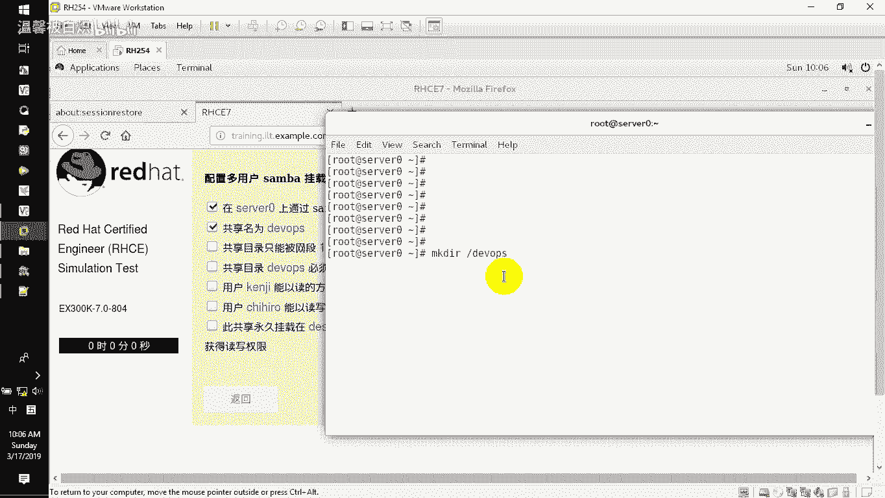
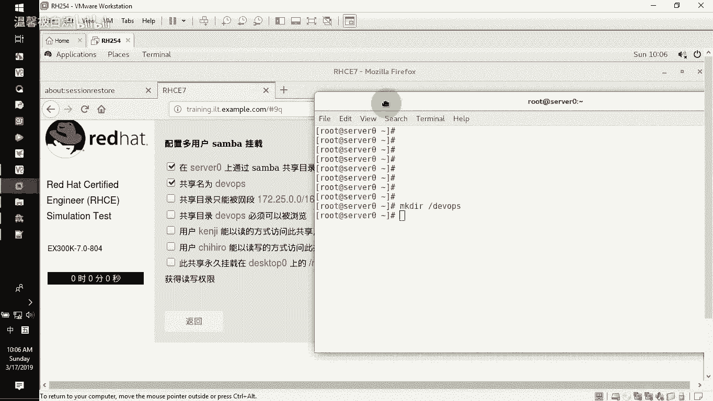
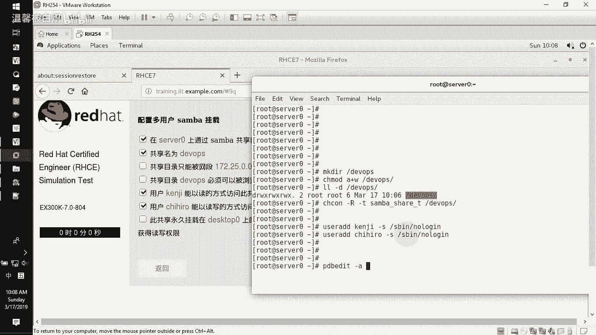
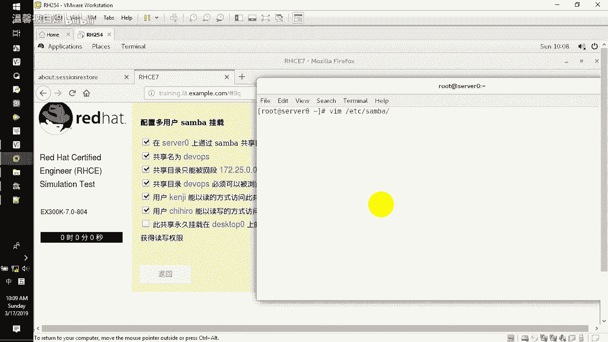
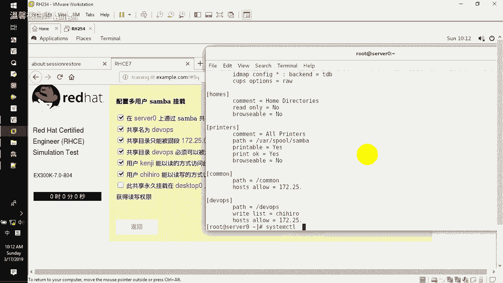
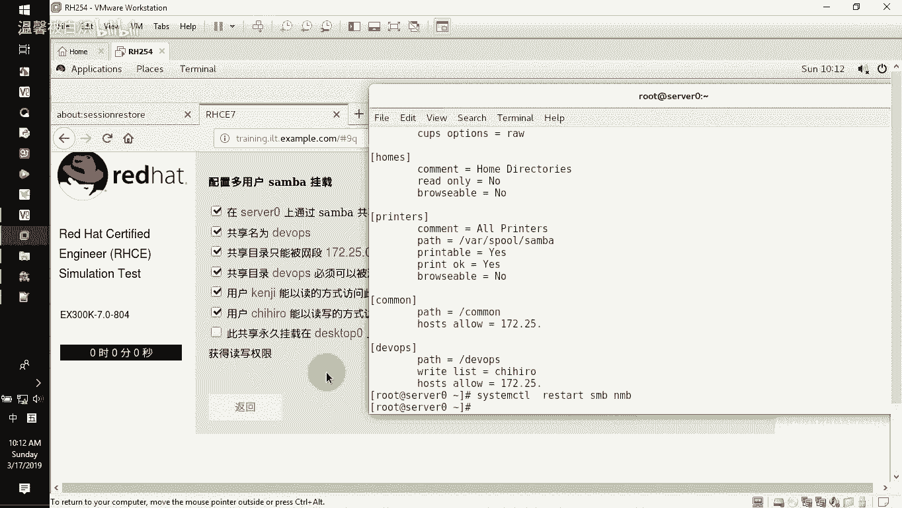
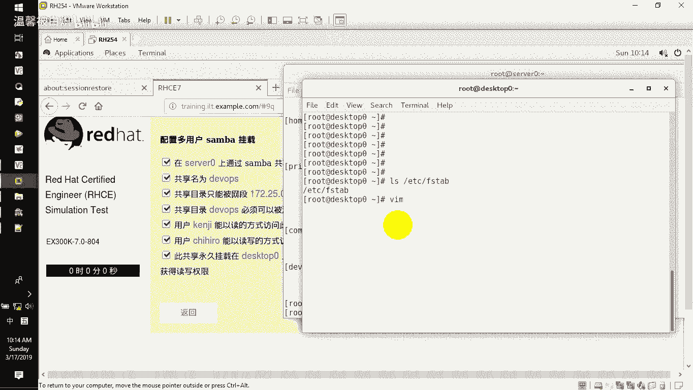
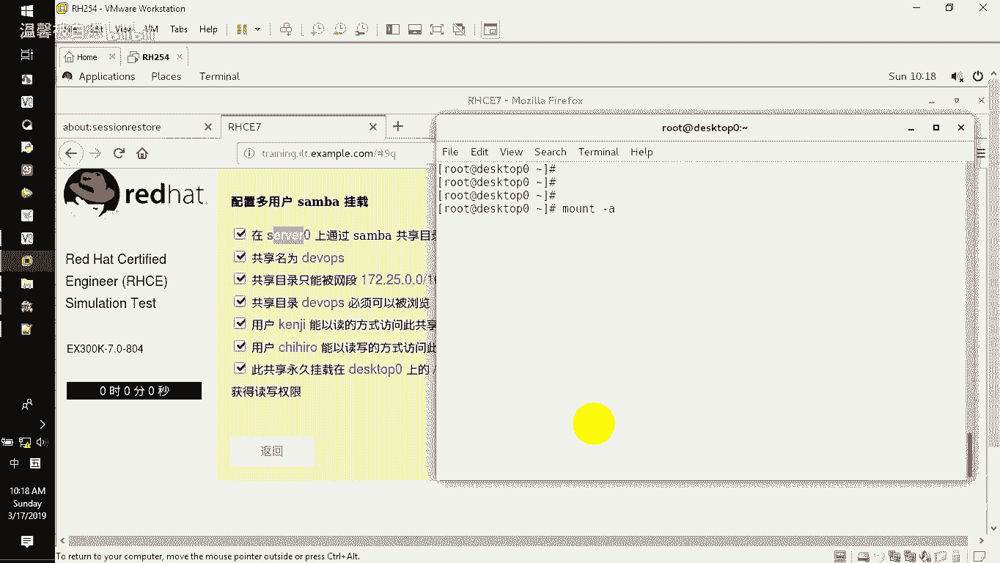
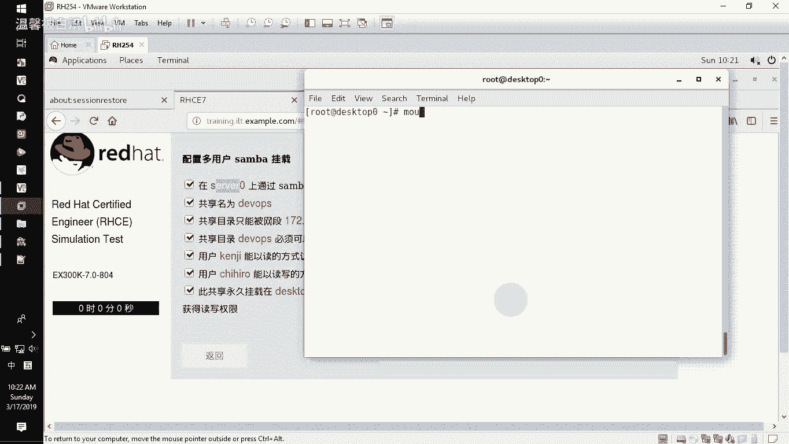

# RHCE-45678天学习视频：P4：Samba多用户挂载 🖥️

在本节课中，我们将要学习如何配置Samba服务器的多用户挂载。这是一种常见的需求，允许不同的用户访问同一个共享文件夹时，拥有不同的权限（例如，只读或读写）。我们将从创建共享目录开始，逐步配置用户、权限，并在客户端实现永久挂载。

## 创建共享目录与权限设置

上一节我们介绍了Samba的基本安装和使用。本节中，我们来看看如何为多用户挂载准备共享目录。

首先，在服务器上创建指定的共享目录。

```bash
mkdir /developers
```

创建目录后，需要设置目录权限，确保所有用户都有写入权限。

```bash
chmod a+w /developers
```





接下来，为Samba服务设置正确的SELinux上下文。

```bash
chcon -R -t samba_share_t /developers
```

## 创建用户并加入Samba

以下是创建两个用户并将其添加到Samba用户数据库的步骤。

首先，创建两个用户账户。



```bash
useradd -s /sbin/nologin user1
useradd -s /sbin/nologin user2
```

然后，将这两个用户添加到Samba的用户数据库中，并设置密码。



```bash
pdbedit -a -u user1
pdbedit -a -u user2
```

系统会提示为每个用户设置密码，请根据要求设置（例如，`redhat`）。

## 配置Samba共享

现在，我们来配置Samba的主配置文件，以定义共享目录及其访问规则。

编辑Samba的主配置文件。

```bash
vi /etc/samba/smb.conf
```

在文件末尾添加以下共享配置块。

```ini
[developers]
        path = /developers
        browseable = yes
        writable = no
        write list = user2
        hosts allow = 172.25.0.
```



**配置解析：**
*   `path`：指定共享目录的路径。
*   `browseable = yes`：允许客户端浏览此共享。
*   `writable = no`：默认情况下，所有用户不可写。
*   `write list = user2`：只有用户 `user2` 拥有写入权限。
*   `hosts allow`：限制允许访问的IP网段。



保存并退出编辑器后，测试配置文件语法是否正确。

```bash
testparm
```

如果测试通过，重启Samba服务使配置生效。

```bash
systemctl restart smb nmb
```

## 客户端配置与永久挂载

上一节我们在服务器端完成了配置。本节中，我们来看看如何在客户端进行挂载。



首先，在客户端机器上安装必要的软件包。

```bash
yum install -y cifs-utils samba-client
```

接下来，创建一个用于存储Samba认证信息的文件。这是为了避免在挂载配置中直接暴露用户名和密码。

```bash
vi /root/smb.cred
```

在该文件中，写入默认挂载用户的凭据。

```ini
username=user1
password=redhat
```

现在，编辑客户端的文件系统表，以实现开机自动挂载。

```bash
vi /etc/fstab
```

在文件末尾添加以下挂载条目。



```ini
//server0/developers /mnt/dev cifs credentials=/root/smb.cred,multiuser,sec=ntlmssp 0 0
```

**参数解析：**
*   `//server0/developers`：Samba服务器的共享路径。
*   `/mnt/dev`：本地挂载点（需提前创建：`mkdir /mnt/dev`）。
*   `cifs`：文件系统类型。
*   `credentials=/root/smb.cred`：指定认证文件路径。
*   `multiuser`：支持多用户凭据切换。
*   `sec=ntlmssp`：指定安全模式。

保存退出后，可以立即挂载所有在`/etc/fstab`中定义的条目。

```bash
mount -a
```

使用以下命令验证挂载是否成功。

```bash
mount | grep /mnt/dev
```

## 权限切换验证

配置完成后，我们需要验证多用户权限切换是否按预期工作。

首先，切换到普通用户（例如`student`）并尝试在挂载点创建文件，操作会失败，因为默认用户`user1`只有只读权限。



```bash
su - student
cd /mnt/dev
touch test_file  # 此操作应失败，提示权限不足
```

现在，在同一个会话中，切换到拥有写入权限的用户`user2`的凭据。

```bash
cifscreds add -u user2 server0
```

系统会提示输入`user2`的密码（例如，`redhat`）。添加成功后，再次尝试创建文件。

```bash
touch test_file  # 此操作应成功
ls -l test_file  # 确认文件已创建
```

可以看到，虽然当前系统用户仍是`student`，但通过`cifscreds`命令切换了Samba会话的凭据后，就获得了`user2`的写入权限。

## 总结

本节课中我们一起学习了Samba多用户挂载的完整配置流程。我们从服务器端创建共享目录、设置用户和权限开始，然后配置了Samba服务以区分不同用户的访问权限。在客户端，我们实现了永久挂载，并通过创建独立的认证文件来安全地管理凭据。最后，我们验证了多用户权限切换的功能，确保只读用户和读写用户可以按需访问同一共享资源。这套方法在实际工作环境中非常实用，可以灵活地管理团队对共享文件的访问控制。