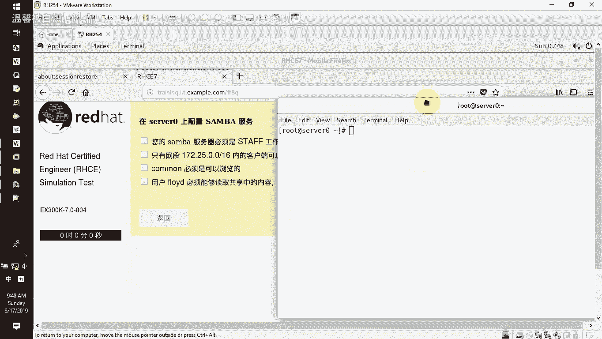
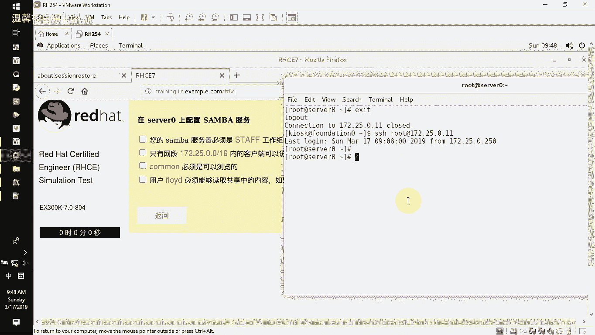
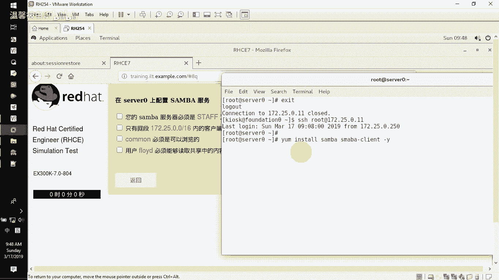
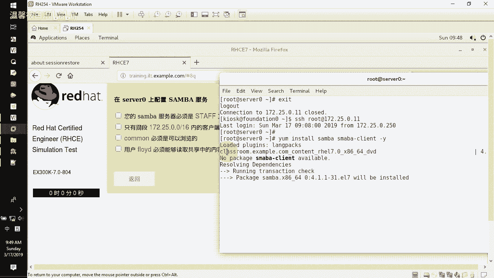
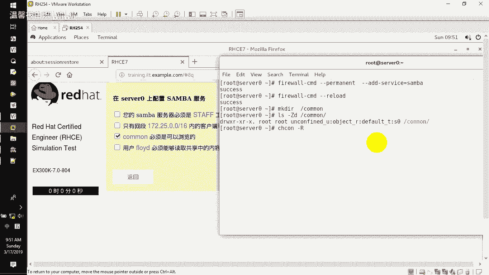

# RHCE-45678天学习视频：P5：Samba共享配置教程 🖥️

在本节课中，我们将学习如何在Linux服务器上配置Samba共享服务。我们将完成从安装软件包、配置服务、设置共享目录到最终测试的完整流程。

## 环境准备与软件安装

首先，我们需要连接到目标服务器并安装必要的Samba软件包。

使用 `root` 用户连接到名为 `server` 的服务器。





```bash
ssh root@server
```

连接成功后，开始安装Samba服务端和客户端软件包。使用 `-y` 参数可以自动确认安装。



```bash
yum install samba samba-client -y
```



软件包安装完成后，需要设置Samba服务开机自启动。Samba服务包含两个主要组件：`smb`（消息块服务）和 `nmb`（NetBIOS名称解析服务）。

```bash
systemctl enable smb nmb
systemctl start smb nmb
```

这两个服务会监听以下端口：**137**、**138**、**139** 和 **445**。

接下来，我们需要配置防火墙，允许外部访问Samba服务。

```bash
firewall-cmd --permanent --add-service=samba
firewall-cmd --reload
```

## 创建与配置共享目录

上一节我们完成了基础服务的安装与启动，本节中我们来看看如何创建并配置共享目录。

首先，在根目录下创建一个名为 `common` 的共享目录。

```bash
mkdir /common
```

创建目录后，需要为其设置正确的SELinux安全上下文，这是Samba共享能够正常访问的关键步骤。


```bash
ls -Zd /common
chcon -R -t samba_share_t /common
ls -Zd /common
```

执行 `chcon` 命令后，再次使用 `ls -Zd` 检查，确认安全上下文已成功修改为 `samba_share_t`。

## 用户账户管理

目录准备就绪后，我们需要处理用户账户。根据要求，需要一个名为 `floyd` 的用户来访问共享。



首先检查用户是否存在。

```bash
id floyd
```

如果用户不存在，则需要创建。**重要提示**：必须将该用户添加到Samba的密码数据库中，而不是设置系统登录密码，否则会被扣分。

以下是创建用户和设置Samba密码的步骤：

```bash
useradd floyd -s /sbin/nologin
pdbedit -a floyd
```

执行 `pdbedit` 命令时，会提示为 `floyd` 用户设置专用于Samba验证的密码。

## 配置Samba主配置文件

用户账户设置完成后，接下来我们配置Samba的主配置文件，以定义共享的具体属性。

Samba的主配置文件位于 `/etc/samba/smb.conf`。我们需要编辑此文件，在文件末尾添加共享定义，并修改工作组名称。

使用 `vi` 编辑器打开配置文件。

```bash
vi /etc/samba/smb.conf
```

在文件中，按 `Shift+G`（即 `G`）跳转到文件末尾，添加以下共享配置块：

```ini
[common]
    path = /common
    browseable = yes
    read only = yes
    hosts allow = 172.25.0.0/16
```

此配置定义了一个名为 `common` 的共享，路径为 `/common`，允许浏览，设置为只读，并仅允许 `172.25.0.0/16` 网段的主机访问。

接下来，需要修改文件开头附近的工作组（`workgroup`）设置，将其改为 `STAFF`。

```ini
workgroup = STAFF
```

编辑完成后，保存并退出编辑器。

## 权限验证与服务重启

配置文件修改后，在重启服务前，最好先验证目录的默认权限是否满足“可读”要求，并使用工具测试配置文件语法。

检查 `/common` 目录的权限，确认“其他人”（others）有读取（`r`）权限。

```bash
ls -ld /common
```

使用 `testparm` 命令测试Samba配置文件的语法是否正确。

```bash
testparm
```

如果测试没有报错，并且能看到 `[common]` 部分的配置信息，则说明配置文件书写正确。

最后，重启Samba服务以使所有配置生效。

```bash
systemctl restart smb nmb
```

## 总结

本节课中我们一起学习了在Linux服务器上配置Samba共享的完整过程。我们首先安装了 `samba` 和 `samba-client` 软件包，并启动了 `smb` 和 `nmb` 服务。接着，我们创建了共享目录 `/common` 并为其设置了正确的SELinux上下文。然后，我们创建了专用用户 `floyd` 并为其设置了Samba验证密码。之后，我们编辑了 `/etc/samba/smb.conf` 主配置文件，定义了共享的详细参数并修改了工作组。最后，我们验证了配置并重启了服务。整个过程涵盖了Samba共享配置的核心步骤。