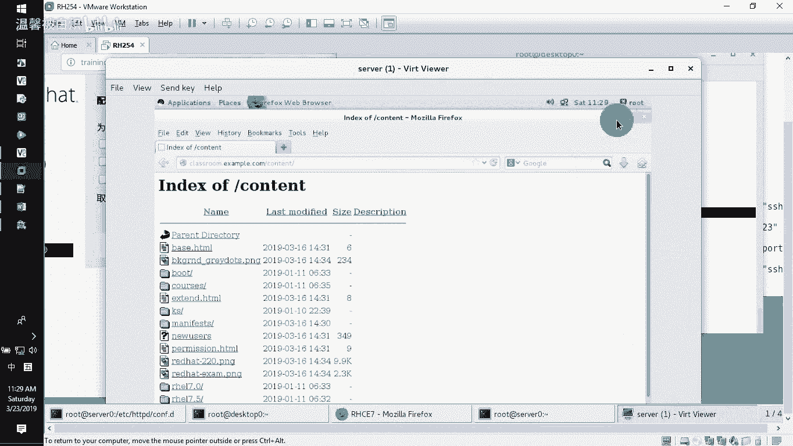
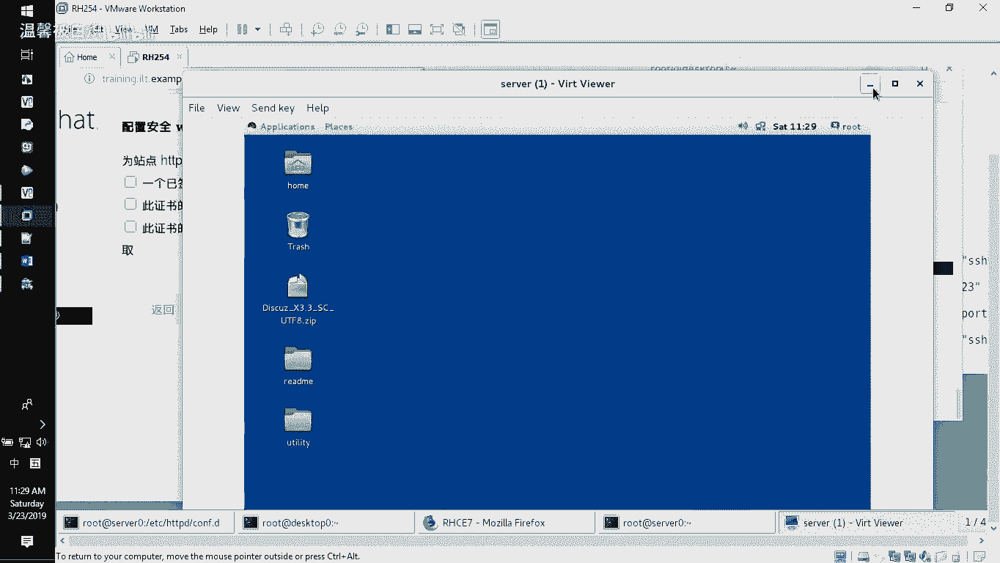

# RHCE-45678天学习视频 - P6：https-www0-web - 打羽毛球的橘猫 - BV14b411g72P

好了，接下来我们再做下一题，也是跟网站相关的。但这题的话呢要求大家做的是什么呢？要求大家做的是针对我们的这个HDDP。冒号双C杠3W0点XM点com这个网站要求大家去做我们所说的这个HTPS的加密。

也就是说大家在访问的时候，要求要又可以用HDPS冒号双斜杠来访问我们这个站点。那HDPS怎么去访问我们这个站点呢？首先大家注意。我们需要大家在做完前面一题的基础上面去选择用yint安装一个模块。

modode下线Sel减Y自动回答个yes。这是安装我们一个Scel模块的一种做法。装完这个模块了之后，我们的这个。b站点它现在已经可以让你的站点支持SSL的这种连接。那我们要配置我们自己的网站。

让它能支持它。要配置我们的网站，让它能支持它。那怎么配呢？CD倒还是到我们的配置文件地方啊，到EDCHDDBDconfig点D这个地方。大家注意啊，当我们装完了一个小程序了之后，这边会多出来一个文件。

🎼会多出来这么一个文件，原本是没有的。你只有装了这个小套件了之后，它才会出来的，明白？才会出来。那才会出来的话呢，也就意味着说现在就算我们去配置什么都没改，我们的配置文件它这个也是可以用的，明白意思呗？

也是可以用的那我们只需要把这个。改成我们自己的这个3W0这个HDPS的这个访问就可以了。那怎么去做呢？首先你需要去做的就是在我们的这个配置文件里面呢，把它稍微改动一下。改完了之后。

我们就知道要求去做什么东西。好了，copy减P把SSL点confi改成我们自己那个主配置文件啊，改成我们这那个主配置文件，那也就是说如果你不需要用我们的其他的配置文件，你可以用自己这个配置文件都行。

能理解不？或者说那像以前的话呢，我比较喜欢就是呃。3W0，然后呃杠HDB啊去访问都可以。那么一般的话呢，如果你喜欢你就自己改一个，但是我们自己默认就知道它在这里，那为什么要改呢，对不对？啊。

那就直接去VI这个文件Scel这个文件就好了。你看它默认支持的是HDPSS43的端口，对不对？好了，但是大家注意啊。里面有几个文件，我们是需要去动的。几个哪几个呢？第一。

指定SSL的这一个这边有一个certificate file，这是什么文件呢？这是我们所说的这个。已经签名了这个证书。还有一个。这个文件的话呢，就是你的那个key，或者说你认为是你自己的那个私钥。

还有一个是我们这边的这个train file。train file的话呢，它其实就是正数链。那也是说我们要三个文件。这三个文件在哪里？他提供告诉你了，你看。😡，他告诉你了。😡，看到吧？

这三个文件他都告诉你了。那我们这个对应的是它。😡，这个对应的是他。这边这个对应的是。他看到了吧？好的，那我们首先你把三个文件给弄起来啊，弄到哪里去？这个也很经典啊，你看他告诉你了，你别放错位置啊。

看到了吧？千万别放错位置啊，你放错位置了，还能待好，你就找半天，你也找不到。好了，那这边的话呢，一般情况下我又打开多一个窗格了。😡，啊，记住我们千万别混啊，我这个是在服务器上面操作的啊。

我们打开的是11，是服务器上面那个主机。看着啊。看着这边去配就好了。Wge。把这个文件下载再来。下载了EDCPKITLS下面certificates下面作为我们的自己文件啊，比如说这个文件名是道什么呢？

这个文件名。就是这个对不对？我没有指定这个文件的文件名，他就会把它下载下来，也会把它文件改成什么名字。改成3W0点CRT能明白不？好了，回车，我们来看一看啊哎。这是一个目录。啊，那我们还是改一个。

这把还是写一下吧，3W0点CRT。下来下来。那也就是说这边下了一个，这边要改成什么呢？你告诉我。😡，这就好改了。3W0是不是这个好，那接下来还有另外一个来，还有另外一个。啊，当然我先给你看了。

因为这边LL我们L来看EDCPKI下面TLS下面C那个certifics里面是不是有1个3到0的这个文件，有的对吧？好了，那接下来再来的哦，还有另外一个，你看另外一个就很经典了。就这一行。

放的位置又不一样了，是不是这个位置？copy一下来。用Wget杠大O又把这个文件下载到这个路径。这个文件是这个啊哦，它叫3W0点。3W0点T把它下来，哎，就是它下来过来。copy一下来。又下载一个。

当然了下载完了之后，你可以去看一眼门啊L。然后我们看一下自己这个文件是不是也在里面，这本来你就下载了，能看到这个结果的，对不对？有啊，3到0对不对？好了，那这边既然你下载过来了，这边要干嘛？改了。

3W0好了，接下来一个链，这个链的话呢，我们是要把它放哪里去呢？你看这个链啊。他说这个链的话呢是放在EDCPKITS那个sty里面作为我们的这个文件。那我们又把这个个路径给它copy一下啊。好了。

W get再来。翻过来，那我这个文件的文件名是叫。example杠CA点CRT那我这个文件名的话呢，你就改成这个文件名了。好，我是要下载这个服务器上面的这个文件啊。好了，copy一下。

它三个文件都告诉你了，你就直接每一个就下载下来就好了。好了，我们上次有个同学啊改完了，就这边的话呢是改成那个叫什么呢？很明显，他也知道这个是改成那个exampEXAMPLE杠CA是这个呗。

是CA点CRT啊，就改成这样子，他就他就保存退出了。你给我看哪个地方是错的。😡，那你这行你。你应该看得到的，这样是没有启用的吗，对不对？井号注释的行了吗？那你把这个行井号给它去掉。好了，保存退出。

OK了，做好了来HDDB。😊，第一，减T。tO同步没有问题，对不对？来开始啊sstem CTLrestar一下我们HTDPD然后防火墙开放，让人家可以访问我的那个HDB的端口fire。

Were gang commander，gan干 minister。刚刚ADD添加一个service，是那个叫XTTB哎，不好意思，写错了。HTB然后呢重载一下我的防火墙。好了，当然如果你想看的话。

你又发现了这个网站的话呢，不单只是可以支持HTTP，也可以支持HTTPS的访问。看到了吧？好了，那么看到这个的之候，大家注意啊，在我们这边啊，我们还是以客户端为例去访问一下给大家看啊。

以客户端为例去访问一下。那一般客户端的话呢，在访问的时候是这样去访问的。大家注意啊。好，我们先退出这个，这个是服务器来。来客户端SH访问我们的这个客户端，这个是第四套那台主机。那一般的话呢。

我们建议大家选择的话呢就是用默认的链接来访问啊，比如说elink。Elink来访问HDDP冒号双斜杠3W0，这个是之前默认的，对不对啊，example点com。

没有问题可以访问。

啊，这个ctrl C一下，然后再用HDDB来访问。

啊，他说了我们这个HDPS的话，呢是1个Scel加密的，对不对啊？那如果是这样的话，那那我们用。

用这个啊。呃，我看看CURL啊减K，我们不要让它忽略我们的这个HTTPS的这个证书。能不能看到这个？可以了，对不对？好，那如果说你用的不是这种验证方法，你用的是那个叫什么呢呃。

客户端的这种验证方法。那如果我这边用图形界面的客户端，我也告诉大家图形界面的客户端怎么去验证，好吧，来图形界面的客户端，我先打开一下。

图形界面的客户端。啊，在这里。dtop的这个啊。

路ot。啊，reha的密码star x。打开它的这种图形界面，用图形界面去给大家介绍一下如何去配置它。那也就是说这个的话呢，其实我们的题目做到刚刚那个地方已经成功了，明白吗？但是这边验证的时候呢。

因为我不知道大家到最后的话呢，知不知道怎么去验证。那我打开一个客户端给大家去感受一下验证的方法。验证的方法里面，就是要保证默认的HTTP可以访问默认的HTTPS两个不发生冲突。

都可以访问同一个站点页面啊，那怎么去做呢？在这边那应该你能够体会到的就是我们打开lics里面的ff这个wordb浏览器，打开它的时候，在地址栏里面直接输入两个域名就好了啊，一个是HTP一个是HTPS。

好了，出来了。先打开。HDDV马号双斜杠3W0点example。点com，这是默认的页面，可以看得到的。好了，ctrl试一下再打开另外一个。那我们打开另外一个的时候，我们这边选择的时候。

就不再去选择用我们的那个呃默认的这个HDDP要用什么呢？要把它这个改成。S。HDVS来访问。但是这边大家注意默认情况下，如果用图形界面去访问的时候，它会提醒我们证书是不在的。看到这个吧？

证实是不在的那我们怎么去验证证书是在的呢？上次有同学告诉我说。😡，他说了，this connection is un就没有被信任嘛，这个很经典了，对不对？然后他就选择了一个叫什么呢？😡。

选择一个添加I understand the，就他说了我我这个我知道有有有威险啊，我知道有威胁啊，然后他就点击这个有威胁，然后他就做了一个什么事情呢？

他说了老师你看我这边是有一个那个ad present，我可以添加一个例外，那你添加例外的话呢，这边HDBS的访问，他就会有报错，明白吗？那我们怎么去做呢？

做法是这样的。我们把这个证书啊让客户端。这正式授权这个东西啊，让客户端去用就好了。大家注意看这里。我们直接去下载这个证书。

也就是说在服务器上面的话呢，哦这个不能copy啊，那我们就直接去下载这个证书。这个证书在这个地方。HTTP冒号双斜杠，然后就下载classes。rong。下面有个PUV，下面的话呢有个exm。

杠CA点这个名称叫什么来着？CR。好，我们去下载一个证书。也就是说这好的话呢，我就直接选择用客户端，你看啊download的这个cert file看到吧？

我们还要做的就是just theCA to identify的we site就信任这个CA在我的web站点里面，而且我还可以信任这个CA在我的email里面，信任这个CA的这个证书。

在我的软件里面开发里面看到吧？那我现在的话呢就信它在我的这个web站点里面好了。ok。好了，我已经下载了哦，看到吧？下载完了之后，回头我们再去打开这个页面。你刚刚不是打不开吗？来。😊，刷新一下。

直接就过了，还有报错吗？没有了，我信这个证书嘛，对不对？我的wob站点信这个证书，那你通过HTPS就可以访问了。好了呃，当然了，大家注意啊，我刚刚在这边做的这个操作，其实你们在考试的时候。

根本就不用去做的，明白不？这只是为了让你知道我做的还是对还是不对，对不对啊？😡。

