# RHCE-45678天学习视频：P6：为网站配置HTTPS加密 🔒

在本节课中，我们将学习如何为一个已有的网站配置HTTPS加密访问。我们将从安装必要的模块开始，修改配置文件，获取并放置SSL证书文件，最终实现网站同时支持HTTP和HTTPS两种协议访问。

## 概述
上一节我们介绍了基本的网站配置。本节中，我们来看看如何为网站启用HTTPS加密，确保数据传输的安全性。核心任务是为 `www.example.com` 网站配置SSL/TLS支持。

## 安装SSL模块
首先，需要在完成基础网站配置后，安装Apache的SSL模块。这个模块名为 `mod_ssl`。

执行以下命令进行安装：
```bash
yum install mod_ssl -y
```
安装完成后，Apache将具备支持SSL连接的能力。

## 配置SSL站点
接下来，需要配置网站以启用SSL支持。配置文件位于 `/etc/httpd/conf.d/` 目录。

安装 `mod_ssl` 后，该目录下会自动生成一个默认的SSL配置文件 `ssl.conf`。我们可以直接修改这个文件来配置我们的站点。

使用文本编辑器打开该文件：
```bash
vi /etc/httpd/conf.d/ssl.conf
```
默认配置监听443端口（HTTPS标准端口）。我们需要修改其中几个关键路径，指向我们自己的证书文件。

## 获取并放置证书文件
配置文件中需要指定三个核心文件：
1.  **SSLCertificateFile**：服务器证书文件。
2.  **SSLCertificateKeyFile**：与证书配对的私钥文件。
3.  **SSLCACertificateFile**：证书颁发机构（CA）的证书链文件。

题目已提供这些文件的下载地址。我们需要将它们下载到服务器的指定位置。

以下是操作步骤，请确保在服务器上执行：

1.  下载服务器证书文件到 `/etc/pki/tls/certs/` 目录，并重命名为 `www.crt`。
    ```bash
    wget -O /etc/pki/tls/certs/www.crt http://classroom.example.com/pub/www.crt
    ```
    在 `ssl.conf` 文件中，将 `SSLCertificateFile` 对应的值修改为：
    ```
    /etc/pki/tls/certs/www.crt
    ```

2.  下载私钥文件到 `/etc/pki/tls/private/` 目录，并重命名为 `www.key`。
    ```bash
    wget -O /etc/pki/tls/private/www.key http://classroom.example.com/pub/www.key
    ```
    在 `ssl.conf` 文件中，将 `SSLCertificateKeyFile` 对应的值修改为：
    ```
    /etc/pki/tls/private/www.key
    ```

3.  下载CA证书链文件到 `/etc/pki/tls/certs/` 目录。
    ```bash
    wget -O /etc/pki/tls/certs/example-CA.crt http://classroom.example.com/pub/example-CA.crt
    ```
    在 `ssl.conf` 文件中，找到 `SSLCACertificateFile` 这一行，**移除行首的 `#` 号以取消注释**，并将其值修改为：
    ```
    /etc/pki/tls/certs/example-CA.crt
    ```

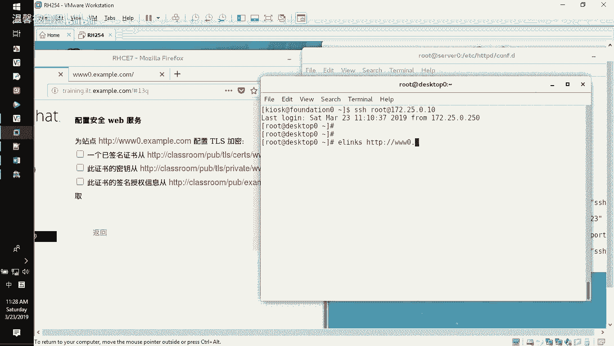

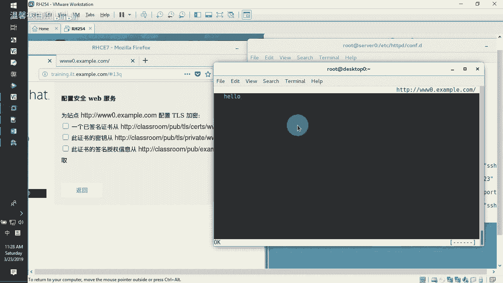

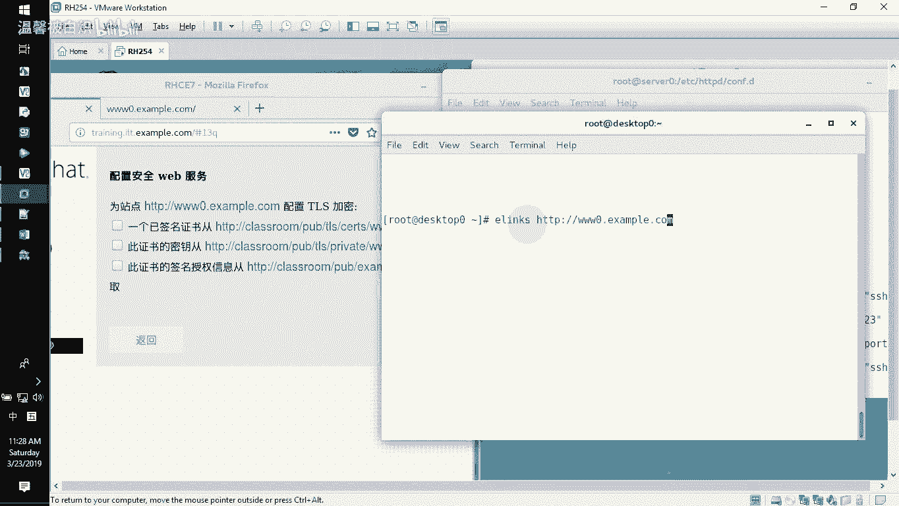

修改完成后，保存并退出编辑器。

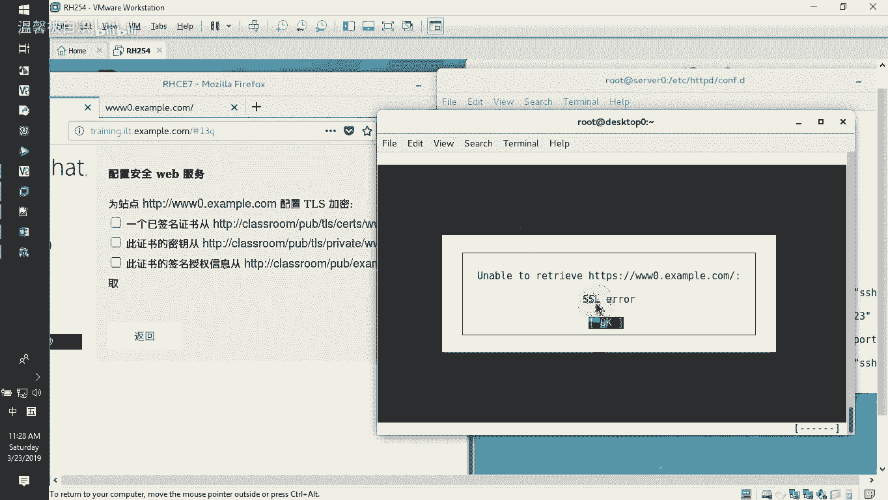

## 应用配置并开放防火墙
配置文件修改完成后，需要测试语法并重启服务。

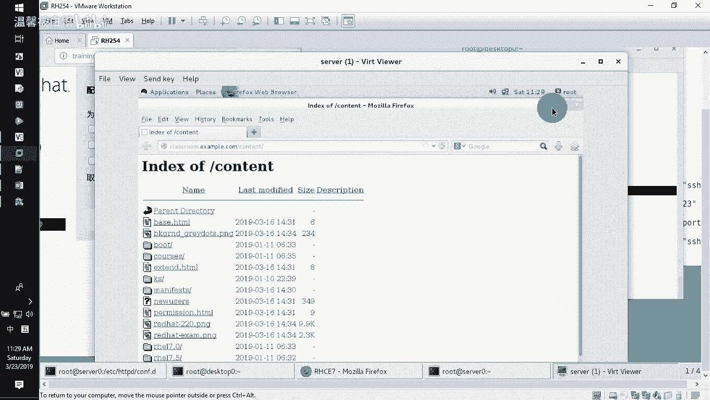

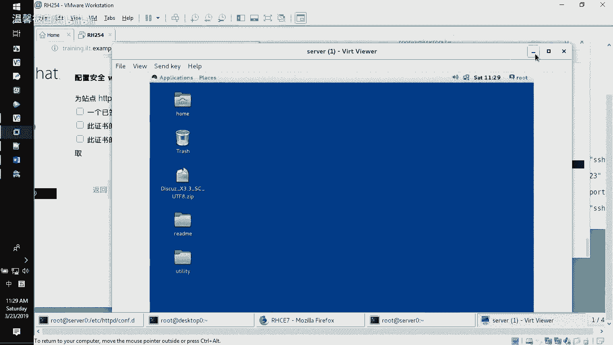

1.  测试配置文件语法：
    ```bash
    apachectl configtest
    ```
    确认输出显示 `Syntax OK`。

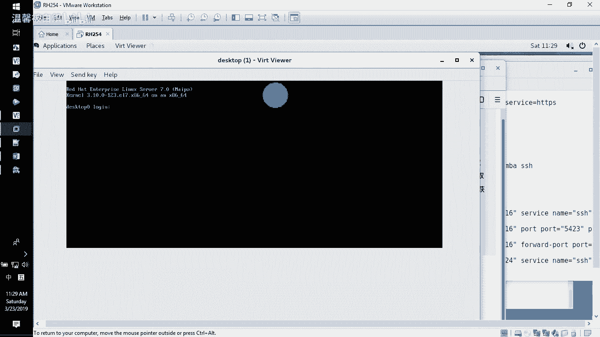

2.  重启Apache服务以应用新配置：
    ```bash
    systemctl restart httpd
    ```

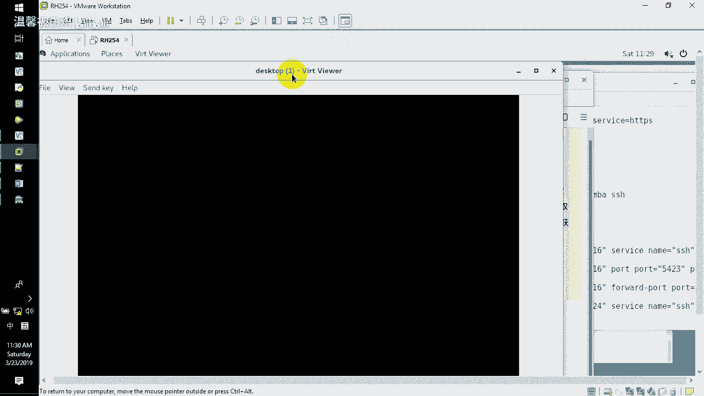

3.  配置防火墙，允许HTTPS（端口443）的流量：
    ```bash
    firewall-cmd --permanent --add-service=https
    firewall-cmd --reload
    ```

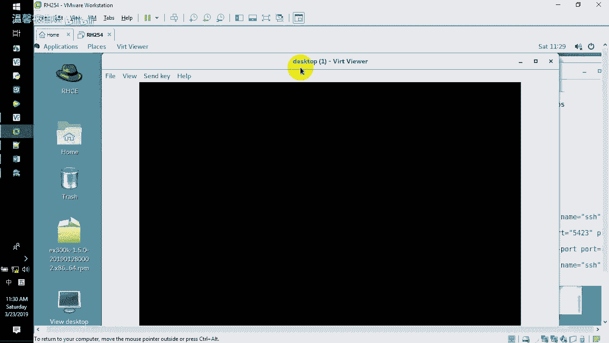

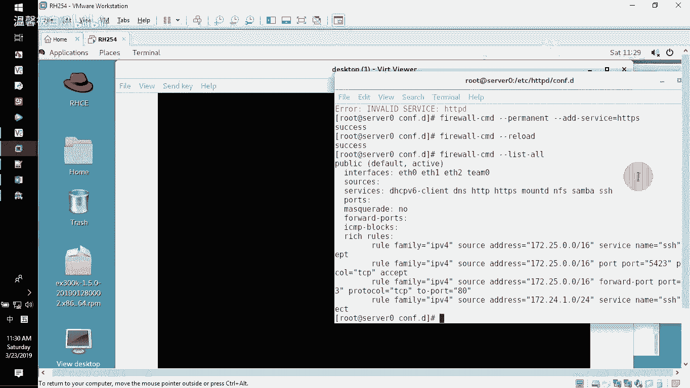

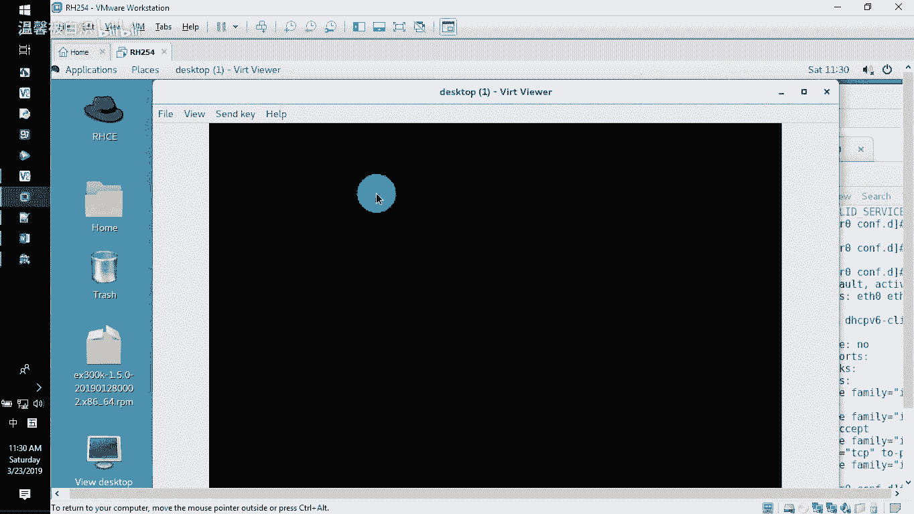

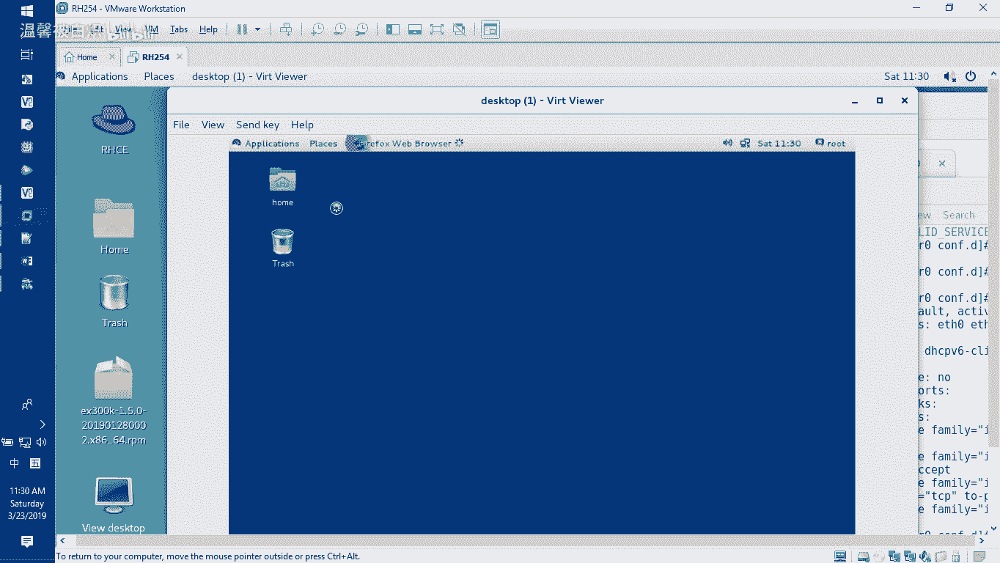

## 验证HTTPS访问
服务配置完成后，可以从客户端进行验证。

### 使用命令行工具验证
在客户端机器上，可以使用 `curl` 命令进行测试。

-   测试HTTP访问（应能正常访问）：
    ```bash
    curl http://www.example.com
    ```
-   测试HTTPS访问（使用 `-k` 参数暂时忽略证书警告）：
    ```bash
    curl -k https://www.example.com
    ```
    如果能看到网站内容，说明HTTPS配置成功。

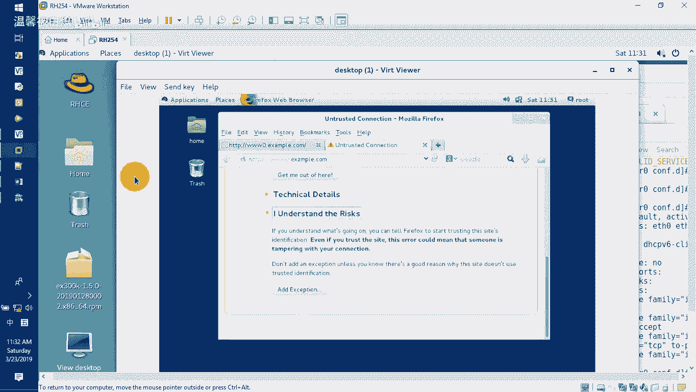

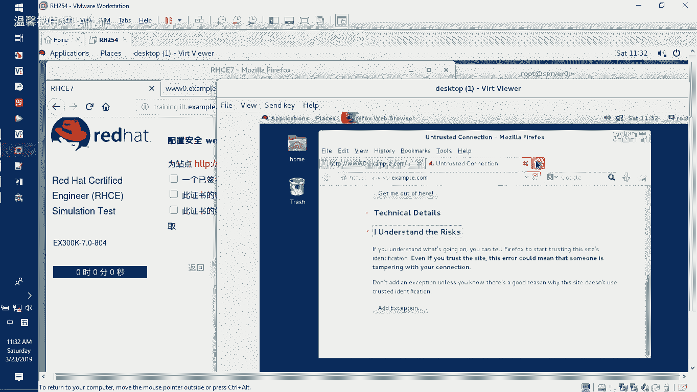

### 使用图形化浏览器验证（补充知识）
在图形化客户端（如Firefox）中访问 `https://www.example.com`，浏览器通常会提示“连接不安全”，因为该证书不是由公共可信CA签发的。

为了使浏览器信任此证书，可以将CA证书（`example-CA.crt`）导入到浏览器的证书信任列表中。具体步骤因浏览器而异，一般在设置或选项的“隐私与安全” -> “证书”部分，可以“导入”或“添加例外”。

**请注意**：在RHCE考试环境中，通常只需使用 `curl -k` 命令能成功获取页面内容即算通过，无需在图形界面中进行复杂的证书信任操作。此部分仅为知识扩展。

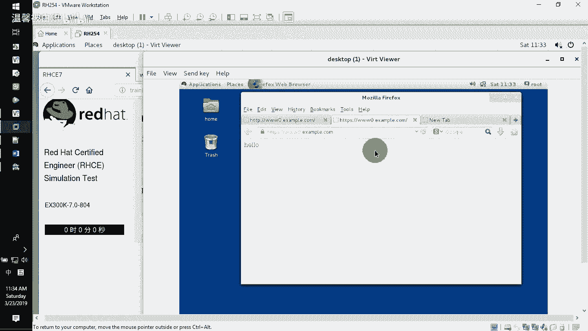

## 总结
本节课中我们一起学习了为Apache网站配置HTTPS加密的全过程。关键步骤包括：安装 `mod_ssl` 模块、编辑 `ssl.conf` 配置文件、下载并正确放置服务器证书、私钥和CA证书链文件，最后重启服务并配置防火墙。完成这些步骤后，网站便能够同时通过 `http://` 和 `https://` 进行安全访问。