# RHCE-45678天学习视频 - P7：webapp0-virtual - 打羽毛球的橘猫 - BV14b411g72P

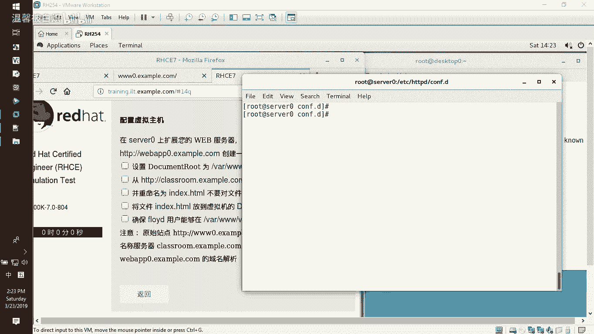

好，接下来的话呢就是做一个Wb的虚拟主机呃，路径的话呢就是要从这个页面就这个地址下载这个页面下载到我们自己的这个网站的跟目录，然后让我们这个网站跟目录的话呢，这个用户可以在里面创文件啊。

就让这个Wb虚拟主机建出来，不要影响原来的Wb虚拟主机就好了。那怎么去做呢？做法非常非常简单啊，来开始。

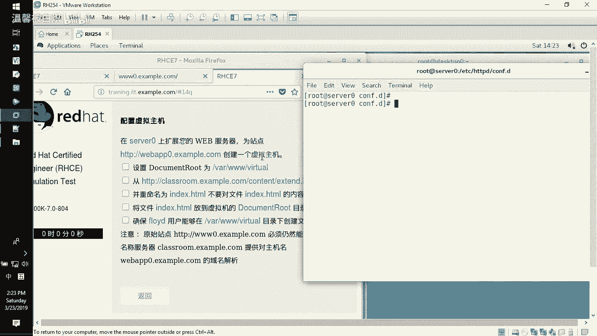

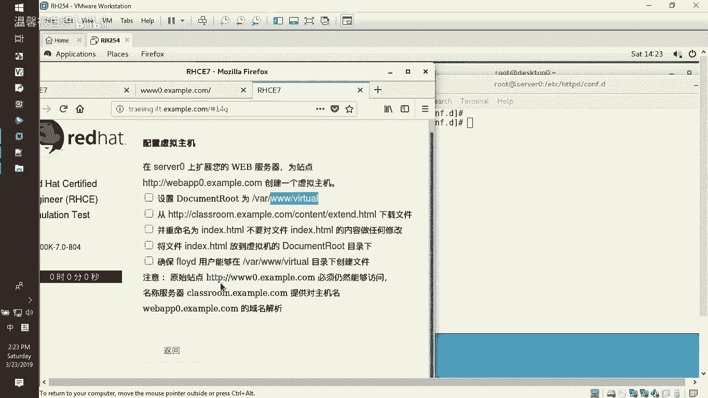

MKDR在哇3W新建1个VRTULvi。接下来的话呢就Wge减大O指定放到哇3Wvi下面作为inHML的文件下载过来。

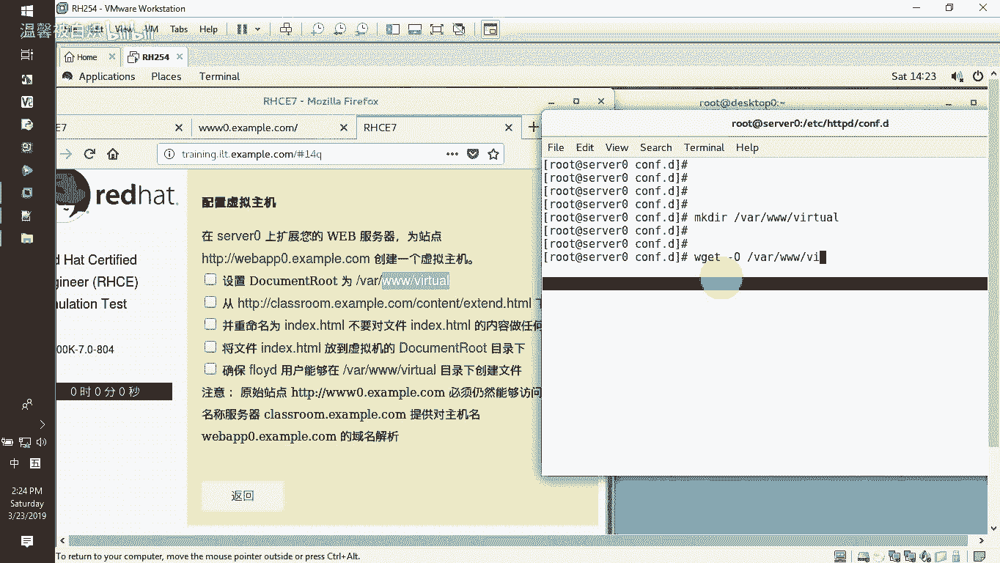

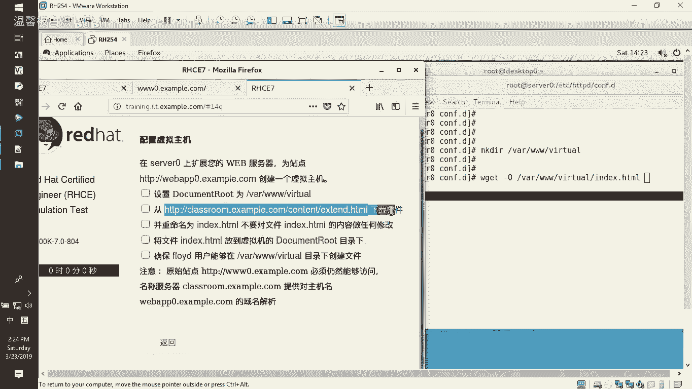

下载好了之后，接下来呢对这个目录设置访问授权，用get FACL。然后呢，去看one3Wvi没有这个。FOYD这个人，然后呢，我们直接setFACL减M项目减那就user。用户可以简写为U。

FOYD冒号后面直接指定RWX拥有读写执行的权利，让他可以针对Y3Wvi这个目录。好了，那在get一下来看的时候，有它了，它就可以在里面写东西。好，那接下来的话呢就是配置我们的这个web虚拟主机。

让人家可以访问的到我们这个页面。

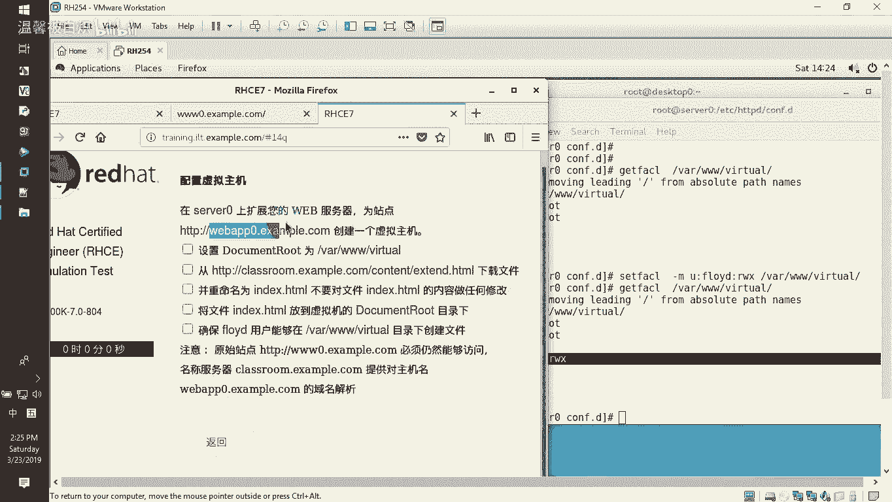

CD到EDCH厘米。confi点D这是网站平台的额外配置文件。那么在些配置文件里面，我们已经有了一个3W0，还有杠V host，我们直接copy这个3W0过来就好了。

作为我们今天的这个weber APP0点啊，就杠V house。点com这个配置文件。VI一下这个文件。这个文件里面的话呢，在使用的目录里面，我们直接给它改成。VRTULvi，然后。

网站所使用的域名webAPP0，然后这边这个也改一下就好了。维改好了之后直接保存退出，你看。

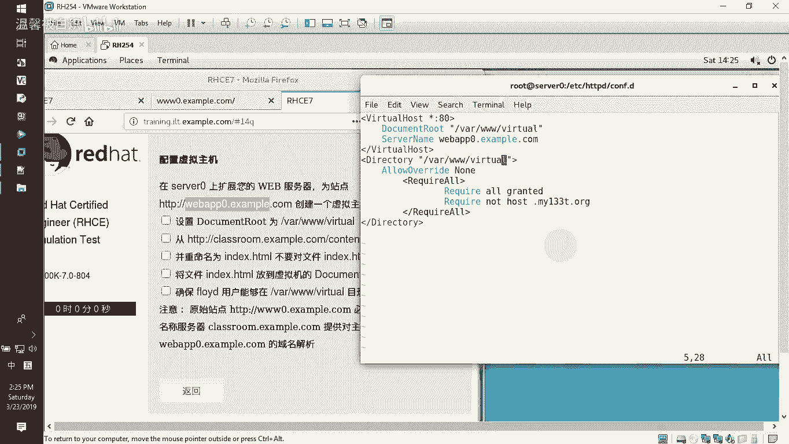

网站路径是这个使用域名，是这个目录访问授权是这一堆，允许所有人拒绝它。

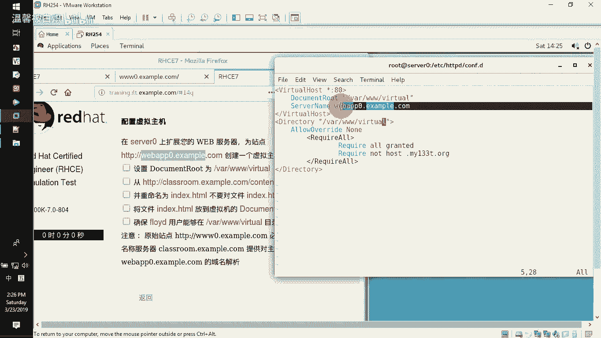

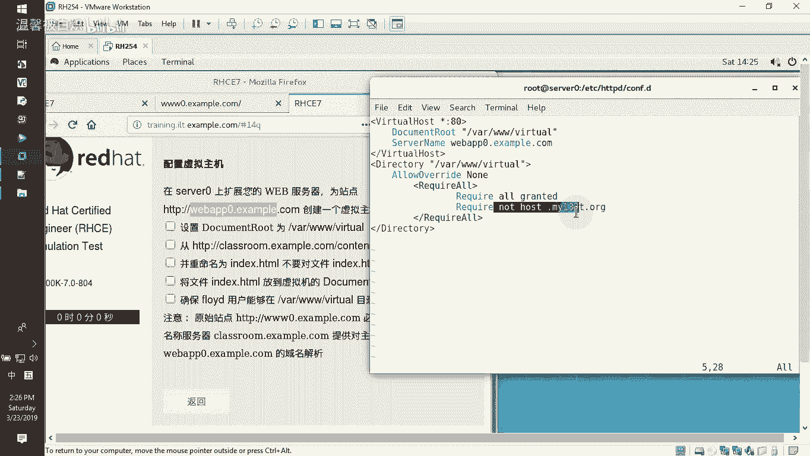

保存退出。HDDVD减T。system CTLrestar一下我们的HDBD这个服务。好了，做好了之后，客户端这边直接来访问就好了。CURLHTDP。冒号双斜杠。

然后直接访问wordbAPP0点example点com。打错了吗？

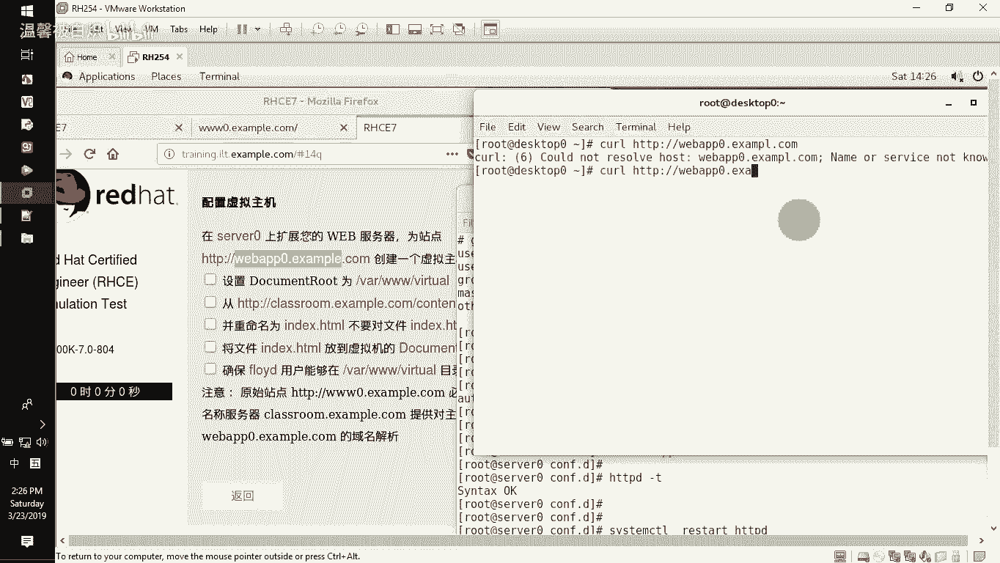

啊，可以看得到，没问题。对吧那是不是其他就防不了呢？

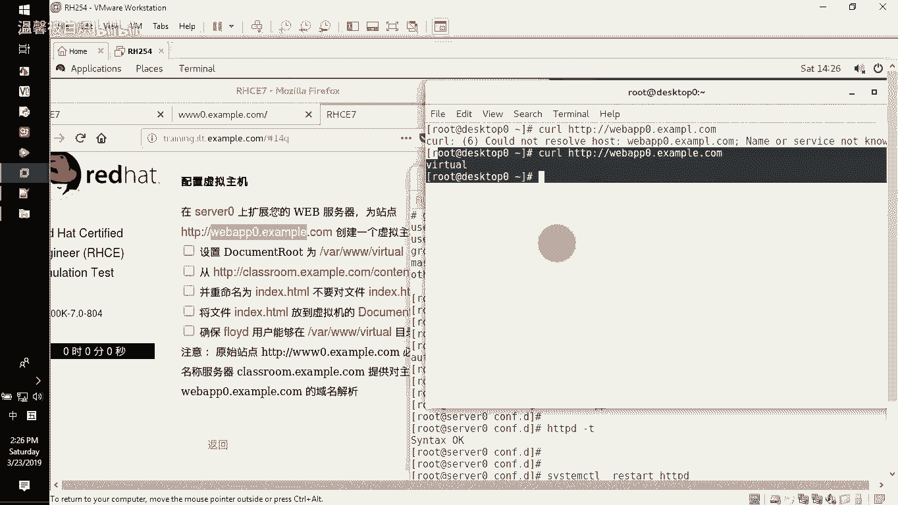

他说了，不要影响3W0点example没问题，人家也这样可以访问，看到吗？那人家那个HTTBS的那个也这样可以没有问题的啊，剪开一下可以看得到的，也没有问题。这样可以访问这是我们看到的一种效果啊。

所以呢在配置这个wo虚拟主机的时候，其实是非常非常简单的。好了，看了一遍了之后。

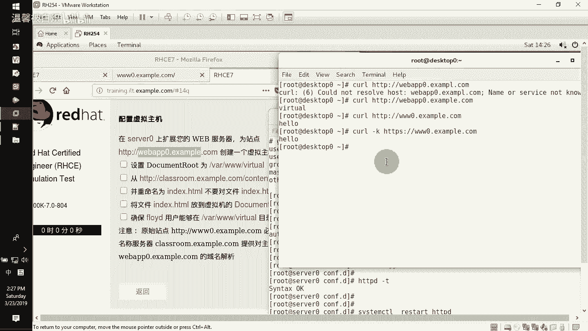

录像里面呢已经。