# RHCE 学习教程：P7：配置 webapp0 虚拟主机 🖥️

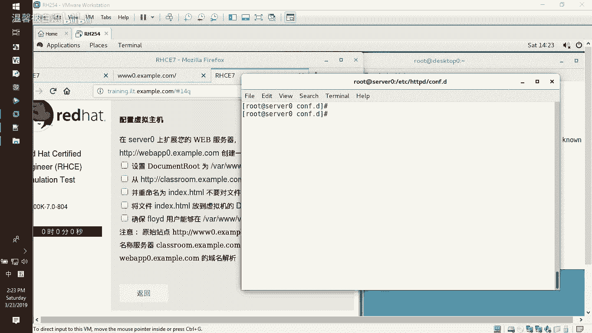

在本节课中，我们将学习如何配置一个名为 `webapp0` 的 Apache 虚拟主机。这个虚拟主机将拥有独立的网站根目录和域名，并且不会影响服务器上已有的其他网站。

## 概述

我们将通过以下步骤完成 `webapp0` 虚拟主机的配置：
1.  创建独立的网站根目录。
2.  下载网页文件到该目录。
3.  设置目录的访问权限。
4.  创建并配置虚拟主机文件。
5.  重启服务并测试访问。

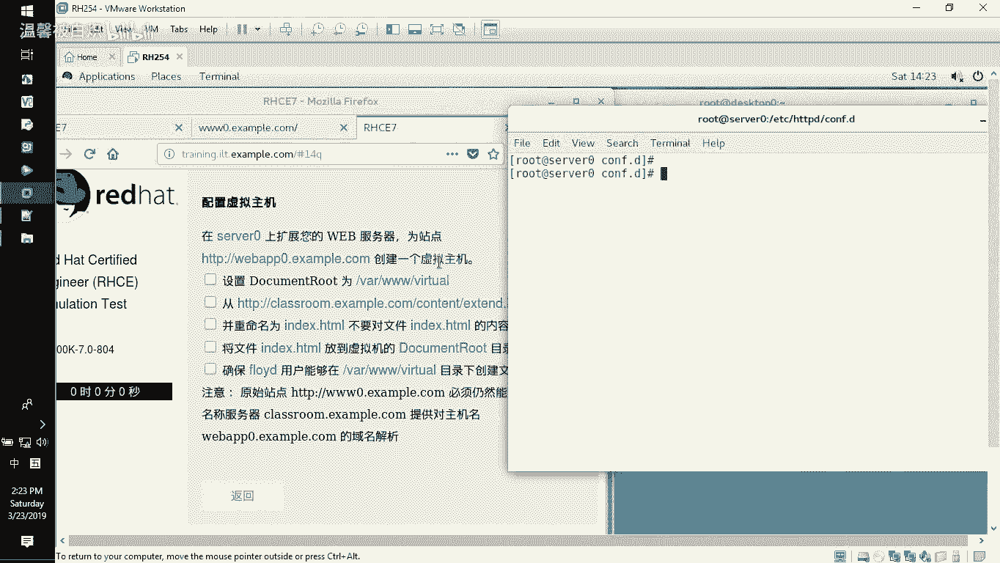

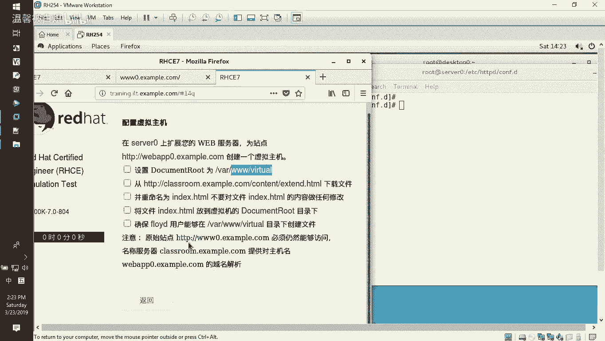

上一节我们介绍了 Apache 的基本配置，本节中我们来看看如何配置一个独立的虚拟主机。

## 创建网站根目录

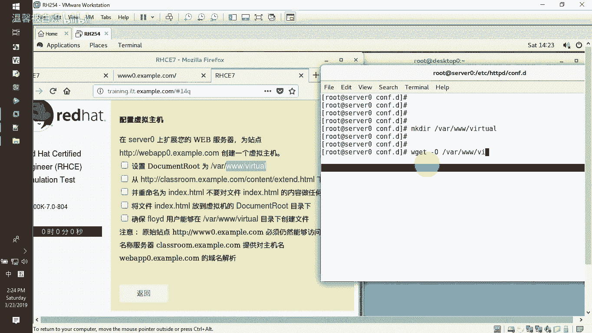

首先，我们需要为新的虚拟主机创建一个独立的根目录。

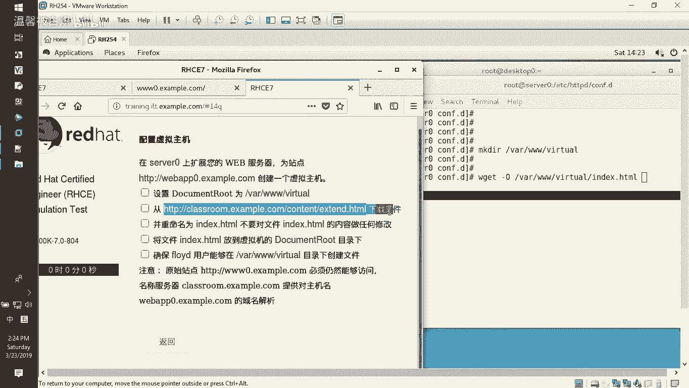

以下是创建目录的命令：
```bash
mkdir /var/www/virtual
```

## 下载网页文件

目录创建好后，我们需要将网页内容放入其中。我们将从一个指定的地址下载一个示例页面。

以下是下载文件的命令：
```bash
wget -O /var/www/virtual/index.html [指定下载地址]
```
请将 `[指定下载地址]` 替换为实际的网页文件地址。

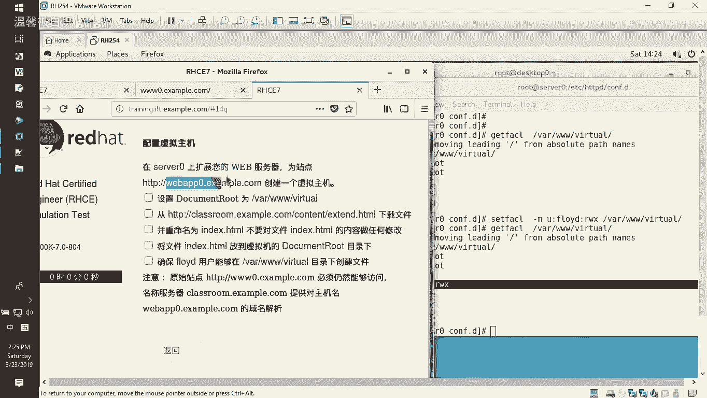

## 设置目录权限

为了让特定用户（例如 `fooyd`）能够在该目录中创建或修改文件，我们需要设置访问控制列表（ACL）。

以下是设置 ACL 权限的命令：
```bash
setfacl -m u:fooyd:rwx /var/www/virtual
```
此命令授予用户 `fooyd` 对该目录的读（r）、写（w）和执行（x）权限。

我们可以使用以下命令来验证权限是否设置成功：
```bash
getfacl /var/www/virtual
```
如果配置正确，你将在输出列表中看到用户 `fooyd` 及其对应的权限。

## 配置虚拟主机

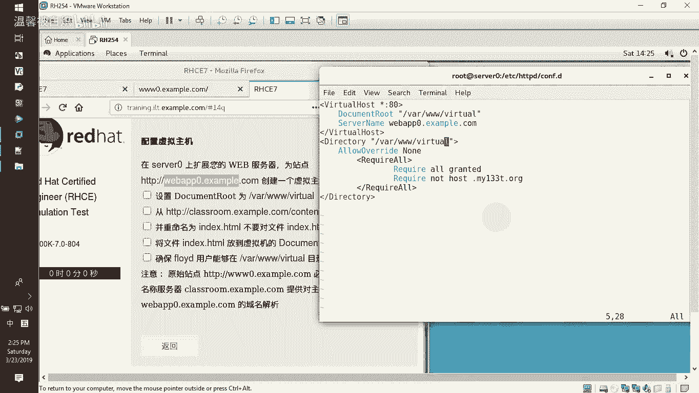

接下来，我们需要创建 Apache 的虚拟主机配置文件，以将域名 `webapp0.example.com` 指向我们刚刚创建的目录。

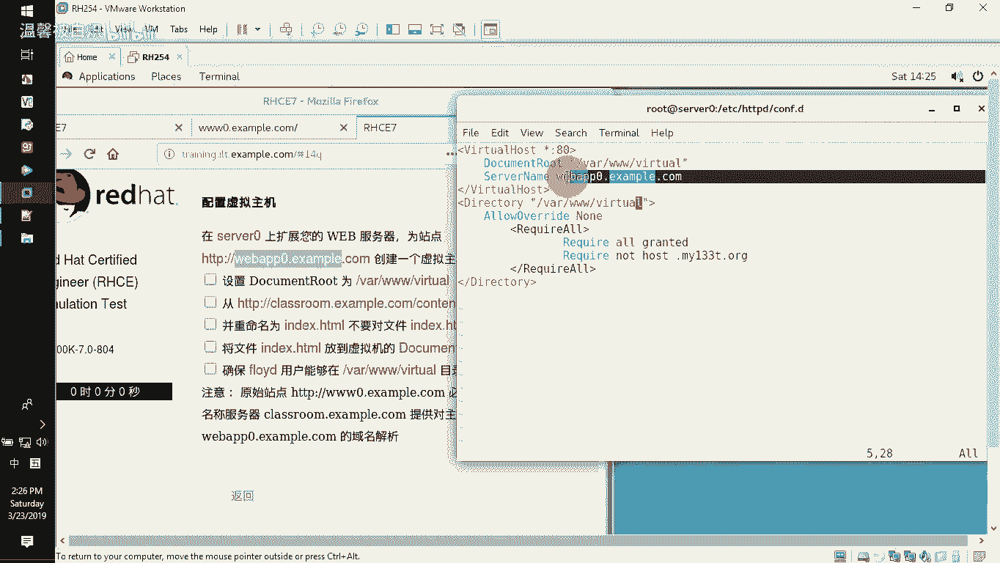

首先，进入 Apache 的额外配置文件目录：
```bash
cd /etc/httpd/conf.d/
```
我们可以复制一个现有的配置文件（例如 `www0-vhost.conf`）作为模板：
```bash
cp www0-vhost.conf webapp0-vhost.conf
```
然后，编辑这个新文件：
```bash
vi webapp0-vhost.conf
```
在文件中，我们需要修改两个关键配置项：
1.  将 `DocumentRoot` 的路径改为 `/var/www/virtual`。
2.  将 `ServerName` 的值改为 `webapp0.example.com`。

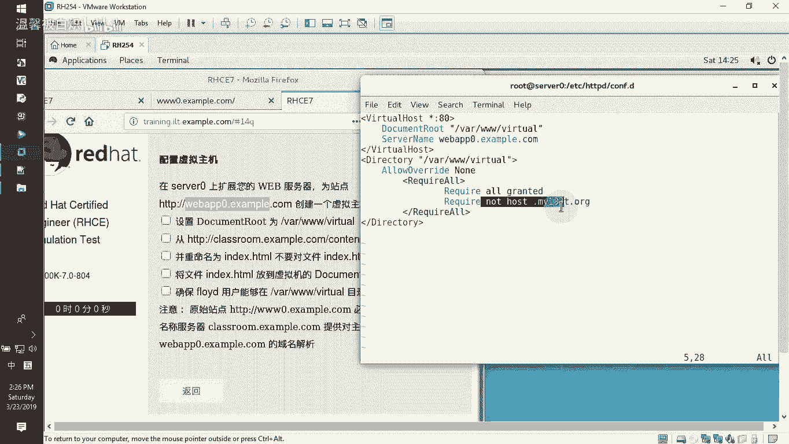

修改完成后，保存并退出编辑器。

## 重启服务并测试

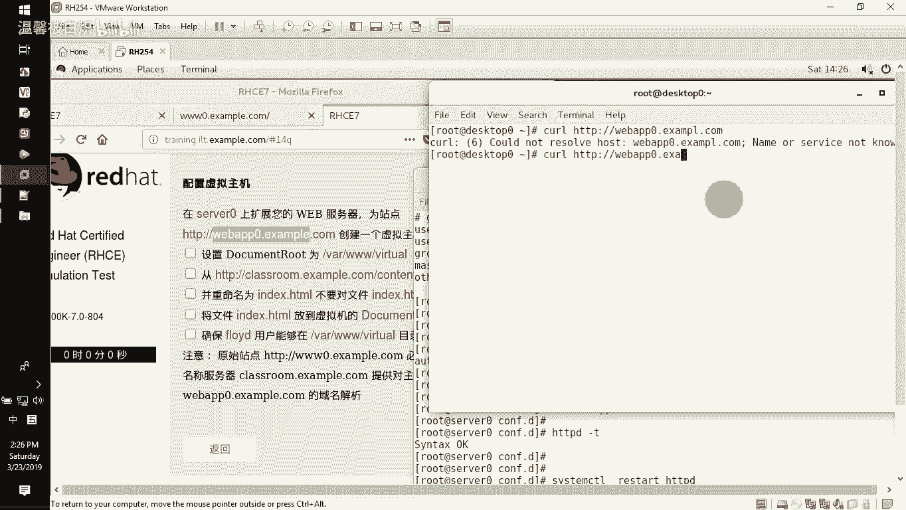

配置文件修改完成后，需要重启 Apache 服务以使更改生效。

以下是重启服务的命令：
```bash
systemctl restart httpd
```
服务重启后，我们就可以进行测试了。在客户端使用 `curl` 命令访问新的虚拟主机：

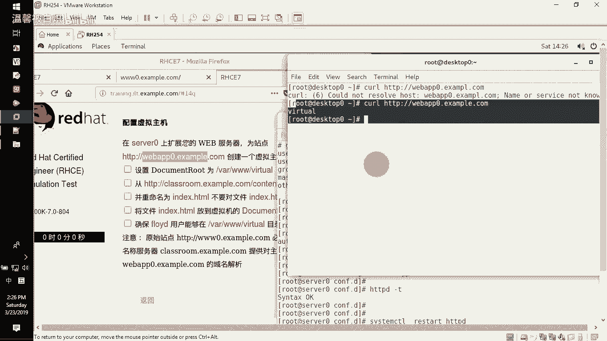

```bash
curl http://webapp0.example.com
```
如果配置正确，你将看到从指定地址下载的网页内容。

同时，我们也可以验证原有的网站（如 `www0.example.com`）是否仍然可以正常访问，以确保新的虚拟主机没有影响其他服务。

## 总结

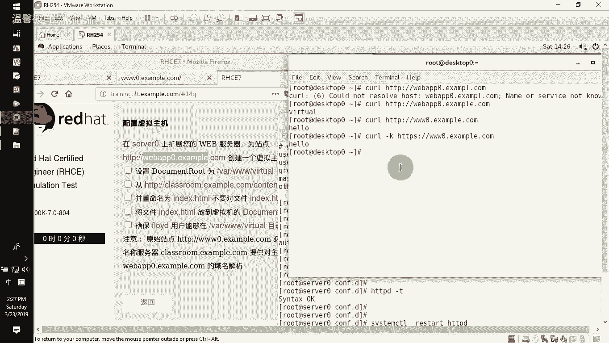

本节课中我们一起学习了如何配置一个 Apache 虚拟主机。我们完成了从创建目录、放置内容、设置权限到编写配置文件和最终测试的全过程。关键点在于使用独立的 `DocumentRoot` 和 `ServerName` 来隔离不同的网站，并通过 `setfacl` 命令灵活管理目录权限。掌握虚拟主机的配置是管理多网站服务器的核心技能之一。