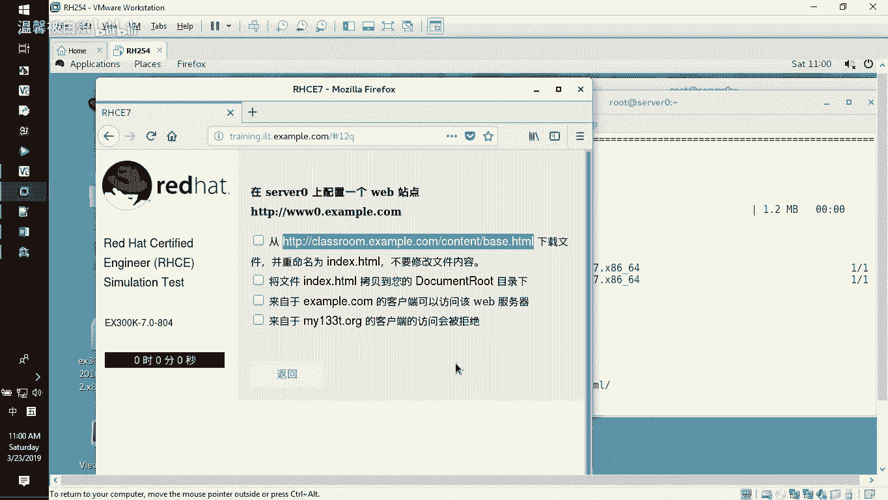
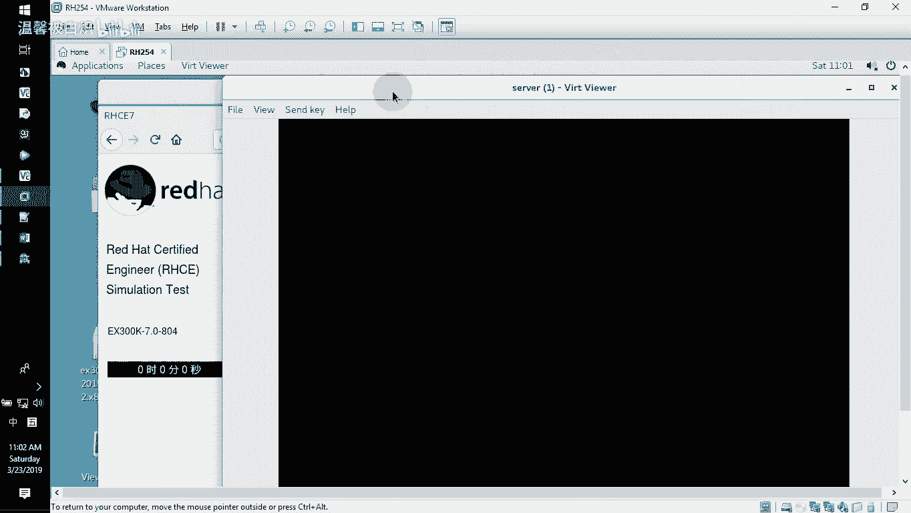
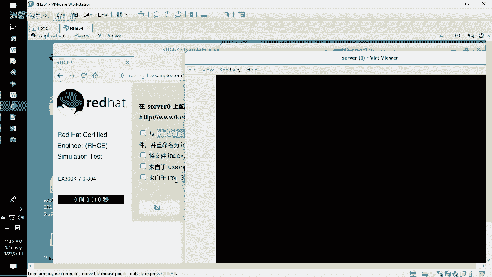
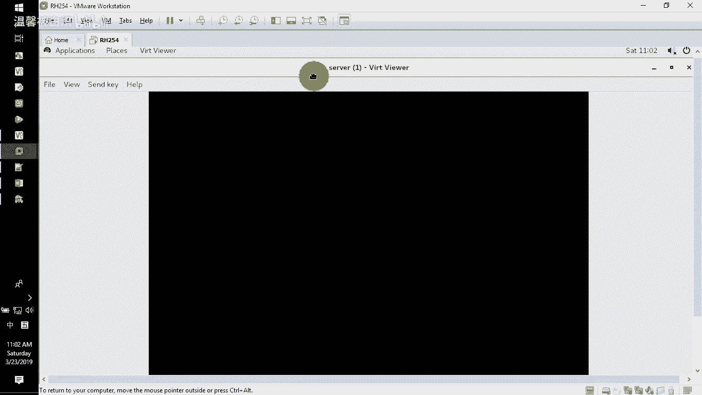
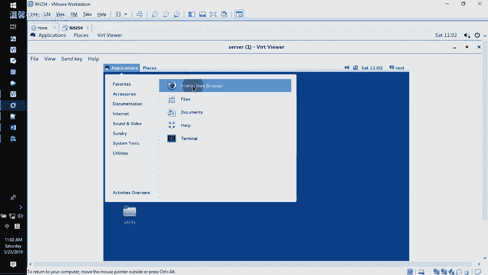
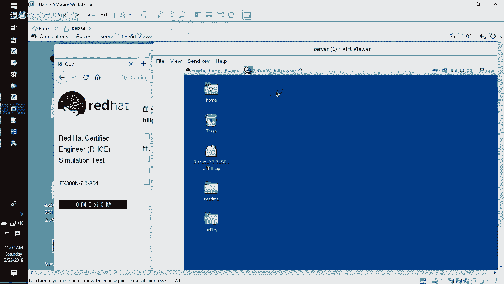
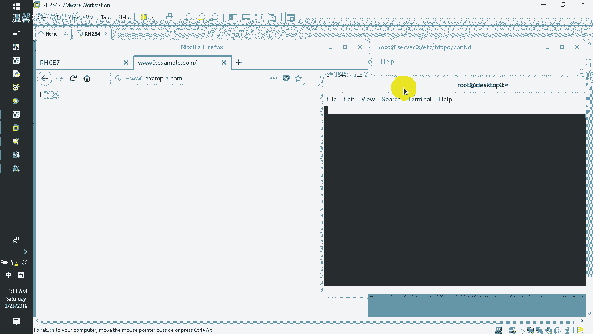
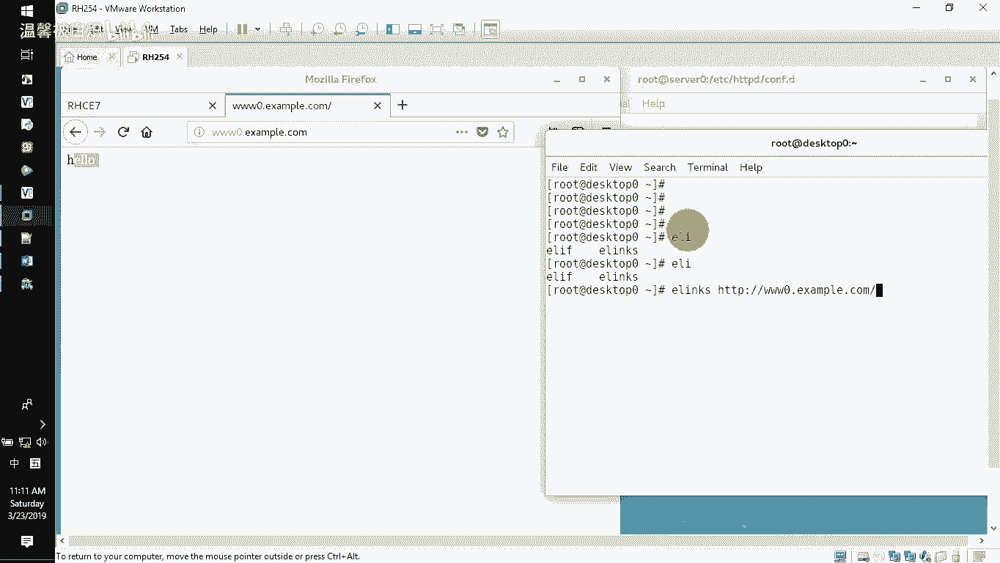
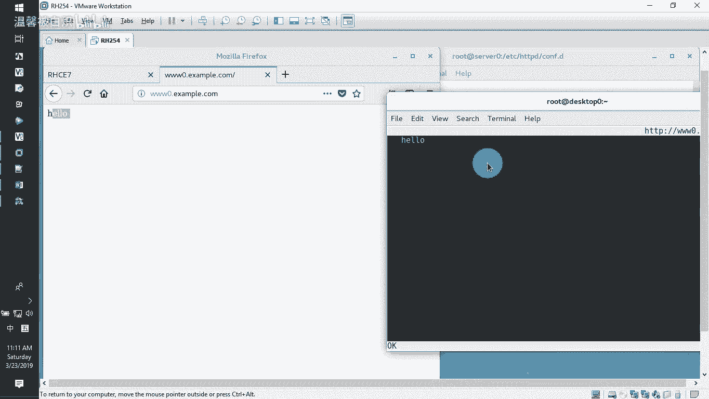
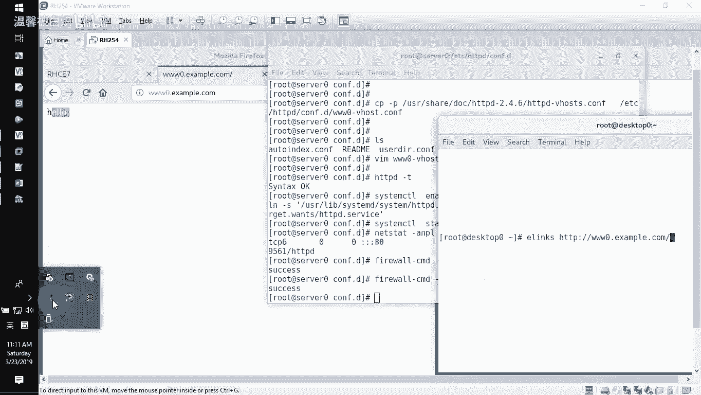

# RHCE-45678天学习视频 - P8：www0-web - 打羽毛球的橘猫 - BV14b411g72P

目现在已经开始，接下来要给大家去做的是C一里面。在服务器上面去配置一个we站点。wob站点的主机是3W0点example点com。这个网站的页面是从这个地方下载。下载下来之后，重命名为我们的首页文件。

不要去改动这个文件哈，无论如何都不要去改。把这个文件的话呢放到我们自己的网站目录下。然后让这个网段可以访问，拒绝这个网段啊，那简单了来我们去完成一下这个操作。yinst HTDPD这个程序包把它安装好。

装好了之后，我们知道默认网站的加目录在Y3WHTL这个地方，这是默认网站的加。那我们就把这个网站的这个文件下载到本地。

网站的这个文件哈下载到本地用Wge减大O下载到哇3WHTL下面作为index点HTL。它说的很清晰的，然后哪个文件下载。

就是刚刚我们这个路径，也是说你通过这个路径。这个页面去下载。大家注意。严禁用这种方法，也就是说严禁大家用哪种方法去下载呢？上次有同学他是直接打开那个，比如说他是直接打开了我们那个vivo那个页面啊。

H7杠VMCTL啊。然后vivo我们那个就就比如说vivo我们那个serv零啊啊，vivo那个server，然后呢，它是打开它的之后呢，在我们的这个页面里面呢，它是用图形界面去下载的。但大家记住啊。

严禁用这种方法。啊，这种方法是不可以的。再次强调，如果你打开serv零去serv零这个页面里面用网页的方法去下载这个文件，然后把它从命名过来。这个文件已经被修改了。它不是原来的文件，记得啊。

一定要用我给你的这种方法才快才是正确的方式啊。

呃，这边演示的这个错误呢，也就告诉大家，我们之前有同学的话呢是这样的，他是在这边的这个应用里面打开这个by box，然后呢去打开这个页面路径啊，打开的是这个classroom下面的这个页面路径啊。

cont下面啊，我就直接用这种方法给大家演示一下，记住这种方法是错误的。

还是这样啊。啊，HTP松斜杠class点examp点com打开它。然后里面的话呢有一个那个con，下面的话呢，他看到有一个那个叫b ht还是右键唉选择这个另存为看到吧啊，还就选择另存为另存为到哪里去。

他就直接另存为他说了哎，老师你看我这个简单的，我就另存为在这边选择保存在这个呃哇下面的3W对吧？3W下面的那个什么HtL底下，他说我就直接把它改成那个叫ind记住这种做法，这种做法是错的，错的错的啊。

重要的事情讲三遍，不允许这样干啊好来。呃，这这个不能这样来哈，这是错的。好了，因为你在里面用它的这个把呃就用浏览器去下载的时候，它本身东西已经发生了改变。记住啊，不再是原来的东西。

所以题目里面要求的动作，你就达不到题目里面要求什么呢？要求无论如何都不要去修改这个文件，你就达不到题目的要求。好了，那这边就是我们刚刚看到的这个结果啊，那我先不理它来继续我已经下载过来了哇。然然要看。

哇下面3WHTL啊，下面的这个页面的话呢叫engHTL啊，这个已经没有任何问题。好了。下载过来了之后，接下来去修改主配软件。主配置文件的位置在Y3WHTL哎，不好意思。

是在那个EDCHTTVD下面的这个config。点D这是我们额外的配置文件，主配置文件都是这个啊，这是网站的主配置文件。网站的主配置文件，这个是网站主配置文件。那我们自己要做的额外配置文件的话呢。

这confi点D这个这个地方啊，记住我们直接CD到EDCHDDBDconfig点D下面，这边是我的这个额外配置文件。那我待会要建一个3W0的这么一个额外配置文件。作为我的这个站点配置文件。那怎么去做呢。

有样例可以去参考，我们交大去copy减P保留权限，把user share丢OC。DOC下面的HDDPD2点几的版本里面有一个V啊，就HDVDV host这个文件，把它拉到我本地来。

拉到我EDCHDDBDfi点D就是我的额外配置文件作为3W0点V啊，就杠了杠V点com文件把它copy过来呃，一般这边的话用杠就好了。而且我给大家的文档里面评分的脚本的话呢。

就监视这个文档就监视这个主配置文件就不要写错就好了。那么有它了之后，接下来呢我们就去改3W0点V host点com这个配置文件，不要的都可以把它删了。嗯，后面这一堆也可以不要啊。啊，就留下的都是精华了。

首先监视的是本地IP地址，监视的本地端口。是。80端口。监视的本地的这个主机名。监视的本地的主机名是。题目要求的这个3W0，然后监视的本地的目录。我自己那个目录。就是。

one3WHTML下面这个目录看到吧？就是它。然后呢，接下来这边的额外的别名没有。额外的别名这边滴滴去掉它滴滴滴滴啊就没有了。然后接下来呢还有一行还有几行要注意的就是我们要设置访问授权。

那怎么设置访问授权呢？大家注意了，正好我们重新打开多一个这个。终端连到我们的这个服务器上面。连到11上面。连到11上面了之后，记住啊，重新多打开一个服务器，连到这个服务器啊，11上面啊。

就是我们的这个设灵上面啊，然后呢去VI。EDCHDDP它的主配置文件就这个主配置文件里面去找一行，找哪一行呢？里面去直接找到我们的要求用的那一行。好了呃，在最前面哈。目录访问授权的那几行。

我们直接其实这几行也可以。那一般的话呢我都要求大家去加加的就这几行看到不？就这几行看到它了之后呢，就directory，然后加上目录。

然后后面的话呢有一个rere all grant就这几行copy一下，然后回到我的配置文件里面来开始了，桌面粘贴啊，当然这边我们不用去改它哈，这边就退出就好了。好了，那改什么呢？

这边这个井号的可以不要啊。滴滴去掉。诶，吸毒。好了，留下的都是精华了。那我们在这个地方加我们自己的内容。间括号一对，中间输入的是requi。哦呃，大写的AL哈，然后有开头就有结尾。

结尾的话呢就是也一样的，你就按照这个地方去写就好了。好了，那这边呢为了让大家看的比较舒服一点，一般我都会要求大家对齐哈，就下一级别嘛，对不对啊？那我这边的话呢就对齐一下。好的。

书写内容就写一个requi。Not。Hot。拒绝my133T点ORG写好了。哪个地方？啊，少了一个斜杠啊，我看到了。好，有开始有结束啊，因为你前面看到这边有开始这边结束的时候，有一个斜杠结束的。

所以它的配置文件写好了之后保存退出。检测配置文件是否正确？HDVD。减梯检测的时候没有任何问题。好了来。system CTLunable开启HTTBD这个服务呃，没有必要写后面啊HTBD。然后呢。

现在我就把这个服务给它star开启它啊，你开完了之后可以去监听一下。80端口是活着的，看到吗？然后呢，你还需要的是在防火墙里面开放。服务端口一般的话呢在永久配置生效里面，杠杠ADD杠service。

加载我们所说HDPD还就HDP这个服务加载完了之后选择重载防火墙。好了，那么你可以用外面的这个真机做测试。打开我们的这个外面的。Fphone是。浏览器，然后呢。

HTDB马双十杠3W0点exm点com能够看到这个页面，说明这个题目就已经成功。但是如果你不想用外面的机器来做测试，你想用那个叫什么呢？你想用我们所说的那个客户端去做测试的时候，可以这样去。

客户端嘛对不对？那一般的话呢，我们通过ellink。ELIMKS访问这个对方3W0点example点com。Welcome to a link。诶。

E link。有啊，elink。HTDB。访问。3W0点example点com下面我们那个页面应该是那个叫哎。

hel hello出来了呗，就已经成功了啊，你可以看得到的，就用这个命令就可以去验证了。

啊，就是在客户端上面这样去验证我们的服务器的这个呃站点搭建是否成功，就很简单哈。好了。做好了之后呢，这个路像就先告一段落了啊。

