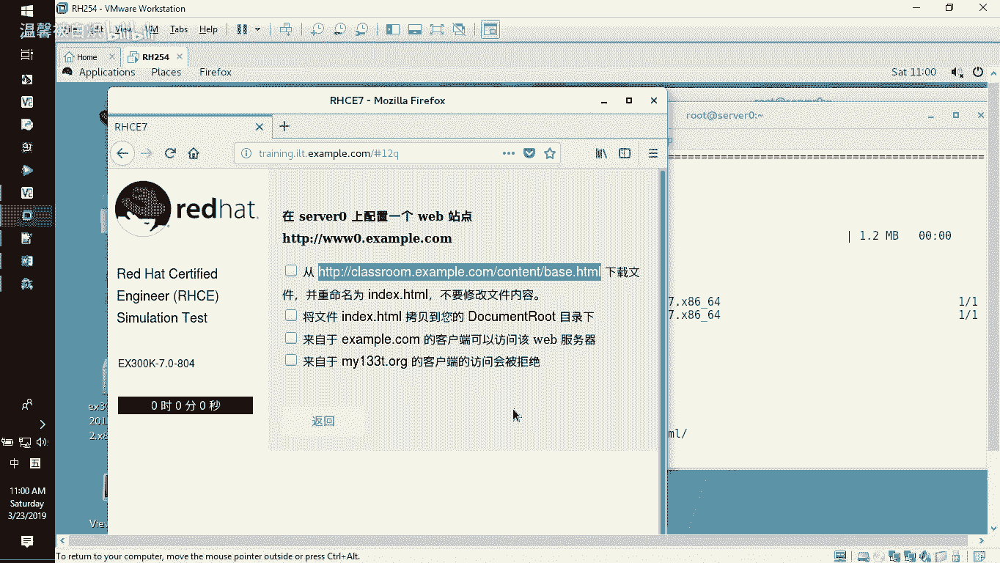
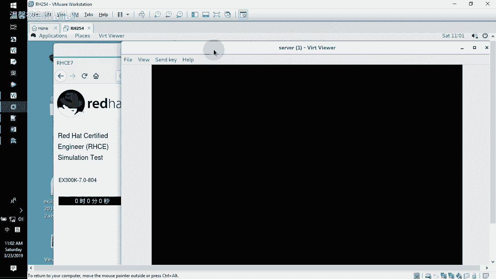
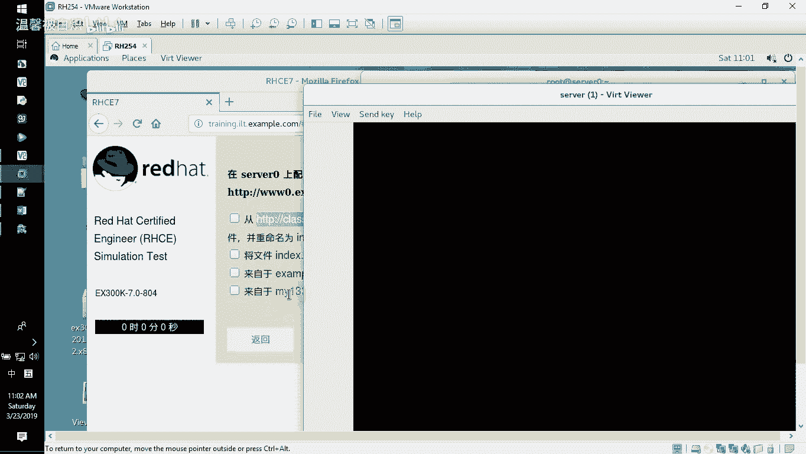
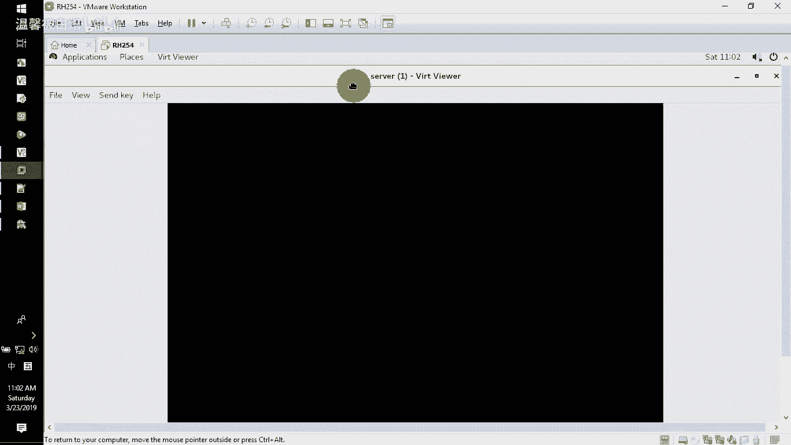
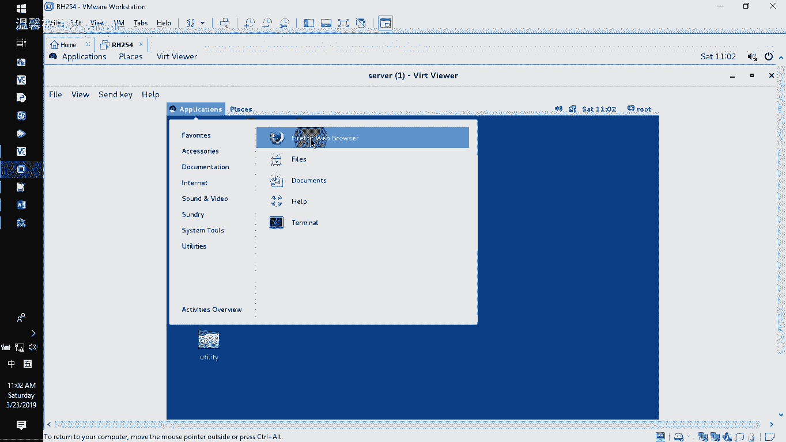
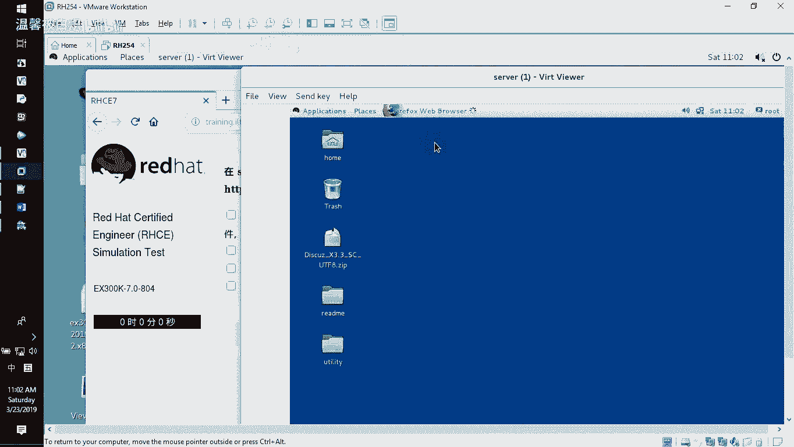
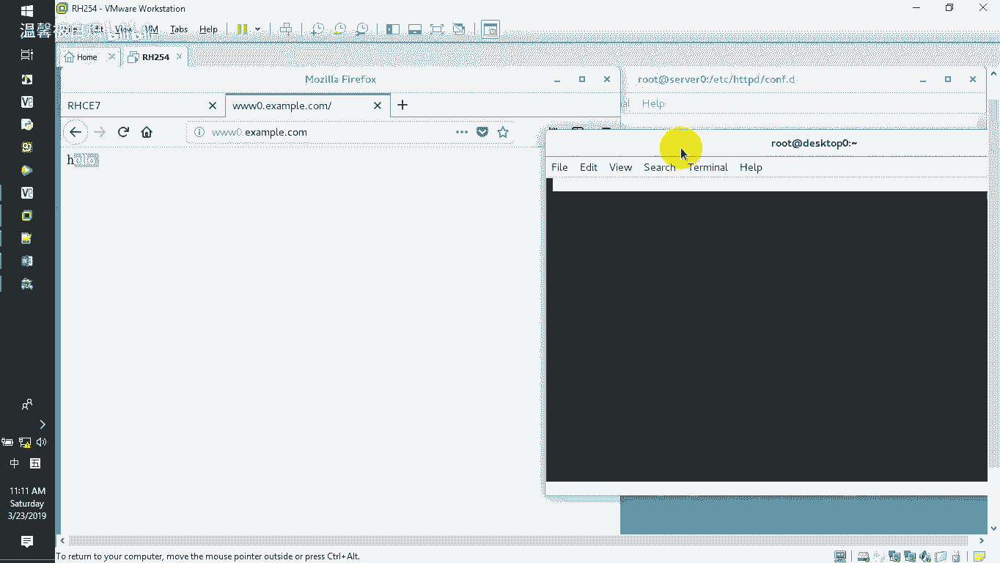
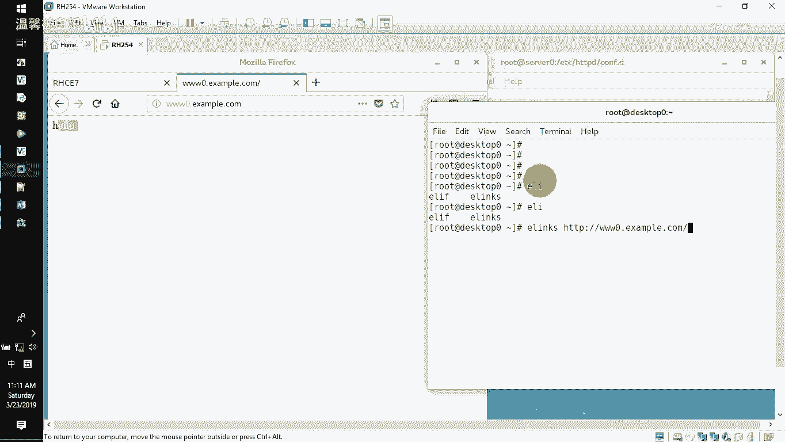
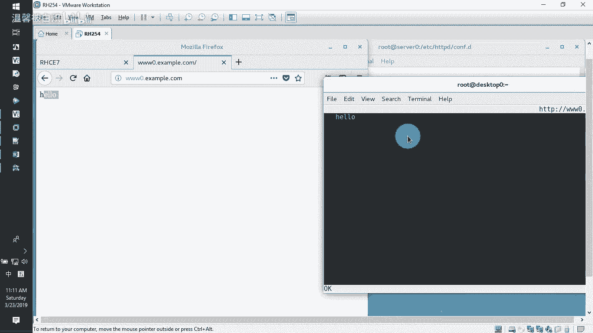
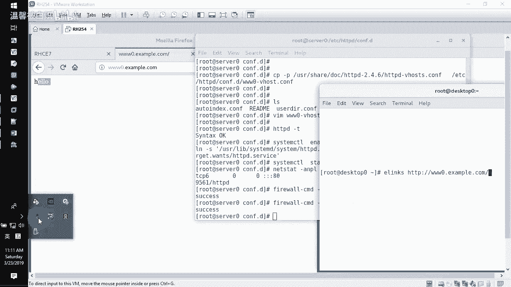

# RHCE-45678天学习视频：P8：配置www0.example.com网站

在本节课中，我们将学习如何在服务器上配置一个名为 `www0.example.com` 的Web站点。主要内容包括：安装Web服务器软件、下载并放置网站文件、配置虚拟主机，以及设置基于IP地址的访问控制。

## 安装Web服务器软件



首先，我们需要在服务器上安装Apache HTTP服务器软件包。

**操作步骤如下：**

1.  使用 `yum` 命令安装 `httpd` 软件包。
    ```bash
    yum install httpd
    ```



## 下载网站文件





安装完成后，我们需要获取网站页面文件。默认网站的根目录位于 `/var/www/html`。

**操作步骤如下：**





1.  使用 `wget` 命令从指定URL下载文件，并直接保存到网站根目录下，重命名为 `index.html`。
    ```bash
    wget -O /var/www/html/index.html http://classroom.example.com/content/
    ```

**重要提示：** 严禁通过图形化浏览器（如Firefox）访问该URL并手动“另存为”文件。这种方法会修改文件内容，不符合题目“无论如何都不要去修改这个文件”的要求。必须使用上述命令行方式下载。

## 配置虚拟主机

接下来，我们需要为 `www0.example.com` 创建独立的站点配置文件。Apache的额外配置文件通常存放在 `/etc/httpd/conf.d/` 目录下。

**操作步骤如下：**

1.  进入配置文件目录。
    ```bash
    cd /etc/httpd/conf.d/
    ```

2.  复制虚拟主机配置模板文件到当前目录，并命名为 `www0.conf`。
    ```bash
    cp -p /usr/share/doc/httpd-*/httpd-vhosts.conf www0.conf
    ```

3.  编辑 `www0.conf` 文件，保留核心配置并修改为以下内容：
    ```apache
    <VirtualHost *:80>
        ServerName www0.example.com
        DocumentRoot /var/www/html
        <Directory "/var/www/html">
            Require all granted
        </Directory>
    </VirtualHost>
    ```
    这段配置定义了：
    *   `ServerName`: 站点的主机名。
    *   `DocumentRoot`: 网站文件的根目录。
    *   `<Directory>` 块：设置对该目录的访问权限，`Require all granted` 表示允许所有访问（后续会修改）。

## 设置访问控制

上一节我们配置了基本的虚拟主机，本节中我们来看看如何实现基于IP地址的访问控制。题目要求允许 `172.25.0.0/24` 网段访问，拒绝 `172.25.1.0/24` 网段。

我们需要修改 `www0.conf` 文件中 `<Directory>` 块内的权限设置。

**操作步骤如下：**

1.  编辑 `/etc/httpd/conf.d/www0.conf` 文件。
2.  将 `<Directory>` 块中的 `Require all granted` 替换为具体的IP访问规则。
    ```apache
    <Directory "/var/www/html">
        Require ip 172.25.0.0/24
        Require not ip 172.25.1.0/24
    </Directory>
    ```
    这段配置的含义是：
    *   `Require ip 172.25.0.0/24`: 允许来自 `172.25.0.0/24` 网段的请求。
    *   `Require not ip 172.25.1.0/24`: 明确拒绝来自 `172.25.1.0/24` 网段的请求。

## 启动服务并配置防火墙

配置完成后，需要启动HTTPD服务并确保防火墙允许HTTP流量。

**操作步骤如下：**

1.  检查配置文件语法是否正确。
    ```bash
    httpd -t
    ```
    如果显示 `Syntax OK`，则说明配置无误。

2.  设置HTTPD服务开机自启并立即启动。
    ```bash
    systemctl enable --now httpd
    ```

3.  在防火墙中永久开放 `http` 服务对应的端口，并重新加载防火墙规则。
    ```bash
    firewall-cmd --permanent --add-service=http
    firewall-cmd --reload
    ```

## 测试网站访问

最后，我们可以从客户端测试网站是否配置成功。



**测试方法如下：**



1.  **使用浏览器测试：** 在客户端机器的浏览器地址栏输入 `http://www0.example.com`，应能显示 `index.html` 页面的内容（例如“Hello”）。
2.  **使用命令行测试：** 在客户端使用 `elinks` 或 `curl` 命令进行测试。
    ```bash
    elinks http://www0.example.com
    ```
    或
    ```bash
    curl http://www0.example.com
    ```
    命令应能返回网页的HTML源代码。



---



本节课中我们一起学习了如何完整配置一个Apache虚拟主机。我们完成了从安装软件、部署网页文件、编写虚拟主机配置，到设置基于IP的访问控制列表，最后启动服务并通过防火墙的全过程。关键点在于理解虚拟主机配置的结构以及 `Require` 指令在访问控制中的应用。