# RHCE-45678天学习视频 - P9：限制web内容访问 - 打羽毛球的橘猫 - BV14b411g72P

好了，准备开始。接下来要给大家配置的是一个基于文件夹限制的一个wordb内容访问。我们要求在这个web服务器上面，在它的网站加目录待这啊，我们安装的这个web服务器网站加目录就是在哇下面。

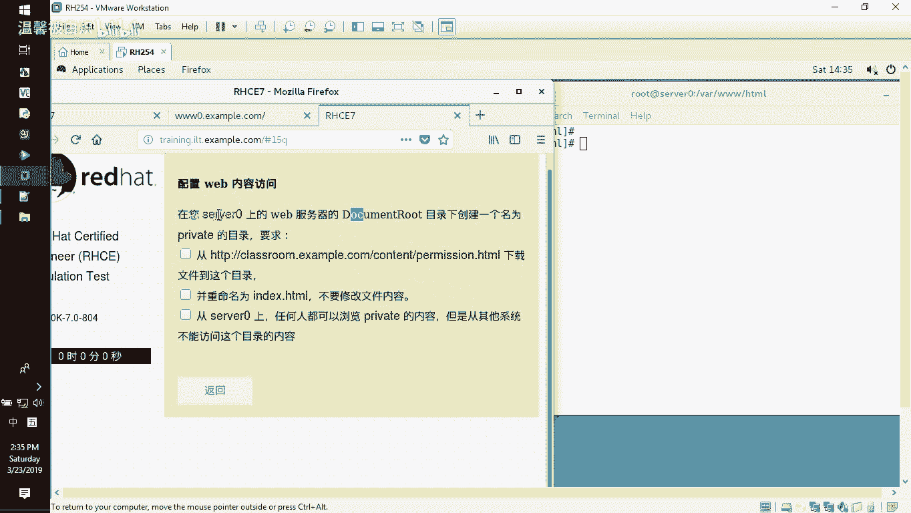

3WHML就这个地方，他要求在这个目录下面创建一个名为priate的这么一个文件夹。那我们就是要在上面private eight。

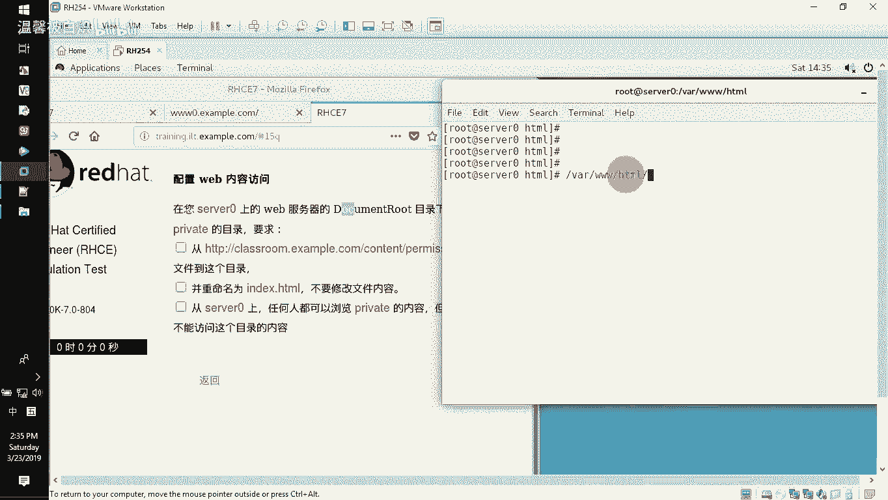

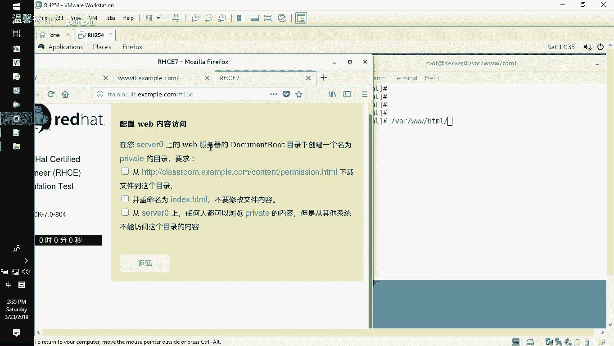

这么一个文件夹。MK。你啊创建这么一个文件夹，然后在这个文件夹里面。

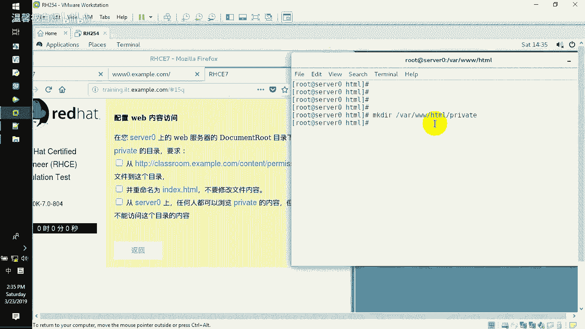

从这个地方permission这个地方下载这个页面，然后到我这边，并且改成index点HMLWget。

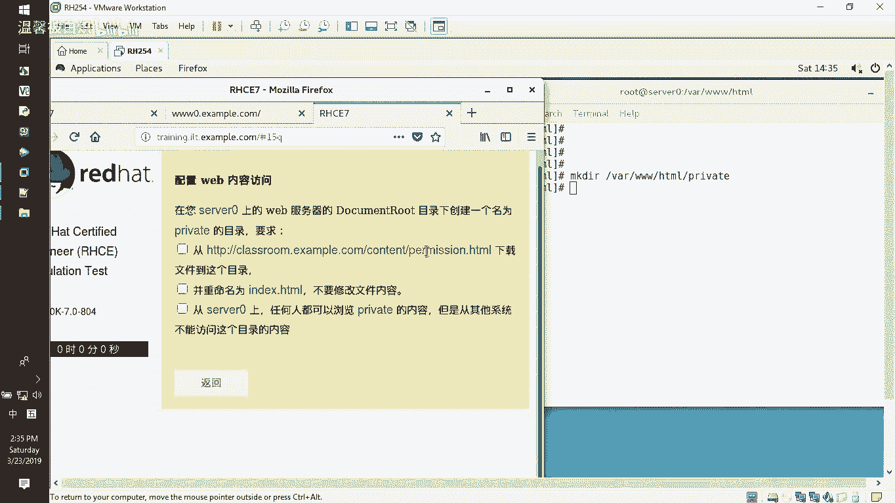

减大O指定one3WHMLpri eight indexHML，然后下载的路径是这个。

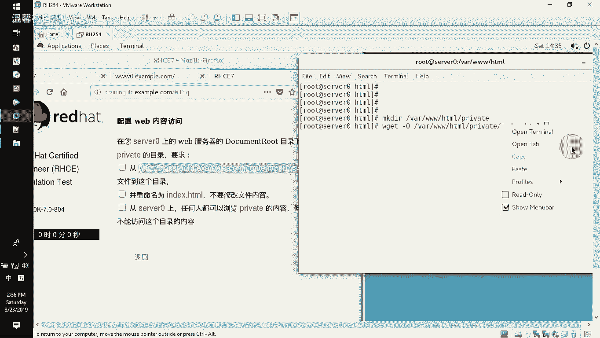

下载过来下载完了之后，在这边的要求里面。这个服务器上面任何人都可以访问我这个页面，但是在其他的系统是访问不到的那大家注意，现在我没有去做的时候，我没有去做的时候，我通过我的这个3W0，大家注意啊。

3W0去访问的时候，我去访问这个目录啊，priva eight下面inex点HTL。

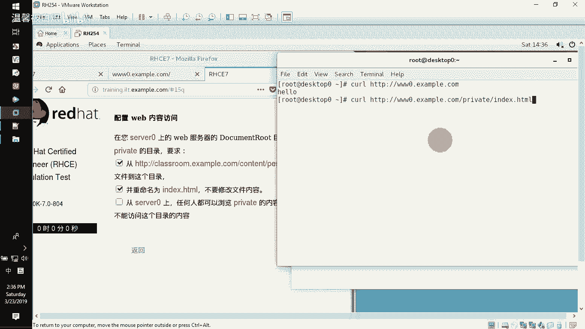

能不能访问到这个东西？也就是说我在别的系统上面也可以访问了，明白意思吧？而不符合提议的意思就是说我任何用户。😡。

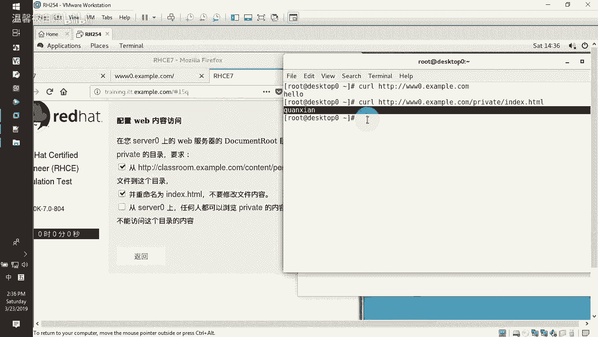

任何人。在访问的时候是本地上面从这个服务器都可以访问，但是从其他的系统都不可以访问。但我现在就是从其他系统都可以访问了，对不对？那不符合提议，那怎么办呢？要在这个服务器上面要去配置它。

让它只允许本地访问外面的别人是访不了的那怎么办呢？

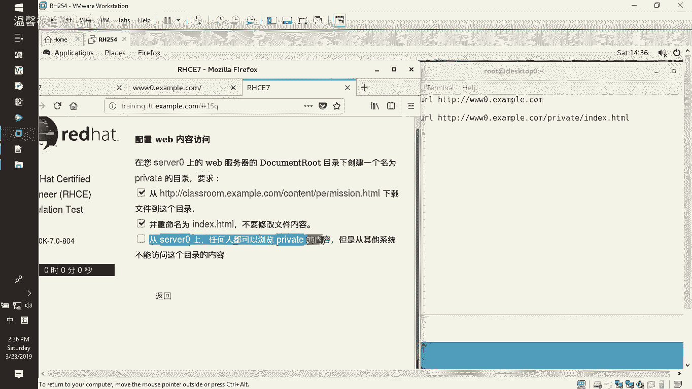

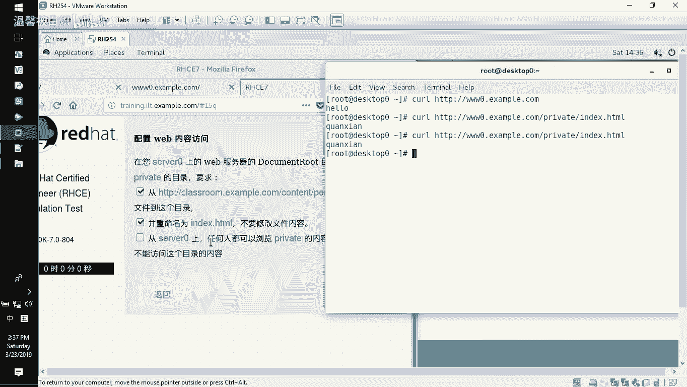

直接去配置我们的这个目录访问授权就好了。那怎么配置它的目录访问授权啊，看我这边啊。CD到配置文件路径EDCHDDPconfig点D下面。这个目录下我们直接去改这个文件就好了，别的文件咱都不需要去改啊。

改这个文件就好了。来看着啊。😡，VI3W0点V house的配置文件。在这个Vho的配置文件里面，把这几行啊，12345。6七行，那就是七行，那7YY一下啊，复制7行到这边去P一个出来，看到没？

然后针对这个目录，在这个话3WH下面作为目录来讲，它有一个目录，就这边这个目录，下面we are呃那个叫什么privaate，对吧？pri。然后对这个目录的访问授权设什么呢？设置的时候是所有人都拒绝。

😡，哎。哦，来。重新来一下啊。没写错了吧。好，那require all所有人都干嘛？😡，所有人都拒绝呃，这个迪奈的这个写法就有点不一样啊，你别真的就是呃那个。上次有个同学就底赖就这么写了。

他他不是那样写，好吧，你那你看啊DNID。😡，Deed。看到吧是这样写的啊，然后接下来的话呢，是允许谁呢？大家注意啊。原是谁呢？Requi local。看了啊，所有人都拒绝允许谁？😡，允许本地看到了吗？

好嘞来，那OK了。来看着啊保存退出，然后用HDDPD减T去验证没有问题。然后我们把这个服务，因为改个配置文件来，把服务重新启动一下啊。HDBD于 done一下。好嘞，来看着啊。

你刚刚不是说你在外面可以访问吗？对不对？再来。

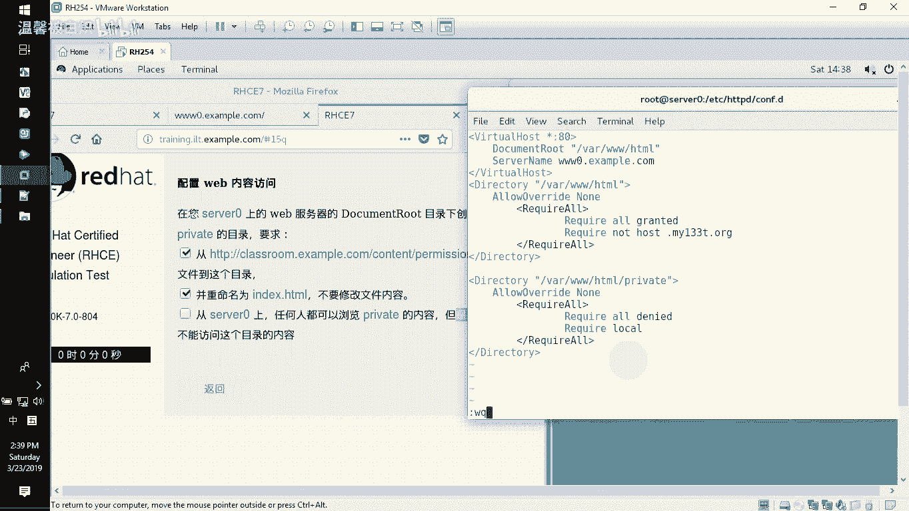

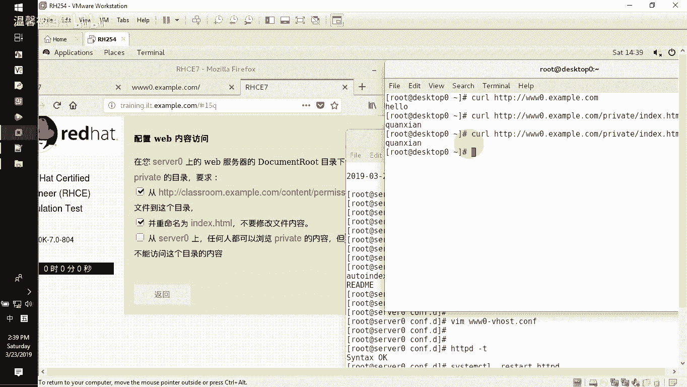

出错了。You don't have permission to access。看到吧。你没有权限访问。好了，那我们看看本地啊，我们自个自个本地CURL。😡。

然后HDB曼豪双这杠3W0下面的这个呃examp啊，点com下面有一个privaatepriva。啊。哎，等会儿。我又打错了吗？Ind HtL。怎么连我自个也防不了呢？😡，等一下等一下。

我看看是不是我写多了。you don't have permission，哎，为什么连我自个都防不了了？等一下。呃，我觉得应该是这边。看着我的配置文件啊。往下面的。3WHTL下面priva eight。

Priv8。这边没问题，那我试一下，我把这个re or把它去掉哈，就不要这个。来，我再试一下。所有人访问的时候呢，就用这个。啊。require all denied就拒绝所有。

然后再允许本地requi local，允许本地访问来再试一下。

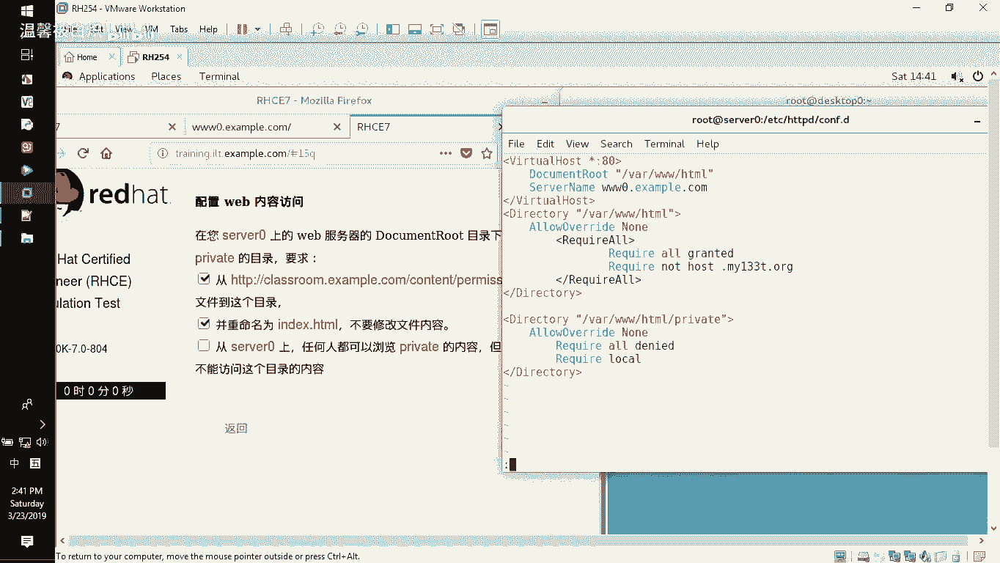

保存退出，然后我们重新去启动我们的服务啊，再看一下。访问3W0example点compri下面index and HTL哎，可以了。然后再看这边。好。

成功的you don't have permission。看到吧？那也就是说在配置的时候，大家注意到呃，虽然说我们是有一点小插曲，但大家记住，我们把这个copy下来了之后呢，记住把这个re把它。

删掉只留我们自己的那个requiry就好了。看到吗？就没有这么多好了。那成功的话呢，就是最终结果本地的这个用户呢肯定在本地可以任何地方都可以访问。在远端的话呢，不好意思，什么时候访问都是错的。

没有权利访问这个文件。