# RHCE-45678天学习视频：P9：限制Web内容访问 🔒

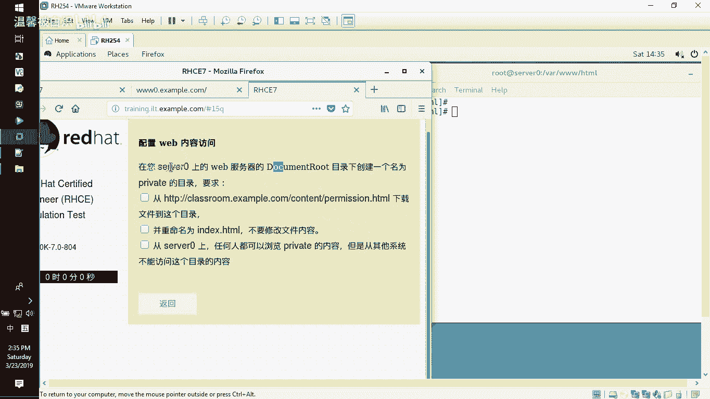

在本节课中，我们将学习如何在Apache Web服务器上，基于特定文件夹来限制内容的访问权限。具体目标是配置服务器，使得一个名为 `private` 的目录仅允许来自服务器本地的访问，而拒绝所有来自外部网络的请求。

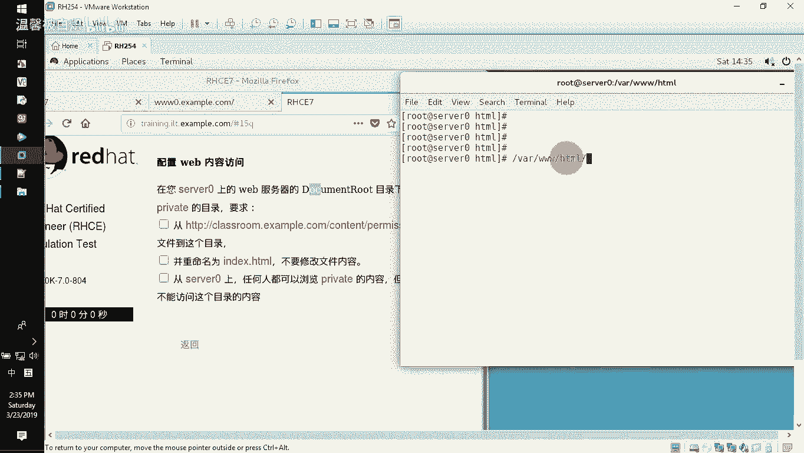

---

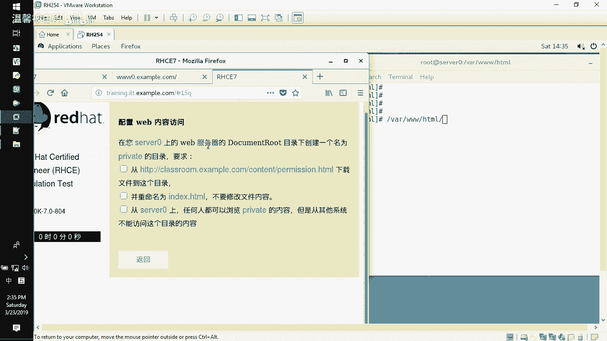

## 环境准备与目录创建

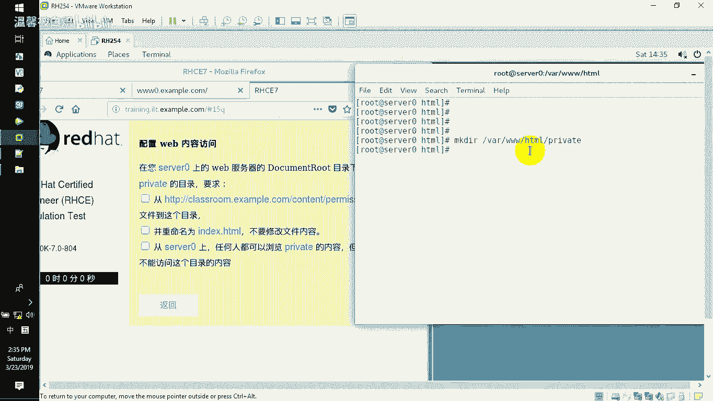

上一节我们介绍了课程目标，本节中我们来看看具体的操作步骤。首先，我们需要在Web服务器的默认网站根目录下创建一个特定的文件夹。

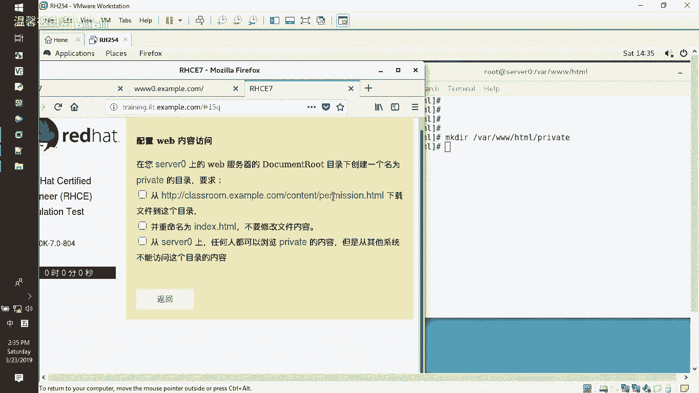

我们的Apache服务器网站根目录位于 `/var/www/html`。我们需要在此目录下创建一个名为 `private` 的文件夹。

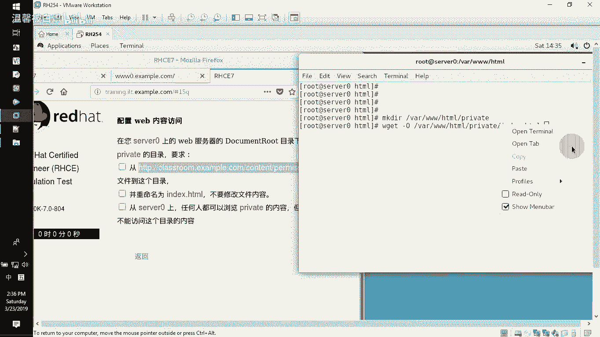

执行以下命令创建目录：
```bash
mkdir /var/www/html/private
```

## 下载测试页面

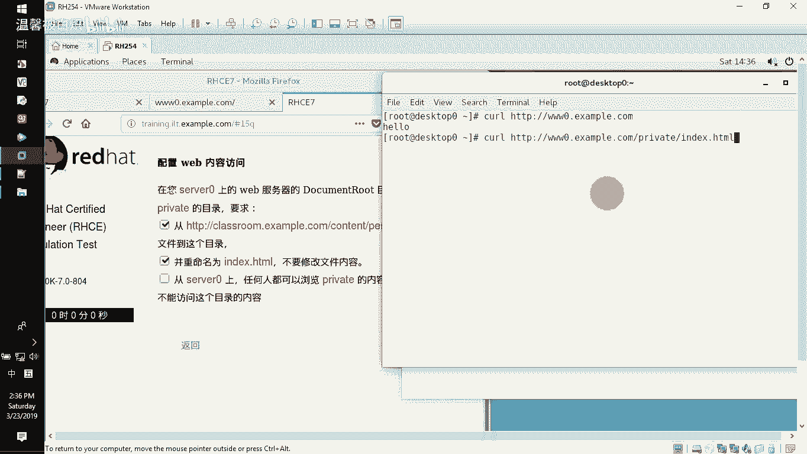

文件夹创建完成后，我们需要在其中放置一个测试页面。我们将从一个指定URL下载一个HTML页面，并将其重命名为 `index.html` 保存到 `private` 目录中。

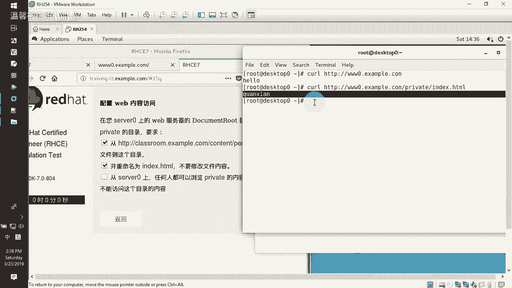

以下是下载并保存文件的命令：
```bash
wget -O /var/www/html/private/index.html [指定URL]
```
请将 `[指定URL]` 替换为实际提供的下载链接。此命令会将远程页面下载并保存为我们所需的 `index.html` 文件。

## 验证初始访问状态

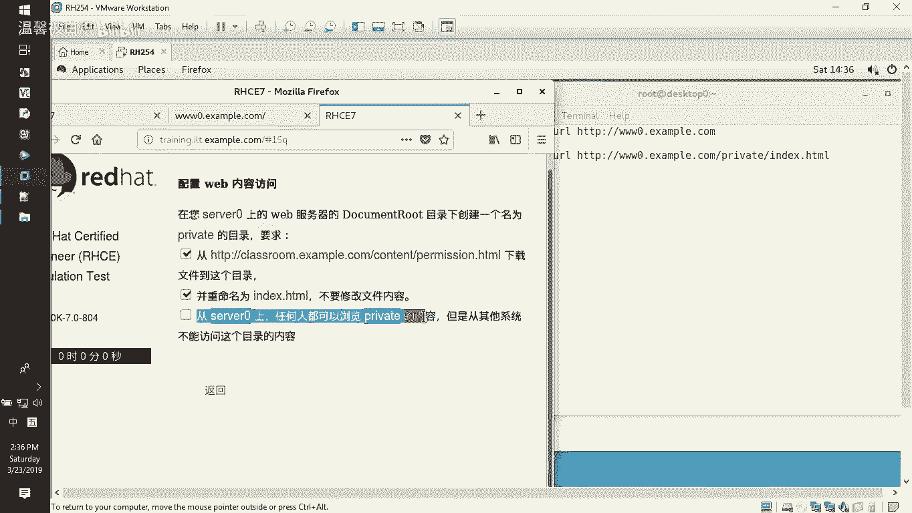

在未进行任何配置之前，任何用户（无论是本地还是远程）都可以访问这个 `private` 目录下的页面。我们可以通过浏览器或 `curl` 命令从另一台机器进行测试，以确认当前是可以公开访问的。

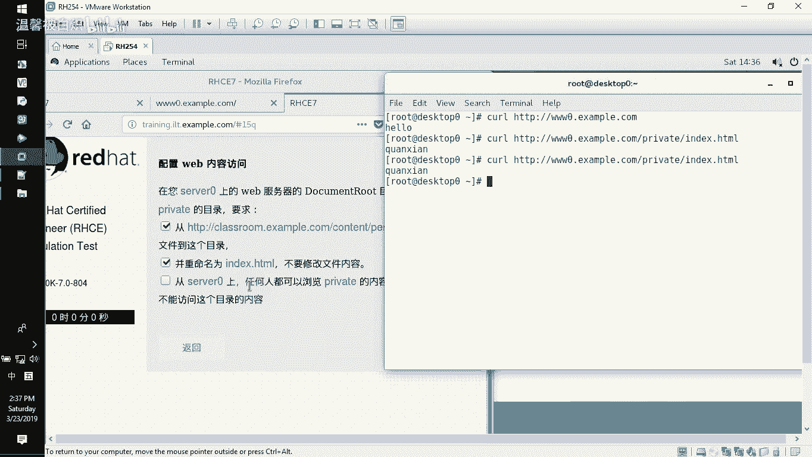

例如，从远程机器访问：
```bash
curl http://服务器IP地址/private/index.html
```
此时应能成功获取到页面内容，这不符合我们“仅限本地访问”的要求。

## 配置目录访问控制

为了限制访问，我们需要修改Apache的虚拟主机配置文件。我们将通过配置，实现“拒绝所有，仅允许本地”的访问规则。

以下是配置步骤：

1.  切换到Apache配置目录：
    ```bash
    cd /etc/httpd/conf.d/
    ```

2.  编辑默认的虚拟主机配置文件（例如 `www.conf`）：
    ```bash
    vi www.conf
    ```

3.  在配置文件中，找到对应网站根目录 `<Directory "/var/www/html">` 的配置块。我们需要为 `private` 子目录添加一个独立的 `<Directory>` 配置块。

    可以在原有配置块下方，插入以下配置：
    ```apache
    <Directory "/var/www/html/private">
        Require all denied
        Require local
    </Directory>
    ```
    **核心配置解析**：
    *   `Require all denied`：**拒绝所有访问请求**。
    *   `Require local`：**允许来自本地（服务器自身）的访问**。
    *   Apache的授权逻辑是按顺序评估，后者可以覆盖前者。因此，此配置实现了“先拒绝所有人，再允许本地用户”的效果。

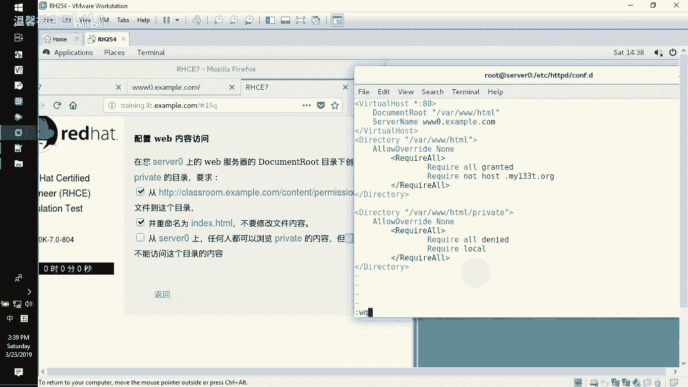

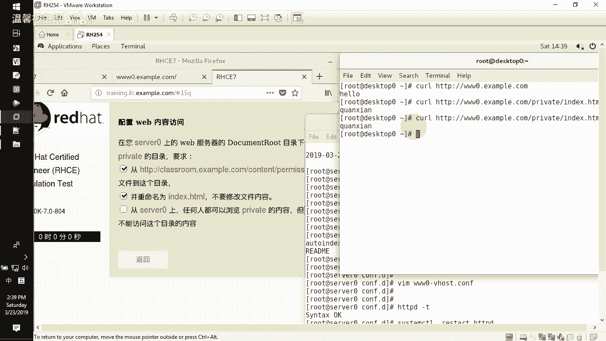

4.  保存并退出编辑器。

## 测试与验证配置

配置文件修改完成后，必须进行语法检查并重启服务使配置生效。

1.  检查配置文件语法是否正确：
    ```bash
    apachectl -t
    ```
    如果显示 `Syntax OK`，则说明配置无误。

2.  重启Apache服务以应用新配置：
    ```bash
    systemctl restart httpd
    ```

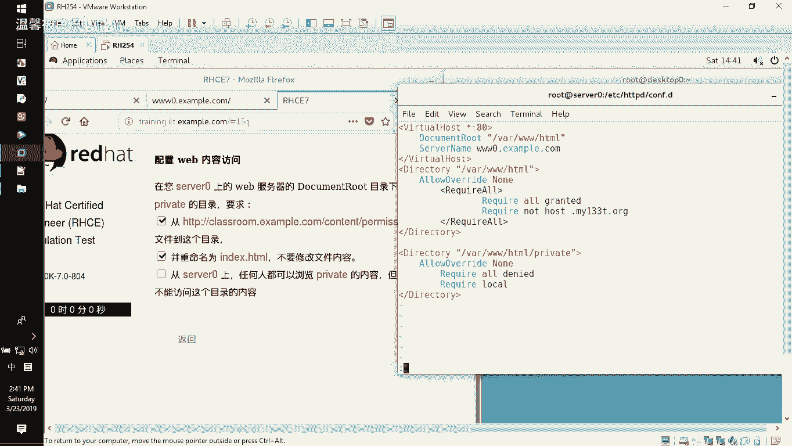

3.  进行最终访问测试：
    *   **从服务器本地测试**：
        ```bash
        curl http://localhost/private/index.html
        ```
        应能成功返回页面内容。
    *   **从外部网络的其他机器测试**：
        ```bash
        curl http://服务器IP地址/private/index.html
        ```
        此时应返回 `403 Forbidden` 错误，提示 “You don‘t have permission to access this resource.”，表示访问已被拒绝。

---

## 总结

本节课中我们一起学习了如何通过Apache的目录级访问控制来限制Web内容。关键操作包括：创建目标目录、放置测试文件、以及通过修改配置文件，使用 `Require all denied` 和 `Require local` 指令实现“仅允许本地访问”的权限设置。掌握此技能对于Web服务器安全管理和满足特定访问策略需求至关重要。