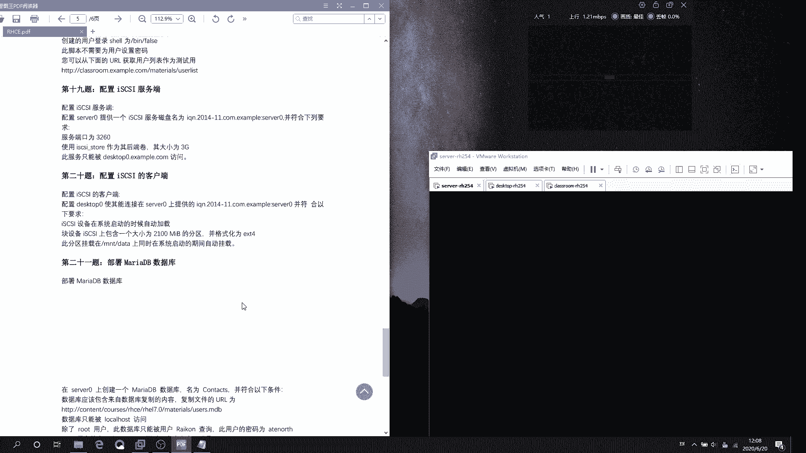
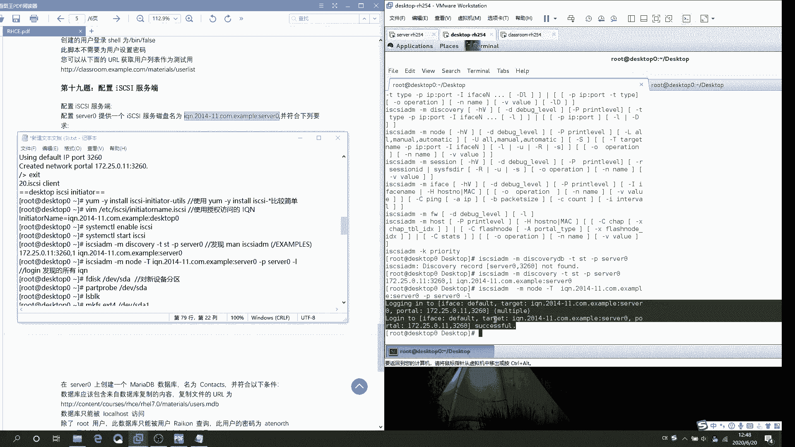

# RHCE-iscsi服务器加客户端全套配置 - P1：20200620-12070038 - 牛魔王同学 - BV1dA411v7M4

あ。

嗯。好吗？

这玩意好碍睡。我吃。听一下。O可以。是的。Yes。哦，你。大规模证得。单位。嗯。Okay。在等一下。P。这里下。P。PV。ちゃ。SDB。Yes。A几C月。哦。一。第一。不能这样。Want题地小的。SD。

北计S。嗯，我们。MVC港大。3。高温。嗯。Oh。对不起。然后。故工方垫。然后。刚回。GET。所以。对个。嗯。哦哦好。这边说的。嗯。然后。Yes。ST，M。121。何い。C。Okay。让我改觉他。R。

然我后我。TC嗯。I是。你呢度。所以。2已。跟一效。这巴应该不亲提是。能推吗？好像是脱了。So这内。哦，没起名字。这终我不能推呢。😔，应该是没。干黄线。STO521。没事。说在推。在CD。That。

你2。在有。嗯。你定懂。1月份。😔，反责有效。Okay。客户端手定义。か。O品。在水定。嗯做个映测。等一下。谁听懂。梦想。嗯。T。然后。这个是做。哦IP。172。25。0点。11。

上个视频这边做的是错的。上个视频这边我写的客户端的IP啊，这边应该是。本机IP。然后允许端口是3260。会错。CD看一下。嗯。先先脑登录一下。嗯，试一下。哇，这有点小啊。加流通。嗯，该有的应该都有了。

一个。一个2个、3个4个。5个好，全都全年了。全都创建以后。Okay sorry。问题。退出来。嗯嗯。晚上有住个上。提供服务。然后呢就。喂2音。大不会。更。C以好。这样的。刚杠G点。拼面。12。ADD。

He。苹果IT。32。60。看好。Ting。😔，然后删掉。嗯呀。知动错。这个应该没毛。让客户端就是一个客户端，昨天就没出客户端。

客户端。呃，播方怎么。先中重。嗯。更坏。Yes yes。啊。看中国梦。卡住了吗？还有个鼠标呢？好像是卡住了。装了个包也能看到主，然后这个可厅上。

mm。

听。

为什么这客户端就这么卡？服务器还好点。

这里我也是。172。20。0。没有。走饭。嗯。就不用找。没。Yeah。Okay。嗯，C上。Take take。要能装了，估计还有点费劲。又到12分钟。看出了。错不错，这是挺快的。好。说完了。

张明啊好像是拜封。C领导你提升一下。我想干嘛S发现这个目录。I。没有。这是哦就是这个。查看这个目录下。把这边给改了。就是说改成服务地的名字，还是改成客户端的名字？啊，改了客户端的名字。个户端的。11S。

嗯。TOP。然后。WQ保审退出。然后呢。重启服务吗。SY STMC点M。No。EBLE。是啊是。😔，2一。T。这一条语句是发现。发向盘。AndC S。ADM。刚航。干嘛你空我。这个当然是要存的你吗？

DNSCO。V。所 only没。12Y。哦。还是不。ST空格杠低。现在可以定了吗？SXRVER。0。没有发现。哎呀我去。这是个什么情况？上面地方开了服务，开了端口。端口也开了，然后呢。服务启动。

Yeah。嗯。嗯楼梯。张据。AER。刚。没有。没有这个IQ。找不到我的AQN是个什么。5器这边是多能。我是允许这个。Yeah嗯。是的是的。嗯。CN3。没有。天好天。No。死。没有没有的问题出在哪里呢？

找不到牌。

你还是这个配置文件有问题吗？我靠，不会是因为这个空格吧。我的老天。我是因为这个功能。所以。又配置的做么西又配置。刚刚那个。再看一下。前面没有空格，后面没有空格。或者是我这个名字。

是写的不一样。你要这些TOP。

我看到了。😔，DESATT。对呀。难到这边要写服务器名字。我装的是不是这个？なで吧。嗯。😊，哦，我已装了，所以说是。121。啊你。Com on。嗯。哦，是的。是是你的帮我能改成服务器是试啊。卡住了。

啊咋机不显示啊，刚才。没下。再看一下。😔，想试试。还是早点。他让我。输入这个语句看一下。H currency系杠杠还。所我们是女剧。没也可能吧。Yes， yes。点N8嗯。杠杠。这边可能退。是道。

你去年。杠M。后面给你编辑一些参数。我这个是杠。我前面是啥？杠M这个嗯杠T。刚配。更T。就在他这一块。刚。关语句。杠TST。杠PIP和接口。感谢我你。The term。杠屁是IP和接口，它怎么能写上这？

我试一下小AP片的接口。嗯，有害扣文件还好，到时候考试的时候。直接查票我嗯，不错。你看怎么操就行了。我就先写上面这句刚嗯。嗯。嗯。个DNS。嗯。12。我要加要不要加到D密啊？嗯加了吗？更替。

ST是不要说我谁做？刚。嗯。IP和地址。72的2不掉。0。我现在这。房号地址3210。嗯。就自己的IP吗。Yun。没有。这是哪出？食午没吃饭，没能量了。重做一遍。

第一步装包。第m配置。然后他就会显示这个。完了以后我再重启，是我重启到的吗？是我重洗澡了吗？

重启完了以。我是不是改了配置文件以后没重启？不知道。然后查。那个。然后跟唐生一。然后。对新设备分区。然后刷新。哦。格式化。创建挂的点。哦，就是。1OKID获取UID1OKID这个东西还得记住。有用的。

嗯。嗯。这个。然我把UUID给写进去。挂在联系去。挂在窗是陷进去。然后。嗯刚刚也刷一下，然后DF插一下。就完事了。再试一下LOD。这问题。嗯就放听。

宣片。行。17222。点0。2。中。京通，然后亚么。嗯。い年？刚关。NCSI听一下，然后装。放看放一段时间。等会儿等会儿等会。并不会是因为我没说话没。没国充能量。

我看看我的直播间吗。陕继续。打游戏。

你咱俩我都发了这么多时。该把这个内容。V人规人。归总到一个。我不想咋回事。把我的信新。嗯。我觉。😔，我这是什么？我先。😔，我的直播间。

我先。我的直播间。冇清。我的直播间。主播积分每抽到100块钱啊。我这是什么东西。祖播几分也收到100块钱啊。我的空。祖。我的。播放声。那就这样吧。我的。

嗯。继续。VIM杠杠。让，ETC下载IS。C个SA下的。哎月份。准确。关掉这玩意，太好麻烦。复质粘贴。我只想听那个。餐厅。啊看是否有空格有空格删掉。这个我就们要写的是。DE S， S， K T。

 O P。然后花成。然后。再重启服务，但是还是。3天。TMCT2。嗯。喂。嗯行。So。我在让里。开机字体它是自动开机字体哦。嗯。那么重启是。I think。没搞诉老师到底对不厉。20S。没吗。

行这个都都来一遍。然后。IC SI。And。嗯刚。然后听。用来帮助文档，然后ISSCSA。更无。DISCOVE。12弯。你们。DNSCOE。你明。这好。倒替。And stick。嗯。可。IP是啥？

然P是12。还想。嗯我。SPR。嗯。哎，是找不到这是什么情况？这个原因我讲我明写进个。开。哎呀。空桥DB嗯。然后看第二条语句是什么？嗯嗯。没有了。然后杠T。看道题。大题大T在这里。这是他一整条语句。嗯。

target改的内容杠批址IP。嗯，我杠A还有个我这边我杠M吗？我这边有个杠L。好了，没就这么写。嗯CI。嗯嗯。好。杠M5嗯。没有。嗯。刚刚铁。然后。专贴。这3年服务。条的先去。杠T杠5。O。嗯，这吧。

放屁。SERVER。0。嗯，刚才。从物。这是成功的迷糊。我那条鱼这一条鱼这边是一条鱼，然后它爆个肉。哦，这个单词应该是成功了。但是也看一下他是啥意思。

复制。嗯一。当天。登录。嗯。おし。那个。成功以后。

然后。嗯BL。可以。嗯是不样。嗯。我明都。怎么说还是很好。说起来真的不是啊。我是不是应该先得先在那个那个之前弄一下？然后P。ART。一。装一下。2SB嗯。原错。第一没拿到是吧。看着像这个。

你说这玩意儿我好容易从屋里走开公室呢。哎。我应该先。先LSB我可以先看一下。新的这个应该是。S sorry。再做一遍再。然后后面是什么？后面是分区。他这上面写的是A，但是我这边也不知道到底是不是A。嗯。

有可能是SDVE模式感觉。原河的SDE。你看他刷了一下SDA我们。然后给SD1。一直了。创建挂彩点或者有用ID，然后直接给到。Yeah。这就完事儿了。

嗯，再来一遍。好，再来一遍。饿死了。然后45指。啊。这两天。闹的我也是没法自己吃饭。买了一箱八宝粥。可能我就是8。9个。Yeah。拿上这。然后什间。好的。我。Yeah。本来我应该是17号好。哦那个。

RH3E的。结果就那两天疫情就爆发。搞的我考诗人的考存。我也听好，其实1期或那容应该。我学的还是很好的。想要什么A。仓法。嗯。哎。HTTP3吧NMSS都没怎么配置过。现在工索还是能此为配置。还得练。

我们之下连们之间连这个大棒都根都看不哇。Okay。在。看着是在家休息。实际上就跟住监狱一样。相当的艰苦。

今天也就是我睡了个懒觉。在考试，因考试那两天。嗯。还是娃哈哈做好喝。在您考试那两天，每天6点起来。一直学到中午，然后中午吃个饭睡一个小时，然后再起来学。学到。晚上8点左右。吃个饭歇一小会儿再学到11点。

那意死ねよね。不对。嗯，没事，这个无说。然后我再看一个。那他就现在就没冲走。2B。嗯，可。哦，你看。这不是S定于E嗯。S。1。刚才装上去了，可能是。SDC。嗯。还是得擦这个，要不然都不知道哪个是道。

Oh。嗯。VM，你可出一下的。ISCSI像的。对。嗯嗯。把这个给删掉。大把上给粘进来。参家全部。第一。嗯。SK。T温品。一个单词都不能错。保存退出。重启服务。S ST。做个测试TMCTM。ED。嗯，你。

PSSCN3。我感觉就是这个ISCSS这个就并没有应对的对应到那个S那个服务，你知道吧？试一下。这样重启一下，我看是S刚还是S杠CD。像HTTP的嘛，他那个服务是HTTPD。试一下睡一下。

看看他这什么情况。这边如果不成功的话，那就是S8D。刚才我做的唯一最不一样的一点就是那个。写了个S杠CD。冲击了一下S2CD的服务。那就是接号层有问题呀。算了吧，教什么不是第一个题。杠杠H取一然后P这。

嗯。NCSI。宣长。你个。然后我刚。混格DIS。COV。12。港T。刚听。MT。国杠。P。SERVER。0。然后。然后就这样。哦，找得到样找哎，找得到那我上次是是因为什么原因错的。

第一次是因为什么原因做的。嗯。No弄的。然后。嗯。杠大T空格。这边应该是那个这边是服务器还是客服端？服务器。S1。2V1。2。0。空格。装屁。哪去了哪去了。干屁完了这。真对。往上面。放屁。SE20E2。

嗯。然后杠P网什么？杠L吗？记得好多在干嘛，我没人看不见。对。成功，然后然后S。也O。CSDBSDC样。没楚。这边还没挂载的时候软而是。SDA和SDB。做完以后有了SDC。哎，我真是笨哦。

那会儿是那会儿选择的就是LVS的时候，就是3G嘛。直接看个3G不就完事了吗。你都无极限了，我都。嗯，然后。挂在。啊，不对。分区。D呀。他这个要求分一个。2002100兆的那个指盘。See。错。新。

2100兆它是怎么出准确划分的呢？就这么直接应对啊。好的吧。品。然后不知。回车回车，然后。加2100。我们。那个。😔，你你说。嗯嗯。对，就这样，然后W出来。我嗯。嗯，可以FS。是吧是这个。点EXT。是。

对吧还得先查一下。呃SBRK。S Dc。呃MKFS。点儿。EXT4空格。根小的第一V小的。嗯是。对。谁。一。嗯，是对。Yeah可。嗯你自是对的。然控挂载。M问题。对对对。MK12先创建挂载点。

挂载点在哪里？没有指定指定了。嗯。DATTA。然后。BL什么。你他是什么？1KID宫格杠DV项的SDC。一。这是他的。然后。给到。ETC下载。ETC下的。FSD。B。TABTAB。走。嗯，然后。进去。

VM空格杠。In项的F。然后就一在线家里。哎。把引号删掉。挂海脸。Go。MT下的。下回去。PAPA。回车。现在这个。😔，虽然它变绿了，但是还是最好还是删掉。第一。F E U L T S。

因为不熟悉那种企业法或。我不是很熟悉那种情况。然后就这么着，应该就可以挂彩烧了。如果没有问题的话，应该是没有问题。并没有小过东西。嗯，按T。OUNT空格杠。杠A。哎，可以的。然后DF杠H取。

就在在这儿看。是他是他是他就是他。收钱怎么看那个什么挂点挂点形声。怎么看到ST4。行了，就这样了吧。对。

用点烦，我要歇会儿。

