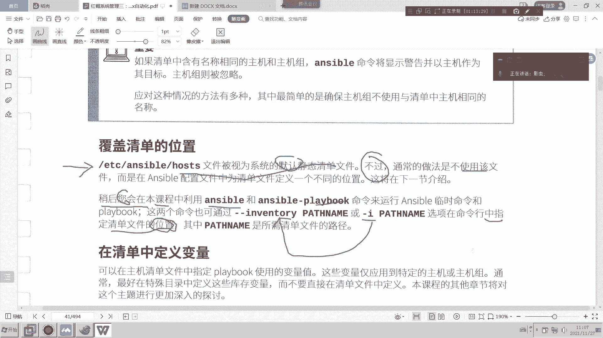
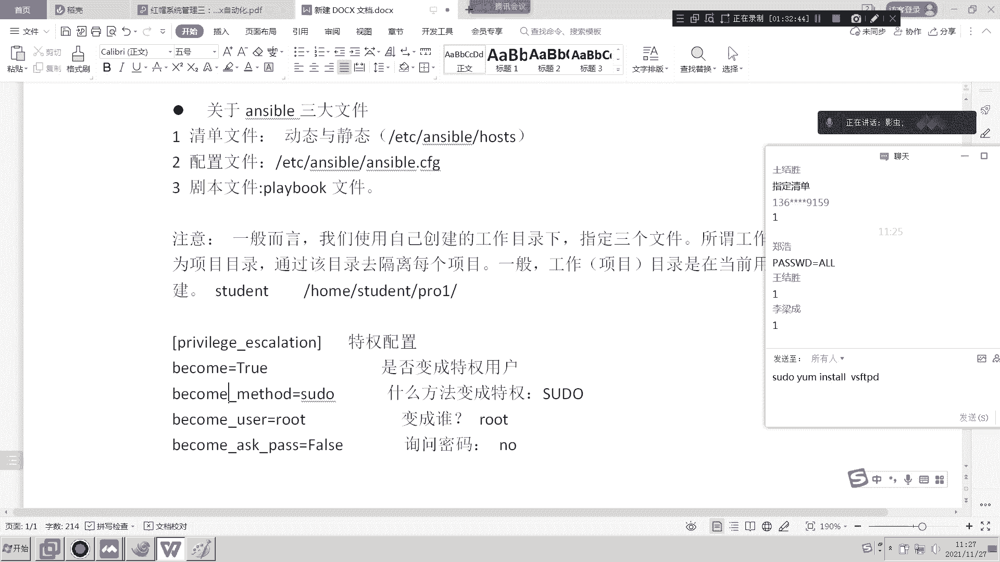
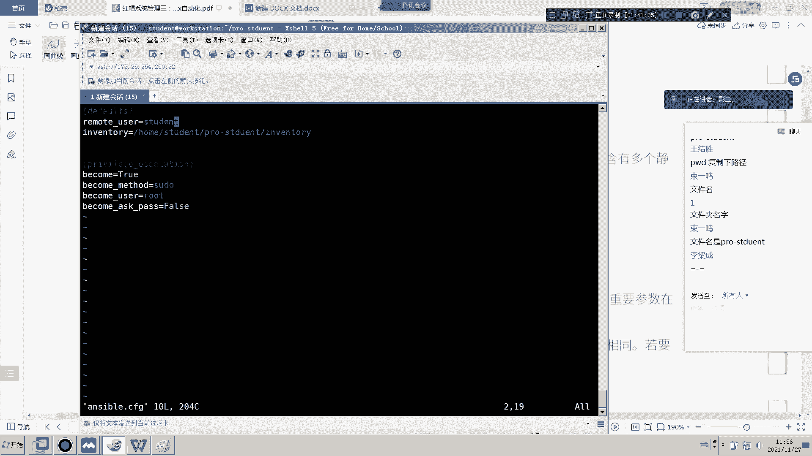
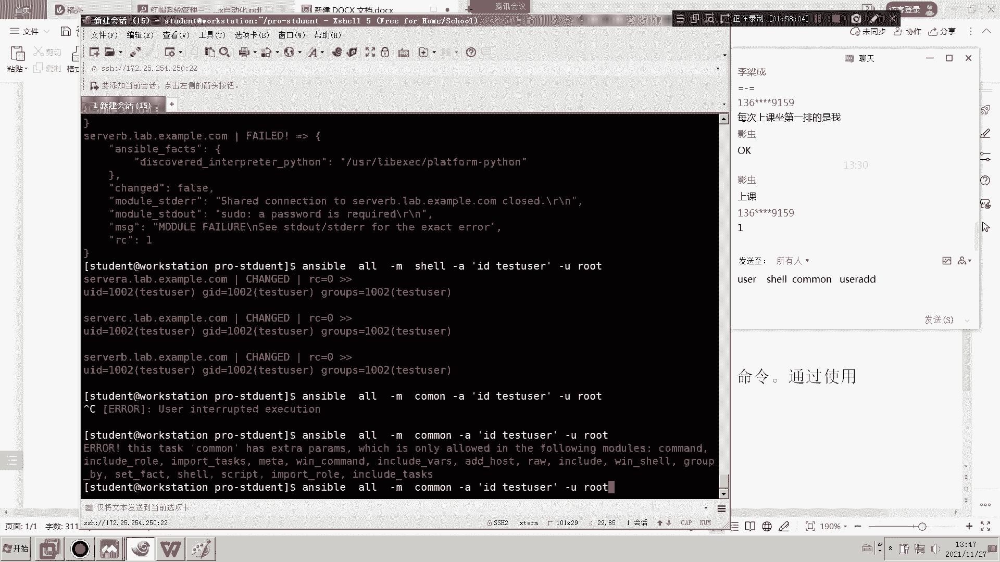
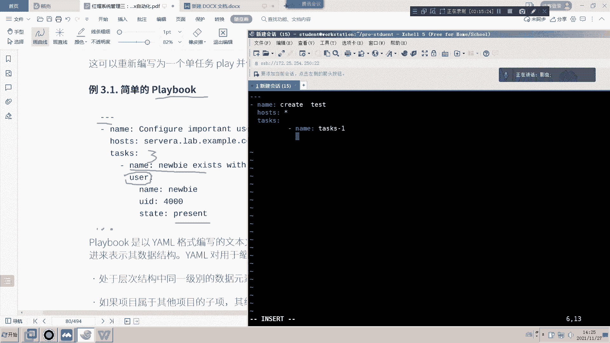
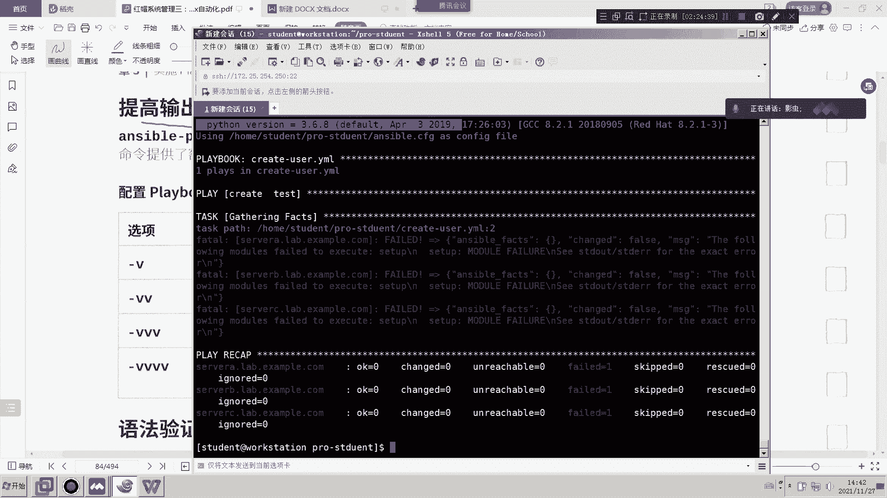
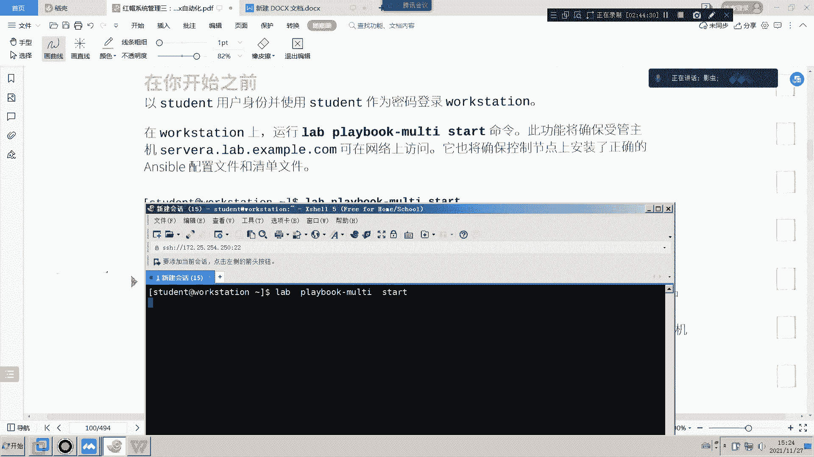
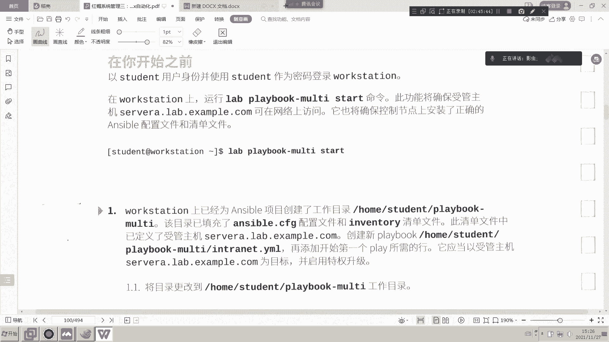
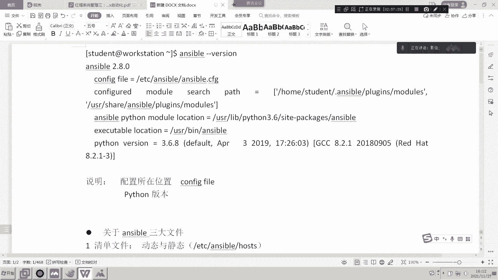

# RHCE8-Ansible 第一天免费观看 - P1：RHCE-ansible 第一天 - 滕sir教你Linux - BV1xY411s7zc

好，今天是我们的IHCE8。2的第一堂课，第一天课程。那么RHCE部分呢，我们主要讲的是自动化的一个编配。那么在这一门课程当中，你会明显感觉到有点点吃力啊，就是从CSA一下变成CE。

你会非常明显的感觉到有一些吃力。所以说今天第一天的这个自动化enssible，大家一定要好好听。虽然我们在线上来去跟大家来讲这门课。Anible为什么比较学学起来，为什么会感觉有点吃力？

原因就在于第一天的第一章和第二章内容。也就是说，如果你把前两章内容学的很好的话，其实后面的课我们都可以不学了。你拿本书你自学就可以了啊，那么关键为什么前两章重要呢。

因为前两章是对于an伯的一个理论的一个讲解和你对anible的一些理解。如果你对an伯的前两章理解有错误，你后面你肯定也学不会，你自学你也是学不会的啊，因为我特别有深有体会。在17年18年的时候。

我们刚有安思博的时候，我我我那时候就没有学的很明白啊，我记得很清楚。当时我们去考试的时候，我也没考过。因为呃我当时就是稀里糊涂去考，就根本不知道。这个安sible是怎么写的，以及它的原理是什么东西。

我一点都不知道，所以就发生了很多的错误啊。那么我们这次课呢，我们会把第一章和第二章讲的慢一点，我们不着急啊，一定要把前两章讲的慢一些，一定要让大家每个同学把前两章搞懂啊，好吧，那就是ible。

那么。一开始我们怎么讲呢？一开始我们来先来介绍这次的环境介绍。那么我们一定要先把环境介绍一下啊，咱们之前的CSA是可以不用环境的啊，但是CE必须用环境，这个是跑不了的。

所以我因此呢先把环境给大家先介绍一下。嗯。看一下环境啊，环境是在前沿部分。简介。好，那么第三本书linlinux的自动化这门课的代码叫I294。

它适用于需要实现调配配置应用部署和编配自动化的一管理员和开发人员。那么说句话就是说呃这句话就是说我们需要学习一些自动编配的。语言来去实现多主机或者是这种复杂的重复性的这种工作啊。

简化了我们这种复杂重复性的工作啊，那么你乍着听呢，有点类似于我们的讲过的是要脚本，对吧？那么试要脚本本身的含义也是为了实现自动化，然后让我们的管理人员呢能够呃把时间花在更有用的地方。

但是咱们这一次讲的并不是是要脚本。咱们是讲的安思伯的自动化啊，它也是让你去编编写代码啊，所以它的这个感觉跟是要特别像啊，特别像。那么这次我们的培训对象呢，就是就是这一堆啊，咱们就不用不不带着大家来念了。

那么入学条件呢是你必须要有RGCS的基础啊，EX200就是RGCS的考试的代码。那咱们现在未来在考CE的时候呢，就是EX300啊，就是每个考试它有自己的代码。好，我们重点来了环境介绍。

大家有没有发现这张图片跟我们以前的两本书是几乎雷同。但是请注意同学们，你会发现你多了这样两台机器。C和D那么咱们以前CSC呢是serv a serverB还有一个就是那个叫utity，对吧？

utity是为了学习那个postportman容器那一张的一个一个一个工具，对吧？那个它是相当于我们的仓库，对吧？就是镜像的仓库。但是在我们的ensip当中呢。

我们就会要有ABCD那么这ABCD代表什么呢？代表的是我们来看一下它的中文解释，代表的是你要被ensipible管理的4台电脑啊，什么是ible就是种自动化，对吧？

那么我们在公司当中我们去通过使用ensip去干嘛，就管理一堆服务器管理一堆这些工作站。那么我们这些虚拟机ABCD就假设是我们要工作当中所管理的一批主机或者一批工作站啊，那么未来我们在参加考试的同学。

请注意了，咱们有ABCDE总有5台机器啊，但它不是ABC，它是node一n2otenote4note5啊。用no来表示，这啊这个大家请注意啊，或者用hosse来表示，这个我记不住了，反正是5台机器啊。

所以我们到时候考试的虚拟机更多啊，那么我们这一次上课环境为什么要用环境呢？呃，因为我没有环境的话，我们要自己搭建这么多虚拟机，挺麻烦的。所以我们借助红帽给我们的这个。环境这是第一个原因。

第二个原因我们要做实验。做课后习题啊，那我们的课后习题必须要用这个环境来做。因为你不是这个环境的话，你的课后习题是做不了的。所以请大家同学们一定要把这个环境打开。

也就说我们从今天开始一直到最后的考前辅导都要借助这个环境啊，那么怎么打开呢，需要使用使用那个我们以前学的命令，就把所有虚拟都打开。那么咱们以前可能只打开了A或者B那么现呢我要把所有虚拟都打开，为什么呢？

大家来看一下，在这整个环境当中classroom我们不用介绍了，它是整个大的环境当中的总服务器，比如说你的CP了，你的语言啦你的dNS啦，它通过都是通过classroom来去做解析，对吧？

那么这个baston什么意思呢？我们发现中文叫跳板机或者堡垒机，但是这在在我们这个环境当中呢，它其实起到一个ro的一个作用是个路由器的作用。大家你可以明显看到它是不是连接两个不同的网段，对吧？

以你也要把它打开那么这台机器在我们考前辅导还有一个作用，就我们把它当做考试当中的第五个节点。听清楚了，同学们，我给你们做了一个实验环境。这个实验环境当中我是为了模拟考试环境。

而且我给大家做了这个实验环境，跟考试环境可以说是100%1样。只不过到时候IRP地址不一样，只不过我们的主机名不一样啊，就跟我们考试环境一模一样。除了主机名P地址不一样，明白吗？那么我们考试的时候。

我刚才讲过，总共有5台机器。那么我们怎么样表示第五台呢？我们大家到时候我们就借助这个八层这个机器来当做第五台机器。听懂听懂了吗？好，那么我们在整个CSA的教学过程当中。

我们几乎就没有用到这个带有图形化界面的一个机器，叫做work station。但是在我们的anible这门课当中，我们从第一章的第一个实验就要用到work station。理解我意思吧？好。

那他充当什么样的一个角色呢？刚才我们说过，ensible的目的是为了让我们去管理更多的主机或者更多的服务器或者是工工作站。那么你就要有管理端和被管理端。

所以说这个server A serverD这些4台机器充当被管理单啊，而我们的worktation充当管理端。这个大家能听懂吗？也就是我们通过worktation去调用ABCD啊，所以我们所有的实验。

所有的操作都是在worktation当中去做。理解我的意思啊，而不是在ABCD身上去做。好，这就是我们这次本课本节课的一个实验环境的一个介绍。那么我们说老师这个环境怎么切呢？哎。

我们现在带着大家来把环境切一下。嗯。

同样同学们，你们必须要跑到foundition里当去切。当然你不一定是管理员啊，你是你是那个KROSK用户也行，无所谓啊。好，那我怎么切呢？首先大家来看一下当前什么环境。各位，你看我当前已经切好了啊。

通过这个命令可以看到你当前是什么环境，我是三第三本书，你们应该是第二本书，对吧？应该有因为我们上上一次上课就上到了第二本书就结束了。那么假设我现在也不是第三本书，我要切换成第三本书怎么办呢？好。

首先第一条命令是清空所有。注意同学们，这个命令只能在foundition零当中去敲，因为你要在foundition物理机去调用或者去控制这些所有虚拟机。好，回事。

那么这来这句话意思是指把所有的虚拟机都关掉。甭管你现在是什么环境啊，如果你是二环境，相当于把所有的环境都给清空。好，那大家再来看一下我这个电脑。啊，对吧，那么我哎，清空了吗？再清控一下。

我们一开始零号机啊。好，他现在正在。remove对吧？remove好，接着我们再来打一下这个命令，set I294。第三本书的代码是294。如果你想切换成第一本书，就是124。好，那么这需要一定的过程。

因为它需要安装。所以为什么很多同学说老师你这个环境怎么怎么60多个G这么大？那是因为我们要把三本书的环境都做在这一台讯拟机当中，它当然大了，明白吗？同学们。

所以说你要有一点耐心慢慢的去去去让它慢慢的装就可以了。好，那么假设我们现在装完了，我们再用那个star or命令，把所有虚拟机都打开，我们就可以正式上课了。听得懂不懂啊。好。

那么这边的环境的同学有有什么疑问吗？有疑问吗？咱们按照老的规矩啊，如果有疑问就就说没有疑问，咱们就按个一就过去了啊。那么这本教材大家有吗？同学们，这个PP甭管是PDF还是纸质的，大家有吗？第三本书。嗯。

有就行啊，有些无所谓，只是的那个等会儿我们下课的时候给大家发吧，或者中午吃饭的时候给大家发。发了个电子版的行吧，好了，同学们，我现在这个实验环境已经ok了。那么这个时候呢我要把所有虚拟都打开啊。

同样教大家怎么打开，还是老办法，先打开classroom，你永远记住，同学们，你每次切换任何环境的之前，比如说你从294切换成124可以吗？可以，那么切完之后一定要先打开classroom。

为什么我最后说一遍，因为class room是每一个环境当中的总服务器。因为如果他只要不打开，你剩下的都打不了。😊，开也没有用，好吧，那么怎么算开呢？拼一下。你看我现在开了就拼一下，拼通了才算开成功。

所以不要以为你star就成功了，不要这么认为一定要拼什么时候能聘成功，什么时候才算我们真的启动成功了。嗯，我再拼一下。那么这个环境呢需要大家要求起码8个G以上的内存，不然的话你会很卡很卡。

你看我现在还没起起来，看到吗？哎，现在才算起来。好了，当我class重起来之后，你确定一下，我们来看一下朋友们用这条命令来去确认。😊，果然已经running了，对吧？但其实我告诉大家。

你刚才打star的时候，刚才你打完star的时候，你会发现它也是running，但是你千万不要信，因为你一定要拼啊，直到拼通值后才能代表真正的running好，那这时候怎么办呢？

这时候打一个最咱们以前传统的命令啊，把所有虚拟机都打开。也就是serv a server Bton workstationserv c server d所有虚拟机全部打开。所以你会发现你电脑会很卡。

如果你的内存比较低的话，好吧，嗯。好了，那么他跟这开着，咱们呢把这些命令呢从头到尾给大家总结一下啊。

嗯。啊，我现在电脑其实有点卡了。

呃，我们总结一下命令啊，其实也没什么要总结的。你你们回去看录屏啊，就第一个命令呢是clear是吧？啊，就是你第第一个命令是clear，然后呢就是那个RT。总篇来说RT哎这个机器算了我不写了。

我的笔记有点卡，因为它现在正在开虚拟机，所以有点卡。

我就不写嗯。你看他是现在正在下载所有虚拟机的环境。

呃，我为了开这个虚拟机，我给了他16个G的内存。你看是不是有点卡？好，那我们开始上课，他跟着开始着，咱们从第一章开始讲起。包括每台机器RB地址都已经给你写好了啊，所以大家一定要去看书啊。

你们之前两本书可能你都没看。那么这本书如果你想过，必须看书。为什么？因为我要求大家每一章的课后习题，你都必须给我做，必须做啊必须做，这个没什么要商量的了。因为咱们没有其他的实验能做。

只能用书上的实验来给大家讲了。好吧好。环境都设置好了吧。好，那这样的我们从今天的章一开始讲起。讲什么呢？那很显然是介绍了啊，因为对于我们来讲，很多同学是从来没有接触过An也没听过。

所以我们要从第一章开始讲起。我们看一下第一章的主要内容。第一章是描述一下anipible它的基本概念和使用办法。当然了，你要装一下anible。啊，装一下ensible。

然后描述一下ensipible的基础架构，以及控制节点上安装ensipible，并描述社区ensipible和红帽ensible引擎之间的区别。当然了，这个描述呢我们就不作为深入讨讨论了。

如果大家有兴趣的话，可以去百度一下啊，去看一下社区的和红帽他们之间的区别。那最后呢我们来做一个小实验，就安装ensible啊。这张非常非常简单啊。好，我们来看一下什么是ensipible。嗯。

那么ible的目的呢是他说了这么多，其实一句话就是最后一句话，自动化可以帮助管理员避免手动手工的去操作或者手工的去制作这个环境的时候产生的各种问题，同时呢也可以避免什么呢？也也可以提高我们的工作效率。

对吧？避免重复性的工作，这就是ipible的主要的功能啊，就三个字自动化，对吧？自动化，那么大家有没有发现一个现象。如果你以前对红猫rCE了解的话，你会发现在以前版本7版本的CE的时候。

就去年CE前年吧CE7版本的时候，我们考的是各种各样的服务器的搭建，比如说我会教大家怎么去搭建这个web啊，怎么搭建数据库啊，怎么搭建存储啊。

怎么去搭建我们的这个比如说网卡绑定啊这种各种各样的包括FTP啊DCP啊这种各种各样的服务，对吧？那么为什么从8版本当中。我们的教材一下子不讲，一下子选择安ible呢。

并不是说8版本当中不不能够搭建什么阿帕奇了，或者是FTP服务器，他肯定能搭建。那么为什么不讲呢？因为红帽是这样认为的，红茂红帽给我们的一个理由是。这种的工作已经太过于简化了。

你比如说你现在在企业当中去搭建一个阿帕奇，呃，有没有时效性，有肯定有，这个还不会过时。但是红帽认为呢，咱们以后会管理的机器数量会非常庞大啊。而且数量也很多也很复杂。

所以如果你还是那种手工的去一台一台去部署环境，一台一台去部署服务的话，他觉得这种技术就已经比较老了。说难听一点，就是你就算你没有学过CE，你只要学过CSA，我给你一个手册，你照着那个手册敲。

你也能把阿帕奇或者你把某某某服务给它搭起起来。哎，所以红帽呢他认为这种这种技术已经太老了，对吧？所以他觉得呢自动化是一个趋势，因此他把自动化变成了CE的一个主要的学习。这样的一个科目啊，懂了吧？

这是它的一个意思啊。好，嗯，那么anible当中呢有一个比较好玩好玩的事情，就是anible的这个语言啊都是这种。相比而言比较简单的啊，就是人类可独立语言。所以就算你没有学过unsiible。

我们今天给大家看一个unsible的一个代码，一个简单的代码，你大概其实也能看懂是什么意思。你大概也能是看懂什么意思，所以它比较简简单啊，还有这个什么减少人为错误呢，就是我刚才讲的。

它可以让我们避免重复性的工作啊，这我们就不带大家再来念了啊。好，那安ible注意是一款开源的工具。那么只不过呢同学们要知道它虽然是开源的，但是它被红帽收购了。啊。

所以才会有红帽版本的ensible和社区版本的ensible这样的一个区分。那么咱们本次上课呢很显然是红帽的ensipible，而且我们上课的版本呢是2。9版本。2。9版本。啊。

那么像我们去年考的那个是2。8版本，但是对我们来讲，2。9和2。8是没有区别的啊。那么2。9和2。8呢可能只是区别在有些模块化的一些更新。但整体的命令是对我们来讲还是差不多，没有什么变化的。

那么我是从2。3版本学习的。但是你会发现2。3版本跟我们今天讲的2。8和2。9，那区别就会有一定的区别了啊，就有些命令就确实不一样了啊。那么我考的比较早是17年18年还是17年我忘了，反正那个时间段嘛。

所以呢。嗯。这个这个就是就是比较老了，所以有些命令咱们就不能用了啊啊就不能用了。好，anible是一款自动化的平台，它是一种简单的自动化语言。它能够在playbook中完美的描述应用架构。

OK这边出现一个重要的术语，playbook。那么其实同学们要知道，咱们学来学去学的就是如何编写playbook。playbook如果翻译成中文的话，叫剧本。啊，就是人家拍电影那个剧本。

但是呢咱们就没有必要把它翻译了，你就把它叫做playbook。好吧。那么说白了playbook是什么呢？就是类似于咱们学HC当中的脚本啊，你要把你各种各样需要做的事情。

以结构化逻辑化的形式写到一个playbook当中。当你去运行这个playbook的时候就会按照里面的逻辑结构运行里面的所有语句，我这么讲下来是不是大家得跟一样对吧？跟我们脚本其实就是概念的东西差不多。

都是为了实现自动化啊，那么有几大这个特性。第一个简单明了。我刚才讲过playbook个剧本啊，它是一个人类可读的自动化的一个语言。那它说白了它非常简单，就是相比较我们真正的编程技术，它非常简单。

所以你看才来说不需要特别的编码技能。比如你不需要学会C语言。你也不需要学java不需要学那个C加加，我们都可以能够。不看懂enssible啊，好吧，你只要有一点点linux技术。

你都很快就可以学ansible。好吧，第二，功能强大啊，这这确实啊那么如果功能不强大的话，我就没有必要学了，对吧？那么请注意同学们，它功能强大在在哪呢？你看。

它可以什么配置管理啊、工作流程、自动化和网络自动化，这些都可以理解为是它的功能强大。那么其实呢还有一个问题就是ensible，它可以管理物理机，可以管理虚拟机，可以管理云平台，同时还可以管理网络设备。

同学们，这一点可能大家没有想到，比如我们安ipible不光可以管理服务器设备，你也可以管理网络设备。什么叫网络设备、交换机、路由器这些都可以被anipible管理。啊，理解了吧。

这就是安示管的比较强大的地方。好，那么除了简单明了，功能强大之外，这些这这两个我认为都是一些。冠冕堂皇的话，就是就些官话对吧？就是任何这个自动化工具，它一定都是简单明了，一定都是功能强大。

那么我们比较能够体现出ensible既比其他的这个自动化语言好的地方就是最后一句话，无需代理。那么其实自动化这个工具啊，咱们不光ensipible一种，其实还有很多。

那么为什么ensipible在这其中当中呢会比较嗯成为佼佼者呢？因为我认为最重要的就是这个无需代理。什么叫无需代理？很简单，各位看啊，就像我们刚才那张图片。

我一个人一个worktation管理了serv aserv bserv c server d这4台机器。那么我管理的时候只需要在我这个管理端安装ible就可以了。但是你你们是我被管理的机器。

你们是什么都不用装的。咱们俩只要能够拼通就可以了。所以说在你们身上是不需要装任何的插件和代理。什么叫插件，什么是代理。假设我现在给大家上课用的是腾讯会议。那我这我的电脑当中。

我的windows当中就必须装腾讯会议，这个软件，这个插件，不然的话我就没有办法用腾讯会议。那么这个腾讯会议这个soft word就是一个代理。这个大家能听懂吗？那我现在要给大家上课。

我现在给一个人上课，那一个人要装，我现在给100个人上课，那100个同学都要装，对吧？那么对于anerible来讲的话，我去管理100台服务器，只需要我装就可以了。

那剩下那100台被管理端是不需要装anerible的，这叫无需代理。听的懂不懂啊，而且还有一个问题就是。只要能够拼通，那你说老师我拼不通行不行？那当然不行，对吧？

我们必须是能够通过网络来去衔接在一块才行，对吧？连接在一块啊，所以ansible只要有网络就可以了啊，这个大家也懂。而且有了网络之后呢，大家可以看到它是通过SSH这个什么这个这个协议啊来去连接的。

也就说我把我要做的事情推送给你的时候，是通过网络当中的SSH协议推送给你的这个大家听懂了吗？那么最后呢给大家总结了一堆的anerible的一个优点，其中第一个优点你还。看一下就知道了，必须知道。

第一个跨平台omible不光可以管理linkux，也可以管理windows，也可以管理unux，也可以管理网络设备啊，也可以管理云啊、虚拟机啊、容器啊啊，就比如说我们的docker啊。

都是可以被ible所管理的啊，这一点确实比较厉害。第二个什么叫人类可读语言。我们刚才说了好几遍，所有人类可读语言，就是这个鸭某格式YAML。所以朋友们请注意。

待会儿我们在学习ible的playbook的时候，我们所有的playbook的后缀名都必须是YML或者是YML。听得懂不懂？就是我可以不要那个A，但是一定要就是挖ML结尾的文件，那它才叫压某格式。

鸭某格式啊好，那后面呢我们就不带大家来读了啊。那么这个这个这个这些都是一些常见的，包括你还可以跟其他的这些系统这个继承绑定和集生啊，比如说我们那个puppet啊这些东西，卫星服务器等等等等。

这些都是可以绑定和集合的啊。好，这是anible的一些简介啊，我们大概简简单的说一下嗯。啊，这边呢是ible的一个d语言啊，注意同学们，你以后会经常看到这个英文，这个英文翻译成中文叫d。

但注意这个英文是一个最新的一个英文。也就说其实在英文字典当中，这个是没有这个字的啊，相当于就跟我们现在很多中国人比较喜欢说的些网络术语一样。那这两个英文单词其实是两个字母拼写成的啊。

第一个是DEV很显然是开发的意思啊，就这个单词的缩写开发。而后面呢这个OPS就options啊，说白了就是开发与运维开发与运维啊么为什么现在这个特别流行的啊，你你大家应该听说过吧。

现在嗯其实我建议大家学完CE的时候可以去呃学一下这个d这个这个最新的这些方向，这些语言这些技术，般确实比较这个这个呃深，而且呢也确实在我们现在现有的这种RT环境当中。比较流行啊。

说白了就是我们以前开发人员是开发人员啊，测试人员是测试人员，运维人员是运维人员懂了吧？就是你干你的活，我干了我的活。那这时候就会出现问题啊。比如说你开发人员写好了代码，你那边运行的好好的。

然后你发给我运维人员，我一运营，我一运行就发生各种各样的错误，然后去找你，你还说没有错啊，我不承认啊，对不对？所以为了打破他们之间的这种矛盾和打破之间他们这种这种这种这种关系。

我们就是把我们的技术干嘛呢？就是开发型运维，所谓开发型运维，就是我们的开发和运维和测试是融为一体的，而不再是你干你的活，我干我的活。那么当然了，dbo只是一种概念，注意dbo不是某一个技术，它是个概念。

但是我们很有可我们有很多很多的技术来实现dbo。比如说我们现天学的ible。听得懂不懂啊，当然了，我们还有什么docker，就是我们的podman容器，包括我们的K8S啊，包括我们的什么。

包括我们的这些这些这些集中集成工具啊，包括open shift等等等等，都是实现我们这些dops的关键性的技术啊，懂了吧？这个大家去百度或了解一下就可以了。好了，那么重点在这儿anible的架构啊。

其实非常简单，一个是控制节点，一个是被控节点。就这么简单，那么我们安什么需要在哪装呢？需要在。控制节点，而被控节点当中什么都不用装，因为它是无需插件的，对不对？好，而且同学们看这句话。这个你。

我要跟大家说清楚，这个anipible cover它确实是红帽的。因为ansipible被红帽收购了，对吧？收购之后呢，ansible自己编了一个ansipible tower的工具。

这个是带有图形化界面的anible。但是不是我们今天这次课的主要内容啊，如果你有兴趣学的话，那就得学我们的RHC课程当中。RHC课程当中。今年我们把t列到我们CA当中的一门课了啊，好吧好。

这是ansible tower。说白了我们现有两个端，一端呢是控制端，第二端呢是被控端，被控端才是真正要做事情的。而我们受控节点呢是我们管理员操作的。

那么在操受控端当中的操作的东西会传递到这个啊在控制端操作的东西，会传递到被控端当中去实现去实现啊。好，那接着呢我们来看一下一个图片啊，我们通过了图片来把上面的英文给大家说一下。因为上面的啊不是英文。

上面的这个中文这一篇内容很多，我不带着大家一个一个来读。我们通过这个图片来给大家展示它上面在说什么。好，首先朋友们anibleible其实ansible是个什么？

注意unsible就是我们外我们红线标出来的，它只是一个引擎。它并不是一个具体的东西，它只是一个引擎。那么我们学anible其实学的是什么呢？学的是这些东西，我用回圆圈给大家画的叫模块。好。

同学们听清楚，anible本身只是个引擎。但是我们真正要学的是ensipible当中里面各种各样的模块。那么很多同学就不明白什么是模块来，我们往上翻。

所谓的模块就是各种各样的小任务或者是一串代码或者是工具，你把它理解为代码理解为工具理解为任务都行。懂了吧？ipible会有成千上百个模块。那么为什么说我们会有2。3版本，2。4版本，什么2。8版本，2。

9版本其实就是更新模块，懂了吧？把一些模块更新了，那么我的版本也就更新了。那么你像以前老的一些模块，因为它大家可能会觉得这些这些模块已经太老了，没有意义了。

所以我把一些老的模块给它取消或者是打变成不可用，那么有些新的模块把它加进去，因此我的ensipible的版本也会随随之更新。好，那么你学安伯其实就是学各种各样的模块。甭管你是在书店买各种各样的安伯的书。

还是咱们像CE的课程，asim的模块就是各种各样的工具。啊，各种各样的工具听懂我的意思吗？好，那么继续在使用中在使用中模块通常要确定啊读一下这句话，模块通常确保计算机的某一特定方面处于特定的状态。

这句话非常非常重要。但是很多同学看这个书的时候，一定不会注意到这句话。我来说一句话，我来说一下这这这这这句总体要表达的意思就是假设我现在正在管理100台电脑或100台服务器。

我需要在这100台服务器当中去做什么事呢？装一个服务叫做FTP那么一旦我装成功之后，那么这100台是电脑当中就会有FTP，所以它叫做处在一种特定的状态。在我这个案例当中处在什么状态呢？

处在了我这100台电脑当中都装有FTP这个状态。好，都是这个状态。好，那么接下来我问大家一个问题啊，你看你能回答吧？同学们，假设我现在有一个playbook，就是剧本要装FTP。啊，这个服务。

那么并且呢这100台身上都已经成功装好了。那么如果我再运行一遍这个剧本，请问这100台电脑当中还会不会再装FTP？同们想一下。不会为什么。为什么为什么不会？😡，那我问这样我问大家一个问题，这样说。

我不说安思保，我不说安思保。我现在我们今天讲的是是要脚本。拜世脚本。这脚本什么内容呢？脚本是这个内容，说建立一个用户叫tm。好，我在100台机器当中运行了这个脚本。

那么这100台电脑当中肯定会建立tom这个用户。那么当我再运行一下这个脚本的时候，这个脚本会不会再运行一遍？那我再执行一下这个小本，这个脚本会不会再运行一遍，会不会？

大家想过想一想这个脚本会不会在你会吧？对，那为什么你说安什ible就不会呢？😡，对不对？但是我问大家，如果是要脚本会的话，它会再次装一下用户叫tom吗？他会不会再建一个用户，又叫tom，不会吧，为什么？

因为他发现你电脑当中已经叫tom了，但是请注意。anible的 playbook我们跟我们要脚本有个最大的区别，就是我们的要脚本每一次都会重新运行，只不过你的目标主机当中已经有tom用户了。

它会说这个用户已经存在。但对于ible不是ible会每一次呃会运行完之后，他就发现你的机器当中已经装FTP了，或者已经装了tom用户，当它再次运行的时候，你经达到了什么呢？注意同学们注意点在这儿了。

已经达到了某一个特定的状态了。因此，playbook不会再重新的部署任何东西了。你看如果系统不处于指定状态，任务继续运行。如果系统已经处于一种状态了，则不认不则干嘛不执行任何操作。那么这句话叫做什么呢？

这句话叫做密等性。好，可能同学们从来没有听说过这个单词密等，什么叫密等？通俗点讲就是不会在。一台主机当中多次运行同样的东西。听得懂不懂？因为他已经发现你的目标主机已经有tom用户了。由于有了密等性之后。

它就不会再建行再建立tm用户了。懂了吗？所以你注意同学们，我们的anipible有一个好处就是有密等性。当你的机器已经处于它希望的一种状态之后，他发现这个状态已经在这个地方了。

我就不会再运行重复的动作了，听懂了吗？但是我们的试要脚本有没有密等性，没有试要脚本是没有密等性的。它每一次运行试效脚本，你运行一遍，它每一次都以为自己是第一次运行？听懂了吗？

所以请注意shall跟ensipible最大的区别就是没有密等性。下次人家如果问你这个问题，或者有考官问你，那你你 shell要和anipible有什么区别啊？那，你告诉他sha要没有密等性。

每一次运行都是全新的，而anipible是有密等性，第一次运行是新的，但是再次运行我会发现我的机器处于一种我希望的状态了，它就不会运行了。听得懂不懂？哎，要明白啊要明白。好，最后是样是无需代理的。

因此呢我们需要通过SSH这个干嘛进行连接到受管主机，或者是winRM这个winRM如果我没记错的话，应该是连接windows的机器啊。好，同学们来看一下。

那么假设我现在把这个anipible的模块应好用好了，那应用在哪呢？其实ans模块就应用在这个里面叫做剧本里面。说白了，ansible里面写的就是各种各样的模块。

只不过呢我们以逻辑的形式给它写成剧本形式发送给谁呢？注意看发送给被管理的服务器，也可以发送给被管理的网络设备，看到吗？所以说ansible不光可以管理网络，也可以管理服务器，也可以管理云主机。

也可以管理虚拟化，也可以管理容器。听得懂不懂听得懂不懂？好，最后大家看有一个非常重要的关键字，这个字这个英文你必须给我会拼啊，从今天开始必须会拼这个单词叫什么呢？叫清单。或者叫清单列表。啊。

清单imventry啊 inventoryventry叫清单。那什么叫清单呢？哎，我刚才讲过，我作为一个管理员啊，我要管理咱们咱我要管理咱们公司的100台服务器或100台设备。那么这100台设备。

他凭什么听我的？因为你要把这100台设备写到清单文件里面。所以请注意写带清单文件的，就要被管理，没有写在清单文件的，我就不能管理，听懂了吗？就像我们现在加入到咱们今天腾讯会议的人。

才能听到我今天给大家讲课，没有加入到咱们会议的人，就听不到我今天的讲课一个道理。一个道理。好，那么清单文件待会会重点讲，所以你要理解它就行了，明白吧？好，那这就是我们现天要讲的安C胞的一个组织架构。好。

这边有。没有问题的，打个一。嗯。anip伯简单吗？简单各位安伯很简单，但是安伯为什么又学的难呢？因为很多同学写不会写playlybook。啊，它的逻辑架构非常非常简单非常非常简单，就是一个清单文件。

一个playbook没了啊。😊，啊，pling什么意思呢？你可以把它理解为插件。那么假设啊我们现在有一些呃你比如我我我现在会编程啊，比如我会编程playpling翻程说我们叫插件啊，插件。

你可以自己编一些其他的插件来去。嗯，怎么说绑定到我们的as当中进行一些特殊的功能去使用啊，但咱们不是不是咱们不是搞那个开发人员的话，咱们就认用人家写好的这些模块就可以了。嗯，插件啊插件。

插件你可以把它理解为具体实现功能。插件就是为了实现某一个功能的，叫插件。你看呃如果你以后学过这种这种比如说云云方面的东西，比如说举个例子，比如说你学opent啊，那你会发现有好多好多这种可以用的插件啊。

pling插件啊，那大家看不光有插件，是不是还有API啊接口，都都是给我们开放一些接口，可以让我们的开发人员通过接口去干嘛调用，或者是通过接口来去进行编程，啊，因为现在很多产品都是可编程的嘛。

那你可编程的话，你要提供接口啊，对吧？你给我一个接口，我可以通过各种各样语言编程来去调用你的这这种这这些里面的内部功能啊，对吧？所以。所以API就是接口啊。好，那么我们这次呢我们不是搞开发的对吧？

我们也不会写API啊，我们也不用写插件。我们主要学的就是sible里面自带的各种各样的模块模块啊，这就是我们这这本书要讲的东西。好，这些都不讲了啊。

这些都是一些呃可以自己读的这些中文就不带着大家来读了啊嗯。好，那么大家有没有听过这个单词？我问一下，听过的同学给我扣个一。这个单词。大家也没有听过？是这样，同学们，咱们既然是搞这个系统的。

咱们一定要多听一些最新的技术的一些关键字。其实CRCD是这近些年也不是今年啊是近两三年比较流行的一些这个技术概念，注意还是概念啊概念，这个发译成中文叫持续开发持续集成。

但你也可以理解为叫持续部署持续继成，是干嘛的呢？说白了就是让我们进行流程化流程化，缩小软件的开发周期和上线周期同时能够保证我们的业务是通畅流畅的啊，不会有这个这个这个这个怎么讲。

不会有这种时间上的这种这种停顿，我举个例子，大家有没有发现，就这些年你有没有发现你的手机APP或者你电脑上面用的软件是不是随时更新。比如比如说微信说哎突然有一个小的功能呢，让你更新一下，对吧？

然后明天又有一个小功能。让你更新一下，但是你每次更新的时候，并没有重新卸载微信，也没有让你等一两天吧。没有吧。都是好像比如说今天有个功能和立刻推送你，你直接点一下更新。ok可能一分钟不要一分钟都不要。

就立刻就有了新的功能了，对吧？它就可以保证你整个业务的这样的一个什么正常上线。那么同样如果我是个软件软件公司，我不希望我的软件很久才发布吧。那不然的话，我的客户肯定要等了很久啊，他也他交付的时间越久。

我我们肯定体验的感觉也不好。那么怎样去能够体这个保证这种持续开发持续部署呢？哎，这就是我们这些年比较流行的自动化的平台。啊，同样CIRCD和今天我们刚才讲的个dbox，他都有其实类似的功能。

都是为了让我们干嘛？工作流程简化，并且多团队协调，看到吗？什么叫多团队开发测试运维，原来是三个工作单位，现在把它变成一个工作单位啊，你要你你你开发也要参与部署，你部署也要开参与测试。

你测试也要参与整个的流程啊，这就叫自动化啊。但是注意同学们CICDdbox只是我们的。这个技术的这个这个这个术语，但真正实现的技术有很多。比如说我们的anerible可以实现吗？可以啊。

为什么anible可以实现？因为anible当中可以写各种各样的代码。我只要是比如说我假假设我现在有一个。软件需要更新。那我需要把这些软件更新的事情写到一个playbook当中。

通过运行playbook就可以干嘛，就可以在整个的软件的生命周期得到正确的部署。懂了吗？比如说你看你那边从1。0，比如说一用度软件叫APP1，那现在变成APP2了。那我只要把这个小的更新。

小版本的更新写到我的playbook当中，然后就可以持续的在我整个公司的服务器当中进行部署了。啊，啊不需要干嘛？一台一台部署，你看你以前是怎么让？同学们，你以前是怎么做的？

比如说你们你是你们公司的运维人员，你们公司的这个开发部门，开发出一个新的产品，如果没有anipible的话，或者没有自动化语言的话，你以前都是怎么样，他给你部署好了，打包好了发给你，你要测试，对吧？

你测试如果没有问题，还好，如果有问题还得再打回去，然后再重新调再测试，测试完之后，你再部署，部署完之后没有问题，你你还要一台一台大量部署，对不对？但现在有了ipible呢，哎，没关系啊。

你这边部署好之后，我只要重新稍微的改一下我的playbook，我就可以在我原来的10台100台电脑当中重新部署，可能也就是几行代码的事儿。对不对？哎，这叫。支持呃支持这个CRCD懂了吧？啊，CRCD啊。

这我就简单的说一下啊，当然注意同学们，CCDdbox都是概念啊，都是概念，不是技术啊，不是技术。就像什么？什么叫概念？就像我我们统称都是干RT的RT是技术嘛？当然不是RT只是个概念。

那RT里面有什么有有有有有有有修电脑的对吧？还有干PS的对吧？那个那个还有干什么，还有干这个这个这个网络的，还有干交换机的路由器的这这统称都叫RT对不对？哎，这个大家要理解啊，概念概念。好。

那么这一章呢前半部分就全部讲完了，非常非常简单啊，非常非常简单。我们从9点半讲到现在讲了45分钟的概念。好，同学们，我们把这题做一下，看一下啊，大概说一下以下哪个选项正确的呢？很显然是哪一个？

各位选选选选什么，你来一块来给我选一下，同学们。第一题选是吧？嗯。各位知道吗？选什么？第一题。哎，对呀，很好，选A啊。那第二题呢。D啊很好啊，因为它通过SSA是连啊，注意SS也就是我们的22号端口。

22号端口。好，那第三句话呢。呃，不第三题呢？应该是清单吧，对不对？下以下哪一种文件定义安ipible在收款节点上执行了操作。啊，CCCC应该是C好像说错了，C啊啊叫playbook。Yeah。C啊。

下面呢就是咱们的第四题肯定不我我来说吧，对吧？咱们经典的D啊D就是鸭某对吧？鸭某格式啊，压某格式。哎，注意同学们，大家见过B吗？B是我当年。就是我记得我当时还在这个上海打工的时候。

那一段时间特别流行pro语言，pro也是一种脚本化语言。但现在呢被python就是pyython不是现在很牛吗？就很多人就不写pro了，就转成写pyython啊。

但你要知道propyython都是相当优秀的编程语言相当优秀啊。同学们啊，就像C语言一样，一直优秀，大家不要以为C语言已经淘汰了，没有啊，只是说现在人可能写的少了啊，但没有淘汰啊。好，在们这后面是答案。

行，那么咱们说了一堆，咱们要正式的来开始讲安装了啊。那么红帽的ible呢，你需要订阅才行。但是咱们现在不需要订阅了，我给大家的环境呢就已经有了啊。如果你如果你是自己想玩的话，可能要定阅。好。

那在哪装注意一点，在控制端装，不要在被控端装。就是你在我们这个环境当中是在worktation那个控制端装serv a serverserv cserv B这些不要安装好吧，那怎么装呢？

一条命令亚minstore好吧，好，重点是在这儿。这是我们今天的重点。我们的控制节点可以是linkux或者是unux，但是不能够是windows。但是windows可以是什么？可以是被控节点。说白了。

windows可以是被管理的人，但是windows能管理别人吗？不能。听得懂不懂？不能。而且第二个。😡，ipible你必须装，同时ensipible装的前提是电脑当中必须有python。安。

你文老师为什么要有python？an跟pyython有什么关系？哎，我来告诉大家，大家咱们群里面同学有没有学过python的？如果你们有python的基础，你会发现安ible太好学了。

因为你会发现anible的这个语法格式就跟python很像很像很像。为啥？因为他们都是y某，对吧？啊，ymo格式的这个语法格式就特别像python。特别像比如说的缩进啊，对吧？它的空格啊啊都特别像。

所以为什么很多同学说安怎伯比较难学，它不是难学，它的语法格式比较讨厌。你比如说你你缩进。你稍微的缩进错了，那你完蛋了。你整个的playbook都运行不了了。

所以为什么大家在考试的时候时候会发现我怎么大部分的时间都在排错？知道为啥吗？就是因为缩紧没锁好啊。听懂不到啊，说紧啊。怎么说啊？注意这就是红包吧提供的这个软件，这个软件你需要订阅的啊。

好像这个频道需要订阅的，但是呢咱们不需要了，直接搞起来啊，直接用亚明t，这都不用看啊，这是怎么去教你去订阅的，咱们都不用管了。咱们只要从第六行开始看齐就行了。就这句话，亚minible回车就行了。好。

我来装一下。

再说一遍，同学们一定是在worker station当中去装啊。所以我登进去。好，从今天开始不能用管理员啊。你老师为什么不用管理员？我待会给解释，待会会解释啊，因为咱们考试安塞保的第一题上面就说了。

整场考试必须使用某某某用户。那个某某某就是一个普通账户。千万不能用管理员啊，如果用管理员整招考试就是失败的。啊，好，那么。廿五十。知道为什么要安为什么用s，因为亚某这个命令。大家应该知道。

只有管理员才能操作，对吧？只有管理员才能操作。你普通用户不能操作，你所以用SU do一下。但是前提是你的学生是不是要做好SU do，对吧？我看我做了吗。好，做了啊。

他如果已经 alreadyreadins了，装过了啊，装过，那装过就太好了啊。如果没装，你装一下。

啊。嗯，我再来说一下咱们整个环境，整个环境是work stationation是我们的控制端。server a server Bserv c server d。

包括我们后面要用的那个buston那个机器都是被控端。最后说一遍啊。好了，就这么简单啊，亚米store，只要你的亚米源做好就行了。啊。行。那么你看windows要干嘛呢？如果要是windows的话。

你必须还要装什么？啊，还要必须装那个这个东西。如果是windows可以作为被控节点，对吧？但是如果作为被控节点的话，你可能还要装这个东西。也就说我的要满足它的环境啊。当然了，这个咱们就不用关心了。

因为在整整个的上上课环境，我们是没有windows的啊，这个咱们就不不关心了。还有你看还可以管理网络设备，比如说ss code的，看到吗？思科的啊，也就是说我们ensipible还可以管理网络设备。

这个大家一定要听得懂啊。好，那么我们来做一下第一个实验。第一个实验就是我安装一下安装一下啊，咱们打一下lab命令，不用打了，其实不用打了，因为只直接装就行了。

你看人家也是work stationation啊，直接用速度命令装的。我已经装过了啊。好，注意装完之后，你怎么知道装成功了，要用杠杠word水来看一下，这个命令非常重要。

IC胞杠杠version。好，如果能够出现下面这一堆。

如果能够出现下面这一堆。你就成功了哦，我说错了啊，咱们这次上课是用的2。8版本。好，并且你看我的python是多少？3。6。8的版本。对吧啊，我的an是2。8，but的pyython是3。6。好。

给大家一分钟时间，把6习题做一下。

好，同学们，刚才你用s version，大家知道吗？你会发生发生很多很多的事情。我来给大家说一下。

把那个命令调出来。我来跟你们说一下。Yeah。这条命令。打完之后，其实它不光可以测试我们是否安装成功。

啊，这两命令不光可以测试是否安装成功，还有几点说明。第一个我们来配置文件。所在。位置。大家看了吗？康飞个飞啊。看到吗？看复个费啊。知道吧？还有就是我们刚才说的pyython的版本。版本。

那么这个confi file是什么意思呢？配置文件配置文件是我们待会第二章重点要讲的东西。所以这一个命令很重要，不光可以看是否安装成功，还可以看到白版本和python所在的版本。因为我刚才讲过。

你装安次宝必须要有pyython。对吧为什么要有python？可能是因为它的压墨文件的这个原因啊，反正它必须要有python。对吧这一点很重要啊。好，接着我们来看下面这句话。这句话是干嘛的呢？

是一个使用一个叫模块验证一下。但这个呢咱们今天先不说啊，咱们今天可以先不用验证，先不用验证啊。待会儿我们再来说一下这句话是什么意思啊，待会再来说啊。好，完成实验之后，打开lab命令finish。

相当于把这张实验给它清空。但是我们根本就没有打lab命令，所以我们就不用清空了。这张实验就结束了啊。好，那这一章就全部讲完了，非常简单的一章啊，那么重点在这儿。sipible可以支持多平台。

控制端可以是。linux或者是unux，但是不可以是windows，而被控端可以是linuxunux、windows、网络设备、云主机、虚拟机容器。对吧然后呢，asible是个无需代码，无需代理的。

也就说只要在被控被控端当中什么都不用装，只要在控制端当中去装，并且它是SS标准协议。好，说到这儿啊，同学们，我有一个问题，你们仔细听一下啊，你们仔细听，仔细听。既然我们的。

这个假设我这个worktation，假设worktation是控制端，我去控制谁呢？控制server A或者是控制serv B这这么两台电脑。那我如果写了一个剧本。我写了个playbook。

那是不是要把playbook发送给A和B呀？对吧通过什么发，通过SSH的22号端口去发送。对吧那么我我问大家一件事儿，咱们都学过SSH对吧？那你SSH发送一个文件，也就所谓的SCP吧。

你发送一个文件到对方，他是不是要输入对方的密码？对不对？同学们，你想过没有，是不是要输入？好，那么难道我每一次写一个playbook发送给servA42B的时候，它都要输入密码吗？是不是是啊，没错。

按道理应该输入密码。那么如果我每次都输入密码的话，那那我我如果现在要要要有100台电脑，那我是不是要输入100台电脑的密码？那作为管理员来讲的话，这是不是也是一个很大的一个工作量？那我应该怎么办？

谁能告诉我？他必须要输密密码，这是对的啊，这必须要输入。因为他走的是SSH，那么我就不想让他输入密码怎么办？自动化嘛？什么叫自动化？就是全都自动的嘛。那我还我我还要跑到每台电脑当中输入密码。

那还叫自动化吗？那应该怎么办？怎么样才能让我不输入密码，谁知道。嗯，各位。大家想一想怎么办？好，证书什么证书？各位。你别问我啊，我问你的，想想我去连你。😡，我还要输入你的密码啊。

我还要跑到你跟前输入密码。😡，想想。想想想想。是不是咱们学过那个？学过吗？考完了断了。😔，学过吗？还记得吗？无需密码登录。是吧。无需密码登录注意啊，我们事先要做好无需密码登录才行。听懂了吧？当然了。

咱们这个上课环境已经做好了，你看你们现在是不是登录任何虚拟机都不需要密码，因为咱们已经给大家做好了。但如果你在公司里面想去玩这个安ible，你要事先把无需密码登录这件事情给大做好。听懂了吗？好。行。

这张没有问题，回个一，咱们讲第二章。嗯。

好，第二章最重要啊，第一章很简单就是个安装。第二章叫要部署安cible。那么第二章需要学什么呢？第一，学习一下安cible的清单文件，并管理静态清单。那说白了有静态就有非静态，就是动态。第二。

描述一下配置文件，以及如何改这些文件和修改选择这些文件，并编辑他们，对吧？第三，如果使用临时命令。好，后面来一个实验，部署安Cible。好了，同学们，这张非常重要，这张全是安思伯当中的核心概念。

这就是我刚才在上课之前说的，如果这一章你听不懂，我可以百分之百的负责任告诉大家。你后面从第三章、第四章、第五章一直直一直到最后一章，你就不可能听懂。你都不可能听懂。😡，就算听懂了。

你也是模模糊糊的听懂你做题。一准出错，只要做就出错。所以这一章极其重要。好，我们来先来说一下第一章的第一个小节清单文件。说白了所谓的清单文件就是什么？你管理的一批主机的文件，我想管理100台机器。

我就要把它100台机器的RP地址或者是主机名写到我的清单文件当中。这种我手工写的方式叫做静态清单。那么什么是动态清单呢？看动态清单，可以根据需要使用的外部信息提供程序，或通过脚本程序来自动生成。

那么很多同学不太理解了什么叫动态清单呢？我举个例子，各位大家都买过云主机吗？你们有没有买过阿里的云？或者是买过某某某其他的云，比如说腾讯的云，对吧？那你你们应该有这种经验，当你去买云主机的时候。

你第一天买和第二天买IP地址肯定不一样吧。比如说你今天买完之后把它释放了，你明天再买。你肯定发现第一天和第二天可能呃这几乎是不可能一样的地址吧，对不对？那既然它不是一样的地址。

我怎么把它写到清单文件里面？对吧我好像似乎就没有办法固定管理，是不是？所以说像类似于这种这种这种这种需要每次都随机分配的这种方式的这种主机，你就没有办法把它静态下来。啊，你又没有办法把它固定下来。

所以说这种方式我们要用动态清单。我们通过脚本去抓取这个主机的一些关键的东西，把它生成成静态清单，把它生成出来。听懂了吗？当然这个东西是我们后面会讲的，今天不讲，所以你先知道就行了。好。

咱们今天重点讲的是静态清单。那么静态清单怎么写呢？你要管理谁，就要把这个人的机器的RP地址写进去，或者写他的主机名。那么同学们有没有发现，如果你写主机名，你的你你就需要干嘛？

你需要有DNS来解析主机名吧。你你比如说你写的是这个主机名叫做host点lab exam点com。那如果你没有把它变成RRP地址，它知道谁是谁呀。所以如果你这么写，就要有DNS。好吧。

所以你会发现咱们考试的时候都是以域名的形式。那么由于咱们的考试环境当中，考官有DNS，所以你写成主机名也没有关系。好吧，千万不要写啊，你写RP也没有关系，写主机名也没有关系。好好，这叫清单文件啊。

清单文件注意在这儿清单文件一般是文本文件啊，它有不同的格式。比如说INI的或者是压某的。但是咱们一般情况下用INI格式的，这是大多数情况下的一个格式。好吧，那么咱们就用模咱们就用INI的。

什么叫INI呢？就是这种直接写进去。你比如说大家来看这1234，这就是5个人。舞台继续。也就是我啊现在能管理这么5台机器。我可以管理这5台机器，听懂不懂？好，但是通常而言。

你还可以把这些机器变成组主机组。那么通过主机组，你可以更有效的管理一系列的主机。那么组是怎么做的呢？同学们请注意组是通过前面这个括号来表示中号。你比如说下面这台机器，大家看还是他们5个人。

但它分成了两组，第一个组叫做web service组有3台。第二个组叫DBserv有两台。好，听懂了吗？那也就是说如果你现在针对webserv做任何操作，其实是针对下面的三台做做操作。这叫主。好，主。

听得懂不懂？好，同时组还有个高级用法，大家看。组当中还有个高级用法叫做嵌套。组里面可以用嵌套组，通过一个冒号chilren关键字。注意朋友们，这个关键字是关键字，就是你不能拼写错误的字叫关键字。

你也不能随便起名字，它就叫孩子churren。好，比如说有一个组叫美国有一个组叫加拿大。美国有两台机器，华盛顿一，华盛顿2，这个加拿大有两台机器，这两个什么意思，我也不知道啊，反正就两台机器啊。

两台机器。好，那么注意再来看，下面还有一个组叫做北美。north a Americanican对吧？北美，但是在北美呢，它是用了一个children。里面是谁呢？里面是加拿大和USA。

那说白了就是当我去对北美做操作的时候，其实是针对谁？其实是针对这四台机器，一个叫华盛顿一，华盛顿2，还有这个0102。好，对不对？因为它是一个chilren嘛？它是一个嵌入的子组。好。

这边听懂给我回个一。嗯一定要注意啊这个单词不能拼错啊，children注意考试的时候你别拼错了，这个考试时候没有地方给你抄的啊，这个单词得会拼啊，这是这个小学英小学英语啊，children啊。

你别拼成child了，对不对？这是复数，对不对？哎，复数好，就是这个东西啊，考试的时候让你去做组的时候，他就会让你做成一个子组，就是这个嵌套的，你千万别做错了啊。好同学们。在讲下面的内容之前。

我们来要讲一个非常important重要的地方。大家看其实咱们的电脑当中始终存在两个隐含的组，一个叫out组，一个叫ongroup的。注意有异地啊，这两个组是干嘛的呢？注意我们假设看第一个案例。

我们假设看现在这个案例，其实他们每个人都是独立的吧，对不对？他们现在5个人都是独立的，没有划分成组，没有划分重组。其实不就是在一个叫傲的隐含组里面吗？就跟咱们举个例子，你们是安徽合肥人，对吧？

我是江苏人。但是咱们都应该有一个隐含的属性，都是中国人吧。对不对？这个你不能否定嘛，对不对？你是人，我也是人，但咱们其实都是中国人，对不对？那一样，你们都没有属于任何组，但其实就属于一个奥组，对不对？

是不是那同样什么叫ungroup的？ungroup就不在任何组。那么不在任何组当中，不就属于这个组嘛，对吧？你们每个人都不属于任何组，其实不属于任何组，不也就属于这个组嘛。

是不是同学们说这两个组是个非常特殊的那什么时候用呢？呃，写playbook的时候用对吧？写playbook的时候就可以用啊，这个说一下就行了。好了，接下来我们来说一下这个主机范围。请注意。

如果是连续的话，就是star冒号and，注意不是横线啊。咱们可能习惯性利用横线是错的啊，是冒号。比如说4冒号7就代表4567，而不是4和7。听得懂不懂？它是一个范围，它是个范围啊，注意啊。

这个说一下就行了。好，重点。重点来了。那么他说若有疑问，可以使用anible命令验证计算机是否存在于清单中。啥意思？把它擦掉啊，这那天我上过哎呦，这怎么擦的？清书笔记。哎，太好了，是这样，同学们。

我我现在啊我我现在这个这个这个做好了一个清单，假设我现在做好一个清单了，那我得验证它怎么验证？注意，由于咱们学的是anible，那当然就anible命令开头，就跟咱们以前学那个RPM包一样。

咱们的命令都是RPM包RPM开头，对吧？那这句话就是华盛顿ex点com杠杠list有吗？发现如果有这台机器，说明我这个清单是成功的。好，我问大家一件事儿。如果我把这个华盛顿变成了奥。

请问会有什么怎样的一个现象？来回答一下。各位，我把那个华盛顿变成了奥会怎么样？把英文变成奥。对呀，列出所有啊，因为所应该我刚才讲过。😡，你不属于任何组，你不就属于二组吗？😡，对不对？好，那那那那一样。

你你直接写成哦，就会把所有组当中的所有成员给你列出来，懂了吧？注意同学们，这句话里面的host这个S可以不写。啊，也就这里面可以写host或都一样。那这句话什么意思？这句话代表错误，没有任何主机好了。

就是代表emply没有任何主机啊，没有任何主机。好。你像这个呢，我列出的是加拿大这个组，因此他们俩出来了，他们俩出来了，听懂了吗？好了，讲完了。前半部分就讲完了啊，应该大家都还理理解是吧？

应该大家都还理解啊，应该理理解啊。行，那这样我们休息个5分钟吧，然后我们11点再来上。好，咱们马上开始上下面的内容啊。

回来了吧。啊，上一下下面的内容啊。

咱们上完咱们上午就结束。接下来我们来讲一下an当中非常关键性的。这个文件好，在讲的时候，我给大家总结一下啊，给你们教你们怎么去学anciible。啊，关于当案社保的文件。嗯。三大文件吧，我起个名字。

哪三大呢？第一个是安ible的清单文件。就直接写了。这个清单文件我们刚才已经介绍过了，对吧？一般分为动态。动态与静态。动态与静态的区分不再介绍了。对吧第二是我们的配置文件，anipible的配置文件。

好，注意同学们，什么叫配置文件？这个其实也不陌生，就是针对某个服务做一些配置，包包包括对一些功能上的设置，对吧？包括一些这个呃这些嗯。嗯，就是功能啊，包括需要使用到的应用的一些东西都配置在一个文件当中。

这种文件叫做配置文件。就比如说我们要限量。编辑网卡，那么就要有网卡的配置文件。我编辑阿帕奇就有阿帕奇的配置文件，对吧？好，配置文件。那么咱们的配置文件放在哪儿呢？注意放在ATTC下面。安置吧下面。

按什么下面。CFG那么清单文件放在哪呢？注意我们说的是动态清静态清单啊，静态清单的文件放在哪儿呢？注意放在ETC下面，anible下面host下面。好，同学们，这是动静静态清单文件。动态没有啊。

我没说动态啊，我们说的是静态静态清单文件。好，那么其实还有一个文件就是我们的剧本文件。就是咱们后面从第三章开始讲的啊，各种各样的剧本，就是我们所谓的什么playbook。P部和文件。Play。不可。

文件对吧？所以说我们说ensip有三大文件，当然这个书上可没有这么没有这种说法，这是我给大家总结出来的。因为你这样学，你会学的会，你不会不会晕。那么呢请注意，咱们先从清单文件开始讲其清单文件当中。

我们默认使用是ETC下面的sip下面的后s词。注意这是默认的默认的。你看教材当中告诉我们，这个视为默认清单，但是我们通常的做法是不使用它。哎，同学们。我们不使用它。好，我们再往下翻。再翻再翻再翻再翻。

啊，算了不烦了，因为太长了，请注意。只要S伯当中出现默认的，我们基本上都不用。啊，再说一遍啊，只要出现默认的，我们都都不会用它，那我们用谁？啊，我们我们用谁？用自定义好了。

所以说请注意咱们一般情况下是用自定义的清单文件和和自定义的什么配置文件。就我刚才给大家写的这个笔记。都是自定义的。那么自定义在哪定义呢？好，注意我再写个注意点，注意一般而言。我们使用。自己创建。

工作目录下。啊。指定。三大文件。也有我们的三个文件，我们一般会在自己创建的工作目录下去指定的三个配置文件。3三个三大文件。那么什么叫做工作目录？啊，所谓。工作目录。也称之为项目。目录。啊。

说白了就是通过该目录去隔离每个项目。好，这一段话书上没有。同学们，这段话书上没有，这是我给大家用比较通俗的白话给大家说出来。那么为什么要去创建隔离目录？因为我们这台电脑的anipible的配置文件啊。

我们这台电脑的，比如假设我这台电脑是控制端，我很有可能会写很多很多的很多的。这个剧本文件，而每一个剧本文件可能针对的项目是不同的，对不对？那如果大家都用ETC下面的话，大家对ETC应该不陌生了吧。

对不对？ETC是不是应该属于叫做全局文件？那么如果我们针对这种全局文件来操作的话，我怎么区分呢？我没有办法区分。对不对？所以我们一般情况下是干嘛呢？在自己的目录下面去创建这三个文件。

每一个目录的文件是隔离的。比如说你这个项目你有这三大文件，我第二个项目也有这三大文件，第三个项目也有这三大文件。听得懂不懂？我每个项目之间进行隔离，所以我自己创建一个工作目录。

那么问题是这个工作目录在哪创建呢？注意一般工作目录或者叫或者叫隔离目录吧，或者叫项目目录，对吧？项目目录。是在。当前用户的加下面。创建。比如说我现在有用户叫学生。对吧，那么这个功能目能再来创建呢？

home下面的。学生下面创建一个目录。比如说我们项目叫做project一。好，这边同学听懂扣个一。这个地方如果你听不懂，我可以告诉大家，你整本书都听不懂。你都听不懂。就算你听懂了，你也会写错。啊。

为啥呢？因为这是我深有体会，我当时就没听懂啊，因为我们当时也没有人教，我们自己看了，我可能对这个就没有看的很明白啊，我做完都全是错了，我全用管理员来做。所以我安示我第一次考试，我是没过的。啊。

我是没过的啊，好在我们也免费考，也也也没有收我钱啊，反正我意思就是说我当时没理解，我全用管理员来做，那当然是错了，又没有隔离啊，全错了。好吧，好，注意同学们，只要他说默认的我们都不用都不用。听懂了吗？

好了，有了这个知识背景，我们再来看书，你就一目了然了。来大家看。同学们，他说稍后您会在还挺客气啊，还您啊您会在本课程中利用anible或者是anible横线playbook命令来运行啊，巴拉巴拉巴拉。

先不不管它。好，但是注意在运行的过程当中会指定一个杠II就是单词inventory的缩写。那么为什么要指定I呢？注意了，由于我们不使用默认的清单文件，而使用我们自己创建的清单文件。

所以我用I来指定看来指定自己的清单文件的位置。听懂了没有？你看啊我不用默认的，我用我自个儿创建的那你自己创建的，你不指定的话，它怎么会读取呢？他肯定还读取默认的，而你默认里面又没有。

因此playbook运行失败。听懂了吗？因此我们的整个sible就运行失败。那么为了不让它运行失败，我要用杠I来指定我自己的清单文件。所以他他废话这么多，就说这句话。

但是如果我刚才没有给大家介绍这三大文件，以及这三大文件的这个知识点，你直接读这句话，你就晕了。你有可能会问哎，我为什么要指定杠I。对不对？因为我当时就就有疑问，我为什么要指定个I，我疯了吧。哎，没有。

就是因为你必须要有自定义的清单文件。

好了，那么讲到这儿，我们来。

这个这个这个这个怎么说呢？咱们来做一个题目吧啊，动态的不说了，动态刚才讲过啊，动态不说了，来，咱们做个题目怎么做，看我做啊，看着我做。我不想做输入习题了，为啥吧？因为这张输入习题英文特别多啊，哎sam。

我们自己做一个吧。自己做一个啊。好呃，这个实习题我不做，但是你要做啊，你们待会中午吃饭的时候做，一一定注意在学生在worktation当中打一下lab命令。好吧，打lab。那这样吧，我带着大家来做一个。

然后后面的实间我不做了，我带着你们来做一下这个环境怎么用来，同学们，我们来做一下啊，打一下lab命令。

N不。呃，Dplay inventory。

star注意这个命令打完之后，它应该会出现一堆这种东西，这是为了验证这次环境。比如你看它验证ensible是否在work station station当中装了。是的，然后注意它备份一下这个清单文件。

看到吗？好，注意做完之后，你看他说啥。

稍们修改一下这个清单文件好，那我们来修改一下。

怎么修改？当然有VIU速度了，肯定要速度了。ETCible host好学生。

好，进去之后注注意同学们，这就是默认清单文件。你看里边有很多案例，他说啥？他说将servA加进去，把，我们加进去吧。

好，他说的啊他说请将ser AsA加进去，只不过它加在末尾，我没加在末尾，我无所谓啊，加在哪都成啊。好，第二，继续编辑它，然后将个wall web service这个组添加到serverB身上。好。

那继续。

不一定在末尾啊，这个书上写的就会会误解你必须要在末尾写，不一定啊。好sever BSERVRB。好，同学们。这就是我自己做的清单文件，我们把它分割起来看。有一个人他不属于任何组。

有一个人他属于一个叫web service组，对吧？好，再再来看啊。

好，停了结束了。我们开始来验证了，怎么验证呢？ansible注意ansable all杠杠listhoss。对吧，没问题，就会有servAservBon on哦哦不就所有人吗？好。

那如果我只只写web service呢，那应该理论上是不是应该有B呀？啊，应该有B，那肯定不没有A。那我如果写这个呢，写servA呢，那肯定就有servA自己，对不对呀？啊，我们都可以测试出来的，很好。

这时间做完了简单吧？好，但是你请注意继续，他说请用一下这个命令。那么这个命令大家来看一下，为什么只有serv A。

很简单，因为servA不属于任何组，不属于任何组，就属于on group的这个隐含组。听懂了吗？啊，是个隐性的啊隐性的听懂了吗？好，继续剩下就不做了，剩下可难做了，剩下都是这种给你翻译成中文。

但你怎么写，还是写英文啊，我就不做了。我呢给大家做，我就不按照下面来做了，我们自己做，我们自己做这么做啊，各位。啥意思呢？看仔细听啊。刚才我们用的都是默认清单文件。

接下来他说在学生的加目的下面自己建个工作目录。哎，注意同学们，这就是我说的工作目录，这就是我们刚才说的那个隔离的工作目录，就是项目目录。好，我们做一个啊，比如说我们随便。

叫home下面的学生，下面我们叫做PRO。学生行吧。行不行？随便你啊，名字无所谓，没有固定要求啊，除非考试有考试也不会有的。好，那么我们要在这里面创建清单文件，对吧？我刚才讲过了嘛？这些文件都是默认的。

我们都不用我们就自己创建清单文件。好，清单文件一般叫什么呢？随便你你可以叫123456或者ABC。但一般情况下，我们叫做INVENTORY。

懂了吧？就一般情况下我们会叫他。好，那我们自己创建一个，比如我们叫这个啊，我们随便写一个，比如叫叫叫叫。我们要RRTCSCCCCSA组里面有谁呢？比如里面有sA。啊，咱们还有一个组呢叫RSCE组啊。

比如里面有sB。啊，行吧，然后呢咱们再来一个R的CA组，行吧？啊，里边有谁呢？里边有serv C。😊，啊，然后呢咱们还有个再来一个组，比如咱们来一个叫做叫做这叫做这个华为吧，不cisco吧，CRS片。

比如比CCRE吧这个组啊，里面有谁呢？比如说里面有这个。Chren。哎，行吧，那这里面有谁呢？注意了，注意我这么写R是CC。20CE哎，我这样做对吧？同学们看得懂吗？好，然后我坐一下看。注意同学们。

我们先看一眼那个清单文件。然后我做这样一句话。安ible。RCE后杠杠list。postst好，同学们，请问回车之后，桌面上会有谁？各位。给我回答一下。嗯。哎，怎么会有两个人不同的意见啊？

有的同学说是空的，有的同学说是serverB。好，那我们来验证一下啊。哦，空的。为什么是空的？来，咱们那个王杰胜，咱们这位同学给他说一下为什么是空的。

对，因为我没有指定清单，它就会读取默认清单。可是我们的默认清单里面并没有RHCE这个组。

对不对？所以啊。你看你刚才都听懂了，你看所有同学都说听懂了，但是一错就错。为啥？因为你刚才没有指定清单文件的位置，所以我们应该怎么打呢？应该怎么打。

杠I。然后是home下面的学生下面的呃这个下面的invent。OK成功。听得懂不懂？你看到吗？I inventoryory单词，你得把清单文件给我写上去啊。但是我这么写，为什么？

我这样写是故意让你们看的，其实没有必要，其实只要写到谁写成它就行了。为啥？因为我此时此刻就是在这个目录下面，我这样做就行了，懂了吗？我故意写成绝对路径，注意这是绝对路径，这是相对路径，对吧？

咱们CSA学过好，听懂了吗？那我后面就那假设我现在在在再变成那个CCRE呢？那应该是所有吧。你看这所有为什么？因为CCRE里面就是有RCE和RCA的成员。好，这一章就结束了。听懂了吗？同学们，哎。

刚才那给咱们那个王杰胜同学听的是非常对的啊非常对的。如果其他同学没有听懂，好好的琢磨一下，因为我们没有指定清单文件，它就会用默认清单文件。默认清单文件里面没有RGCE因此找不到，其实理由就是这么简单啊。

那么为什么我老是强调呢？你看着好像也不难。因为你一做题就错。

啊，我太有经验了啊，知道大家肯定会错的。好，继续。我们讲完这个我们就就就做个实验啊，这个不做的时间太长了啊，这个这个萝莉山景城伦敦怎么拼呢？不知道啊，你自己看吧，反正很长，就这啥就这个伦伦敦啊，这这啥。

反正很多这这个很很很山景城是吧，反正很长嗯。啊，什么叫ungroup？ ungroup就不属于任何组的人，不属于任何组的人不就自己吗？对不对？好，不做了，后面也不做。那既然不做的话。

我们打一下这个明令就会干嘛清空啊。好，第二大配置文件。哎，第二个配置文件。那么同样仔细听，同学们配置文件默认放在哪儿呢？放在ETC下面ensipible下面的enssible CFG。

那么它书上说请使用下面这两个其中一个哪一个呢？一个是自己加目录下面的隐藏的一个文件，看到吗？是点是隐藏的，一个是自己当前工作目录下面的文件。那么他们的优先级是什么呢？我来说一下。它的圆先级最大。

他的原级是中。中大它的面积是最小。也就是说，他优先级最高，他优先级中间他优先级最低。如果他们三个人同时出现，最后的结果是大的这个人生效。听懂了吗？大的这个家伙最生效。

也就是说自己工作目录下面的会覆盖后面他们两个人。如果第一第二个和第一个出现，第二个会覆盖第一个。如果第二个和第三个都没有，我只能用默认的，听着懂不懂？非常简单，非常简单。好，那么一样。

我们也就可以在刚才的工作目录下面，这是我工作目录吧，建立一个什么？叫ible。

什么CFG文件。

听得懂不懂？但是问题是老师，你这个CMG文件里面是空的，我怎么写呢？那么既然大家咱们第一次上课，咱们还是看一下默认清单文件里面有哪些内容。因为如果你不懂，你也不会写。

好，回车。同学们，我们来看一个最关键的地方，就是这一部分。第十行deforce部分。好，defforse部分里面包含了很多anible当中常用的规则。比如说第一句话，指定invent文件在哪？好。

说到这儿，咱们还得回到刚才的清单文件那个位置，咱们稍微的在清单文件那个位置再啰嗦一下。那么为什么我们刚才打这句话的时候，必须要指定一个杠Iinvent？为什么？因为它必须使用自己的配置文件。啊。

不他必须使用自己的清单文件才能列出来。那么我每次打的时候都要指定清单文件不累吗？那有没有办法不指定清单文件啊？有你只需要把你自己定义的清单文件写到配置文件里面就行了。听懂了吗？所以说刚才这句话同学们。

这句话。配置文件当中的第一句话，inventory这句话就是指定你自己的所在的配清单文件在哪。你看它默认指定的是谁，默认指定是默认的清单文件，听懂了吗？那咱们是不是可以指定自己的自己定义的清单文件。

懂了吗？所以这个inventory就是指定清单文件在哪？好，现在还有一个非常重要的一句话，在这儿remote user没有吗？没有上了。嗯，待会儿我们说好，继续往下走。继续往下。

一个是deund的部分很重要。还有一个部分是这儿。直接搜一下吧，太多了那种。啊，在这儿。就这哎呦呦错了。啊，就这一部分这一串我用鼠标。框下来这一块啊，这个部分翻译成中文叫特权特权配置。好。

那这几个字儿是最容易混淆的。我把它拉出来给大家仔细的说，这几个字儿是最容易混淆的。因为我当时就混淆了啊，我就把我当时容易错的地方给你们讲好吧，好，注意这这一部分叫特权。没有啊，前面井号都去掉啊。

前面井号都取消掉。

那这一部分是干嘛的呢？我把它翻译成中文叫特权。配置。什么叫特权配置啊？就是你原来没权限，我给你个权限，对吧？好，这句话第一个句话，become true是是代表什么呢？代表是否是否这个这个这个变成特权。

用户true就代表是。好，第二。什么方式？方法变成特权。在这题当中用的是SU do吧SU do的方式，看懂了吧？好，你想要变成特权，变成谁变成谁。你不是想变成特别用户吗？变成谁？变成root。

那么在变成root的过程当中，是否询问密码？no不需要forse不就是no吗？不需要听懂了吗？好了，那么我这么解释，可能大家只能看懂字面意思，你还是不理解里面的深入的含义。那我给大家画一个图。

你就明白了。同学们，我是worktation，说白了就是管理端，对吧？就是管理端管理端。好，那么你们呢比如说servve A。上2B。啊，或者是serv C，我现在控制三台机器，好吧。

我现在控制三台机器。那么我这边要写什么呢？我这边要写playbook，对吧？我说过playbook就是剧本，对吧？写playbook。那么playbook里面。

假设我现在写个playbook里面有什么事儿呢？有两件事儿，第一个叫U的创建用户。第二件事儿呢。是安装。安装那个安装那个邮件服务器。啊，邮件服务器假设啊假设做这两件事。好。

那么我们知道我刚才讲过ible是指你写完playbook之后，在管理端写管理端写写完之后，通过SSH把playbook发送给123或者45678等等等等等等。这些机器，在这些个机器当中去运行。

请注意同学们，你做这个playbook里面的两件事并不是在管理端当中去做，而是在被管理端去做，只不过在你这边写。好，我们学过CSC的同学都应该知道创建用户是哪个命令。叫Uer AD对吧？

反正是UerADD吧，对吧？好，那么包括youer mode。对吧包括我们GROOPADD，包括GROOP modeode哦这个DDL这些命令是不是只有管理员才能敲？你回忆一下，你你要不信咱们做个实验。

你看。😡。

你要不信，我现在是普通用户，你看我直接直接U到ADD。行吗？肯定不行吧，对不对？好，那同样装软件包，我想装一个软件包。😡，行吗？不行吧，看他说啥。

this comment has to ring wrong什么under the root用户，就是说我只有管理员才能敲。好，那么你有没有发现我现在做这几件事，包括未了未来我们可能会创建组或者删除组。

这些都只能是管理员才能做，那怎么办？

各位，那怎么办？难道我要在他身上先变成管理员吗？不行啊，因为考试说了，不能用管理员啊。😡，对吧考试明确说不能用管理员，为什么？因为出于安全如果你用管理员的话，我考试就零分啊，或者是反正不及格，对不对？

好，那怎么办？好，这时候就需要特权。所谓的特权是什么意思呢？就是虽然你连远程连接的时候，注意，虽然你远程连接的时候，用的是学生或者用的是非管理员。比如说tom用户，但是一旦在做这两件任务的时候。

我们把它称之为任务，它就会读取配置文件当中的这一部分内容。把自己变成特权。那么大家有没有想过你写了之后就变了吗？各位同学，你这边写成SU do，它那边就变成了吗？不会，所以事先你要在这三台电脑当中。

做好授权，给谁给学生做好关于SU度的授权。那么具体怎怎么样给学生授权SU度，请大家翻开第一本书当中的第五章还是第六第六章第六章用户那一章里面有关于SU度的学习。我们以前讲过。如果你不讲。

如果你不记得自己去翻笔记，再不记得自己去看录屏。好吧，听懂了吧？啊，我我我是不是以前给大家出个题，我说请让学生那个用户或者请让top用户能够做跟管理员一样的事儿。我做过吗？学过吗？还记得好，你不会的话。

那你就完蛋了，得会啊。但是考试需要做吗？不要，所以说SSH无需加密码的东西和SU do这东西，考试都不要做，考试都不要做。好吧。好，那最后一句话可能会有疑问。我们知道当我们去做好授权的时候。

我们假设给tom用户做好授权之后，我们是不是用tomt。FTP。对吧但是你会发现打完这个命令之后，它会让你输入一下tom用户自己的密码。那么你这边写免密码，它就免了吗？不会怎么样才能免。

各位学生学同学们，你还记得吗？怎么免？想想。各位，我现在用管理员登进去啊。好，怎么样才能免？谁还记得打开VIVRSU度想一想。大概在99行的这个位置，大家看比如我这么做我这么做，我说学生。

学生可以在任何地方运行任何命令，但是我这么做完之后会怎么样？学生还是会输入密码，我想不让他输入密码怎么办？需要在这个位置加上nopa word冒号，对不对？没有等于啊，不是等于同学们是冒号。

看看看看看看看看看不是等于是冒号。好，注意你这样写，然后在这边写forse，他才真正的可以不输密码。

懂了吗？不是说你在这边写个fals，它就真不输入密码了。你得在SU度当中，我刚才说的那个位置真正的把no password给我写上去，它才能不输入密码。听懂的回一。

我这么强调是为了真的想让你们知道啊，我就怕你们真不懂。嗯。😊，但是考试做吗？可是不要做，因为考试的时候，他认为你这些是CSA的基础，他认为你已经会了，他都帮你做好了，知道不？可是未来你在工作的时候。

如果你在你们公司用ensible，那么你就要做两件事儿。第一个SSH是无密无密码操作。第二个VRSU度要做好。好了，这一部分特权听懂了吧？听懂了吧？啊，行吧，我希望你们真听懂啊。好，那如果听懂了同学。

我们来看一下，现在有一个问题啊，同学们什么问题？

问题是这样子的，我现在打这句话。我现在打这句话。哪句话？我还要给打这个吧这个吧这个吧这个吧。

对吧我还得打这句话才能给我列出来，对不对？同学们我得这样做是吧？我得这样做才行。那能不能把这句话给我省略啊，我不想打这句话很麻烦，对不对？很长，因此你要在这个下面给我建立一个自己的配置文件。

但是里面肯定是空的，怎么办呢？好，第一个抄一下。第一个要写deforse部分。把invent水给我指定成谁，指定成我们自己建立的inventry文件。叫什么来着？PRO。听懂不懂？第二，我们要写这一块。

这一块我不会拼音，把它直接复制上来。好吧，我就比较懒了啊，把它复制下来了。好吧，嗯，同学们，你考试的时候也可以复制啊，你要觉得我还真建议你复制，因为这些单词容易拼错，是吧？

好吧，复制一下啊。好了，这样做听懂了吗？好，那我们来看看这时候是不是可以不加了呢？我把它删掉。

删掉回车。好。哎，还是没有我是不是错了？嗯，和我们学生不是拼错了吧。没有清单解析。对你可以拷贝过去啊。哎，我是不是错了，稍等一下。没有清单解析，没有清单解析。哎呀哈。

home下面的STUDNTPROSDUDNT。哎，错了吗？IVNTYY错了吗？错了吗错了吗错了吗？嗯。哎，错了吗？咚咚咚咚。哎呀呵。听错了是吧。好，还是拼错了是吧？😊，哎呀，真的是。哪个地方拼错了？

是配置文件吗？IST哦哎哎哎，拼错了拼错了。哎，你看看我告诉你，我真的你们考试可能也会出现这种这个啊经常与拼错。是这儿是吧。哎，哪听错了？自己运了。STUDNTS。行。哦，这儿是吧。这儿听错了啊嗯嗯。

你知道吗？我怎么感觉有点晕，这会儿啊。讲讲自己都晕了。嗯。反正你自己知道就行了，你自己知道就行了。STUSTUDNT。是这个是吧，这个地方对吧？但是我写的好像是写上。这个。行吧，你们知道就行了。

就是因为我拼错了，所以他。它它它它显示不了啊。嗯。嗯。这里面并没错，是这个文件夹名字错了。那我得把那我我既然文件夹名字错了，我就得就得拼错呗。对吧我就是故意写错才行。STDUENT。STDUST。D有。

问题对吧？我那我就就一将错就错呗。嗯，是吧那我得将错就错啊，对吧？我就拼错啊。好，很好很好很好，就自己犯错。好了，这就是我们今天讲的清单文件及我们的这个。啥来着？配置文件啊，配置文件。好。

那么有一点同学们一定要听得清楚，有一点在这儿。有时候你会发现咱们的配置文件会写这句话，什么意思？在deefosse当中，有时候会加上这句话。这两个是什么意思？什么叫remote user？😡。

所谓的remmoote user指的是我在连接对方的时候用是哪个用户。听懂了吗？我不说了吗？你不要用SSS连接别人吗？你去连别人的时候是什么用户呢？就相当于咱们有时候打比例。

怎么敲SSH这句话就等于这句话。😡。

懂了吧？懂同于这句话，你用的是学生这个用户去连接的servA，这就叫remote user。听得懂不懂？哎，所以很多书上当中你写写会乱，你看不明白了。好，我们这往下走。往下走往下走往下走。好。

当你再一次用sible杠杠version的时候，这是原来默认的自动显示的。那么现在它就会变成你的了，你看看。

果才用asible杠杠version。大家看跑到这儿了吧，如果没做的话，你还记不得我们这边还有没有记录？看历史记录，看看看，这是我们第一次打an杠杠version的时候，这是它指定的是全局配置文件。

而我们现在在打杠杠version的时候，你会发现显示是自己的配置文件。这就是我们今天讲的anible配置文件。听得懂不懂？

好，最后就是这一串。好，我问大家，这个ask pass跟这个ask pass有关系吗？这2个20个pas有关系吗？各位同学有没有关系？没关系。听得懂不懂？什么叫没关系？

就是这个你不是用一个用户叫user吗？你user连我的时候，连对方的时候是否询问密码不要不要不要，那为什么不要？因为你已经做了免密码，而这个是指我在SU do切换成管理员的时候，不是切换说错了。

这句话错了，不严谨啊，就是我在用SU度提升为特权用户的时候，是否询问密码，不要不要不要听懂了吗？这是两个不要。好吧，这两个不要好，最后你可以简写成什么呢？啊，不是简写，这些就是这个里面的中文含义。

你自己去看一下吧。我们来看连接。那么我刚才说过默认情况下用的是SSH连接啊，SSH连接啊。那这句话什么意思呢？是当前这时是当前目录，它写的是绝相对路径。那你看我是怎么写的，我是写的绝对路径，为啥？

因为我们要给大家看清楚在哪，所以我故意写成绝对路径。我非常建议你们考试跟我一样，写绝对路径，不要嫌麻烦。因为你写相对路径，你比如说写写自己就晕了。好吧，咱们同意一下考试。

好，这一章的前半部分就全部讲完了。大家你看看了吗？看这句话，假设您在使用lininux控制节点，并对授管节点使用SSH协议的时候，你可以使用密码以远程登录的用户。那么你也可以配置什么？

这个身密钥的身份验证，如果你变成了密钥的身份验证，你才可以变成false。懂不懂？就是说白了你得做成无密码登录，你这边才能写成false。不是说你写成false了，他就不要密码，不是。

是你真的不要密码了，你才能写不要密码。😡，听懂了吗？那怎么样不要密码，已经教你了，对吧？这个其也就是CI的内容，那你自己搞去吧。🤧嗯哼。啊，提升特权一样。不是说我现在写的SU度，它真的就SU度了。

你得在SU度里面配它才行。🤧嗯。好。这个。这章讲完了。啊，不是，最一章最后一点注释埃法允许两种注释，第一种是井号，第二种是分号。啊，这个大家都很熟了，井号对吧？分号位于开头的编号符号会注释掉整行。

它不能和其他指令在同一行。分号字符可以注释掉所有在行中其右侧的所有内容啊，就说白了就是可以注册啊，就就就那个注注释啊，注释嗯。好，这一张请大家把这个习题做一下。做好，咱们今天上午就下课了。

接下来我们来讲一下这一章的最后一点内容叫运行临时命令。那么首先我们要理解什么是临时命令，我们可以把它理解为就相当于我们的。links当中的一些技术命令一样。那么我们这一章主要讲的就是如果把这些任务。

把单个任务不要把它写成playbook。把它写成临时命令是如何运行的？这就好比说我们把脚本把里面脚本的东西拆分成一个一个的命令一样。啊，那么使用临时命令呢，可以快速的执行单任务。这是他的好处。

这是它的好处。所谓的单任务就是简单的这务，无需编写playbook。

举个例子。我现在让你建立用户，大家都知道U的ADD这条命令是建立用户。那能不能把把这个命令写成脚本呢？很显然也是可以的对吧？但是如果你把它写成脚本，再运行这个脚本的话，其实反而增加了这个。事物的复杂性。

对吧？因为像这种单的任务或者单个的这种命令来讲的话，它非常简单，你没必要把它变成脚本。那同样安ible当中，我直接运行临时命令。啊，不要把这些临时命令写成playbook。

懂我意思吧？这就是这一章的主要目的。好，那怎么去运行临时命令呢？大家看。语法格式，这是你今天必须要会的。anible关键字中间加上你要给谁做。你要给哪个主机做？M是模块，后面加模块，注意A。

后面加单引号。代表模块的选项。后面是I inventoryvent，我们知道带中国号的都是可有可无的。对吧那这句话意思就是我加一个模块，A就是代表这个模块的什么选项。什么叫模块的选项？

就跟咱们学学命令的时候，不是有很多选选项吗？比如说LS是命令杠A是选项，杠L是选项，同样的道理。听懂了吗？来，大家来看一下这个命令，假设他现在做这样一件事儿，安ipible给谁给所有主机做干什么。

做一个模块，什么模块P模块P。

好，那我们来试一下吧。喂哦。同学们，我没有加任何主机，对吧？我没有加任何的主机，那因此它就会运行我们安erible当中里面的playbook呃，我们安ip当中那个CFG里面定好的invention文件。

什么意思呢？就是说如果你没有指定具体的主机。其实它就运行al嘛，对吧？那那个奥在哪呢？就是你的invention文件里面的所有的主机。对吧所有的主机啊奥嘛，不是所有嘛？好，那之所以我这边失败。

大家看我这边失败，你仔细看报错，他说啥？他需要学生的密码，看了吗？那需要学生的密码，为什么需要学生的密码呢？因为我根本就没有对这个学生进行SU度的设置。懂我意思吧？我并没有给他做设置。

所以他老是问我输入密码啊，假如我给他假设我这么做刚。有。Root。让BB是又U是指定什么用户呢？我指定管理员来做。杠B是become。那他就不会报错了，你看。你看全是绿色的，看到吗？绿色的。懂了吧？

就相当于我以管理员的身份去做ansible，而不是以学生的身份了。所以他会。

我报错。懂了吧？哎，就这个意思啊。好，同学们。临时命令可以完成一些单个的任务。但是我们呢提供了上百个。模块。我们不可能记住这些所有模块的用法。因此，学会一个命令，anible do。加模块名。

这句话意思是说。我可以查看一下这个P命令的，不是P模块，说错了啊，不是命令P模块的帮助信息。所以同学们，你们未来在参加考试的时候，一定要有一个窗口打开看一下安ible doc。

因为咱们考试有很多很多的模块，你不太可能都记住。真的，各位你不骗你啊，你应该是记不住所有的，所以一定要经常使用sible横线dog去看一下这个模块的使用帮助。这这个有点类似于我们的help。

或者是麦手CE。你看里面还有example。这个命令的用法。啊，这就是命令的用法。好，那么图表当中呢给我们列出了咱们这本书当中会用到了一些常见的这个叫啥模块。但所以同学们请注意。

这只是我们其中的一小部分。知道吧？这并不是我们这本书要讲的，这只是这本书要讲的一小部分。也也就说我们还有很多要讲的。啊，你要有文件方面的，软件方面的，系统方面的。网络方面。看了吗？都有。啊，举个例子吧。

比如说咱们亚看。同学们，这就是一个模块，注意这个这个可不是命令哦，这个是亚模块，它用于管理yM的这个呢是用DNF模块，这个呢是ABTABT大家知道吧？比如说乌邦图系统。啊，乌邦图系统就是用的APT。啊。

那你还防火墙。发握重启服务啊，service是管理服务的。比如说重启。启动。停止哎，都是serviceuser这个模块呢，注意这个模块是管于管理用户的，它并没有说useerADD啊。

没有usADD它就叫user，所以它里面要加选项。因为不同的选项就代表添加还是代表删除。知道吧？也就是USE呀这是个模块，不是个命令，这个模块里面有很多选项，要通过选项来判断是添加还是删除，包括网络。

你看这些都是网络，包括这个这是相当于浏览器URI比如说我现在做个网站，我想去浏览它怎么办？当然咱们如果是windows的话，肯定是火狐浏览器，对吧？但对于我们的这个怎么做呢？就是URI。懂了吗嗯。

当然了，这些选项大家不用着急，我们会在课程当中挨个的去讲啊。好，例如以下临时命令是使用user模块来确定这个用户是否存在。什么意思呢？大家看M是模块，A是这个模块的选项。注意同学们听清楚，我写下来啊。

一个非常重要的事情就是。当使用零当使用临时当使用模块是吧，模块时。啊，如果是在如果使用的是模块的这个选项是。选项必须。放在单引号。听到了吗？一定要放在单引号里面。所以你看大家来看这个教材当中。

人家怎么写的。这是一个选项这是一个选项这是一个选项，这三个选项都是单引号里面给谁做给server A做。也就是我现在要做什么事呢？要做管理用户这件事，给谁给serv A。

那大家能看懂这是加用户还是删用户吗？注意这个单词就叫做创建的意思。当然了，这个单词其实并不是创建，这个单词就要提供，对吧？但是在这一题当中，它代表创建。那你说老师，那如果删除呢。

删除是这个单词opset。

这个单词如果大家学过英文的话，应该知道这个单词叫做缺席。是吧我们别别别别应该是缺席啊，别别别记错了，opset。哎，我这机子那么卡。缺席是吧，如果没有记错的话。你看卡的。他怎么就这么卡？

对吧是obset吧，是缺席是吧？缺少不在啊，缺席看到吗？opset absent absent对吧？缺席这以大家一定要注意它在不同的。

命令当中，它代表不同含义。比如说如果是个软件包的话，那这边就代表装软件包。那upset呢就代表删除软件包，听得懂不懂？好，听懂了，同学们，那接下来我们来看下面这个。那这个也是添加对吧？

URD是它的URDname是它的名称啊，一样。好，咱们重点看哪个呢？大家看我第一遍打完这个命令，给谁打的，是给servA打的。我们来看它关键是success成功。好，注意看这个位置才真正重要的划重点。

来给大家画重点了啊，change的等于true就代表改变吗？改变。但是我们说过Anciible都有幂等性。大多数的模块是有密等性，这个单词叫密等性，这意味着你可以安全的多次运行。

如果系统已处于某一个我希望的状态，他们不会再进行任何操作。例如，如果你刚才再运行上面那个命令，它就会报下面的信息change the files什么意思啊？就代表不会再创建这个用户了。

这个用户不会再创建了，因为它已经存在了。听懂了吗？这叫密等性。啊，密短性。好，同案们有疑问吗？Yeah。啊，密等性。所以你可以多次运行，不用怕安全的多次运行。好。那么接下来我给大家说两个非常重要的命令。

我记在笔记本上哦笔笔记当中啊。那么像以下。3个。模块。是红帽不推荐。但请注意，不推荐，不代表不能用。知道吧？不是说我不能用，是能用，但是不推荐用什么梦坏呢？第一个叫是啊。

模块第二个叫COMMON命令模块，对吧？还有个是这个吧。看我拼错了吗。嗯，咱们就说这两个就行啊，这两个模块啊这两个模块好，这两个模块注意，这两个模块都是没有密等性的。同样他也有他也是没有密等性。

什么叫没有密等性？就是你每次运行的时候，他都以为是第一次。这叫没有密等性。那么既然没有密等性，当然它不推荐使用了。那么我们用它干嘛呢？就是如果不既然不太推荐使用的话，我们尽量就不要用。

那什么情况下我们用呢？注意同学们，虽然不推荐，但是我们可以通过使用这类模块可以进行测试结果。注位同学们，什么意思？虽然我不希望你们用这个命令进行操作，但是我希望你们用这个命令进行对操作结果的测试。

那么我说一个大家可能会觉得很有意思的事儿啊。你看我问大家。假设你们在CE考试的时候，让你们做一件事儿，做什么事呢？让你们去装创建用户。我们知道创建用户刚才已经学过了是哪个模块，叫USR模块。好。

假设你考试忘。那你这一题怎么做？很简单，你可以用shall模块或者common的模块来做。请注意这两个模块里面加的内容注意啊，再我再具体写一下啊。这两个模块后面。啊，后面。都是接。常规linux命令。

什么意思呢？sha模块里边你可以接user AD。命令。这样这一题不就做出来了吗？考试的时候并没有说不允许用哦，考试的时候是可以用的，只是红帽不推荐用，但是不是代表不能用。假设你这个题真忘了。

你可以用这个命令来做。那你说老师，那我所有题都忘了模块是不是都可以用lingingux命令。理论上是的，理论上是的，但是不能这么做。因为它考的毕竟是ensible。如果你都用lingingux命令的话。

那我们还考什么ensible呢？听得懂不懂？那我们为什么要用这两个命令呢？这个命令我们虽然不用它来创建什么什么什么，但我可以用它来测试什么什么什么。比如说我们刚才这句话，同学们我来做一遍。

我说啊。用ible这个这个给所有主机吧U好，这样子干嘛呢？杠A添加用户name比如说咱们这道测试Uer啊URD比如说算了不加URD了。好，状态PREST好，我一辆回车的话，相当于什么？

相当于在所有主机当中都建立一个叫Uer test u的这样的一个用户，对吧？等一下。失败了为什么失败？因为他需要看需要一个密码，看到吗？啊，所以我要这样吧，还是以管理员身份来做。既然以管理员身份来做。

就不需要提全了。他就不需要用SU do了，知道吧？是这个意思啊。好，大家来看第一次做都是成功，看到吗？改变状态都是true，看到没有？但是我再打一遍，你来看。同学们都变成绿色了。

但是你会发现在的状态就不再改变了，这说明我们密等性，对吧？好，那我刚才想过这两个命令干嘛呢？这两个命令虽然不让我们用，但是我可以测试啊，我得测试一下这这些用户存在吗？测试成功吗？好。

我们说杠A什么选项呢？我们知道用哪个命令可以测试一个用户在不在，是不是可以用RD命令对吧？这样不就行了吗？啊，还是忘了，又是密码啊。我用管理员来做。

看看同学们是不是都有一个用户叫100210021002。那这说明servever a server c server B这三台机器身上都已经成功的创建了test user。

所以说这个命令虽然不许不允不建议我们用，但是没有说不允许，我们可以用这类命令进行测试。同样它后面可以把它换成什么。这个不也行吗？哎又拼错了。不也行吗？听懂了吗？哎，不能啊。

听错了是吧。

COMYAND啊听错了。不么事。我怎我怎么打成这个名年了。听懂了吗？哎，都是可以测试的啊。

懂了吧？就这类命令不需要用，但我们可以用它来测试。

啊，测试。

好，那这两个命令又有区别吗？有这两个命令又有区别，什么区别呢？大家来看书啊，看。看啊。他们俩的区别就是。这个这个这个这个这个来看set这个命令大家都学过，对吧？

咱们都学过set是设看set这个命令是查看电脑当中的所有环境变量EN啊，不是说错了，set这个命令是查看所有电脑当中的所有变量。而ENV这个命令是查看电脑当中的所有环境变量，对吧？一个是查看所有变量。

一个是查看所有环境变量，那么。

common的这个命令。打set的时候是没有办法解析变量的，但是shall这个模块。加set命令可以解析变量，这就是它们的区别。还有最后一个就是这个RAW，它也不希望我们用。听懂了吗？

所以这三个都是不希望大家用的。再说一遍。这两个命令后面都可以加linkux的，直接加它的命令。

再说一遍啊，看后面可以加常规linkux meaning，听懂了吗？啊，但是不推荐大家用啊。

嗯。

好了，继续上课啊。那么刚才所有的选项都所有的命令都可以用这个简写来，比如杠I杠呃，这个U杠B。啊，等等等等等等，这些都是他的缩写，你知道一下就行了。好。这就是我们今天讲的临时命令。来。

同学们把这一题做一下。这一题好好做一下，因为他要求你做SU度。对。那行，我再给大家重新的把模块的语法说一下。啊，当然了，咱们没有学过什么模块，咱们只学了书上目前为止只说了两个，一个是P模块。

一个是user模块。那咱们还是以U这个user模USER模块来给大家举例子。好吧啊。这个模块怎么用呢？首先所有命令都是anipible开头开头，这个大家应该得会背啊，使劲背，这个没有办法要讲的。好。

接着接上模块的名字。好，模块什么名字呢？比如我们说Uer模块，我填空题啊，Uer模块好，接着一定要加一个小写的A，但不是说一定啊，我这句话说的有问题，不是一定，就相当于我们去敲命令的时候。

我们是不是可以不加命令的选项？对吧你要不要你你要不要加选项是你自己的问题。比如说像我这几个题目当中，我需要加选项，为什么？因为我要告诉这个电脑是叫。是要是要是要加用户，还是是要删用户？对吧那么A当中呢。

A是什么意思呢？A就是选项的意思。那么所有选项都在单引号里面。都在代元号里面。注意啊，所有选项都在单引号里面。好，最后再给哪个用户或者叫主机。或者叫数机组。对。对对对对对。

主机组说白了就你给哪个主机做的或给哪个主机组做的。因此我们写一个anerible。M。好，use the name啊 name但是这里面的选项你不要背。那没有人能够背下来，除非你特别熟，那怎么办？

我们用ansipible横线dock，还记得吧？啊，比如说这个用户。对吧然后呢，状态。是这个就代表删除状态。好，给哪个给哪个机器。现在这个现在这条命令能看懂了吗？如果能告诉我一声。当然了。

我们说这个机器的名称可以放在前面，放在M前面，也可以放在M后面，知道吧？也可以放在后面，这个无所谓，没有规定没有规定。当然了，我们随着从现在开始的话，就要进一步的讲模块了。

所以呢你需要对模块下次记不住的话，就要用它。你也没有办法记住，我也记不住。所以一般我们都是打开一个窗口，再打开一个窗口，专门这个窗口是专门来查看这个语这个语法格式的。好了。同意们。如果没有问题。

我们第二章就全部讲完了。其这货可以告诉大家，第二章的内容非常多。除了这三大文件之外，我们还讲了一个临时命令。对吧啊，所以这张内容很多很多，但这么多的内容，我必须要求大家每个人都懂。不要有任何的侥幸。

因为从第三章开始，注意我们从第三章开始就要开始学习我们重点了，就是我们的剧本文件的编写。可是如果你对这些个文件和对第二章的所有内容你都不了解或有点模糊，我可以告诉大家，你一定不会写playbook。

而且你写完playbook一定不运行的时候一定不成功。因为你的概念没有听得懂。啊，没有听得懂。所以你看配置文件也好，清单文件也好，playbook文件也好。虽然叫三个文件，但么它们之间是有连接关系的。

比如说配置文件里面就要指向清单文件，清单文件里面写的是具体要管理的主机，而你的playbook就是写要给哪些主机去使用。对不对？所以说如果playbook当中我找不到你要给哪些主机用。

那么它就会发生错误，说没有主机，我就没有办法。去管。比如说你看你告诉我，你要管理100台电脑，但是你不告诉我这100台电脑在哪，我怎么管呢？那你你你你怎么告诉我这些主机在哪呢？是在清单文件里面告诉我。

对不对？对的对的对的，需要花大量的时间。你这么理解它。比如说我们从第一天上课到现在，你是不是学习学习学习了很多lings命令，那那些命令怎么学的？an伯也怎么学？IOS你从来没学过，但你现在很熟了。

对吧？那不就慢慢积累了吗？好，讲第三章啊，不废话了啊。我每次讲安ip伯都会讲的很慢很慢啊，我一定让大家把每一张习题都做了。哪怕我今天我就讲一章，一天就讲一章也行，只要你们懂不着急啊，咱们都不着急。

因为anipible很难。啊，对于我们来讲，从来没接触过，就就觉得很难。好，我们接天来讲第三章。那么我们今天一下午就把第三章讲。好，第三章叫做开始编写playbook。playbook翻译成中名叫剧本。

但是我说过不要去把它翻译，因为你一旦翻译的话就没有那种味道了，对吧？啊，就像咱们看一些老美的电影啊，你好好的电影一翻译总感总感觉怪怪的，是不是哎？好，那么这一章内容不多。

就一件事儿编写anible playbook，并且给我成功运行它啊，我为什么要加个成功？因为有时候咱们会运行不成功，好吧，还有如何使用ensible do来学习模块。比如说我刚才讲过模块，我不会怎么办。

没关系啊，对不对？do一下啊。好。临时命令可以作为一次性的命令，对一组目标主机进行一些简单的任务操作。不过，如果要发挥anible的真正的实力，我就要学习如何写playbook了。那这句话怎么理解呢？

非常简单，你把它想成linux的命令和脚本的关系。我学习的各种各样的命令，但是都可以通过脚本把它组合在一块来实现一个复杂的功能强大的一个事物。我这句话大家能理解吧，对吧？你看咱们学CIA的时候。

都是零0碎碎的各种各样的命令没有任何的关联。但是等到我们学脚本的时候，是不是可以把这些零0碎碎的命令。通过什么f循环啦，if语句啦，变量啦，数组啦函数啊等等等等等等，把些把它有机结合起来。

来达到一个自动化的复杂的任务，对不对？那同样咱们学as也是临时命令呢都是临时的对吧？比如说U的建立模块了，亚么安装软件啦等等等等。但是我要把它写成playbook不就可以把它写成一种。剧本了吗？

或者叫脚本了吗？就可以实现它的一个大的工作的一个目标。听得懂不懂？好，那么请注意咱们这章怎么学呢？如果你自己看书，你会觉得很难。因为它很乱，所以呢我不教大家看书了，我给大家用归纳法的方式来讲。好。

这就是我们第三章。啊，叫。学习。Playbook。好吧，我给他起名字叫学习playbook啊。好，那么首先先说概念。那这样吧，咱们来直接说playbook。概念概念已经刚刚讲过了，我就不说了啊。

那么你学任何playbook，很多同学为什么会觉得playbook很难写？因为大家根本就没有抓住重点。我为什么我为什么讲这门课的时候深有体会？因为我就是这么走过来的？

因为当年没有老师教我playbook，我也是自学，所以我会发生很多很多错误的。不知道现在想想都是有点搞笑的错误。但是我不希望你们在发生错误。所以我给大家把我的经验告诉大家。

那么你们在写playbook的时候，之所以错是以是因为你根本没有抓住它的核心和重点。啊，你你没有抓住他。因为我们知道playbook它的语法格式其实比较简单，因为它是人类可读的鸭母格式。

我刚我上午就说过，就算你没有学过安ible，你看你也能看懂，但是能看懂，你不一定能写出来。因为你不知道它的组成原理，你不知道它的语法格式，你不知道它怎么缩进。所以我们现阶段现在的这一段时间。

我们不看书了，我们把这些playbook当中的组成原理，语法格式包括怎么去缩进，给你们一次性讲透。剩下的时间就是不断的多练就行了。好吧，来playbook的组成，各位每个play。不可。都有。若干。

Play。组成。好，同学们，这里面有两个术语，若干若干就是一到N，对不对？大于大于等于一叫若干，对不对？好，那么一个行不行当然可以了，对吧？好，那什么叫play呢？注意同学们，这个没有中文哦。

你看人家也叫play，你不能把它翻译成什么？没有你这是这怎么翻译？这没办法，你不能把它把它翻译成玩儿吧，对不对？没有办法翻译啊，没有办法翻译，但是你呢你就可以理解为是一种东西，好，每一个。Play。

注意咯，重点来了。有。由三个部分组成，分别是name字段。顿号。啊，们不知道怎么对哈，nb是段host四段。和注意啦和task字段组成。其中。Tsask是。他是总么签。字段代表任务。

因为那个单词就是任务中中文呃这个task翻译成中文就代表任务啊，任务好。他其中他这个字段代表任务啊，可呃该任务。可以是一个或多个。诉讼。好了，这句话书上是没有的啊，也有。

但他写的比较比较比较就是翻译的比较比较呃，这个不是很好看啊。我给你们用大白话给你写出来。那么为什么我要把这句话给你用重点标注出来呢？我们用一个红色给大家标注出来。因为如果在你在写playbook的时候。

如果发生了不会写，注意同学们把这句话给我想想起来。或者。给我翻起来这个笔记往这个语法里面给我套。同学们，你们都学过化学，你们也学过物理，也学过数学。咱们是不是学数学的时候又有很多方程式，对吧？

你拿到一个应用题怎么做过套公式。其实用题谁套的好，谁就得分。那同样。playbook你不会写不会写没关系，往里面给我套。每个playbook是由若干play组成，每个play又有三部分组成。

name host tasksok明白了。明白了吗？明白了，咱们来看一个语法格式。教大家怎么学啊，学东西一定要会来，同学们，这就是一个典型的临时命令大干什么事？现在我用快速的命令告诉大家。

它是在sA当中去建一个用户，对不对？因为这个单词叫建立，如果是obs呢？就删除。但是我们能不能把这个简单的任务变成playbook呢？可以如下，也就是他把这个简单的任务变成了playbook。

你看看所以说你会发现这种简单任务写成playbook写成临时命令简单。你你你你把它写成playbook反而复杂了，对不对？好，那没关系，不用管管它，咱们先来就它来看。

首先所有playbook都是由三个横线开头，这个没有办法不要问为什么，这就是语法，没有办法去纠正，它就是语法，你也不要问为什么好，但是呢其实这下面还有三个表。

注意每一个playbook都有3个横线开头和三个点结束，但是这三个点可以省略，你看书上怎么写呢？看每一个playbook有三个横线开头，但是都有三个点代表结束，但是可以省略。所以说它这题当中没有三个点。

对不对？对，明白吗？而且你在考试的时候，你也发现你也不习惯写三个点。好，但我说出来，因为第一次讲课嘛，咱们用标准的语法格式给大家讲。同学们，我刚才讲过，每个play是有一个或若干个play组成。

那么每个play是有三个字段，大家来看吗？第一个字段name第二个字段host的字段，第三个字段task字段没骗大家吧。而每而这个task字段，而这个task翻译成中文叫任务。

那每个任务都会有一个名字吧，所以这个名字就是tasktask的什么任务名，什么任务呢？大家看做什么事，做user的事干嘛简历好，这个任务听懂给我回个一。我觉得我给你们讲的非常细了啊。

我觉得我给你们讲的非常细。😡，应该是能听懂啊。听得懂不懂？好，同学们，那我们来写一下，我们把书关了。既然你会了，咱们来写一个啊，注意。

刚才这个目录下面已经有两个文件了，一个叫做配置文件，一个叫做随意的啊随意随意，一个叫做清单文件。好，那么我们说过了三大文件，剩下的就是我们今天讲的剧本文件。那么咱们起个名字。

比如说咱们叫createuser点YML注意压某格式必须是这个结尾。我上午说过了，不要再强调了啊。好，三个横线。随便起名字，比如说叫起叫做创建test吧啊，好吧，好，第二个name只是个名字啊。

注意这个name只是个名字，告诉你是哪个playbook。第二个给哪个主机用。假设我给一个主机叫servb。假设啊。当然了，语文老师，我能不能写哦当然可以了，你当然可以小奥了。

你哦注意同学们哦还等于同于星号。😡，也是可以的。我今天我提前告诉你，因为这个后面会讲，但我现在提前告诉你好吧。好，注意第三个字段叫什么tsask任务表。好，你看同学们，当我回车之后。

你看它会立刻到这个地方缩进，你看看下对应一下，是不是？当我你看然后这边是name。

比如说我们叫做嗯就叫任务一吧。任务一。好，注意点每一个。

注意。同一级别。的元素。必须缩缩等性缩性相同。懂了吧？而子元素。的缩进要大于负。氢对吧，就负元素。的缩进，这句话懂不懂？同学们，你看非常简单啊。

你看这个name跟这个task很显然这个name就是task的子子吧，儿子吧，对不对？好，什么事呢？做什么事儿做user这件事，你看我一回说看好很显然这后面又是user的子。

那这个uder这些缩进写什么呢？就写具体的它 userer这个模块的选项，我们知道uder有几个选项呢？第一个模块，第一个选项是不是叫name，比如我名字叫做task。

有点123好，状态什么状态？PRESNT。看到吗？好，真正的话应该在后面再加三个点，我们再写一下啊。这样子。注意这三个点要和这三个横线一一对齐。好，这个语法听懂了吗？然后我再继续写啊。

再续写。同时，当遇到这个这个这个这个冒号时，后面要空一格空一格。那么这句话什么意思呢？大家来看我每次敲冒号的时候，是不是都有空格，看到吗？我再随便我再给大家敲一遍啊，如果大家没有看懂的话，我再敲一遍。

你看我我敲这个吧，你看。

你看我这么写啊，我这么写name冒号空格task一。看懂了吗？好，什么叫任务列表呢？同学们很简单，就是我还可以再写第二个任务。那么第二任务怎么写？一定要跟第一个任务对齐，看到吗？比如叫taskk2。

假设啊我就随便写啊我就随便写啊，随便写懂了吧？你看了吗？这这是第二个任务，第二个任务听懂了吗？啊，这是任务列表。那同样如果是第二任务，如果非得写的话，你也不能随便写你这个任务的。

模块要跟他们要跟这个模块下面相同，而里面每一个选项又跟选项的缩进要相同。好，这个语法格式听懂给我回个一。你不是你不是懂了吗？来，同学们都懂了吧，那我们来运行。啊，我下三个点啊，给大家运行一下。

我们就这一次加三个点以后再也不加点了啊。好，你喜欢做什么运行好，注意。

当写完后保存退出用。安西ible。横线playbook去运行。所以说我们刚才临时命令是ansible，而而而playbook是ansible playbook。听懂了吗？

刚才临时命令的时候是anible命令，而playbook呢就要用。

ansipible playbook这个命令去运行。啊，因此是这样的，as包。playbook，你看可以补全，你看到吗？好，query user横线回车就行了。

好，报错了，看语法写错，看到吗？好，我给语法写错啊。写错了，那这样吧，不讲了这个。得加大引号知道吧？这样才行。往下了。忘加单引号了啊，看到吗？你不加单引号，你直接来个新号，他根本不认识你谁呀，对吧？

我不认识你啊，懂了吗？😡，好，仔细看好，全错好错了，为什么错？你看啊，又是语法，应又又是那个啥，可能是那个权限的事啊，行吧还用管理员来做。还是权限的事儿啊。哎，成功。

第一个任务看语文老师这个名字是从哪来的？这个名字就是我刚才那个name的名字，听懂了吗？所以同学们请注意咱们的名字最好别胡乱起，为啥？因为你你你名字哪个地方错了，他直接告诉你名字错了。好。

为什么都是绿色？因为称的称的称着的。好，我问大家，我如果再运行一遍。请问这个称的是几。各位同学告诉我，如果现在再运行一遍，请问这个change是几零吧？很好，零为什么是零，因为不做了不做了。

为什么不做了？幂等性密等性懂了吧？幂等性。好，除了change的，还有unreachable，还有fi的，还有这个这个单词注意这个单词叫跳过省略跳过跳过，什么意思呢？就是当运行的时候。

如果遇遇到一些需要跳过的东西，它们需要跳过去啊。这个是忽略一个弄。

好了，这就是我们今天讲的ible。你看他书上啰里啰嗦说了这么多，还不如我给大家总结的这三句话，红色的这句话好，一定注意啊，把它往里套往里面公式套啊，就像你学物理的时候，给你一个对吧？

那个咱们学过的各种各样的定律，对吧？过套，哎，它就永远不会错了。你注意同学们，无论多么复杂的playbook啊，小到这一个大到很多很多几百行上千行，都是这个语法格式。你只要把这个精髓给抓住。

那么后面的教材你都可以自学了，哪怕你未来再再再再买一些高级的教材都可以自学了。懂了吗？哎，所以埃什么难吗？也难也不难。难是因为你不知道它的语法不难，是因为你抓住了它的精髓。好了，同学们。

你们来照着给我写一个，我现在把这个给你们打开。你照着做。

好，我们看一下教材吧，现在再看教材就比较轻松了啊。如果我现在刚如果我刚刚才直接先给大家讲教材，你讲讲就晕了。好，你看这句话我刚才不说了吗，对不对？哎，这就不解释了啊，子向呢要大于负项的空格那个缩进。

对不对？好，你知道为什么你每一次按回车它会自动缩进吗？因为VR编辑器当中已经输入了默认输入了这句话。括号这里面这句话，所以它会自动缩紧，听懂了吗？同学们，什么叫列表？从今天开始，你给我记住。

只要带有横线开头的都叫做列表。懂了吗？比如说这这就是三个列表。对吧苹果、橘子和葡萄三个列表啊，比如说你看这是第一个例事物，第二个事物和第最后一个事物。第三个事物。

而每个事物都有一个name  name name。而整个playbook呢是有一个大的name，这点要分清楚啊。hosts指的是你要给哪个用户给哪个机器做。我们刚才直接写个哦，对吧？你给所有。哎，行了。

这伤。明白，你看同学们，这就是很显然，第一个任务，第二个任务，第三个任务，而且你会发现name之间人家的缩进是相同的。而我们的任务这个不是这个模块模块模块缩进是相同的。这两个是模块的选项，这两个是选项。

选项缩进是相同的，看到没有？看到没有？所以为什么咱们很多同学做做做，哎，怎么出错了，并不是拼错，是由于我们的缩进会缩错。因为你只要是第一个缩错，你后面一定跟着都错。

就跟咱们第一个在就跟咱们以前小学的时候，咱们排队做早操一样，只要第一个那个家伙排排排的那个那个队伍，他如果没没没有很准确的话，那第二个第三个、第四个以此类推不都得跟着他吗？对吧？

那个罪魁祸祸首就是第一个，对吧？所以一定要明白啊。还有playbook当中的任务列表的出场顺序很重要哦，所以你得按照你自己的出场顺序来做哦。好，怎么做，就他。啊。对吧人告诉你了，对不对？哎，不用着急啊。

还有同学们。他不建议你这么搞，你知道吧？他建议你干嘛呢？做就是运行之前先检查语法格式啊，检查语法格式来，我给大家讲一下。还有一个呢就是我做的时候我也不检查，我喜欢这样子，你看对不对？

大写的CC什么意思呢？注意这里边的C叫做测试运行。注意你看着特别像运行，但它没有运行，它是测试运行。懂了吧？啊，并没有运行哦，并没有运行。

好，还有提高输出的详细程度。那么在整个anible的playbook当中的运行过程当中，我可以通过使用杠V来去显示中间的详细的输出。你的V加的越多，你显示的内容就越多。好了吧，你看比如说啊。😡。

我重新来运行电啊，我把这个C去掉，就真运行啊，你还可以加V。赵微微。你看这些都是过程，看到吗？这些就是输出，看到了吗？这些都是过程，懂了吧？好，语法检查是这个单词，这个单词是语法检查啊。

懂了吧，他希望你在做的时候做个语法检查。我们看一下啊。比如我这样做，比如我现在打什么呢？我现在打这个这个这个这个不就语法的意思吗？测试一下。好，回车。那么这时候回车如果你看这就代表你当前语法没有问题。

那么如果你检查话，假假设你语法语法有问题，它会报错的。那么为什么我个人不太喜欢用它呢？因为我发现有时候就是语法错，它也不会告诉你错。那么怎么这样测试错呢？最好用大写的C，就直接来一个检测运行就是。

假运行，那么这个时候有报错，他一定会告诉你。

听懂了吗？所以我从来不用它。啊。我不用，不代表。不代表不好用，你知道吧？你看人家这个就很好，你看他检查发现这个地方有问题。看了吗？好，什么叫执行空运行？就我刚才讲的啊，空运行大C大啊大写的C。啊。好了。

我们来做个实验，这个实验我来做，然后你们再来做，好吧。

我先说啊，来。打一下赖波。Lb playbook， basic star。好，同学们，这个脚本会做一堆我们要做的事情，一定要看哦。首先创建一个工作目录，看到吗？第二。清单文件给你了。第三配置文件给你了。

第四，下载一个营下载1个HT标文件，然后把C和D的两台防火墙给你关掉，看到了吗？好，那么这个工作目录在哪呢？IOS看一下哦，就在这儿。第一个，那么第二个是谁呢？第二个是我一直上课自己建的，对不对？回车。

那么大家来看这两个文件，第一个清单文件给你了，我们来看一下内容。哦，原来是给谁给C和D，并且起名字叫web。那么我们来看一下CFT文件。看这就CF文件。好，注意同学们拿到这个CFG文件。

你应够你应该能够看到这样几个概念。第一个invent文件是谁，就是它就是它只是它写的是什么路径啊，它写的是相对路径。第二，用哪个用户remote user是dop。

说白了说白了就是我要使用dop这用户来连接C和Dserv C和servD。好，在连的过程当中，如果出现了需要使用特权的，要不要要？因为它是true，用什么方式特权用SU do的方式特权特权成谁。

特权成root特权的时候要不要输入密码？no好，我们来检测一下为什么不让我输入密码，告诉大家给。一定要知道真相，你知道吧？同学们一定要知道真相。嗯，我告诉你们真相啊，因为我们用VRSU do。

看一下同学们。因为有这一行这一行。哪好。因我电脑op不我播操操操操操，哎，我想想啊呃我想想登到serA里面来做，s登到ser C里面看一下啊。因为我应该有个dops用户，他已经帮我做了。他应该帮我做了。

做了那个语法。他应该帮我做了SU度了才对啊。

是吧他应该帮我做，说他不需要秘密了啊，他他不需要密码啊。在哪来看呢？这应该在这儿看是吧？哎，在这你看看到吗？同学们，他给我做了，看到吗？他给我做了，只不过咱们习惯用VIU度直接编辑，但他习惯是什么？

他习惯性在自己的目录下面自己建立一个文件。这个文件里面写了这句话，所以说dops用户是可以不需要密码进行SU度的。好，这个地方听懂听懂同学给我回个一。😊，Yeah。懂了吧？所以你你不要觉得没有错哦。

他怎么可能没有做啊。😡。

这个不是错，跟我刚才一样，没有没有哦哦，还是错，你这个还是错。你的错在哪？我们看一下。黑L黑L黑L就在这儿大概旗这个位置啊。Host3。又忘拼错啦。S啊，听懂了吗？这个同学啊听懂啊。

好，我们来做对实啊。好。那还有一个fi，注意这个fi干嘛呢？里面有这个文件，这个文件是干嘛呢？就是一个页面测试文件，听懂了吗？好，看清楚你当前在哪儿，当前在这个目录下面有三个文件啊。好，他让我们干嘛？

注意同学们，他让我们做一件事，什么事，让我们部署一个阿帕奇，并且名字叫做sd yML好，做哪件事儿，做这样三件事儿。

第一件事安装。第二件事是拷贝。第三件事用ser模块启动阿帕奇。好了，我们开始啊，我不看书啊，不看书，我们来做一下名字叫做s yML。

123。咱们就叫测试配置吧，测试web配置随便起名字postst给哪个主机给web组吧，为什么是web组，你看清单文件。其他文件是不是外不足，对不对？哎，所以注意啊。好，后s是，刚才这个同学就忘记S了。

task什么事儿，第一个事儿安装。注意这个模块是y，为什么？就我会我会我就告诉你啊。😡，状态。

第二件事干嘛？看利用COYP你看都告诉你了，用压模模块嘛？好，利用COYP模块，将本地的fills目录下面的index文件拷贝到VR3WHT表里面。

懂了吗？好，那么问题是同学们，你说老师我不会用拷贝，那怎么办？没关系，保存退出我们ensibledc。COPY看一下。直接搜到最后一末尾。看一下里面有有没有案例。你看这些都是案例。看到吗？

SRC代表原DEST代表目标。还有呢是内容cont的内容目标。这句话什么意思呢？就是把这一堆的内容给我放到这个目标里面。懂了吧？而这个是原文件拷贝到目标文件。而这个content代表内容。好。

那我们肯定用SRC喽，对不对？好，那么这个fas文件在哪呢？看就在这儿这个fis文件就是是个目录里面的这个东西拷贝。但是由于我们看到fis这个目录跟我们。playbook是在同一级别的。

因此直接写相对路径。听懂了吗？来，我们坐一下。咱们就要拷贝文件吧，随便起个名字。好，COPY。啊，不不SRC是fis下面的in desk。HTML拷贝到哪呢？拷贝到他要求在这里面。

下面的这个里面下面的这个里面。好，为什么在这儿？因为你们没有学过阿帕奇，我来告诉大家VR3WHTML这个目录是装完阿帕奇才会有的。所以如果你先做拷贝命令，你一定会报错。

因为根本就没有VR3WHTML这个目录，只有装完阿帕奇就会自动创建那个目录。什么是这个目录。该目录表示站点目录？只要把这个目录，只要把一个站点放在这个目录当中，就可以进行发布站点。听懂了吧？好。

第三件事是用servwis启动阿帕奇，对吧？

我们取一下啊service。有我们就叫star吧。star web行吧？好，用哪个service模块，这个模块怎么用？啊，不会不会同学我们再来看一下，咱们都不会啊，对吧？咱们不会咱们就看嘛。好。

直接看案例。你看这不就说了吗？这是名字，这是name。那也那么不行啊，你还要打一个。是大 restartstared或者是started。啊，你看started这个语法就可以的啊。

started注意有ED啊，ED啊，ED啊，ED啊，都有ED的啊，还有enabled要有ED啊，看到吗？别拼错哦啊，都给你们讲细节部分啊。好，名字咱们叫HTBD状态呢。

startedenabled也代表yes代表什么？什么叫enable？就代表你每次开机的时候，它也会跟着你开。好，结束了。直接运行了，我也不检查了啊。

搞起来。好，第一个软件包安装看有没有问题。它分别在servC和servD当中去装哦。好，没有问题。拷贝看有没有问题。没有问题，star没有问题，都没有问题，因此成功。语文老师，你怎么知道成功。

咱怎么测试呢？你看教材当中教我们一个测试办法？就是说白了，咱们如果跑到serv C或者跑到servD，能够看到那个页面不就行了吗？对吧？但你也不用跑到C和D去看，你直接在本地去连接C和连接D不就行了吗？

那怎么连呢？咱们得用浏览器，对不对？火狐浏览器，但咱们没有浏览器怎么办呢？注意linkux当中有这个命令。

links当中有一个cl命令，这个命令是用于相当于连接呃，不是相当于浏览器。好吧，你看这样做就可以了。这个C。lab examine点com直接输入它的主机名。看这个不就是我们的那个文件吗？

我们对比一下，进到fos里面看一下这个文件。对吧内容一模一样。那同样你可以再访问sryD试试。如果访问servD也成功，哎，成功，那就说明咱们的anible是成功的，听懂的回个一。给大家看一下内容。

刚才那个那个同学知道哪里错了吧。

这件数吧，知道吧？就是你们那个house忘写S了啊。

刚才那个同学一定要知道啊啊，开始你们做吧，做好同学可以休息会儿了。

好了，同学们，那我们继续讲下这一章的最后一点内容，这一张内容很少很少。啊，这张讲两个，第一个是运行，第二个就要讲一下单play呃多playbook。实施多个playbook啊。

那么什么叫实施多个playbook呢？啊，咱们就不按照这个书上来讲了，太麻烦了。什么叫多playbook？刚才讲过，每个咱们是有多个就相当于有多个这样的一个组成部分。懂我意思吧？

多个name host task组成不就多个play了吗？一个playbook当中有多个play，怎么实现多个play？就相当于比如说现在一个play book当中有两个play。

那不就相当于两个这种字段吗？对吧？那那我我们直接就来看一下。

看同学的。这是第一块吧，这是一吧，你看又来一个name host task，这不就2吗？对不对？但是你来仔细看它的缩进，看到没有？它们是相同的哦，相同的，听懂了吗？这叫两个play。那如果再来呢。

再来呢第三个。哎，以此类推，多play。啊，都赔。好，那么这个remote user咱们之前提到过，是指你用什么样子的用户去远程登录到对方？这个叫remote user，千万要理解啊啊千万要理解。

那么become true是什么意思呢？代表是否提升特权用户数据代表OK提什么方式提呢？SU度的方式提成谁呢？提升某个具体的用户，但在咱们这边一般都是root。对吧提升root。好。

那么大家来看这句话什么意思啊？我用这个用户来远程动录别人啊，当然了它他有一个新的任务叫linening fileline file。

咱们以后会说相当于VR注意line file相当于VR编辑器添加某一行叫lineing file，后面会讲，后面会讲啊。好，这个就是我们刚才讲的anipible do杠L来查询所有的。

模块刚才咱们群里面有同学问那个问题是吧？他说呀。他说这个模块这么多，怎么查，哎，就杠了要。杠1啊。啊，这是鸭某对吧？咱们都会了啊，鸭某。y亚啊y么不是y样模块。哎，你看这些都是语法格式啊。

正一得看得懂才行。好，模块的这个咱们简单的说一下，呃，安思伯有很多模块，它可以用于执行很多的任务。那么上游的社区呢非常活跃，这些模块也可以处于不同的状态。比如说像这个单词呢，就属于什么状态？

稳定啊稳定将尽力确保不删除关键字或更改其含义。啊，那么这个p呢大家都知道，翻译成著名叫预览。那么这种方式呢是极其不稳定的，所以不要在关键性的业务去用，对吧？这个模块这个模块呢叫做已经被弃用了。

也就是说未来的新的模块也不会再使用了。所以如果你看到一个模块是这种状态，你就别用了。那remove呢，那就废话了，对吧？咱们不就解释了，就本来就没有了嘛，删了嘛，懂了吧？所以说白了就是四个状态。

一个是稳定的，一个不稳定的，一个是弃用的，一个是被删除的。哎，明白了吗？但这边也给你一个注意事项，这个只是代表模块。界面的稳定并不是代表它里面的质量的好与坏啊，这个你知道一下就行啊，这个不用太纠结。

还有呢就是模块在安伯社区当中的一个维护啊啊像像像这种啊就是co，属于上游的对吧？啊，这是这个社区啊，这是这个单词，不是社区的意思吗？那么朋友们，如果你在家想玩ensible，你又不想用红帽的。

红红帽的可能你要装不上，可能会收费嘛，对吧？你想装开源了，你想玩怎么办呢？注意你大家可以去上那个网站啊，嗯这个网站。就安ible的网站，安erible网站当中很多好玩的，你想学安ible的话。

就可以看这个看到吗？这个。s的官网啊，咱们有时候备课也去也也有有时候也会去看一下这个s的官网啊，它有英文版和中文版，你可以自己看一下中文版啊，中文版在哪？在这儿，你看中文版。一模一样，你看中文全文纸南。

就这里面都是安思ible的，各种各样的，从最简单的开始用起啊，都有你看。啊，所以说你你可以直接看他来学习也行，知道吧？anibleible。嗯。行吧，这些都是一些介绍啊，咱们就不浪费时间了。

那么接下来呢我们来做一个实验吧啊，先不不不是，先把它说完再做实验注释啊，这这个代表注释啊注释。井号代表注释，分号也代表注释对吧？还有呢这三个是一样的。不加单引号，加单引号加双引号。在这一题当中是一样的。

好，那重点是这一个同学们一定要注意，未来我们会用到你们你因为你现在感觉不到，就是如果你想编辑多行，就一行，你看你想拆分成多行，你可以用竖线或者大于号。注意这可不是三行啊，这其实是一行，只不过它变成三行。

所以大家千万不要认为这是三行，这是一行。它其实内容是一行，它只是拆写成多行，懂了吧？拆分成多行。那么为什么要拆分成多行呢？可读性。你仔细想一下，同学们。如果这一堆单词全部变成一行，那得多长？

起码它写到这儿吧，那你的眼睛在看的时候是不是很累，对吧？得从左一直扫到右面。很累，但是如果你拆成多行呢，哎，你看这样看，是不是大家看着会更舒服一些？对吧你就说说说你想一下你的你的你的眼神就不要对吧？

就不要不用这么飘忽不定了，对吧？哎，这样会好一点啊。嗯。好，还有这种就是老的写法，以字典的形式。大家如果学过python的话，应该听说过字典，对吧？字典这种写法啊，那么这种写法是我们教材当中推荐的。

这种写法也行，但是不推荐了。啊，但不错哦，并没有错哦啊，双括呃双括号这个框起来的叫做字典。它这种写法对的，而且每个字段中间用逗号逗号隔开。但对于初学者来讲，这种方式更难。

因为你容易忘记逗号容易忘记双花括号，对不对？所以你干脆来个这个。对吧哎。好，什么叫列表？我说过，只要带横线的？就代列表列表列表列表横线就代表列表，它代表一组代表一组。好，这样对不对？也对。

但是不建议这么写啊，也对，但不建议这么写，知道吧？就是你你你不要去纠结啊，你说老师我这么写行不行？那么写行不行？都对，那你看你我们为什么一定要用那种比较难难写的呢，对不对？啊。

所以很多同学就喜欢问这些无聊的问题啊，都对啊，还有这种也是过时的，未来你只要看到这种方式，带等于号的，都是过时的因此你要把它写成下面这种格式。啊，但对吗？对啊，语法不会错误。如果你待会儿这么写。

它不会报错。但是我们不建议大家这么写啊。😡，好，就是给大家说一下就行了啊。你看他说了吗？你的眼睛从上往下扫视肯定更方便一些，而从左往右扫视呢会更累一些。就这个意思啊。好。

那么今天呢最后一个实验给大家做一下，我来给大家做一下。

做完之后，你们再做啊就行了。咱们今天。

咱们今天就就就就可以结束了啊。うん。lab playbook这个moti user呃m star总结。

如果那个群里面同学说，如果他发送不了这个lab命令，说明你的环境有问题，一定要重置一下重置一下啊。好了，同样又创建一个工作目录。同样工作目录下面又有anerible文件和event文件。

看看哪一个工作目录，很显然是第二个吧，第二个对吧？好，仔细看第一个配置文件，它用的是dbox。但是看看看。お。😮，哎哎哎哎哎，同学们什么叫做become？falce就是no。谁来解释一下？

咱们先不做题啊。什么意思啊？各位谁能告诉我什么叫become？咱们一般都是yes，那今天来个no。对，咱们通俗来讲，就是不允许提权。对吧就咱们大家这个这个这个解释比较暴力一些啊，对，就是不允许提全。

对吧？你就是谁，你就是anible啊，不是你就是谁，你就是deop啊，你就是debox听懂了吗？你就不允许给我提全哦。好，那就那就后边那就更扯了，对吧？因为不允许提全了，还SU do干嘛是吧？好。

那我们来看这一题干嘛呢啊？他说你给我在这个目录下面建立一个清单文件。

好，同学们，你看到没有？咱们没有清单文件哦。哦，有是吧，看里面有内容是谁，内容sorry好，然后你来看他让我们干嘛哦，他让我们定义一个叫这个这个这个这个压目文件行吗？那我们来做一下。

那怎么骗？JM目录别别错了啊。123。做什么事儿？

我看一下做什么事儿啊。那他也没说做什么事儿。啊，说了。好，行，那我们开始啊。

来，我们照着抄吧，因为他没说具体做什么事儿，那我们照着抄。随便抄一个吧，比如说。呢个。好，然后hosts给谁给sA错。他呃还有同学们。你看这句话什么意思？同学们，请注意。这句话会覆盖配置文件里面的话。

所以我们一定要给大家一个小的注释点。同学们，我写下来，你注意点啊。注意。当你在。当在这个。中定义的。东西。会覆盖。其他地方。什么意思啊？我们刚才的anable的配置文件，那句话是become是no。

但是我们现在直接在playbook当中定一句话是become yes。那最终什么生效呢？注意yes生效，听懂了吗？他故意的啊，他就故意在这边写个become no，让你在这边写个become yes。

让你实验一下，知道吧？让你实验一下。好，那么我们再来做具体的task。什么事儿呢？哎。不知道什么事，看一下啊哦，做一下安装这两个软件包。OK那我们来装一下啊。install web and防火墙行吧。

咱名字随便起嘛，对吧？要么叫什么HTPD。好，同学们，你不要以为可以再再再再写一个namemo啊，不要很多同学这老师我能不能再这么写错了，再来一遍，知道不？😡，再来一遍，那这样吧，咱们一个一个写。

知道吧？一定要一个一个写缩进，别错了啊。好，很多书上除了这个这个单词之外，也可以写成lat，叫最新。也就是它会安装最新版本。latte不是最新的意思吗？懂了吧？它也是安装的意思啊，只是安装最新版本。好。

你看我写的对不？好，哎，他这样写干嘛？这样写当然很简单了，它是以列表形式来写。而我呢是用比较笨的办法，我一个一个来做都行，对吧？都行，行，那教材当中比比较好啊，用用用这种方式来做。好，第二个。

OK同学们，他说你给我添加一个任务，要求在这个目录下面建立一个叫index的文件。但里面的内容需要写上这一堆内容。好，仔细看一下，跟我们刚才第一题有什么不一样。第一题是已经给你一个inex文件。

你用COPY给我拷进去，对吧？但现在是你自己建立这个文件，里面内容你要给我建，怎么建呢？大家用这个单词喽，这个单词叫内容，对吧？content叫内容，也就是这边内容会给我附加到inL里边。

听得懂不懂？各位听懂了吗？哎，所以你一定要明白哦。好，继续。比如咱们就叫做。defund呃deef什么definund content吧，随便我起个名字啊。好，用COPY。嗯。咱们就vecom吧。

来hello吧，简写吧。hellohelohelo hello hello hello hello hello配置行吧？好，注意这边大写的N回车代表换行换行换行懂了吧？换行。啊，斜线红分换好给谁给他啊。

这个inex贴喵，这个VR3WH秒肯定是有的。因为你装了阿帕奇就有，但那个inex H标是没有的，但你写上去它就会自动创建，就这个意思啊。

好，再来做什么事儿呢？你看确保在引导系统的时候，它和它给我自动启动。哎，那不就是我们今天学的service吗？

对方。好，比如enable。web and啊，不行，你那个 web部吧，这个得一个个写了，这个得一个一个写SERVRRCSERVRRCE好，nameHTBD好，状态是吧，是started。

然后是enabled对吧？咱们怎么写啊？叫做这个叫叫这个什么来着？yes，对吧？好，然后再来一个，还有防火墙哦。看看他有没有语法错误，没有啊没有错就行啊。没有错，咱们叫做name。

Enable find word吧。行吧，然后service。啊，name也是five wordD。

好，看看对不对。嗯，对的，你说老师为什么他就不能写成那个呢？不行，发过的。呃，这个service不行啊，servvicice要一个一个写啊。上个是元一个月写确保。啊，行，一个一写。好。

然后注意还要用这个模块打开防火墙。

打开防火墙。打开防火墙。啊，我直接写了，打开80。好，这个模块怎么用？大家很多同学都不会用，不会用，我们这样保存退出安时ibledck一下看一下这个今天我们新学的这个模块叫防火墙模块，你看怎么用啊？

一般而言，防火箱模块我们会用哪些呢？会用这几个。第一个状态。你内保。还有一个你要打开什么端口？是TCP的还是UDP的，还有这个要打开永久，一定要打开永久永久永久。好，但你这样打开都没有用。

要临时在现场打开一遍，要immedia。immediately在哪儿？在这儿。哎，这几个字段好吧，我来给大家写下来吧，你可能记不住啊。

哎，他怎么没有打开阿帕奇这个服务，他不说了，吗要把这个服务打开。哦，他是最后打开的。好，行吧。

那这样我们要把这个服务删了，待会再打开。好吧，来，我们现在先把阿帕奇的80端口呃，把防火墙的端端口打开port。80TCP。

对吧，然后什么呢？那个immedia的在这里啊，哎它写的是服务名，可以啊。好，同学们，如果你写服务名，千万不能加D哦。就得加HTTP没有D啊，听懂了吧？所以我加的是pod，别拼错了。

PERMANENT这些单词到时候考试的时候都从。

dock里面去复制粘贴出来。D别忘了。好，immediate指的是现在是开吗？现在就要开，现场就开。哎，这样子。

好，最后。最后添加一个play，以确保这个服务起起来啊，那就是我们刚才删掉了啊，它只是在这儿再重新做一遍。

好吧，那咱们写一个service。好。那么这是第一个play做完了。第一个play做完了。那么第二play干嘛呢？咱们用play的方式来测试。刚才我们做的第一个实验是做到这儿就结束了。

我们推出完之后用这个命令手工去测试，对不对？同学们好，那么能不能把这个手工测试这一个东西做成playbook了？那当然可以了。好，那因此你就要用第二个play从这儿开始缩进。好。

比如咱们说叫测试配置行吧？好，耐个机器呢当然是我自己喽，look host了。🎼那既然是loho的就要就要no了，就没有必要提全了。因为咱们只是测试，就没有必要提全，对吧？嗯，task什么事儿呢？

you啊，咱们起个名字吧。比一个叫做。这个这个这个这个比如叫做这个这叫做叫做什么，就叫做测试页面测试页页面。行吧啊，就测试界面。好，用哪个命令，用URI当中的，哎呦错了，不好意思。当中的URL。

HTDP。sever谁来着？A吧。为什么sorry？同学们，为什么是sA？因为你的清单文件是给谁做的？你前单文件是不是给servA做的，对不对？

好，这样就行了。但是教材当中给我们写了好多，你看他写了什么？😡，看到没？他把他写的这些东西还给我做了一个return，return就是返回值啊，我们可以不做啊，这个无所谓的，咱们就不做了。

好，直接来。不知道会不会错误啊，因为这个任务有点多啊，可能语法错误或者有拼错的地方都有可能啊。所以咱们一定要检查，慢慢检查。慢慢来，不着急。好，现在正在安装阿帕奇。看一下啊。嗯，希望没错啊，这个有点慢。

因为安装嘛，它肯定慢。好，放墙没没没事儿。定义定义内容没事儿，打开放向墙。没事儿。打开80，没事，启动阿帕奇。没事儿，测试一下。第二个play了对吧？OK成功。成功OK全成功太好啦。同学们。

整个实验结束。对吧哎，整个时间结束很长哦。是不是很长啊，当然了，如果正规的话，咱们应该在这儿再添加三个点对点，对吧？啊，点儿点点结束，对吧？哎，这样更正规一些，但是无所谓啊，对不对？我们不加也行。好了。

这就是我们今天讲的anipible的前三章知识，我们还说要讲到44点半了，可能也用不到。那么大家先把这个实验做一下，然后问一下问题吧。

嗯。好，那么我们今天的内容就到此结束啊。明天我们开始讲第四章第5章的变量的第四章变量的东西，还有后面的一些高级的用用法。那么今天在下课之前，必须保证每个同学把第三章的这个多play任务。

每个同学都要做出来啊。因为你这个东西做不出来，你明天会更难。同样没有问题的，同学，咱们就可以下课了。有问题的话，再继续在这个浏览器当中给我发出来。好吧。O那我们今天录屏到此结束啊，有问题就可以问。

