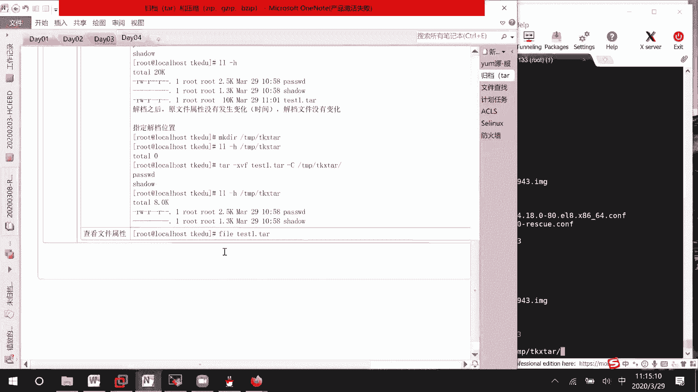

# Linux归档与压缩：03：归档与压缩基础教程


## 📚 课程概述

在本节课中，我们将学习Linux系统中两个非常实用的操作：归档与压缩。归档就像把散乱的文件整理进一个箱子，而压缩则像把被子里的空气抽走以减少体积。理解这两个概念及其相关命令，对于高效管理文件至关重要。我们将从基础命令开始，逐步学习如何打包、查看、解包文件，以及如何结合使用归档与压缩。

---

## 📦 归档操作详解

上一节我们概述了归档与压缩的基本概念，本节中我们来看看具体的归档操作。

归档的主要命令是 `tar`。它可以将多个文件或目录打包成一个单独的文件（通常以 `.tar` 结尾），但请注意，**归档操作通常会使文件体积略微增大**，因为它包含了文件本身的元数据信息。

以下是 `tar` 命令的常用选项：
*   `-c`：创建新的归档文件。
*   `-x`：从归档文件中提取（解包）文件。
*   `-v`：显示命令执行过程。
*   `-f`：指定归档文件的名称。
*   `-t`：列出归档文件的内容。

### 创建归档文件

首先，我们准备实验环境并创建一个归档文件。

```bash
# 进入临时目录并创建测试环境
cd /tmp
mkdir tkedu
cp /etc/passwd /etc/shadow /tmp/tkedu/

# 查看原始文件大小
ls -lh /tmp/tkedu/

# 使用 tar 命令创建归档文件 test1.tar
tar -cvf test1.tar /tmp/tkedu/passwd /tmp/tkedu/shadow
```
执行上述命令后，会生成一个名为 `test1.tar` 的文件。使用 `ls -lh` 查看，你会发现 `test1.tar` 的文件大小大于 `passwd` 和 `shadow` 两个文件大小的简单相加，这验证了**归档会增大文件体积**。同时，**原文件不会被删除**。

### 解包归档文件

现在，我们来学习如何解包一个归档文件。

```bash
# 首先删除原始文件，以便观察解包效果
rm /tmp/tkedu/passwd /tmp/tkedu/shadow

# 解包 test1.tar 文件到当前目录
tar -xvf test1.tar
```
解包后，`passwd` 和 `shadow` 文件会重新出现。它们的属性（如修改时间）与归档前保持一致，即**解包不会改变文件的原始属性**。

### 指定解包路径

默认解包到当前目录，但我们可以指定目标路径。

```bash
# 创建目标目录
mkdir /tmp/tk_extract

# 将归档文件解包到指定目录
tar -xvf test1.tar -C /tmp/tk_extract
```
选项 `-C`（大写）用于指定解包的目标目录。创建归档时也可以使用 `-C` 来改变归档时记录的基础路径。

### 归档后删除原文件

如果希望在归档成功后自动删除原文件，可以这样做：

```bash
# 归档文件并删除原文件
tar -cvf test2.tar /tmp/tkedu/passwd /tmp/tkedu/shadow --remove-files
```
命令执行后，`test2.tar` 被创建，而原 `passwd` 和 `shadow` 文件则被删除。

### 归档整个目录

归档目录时，根据当前路径的不同，解包后的结构也会不同。

**情况一：从目录外部归档，解包后得到整个目录。**

```bash
# 在 /tmp 目录下归档 /boot 目录
tar -cvf boot1.tar /boot/*

# 解包 boot1.tar
tar -xvf boot1.tar -C /tmp/tk_extract
```
解包后，`/tmp/tk_extract` 目录下会直接出现 `boot` 目录及其所有内容。

**情况二：进入目录内部归档，解包后得到目录内的文件。**

```bash
# 进入 /boot 目录再进行归档
cd /boot
tar -cvf /tmp/tkedu/boot2.tar *

# 解包 boot2.tar
tar -xvf /tmp/tkedu/boot2.tar -C /tmp/tk_extract
```
解包后，`/tmp/tk_extract` 目录下出现的不是 `boot` 目录，而是 `boot` 目录里所有的具体文件。

选择哪种方式取决于你的需求：需要保留目录结构用第一种；只需要目录内的文件用第二种。

---

## 🗜️ 压缩操作简介

上一节我们详细介绍了归档操作，本节中我们来看看压缩。压缩的目的是减少文件的体积，便于存储和传输。Linux中常见的压缩命令有 `gzip`、`bzip2` 和 `xz`，它们对应不同的压缩算法和文件后缀（如 `.gz`、`.bz2`、`.xz`）。

由于压缩通常与归档结合使用，我们将在下一节重点讲解。

---

## 🔗 归档与压缩结合使用

单独使用 `tar` 只是打包，文件体积会变大。在实际应用中，我们更常将归档与压缩一步完成，生成如 `.tar.gz`、`.tar.bz2` 这样的压缩包。

`tar` 命令本身集成了压缩选项，可以方便地一步完成归档与压缩。

以下是结合压缩的常用选项：
*   `-z`：使用 `gzip` 进行压缩/解压，对应 `.tar.gz` 或 `.tgz` 文件。
*   `-j`：使用 `bzip2` 进行压缩/解压，对应 `.tar.bz2` 文件。
*   `-J`：使用 `xz` 进行压缩/解压，对应 `.tar.xz` 文件。

### 创建压缩归档包

```bash
# 创建 .tar.gz 压缩包
tar -czvf backup.tar.gz /tmp/tkedu/

# 创建 .tar.bz2 压缩包
tar -cjvf backup.tar.bz2 /tmp/tkedu/

# 创建 .tar.xz 压缩包 (压缩率通常更高，但更耗时)
tar -cJvf backup.tar.xz /tmp/tkedu/
```
比较生成的文件大小，你会发现它们都比原始的 `.tar` 文件小很多，实现了压缩的目的。

### 解压压缩归档包

解压时，使用对应的选项即可。

```bash
# 解压 .tar.gz 文件
tar -xzvf backup.tar.gz -C /tmp/extract_gz

# 解压 .tar.bz2 文件
tar -xjvf backup.tar.bz2 -C /tmp/extract_bz2

# 解压 .tar.xz 文件
tar -xJvf backup.tar.xz -C /tmp/extract_xz
```

### 查看压缩包内容

不解压的情况下，可以查看压缩包内有什么文件。

```bash
# 查看 .tar.gz 文件内容
tar -tzvf backup.tar.gz

# 查看 .tar.bz2 文件内容
tar -tjvf backup.tar.bz2
```

---

## 💡 实用技巧与总结

**文件格式识别**：有时下载的文件没有明确后缀，可以使用 `file` 命令查看其类型。
```bash
file unknown_file
```
如果显示为 `POSIX tar archive` 或 `gzip compressed data`，你就知道需要用 `tar` 命令来处理了。

**本节课中我们一起学习了**：
1.  **归档**：使用 `tar -cvf` 创建归档文件，使用 `tar -xvf` 解包文件。归档能将多个文件合并，但体积会略微增加。
2.  **目录归档的两种方式**：从外部归档会保留目录结构；从内部归档则只打包目录内容。
3.  **压缩**：介绍了 `gzip`、`bzip2`、`xz` 等压缩概念。
4.  **归档与压缩结合**：使用 `tar -zcvf`、`tar -jcvf`、`tar -Jcvf` 可以一步创建压缩归档包，并使用对应的 `-x` 选项进行解压。
5.  **常用选项**：`-c`（创建）、`-x`（解压）、`-v`（显示过程）、`-f`（指定文件名）、`-C`（指定路径）、`-z`/`-j`/`-J`（压缩/解压）。



掌握这些命令，你就能轻松地在Linux系统中管理、备份和传输文件了。