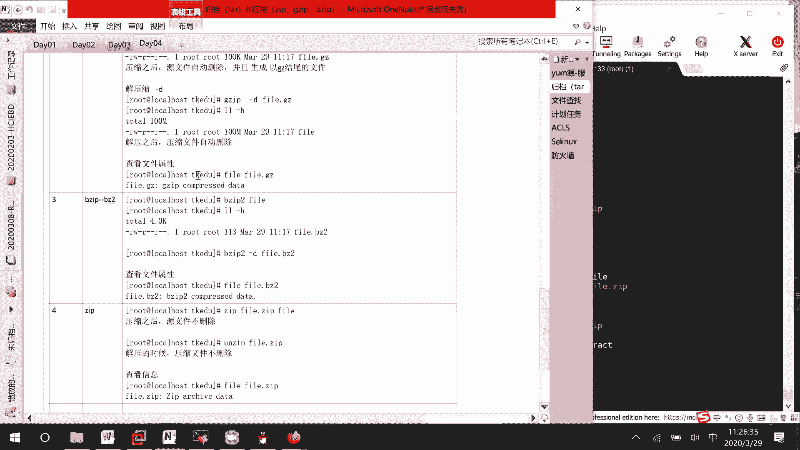

# RHCE8.0 视频教程：P12：文件压缩与解压缩工具详解 🗜️


在本节课中，我们将学习 Linux 系统中常用的文件压缩与解压缩工具。我们将重点介绍 `gzip`、`bzip2` 和 `zip` 这三个命令，通过实际操作演示它们的使用方法、特点以及区别，帮助你掌握如何有效地压缩和解压文件。

## 概述

文件压缩是减少文件占用磁盘空间的有效方法。Linux 提供了多种压缩工具，每种工具在压缩算法、压缩率和操作方式上略有不同。理解这些工具的使用，对于系统管理和日常文件处理至关重要。

## 准备测试数据

为了更直观地观察压缩效果，我们需要创建一个较大的测试文件。使用 `dd` 命令可以快速生成指定大小的文件。

以下是创建测试文件的步骤：

```bash
dd if=/dev/zero of=/tmp/file bs=1M count=100
```

*   **`dd`**：用于复制和转换文件的命令。
*   **`if=/dev/zero`**：指定输入文件为 `/dev/zero`，这是一个能无限提供空字符（`\0`）的特殊设备文件，常用于生成测试数据。
*   **`of=/tmp/file`**：指定输出文件路径和名称，这里为 `/tmp` 目录下的 `file`。
*   **`bs=1M`**：设置每次读取和写入的数据块大小为 1 兆字节（MB）。
*   **`count=100`**：指定复制 100 个数据块。

执行后，将生成一个大小为 100MB 的文件。我们可以使用 `ls -lh` 命令来查看文件大小。

```bash
ls -lh /tmp/file
```

## 使用 gzip 进行压缩与解压缩

`gzip` 是 Linux 中最常用的压缩工具之一，压缩后的文件通常以 `.gz` 为扩展名。

### 压缩文件

使用 `gzip` 压缩文件非常简单，基本语法如下：

```bash
gzip [选项] 文件名
```

例如，压缩我们刚才创建的 `/tmp/file` 文件：

```bash
gzip /tmp/file
```

压缩完成后，使用 `ls -lh` 查看，你会发现原来的 `file` 文件消失了，取而代之的是一个名为 `file.gz` 的新文件。这表明 `gzip` 在压缩后会**自动删除源文件**，并生成 `.gz` 后缀的压缩文件。

### 解压缩文件

要解压 `.gz` 文件，可以使用 `gzip -d` 命令或 `gunzip` 命令。

以下是解压缩的步骤：

```bash
gzip -d file.gz
# 或者
gunzip file.gz
```

解压后，压缩文件 `file.gz` 会被删除，恢复出原始的 `file` 文件。解压出的文件会保留原始文件的修改时间等属性。

**`gzip` 命令特点总结：**
*   压缩：`gzip 文件名`
*   解压：`gzip -d 文件名.gz` 或 `gunzip 文件名.gz`
*   压缩后源文件自动删除。
*   生成 `.gz` 后缀的压缩文件。

## 使用 bzip2 进行压缩与解压缩

`bzip2` 是另一个高效的压缩工具，它通常能提供比 `gzip` 更好的压缩率，但压缩速度可能稍慢。压缩后的文件以 `.bz2` 为扩展名。

### 压缩文件

`bzip2` 的用法与 `gzip` 类似：

```bash
bzip2 /tmp/file
```

执行后，源文件 `file` 会被删除，并生成一个 `file.bz2` 的压缩文件。通过 `ls -lh` 比较可以发现，对于相同的测试数据，`.bz2` 文件通常比 `.gz` 文件更小。

### 解压缩文件

解压 `.bz2` 文件使用 `bzip2 -d` 命令或 `bunzip2` 命令。

以下是解压缩的步骤：

```bash
bzip2 -d file.bz2
# 或者
bunzip2 file.bz2
```

**`bzip2` 命令特点总结：**
*   压缩：`bzip2 文件名`
*   解压：`bzip2 -d 文件名.bz2` 或 `bunzip2 文件名.bz2`
*   压缩后源文件自动删除。
*   生成 `.bz2` 后缀的压缩文件。

## 使用 zip 和 unzip 进行压缩与解压缩

`zip` 格式在 Windows 和 Linux 系统间通用性更好。在 Linux 中，压缩使用 `zip` 命令，解压使用 `unzip` 命令。

### 压缩文件

`zip` 命令的语法与前两者不同，需要指定压缩后的文件名：

```bash
zip 压缩包名称.zip 要压缩的文件名
```

例如，将 `file` 压缩为 `file.zip`：

```bash
zip file.zip /tmp/file
```

一个重要的区别是，`zip` 命令在压缩后**不会删除源文件**。你会同时拥有原始的 `file` 和新的 `file.zip`。

### 解压缩文件

解压 `.zip` 文件需要使用 `unzip` 命令：

```bash
unzip file.zip
```

`unzip` 命令在解压后同样**不会删除**原始的 `.zip` 压缩包。

**`zip`/`unzip` 命令特点总结：**
*   压缩：`zip 压缩包名.zip 源文件名`
*   解压：`unzip 压缩包名.zip`
*   压缩和解压操作均**不会删除**源文件或压缩包。

## 三种工具对比与总结

本节中我们一起学习了 `gzip`、`bzip2` 和 `zip` 这三种压缩工具。为了帮助你更好地理解和选择，以下是它们的核心区别对比：

| 特性 | gzip | bzip2 | zip |
| :--- | :--- | :--- | :--- |
| **压缩命令** | `gzip 文件` | `bzip2 文件` | `zip 压缩包.zip 文件` |
| **解压命令** | `gzip -d 文件.gz` | `bzip2 -d 文件.bz2` | `unzip 压缩包.zip` |
| **压缩后扩展名** | `.gz` | `.bz2` | `.zip` |
| **是否删除源文件** | **是** | **是** | **否** |
| **是否删除压缩包** | **是** | **是** | **否** |
| **跨平台兼容性** | 良好（主要在Linux） | 良好（主要在Linux） | **优秀**（Windows/Linux/macOS） |
| **典型压缩率** | 标准 | **较高** | 标准 |

**如何选择？**
*   如果追求高压缩率且主要在 Linux 环境下使用，可选择 `bzip2`。
*   如果需要快速压缩解压，或处理的是文本日志等，`gzip` 是经典选择。
*   如果需要在 Windows 和 Linux 系统之间共享压缩文件，`zip` 格式是最佳选择。



通过本课的学习，你已经掌握了在 Linux 系统中使用不同工具进行文件压缩与解压缩的基本技能。在实际工作中，可以根据具体需求灵活选用合适的工具。