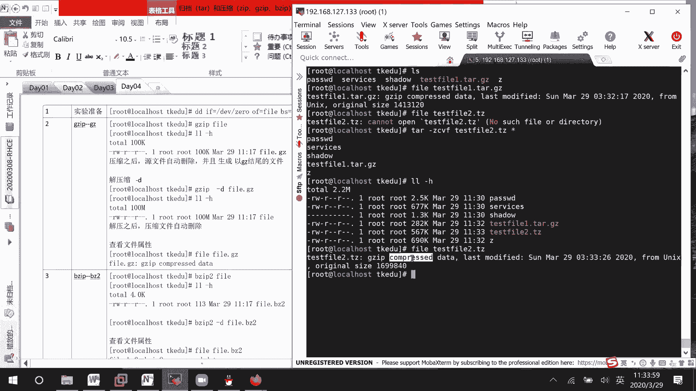
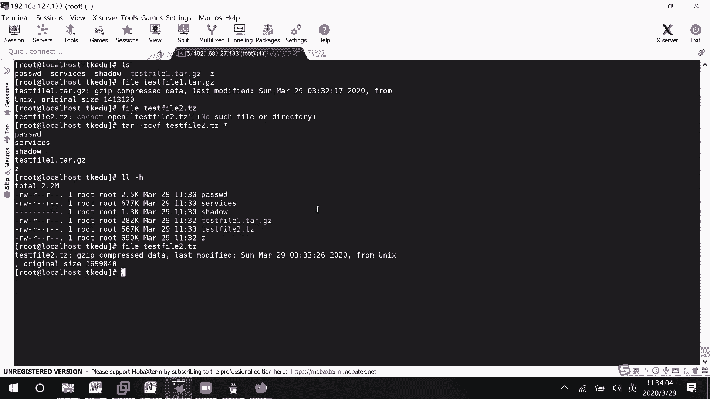
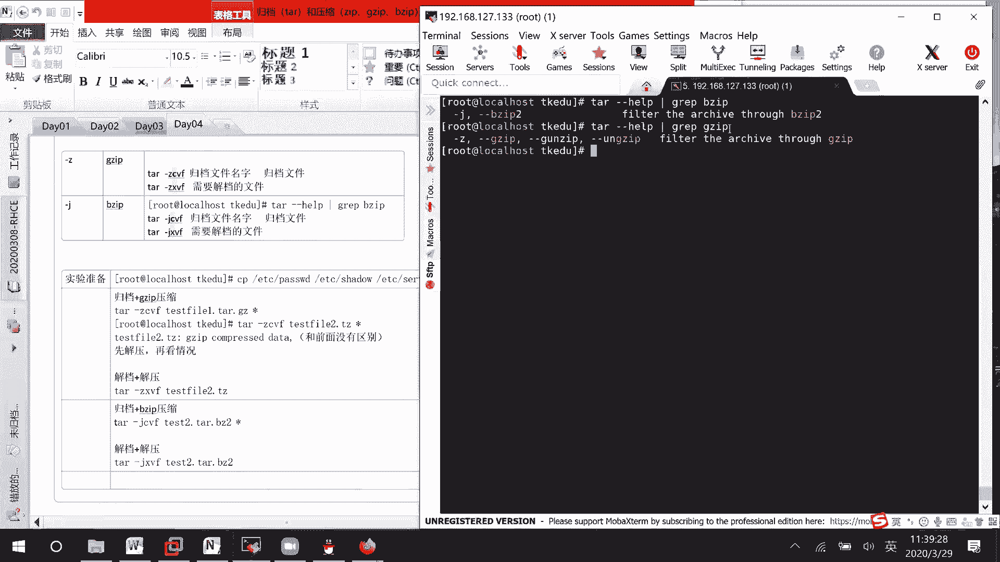

# Linux文件管理：05：归档与压缩工具详解 📦


在本节课中，我们将学习Linux系统中两个重要的文件管理工具：归档工具 `tar` 和压缩工具 `gzip`、`bzip2`。我们将了解它们如何单独工作，以及如何结合使用来高效地打包和压缩文件。

## 归档与压缩的基本概念

归档是指将多个文件或目录打包成一个单一的文件，便于管理和传输。压缩则是通过算法减小文件的大小。在Linux中，`tar` 命令负责归档，而 `gzip` 或 `bzip2` 等工具负责压缩。它们通常结合使用，先归档再压缩，或者先解压缩再解档。

## 归档工具 tar 的使用

`tar` 命令是创建和解开归档文件的核心工具。它的基本语法结构如下：

```bash
tar [选项] [归档文件名] [要归档的文件或目录...]
```

上一节我们介绍了基本概念，本节中我们来看看 `tar` 命令的具体选项。

以下是 `tar` 命令的常用操作模式：
*   **创建归档**：使用 `-c` 选项。
*   **解开归档**：使用 `-x` 选项。
*   **显示过程**：使用 `-v` 选项，列出正在处理的文件。
*   **指定归档文件**：使用 `-f` 选项，后面必须紧跟归档文件的名称。

因此，创建名为 `archive.tar` 的归档文件命令是：
```bash
tar -cvf archive.tar file1 file2 dir1
```
解开该归档文件的命令是：
```bash
tar -xvf archive.tar
```

## 结合压缩工具使用

单纯的归档不会减少文件体积。为了同时实现打包和压缩，`tar` 命令可以与压缩工具联动。主要通过 `-z` 和 `-j` 选项来指定压缩算法。

以下是 `tar` 结合不同压缩工具的选项：
*   **结合 gzip**：使用 `-z` 选项。生成的文件扩展名通常为 `.tar.gz` 或 `.tgz`。
*   **结合 bzip2**：使用 `-j` 选项。生成的文件扩展名通常为 `.tar.bz2` 或 `.tbz2`。

### 使用 gzip 进行归档压缩



如果希望使用 `gzip` 进行压缩，只需在 `tar` 命令中加入 `-z` 选项。



例如，将当前目录下的 `passwd`、`shadow` 等文件归档并用 `gzip` 压缩，生成 `test.tar.gz` 文件：
```bash
tar -zcvf test.tar.gz passwd shadow
```
请注意，`-z` 选项需要放在 `-f` 选项之前。

解开此类压缩归档文件的命令是：
```bash
tar -zxvf test.tar.gz
```

### 使用 bzip2 进行归档压缩

如果希望使用 `bzip2` 进行压缩，则使用 `-j` 选项。

例如，创建并用 `bzip2` 压缩的归档文件：
```bash
tar -jcvf test2.tar.bz2 passwd shadow
```
解开此类压缩归档文件的命令是：
```bash
tar -jxvf test2.tar.bz2
```

## 注意事项与操作流程

有时你可能不确定一个文件是单纯的压缩文件还是压缩过的归档文件。最保险的操作方法是先尝试解压，再根据解压出的内容判断是否需要进一步解档。

例如，对于一个文件 `file2.bz2`，可以先尝试用 `bzip2` 解压：
```bash
bunzip2 file2.bz2
```
解压后，如果产生了一个 `.tar` 文件，则说明它原本是一个归档文件，需要再用 `tar` 命令解档。

如果你已经确认一个文件（如 `test.tar.bz2`）是经过 `bzip2` 压缩的 `tar` 归档包，那么可以直接使用一条命令完成解压和解档：
```bash
tar -jxvf test.tar.bz2
```

## 总结



本节课中我们一起学习了 Linux 下的归档与压缩。
1.  **`tar`** 是核心的归档工具，使用 `-c` 创建归档，`-x` 解开归档。
2.  通过 **`-z`** 选项可以调用 `gzip` 工具，实现归档与压缩一步完成，生成 `.tar.gz` 文件。
3.  通过 **`-j`** 选项可以调用 `bzip2` 工具，生成 `.tar.bz2` 文件。
4.  处理文件时，若不确定其格式，可采取先解压、再检查、后解档的稳妥步骤。
5.  在实际应用和考试中，这些命令常与文件查找等操作结合使用，需要牢记各个选项的含义。