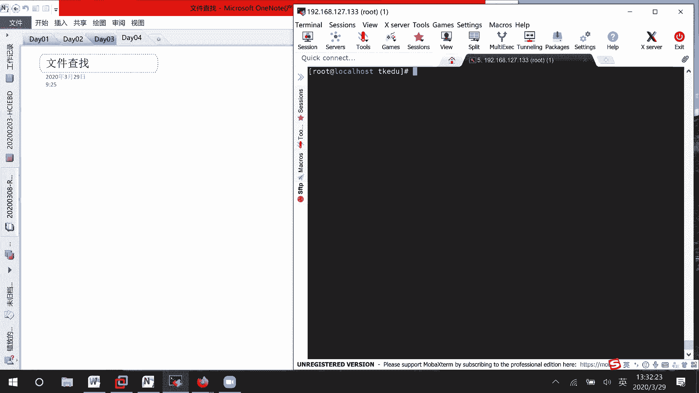
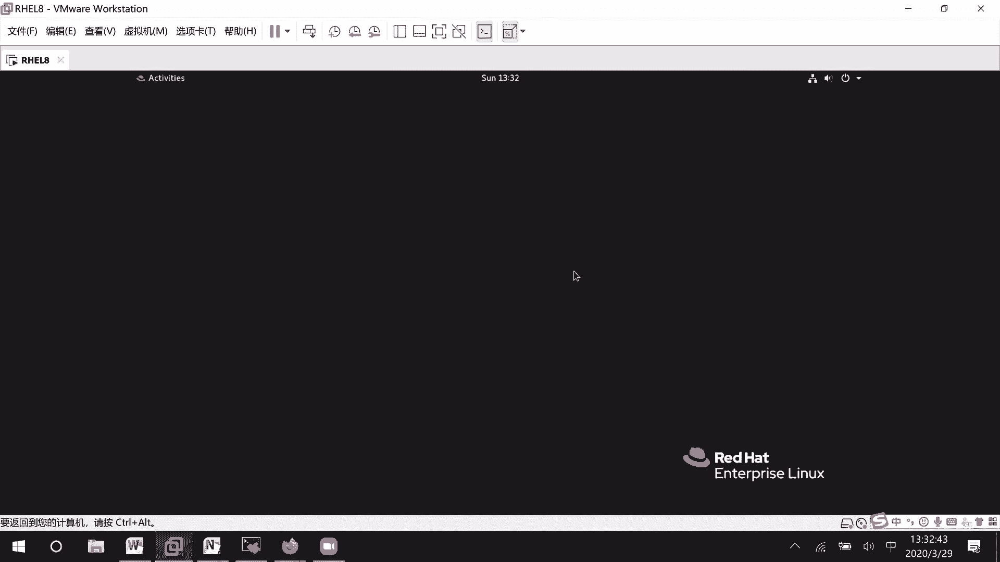
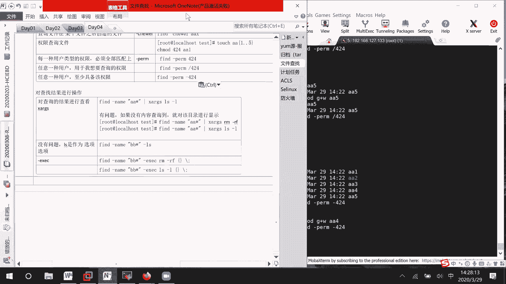

# Linux文件管理：06：文件查找与定位 🔍






在本节课中，我们将要学习在Linux系统中查找和定位文件的各种方法。我们将介绍几个核心命令，并重点掌握功能强大的 `find` 命令，它可以根据多种属性（如文件名、大小、所有者、权限等）进行精确查找。课程内容将尽可能简单直白，确保初学者能够理解并应用。


---

## 文件查找的几种方式

在图形化界面中，可以通过按下键盘上的Windows键，在搜索框中输入关键词来查找文件，但这种方法可能不够精确。

在命令行中，我们主要使用以下几个命令进行文件查找：
1.  `which`
2.  `whereis`
3.  `locate`
4.  `find`

其中，`find` 命令功能最为强大，是考试和实际工作中最常用的工具。

---

## `which` 命令：查找命令路径

`which` 命令用于查找并显示给定命令的完整路径。它主要用于查询可执行命令（脚本）的位置。

**命令格式**：
```bash
which [选项] 命令名
```

**示例**：
```bash
which ls
```
此命令会输出 `ls` 命令的完整路径，例如 `/usr/bin/ls`。

---

## `whereis` 命令：定位二进制、源码和手册页

`whereis` 命令用于定位二进制文件、源代码文件和帮助手册页的位置。它提供的信息比 `which` 更详细。

**命令格式**：
```bash
whereis [选项] 文件名
```

**示例**：
```bash
whereis ls
whereis vim
```
该命令会显示 `ls` 或 `vim` 的二进制文件路径、相关的帮助文档（man page）位置等。

---

## `locate` 命令：基于数据库的快速查找

`locate` 命令通过搜索预建的数据库来快速查找文件，速度很快。但需要注意的是，这个数据库默认每周更新一次，因此新创建的文件可能无法立即被找到。

**命令格式**：
```bash
locate [选项] 关键词
```

**重要提示**：
如果刚创建了文件，使用 `locate` 命令可能找不到。此时需要先手动更新数据库。

**更新数据库命令**：
```bash
updatedb
```

**示例**：
1.  创建新文件：`touch abc`
2.  更新数据库：`updatedb`
3.  查找文件：`locate abc`

**注意**：`locate` 默认不会搜索 `/tmp` 临时目录下的文件。

---

## `find` 命令：强大的文件搜索工具

`find` 是功能最强大的文件查找命令，可以根据文件名、大小、时间、所有者、权限等多种属性进行搜索。

### 1. 根据文件名查找

这是最常用的查找方式。`-name` 选项用于指定文件名，它区分大小写。如果希望忽略大小写，可以使用 `-iname` 选项。

**命令格式**：
```bash
find [搜索路径] -name “文件名”
find [搜索路径] -iname “文件名” # 忽略大小写
```

**示例**：
在当前目录查找名为 `aa1` 的文件：
```bash
find . -name “aa1”
```
在根目录下查找所有以 `aa` 开头的文件（忽略大小写）：
```bash
find / -iname “aa*”
```

**通配符说明**：
*   `?`：匹配任意单个字符。
*   `*`：匹配零个或多个任意字符。

### 2. 根据文件大小查找

使用 `-size` 选项可以根据文件大小进行查找。单位可以是 `c`（字节）、`k`（千字节）、`M`（兆字节）、`G`（吉字节）。

**命令格式**：
```bash
find [搜索路径] -size [+/-]n[单位]
```

**示例**：
查找当前目录下大小等于2MB的文件：
```bash
find . -size 2M
```
查找根目录下大小大于2MB的文件：
```bash
find / -size +2M
```
查找大小小于2MB的文件：
```bash
find . -size -2M
```
查找大小在2MB到4MB之间的文件（使用 `-a` 表示“并且”）：
```bash
find . -size +2M -a -size -4M
```
查找大小小于2MB或大于4MB的文件（使用 `-o` 表示“或者”）：
```bash
find . -size -2M -o -size +4M
```

### 3. 根据所有者和所属组查找

使用 `-user` 和 `-group` 选项可以根据文件的所有者或所属组进行查找。也可以使用 `-uid` 和 `-gid` 根据用户ID和组ID查找。

**命令格式**：
```bash
find [搜索路径] -user 用户名
find [搜索路径] -group 组名
find [搜索路径] -uid 用户ID
find [搜索路径] -gid 组ID
```

**示例**：
查找所有者为 `user1` 的文件：
```bash
find /home -user user1
```

### 4. 根据文件类型查找

使用 `-type` 选项可以根据文件类型进行查找。常见的类型有：
*   `f`：普通文件
*   `d`：目录
*   `l`：符号链接

**命令格式**：
```bash
find [搜索路径] -type 文件类型标识
```

**示例**：
查找当前目录下的所有子目录：
```bash
find . -type d
```
查找 `/etc` 目录下的所有普通文件：
```bash
find /etc -type f
```

### 5. 根据文件时间查找

可以根据文件的创建时间、修改时间等进行查找。
*   `-ctime n`：文件状态在 n\*24 小时前改变过。
*   `-cmin n`：文件状态在 n 分钟前改变过。
*   `-newer file`：查找比指定文件 `file` 更新的文件。

在时间参数前使用 `+` 表示“超过”，使用 `-` 表示“之内”。

**示例**：
查找创建时间超过5分钟的文件：
```bash
find . -cmin +5
```
查找创建时间在5分钟以内的文件：
```bash
find . -cmin -5
```
查找比文件 `aa1` 更新的所有文件：
```bash
find . -newer aa1
```

### 6. 根据文件权限查找

使用 `-perm` 选项可以根据文件权限进行查找。

**命令格式**：
```bash
find [搜索路径] -perm 权限模式
```

**示例**：
精确查找权限为 `644`（即 `rw-r--r--`）的文件：
```bash
find . -perm 644
```
查找所有者、所属组或其他用户中，任意一类用户至少拥有指定权限的文件（例如，任何用户有读权限）：
```bash
find . -perm /444
```
查找所有者、所属组和其他用户都必须至少拥有指定权限的文件：
```bash
find . -perm -644
```

---

## 对查找结果执行操作

找到文件后，我们经常需要对结果进行进一步处理，例如查看详细信息或删除。

### 方法一：使用 `-exec` 选项

`-exec` 选项允许对 `find` 找到的每一个文件执行指定的命令。`{}` 代表找到的文件名，命令以 `\;` 结束。

**命令格式**：
```bash
find [搜索路径] [查找条件] -exec 命令 {} \;
```

**示例**：
查找所有 `.log` 文件并显示其详细信息：
```bash
find /var/log -name “*.log” -exec ls -l {} \;
```
查找并删除所有名为 `temp.txt` 的文件：
```bash
find . -name “temp.txt” -exec rm -f {} \;
```

### 方法二：使用 `xargs` 命令（通过管道）

`xargs` 命令可以将 `find` 的输出作为另一个命令的参数。这种方式通常与管道 `|` 结合使用。

**命令格式**：
```bash
find [搜索路径] [查找条件] | xargs 命令
```

**示例**：
查找所有 `.conf` 文件并用 `grep` 搜索特定内容：
```bash
find /etc -name “*.conf” | xargs grep “error”
```

**注意**：如果文件名包含空格等特殊字符，使用 `xargs` 可能会有问题。更安全的方式是使用 `-exec` 或 `find -print0 | xargs -0`。

---

## 总结

本节课我们一起学习了Linux系统中多种文件查找与定位的方法。
*   我们了解了 `which` 和 `whereis` 用于定位命令及其相关文件。
*   掌握了 `locate` 命令基于数据库的快速查找方式及其局限性。
*   重点深入学习了功能强大的 `find` 命令，包括如何根据**文件名**、**大小**、**所有者**、**类型**、**时间**和**权限**等多种属性进行精确查找。
*   最后，学习了如何利用 `-exec` 选项或 `xargs` 命令对查找结果执行进一步操作，如查看、删除等。



熟练运用这些查找技巧，将极大地提高你在Linux环境下的工作效率。