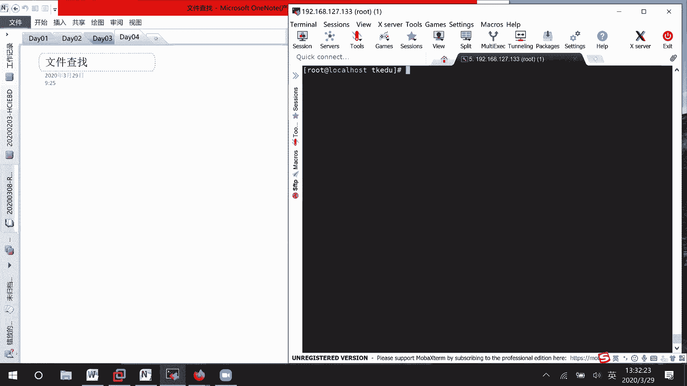
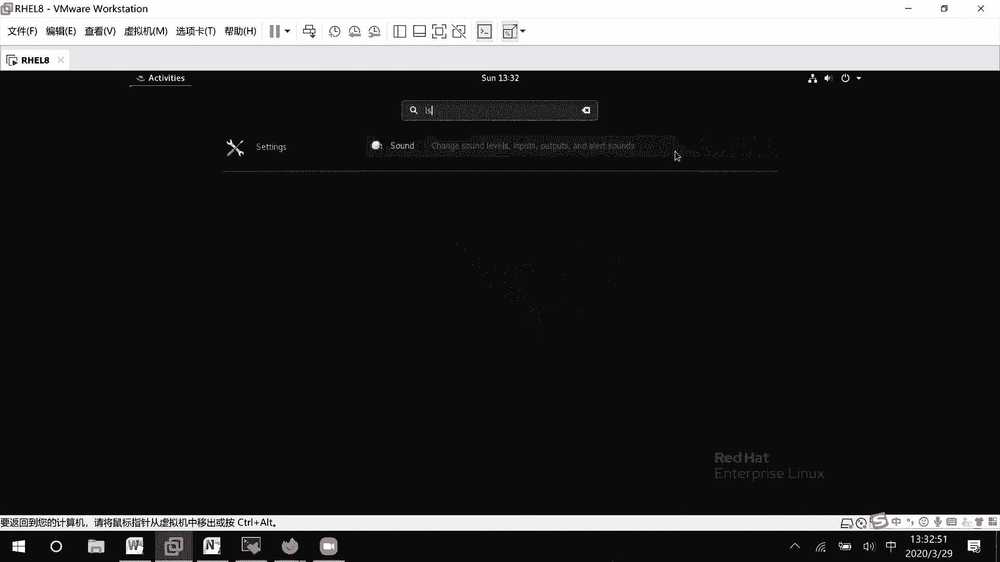
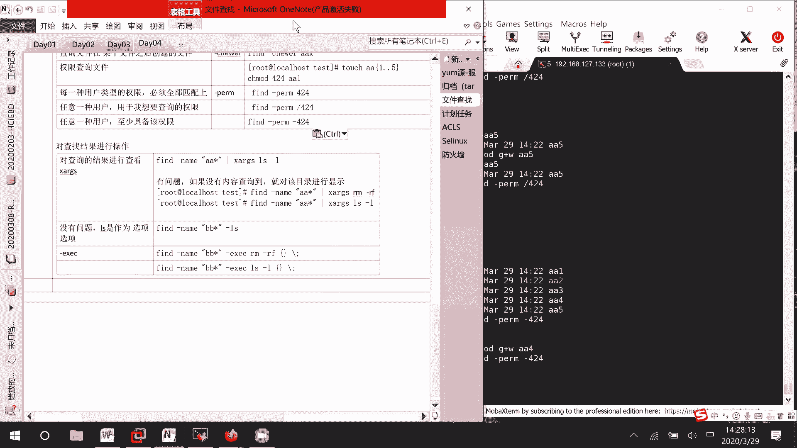

# RHCE8.0视频教程：P15：文件查找与管理







## 概述
在本节课中，我们将学习在Linux系统中查找文件的几种常用命令。我们将重点介绍 `which`、`whereis`、`locate` 和功能强大的 `find` 命令。掌握这些工具对于系统管理和日常运维至关重要。

---

## 图形化界面查找
在图形化界面中，可以通过按下键盘上的Windows键，在搜索框中输入关键词来查找文件。但这种方法可能不够精确。

---

## 命令行查找工具简介
上一节我们提到了图形化查找的局限性，本节中我们来看看几个核心的命令行查找工具。以下是四个常用的文件查找命令：

1.  **`which`**：用于查找命令的完整路径。
2.  **`whereis`**：用于定位命令的二进制文件、源代码和帮助手册的位置。
3.  **`locate`**：基于数据库进行快速文件搜索。
4.  **`find`**：功能最强大的查找工具，可以根据多种属性（如名称、大小、时间、所有者等）进行搜索。

**`find`** 命令在考试和实际工作中都非常重要，建议重点掌握。

---

## `which` 命令详解
`which` 命令用于输出指定命令的完整脚本路径。

**基本语法**：
```bash
which [选项] 命令名
```

**示例**：
查询 `ls` 命令的位置。
```bash
which ls
```
输出结果类似 `/usr/bin/ls`，表示 `ls` 命令的完整路径。

---

## `whereis` 命令详解
`whereis` 命令比 `which` 提供更详细的信息，包括命令的二进制文件、帮助手册等位置。

**基本语法**：
```bash
whereis [选项] 命令名
```

**示例**：
查找 `ls` 和 `vim` 的相关文件。
```bash
whereis ls
whereis vim
```
该命令会显示二进制文件、源代码和手册页的路径。

---

## `locate` 命令详解
`locate` 命令通过查询系统预建的数据库来快速查找文件。但数据库通常每周更新一次，因此新创建的文件可能无法立即找到。

**基本语法**：
```bash
locate [选项] 关键词
```

**使用步骤**：
1.  更新数据库（需要root权限）：
    ```bash
    updatedb
    ```
2.  使用 `locate` 进行查找：
    ```bash
    locate 关键词
    ```

**注意**：`locate` 默认不会搜索 `/tmp` 等临时目录下的文件。

---

## `find` 命令详解
`find` 是功能最强大的查找工具，可以根据多种条件进行搜索。其基本语法结构为：
```bash
find [搜索路径] [选项] [操作]
```
如果不指定搜索路径，则默认在当前目录下查找。

### 1. 按名称查找
使用 `-name` 选项根据文件名查找，区分大小写。使用 `-iname` 则不区分大小写。

**示例**：
查找当前目录下名为 `aa1` 的文件。
```bash
find -name aa1
```
查找当前目录下名称包含 `aa` 的文件（不区分大小写）。
```bash
find -iname aa
```

**使用通配符**：
*   `?` 代表任意一个字符。
*   `*` 代表零个或多个任意字符。

**示例**：
查找当前目录下以 `aa` 开头，后面跟一个字符的文件。
```bash
find -name 'aa?'
```
查找当前目录下所有以 `aa` 开头的文件。
```bash
find -name 'aa*'
```

### 2. 按大小查找
使用 `-size` 选项根据文件大小查找。单位可以是 `c`（字节）、`k`（千字节）、`M`（兆字节）、`G`（吉字节）。

**示例**：
查找根目录下大小等于2MB的文件。
```bash
find / -size 2M
```
查找当前目录下大小大于2MB的文件。
```bash
find -size +2M
```
查找当前目录下大小小于2MB的文件。
```bash
find -size -2M
```
查找当前目录下大小大于2MB且小于4MB的文件（`-a` 表示逻辑与）。
```bash
find -size +2M -a -size -4M
```
查找当前目录下大小小于2MB或大于4MB的文件（`-o` 表示逻辑或）。
```bash
find -size -2M -o -size +4M
```

### 3. 按所有者和所属组查找
使用 `-user` 和 `-group` 选项根据文件所有者和所属组查找。也可以使用 `-uid` 和 `-gid` 根据用户ID和组ID查找。

**示例**：
查找所有者为 `user1` 的文件。
```bash
find -user user1
```
查找所属组为 `group1` 的文件。
```bash
find -group group1
```

### 4. 按类型查找
使用 `-type` 选项根据文件类型查找。
*   `f`：普通文件
*   `d`：目录
*   `l`：符号链接

**示例**：
查找当前目录下的所有目录。
```bash
find -type d
```
查找当前目录下的所有普通文件。
```bash
find -type f
```

### 5. 按时间查找
使用时间选项查找文件，时间以“天”或“分钟”为单位。
*   `-ctime n`：查找n天前创建的文件。
*   `-cmin n`：查找n分钟前创建的文件。
*   `-newer file`：查找比指定文件 `file` 更新的文件。

在时间前使用 `+` 表示“超过”，使用 `-` 表示“之内”。

**示例**：
查找创建时间超过5分钟的文件。
```bash
find -cmin +5
```
查找创建时间在5分钟以内的文件。
```bash
find -cmin -5
```
查找比文件 `aa1` 更新的文件。
```bash
find -newer aa1
```

### 6. 按权限查找
使用 `-perm` 选项根据文件权限查找。

**示例**：
严格匹配权限为 `644` 的文件。
```bash
find -perm 644
```
查找任意一类用户（所有者、所属组、其他用户）至少具备读(`r`)、写(`w`)、执行(`x`)权限之一的文件。`/` 表示“或”的关系。
```bash
find -perm /644
```
查找所有者有读、所属组有写、其他用户有读权限的文件。`-` 表示“至少”具备这些权限，其他权限不限。
```bash
find -perm -644
```

---

## 对查找结果进行操作
找到文件后，我们经常需要对这些结果进行进一步操作，如查看详情或删除。

### 方法一：使用 `-exec` 选项
`-exec` 选项可以对查找到的每个文件执行指定的命令。`{}` 代表查找到的文件名，`\;` 表示命令结束。

**示例**：
查找所有以 `.log` 结尾的文件并删除。
```bash
find -name "*.log" -exec rm -f {} \;
```
查找所有名为 `aa1` 的文件并显示详细信息。
```bash
find -name aa1 -exec ls -l {} \;
```

### 方法二：使用 `xargs` 命令（结合管道）
`xargs` 命令可以将 `find` 的输出作为另一个命令的参数。这种方式可能在某些情况下（如无结果时）有副作用，需谨慎使用。

**示例**：
查找所有名为 `aa1` 的文件并显示详细信息。
```bash
find -name aa1 | xargs ls -l
```

---

## 总结
本节课我们一起学习了Linux系统中的文件查找与管理。
1.  我们了解了 `which` 和 `whereis` 用于定位命令本身。
2.  掌握了 `locate` 基于数据库的快速搜索及其局限性。
3.  重点深入学习了功能强大的 `find` 命令，包括按名称、大小、所有者、类型、时间和权限等多种条件进行查找。
4.  最后，学习了如何使用 `-exec` 选项和 `xargs` 命令对查找结果进行进一步操作。



熟练运用这些查找命令，将极大地提高你在Linux环境下的工作效率。