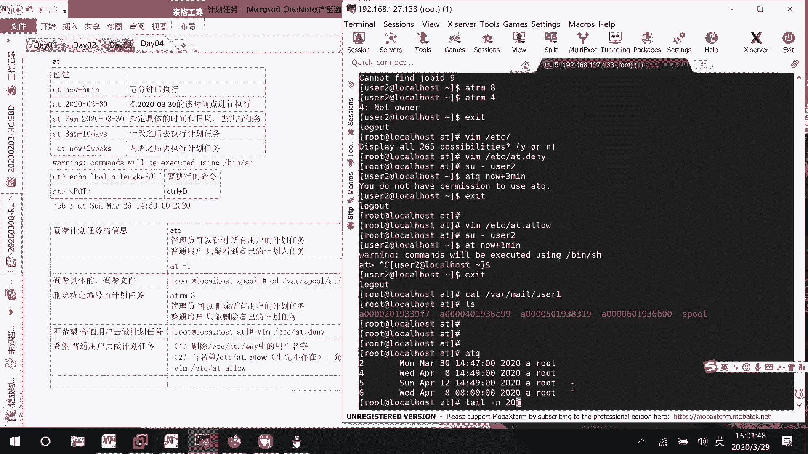
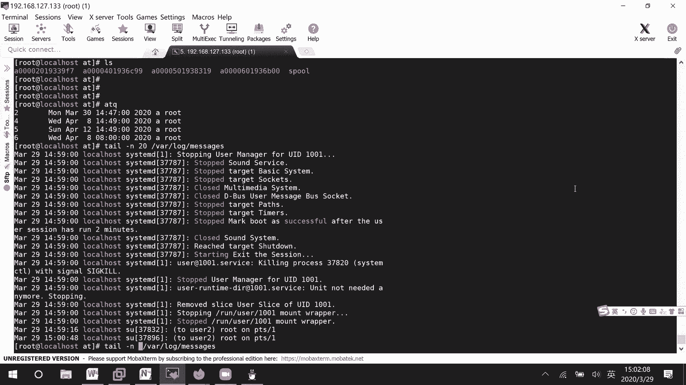
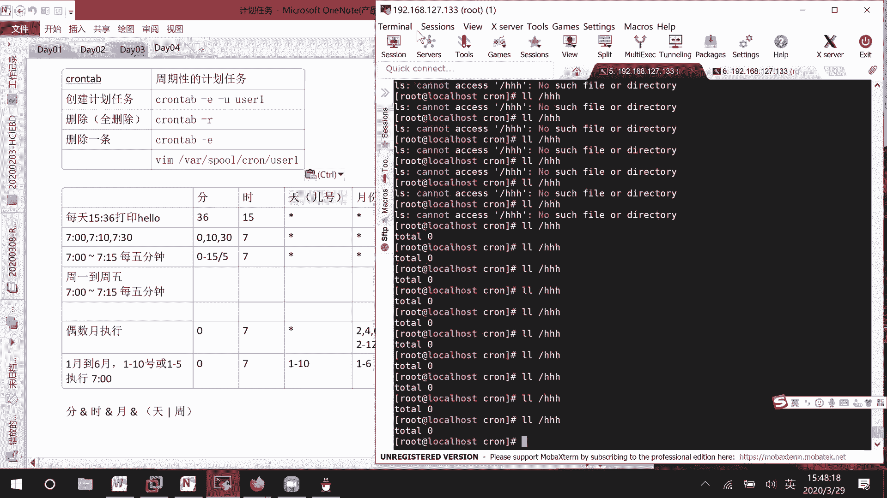

# Linux计划任务管理：P16：一次性与周期性任务详解


## 概述

在本节课中，我们将学习Linux系统中的两种计划任务管理工具：`at`和`crontab`。`at`用于安排一次性执行的任务，而`crontab`则用于设置周期性执行的任务。掌握这两种工具对于自动化系统管理任务至关重要。

---

## 一次性计划任务：at命令

上一节我们介绍了计划任务的基本概念，本节中我们来看看如何使用`at`命令创建一次性计划任务。

`at`命令允许用户在指定的时间点执行一次命令或脚本。其基本语法是`at [时间]`，之后进入交互式界面输入要执行的命令。

### 创建at计划任务

以下是创建`at`计划任务的几种时间格式示例：

*   **相对时间**：`at now + 5 minutes` 表示5分钟后执行。
*   **绝对日期**：`at 20200330` 表示在2020年3月30日的当前时间执行。
*   **具体日期时间**：`at 7:00am 20200330` 表示在2020年3月30日上午7点执行。
*   **几天/几周后**：`at now + 10 days` 或 `at now + 2 weeks` 表示10天或两周后执行。

在交互界面输入完命令后，按 **Ctrl+D** 提交任务。

### 管理at计划任务

创建任务后，我们需要知道如何查看和管理它们。

*   **查看任务队列**：使用 `atq` 或 `at -l` 命令可以列出当前用户的所有待执行`at`任务。
*   **查看任务详情**：使用 `at -c [任务编号]` 可以查看指定编号任务的详细内容，包括要执行的命令。
*   **删除任务**：使用 `atrm [任务编号]` 或 `at -r [任务编号]` 可以删除指定的`at`任务。**注意**：普通用户只能删除自己的任务，而root用户可以管理所有用户的任务。
*   **任务输出**：`at`任务执行后的输出默认会通过邮件发送给任务所有者。邮件通常存储在`/var/spool/mail/`目录下，以用户名命名的文件中。需要确保邮件服务（如`postfix`）已安装并运行才能正常接收。

### 控制用户访问权限

系统管理员可以控制哪些用户可以使用`at`命令。

*   **黑名单**：`/etc/at.deny` 文件。将用户名写入此文件，则该用户无法使用`at`命令。
*   **白名单**：`/etc/at.allow` 文件。此文件默认不存在，需要手动创建。**白名单优先级高于黑名单**。如果此文件存在，则只有列在其中的用户可以使用`at`命令，`at.deny`文件将被忽略。

---

## 周期性计划任务：crontab命令





上一节我们学习了如何安排一次性任务，本节中我们来看看如何设置周期性自动执行的任务，这就需要用到`crontab`命令。

`crontab`用于创建、编辑、列出和删除周期性计划任务。每个用户都有自己的`crontab`文件。

### crontab基本操作

以下是`crontab`命令的常用操作：

*   **编辑当前用户的任务**：`crontab -e`
*   **列出当前用户的任务**：`crontab -l`
*   **删除当前用户的所有任务**：`crontab -r`
*   **编辑指定用户的任务（仅root）**：`crontab -u username -e`

### crontab时间格式详解

`crontab`任务的每一行都遵循一个固定的格式，定义了执行时间和要执行的命令。

```
*    *    *    *    *    [要执行的命令]
分   时   日   月   周
```

以下是各个字段的说明和示例：

*   **分钟 (0-59)**
*   **小时 (0-23)**
*   **日期 (1-31)**
*   **月份 (1-12 或 jan, feb...)**
*   **星期 (0-7 或 sun, mon...，其中0和7都代表周日)**

**特殊符号说明：**

*   `*`：代表所有可能的值。例如，在“小时”字段为`*`表示每小时。
*   `,`：指定一个列表。例如，`1,3,5`在“星期”字段表示周一、周三、周五。
*   `-`：指定一个范围。例如，`9-17`在“小时”字段表示上午9点到下午5点。
*   `/`：指定时间间隔。例如，`*/10`在“分钟”字段表示每10分钟。

**重要规则**：“日期”字段和“星期”字段是“或”(OR)的关系，只要满足其中一个条件即可。其他字段之间是“与”(AND)的关系，必须同时满足。

### crontab配置示例

以下是几个`crontab`配置的实用示例：

*   **每天7点执行**：`0 7 * * * echo "Good morning"`
*   **每工作日（周一到周五）上午7:15执行**：`15 7 * * 1-5 echo "Workday alarm"`
*   **每5分钟执行一次**：`*/5 * * * * /path/to/script.sh`
*   **每月1号和15号的凌晨1点执行**：`0 1 1,15 * * /path/to/backup.sh`
*   **偶数月（2,4,6,8,10,12）的周一到周三执行**：`0 7 * 2-12/2 1-3 echo "Even month task"`

### 系统级crontab

除了用户级`crontab`，系统还有一个全局的配置文件`/etc/crontab`。它的格式略有不同，在时间字段后需要指定执行命令的用户身份。

```
*    *    *    *    *    user-name    command-to-be-executed
```

系统计划任务的脚本通常存放在`/etc/cron.hourly/`， `/etc/cron.daily/`， `/etc/cron.weekly/`， `/etc/cron.monthly/` 这些目录中，由系统自动按小时、天、周、月的频率执行。

### 控制用户访问权限

与`at`命令类似，也可以通过`/etc/cron.deny`和`/etc/cron.allow`文件来控制用户对`crontab`命令的使用权限，规则与`at`命令完全相同。

---

## 总结

本节课中我们一起学习了Linux系统下两种核心的计划任务管理工具。

我们首先介绍了`at`命令，它用于安排**一次性**执行的任务。我们学习了如何指定各种时间格式来创建任务，以及如何使用`atq`、`atrm`等命令查看和管理任务队列，并了解了如何通过`at.deny`和`at.allow`文件控制用户权限。

接着，我们深入探讨了`crontab`命令，它是设置**周期性**任务的标准工具。我们详细解析了其复杂但强大的时间格式（分、时、日、月、周），并通过多个示例演示了如何配置各种执行周期。我们还学习了`crontab -e`、`-l`、`-r`等基本操作，以及系统级`crontab`的配置方法。



熟练掌握`at`和`crontab`，能够极大地提升系统管理的自动化水平，是每位Linux系统管理员必备的技能。