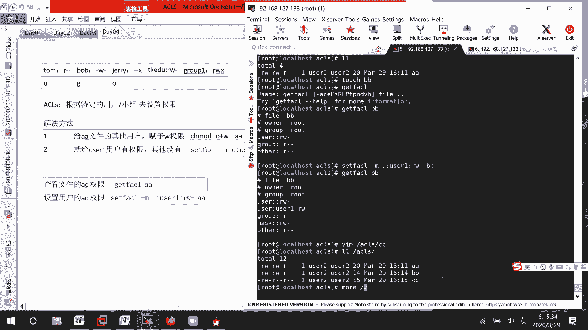
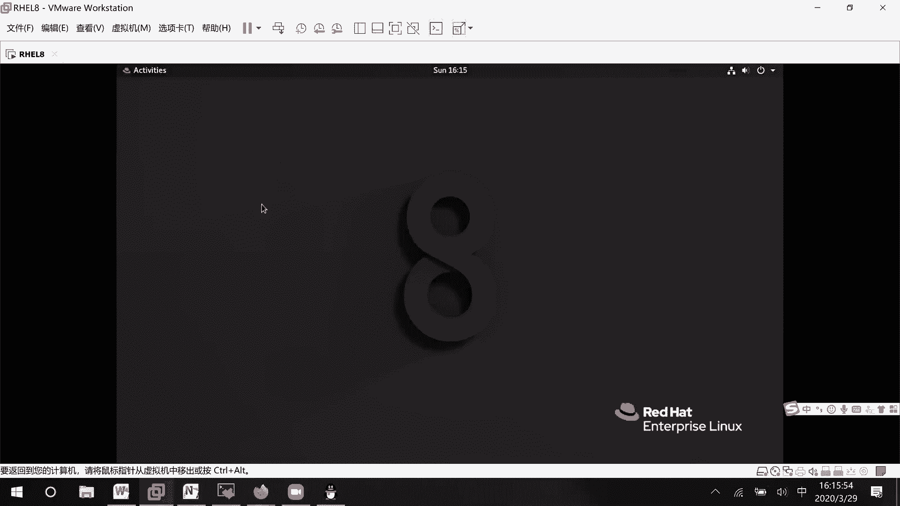
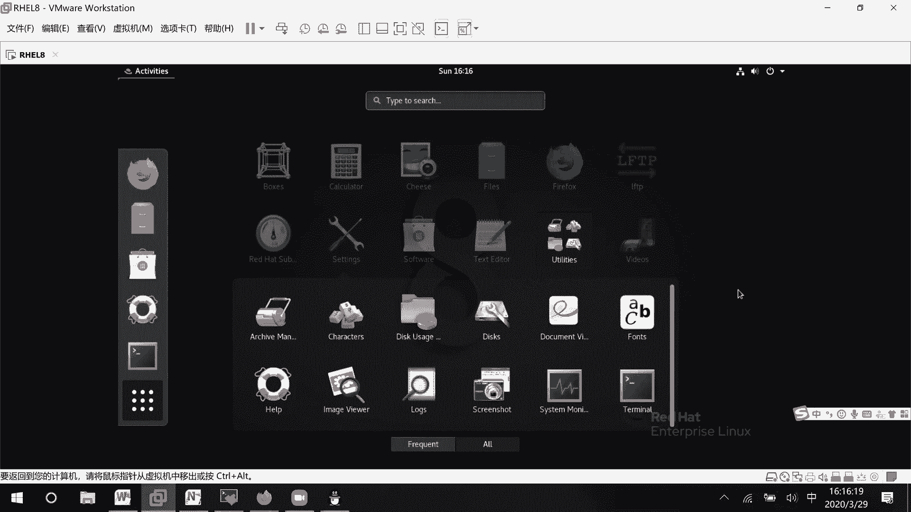
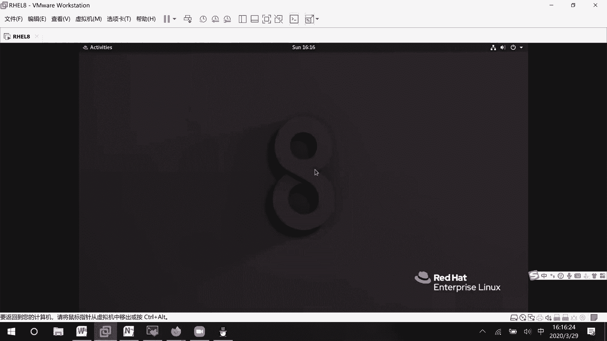
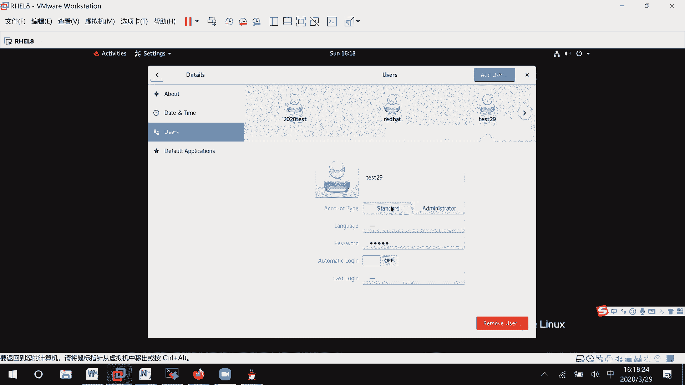
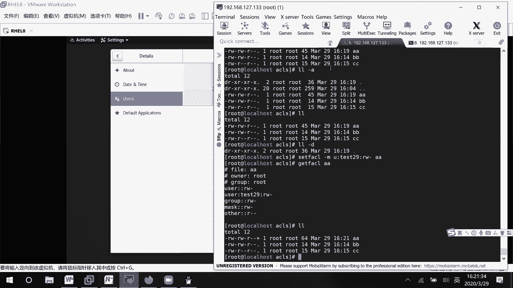
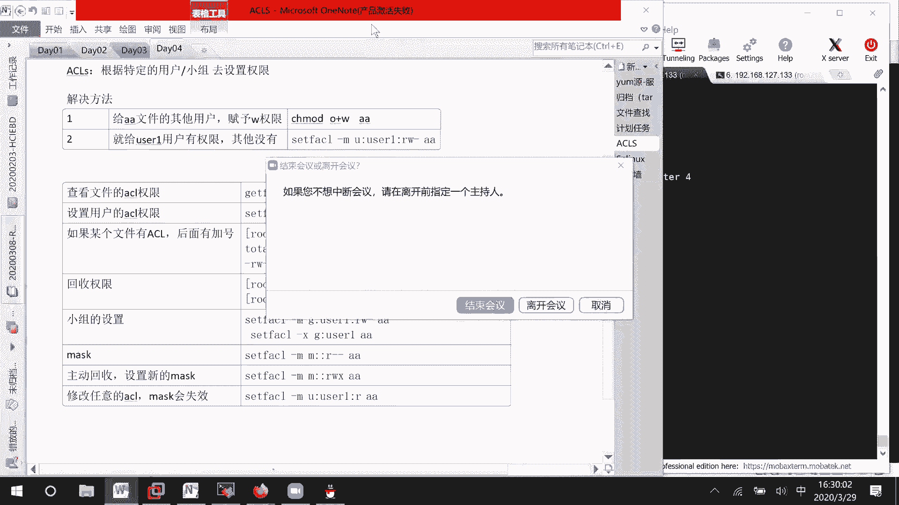

# RHCE8.0视频教程：P17：ACL权限管理详解 🔐


在本节课中，我们将要学习Linux系统中的ACL（访问控制列表）权限管理。ACL允许我们为超出传统“所有者、所属组、其他用户”三类之外的特定用户或组设置精细的文件权限，从而解决更复杂的权限分配需求。

## 传统权限模型的限制

上一节我们介绍了基本的文件权限，本节中我们来看看传统权限模型的局限性。传统的`chmod`命令只能为三类用户设置权限：文件所有者（u）、文件所属组（g）和其他用户（o）。

假设我们有三个用户：tom、bob和jerry，我们希望他们分别拥有读、写、执行权限。目前的解决办法是将tom设为文件所有者，bob设为文件所属组成员，jerry设为其他用户。

**问题在于**：如果此时来了第四个用户tkedu，我们希望他拥有读写（rw）权限，该怎么办？三类用户的权限位已经分配完毕，无法为特定用户单独设置权限。同样，如果我们需要为某个特定小组（如group1）设置rwx权限，传统方法也无法实现。

因此，我们需要引入ACL来解决三种以上实体（用户或组）的权限设置问题。

## 环境准备与基础概念

为了演示ACL，我们先创建一个实验环境。

```bash
# 切换到根目录并创建一个实验目录
cd /
mkdir acl_demo
cd acl_demo

# 创建一个测试文件
touch aa
```

此时，文件`aa`的所有者和所属组都是root。我们可以使用`ll`或`ls -l`命令查看。

```bash
ll aa
# 或
ls -l aa
```

输出可能类似于：
```
-rw-r--r--. 1 root root 0 Mar 29 10:00 aa
```

这表示所有者root可读写（rw-），所属组root可读（r--），其他用户可读（r--）。

为了后续实验方便，我们先将目录权限改为777，确保所有用户都能进入该目录。但请注意，在实际生产环境中，如此宽松的权限是危险的。

```bash
chmod 777 /acl_demo
```

## 查看文件的ACL权限

在设置ACL之前，我们先学习如何查看文件的ACL信息。使用`getfacl`命令。

```bash
getfacl aa
```

命令输出如下：
```
# file: aa
# owner: root
# group: root
user::rw-
group::r--
other::r--
```

输出清晰地显示了文件`aa`针对三类用户的权限。如果文件没有设置额外的ACL条目，其显示内容就与`ls -l`一致。

## 为用户设置ACL权限

现在，我们有一个普通用户`user1`。默认情况下，他作为“其他用户”对文件`aa`只有读权限。我们希望单独赋予`user1`写权限，而不影响其他用户。

以下是设置特定用户ACL权限的步骤：

1.  使用`setfacl`命令的`-m`（modify，修改）选项。
2.  指定规则格式：`u:用户名:权限` 或 `g:组名:权限`。
3.  最后指定文件名。

```bash
# 为user1用户添加对aa文件的读写（rw）权限
setfacl -m u:user1:rw aa
```

设置完成后，我们再次查看文件的ACL信息。

```bash
getfacl aa
```

此时输出中会多出一行：
```
user:user1:rw-
```

同时，使用`ll`命令查看文件时，权限位后面会多一个`+`号，表示该文件设置了ACL。





```
-rw-rw-r--+ 1 root root 0 Mar 29 10:00 aa
```

现在，切换到`user1`用户，验证其权限。





```bash
su - user1
cd /acl_demo
# 尝试编辑文件
vim aa
# 可以正常写入并保存退出
```

**重要提示**：在实验时，如果目录权限过大（如777），可能会导致其他用户意外修改文件属性。因此，在设置完ACL后，应将目录权限恢复为合理范围（如755）。

```bash
# 切换回root用户操作
exit
chmod 755 /acl_demo
```



## 为组设置ACL权限

除了用户，ACL也可以为特定的组设置权限。语法与为用户设置类似，只是将`u:`替换为`g:`。

假设我们有一个组`group1`，我们希望该组的所有成员对文件`aa`拥有读写权限。

```bash
# 为group1组添加对aa文件的读写（rw）权限
setfacl -m g:group1:rw aa
```

查看ACL信息确认：

```bash
getfacl aa
```
输出中会增加一行：
```
group:group1:rw-
```



## 权限掩码（mask）的作用

在ACL设置中，有一个重要的概念叫**有效权限掩码（effective mask）**。它定义了除所有者和`other`之外的所有实体（包括特定用户、特定组和所属组）所能拥有的最大有效权限。

当我们设置或修改ACL条目时，系统会自动计算并更新mask值，通常是所有ACL条目权限的并集。但我们可以手动设置mask来限制最大有效权限。

例如，当前文件`aa`的ACL可能如下：
```
user::rw-
user:user1:rwx
group::r--
group:group1:rw-
mask::rwx
other::r--
```
虽然`user1`被赋予了`rwx`权限，但`mask`是`rwx`，所以所有权限都有效。

如果我们希望所有特定用户和组的最大权限只能是读（r），可以修改mask。

```bash
# 将mask修改为只读（r）
setfacl -m m::r aa
```

再次查看ACL：
```bash
getfacl aa
```
输出中`mask`变为`r--`，并且在`user1`和`group1`的权限后面会显示`#effective:r--`，表示他们的有效权限只有读。
```
user:user1:rwx          #effective:r--
group:group1:rw-        #effective:r--
mask::r--
```

此时，即使用户`user1`的ACL条目显示`rwx`，他也只能读取文件，无法写入或执行。

要恢复原来的mask（即允许所有被赋予的权限生效），可以重新将其设置为`rwx`。

```bash
setfacl -m m::rwx aa
```

**注意**：修改任意ACL条目（用户或组）通常会导致系统重新计算并更新mask值，这可能会覆盖之前手动设置的mask。

## 回收ACL权限

当我们不再需要某个ACL条目时，需要将其移除。使用`setfacl`命令的`-x`（remove，移除）选项。

以下是回收权限的步骤：

1.  要移除特定用户的ACL：`setfacl -x u:用户名 文件名`
2.  要移除特定组的ACL：`setfacl -x g:组名 文件名`

```bash
# 移除user1用户的ACL条目
setfacl -x u:user1 aa

# 移除group1组的ACL条目
setfacl -x g:group1 aa
```

移除后，使用`getfacl aa`查看，对应的条目就会消失。当文件的所有ACL条目都被移除后，文件权限位后面的`+`号也会消失。

## 总结

本节课中我们一起学习了Linux ACL权限管理。我们了解到传统权限模型的不足，并学习了如何使用`getfacl`和`setfacl`命令来查看、设置、修改和回收针对特定用户或组的精细权限。我们还探讨了权限掩码（mask）的概念及其对有效权限的影响。

核心要点总结：
*   **查看ACL**：`getfacl <文件名>`
*   **设置/修改ACL**：`setfacl -m <u|g>:<名称>:<权限> <文件名>`
*   **移除ACL**：`setfacl -x <u|g>:<名称> <文件名>`
*   **设置掩码**：`setfacl -m m::<权限> <文件名>`
*   **标识**：设置了ACL的文件，在`ls -l`输出中权限位末尾会有`+`号。



通过掌握ACL，你可以在Linux系统中实现更灵活、更细致的文件访问控制。请在你的实验环境中多加练习，以巩固这些命令和概念。