# RHCE8.0 课程：P18：SELinux 与 Apache HTTP 服务配置


## 概述
在本节课中，我们将要学习 SELinux 的基本概念、工作原理及其配置方法。SELinux 是 Linux 系统中一个增强型的安全模块，它通过强制访问控制机制来提升系统安全性。我们还将学习如何安装和配置 Apache HTTP 服务，并通过实践理解 SELinux 标签如何影响服务的访问控制。

---

## SELinux 基础概念

上一节我们介绍了课程的整体内容，本节中我们来看看 SELinux 的核心概念。

传统的 Linux 文件权限管理称为自主访问控制。在这种模式下，管理员为文件设置权限（如 `rwx`），用户就拥有相应的操作能力。例如，若一个目录被设置为 `777` 权限，则任何用户都可以删除其中的文件。这种方式存在安全隐患。

SELinux 实现了强制访问控制机制。它的核心思想是为系统中的每个**进程**和**文件对象**都分配一个安全上下文标签。进程只能访问与其标签匹配的文件，即使该文件拥有传统的 `777` 权限，若标签不匹配，访问也会被拒绝。

**核心公式**：
```
访问成功 = 传统文件权限允许 + SELinux 上下文标签匹配
```

---

## 查看 SELinux 标签

理解了 SELinux 的工作原理后，我们需要知道如何查看这些安全标签。

查看文件或目录的 SELinux 标签，可以使用 `ls` 命令配合 `-Z` 选项。

**代码示例**：
```bash
# 创建测试文件
touch aa bb

# 查看文件的详细信息，包括 SELinux 标签
ls -lZ aa bb

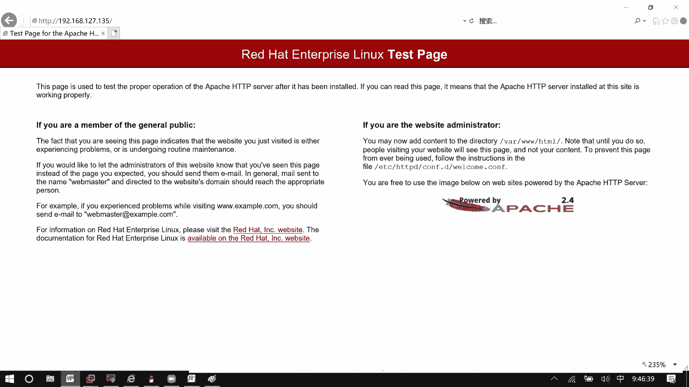

# 或仅查看标签信息
ls -Z aa bb
```
命令输出中，类似 `unconfined_u:object_r:admin_home_t:s0` 的部分就是 SELinux 安全上下文标签。

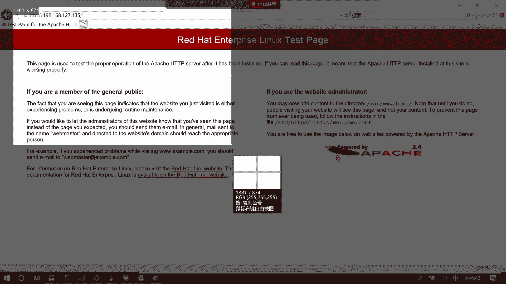

查看进程的 SELinux 标签，可以使用 `ps` 命令配合 `-Z` 选项。

**代码示例**：
```bash
# 查看所有进程及其 SELinux 标签
ps auxZ
```
在输出列表的最左侧，可以看到每个进程对应的安全上下文。

---

## 实践：Apache HTTP 服务与 SELinux

为了更直观地理解 SELinux 标签的作用，我们将通过 Apache HTTP 服务进行实践。首先需要安装并配置该服务。

### 配置本地 YUM 源并安装 Apache

如果系统没有可用的 YUM 源，需要先进行配置。

以下是配置步骤：
1.  创建 YUM 源配置文件。
2.  挂载系统安装镜像。
3.  安装 `httpd` 软件包。

**代码示例**：
```bash
# 1. 创建 YUM 源配置文件
cat > /etc/yum.repos.d/local.repo << EOF
[BaseOS]
name=BaseOS
baseurl=file:///mnt/BaseOS
gpgcheck=0

[AppStream]
name=AppStream
baseurl=file:///mnt/AppStream
gpgcheck=0
EOF

# 2. 挂载安装镜像（假设光盘设备为 /dev/sr0）
mkdir -p /mnt
mount /dev/sr0 /mnt

# 3. 安装 Apache HTTP 服务器
yum install -y httpd
```

### 启动服务并测试基础访问

安装完成后，启动服务并确保能正常访问默认页面。

**代码示例**：
```bash
# 启动 httpd 服务
systemctl start httpd

# 暂时关闭防火墙以避免干扰
systemctl stop firewalld

# 通过浏览器访问服务器IP，例如 http://192.168.127.135
# 应能看到 Apache 的默认测试页面
```

### Apache 基础配置简介

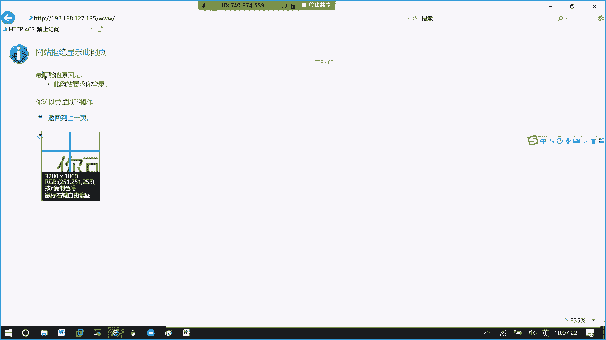

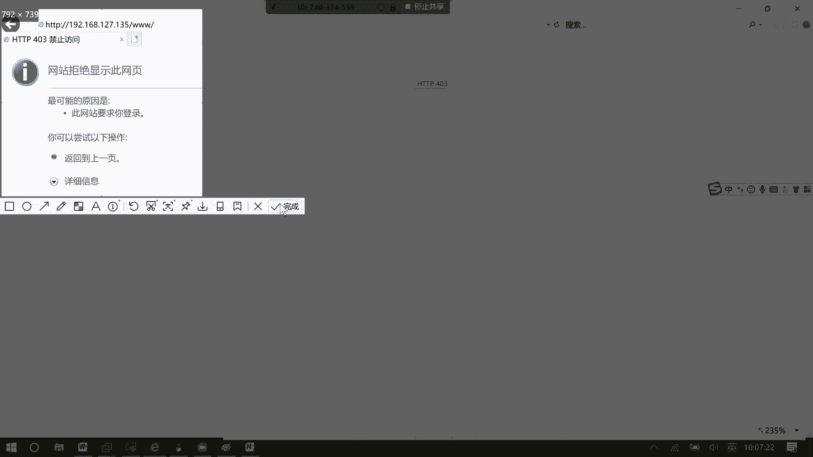

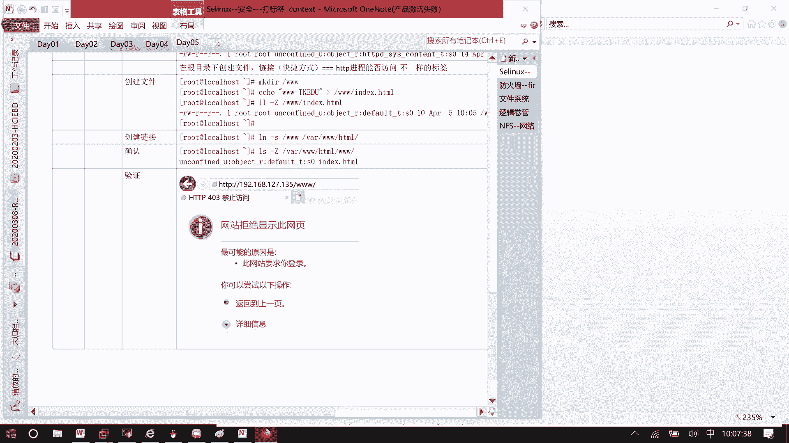

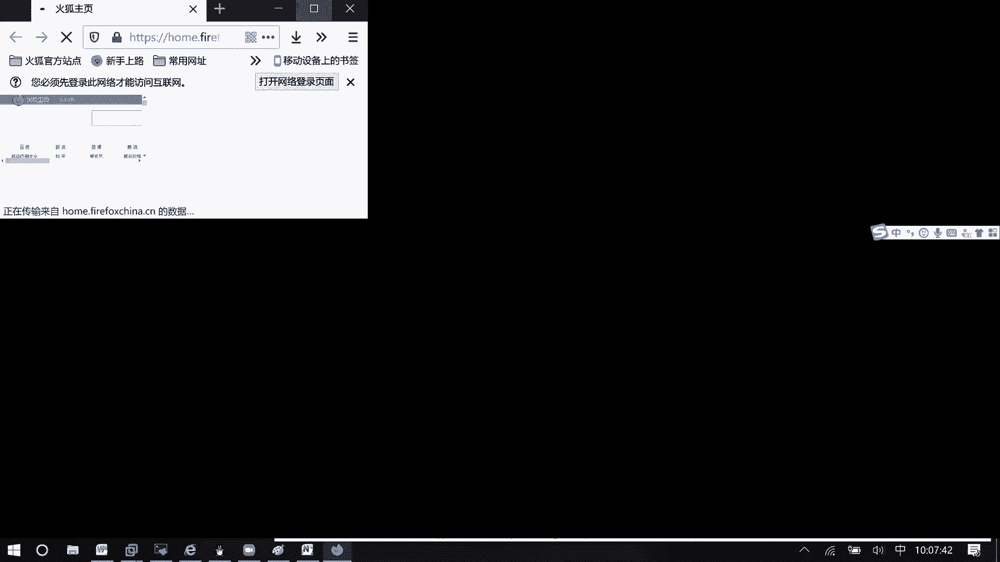

了解服务的基本配置有助于后续实验。Apache 的主配置文件是 `/etc/httpd/conf/httpd.conf`。

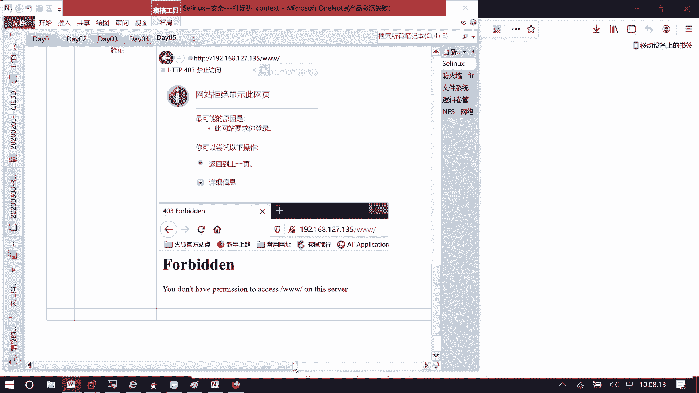

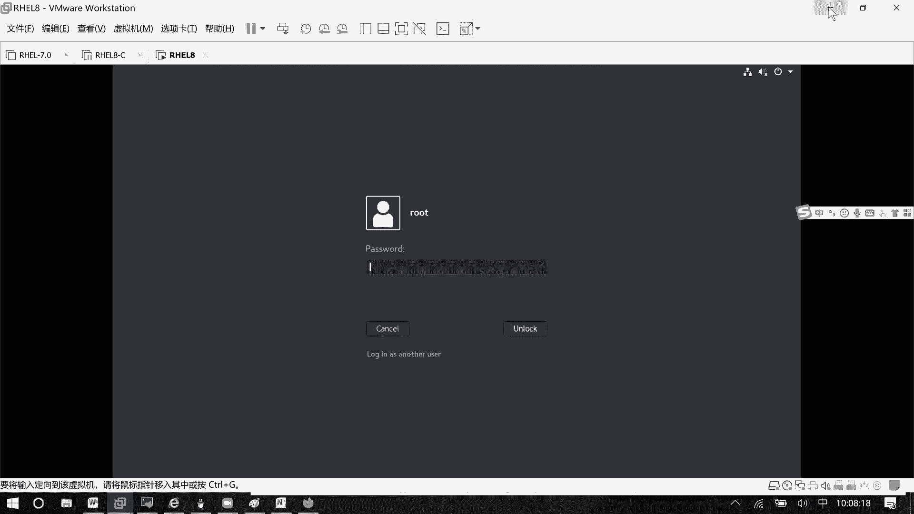

以下是几个关键配置项的解释：
*   **`ServerRoot`**：指定服务器配置文件的根目录。
*   **`Listen`**：指定监听的端口号，例如 `Listen 80`。
*   **`User` / `Group`**：指定运行 Apache 服务的用户和组，默认为 `apache`。此类系统用户通常被设置为 `nologin` 以增强安全。
*   **`DocumentRoot`**：指定网站文件的根目录，默认为 `/var/www/html`。客户端请求将从此目录开始查找文件。
*   **`DirectoryIndex`**：指定默认访问的索引文件，默认为 `index.html`。

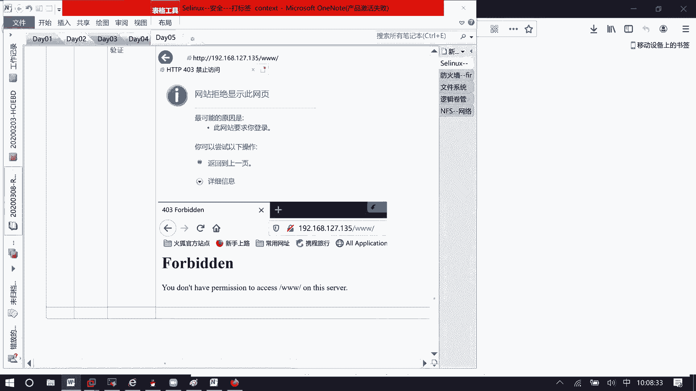

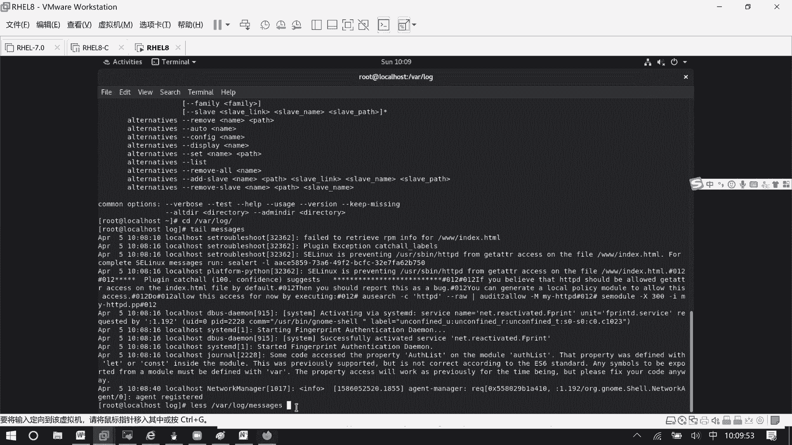

---

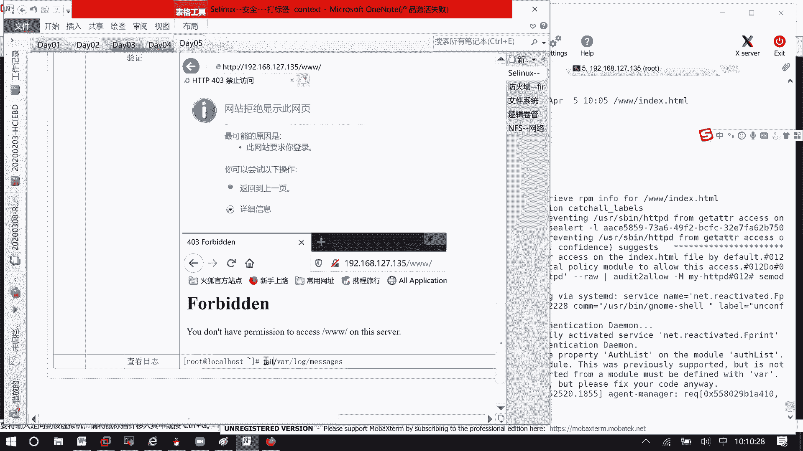

## SELinux 标签实践：访问控制

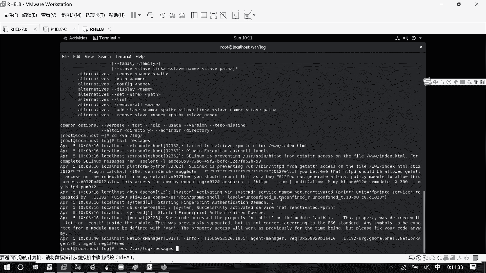

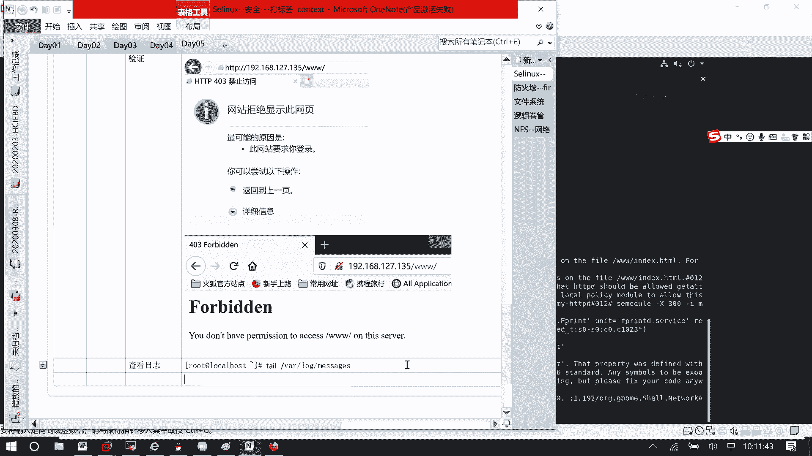

现在，我们将通过实验观察 SELinux 标签如何控制 Apache 进程对文件的访问。

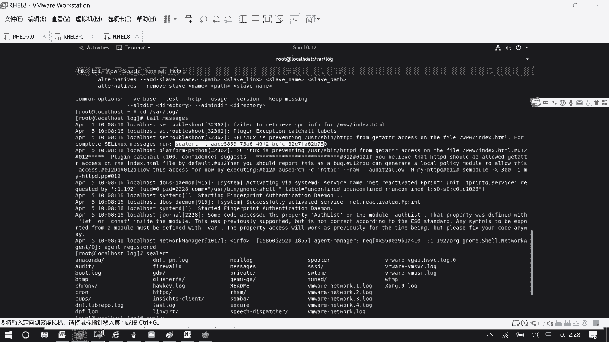

### 实验一：标签不匹配导致访问失败

1.  在根目录下创建一个新目录和文件，其默认 SELinux 标签与 Web 目录不同。
2.  在 Apache 的文档根目录中创建指向该目录的符号链接。
3.  通过浏览器访问该链接，将会被拒绝。

**代码示例**：
```bash
# 1. 在根目录创建测试目录和文件
mkdir /www
echo "Test Page" > /www/index.html

# 2. 查看其默认标签，应为类似 default_t 的类型
ls -Zd /www

# 3. 在 Apache 文档根目录创建符号链接
ln -s /www /var/www/html/

# 4. 通过浏览器访问 http://服务器IP/www/
# 预期结果：返回 403 Forbidden 错误
```
访问被拒绝的原因是 Apache 进程的标签是 `httpd_t`，它默认只能访问标签为 `httpd_sys_content_t` 的文件，而 `/www` 目录的标签是 `default_t`，两者不匹配。

### 实验二：修改标签恢复访问

要使 Apache 能够访问 `/www` 目录，需要将其 SELinux 标签修改为 Web 服务允许的类型。

有以下两种修改方式：

**方法一：直接指定目标标签类型**
```bash
# 将 /www 目录及其下所有内容的标签改为 httpd_sys_content_t
chcon -R -t httpd_sys_content_t /www
```

**方法二：引用现有正确文件的标签**
```bash
# 先将标签恢复为默认值（仅用于演示）
restorecon -R /www

# 引用 /var/www/html 的标签赋给 /www
chcon -R --reference=/var/www/html /www
```
执行以上任一命令后，再次通过浏览器访问 `http://服务器IP/www/`，即可成功看到页面内容。

---

## 管理 SELinux 默认文件上下文

手动修改的标签在文件系统被重新标记（如执行 `restorecon`）后会恢复。若要永久生效，需要修改默认文件上下文规则。

以下是管理默认上下文的命令：

**查看所有默认上下文规则**：
```bash
semanage fcontext -l
```

**添加新的默认上下文规则**：
```bash
# 为 /www 目录及其下所有文件设置永久默认标签
semanage fcontext -a -t httpd_sys_content_t "/www(/.*)?"
# 使新规则立即生效
restorecon -Rv /www
```

**删除自定义的默认上下文规则**：
```bash
semanage fcontext -d "/www(/.*)?"
```

---

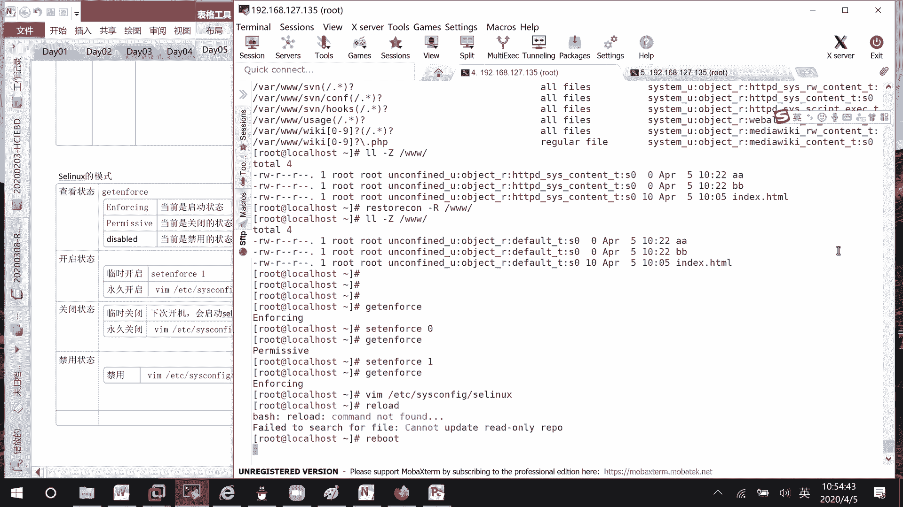

## SELinux 运行模式


SELinux 有三种运行模式，用于控制其安全策略的执行强度。

**查看当前 SELinux 模式**：
```bash
getenforce
# 可能返回值：Enforcing, Permissive, Disabled
```

**临时更改 SELinux 模式**：
```bash
# 设置为强制模式（阻止并记录违规）
setenforce 1
# 设置为宽容模式（仅记录违规，不阻止）
setenforce 0
```

**永久更改 SELinux 模式**：
需要编辑配置文件 `/etc/selinux/config`，修改 `SELINUX=` 后的值：
*   `SELINUX=enforcing`：强制模式。
*   `SELINUX=permissive`：宽容模式。
*   `SELINUX=disabled`：禁用 SELinux。

**注意**：从 `disabled` 切换到 `enforcing` 或 `permissive` 后，必须重启系统。模式切换主要影响系统是否强制执行安全策略。

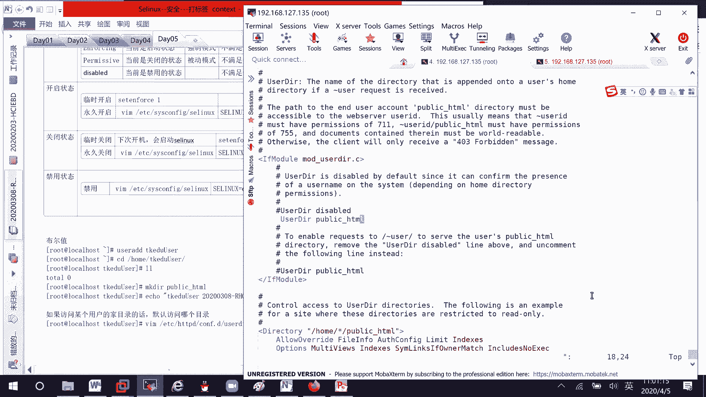

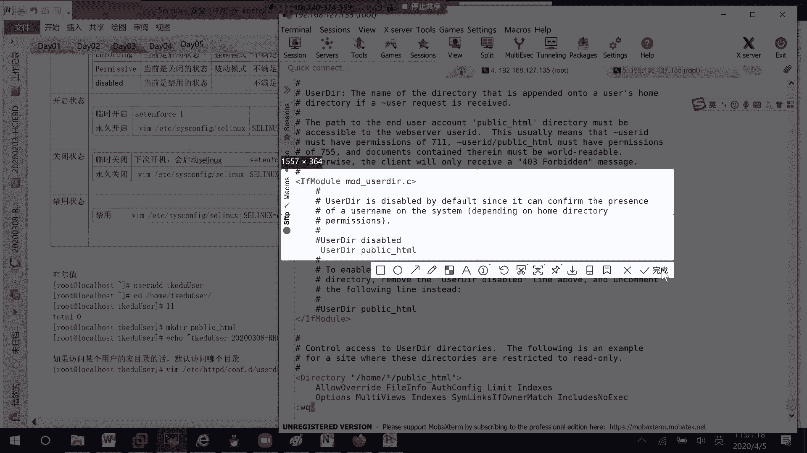

---

## SELinux 布尔值

SELinux 布尔值是一些预定义的开关，可以精细控制特定服务或功能是否被 SELinux 策略允许。

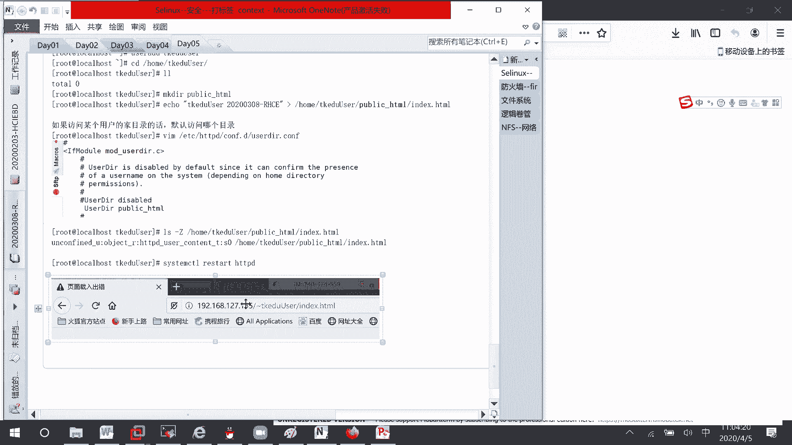

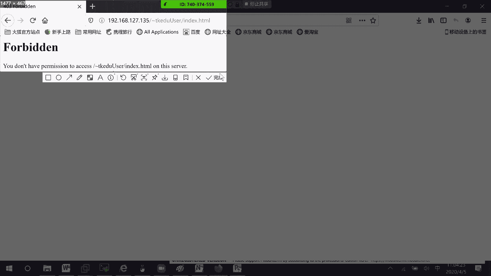

**列出所有布尔值**：
```bash
getsebool -a
```

**查找与 Apache 相关的布尔值**：
```bash
getsebool -a | grep httpd
```

**启用或禁用布尔值**：
```bash
# 临时启用一个布尔值
setsebool httpd_enable_homedirs on

# 永久启用一个布尔值（-P 参数）
setsebool -P httpd_enable_homedirs on
```

**实践示例：允许 Apache 访问用户家目录**
默认情况下，Apache 无法访问用户家目录中的网站。即使标签正确，也需要打开对应的布尔值开关。
1.  创建一个用户并在其家目录建立 `public_html` 文件夹和 `index.html` 文件。
2.  配置 Apache 以支持用户目录访问（修改 `/etc/httpd/conf.d/userdir.conf`，设置 `UserDir public_html` 并启用 `UserDir` 指令）。
3.  尝试通过 `http://服务器IP/~用户名/` 访问，此时可能因 SELinux 而失败。
4.  启用相关布尔值：
    ```bash
    setsebool -P httpd_enable_homedirs on
    ```
5.  重启 Apache 服务后，即可成功访问。

---

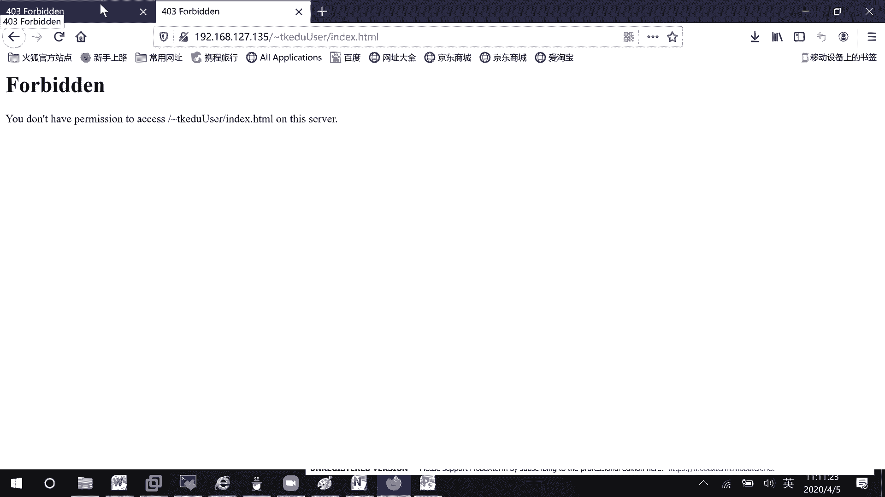

## 总结
本节课中我们一起学习了 SELinux 的核心安全机制。我们理解了强制访问控制与传统自主访问控制的区别，掌握了如何查看和修改文件与进程的 SELinux 安全上下文标签。通过配置 Apache HTTP 服务的实践，我们直观地体验了标签不匹配导致的访问拒绝，并学会了通过 `chcon`、`semanage fcontext` 命令来修复问题。此外，我们还学习了如何切换 SELinux 的运行模式，以及如何使用布尔值对安全策略进行更精细的控制。这些知识是构建安全 Linux 系统环境的重要基础。