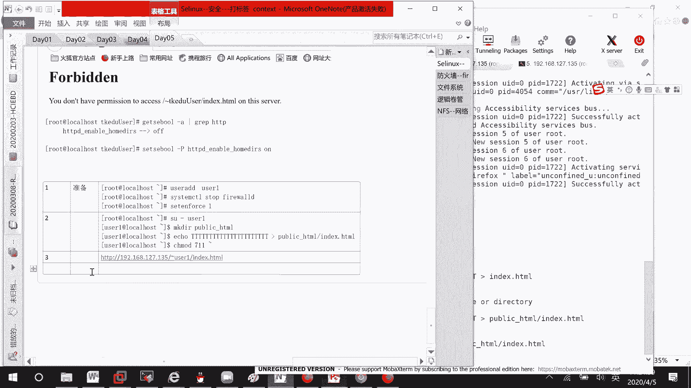
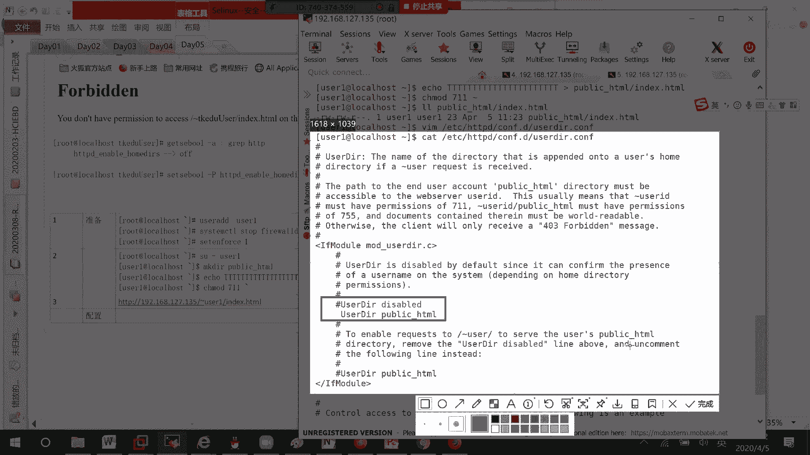
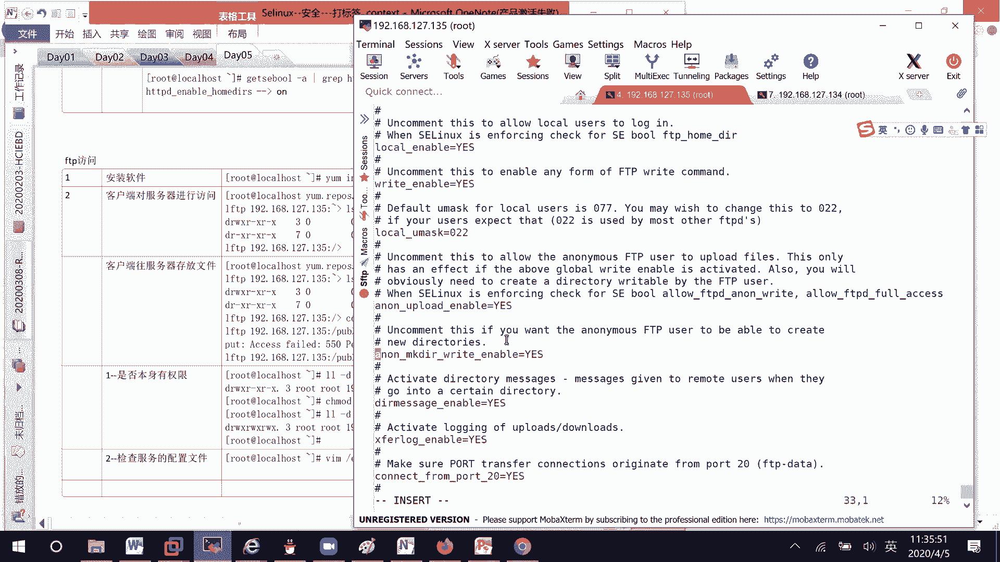
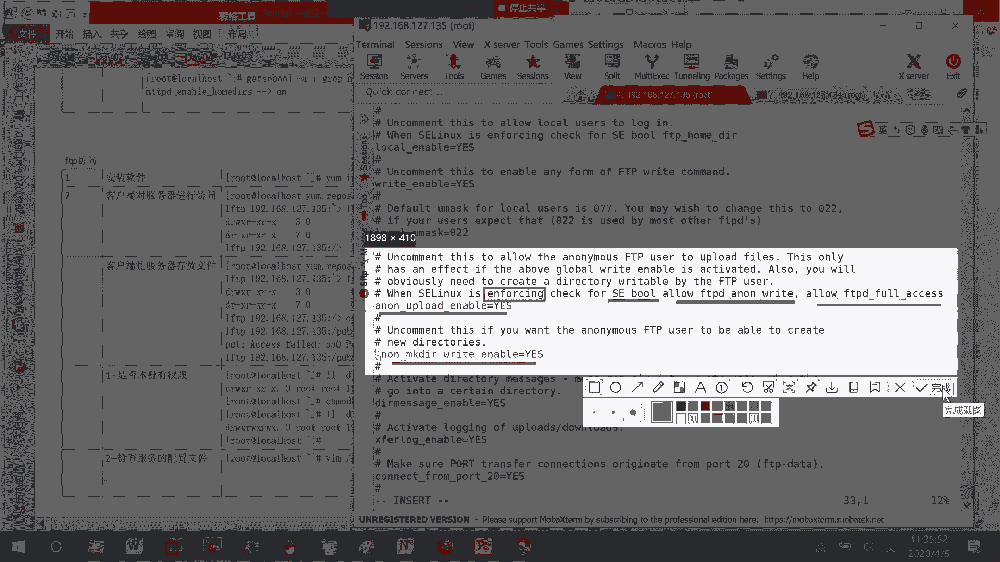
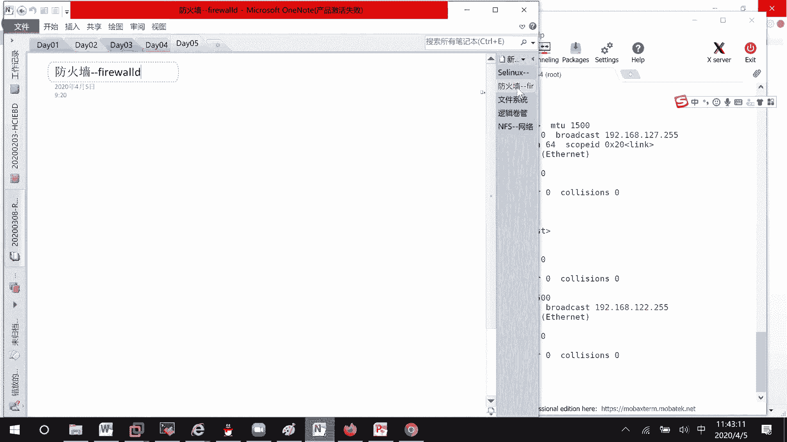

# RHCE8.0视频教程：P19：配置用户目录访问与FTP服务


## 概述
在本节课中，我们将学习如何配置Apache HTTP服务器以允许用户通过个人目录访问网页，以及如何配置和排错VSFTPD服务，使其支持匿名用户上传文件。课程将涵盖权限设置、服务配置和SELinux布尔值调整等核心操作。

---

## 准备工作：创建用户与目录
上一节我们介绍了服务配置的基本概念，本节中我们来看看具体的准备工作。首先，我们需要创建一个测试用户并为其建立网页目录。



1.  创建用户 `user1`：
    ```bash
    useradd user1
    ```
2.  停止防火墙并禁用SELinux（仅为演示环境，生产环境需谨慎）：
    ```bash
    systemctl stop firewalld
    setenforce 0
    ```
3.  切换到 `user1` 用户，创建个人网页目录及文件：
    ```bash
    su - user1
    mkdir public_html
    cd public_html
    echo "Hello World" > index.html
    ```
4.  为确保Apache进程（其他用户）能访问该目录，需将用户家目录下的 `public_html` 目录权限设置为 `711`：
    ```bash
    chmod 711 ~/public_html
    ```
    **注意**：仅修改目录本身权限，不要使用 `-R` 递归修改其内部文件。



---

## 配置Apache以支持用户目录访问
准备工作完成后，我们需要配置Apache来识别和提供用户个人目录中的网页内容。

1.  编辑Apache的用户目录配置文件：
    ```bash
    vi /etc/httpd/conf.d/userdir.conf
    ```
2.  找到 `UserDir disabled` 一行并将其注释掉（在行首添加 `#`）。然后，取消 `UserDir public_html` 一行的注释（移除行首的 `#`）。修改后的关键部分应如下所示：
    ```apache
    # UserDir disabled
    UserDir public_html
    ```
3.  配置修改后，需要重启Apache服务使其生效：
    ```bash
    systemctl restart httpd
    ```

---

## 调整SELinux布尔值
即使Apache配置正确，若SELinux处于强制模式且相关布尔值未开启，访问仍会失败。因此，我们需要调整SELinux策略。

1.  查询与HTTP用户目录相关的SELinux布尔值：
    ```bash
    getsebool -a | grep httpd_enable_homedirs
    ```
2.  默认该值为 `off`。我们需要将其设置为 `on`：
    ```bash
    setsebool -P httpd_enable_homedirs on
    ```
    **参数解释**：`-P` 选项使设置永久生效，即使系统重启。
3.  完成以上所有步骤后，即可通过浏览器访问 `http://服务器IP/~user1` 来查看 `user1` 的个人网页。

**关键点回顾**：访问失败时，应依次检查**目录文件权限**、**服务配置**和**SELinux布尔值**。

---

## 配置VSFTPD服务支持匿名上传
接下来，我们学习如何配置VSFTPD服务，允许匿名用户上传文件。这涉及到服务安装、配置文件修改和SELinux设置。

### 安装与启动VSFTPD
以下是安装并启动VSFTPD服务的步骤。

1.  在服务器端安装 `vsftpd` 软件包：
    ```bash
    yum install vsftpd -y
    ```
2.  启动VSFTPD服务并设置为开机自启：
    ```bash
    systemctl start vsftpd
    systemctl enable vsftpd
    ```



### 客户端连接测试
从另一台客户端机器尝试连接FTP服务器。



1.  客户端需要安装FTP客户端工具（如 `lftp`）：
    ```bash
    yum install lftp -y
    ```
2.  使用 `lftp` 匿名连接服务器：
    ```bash
    lftp 192.168.127.135
    ```
3.  连接成功后，使用 `ls` 命令可看到服务器默认的共享目录，如 `pub`。

### 排错：解决文件上传失败问题
尝试上传文件时，可能会遇到权限错误。以下是系统性的排错步骤。

#### 1. 检查目录权限
匿名用户上传文件的目标目录（如 `/var/ftp/pub`）必须对“其他用户”有写权限。
```bash
chmod 777 /var/ftp/pub
```

#### 2. 修改VSFTPD配置文件
需要修改配置文件以允许匿名用户登录和上传。
1.  编辑配置文件：
    ```bash
    vi /etc/vsftpd/vsftpd.conf
    ```
2.  确保以下两个参数被正确设置：
    ```ini
    anonymous_enable=YES          # 允许匿名登录
    anon_upload_enable=YES        # 允许匿名用户上传文件
    ```
3.  修改配置后，重启服务：
    ```bash
    systemctl restart vsftpd
    ```

#### 3. 调整SELinux布尔值
当SELinux开启时，即使完成上述两步，上传仍可能被阻止。必须开启相关的布尔值。
1.  查找与FTP匿名写入相关的布尔值：
    ```bash
    getsebool -a | grep ftp
    ```
2.  将关键布尔值设置为 `on`：
    ```bash
    setsebool -P allow_ftpd_anon_write on
    setsebool -P ftpd_full_access on
    ```
3.  完成此步骤后，再次尝试上传文件，应能成功。

**核心概念**：SELinux布尔值是精细控制服务在SELinux环境下能执行哪些操作的开关。仅当SELinux处于 `enforcing` 模式时，布尔值的设置才起作用。

---

## 总结
本节课中我们一起学习了两个重要的服务配置场景。
1.  **Apache用户目录访问**：我们通过创建用户目录、配置 `UserDir` 模块以及设置 `httpd_enable_homedirs` 这个SELinux布尔值，实现了通过网页访问用户个人目录的功能。
2.  **VSFTPD匿名上传配置**：我们安装了VSFTPD，通过修改配置文件允许匿名登录和上传，并通过调整目录权限和 `allow_ftpd_anon_write` 等SELinux布尔值，解决了文件上传遇到的权限问题。



处理服务访问或权限问题时，请始终遵循清晰的排查思路：**检查基础权限** -> **验证服务配置** -> **确认SELinux状态与布尔值**。