# RHCE8.0视频教程：P20：防火墙基础与区域管理


在本节课中，我们将要学习Red Hat Enterprise Linux 8中的防火墙基础概念，特别是`firewalld`服务及其核心的“区域”管理机制。我们将了解如何查看和配置防火墙区域，为后续的规则配置打下基础。

## 防火墙概述

上一节我们介绍了系统安全的基本概念，本节中我们来看看Linux系统中的防火墙。防火墙是用于控制网络访问的安全工具。在RHCE考试中，可能会要求你配置防火墙规则，例如，允许或禁止特定用户或IP地址访问某项服务（如SSH）。

除了`firewalld`，系统还有其他访问控制机制，例如`/etc/hosts.allow`和`/etc/hosts.deny`文件。这两个文件遵循“允许优先”原则：
*   如果两个文件都未配置，则规则不生效。
*   如果`hosts.deny`中配置了用户，则该用户被拒绝访问。
*   如果`hosts.allow`中配置了用户，则系统首先检查此文件；若用户不在允许列表中，则所有用户都会被拒绝访问。

关于`hosts.allow`和`hosts.deny`的详细演示已在SSH相关章节讲解，此处不再重复。本节课重点讲解`firewalld`。

## 启动与检查firewalld服务

在企业环境中，防火墙通常需要开启以防范网络攻击。首先，我们需要确保`firewalld`服务已启动并设置为开机自启。

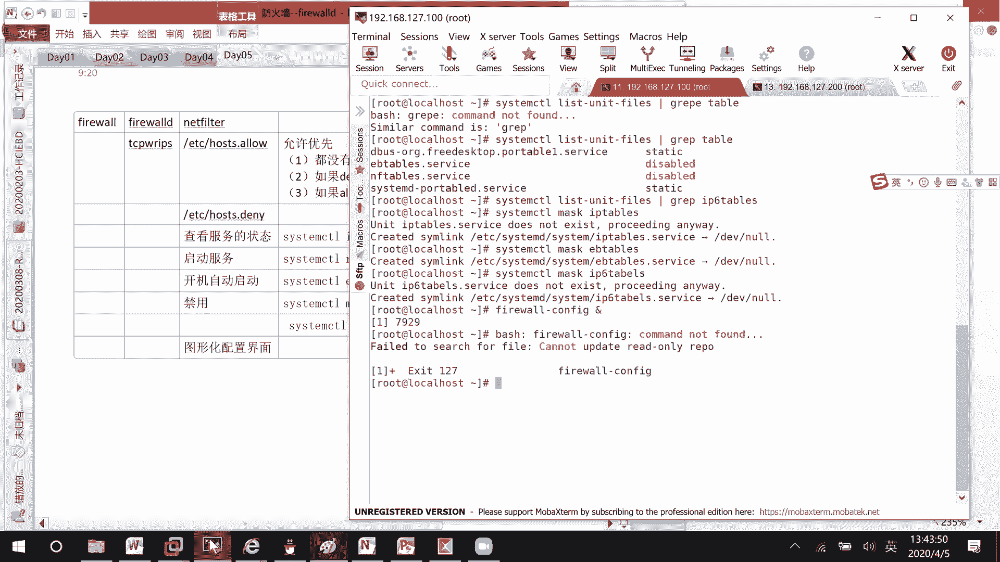

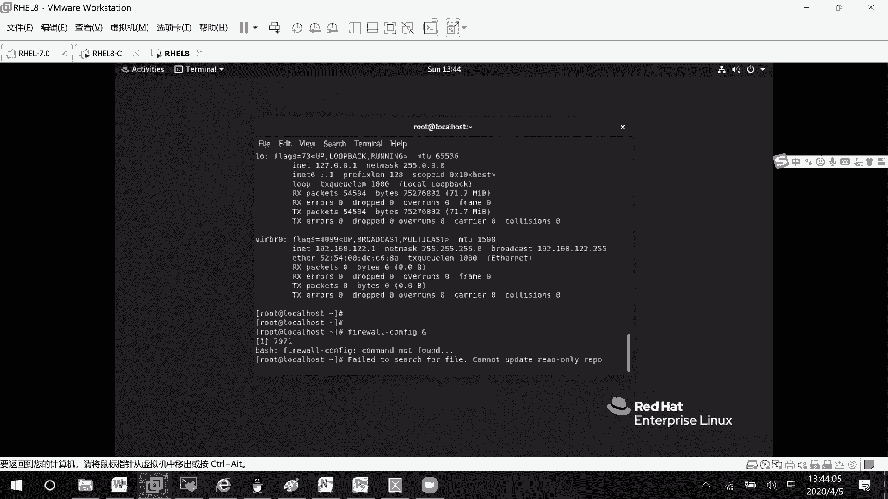

以下是相关命令：
```bash
# 检查firewalld服务状态
systemctl status firewalld

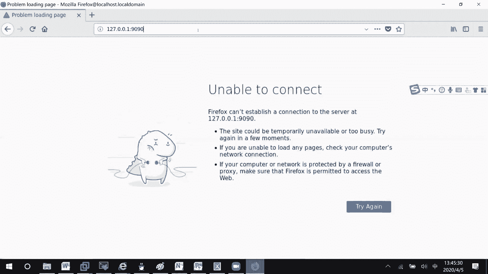

# 启动firewalld服务
systemctl start firewalld

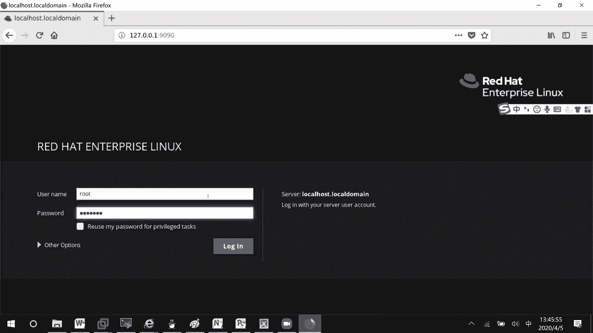

# 设置firewalld开机自启
systemctl enable firewalld

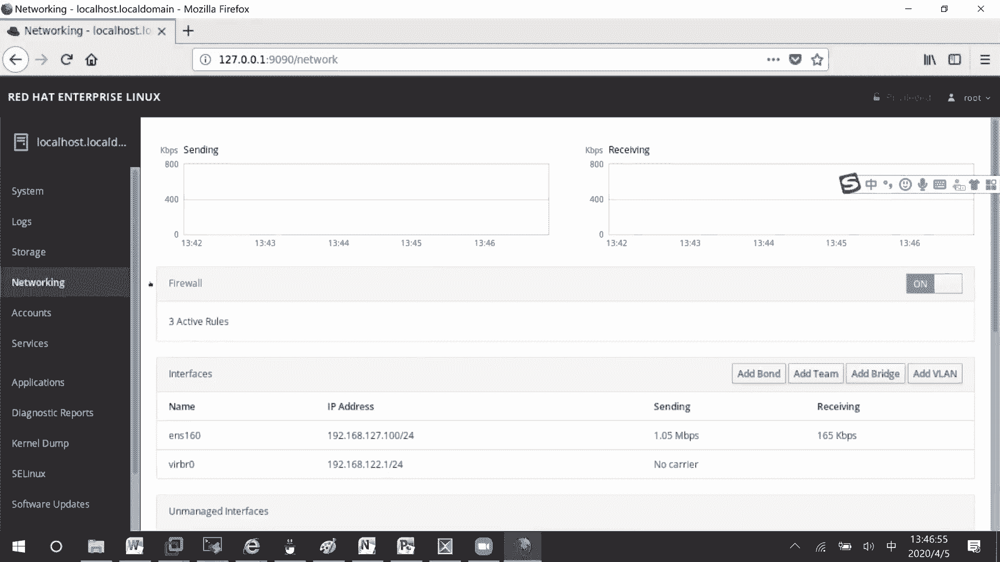

# 确认服务状态为active (running) 和 enabled
systemctl is-active firewalld
systemctl is-enabled firewalld
```

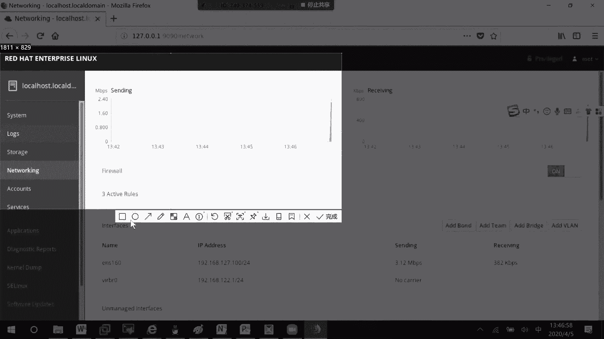

为了避免与系统中其他防火墙工具（如`iptables`、`ebtables`）冲突，可以禁用它们：
```bash
# 禁用iptables服务（如果存在）
systemctl mask iptables
systemctl mask ebtables
```
这只是为了避免干扰，在考试中并非必需步骤。

## 图形化管理界面（Cockpit）

在RHEL 8中，红帽提供了一个集成的Web管理界面——Cockpit。它可以通过浏览器对系统进行多项管理，包括防火墙配置。

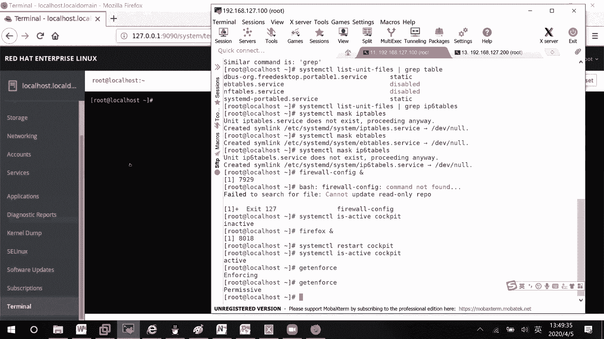

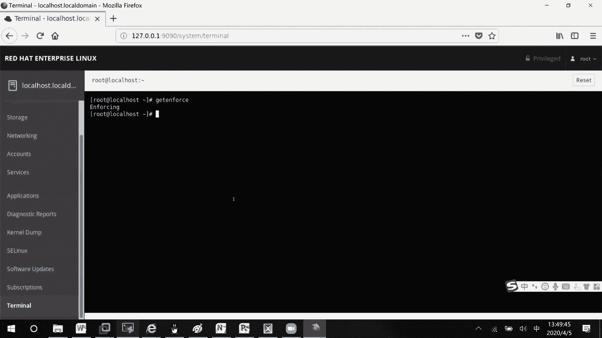

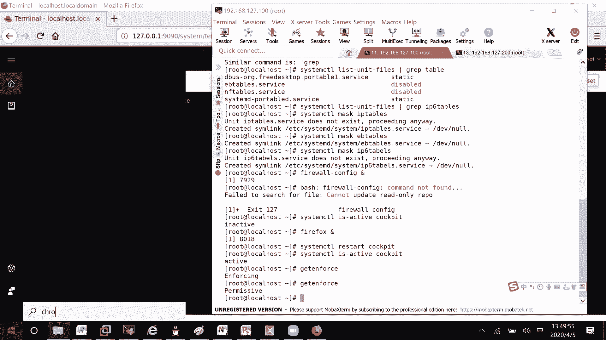

默认情况下，Cockpit服务可能是关闭的。需要先启动它：
```bash
# 启动Cockpit服务
systemctl start cockpit.socket


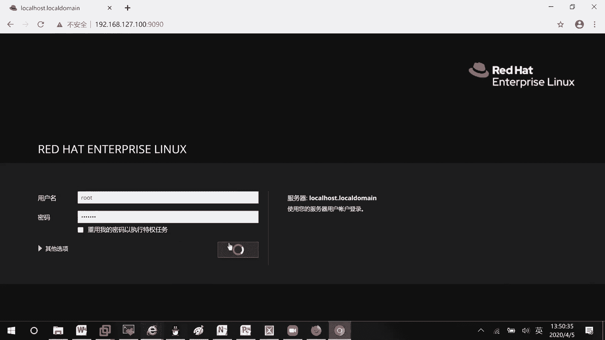

# 检查服务状态
systemctl status cockpit.socket
```
启动后，在浏览器中访问 `https://<服务器IP地址>:9090`，使用系统用户（如root）登录即可。

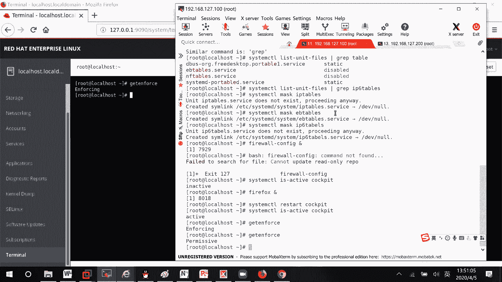

在Cockpit的“网络”部分，可以找到防火墙的配置选项。这是一个直观的图形化配置方式。

## 理解防火墙核心：区域（Zone）

上一节我们提到了图形化配置，本节中我们来看看防火墙的核心命令行配置概念——区域（Zone）。区域是**预定义或自定义的规则集合**，可以理解为不同安全级别的“安全策略模板”。

你可以将服务器的不同网络接口（网卡）分配到不同的区域。这样，流经该接口的网络流量就会受到该区域所定义规则的控制。

**区域类比**：可以将区域想象成大楼的不同安全区域（如公共大厅、办公区、研发区）。每个区域（Zone）有自己的安保规则（防火墙规则）。网络接口（Interface）就像进入这些区域的门。数据包从哪个门（接口）进入，就遵守哪个区域（Zone）的安检规则。

RHEL内置了多个预定义区域，按信任度从低到高大致排序如下：
*   **drop**：丢弃所有传入连接，且不回复。
*   **block**：拒绝所有传入连接，但会回复一条拒绝消息。
*   **public**：**默认区域**。适用于不信任的公共网络，仅允许选定的传入连接。
*   **external**：适用于启用了伪装的外部网络。
*   **dmz**：用于非军事区（隔离区）内的设备。
*   **work**：适用于工作场所网络，信任大部分机器。
*   **home**：适用于家庭网络，信任其他机器。
*   **internal**：适用于内部网络，信任其他机器。
*   **trusted**：信任所有网络连接。

以下是查看和管理区域的命令：
```bash
# 查看所有可用区域
firewall-cmd --get-zones

# 查看默认区域
firewall-cmd --get-default-zone

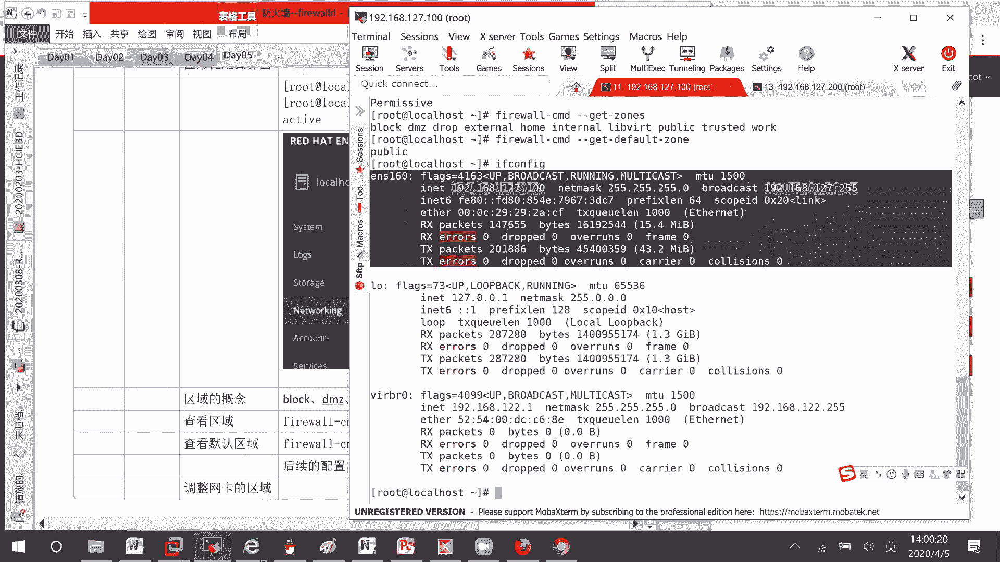

# 设置默认区域（例如，设置为 home）
firewall-cmd --set-default-zone=home
```
**重要**：对区域规则的修改，会实时应用到所有属于该区域的网络接口上。

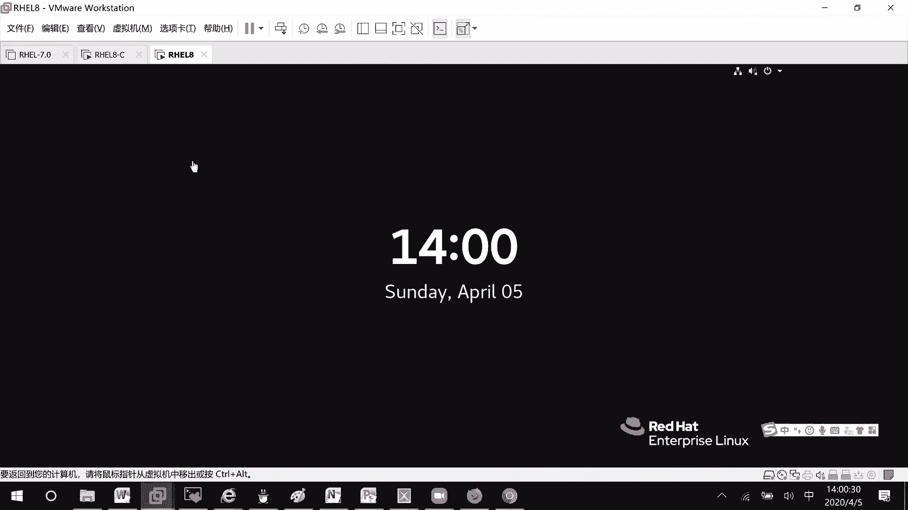

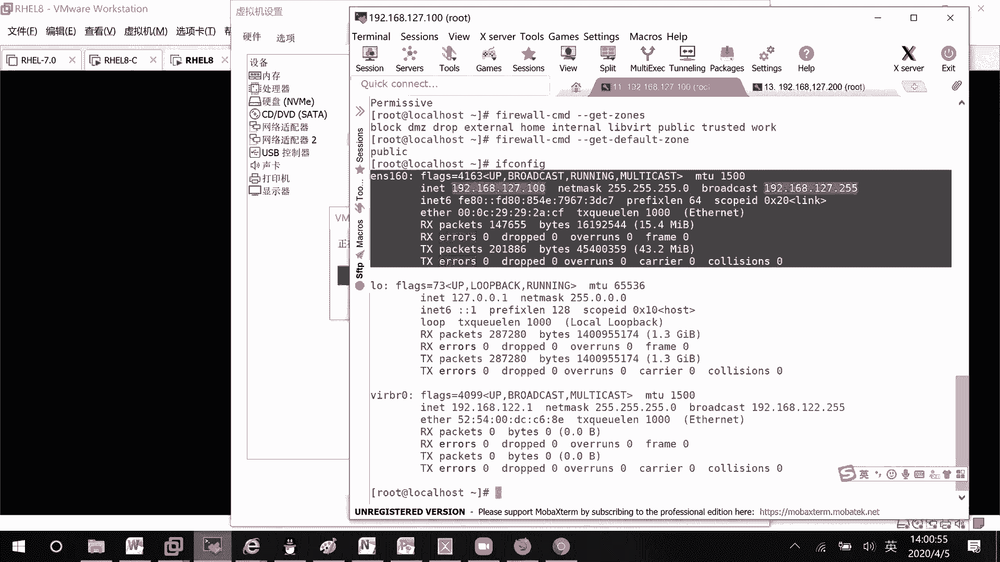

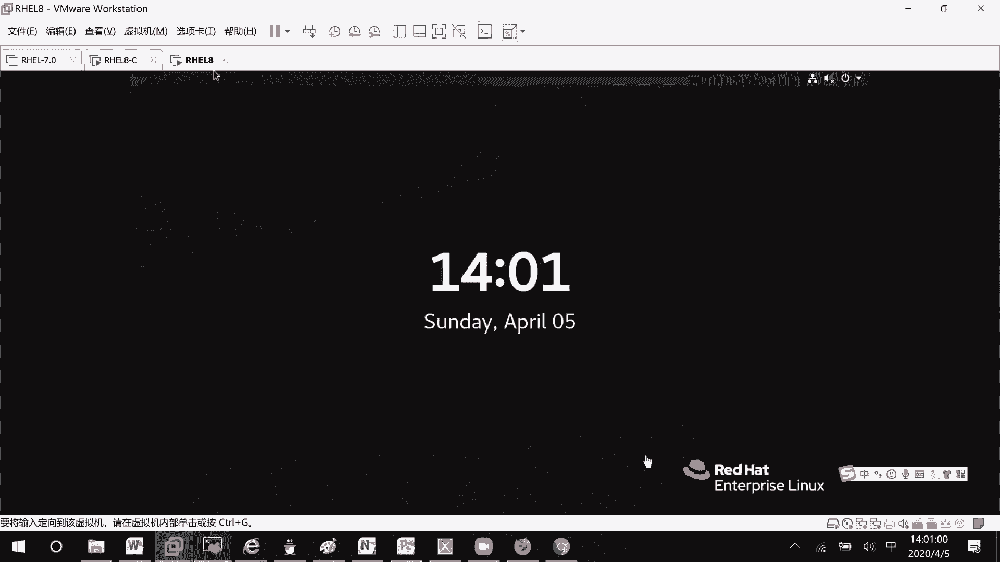

## 总结

本节课中我们一起学习了RHEL 8防火墙的基础知识。我们了解了`firewalld`服务的作用，学会了如何启动服务和禁用冲突组件。我们介绍了通过Cockpit进行图形化管理的便捷方式。最重要的是，我们深入理解了**防火墙区域（Zone）**的概念，它是**规则集合**，通过将网络接口关联到不同区域来实现差异化的访问控制，并学会了查看和修改默认区域。

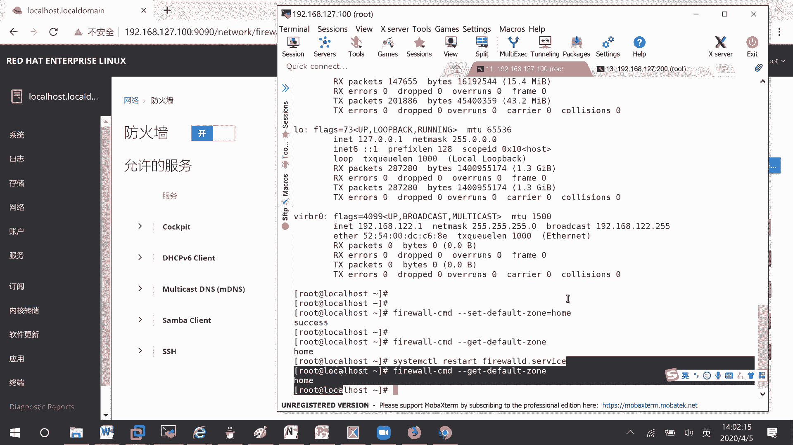


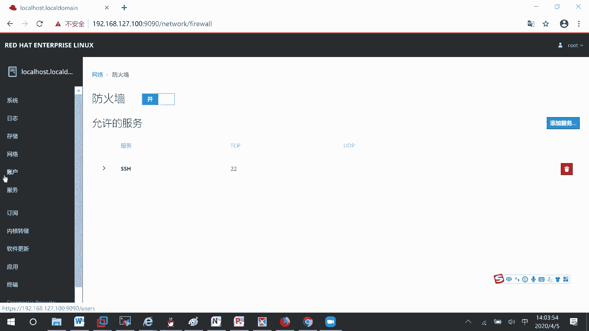

理解区域是后续配置具体防火墙规则（如开放端口、允许服务）的关键。在下一节中，我们将学习如何将接口绑定到特定区域，以及如何在区域中添加或移除规则。