# RHCE8.0视频教程：P23：磁盘管理进阶（格式化、挂载与交换分区）


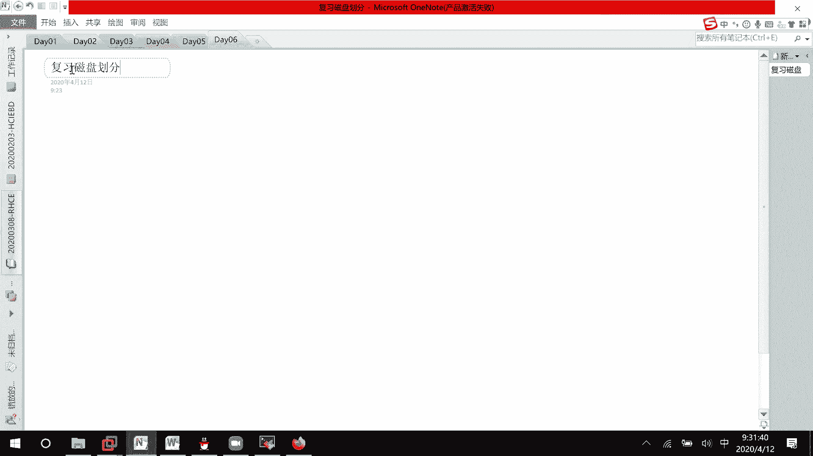

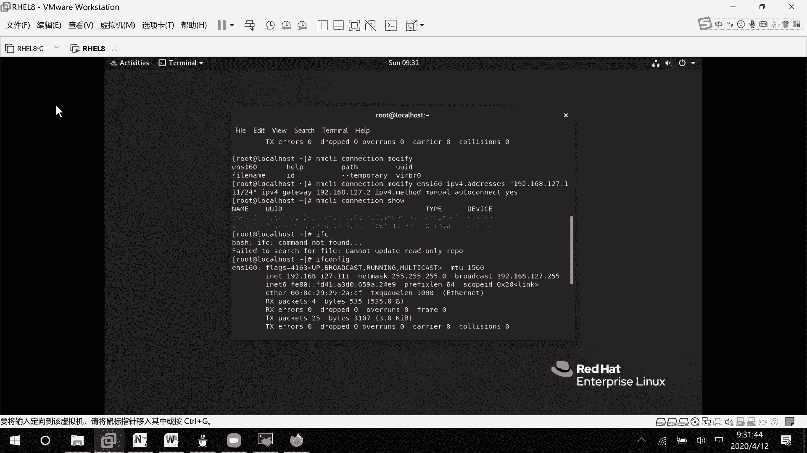

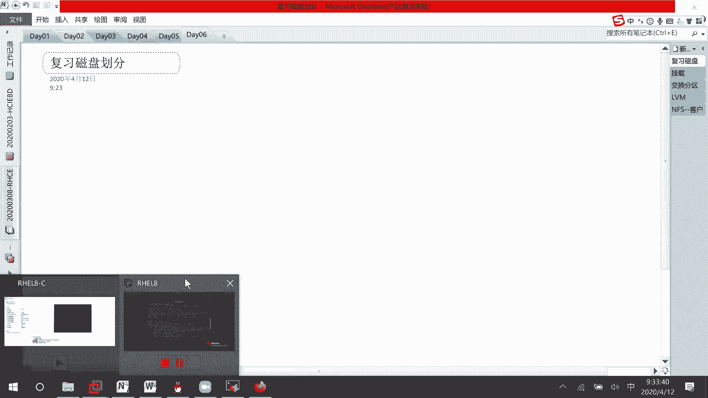

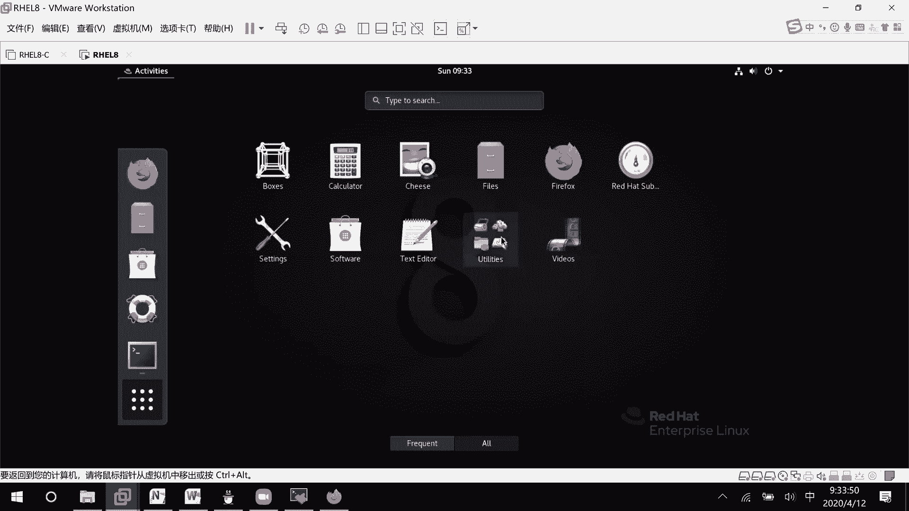

在本节课中，我们将深入学习磁盘管理的进阶知识。我们将复习磁盘划分，并重点讲解格式化、临时与永久挂载，以及如何创建和管理交换分区。这些技能对于系统管理员来说至关重要，也是RHCE认证考试中的常见考点。

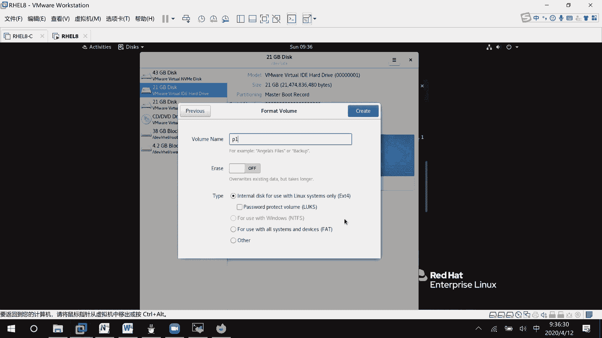

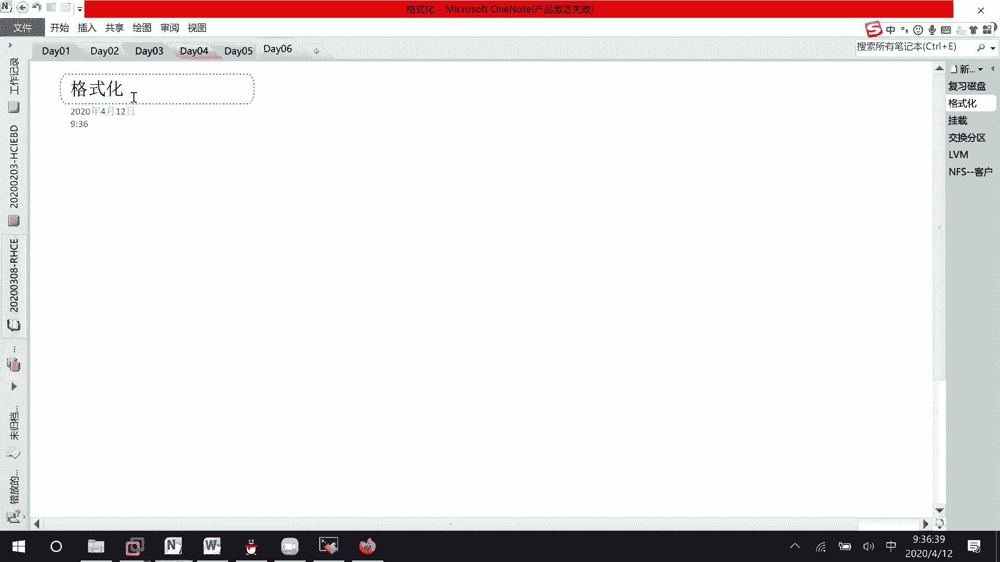

## 磁盘划分复习 🗂️

上一节我们介绍了磁盘划分的基本命令，本节我们通过图形化界面来回顾一下这个过程。

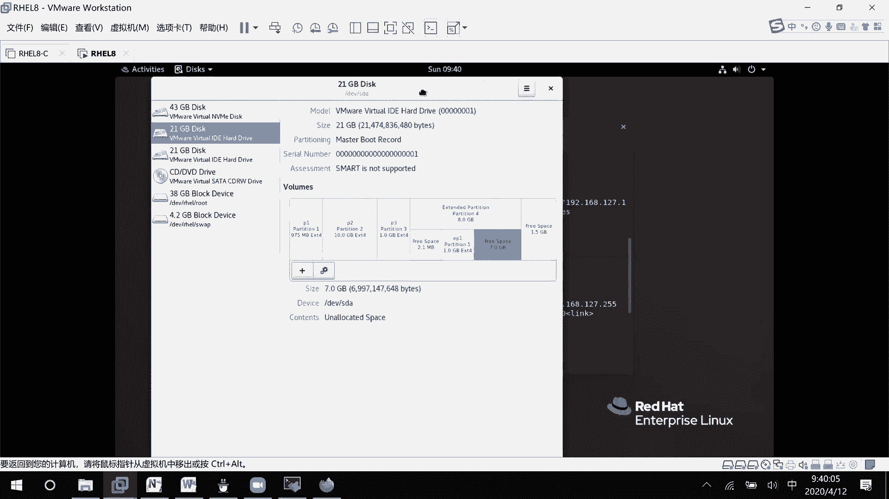

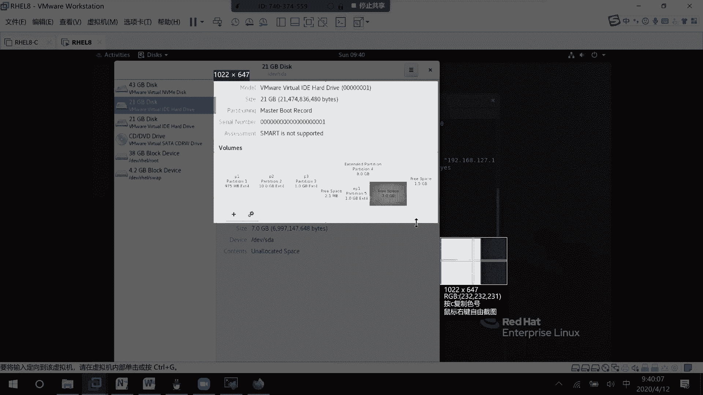

在图形化工具中，我们可以清晰地看到磁盘状态并进行操作。例如，对于一个新添加的IDE硬盘，初始状态显示为“unknown”。我们可以通过点击“Format”按钮对整个磁盘进行格式化，将其初始化为一个单一分区。

在格式化前，需要为磁盘选择一个分区表类型。如果磁盘容量大于2TB，建议选择GPT格式；否则，可以选择MBR格式。MBR格式有一个重要限制：**最多只能创建4个主分区**。如果我们需要更多分区，就必须先创建一个扩展分区，然后在扩展分区内划分逻辑分区。

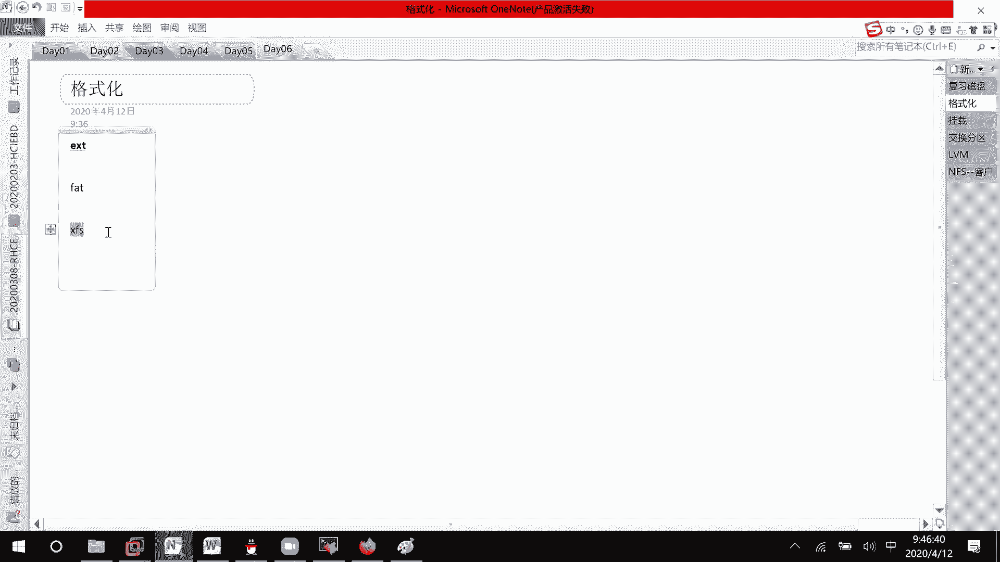

以下是使用`fdisk`命令进行分区的示例流程：
```bash
fdisk /dev/sdb
# 在交互式界面中，使用 `n` 创建新分区，`t` 更改分区类型，`w` 保存并退出。
```
命令操作完成后，新的分区表信息可能不会立即被系统识别。此时，我们可以使用以下命令之一来同步分区信息：
```bash
partprobe /dev/sdb
# 或
udevadm settle
```

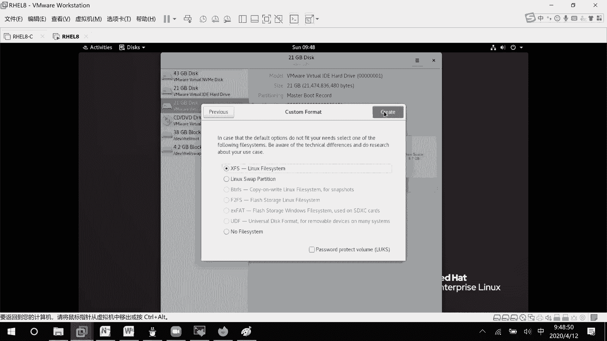

## 格式化详解 🧱

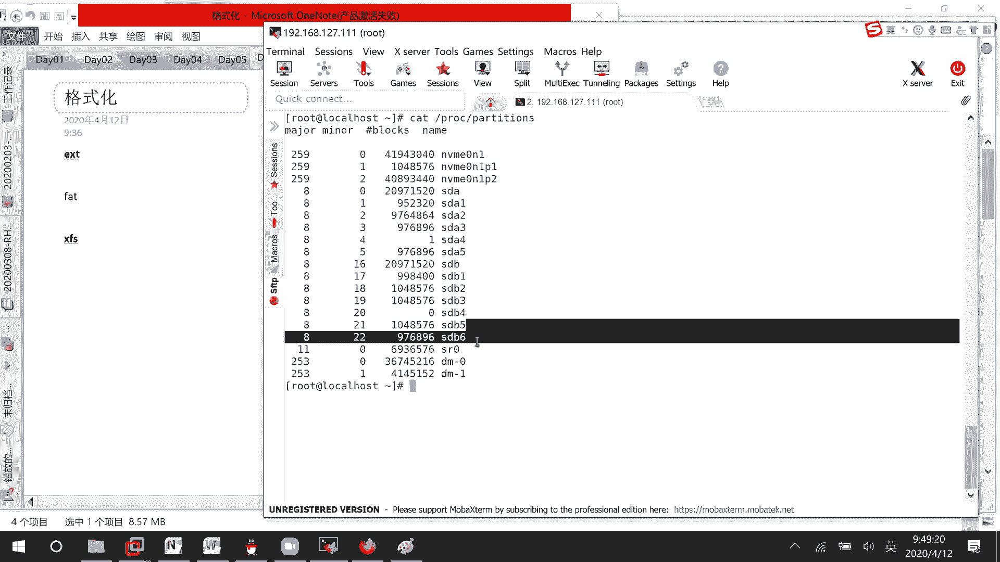

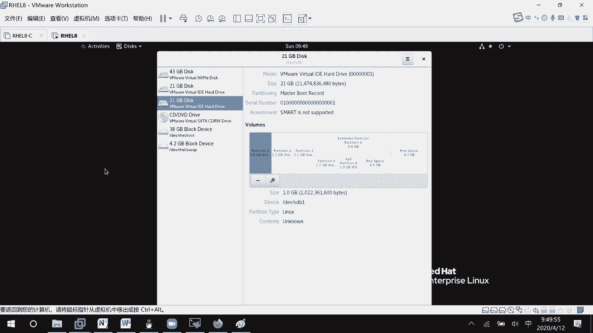

分区创建好后，就像划分好了房间，但还不能直接存放物品。我们需要“打格子”，即进行格式化，来定义数据的存储结构。

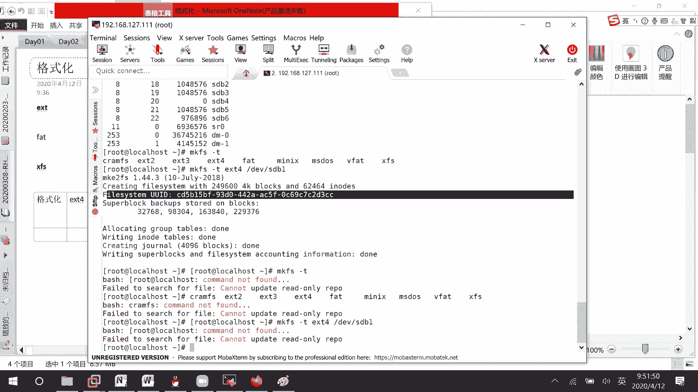

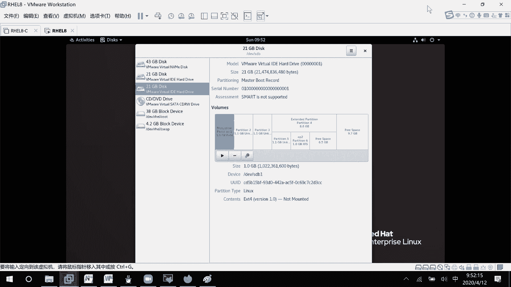

Linux系统中常见的文件系统格式有**ext4**、**xfs**和**fat**等。`ext4`是Linux的传统格式；`xfs`支持超大文件和分区，性能较好；`fat`格式（如FAT32）则具有较好的跨平台兼容性。

格式化命令的基本格式是 `mkfs -t <文件系统类型> <分区设备>`。例如，将 `/dev/sdb1` 格式化为 ext4：
```bash
mkfs -t ext4 /dev/sdb1
```
如果要格式化为xfs格式，则使用：
```bash
mkfs -t xfs /dev/sdb1
```
如果目标分区已有文件系统，`mkfs`命令会提示是否覆盖。可以使用 `-f` 选项强制格式化（xfs格式支持此选项），但请注意**这会清除分区上的所有数据**。

在格式化时，我们可以指定“块大小”（block size），这相当于每个“格子”的大小。默认通常是4KB。对于存储大量小文件，较小的块大小更节省空间；对于存储大文件，较大的块大小能提升读写效率。指定块大小的示例如下：
```bash
mkfs -t ext4 -b 1024 /dev/sdb2 # 指定块大小为1KB
mkfs -t xfs -b size=1024 /dev/sdb3 # 为xfs格式指定块大小
```
只有格式化后的分区才会生成唯一的 **UUID**，系统通过UUID来稳定地识别和定位存储设备。

## 挂载操作 🔗

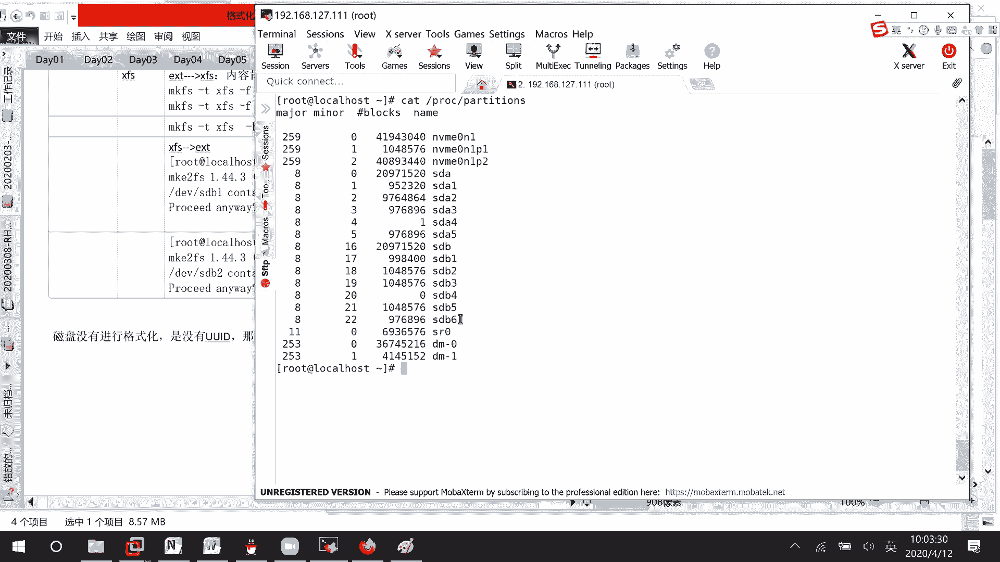

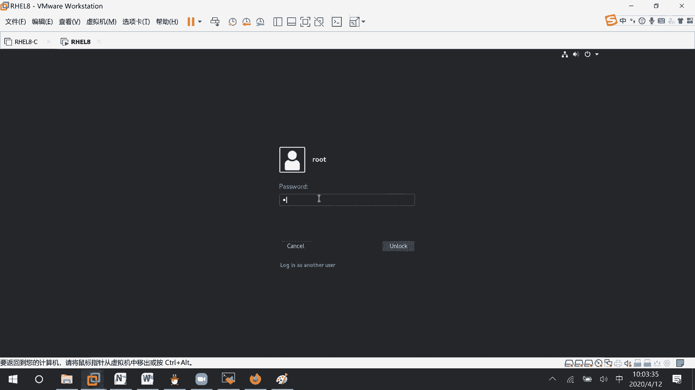

格式化赋予了分区存储能力，但要让系统能够访问其中的数据，还需要进行“挂载”。挂载就是将存储设备关联到系统目录树上的某个目录（挂载点）。

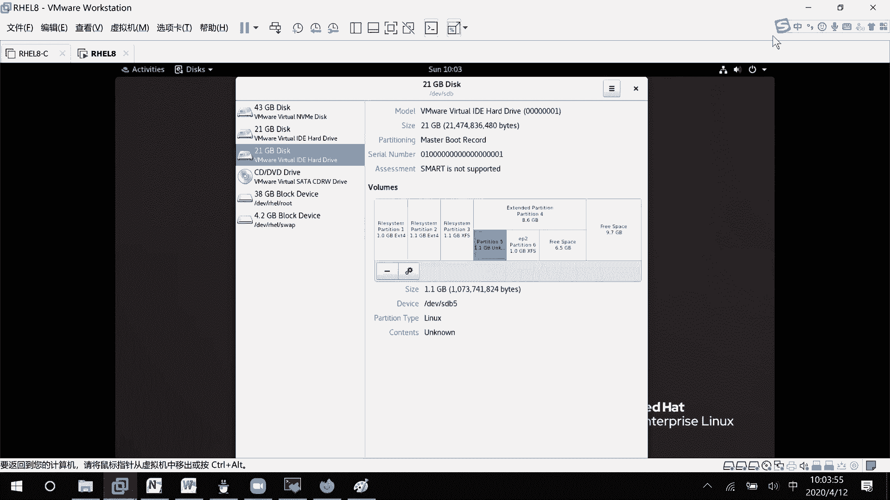

### 临时挂载

临时挂载在重启后会失效，使用 `mount` 命令实现。
```bash
mount /dev/sdb6 /aa
```
这条命令将设备 `/dev/sdb6` 挂载到 `/aa` 目录。挂载后，访问 `/aa` 就相当于访问该设备的内容。使用 `df -hT` 命令可以查看已挂载的文件系统。

卸载设备使用 `umount` 命令，可以指定设备名或挂载点：
```bash
umount /dev/sdb6
# 或
umount /aa
```
卸载后，原挂载点目录恢复为普通空目录。

### 永久挂载

要实现开机自动挂载，需要编辑 `/etc/fstab` 配置文件。该文件定义了系统启动时需要挂载的所有文件系统。

文件每一行的格式如下：
```
<设备标识> <挂载点> <文件系统类型> <挂载选项> <备份标记> <检查顺序>
```
*   **设备标识**：可以是设备路径（如 `/dev/sdb6`）或更稳定的UUID。
*   **挂载点**：必须是一个已存在的目录。
*   **文件系统类型**：如 `ext4`， `xfs`， `swap` 等。
*   **挂载选项**：通常使用 `defaults`。
*   **备份标记**：`0` 表示不备份。
*   **检查顺序**：`0` 表示不检查。

例如，将 `/dev/sdb6` 永久挂载到 `/aa`：
```bash
UUID=xxxx-xxxx-xxxx /aa xfs defaults 0 0
# 或
/dev/sdb6 /aa xfs defaults 0 0
```
编辑保存 `/etc/fstab` 后，可以使用 `mount -a` 命令重新加载所有配置，而不必重启系统。

**使用UUID还是设备名？**
*   **UUID**：更稳定。即使磁盘在物理插槽位置发生变化，系统也能正确识别。
*   **设备名**：更直观。但如果磁盘损坏更换，新盘的UUID会不同，需要更新配置文件。

## 交换分区管理 💾

交换分区（Swap）相当于虚拟内存，当物理内存不足时，系统会将部分数据暂时存放到交换分区中。

### 交换分区大小建议
根据物理内存大小，交换分区的建议配置如下：
*   内存 ≤ 2GB：交换分区 = 内存的 2-3 倍。
*   2GB < 内存 ≤ 8GB：交换分区 = 内存大小。
*   8GB < 内存 ≤ 64GB：交换分区 ≥ 4GB。
*   内存 > 64GB：交换分区 ≥ 4GB（根据实际负载调整）。

### 使用分区创建交换空间

1.  **创建分区并更改类型**：使用 `fdisk` 创建新分区，并将其类型标记为 `82` (Linux swap)。
2.  **格式化**：使用 `mkswap` 命令将分区格式化为交换空间。
    ```bash
    mkswap /dev/sdb7
    ```
3.  **启用**：使用 `swapon` 命令激活交换分区。
    ```bash
    swapon /dev/sdb7
    ```
4.  **设置优先级**：可以使用 `-p` 选项设置优先级（数字越大，优先级越高）。
    ```bash
    swapon -p 100 /dev/sdb7
    ```
5.  **禁用**：使用 `swapoff` 命令。
    ```bash
    swapoff /dev/sdb7
    ```
6.  **永久生效**：在 `/etc/fstab` 中添加配置。
    ```
    /dev/sdb7 none swap defaults,pri=100 0 0
    ```

### 使用文件创建交换空间

除了专用分区，也可以使用大文件作为交换空间。

1.  **创建指定大小的空文件**：使用 `dd` 命令。
    ```bash
    dd if=/dev/zero of=/swapfile bs=1M count=2048 # 创建2GB文件
    ```
2.  **格式化并启用**：
    ```bash
    mkswap /swapfile
    chmod 600 /swapfile # 建议修改权限以保证安全
    swapon /swapfile
    ```
3.  **永久生效**：在 `/etc/fstab` 中添加配置。
    ```
    /swapfile none swap defaults 0 0
    ```

使用 `cat /proc/swaps` 或 `free -h` 命令可以查看当前生效的交换空间信息。

## 总结 📝

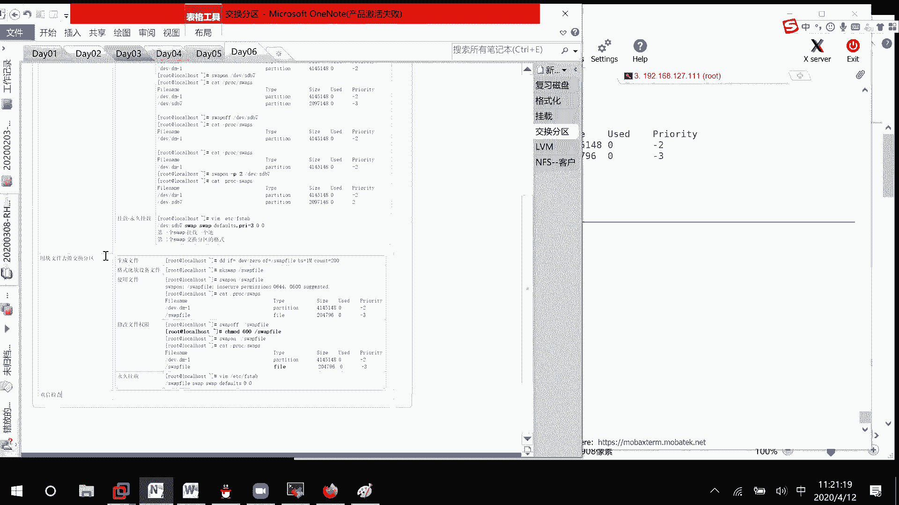

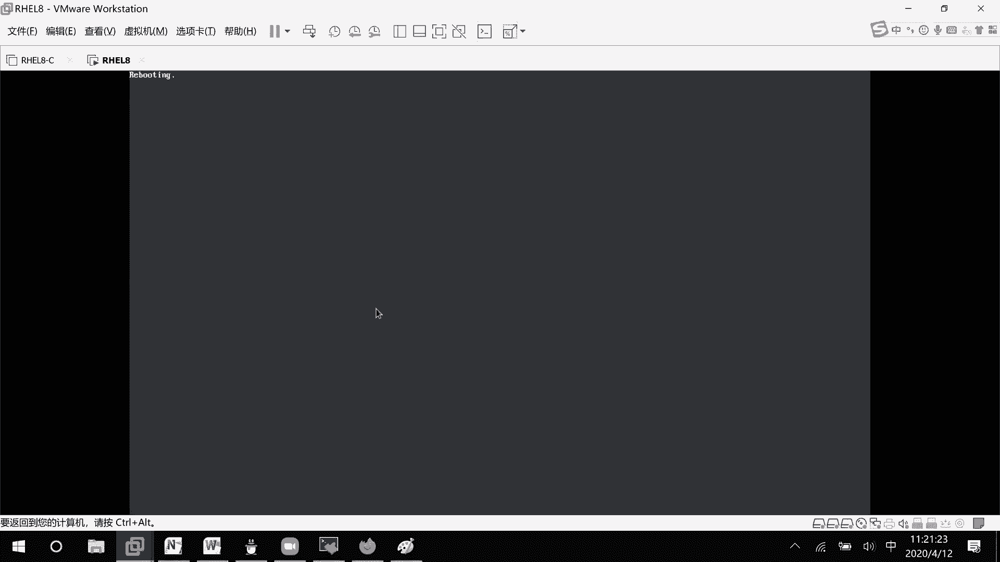

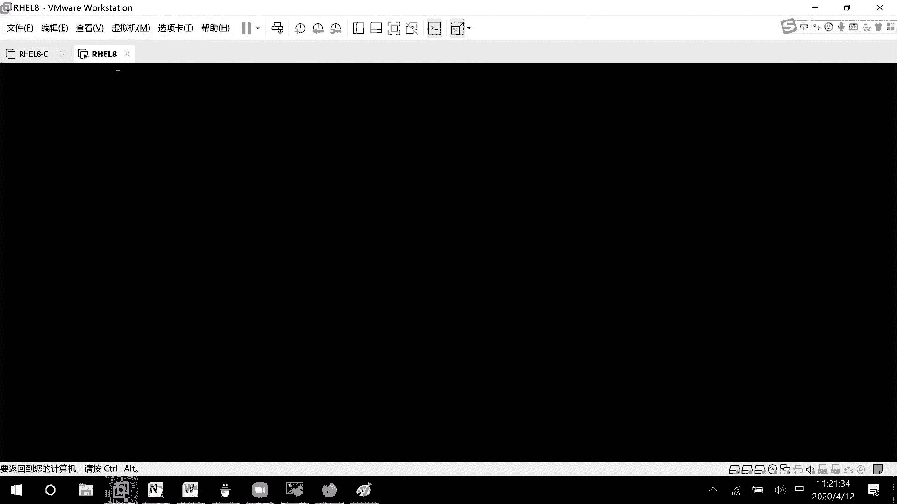

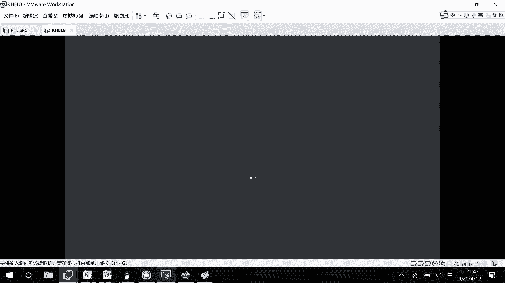

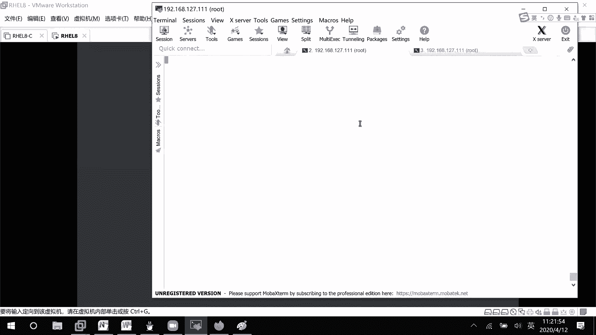

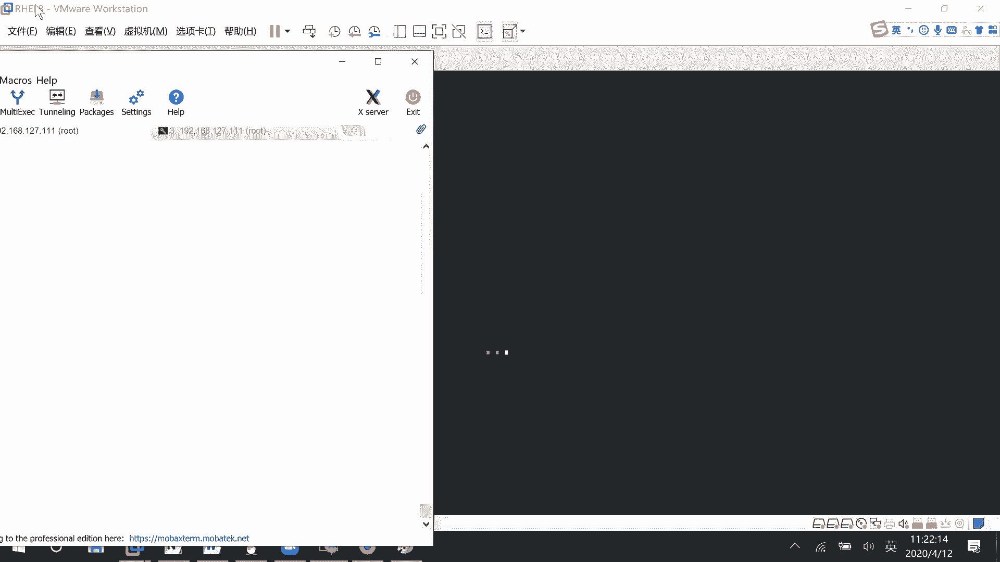

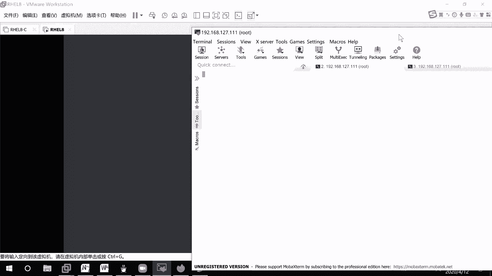

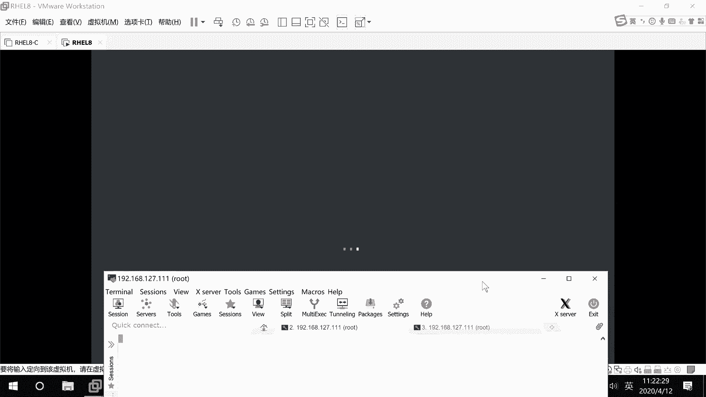

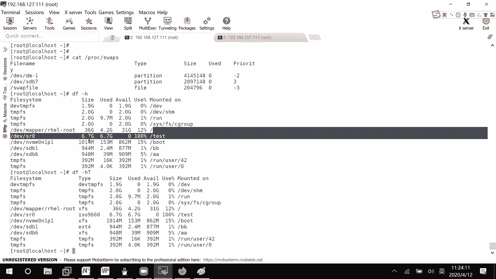

本节课我们一起学习了磁盘管理的核心进阶操作。我们复习了磁盘划分，深入探讨了如何为分区选择并创建不同的文件系统格式。我们掌握了将存储设备临时或永久挂载到系统目录树的方法，理解了UUID和设备名在挂载时的区别。最后，我们学习了交换分区的作用，并实践了如何使用分区或文件来创建和配置交换空间，以优化系统内存管理。这些是构建稳定、高效Linux系统的基础技能，请务必通过练习加以巩固。