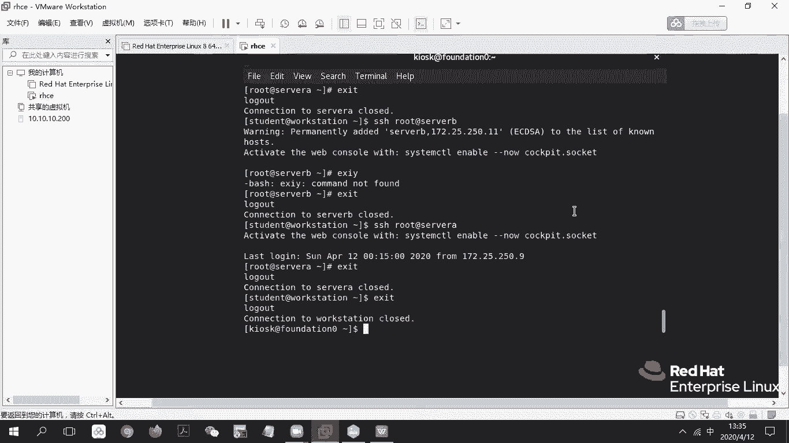
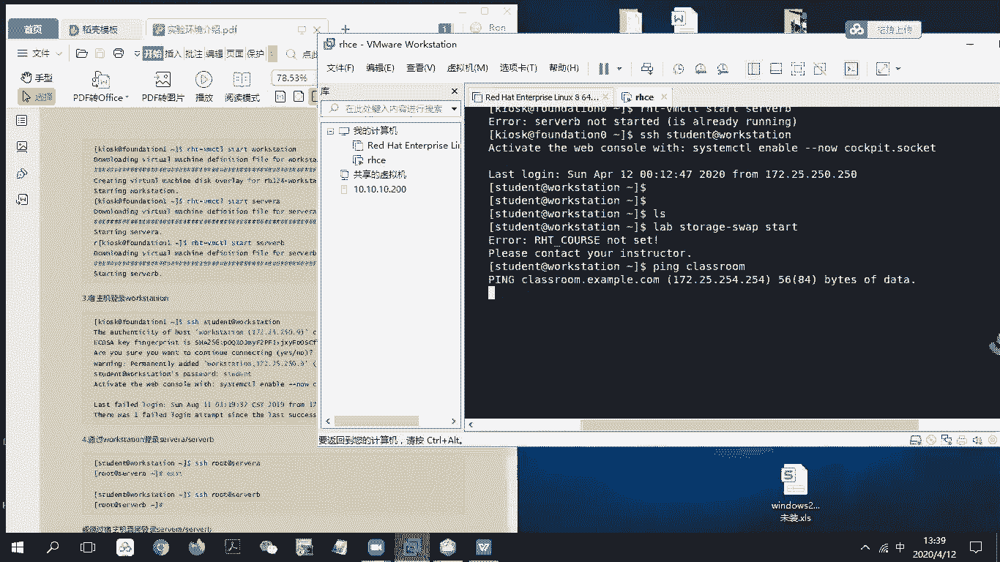
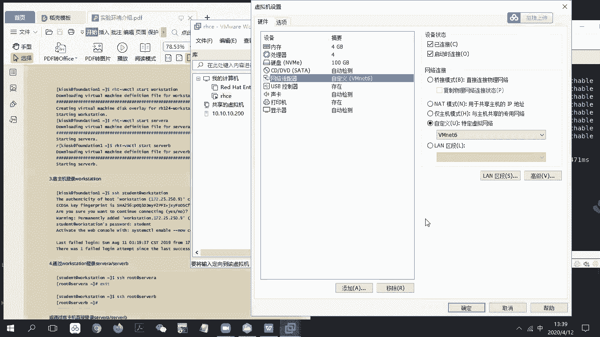
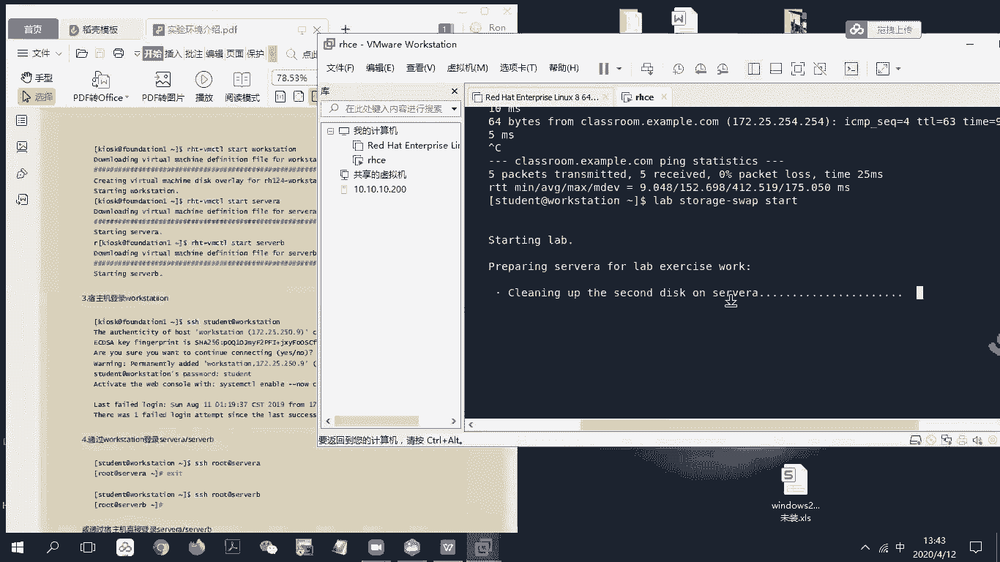

# RHCE8.0视频教程：P24：RHCE环境配置与初始化


在本节课中，我们将学习如何配置和启动RHCE的练习环境。这是进行后续所有实验操作的基础。我们将从启动教室环境开始，逐步启动各个练习虚拟机，并解决常见的网络连接问题。

## 环境概述与启动

首先，我们进入的是一个Kiosk环境，其中包含了我们练习所需的所有虚拟机。这个环境被称为“教室环境”。

以下是环境中包含的主要虚拟机：
*   **server a** 与 **server b**：这是我们需要操作的两台服务器。
*   **workstation**：这是我们的工作站，大部分操作将在这里进行。
*   **classroom**：这是一台资料服务器，存放着实验所需的脚本和文件。

classroom与workstation等虚拟机通过两个网络（例如`172.25.0.0/24`和`172.25.252.0/24`）相连。为了开始实验，我们需要按顺序启动这些虚拟机。



上一节我们介绍了环境构成，本节中我们来看看如何启动它们。

## 启动教室环境

首先，我们需要启动整个环境的控制中心——教室机（classroom）。这会将练习环境部署起来。

请在虚拟机环境中输入以下命令：
```bash
rht-vmctl start classroom
```
这条命令会启动教室环境。如果你之前已经启动过，系统可能会提示虚拟机已在运行。

启动教室环境后，接下来我们需要启动学生操作机。

## 启动练习虚拟机

现在，我们开始启动用于练习的虚拟机。首先启动工作站（workstation）。

输入以下命令：
```bash
rht-vmctl start workstation
```
启动过程可能需要一些时间，请耐心等待。接着，以同样的方式启动服务器A和服务器B。

以下是启动服务器的命令：
```bash
rht-vmctl start servera
rht-vmctl start serverb
```
如果虚拟机已经处于运行状态，执行命令会返回一个错误信息，这属于正常情况。

所有虚拟机启动后，我们就可以登录到工作站开始实验了。

## 登录工作站并初始化实验



现在，我们远程登录到workstation虚拟机，并使用student用户权限进行操作。

使用以下命令登录：
```bash
ssh student@workstation
```
登录成功后，我们需要初始化特定的实验环境。例如，如果我们要进行“存储管理与交换分区”实验，就需要运行对应的准备脚本。



输入以下命令来初始化存储实验环境：
```bash
lab storage-swap start
```
此脚本会自动配置实验所需的初始状态。如果脚本顺利执行没有报错，说明环境初始化成功，可以开始按实验手册的步骤进行操作。

## 常见问题：网络连通性

在初始化或后续实验中，你可能会遇到无法连接到classroom资料服务器的情况。这通常是由于虚拟网络配置问题导致的。

如果遇到`ping classroom`不通的情况，请按以下步骤检查和解决：

1.  确保虚拟机的网络适配器设置为 **NAT模式**（例如VMnet8）。
2.  打开VMware的 **“编辑”** 菜单，选择 **“虚拟网络编辑器”**。
3.  在编辑器列表中，查看是否存在 **VMnet8**。如果不存在，点击 **“添加网络”** 按钮，选择VMnet8并确认。
4.  选中VMnet8，在下方取消勾选 **“使用本地DHCP服务将IP地址分配给虚拟机”** 选项。
5.  点击 **“确定”** 或 **“应用”** 保存设置。
6.  返回虚拟机，再次尝试`ping classroom`命令，检查连通性是否恢复。

网络连通是实验的基础，确保这一步成功至关重要。

## 课程总结



本节课中我们一起学习了RHCE实验环境的配置与初始化流程。我们首先了解了环境的整体结构，然后逐步启动了classroom、workstation、servera和serverb等关键虚拟机。接着，我们登录到workstation并学会了使用`lab`命令来初始化具体的实验场景。最后，我们探讨了最常见的网络连通性问题及其解决方法。掌握这些步骤，将为后续所有RHCE实验打下坚实的基础。