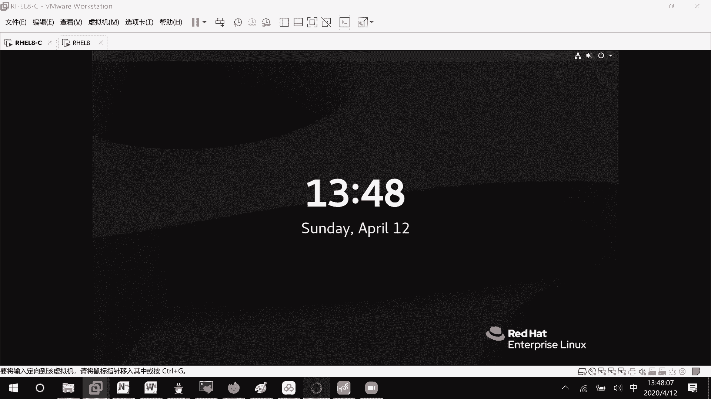
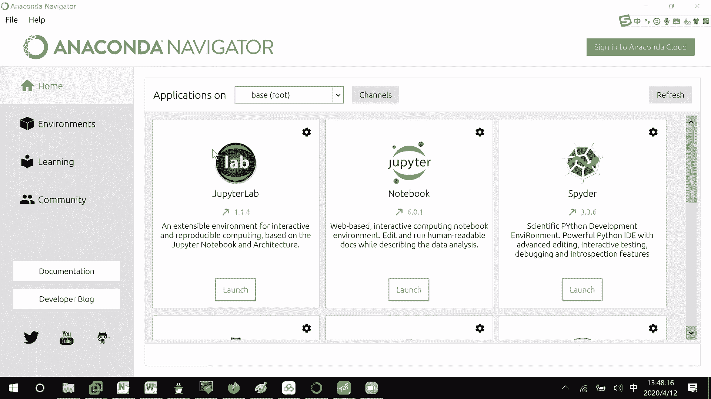
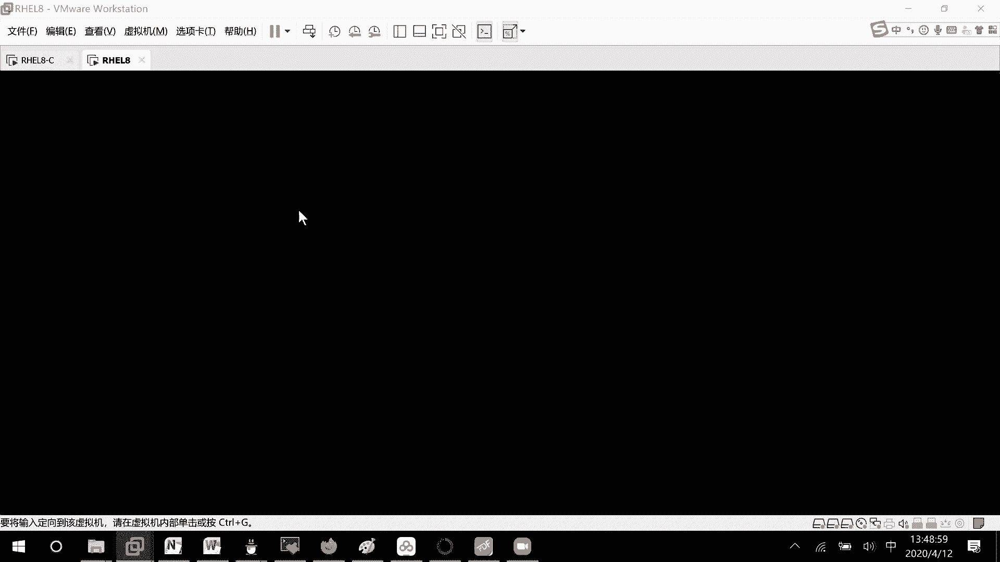
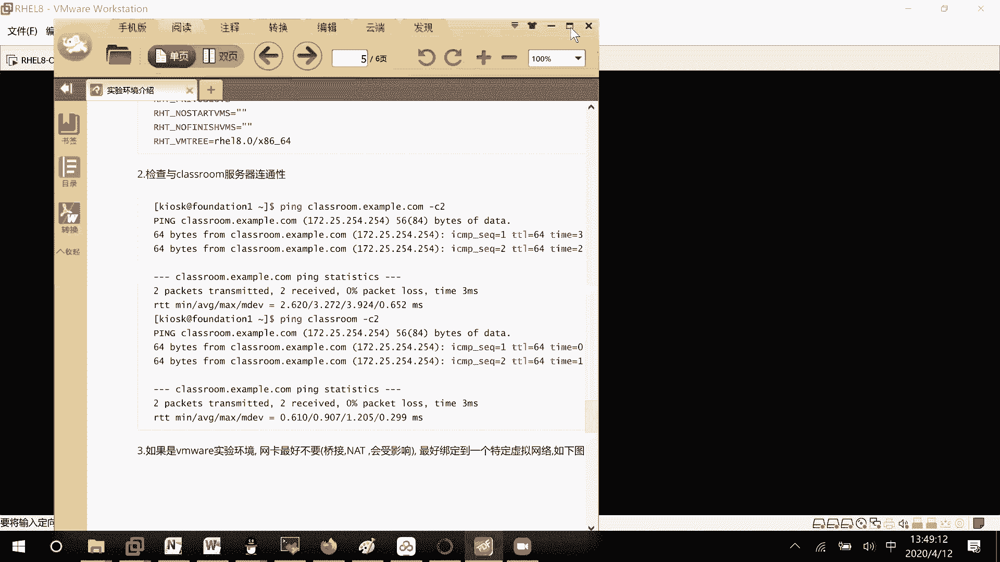
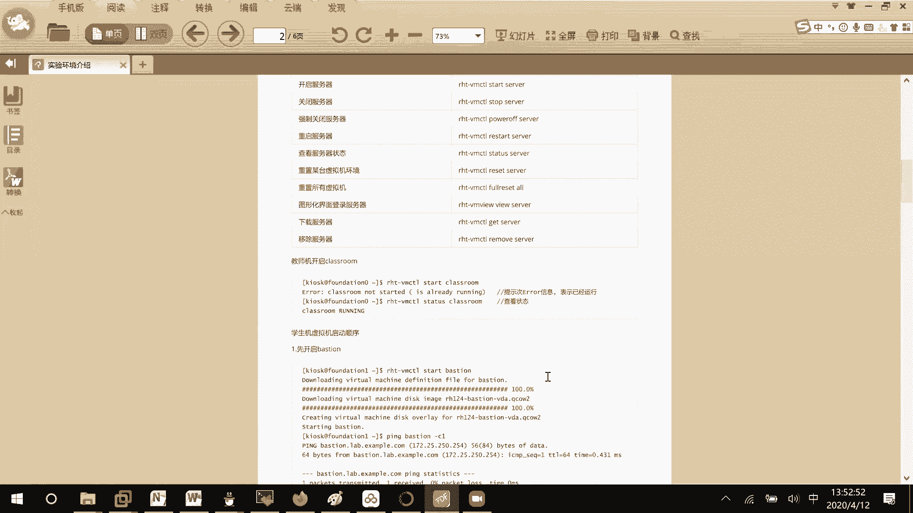
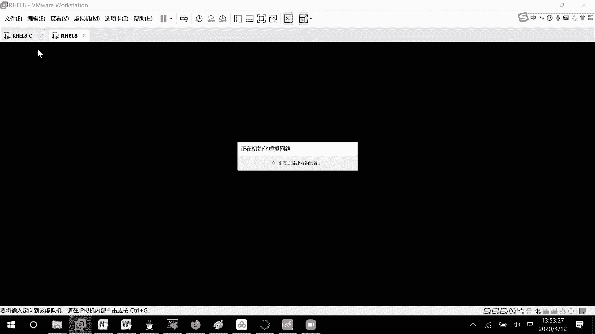
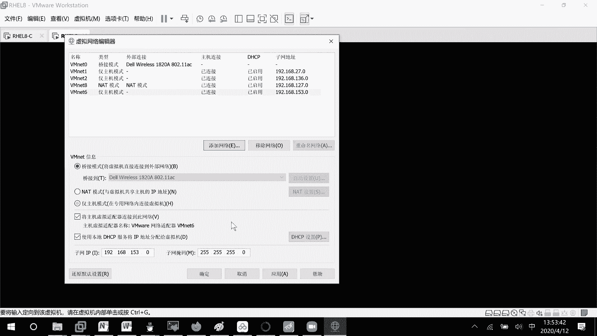
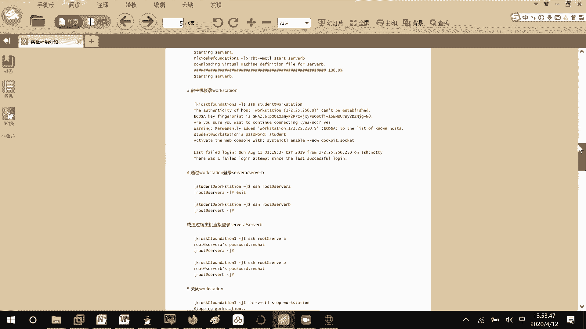
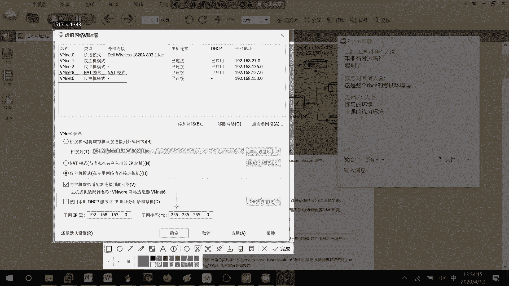
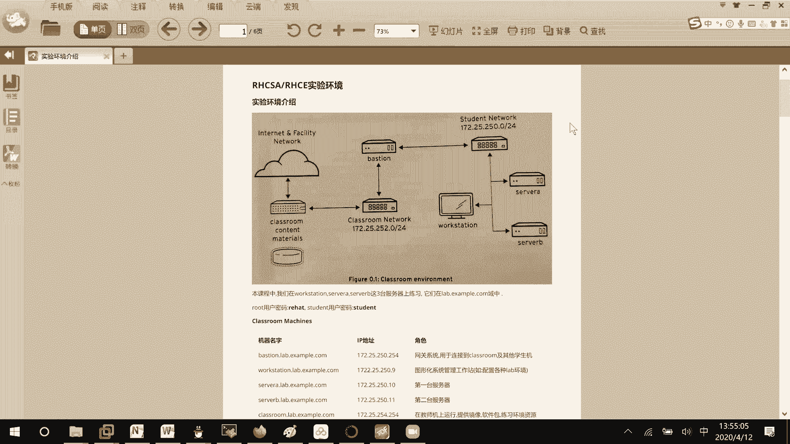

# RHCE8.0视频教程：P25：RHCE考试环境搭建与使用指南




在本节课中，我们将学习如何搭建和使用RHCE 8.0的官方练习环境。这个环境模拟了真实的考试场景，理解其结构和操作流程对于备考至关重要。





## 环境整体结构介绍



上一节我们介绍了课程背景，本节中我们来看看练习环境的整体架构。

整个练习环境由多台虚拟机和一个虚拟网络组成。下图展示了其拓扑结构：


以下是环境中各组件的作用：

*   **Classroom（考官机）**：这是存放考试资料和题目的服务器。在练习环境中，它被包含在内，但在真实考试中，考生无法直接操作此机器。
*   **网络（172.25.252.0/24网段）**：这是一个虚拟交换机，用于连接考官网络（Classroom）和学生网络（Workstation）。
*   **Workstation（工作站）**：这是考生主要操作的入口。在真实考试中，考生打开电脑后首先进入的就是这台虚拟机。
*   **Server A 与 Server B**：这是考生需要根据题目要求进行配置和管理的两台服务器，是考试操作的核心对象。
*   **Foundation（基础主机）**：这是最外层的物理机或宿主机。在练习环境中，我们启动所有虚拟机后，首先会看到这个界面。

**核心流程**：启动所有设备后，考生通过SSH连接到`Workstation`。在`Workstation`上，使用命令`lab storage review start`开始练习。然后根据题目要求，在`Server A`或`Server B`上进行操作。部分练习完成后可以使用`grade`命令检查成绩。如果想重置环境重新练习，可以使用`finish`命令。

**登录凭证**：
*   `root`用户密码：`redhat`
*   `student`用户密码：`student`

## 关键网络配置（VMnet6）

理解了环境结构后，我们需要确保网络配置正确，这是环境能正常通信的基础。

一个常见且关键的问题是，许多人的电脑上默认没有`VMnet6`这个虚拟网络适配器。如果缺少它，环境中的虚拟机将无法按照预定网段通信。



以下是添加和配置`VMnet6`的步骤：

1.  打开VMware，点击菜单栏的 **编辑**。
2.  选择 **虚拟网络编辑器**。
3.  在编辑器窗口中，点击 **添加网络** 按钮。
4.  从列表中选择一个未使用的网络（例如 `VMnet6`），点击 **确定**。
5.  确保新添加的`VMnet6`被配置为 **仅主机模式**。
6.  **至关重要的一步**：取消勾选 **使用本地DHCP服务将IP地址分配给虚拟机**。必须关闭此选项。



**配置原因**：环境内部有自己预设的IP地址分配机制（基于MAC地址绑定）。如果开启VMware的DHCP服务，内外两个DHCP服务器会产生冲突，导致虚拟机获取到错误的IP地址，从而使整个练习环境无法正常工作。



## 环境测试与验证



完成网络配置后，我们需要测试环境是否搭建成功。

测试方法很简单：启动所有虚拟机，从`Workstation`虚拟机尝试`ping`通`Classroom`虚拟机。



在`Workstation`上执行以下命令：
```bash
ping classroom.example.com
# 或直接ping其IP地址（根据环境设置，通常是172.25.252.254）
```
如果能够`ping`通，则证明`172.25.250.0/24`（Workstation所在网段）与`172.25.252.0/24`（Classroom所在网段）之间的网络路由是正常的，整个练习环境可以投入使用。

## 总结



本节课中我们一起学习了RHCE 8.0考试练习环境的搭建与使用。我们首先了解了由Classroom、Workstation、Server A/B等组成的模拟考试环境架构。然后，我们掌握了关键步骤——配置仅主机模式的`VMnet6`并关闭其DHCP服务，这是保证环境网络通信正确的核心。最后，我们学会了通过从Workstation ping通Classroom来验证环境是否就绪。理解并熟练操作这个环境，是进行后续所有RHCE实验和备考的基础。