# RHCE8.0视频教程：P26：逻辑卷管理（LVM）基础与操作


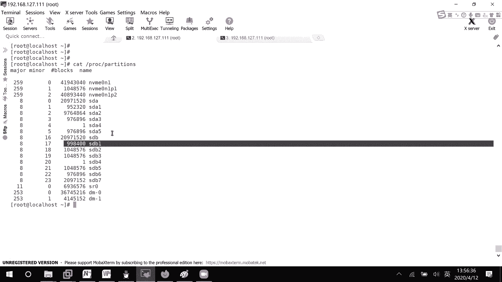

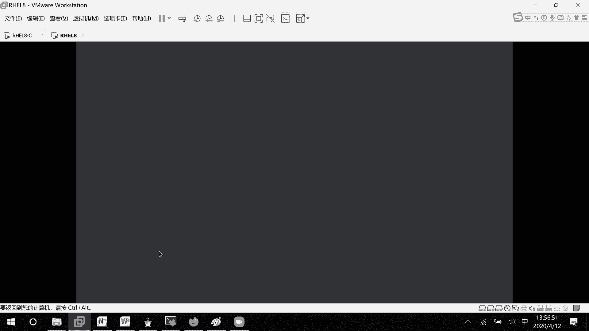

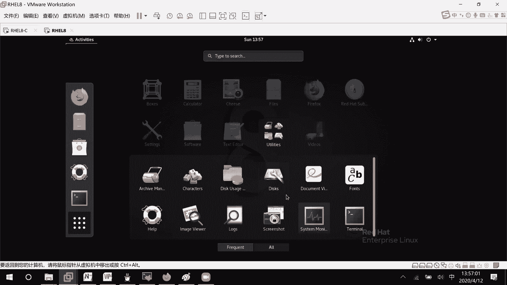

## 概述
在本节课中，我们将要学习Linux系统中一个非常重要的存储管理技术——逻辑卷管理（LVM）。我们将了解为什么需要LVM，并学习其核心概念、创建流程以及如何对逻辑卷进行扩展和收缩操作。

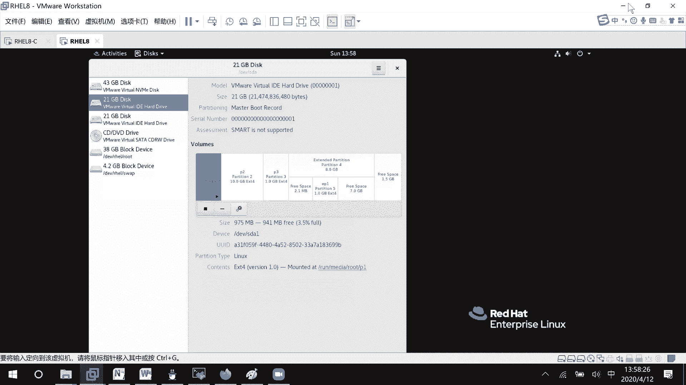

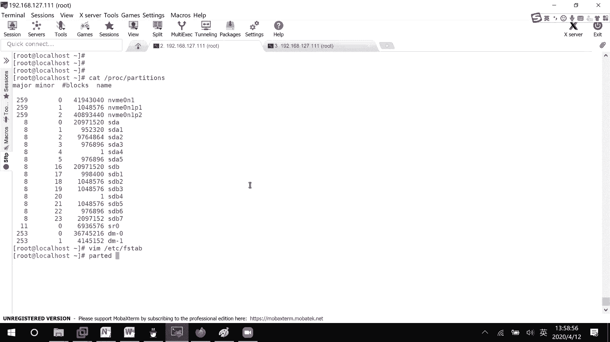

## 为什么需要逻辑卷管理？
在上午的课程中，我们创建了许多分区。例如，我们有一个分区 `/dev/sdb1`，大小约为1GB。如果这个分区空间不够用了，我们能否将它扩展到2GB呢？

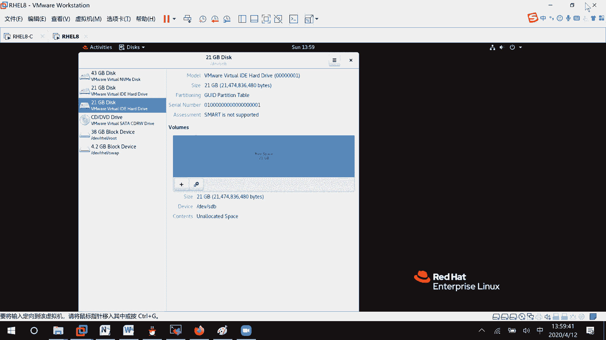

通过图形化工具尝试调整分区大小，我们发现对于普通分区，**只能缩小，不能直接扩展**。这在实际使用中非常不方便。逻辑卷管理（LVM）就是为了解决这种动态调整存储空间的需求而设计的。

## LVM核心概念与流程
LVM的核心理念是将多个物理存储设备（如硬盘分区）汇聚成一个存储池，然后从这个池中按需分配逻辑卷。其操作流程主要分为以下几步：

1.  **创建物理卷（Physical Volume, PV）**：将物理磁盘分区转化为LVM可管理的“物理卷”。
2.  **创建卷组（Volume Group, VG）**：将一个或多个物理卷组合成一个“卷组”，形成一个统一的存储池。
3.  **创建逻辑卷（Logical Volume, LV）**：从卷组中划分出指定大小的“逻辑卷”，供系统挂载使用。

我们可以用一个比喻来理解：物理分区好比应聘者，**物理卷（PV）** 就是成为公司员工，**卷组（VG）** 是具体的部门（如教学部），而**逻辑卷（LV）** 则是部门里为了某个具体项目而组建的团队。团队成员（存储空间）可以根据项目需求动态调整。

## 第一步：准备分区
在开始LVM操作前，我们需要准备一些分区。这些分区可以来自同一块硬盘，也可以来自不同的硬盘。

以下是使用 `fdisk` 命令创建分区的示例代码。我们将创建5个分区，并修改其类型为LVM（标签 `8e`）。

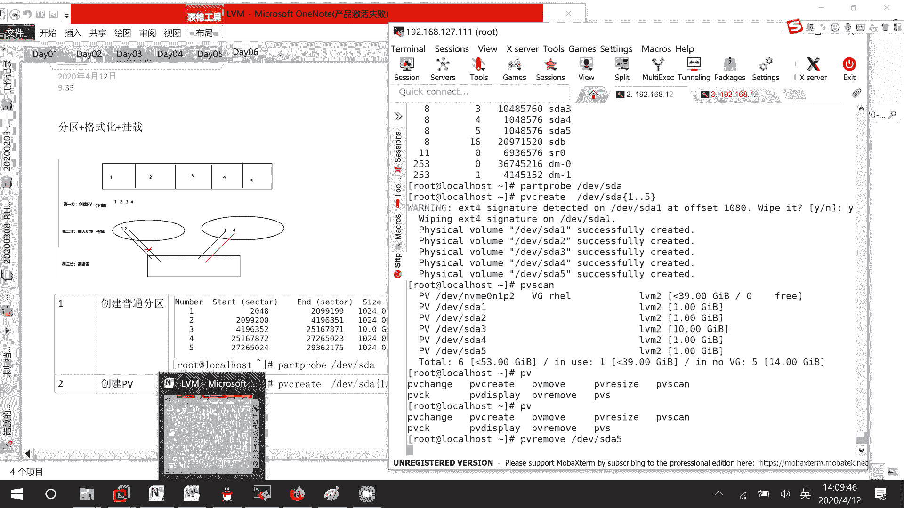

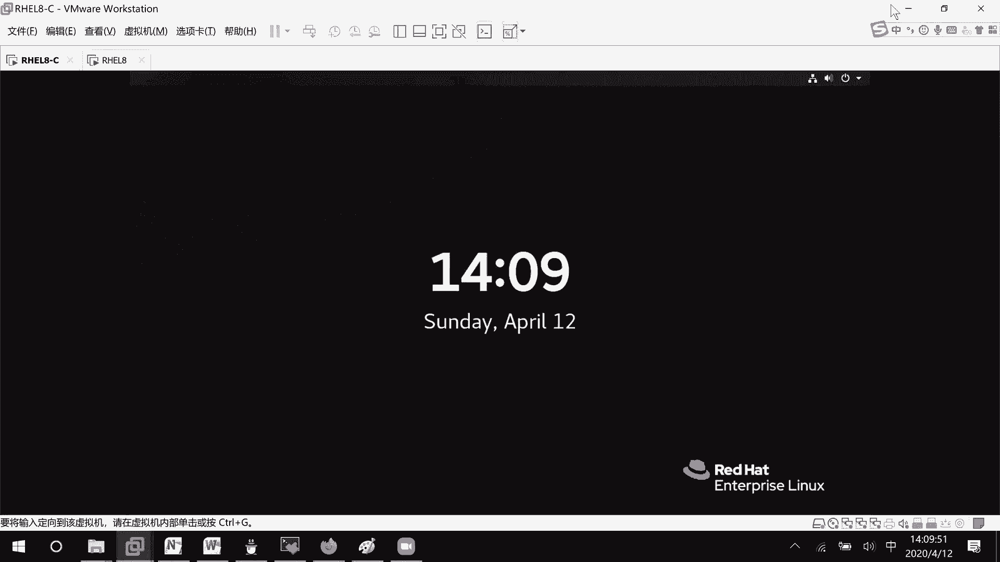

```bash
# 对 /dev/sda 进行操作
fdisk /dev/sda
# 在交互界面中，依次使用 n 创建新分区，t 修改分区类型为 8e (Linux LVM)，w 保存退出。
```

创建分区后，可以使用 `partprobe` 命令让内核重新读取分区表。

## 第二步：创建物理卷（PV）
物理卷是LVM管理的基本单元。以下是将分区初始化为物理卷的命令。

```bash
# 将指定分区创建为物理卷
pvcreate /dev/sda1 /dev/sda2 /dev/sda3 /dev/sda4 /dev/sda5

# 查看所有物理卷的详细信息
pvdisplay

# 查看物理卷的简要信息
pvs
```

如果希望将某个物理卷从LVM管理中移除，可以使用 `pvremove` 命令。

## 第三步：创建卷组（VG）
卷组由一个或多个物理卷组成，是存储池。在创建卷组时，可以指定物理扩展单元（PE）的大小。

```bash
# 创建一个名为 vg0 的卷组，并指定PE大小为8MB
vgcreate -s 8M vg0 /dev/sda1 /dev/sda2 /dev/sda3 /dev/sda4 /dev/sda5

# 查看卷组信息
vgdisplay vg0
vgs
```

**物理扩展单元（PE）** 是卷组中空间分配的最小单位。逻辑卷的大小必须是PE大小的整数倍。

管理卷组成员：
```bash
# 向卷组 vg0 中添加物理卷 /dev/sda5
vgextend vg0 /dev/sda5

# 从卷组 vg0 中移除物理卷 /dev/sda5
vgreduce vg0 /dev/sda5
```

## 第四步：创建逻辑卷（LV）
逻辑卷是从卷组中划分出来的、可供系统直接使用的部分。创建逻辑卷有多种指定大小的方法。

```bash
# 方法1：直接指定大小（如100M）。系统会自动计算所需的PE数量。
lvcreate -L 100M -n lv1 vg0

# 方法2：指定PE的个数（如10个）。每个PE大小在创建卷组时定义。
lvcreate -l 10 -n lv2 vg0

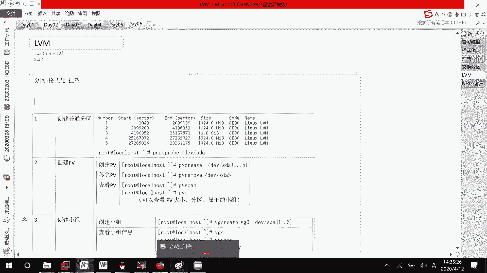

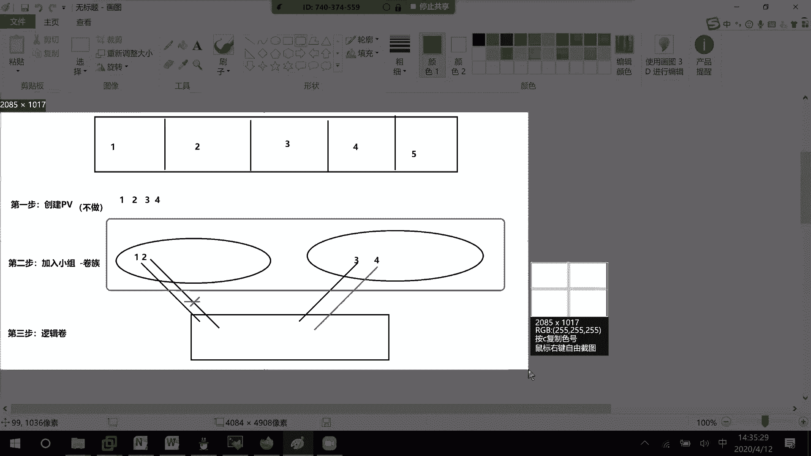

# 方法3：使用卷组剩余空间的百分比（如50%）
lvcreate -l 50%FREE -n lv3 vg0

# 查看逻辑卷
lvdisplay
lvs
```

移除逻辑卷：
```bash
lvremove /dev/vg0/lv3
```

## 第五步：使用逻辑卷
创建好的逻辑卷就像一个新的分区，需要格式化和挂载才能使用。

### 格式化与挂载
```bash
# 格式化为 XFS 文件系统
mkfs.xfs /dev/vg0/lv1

# 格式化为 EXT4 文件系统
mkfs.ext4 /dev/vg0/lv1

# 创建挂载点并挂载
mkdir /mnt/lv1
mount /dev/vg0/lv1 /mnt/lv1
```

### 设置永久挂载
编辑 `/etc/fstab` 文件，添加如下一行：
```
/dev/vg0/lv1 /mnt/lv1 xfs defaults 0 0
```

## 逻辑卷的在线扩展与收缩
LVM最强大的功能之一就是可以在不丢失数据的情况下动态调整逻辑卷的大小。

### 扩展逻辑卷（以XFS为例）
扩展操作分为两步：**先扩展逻辑卷空间，再扩展文件系统**。

```bash
# 1. 扩展逻辑卷空间到200M
lvextend -L 200M /dev/vg0/lv1

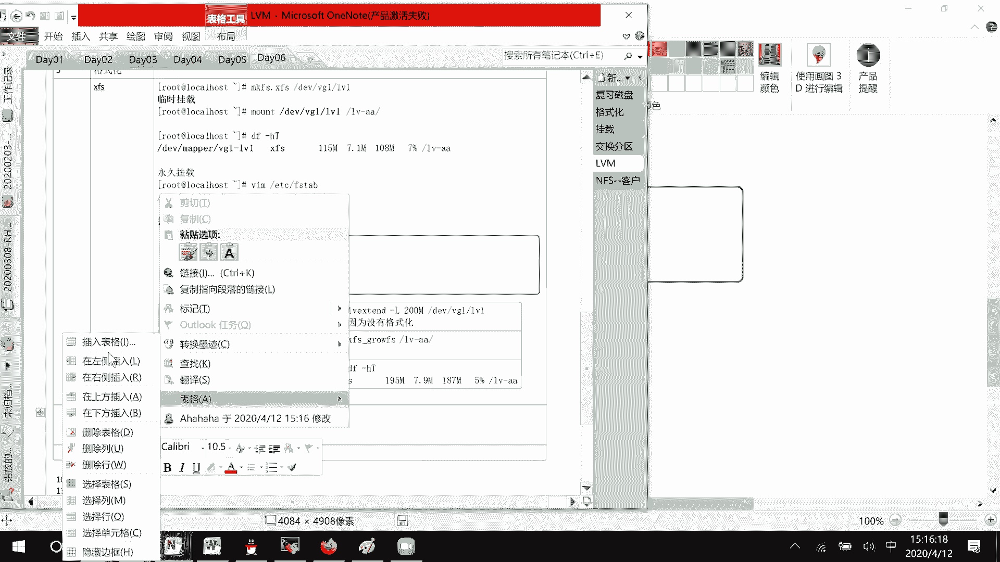

# 2. 扩展XFS文件系统以识别新增空间
xfs_growfs /mnt/lv1  # 对挂载点操作
# 或 xfs_growfs /dev/vg0/lv1
```

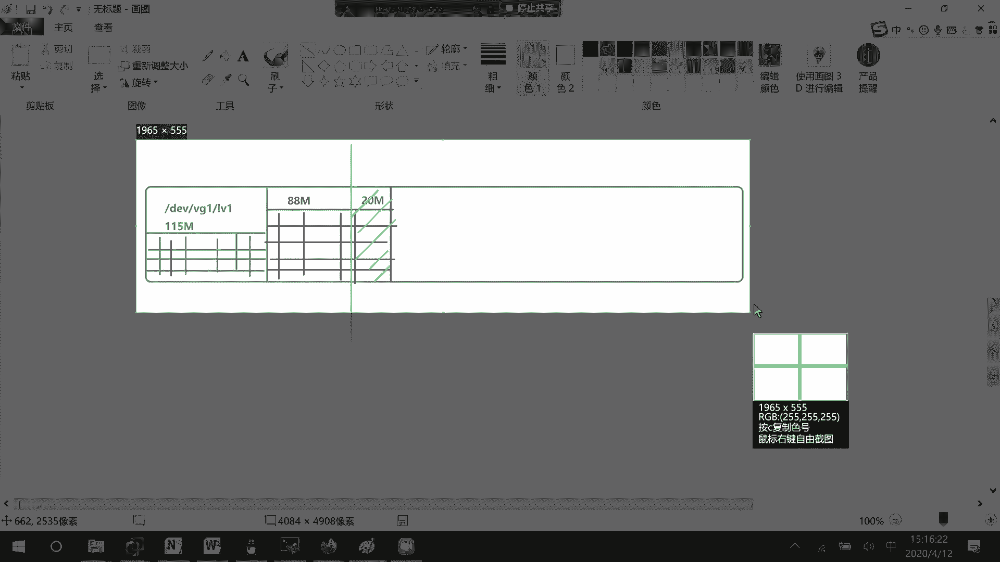

### 收缩逻辑卷（仅EXT3/4支持）
**注意：XFS文件系统不支持收缩。** 收缩EXT4逻辑卷的操作顺序与扩展相反：**先收缩文件系统，再回收逻辑卷空间**，且必须在卸载状态下进行。

```bash
# 1. 卸载逻辑卷
umount /mnt/lv1

# 2. 检查文件系统完整性
e2fsck -f /dev/vg0/lv1

# 3. 收缩文件系统到指定大小（如120M）
resize2fs /dev/vg0/lv1 120M

# 4. 重新挂载，验证文件系统已缩小
mount /dev/vg0/lv1 /mnt/lv1
df -h /mnt/lv1

# 5. 卸载后，收缩逻辑卷空间
umount /mnt/lv1
lvreduce -L 120M /dev/vg0/lv1

# 6. 重新挂载使用
mount /dev/vg0/lv1 /mnt/lv1
```
**关键点**：收缩逻辑卷时，回收的空间大小（`lvreduce` 指定的值）必须**小于或等于**文件系统收缩后的大小（`resize2fs` 指定的值），否则会损坏数据。

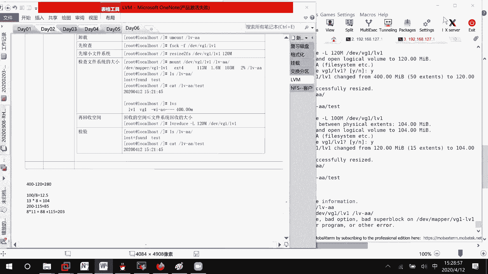

## 总结
本节课我们一起学习了逻辑卷管理（LVM）的核心知识与操作。我们了解了从物理分区到逻辑卷的完整创建流程：**PV -> VG -> LV**。重点掌握了逻辑卷的**动态扩展**与**收缩**方法，并区分了XFS和EXT4文件系统在调整时的不同特性。LVM提供了灵活的存储管理能力，是RHCE认证中必须掌握的重要技能。