# RHCE8.0视频教程：P27：NFS网络文件系统配置与管理


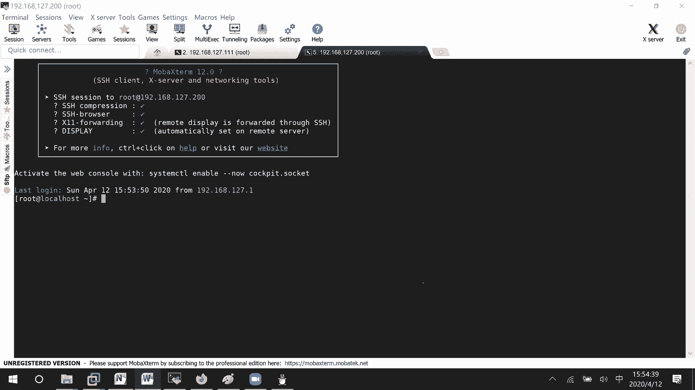

## 📖 概述
在本节课中，我们将学习NFS（网络文件系统）的配置与管理。NFS允许网络中的计算机之间共享目录和文件，就像访问本地文件一样。我们将从服务器端配置开始，逐步学习如何共享目录、客户端如何挂载使用，并解决常见的权限问题，最后介绍按需自动挂载的配置方法。

---

## 🖥️ 服务器端配置

上一节我们介绍了NFS的基本概念，本节中我们来看看如何在服务器端配置共享目录。

首先，我们需要在服务器上创建一个用于共享的目录。

```bash
mkdir /nfs_test
```

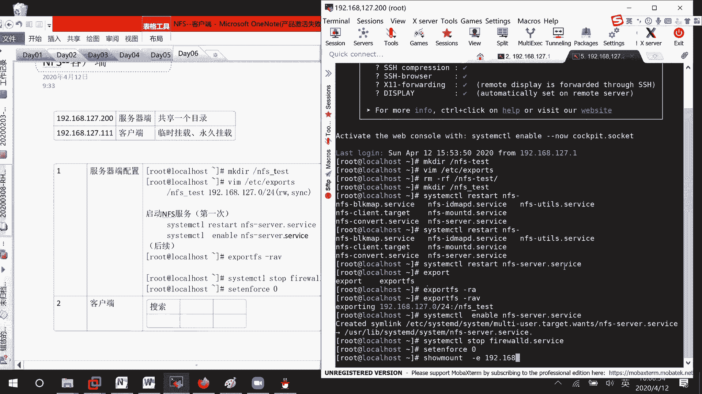

创建目录后，我们需要编辑NFS的配置文件 `/etc/exports` 来声明共享此目录。

```bash
vim /etc/exports
```

在配置文件中，按以下格式添加共享条目：
```
/nfs_test 192.168.127.0/24(rw,sync)
```
*   `/nfs_test`：要共享的目录路径。
*   `192.168.127.0/24`：允许访问此共享的网段。
*   `rw`：允许读写。
*   `sync`：同步写入，确保数据一致性。

配置完成后，需要启动或重新加载NFS服务以使配置生效。

```bash
# 首次启动或重启服务
systemctl restart nfs-server

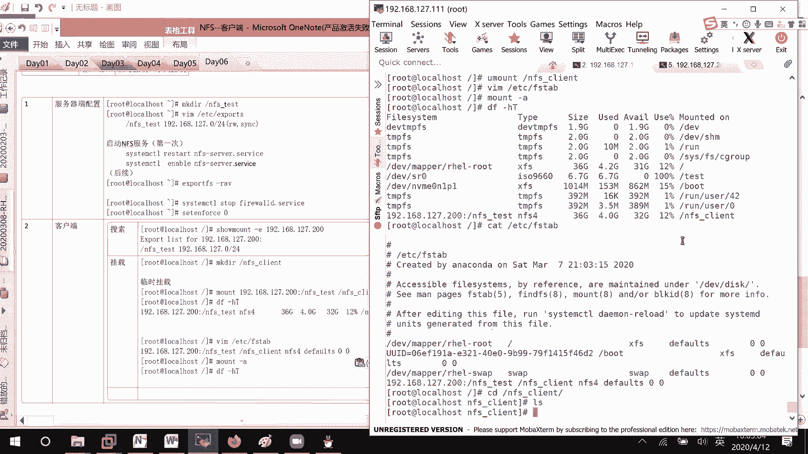

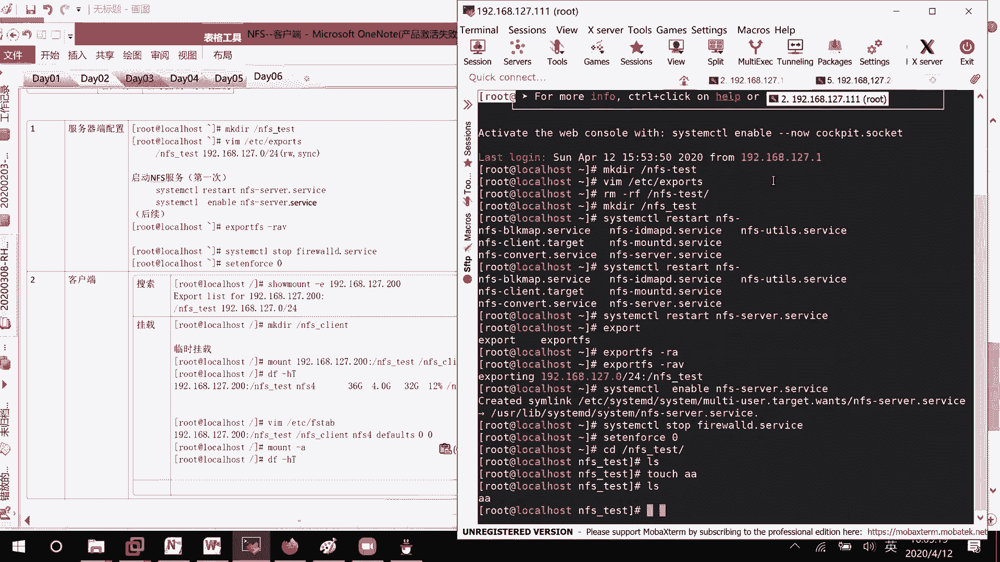

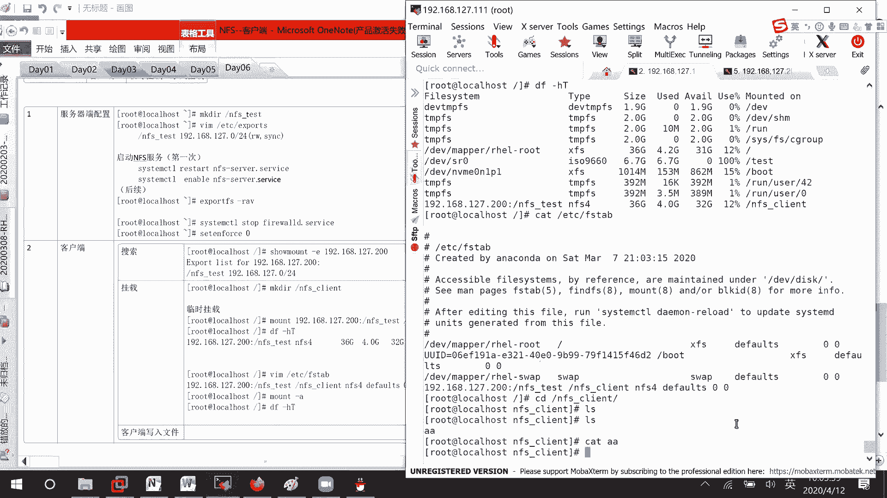

# 后续修改配置文件后，重新加载共享条目
exportfs -r
```

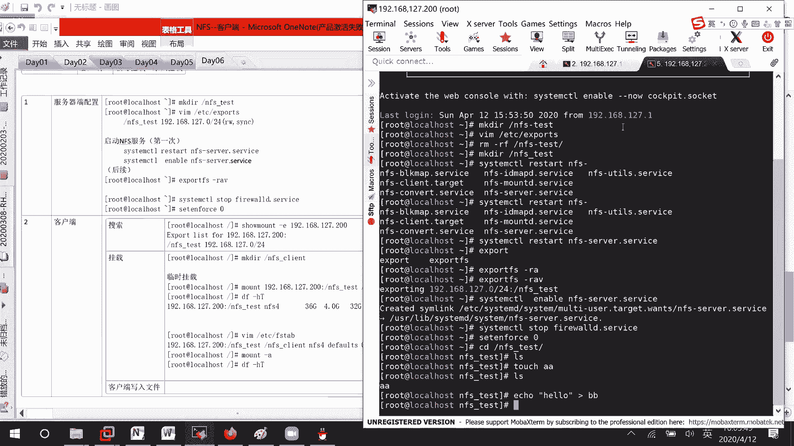

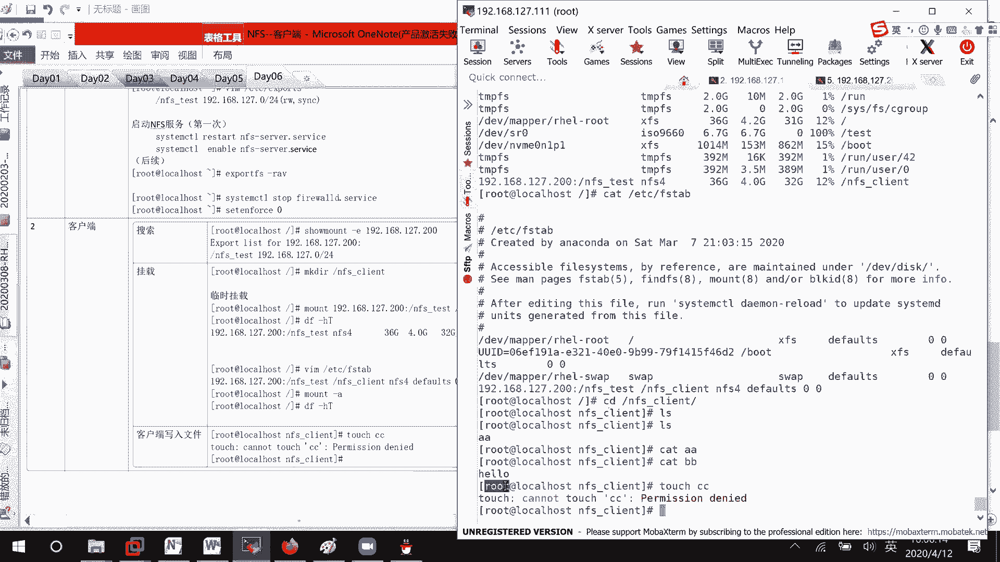

为了排除防火墙和SELinux的干扰，在实验环境中可以暂时关闭它们。


```bash
systemctl stop firewalld
setenforce 0
```

---

## 💻 客户端操作

服务器端配置完成后，客户端需要发现并挂载这个共享目录才能使用。

首先，客户端可以使用 `showmount` 命令查看服务器共享了哪些目录。

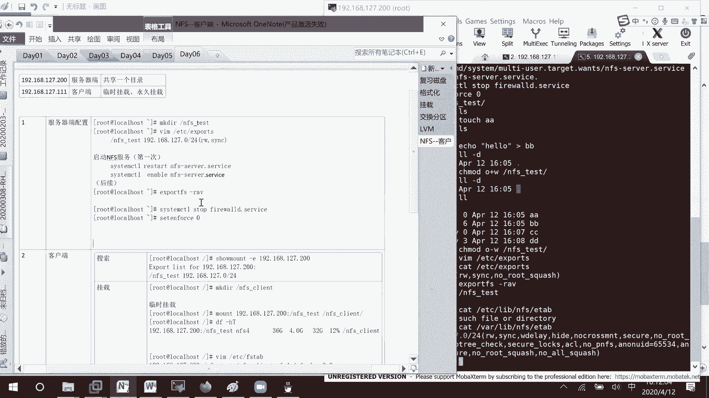

```bash
showmount -e 192.168.127.200
```

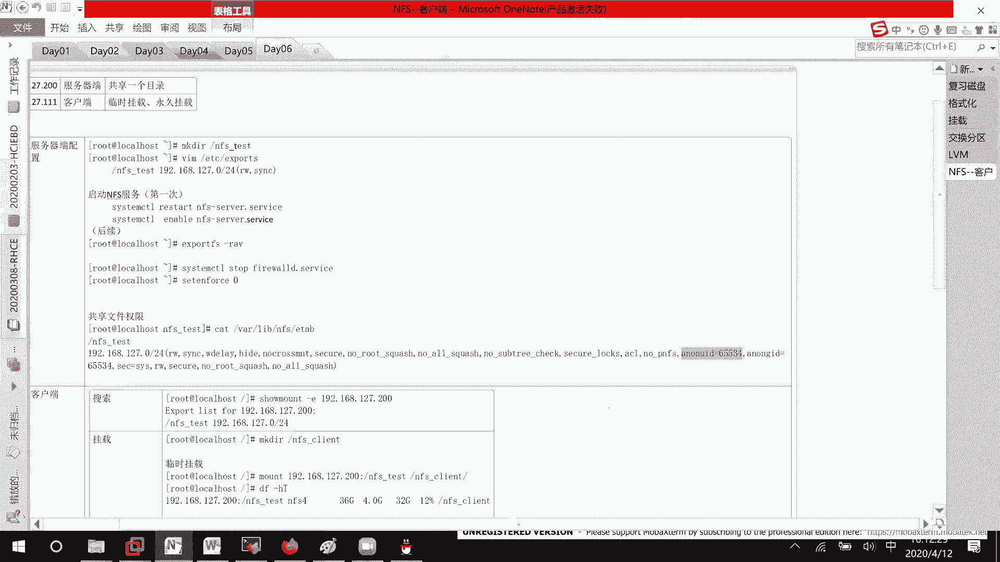

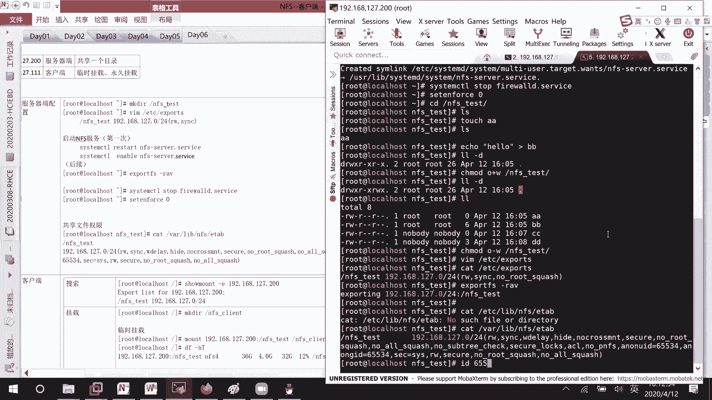

以下是客户端挂载NFS共享的步骤：

1.  **创建本地挂载点**：在客户端创建一个目录，用于关联远程共享目录。
    ```bash
    mkdir /nfs_client
    ```
2.  **临时挂载**：使用 `mount` 命令将远程目录挂载到本地。
    ```bash
    mount -t nfs4 192.168.127.200:/nfs_test /nfs_client
    ```
    使用 `df -hT` 命令可以查看挂载是否成功。
3.  **永久挂载**：编辑 `/etc/fstab` 文件实现开机自动挂载。
    ```bash
    vim /etc/fstab
    ```
    添加以下行：
    ```
    192.168.127.200:/nfs_test /nfs_client nfs4 defaults 0 0
    ```
    保存后，使用 `mount -a` 命令测试并加载所有配置。

---

## 🔐 权限问题与解决方案

在客户端挂载后，可能会遇到无法写入文件的问题，即使目录权限显示可写。这是因为NFS默认会将客户端的root用户权限映射为服务器上的 `nfsnobody` 用户，导致权限被压缩。

以下是两种解决方案：

1.  **修改服务器端共享目录的权限**：直接为“其他用户”添加写权限。
    ```bash
    chmod o+w /nfs_test
    ```
2.  **修改NFS共享配置（推荐）**：在服务器端的 `/etc/exports` 文件中，为共享条目添加 `no_root_squash` 选项，禁止压缩root用户权限。
    ```
    /nfs_test 192.168.127.0/24(rw,sync,no_root_squash)
    ```
    修改后，记得使用 `exportfs -r` 命令重新加载配置。

---

## 🤖 实现按需自动挂载（Autofs）

手动或通过 `/etc/fstab` 挂载的目录会一直保持连接状态。Autofs服务可以实现“按需挂载”，即只有在访问目录时才自动挂载，一段时间不访问后自动卸载，节省资源。

以下是配置Autofs的步骤：

1.  **安装Autofs软件包**：
    ```bash
    yum install autofs
    ```
2.  **配置主配置文件**：编辑 `/etc/auto.master`，指定挂载点目录和对应的映射文件。
    ```bash
    vim /etc/auto.master
    ```
    添加一行：
    ```
    /nfs_plant /etc/auto.nfs
    ```
    *   `/nfs_plant`：客户端的顶级挂载点目录。
    *   `/etc/auto.nfs`：子目录的映射配置文件（文件名可自定义）。
3.  **创建映射配置文件**：编辑上一步指定的映射文件（如 `/etc/auto.nfs`）。
    ```bash
    cp /etc/auto.misc /etc/auto.nfs
    vim /etc/auto.nfs
    ```
    在文件中按格式添加挂载信息：
    ```
    server2 -fstype=nfs4 192.168.127.200:/nfs_test
    ```
    *   `server2`：在 `/nfs_plant` 目录下创建的子目录名。
    *   `-fstype=nfs4`：指定文件系统类型。
    *   `192.168.127.200:/nfs_test`：远程NFS共享路径。
4.  **启动并设置开机自启**：
    ```bash
    systemctl enable --now autofs
    systemctl restart autofs
    ```

配置完成后，当您访问 `/nfs_plant/server2` 时，系统会自动挂载远程共享；离开一段时间后，会自动卸载。

---

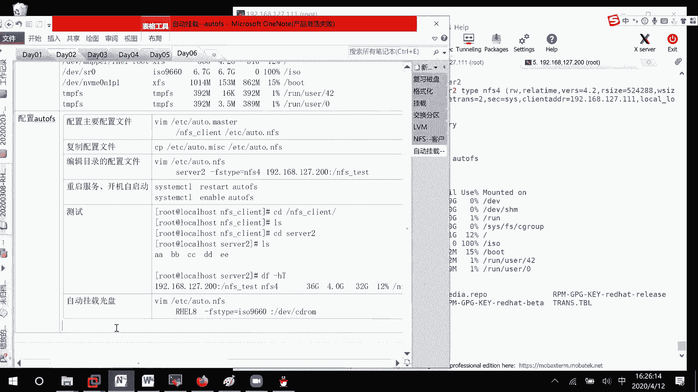

## 📝 总结
本节课中我们一起学习了NFS网络文件系统的完整配置流程。我们从服务器端共享目录的配置开始，学习了客户端如何发现和挂载共享。针对常见的写入权限问题，我们探讨了两种有效的解决方案。最后，我们介绍了更为智能的Autofs服务，它可以实现网络目录的按需自动挂载与卸载，提升了资源管理的灵活性。掌握这些技能，将有助于你在实际环境中部署和管理文件共享服务。