# RHCE8.0视频教程：P28：Shell脚本编程基础


在本节课中，我们将要学习Shell脚本编程的基础知识，包括变量、条件判断和简单的脚本编写。通过本课的学习，你将能够理解脚本的基本结构，并能够编写简单的脚本来完成特定任务。

## 变量

上一节我们介绍了课程概述，本节中我们来看看脚本编程的第一个核心概念：变量。

变量代表可变的值，它不是固定的。例如，在公式 `y = x + 1` 中，`x` 可以是1、2或3，`y` 会随着 `x` 的变化而变化，这里的 `x` 和 `y` 都可以称为变量。

### 本地变量

本地变量仅在当前Shell会话中生效。设置本地变量的基本格式是 `变量名=值`。

**注意**：变量名、等号和值之间不能有空格。

```bash
aaa=1
```

如果值中包含空格，则需要使用引号将其括起来。

```bash
aaa="1 2"
```

要查看变量的值，需要在变量名前加上 `$` 符号。

```bash
echo $aaa
```

如果变量的值是一个命令的执行结果，则需要使用反引号（`）将命令括起来。

```bash
aaa=`hostname`
echo $aaa
```

本地变量不会被子Shell或其他终端会话继承。如果需要清空一个变量，可以使用 `unset` 命令。

```bash
unset aaa
```

### 环境变量

环境变量可以被当前Shell及其子Shell继承。设置环境变量有两种方式。

第一种方式是使用 `export` 命令。

```bash
export ABC=1
```

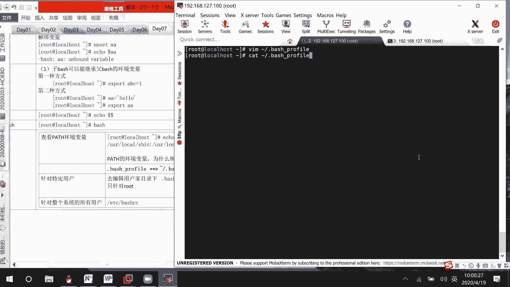

第二种方式是先设置本地变量，再使用 `export` 命令将其导出为环境变量。

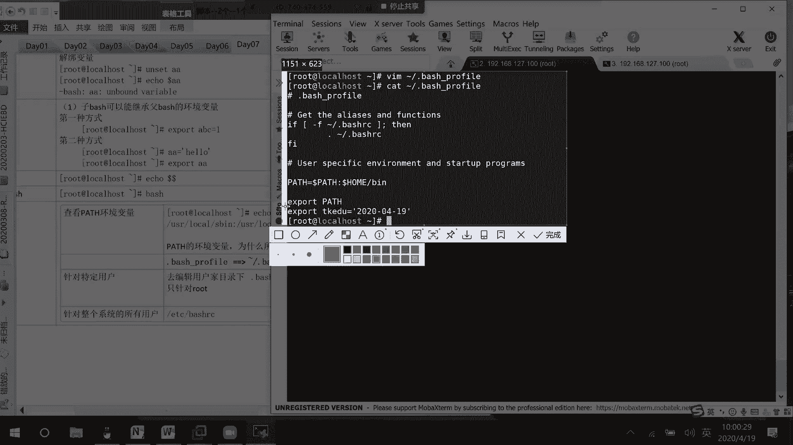

```bash
ABC=1
export ABC
```

系统中有一些预定义的环境变量，例如 `PATH`、`USER`、`UID`、`HOME` 等。

```bash
echo $PATH
echo $USER
echo $UID
echo $HOME
```

环境变量的配置文件位于用户家目录（如 `~/.bash_profile`, `~/.bashrc`）和系统目录（如 `/etc/bashrc`）。修改这些文件可以永久改变环境变量。

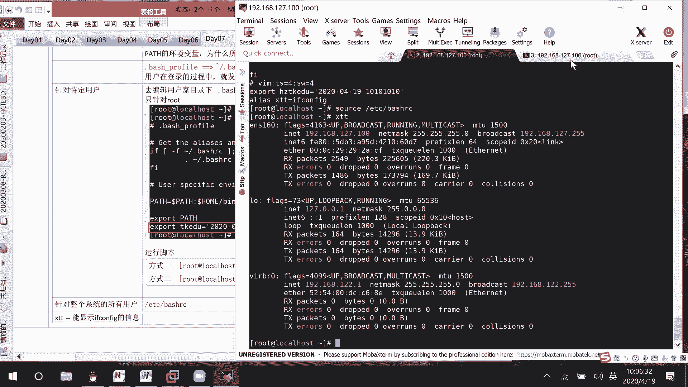

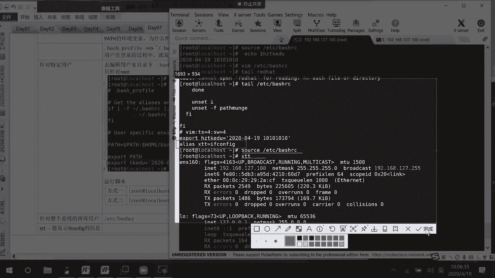

要使配置文件中的更改立即生效，可以使用 `source` 命令。

```bash
source ~/.bash_profile
```

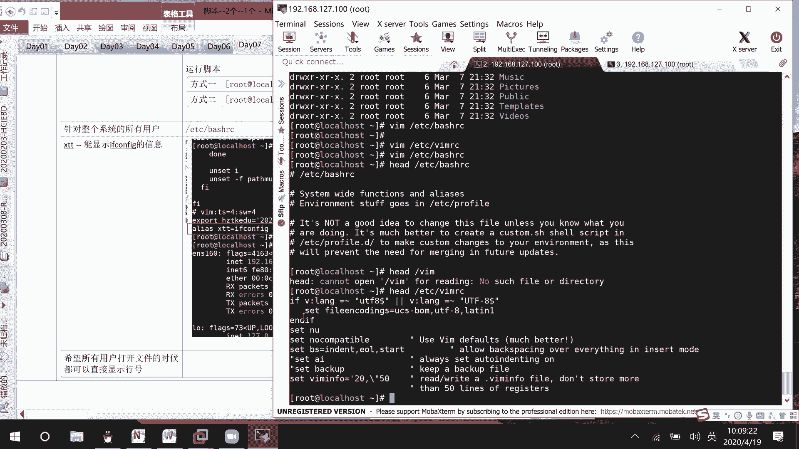

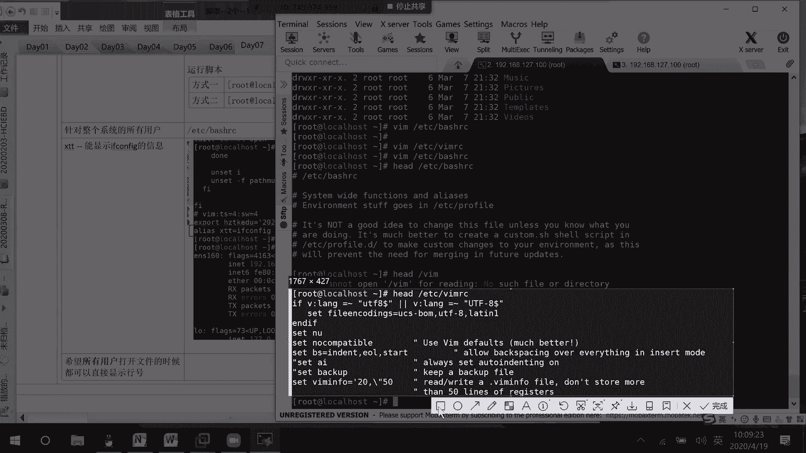

### 位置变量

在脚本执行时，可以通过位置变量来获取传递给脚本的参数。

*   `$0` 代表脚本本身的名称。
*   `$1` 代表第一个参数。
*   `$2` 代表第二个参数，依此类推。
*   `$#` 代表传递给脚本的参数总数。
*   `$*` 代表所有参数的值。

以下是一个示例脚本 `s02.sh`：

```bash
#!/bin/bash
echo "脚本名: $0"
echo "第一个参数: $1"
echo "第二个参数: $2"
```

执行脚本：
```bash
./s02.sh hello bye
```

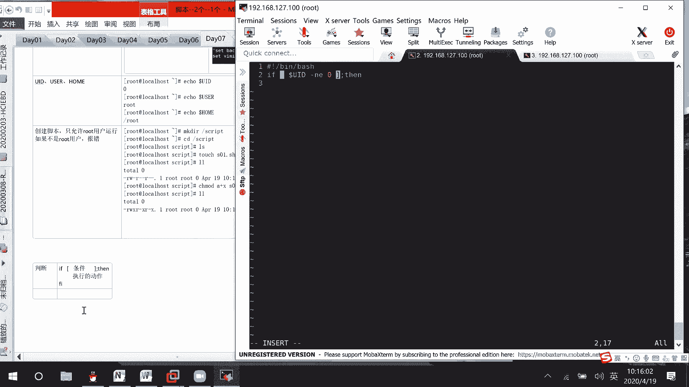

### 特殊变量

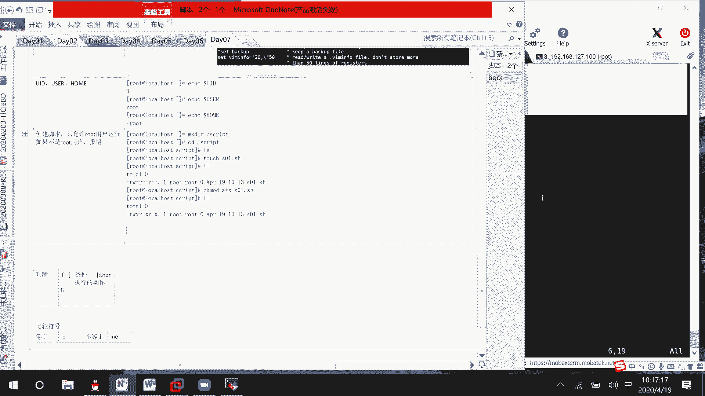

`$?` 是一个特殊的变量，用于获取上一条命令的退出状态。

*   如果返回值为 `0`，表示上一条命令执行成功。
*   如果返回值为非 `0`，表示上一条命令执行失败。

```bash
ping -c 1 192.168.1.1
echo $?  # 如果通，输出0
ping -c 1 192.168.200.200
echo $?  # 如果不通，输出非0值
```

## 条件判断

上一节我们介绍了变量的使用，本节中我们来看看如何在脚本中进行条件判断。

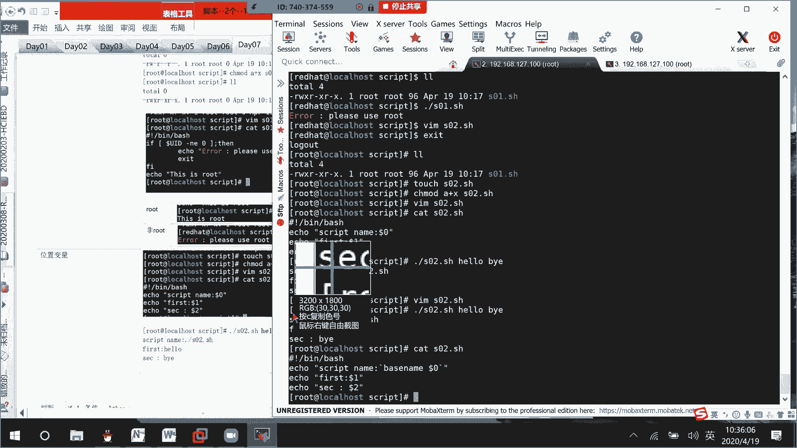

在Shell脚本中，条件判断通常使用 `if` 语句，其基本结构如下：

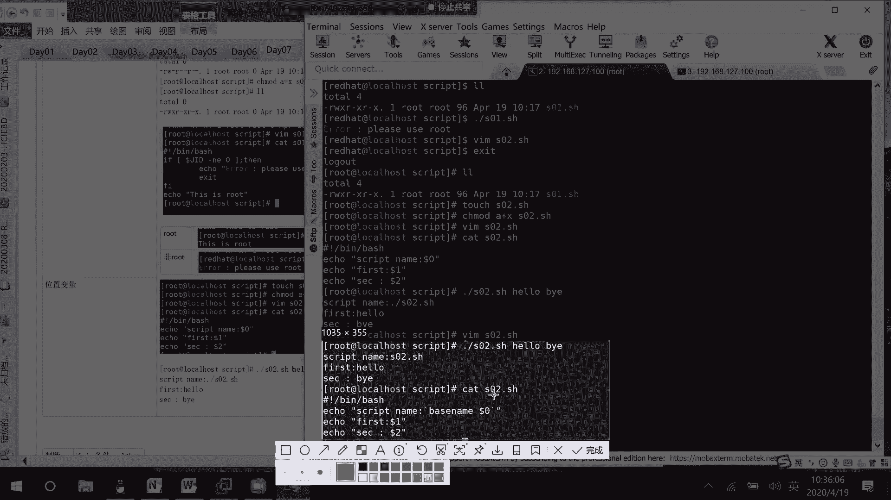

```bash
if [ 条件 ]
then
    # 条件为真时执行的命令
fi
```

### 比较运算符

以下是常用的比较运算符：

**数值比较：**
*   `-eq`：等于
*   `-ne`：不等于
*   `-gt`：大于
*   `-ge`：大于等于
*   `-lt`：小于
*   `-le`：小于等于

**字符串比较：**
*   `=`：等于
*   `!=`：不等于
*   `>`：大于（按字典顺序）
*   `<`：小于（按字典顺序）

**文件测试：**
*   `-e`：文件或目录是否存在
*   `-f`：是否为普通文件
*   `-d`：是否为目录
*   `-r`：是否可读
*   `-w`：是否可写
*   `-x`：是否可执行

### 逻辑连接符

可以使用逻辑连接符组合多个条件：

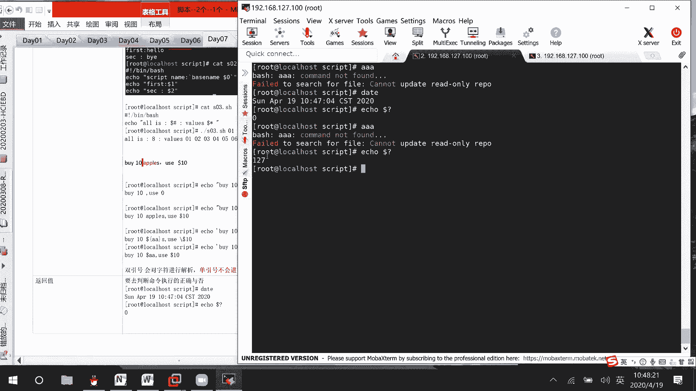

*   `&&` 或 `-a`：逻辑与（两个条件都为真时，整个条件为真）
*   `||` 或 `-o`：逻辑或（两个条件有一个为真时，整个条件为真）

```bash
if [ $a -eq 1 ] && [ $b -eq 2 ]
then
    echo "条件成立"
fi
```

### 多条件判断：if-elif-else

对于多个分支的条件判断，可以使用 `if-elif-else` 结构。

```bash
if [ 条件1 ]
then
    # 条件1为真时执行
elif [ 条件2 ]
then
    # 条件2为真时执行
else
    # 所有条件都不为真时执行
fi
```

以下是一个判断用户身份的示例脚本 `s01.sh`：

```bash
#!/bin/bash
if [ $UID -ne 0 ]
then
    echo "ERROR: Please use root user."
    exit
else
    echo "This is root."
fi
```

## 数值计算

上一节我们介绍了条件判断，本节中我们来看看如何在Shell中进行数值计算。

Shell默认将所有的值都视为字符串。要进行数值计算，需要使用特定的语法。

以下是几种常见的数值计算方法：

1.  **使用 `$(( ))`**
    ```bash
    aa=$((2+3))
    echo $aa  # 输出 5
    ```

2.  **使用 `expr` 命令**
    ```bash
    aa=`expr 2 + 3`  # 注意运算符两边的空格
    echo $aa  # 输出 5
    ```

3.  **使用 `let` 命令**
    ```bash
    let aa=2+3
    echo $aa  # 输出 5
    ```

4.  **使用 `declare -i` 声明整数变量**
    ```bash
    declare -i aa=2+3
    echo $aa  # 输出 5
    ```

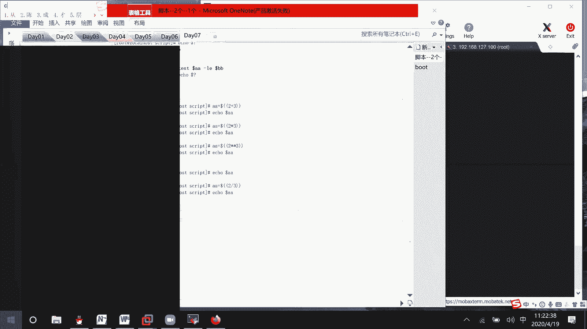

5.  **使用 `bc` 命令进行浮点数计算**
    ```bash
    # 计算 2/3，并保留2位小数
    echo "scale=2; 2/3" | bc  # 输出 .66
    ```

**注意**：在Shell中进行除法运算时，默认只保留整数部分。如果需要小数，请使用 `bc` 命令。

## 综合示例与用户输入

现在，我们将结合前面所学的知识，创建一个综合性的脚本示例。该脚本会提示用户输入考试成绩，并根据输入给出不同的反馈。

以下是一个示例脚本 `s05.sh`：

```bash
#!/bin/bash
# 提示用户输入成绩
echo "Input your score:"
read score

# 判断输入的成绩是否有效
if [ $score -gt 300 ] || [ $score -lt 0 ]
then
    echo "Input correct score (0-300)."
elif [ $score -le 300 ] && [ $score -ge 210 ]
then
    echo "Pass."
else
    echo "Fail."
fi
```

在这个脚本中：
*   `read score` 命令用于获取用户的输入，并将其存储在变量 `score` 中。
*   第一个 `if` 判断成绩是否超出有效范围（0-300）。
*   `elif` 判断成绩是否在210到300之间（含），如果是，则输出“Pass”。
*   如果以上条件都不满足，则执行 `else` 部分，输出“Fail”。

执行脚本并测试：
```bash
chmod +x s05.sh
./s05.sh
# 输入 280，输出 Pass
# 输入 150，输出 Fail
# 输入 350，输出 Input correct score (0-300).
```

## 总结

本节课中我们一起学习了Shell脚本编程的基础知识。

我们首先介绍了**变量**，包括本地变量和环境变量的定义、赋值和引用方法，以及位置变量和特殊变量 `$?` 的用法。

接着，我们学习了**条件判断**，掌握了 `if`、`if-else`、`if-elif-else` 等判断结构，以及数值、字符串和文件测试的各种比较运算符和逻辑连接符。

然后，我们探讨了在Shell中进行**数值计算**的几种方法，特别是如何处理整数和浮点数运算。

最后，我们通过一个综合示例，演示了如何结合 `read` 命令获取用户输入，并利用条件判断结构编写一个简单的交互式脚本。

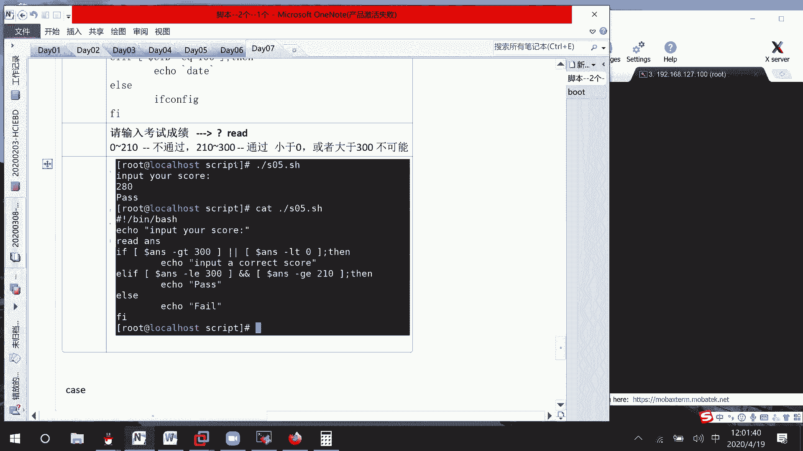

掌握这些基础知识是编写更复杂Shell脚本的前提。在后续的课程中，我们将学习循环、case语句等更高级的脚本编程技巧。